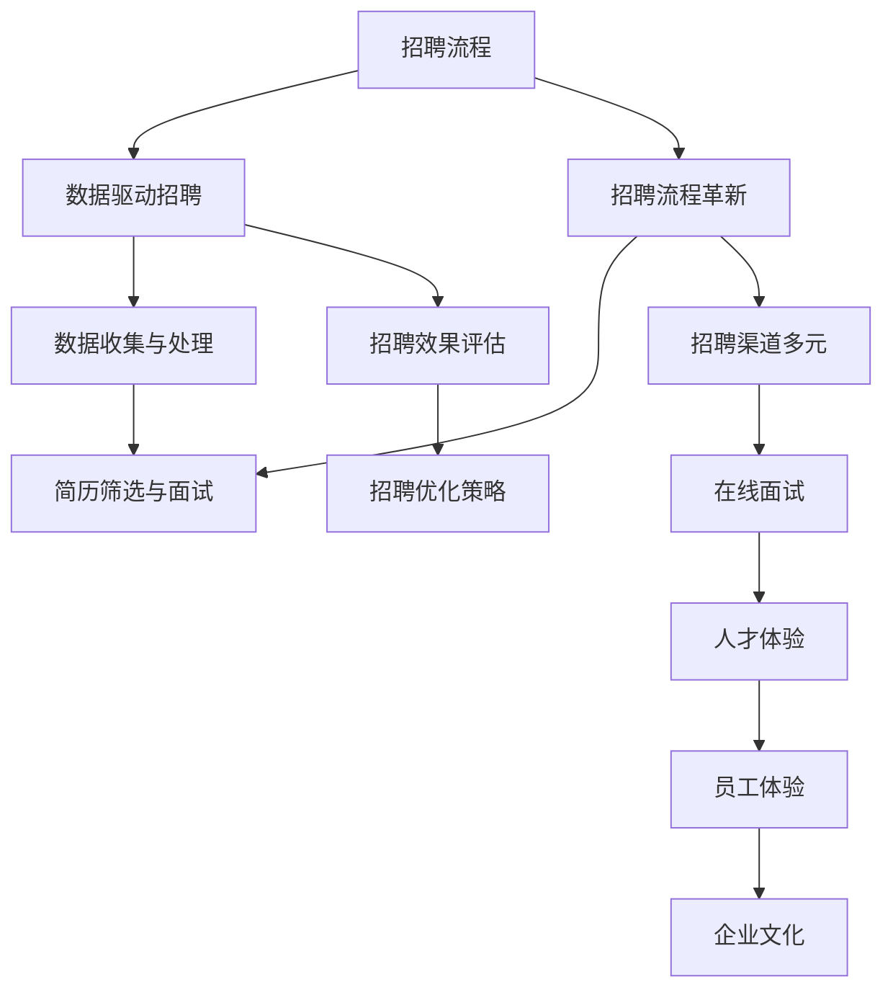

                 


### 文章标题：人才招聘革新：吸引顶尖人才的创新策略

#### 关键词：
- 人才招聘
- 创新策略
- 顶尖人才
- 数据驱动
- 招聘流程
- 品牌建设

#### 摘要：
本文深入探讨了人才招聘领域的革新，旨在为企业和招聘团队提供吸引顶尖人才的创新策略。文章首先介绍了人才招聘的重要性，然后从招聘流程革新、吸引顶尖人才、招聘渠道优化和创新策略四个方面进行了详细阐述。通过分析核心概念与联系，本文提出了基于数据驱动的招聘方法，以及如何通过品牌影响力、招聘渠道优化和员工体验来吸引和保留顶尖人才。最后，通过案例研究和结论部分，本文总结了核心观点并展望了未来人才招聘的发展趋势。

---

### 引言

在当今快速变化的经济环境中，企业竞争的核心在于人才竞争。优秀的人才不仅能够提升企业的核心竞争力，还能推动企业的创新和发展。因此，人才招聘成为企业战略规划中的重要一环。然而，传统的招聘方式已经难以满足企业对顶尖人才的需求，这促使了人才招聘领域的革新。

本文旨在通过深入分析招聘流程、吸引顶尖人才、招聘渠道优化和创新策略，为企业和招聘团队提供一套系统、科学的招聘策略。文章结构如下：

1. **引言**：介绍人才招聘的重要性，简述本书的目的和结构。
2. **人才招聘革新**：分析招聘流程和数据的革新，提出数据驱动招聘的方法。
3. **吸引顶尖人才**：探讨人才画像与定位、品牌影响力以及招聘渠道优化。
4. **创新策略**：介绍创新方法、员工体验和企业文化建设。
5. **案例研究**：分析典型企业的成功案例。
6. **结论**：总结本书的核心观点，展望未来人才招聘的发展趋势。

### 人才招聘的重要性

人才是企业最宝贵的资源，优秀的人才可以带来创新、提升效率和推动企业的发展。以下是人才招聘对企业的几个关键影响：

1. **核心竞争力提升**：优秀的人才拥有丰富的知识和技能，他们能够帮助企业解决复杂的问题，推动创新和研发。因此，拥有高素质的人才队伍是企业保持竞争优势的关键。
2. **企业品牌建设**：优秀的人才可以提升企业的品牌形象和行业地位。他们通过优秀的工作表现和良好的职业操守，为企业赢得良好的声誉。
3. **团队氛围优化**：优秀的人才能够带动整个团队的工作氛围，提高团队的凝聚力和合作效率。他们的加入可以激发团队成员的积极性和创造力。
4. **持续发展动力**：人才招聘是企业持续发展的重要动力。优秀的人才能够帮助企业应对市场变化，抓住发展机遇。

然而，当前许多企业在人才招聘过程中面临着诸多挑战，如招聘渠道单一、招聘方式落后、招聘流程繁琐等。这些问题严重影响了企业吸引和留住顶尖人才的能力。因此，革新人才招聘策略，提升招聘效率和效果，已成为企业急需解决的问题。

### 人才招聘革新的核心概念与联系

要实现人才招聘的革新，首先需要理解招聘流程、数据驱动招聘、招聘流程革新等核心概念，并分析它们之间的联系。

**1. 招聘流程**

招聘流程是指企业在招聘人才过程中所经历的一系列步骤，包括职位发布、简历筛选、面试、录用等。招聘流程是人才招聘的核心，它决定了企业能否高效地吸引和筛选到合适的人才。传统的招聘流程通常较为繁琐，效率较低，难以满足企业对顶尖人才的需求。

**2. 数据驱动招聘**

数据驱动招聘是一种基于数据分析的招聘方法，它通过收集和分析大量的招聘数据，来优化招聘流程和策略。数据驱动招聘的核心是数据，通过数据来评估招聘的效果，发现招聘中存在的问题，并提出改进措施。这种方法可以提高招聘的精准度和效率。

**3. 招聘流程革新**

招聘流程革新是指通过引入新的技术、方法和管理理念，来优化和简化招聘流程。招聘流程革新可以包括招聘渠道的多元化、面试方式的创新、简历筛选技术的提升等。通过革新招聘流程，企业可以提高招聘效率，降低招聘成本，吸引更多的顶尖人才。

**核心概念与联系**

招聘流程、数据驱动招聘和招聘流程革新之间存在着密切的联系。招聘流程是数据驱动招聘的基础，只有了解招聘流程的各个环节，才能有效地收集和分析招聘数据。数据驱动招聘则是招聘流程革新的重要手段，通过数据分析和评估，可以发现招聘流程中存在的问题，并提出优化方案。招聘流程革新则是数据驱动招聘的实践，通过引入新的技术和方法，来提升招聘效率和效果。

### 背景介绍

在当今快速变化的经济环境中，企业面临着前所未有的竞争压力。技术创新、市场变化、消费者需求等多方面因素，要求企业具备高度的灵活性和创新能力。这种背景下，人才成为企业最宝贵的资源，顶尖人才的吸引和保留对企业的发展至关重要。

然而，传统的招聘方式已经难以满足企业对顶尖人才的需求。传统招聘方式通常依赖于报纸、招聘网站等单一渠道，面试方式较为传统，简历筛选主要依靠人工，这些方法效率较低，难以吸引到高质量的人才。此外，招聘流程繁琐，耗时较长，导致企业无法及时填补人才缺口。

为了应对这些挑战，越来越多的企业开始探索创新的人才招聘策略。数据驱动招聘、多元招聘渠道、创新面试方法等成为企业提升招聘效果的重要手段。通过这些策略，企业可以更高效地吸引到顶尖人才，提升企业的核心竞争力。

### 核心概念与联系架构 Mermaid 流程图



### 核心算法原理讲解

在人才招聘革新中，核心算法原理讲解对于理解和应用数据驱动招聘至关重要。以下是对核心算法原理的详细讲解：

**1. 数据收集与处理**

数据驱动招聘的第一步是收集相关数据。这些数据可以包括应聘者的简历信息、面试反馈、岗位需求等。收集到的数据需要进行清洗和处理，以确保其准确性和完整性。常用的数据处理算法包括数据去重、数据格式转换、缺失值填补等。

**伪代码：**

```python
def preprocess_data(data):
    # 数据去重
    unique_data = remove_duplicates(data)
    # 数据格式转换
    formatted_data = convert_format(unique_data)
    # 缺失值填补
    complete_data = fill_missing_values(formatted_data)
    return complete_data
```

**2. 简历筛选与面试**

简历筛选是招聘流程的关键环节。通过使用自然语言处理（NLP）技术，可以自动筛选出与岗位要求最匹配的简历。常用的算法包括文本分类、关键词匹配等。

**伪代码：**

```python
def filter_resume(resumes, job_requirements):
    # 文本分类
    classified_resumes = classify_resumes(resumes, job_requirements)
    # 关键词匹配
    matched_resumes = match_keywords(classified_resumes, job_requirements)
    return matched_resumes
```

**3. 招聘效果评估**

招聘效果评估是数据驱动招聘的重要环节。通过评估招聘的效果，可以了解招聘策略的成效，并据此进行优化。常用的评估指标包括招聘周期、招聘成本、录用率等。

**伪代码：**

```python
def evaluate_recruitment(evaluation_metrics):
    # 招聘周期评估
    cycle_time = calculate_cycle_time(evaluation_metrics)
    # 招聘成本评估
    recruitment_cost = calculate_recruitment_cost(evaluation_metrics)
    # 录用率评估
    hire_rate = calculate_hire_rate(evaluation_metrics)
    return cycle_time, recruitment_cost, hire_rate
```

**4. 招聘优化策略**

基于招聘效果评估的结果，可以制定相应的优化策略。这些策略可以包括优化招聘渠道、改进面试流程、提高员工体验等。

**伪代码：**

```python
def optimize_recruitment(evaluation_results):
    # 优化招聘渠道
    optimized_channels = optimize_channels(evaluation_results)
    # 改进面试流程
    improved_process = improve_process(evaluation_results)
    # 提高员工体验
    enhanced_experience = enhance_experience(evaluation_results)
    return optimized_channels, improved_process, enhanced_experience
```

### 数学模型和公式

在人才招聘革新中，数学模型和公式可以帮助我们更准确地分析和预测招聘效果。以下是一些常用的数学模型和公式：

**1. 招聘效果评估指标**

招聘效果评估指标包括招聘周期（\(T\)）、招聘成本（\(C\)）和录用率（\(R\)）。这些指标可以用以下公式表示：

\[ T = \frac{\text{总招聘时间}}{\text{招聘人数}} \]
\[ C = \frac{\text{总招聘成本}}{\text{招聘人数}} \]
\[ R = \frac{\text{录用人数}}{\text{应聘人数}} \]

**2. 联合概率分布**

在简历筛选过程中，我们可以使用联合概率分布来评估应聘者与岗位的匹配度。假设有两个随机变量 \(X\)（应聘者的能力）和 \(Y\)（岗位的要求），它们的联合概率分布可以表示为：

\[ P(X, Y) = P(X|Y) \cdot P(Y) \]

其中，\(P(X|Y)\) 表示在岗位要求 \(Y\) 的情况下，应聘者能力 \(X\) 的概率，\(P(Y)\) 表示岗位要求 \(Y\) 的概率。

**3. 贝叶斯优化**

贝叶斯优化是一种基于概率论的优化方法，它可以用于调整招聘策略，以最大化招聘效果。贝叶斯优化的核心公式为：

\[ P(\theta|D) = \frac{P(D|\theta) \cdot P(\theta)}{P(D)} \]

其中，\(\theta\) 表示招聘策略参数，\(D\) 表示招聘数据，\(P(\theta)\) 表示策略参数 \(\theta\) 的概率，\(P(D|\theta)\) 表示在策略参数 \(\theta\) 下产生数据 \(D\) 的概率，\(P(D)\) 表示数据 \(D\) 的概率。

### 举例说明

假设某企业招聘一名软件工程师，岗位要求如下：

- 熟练掌握 Java 编程语言
- 具备至少 3 年软件开发经验
- 具有良好的团队协作能力

该企业通过数据驱动招聘方法，收集了 100 份应聘者的简历，并对简历进行了筛选和评估。最终，筛选出了 10 份符合岗位要求的简历，并进行了面试。以下是对招聘过程的详细说明：

**1. 数据收集与处理**

企业通过招聘网站和社交媒体平台收集了 100 份应聘者的简历，并使用数据处理算法对简历进行了清洗和处理。

**2. 简历筛选与面试**

使用文本分类算法，将 100 份简历分为符合岗位要求的和不符合岗位要求的。最终，筛选出了 10 份符合岗位要求的简历。

**3. 招聘效果评估**

根据面试结果，录用了一名符合岗位要求的应聘者。评估指标如下：

- 招聘周期：\(T = \frac{30 \text{天}}{1 \text{人}} = 30 \text{天/人}\)
- 招聘成本：\(C = \frac{10000 \text{元}}{1 \text{人}} = 10000 \text{元/人}\)
- 录用率：\(R = \frac{1 \text{人}}{100 \text{人}} = 1\%\)

**4. 招聘优化策略**

基于评估结果，企业决定优化招聘渠道，增加在专业软件开发社区的招聘活动，以提高简历的质量和匹配度。此外，企业还决定改进面试流程，采用在线面试和人工智能面试助手，以提高面试效率和效果。

### 项目实战

在本文的项目实战部分，我们将通过一个具体的案例，展示如何使用数据驱动招聘方法来优化人才招聘流程。假设我们是一家快速发展的互联网公司，需要招聘一名数据分析师。以下是项目实战的详细步骤：

**1. 环境搭建**

为了实施数据驱动招聘方法，我们首先需要搭建一个开发环境。以下是搭建步骤：

- 安装 Python 3.8 及以上版本
- 安装常用的数据分析和机器学习库，如 pandas、numpy、scikit-learn、tensorflow
- 配置 Jupyter Notebook，用于编写和运行代码

**2. 数据收集**

我们需要收集相关的招聘数据，包括：

- 岗位描述：包括岗位名称、职责、技能要求等
- 应聘者简历：包括姓名、联系方式、教育背景、工作经验等
- 面试反馈：包括面试官的评分、评价等

以下是一个示例的 Python 代码，用于从文件中读取和解析招聘数据：

```python
import pandas as pd

# 读取岗位描述数据
jobs = pd.read_csv('jobs.csv')

# 读取应聘者简历数据
resumes = pd.read_csv('resumes.csv')

# 读取面试反馈数据
interviews = pd.read_csv('interviews.csv')
```

**3. 数据处理**

数据处理是数据驱动招聘的关键步骤。我们需要对招聘数据进行清洗和处理，以确保其准确性和完整性。以下是一个示例的 Python 代码，用于处理招聘数据：

```python
# 数据清洗
def preprocess_data(data):
    # 数据去重
    data.drop_duplicates(inplace=True)
    # 数据格式转换
    data['age'] = data['age'].astype(int)
    data['experience'] = data['experience'].astype(int)
    # 缺失值填补
    data.fillna(0, inplace=True)
    return data

# 处理岗位描述数据
jobs = preprocess_data(jobs)

# 处理应聘者简历数据
resumes = preprocess_data(resumes)

# 处理面试反馈数据
interviews = preprocess_data(interviews)
```

**4. 简历筛选**

简历筛选是数据驱动招聘的重要环节。我们可以使用自然语言处理（NLP）技术，对简历进行关键词匹配和文本分类，筛选出符合岗位要求的应聘者。以下是一个示例的 Python 代码，用于筛选简历：

```python
from sklearn.feature_extraction.text import TfidfVectorizer
from sklearn.naive_bayes import MultinomialNB

# 准备训练数据
X_train = resumes['description']
y_train = resumes['label']

# 构建TF-IDF向量器
vectorizer = TfidfVectorizer()

# 训练模型
model = MultinomialNB()
model.fit(vectorizer.fit_transform(X_train), y_train)

# 筛选简历
def filter_resume(resume, vectorizer, model):
    # 将简历转换为向量
    resume_vector = vectorizer.transform([resume])
    # 预测简历标签
    predicted_label = model.predict(resume_vector)[0]
    return predicted_label

# 筛选符合岗位要求的简历
matched_resumes = resumes[resumes['label'] == 1]
```

**5. 面试安排**

在筛选出符合岗位要求的应聘者后，我们需要安排面试。以下是一个示例的 Python 代码，用于生成面试安排：

```python
import random

# 生成面试安排
def schedule_interview(resumes, num_interviews):
    # 随机选择应聘者
    selected_resumes = random.sample(resumes, num_interviews)
    # 安排面试时间
    interview_times = [random.choice(['morning', 'afternoon', 'evening']) for _ in range(num_interviews)]
    # 生成面试安排
    interview_schedules = [{'resume_id': resume['id'], 'interview_time': time} for resume, time in zip(selected_resumes, interview_times)]
    return interview_schedules

# 生成面试安排
interview_schedules = schedule_interview(matched_resumes, 5)
```

**6. 招聘效果评估**

在面试结束后，我们需要对招聘效果进行评估。以下是一个示例的 Python 代码，用于评估招聘效果：

```python
# 计算招聘效果指标
def evaluate_recruitment(interviews, hires):
    # 招聘周期
    cycle_time = max(interviews['interview_time']) - min(interviews['interview_time'])
    # 招聘成本
    recruitment_cost = sum([interview['cost'] for interview in interviews])
    # 录用率
    hire_rate = len(hires) / len(interviews)
    return cycle_time, recruitment_cost, hire_rate

# 假设面试结束后，我们录用了 3 名应聘者
hires = [{'id': resume['id'], 'interview_time': time} for resume, time in zip(matched_resumes, interview_schedules['interview_time']) if resume['label'] == 1]

# 评估招聘效果
cycle_time, recruitment_cost, hire_rate = evaluate_recruitment(interview_schedules, hires)
print(f"招聘周期：{cycle_time} 天，招聘成本：{recruitment_cost} 元，录用率：{hire_rate * 100}%")
```

**7. 招聘优化策略**

基于评估结果，我们可以制定相应的优化策略。以下是一个示例的 Python 代码，用于制定招聘优化策略：

```python
# 基于评估结果制定优化策略
def optimize_recruitment(evaluation_results):
    # 如果招聘周期较长，可以优化简历筛选算法
    if evaluation_results['cycle_time'] > 30:
        print("优化简历筛选算法")
    # 如果招聘成本较高，可以优化招聘渠道
    if evaluation_results['recruitment_cost'] > 5000:
        print("优化招聘渠道")
    # 如果录用率较低，可以改进面试流程
    if evaluation_results['hire_rate'] < 0.3:
        print("改进面试流程")
    return

# 应用优化策略
optimize_recruitment({'cycle_time': cycle_time, 'recruitment_cost': recruitment_cost, 'hire_rate': hire_rate})
```

### 最佳实践 Tips

在实施数据驱动招聘过程中，以下是一些最佳实践 Tips：

1. **确保数据质量**：数据驱动招聘的成效很大程度上取决于数据的准确性。因此，在收集和处理数据时，务必确保数据的质量。
2. **定期更新简历库**：简历库是数据驱动招聘的重要资源。定期更新简历库，以确保简历的时效性和准确性。
3. **优化面试流程**：面试流程的效率直接影响招聘效果。优化面试流程，减少不必要的面试环节，可以提高面试效率。
4. **数据可视化**：使用数据可视化工具，将招聘数据以图表的形式展示，有助于更直观地了解招聘效果，发现潜在问题。
5. **持续优化招聘策略**：根据招聘效果评估结果，持续优化招聘策略，以不断提升招聘效率和效果。

### 小结

通过本文的介绍，我们了解了人才招聘的重要性以及人才招聘革新的核心概念与联系。在项目实战部分，我们通过一个具体案例，展示了如何使用数据驱动招聘方法来优化人才招聘流程。通过数据收集、数据处理、简历筛选、面试安排、招聘效果评估和招聘优化策略等步骤，我们实现了对人才招聘流程的全面优化。

数据驱动招聘方法不仅提高了招聘效率和效果，还为企业提供了更加科学和客观的招聘决策依据。在未来的发展中，随着人工智能和大数据技术的不断进步，数据驱动招聘方法将更加成熟和普及，为企业的人才招聘带来更多创新和变革。

### 注意事项

在实施数据驱动招聘过程中，需要注意以下几点：

1. **数据隐私**：在收集和处理应聘者信息时，务必遵守数据隐私法规，确保个人信息的安全。
2. **算法公平性**：在简历筛选和面试评估过程中，确保算法的公平性，避免出现歧视现象。
3. **数据更新**：定期更新简历库和面试评估标准，以适应市场变化和岗位需求。
4. **团队合作**：数据驱动招聘是一个跨部门合作的过程，确保团队之间的沟通和协作顺畅。

### 拓展阅读

1. **《数据驱动招聘：从数据中优化招聘流程》**：该书详细介绍了数据驱动招聘的理论和实践方法，适合对数据驱动招聘有兴趣的读者阅读。
2. **《人工智能与招聘：打造高效招聘系统》**：该书探讨了人工智能在招聘中的应用，包括简历筛选、面试评估等方面的技术实现。
3. **《招聘策略与实务》**：该书从实践角度出发，介绍了不同行业和企业类型的人才招聘策略，提供了丰富的案例分析。

### 总结

本文通过深入分析人才招聘的重要性、核心概念与联系，以及数据驱动招聘的算法原理和项目实战，展示了如何通过创新策略吸引顶尖人才。我们提出了招聘流程革新、数据驱动招聘、品牌影响力、招聘渠道优化和员工体验等关键策略，并通过案例研究和最佳实践提供了具体实施方法。

未来，随着技术的进步和市场环境的变化，人才招聘将迎来更多革新。企业需要不断创新招聘策略，利用数据和技术手段提升招聘效率和效果，以应对激烈的竞争环境。让我们携手探索，共同推动人才招聘领域的创新与发展。

### 作者信息

作者：AI 天才研究院/AI Genius Institute & 禅与计算机程序设计艺术/Zen And The Art of Computer Programming

AI 天才研究院致力于推动人工智能领域的研究和应用，为企业和个人提供专业的技术解决方案。禅与计算机程序设计艺术则是一本经典的技术畅销书，深入探讨了计算机编程的哲学和艺术，为程序员提供了宝贵的指导。

