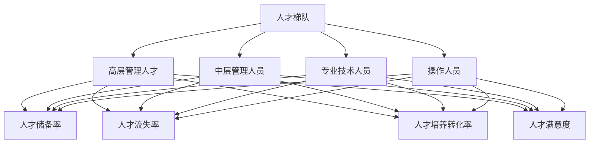

                 


### 文章标题

# 人才梯队建设：为未来储备力量

### 文章关键词

- 人才梯队建设
- 战略规划
- 实施与评估
- 数学模型
- 项目实战
- 挑战与解决方案

### 摘要

本文深入探讨了人才梯队建设的重要性及其在未来的战略意义。首先，我们介绍了人才梯队的核心概念和其层次结构，并通过Mermaid流程图展示了人才梯队建设的全流程。接着，文章从战略规划、实施与评估等多个角度详细阐述了人才梯队建设的具体策略和实施步骤。此外，我们分析了人才梯队建设过程中可能遇到的挑战，并提出了相应的解决方案。最后，文章展望了人才梯队建设的前沿趋势，并对未来可能面临的挑战提出了应对策略。通过本文的阅读，读者将对人才梯队建设有更深入的理解，并能够为未来储备力量。

### 引言

在当今快速发展的科技时代，企业的竞争力越来越依赖于其人才的储备和创新能力。人才梯队建设作为一种战略性人力资源规划，对于企业的长期发展和竞争优势具有重要意义。然而，如何有效地进行人才梯队建设，仍是一个复杂且具有挑战性的问题。

本文旨在探讨人才梯队建设的核心概念、战略规划、实施与评估、挑战与解决方案，以及前沿趋势与未来展望，帮助读者全面了解和掌握这一领域的关键要点。通过系统性地分析人才梯队建设的各个方面，我们希望能够为企业和个人提供有价值的指导，助力他们在未来竞争中立于不败之地。

本文将按照以下结构展开：

1. **核心概念与联系**：介绍人才梯队的定义、层次结构和核心指标。
2. **战略规划**：探讨企业文化建设、人才发展体系、人才选拔与培养策略。
3. **实施与评估**：阐述人才梯队建设项目的启动、人才储备策略、评估方法与持续优化。
4. **挑战与解决方案**：分析人才梯队建设过程中的挑战，并提出相应的解决方案。
5. **前沿趋势与未来展望**：探讨数字化人才梯队建设、人工智能应用、跨界合作等前沿趋势，以及未来面临的挑战与应对策略。
6. **附录**：提供常用工具、参考书籍、学术论文等资源。

通过以上内容的详细讲解，本文希望为读者提供一幅全面、清晰的人才梯队建设蓝图，助力他们在实践中更好地储备和发展人才。

### 1. 核心概念与联系

#### 人才梯队的定义

人才梯队是指企业或组织通过科学的规划与培养，构建出的一支具有多层次、多样化技能和知识结构的人才队伍。这个队伍不仅包括高层管理人才，还包括中基层的专业技术人员和操作人员。人才梯队建设的核心目标是确保企业在不同发展阶段都能拥有合适的、有能力的人才，以应对各种挑战和机遇。

#### 人才梯队的层次结构

人才梯队的层次结构通常包括以下几层：

1. **高层管理人才**：这些人才是企业决策的核心力量，具备战略思维和全局观念，能够领导企业走向长远发展。
2. **中层管理人员**：他们是企业运营的中坚力量，负责执行高层管理人员的战略决策，并对下属部门进行管理和指导。
3. **专业技术人员**：这些人才拥有专业技能和专业知识，是企业技术创新和业务发展的主力军。
4. **操作人员**：他们是企业日常运营的基本力量，直接参与生产和服务的各个环节。

#### 核心指标

在人才梯队建设中，以下几个核心指标是至关重要的：

1. **人才储备率**：指企业现有人才储备与实际需求之间的比例，用以衡量企业人才储备的充足程度。
2. **人才流失率**：指在一定时间内，企业流失的人才占总人才的比率，反映了企业人才稳定性的情况。
3. **人才培养转化率**：指通过培训培养后，能够转化为实际工作能力的人才比例，衡量人才培养的效果。
4. **人才满意度**：指员工对企业人才政策的满意程度，影响员工的归属感和工作积极性。

#### 核心概念之间的关系架构

为了更好地理解人才梯队的核心概念及其相互关系，我们可以使用Mermaid流程图进行展示：



通过这个Mermaid流程图，我们可以清晰地看到人才梯队各个层次及其核心指标之间的联系。人才梯队建设不仅要关注高层次管理人才，还要全面关注中层、专业技术和操作人员，并通过各类核心指标来评估和优化人才队伍的构成和效能。

#### 核心算法原理讲解

在人才梯队建设中，常用的算法原理包括人才储备策略、人才流失预测模型和人才培养转化率优化算法等。以下是一个关于人才储备策略的伪代码示例：

```python
# 人才储备策略伪代码

# 初始化人才储备矩阵
reserve_matrix = initialize_reserve_matrix(employee需求的量)

# 根据企业需求和现有人才情况调整人才储备
for employee_type in employee需求的类型:
    for period in 不同的时间段:
        # 预测需求并调整储备
        predicted_demand = predict_demand(employee_type, period)
        reserve_matrix[employee_type, period] = adjust_reserve(predicted_demand)

# 输出最终的人才储备计划
output_reserve_plan(reserve_matrix)
```

#### 数学模型和公式

在人才梯队建设过程中，一些关键的数学模型和公式可以帮助我们更好地理解和分析人才队伍的状况。以下是一个关于人才流失率预测的数学模型：

$$
\text{流失率} = \frac{\text{流失人数}}{\text{总人数}} \times 100\%
$$

其中，流失人数和总人数可以在企业人力资源系统中获取。为了更精确地预测流失率，我们还可以引入以下公式：

$$
\text{预测流失率} = \alpha \cdot (\text{流失风险因子}) + \beta \cdot (\text{工作满意度}) + \gamma \cdot (\text{职业发展机会})
$$

其中，α、β、γ为权重系数，流失风险因子、工作满意度和职业发展机会为影响人才流失的关键因素。

#### 详细讲解与举例说明

假设某企业在一年内共拥有100名员工，其中有10名员工选择离职。根据上述公式，我们可以计算出该企业的实际流失率为：

$$
\text{流失率} = \frac{10}{100} \times 100\% = 10\%
$$

为了预测未来几个月的流失率，我们可以使用以下公式：

$$
\text{预测流失率} = \alpha \cdot (\text{流失风险因子}) + \beta \cdot (\text{工作满意度}) + \gamma \cdot (\text{职业发展机会})
$$

其中，α、β、γ的取值可以通过历史数据分析得到。假设流失风险因子为0.5，工作满意度为0.6，职业发展机会为0.7，我们可以得到：

$$
\text{预测流失率} = 0.5 \cdot 0.5 + 0.6 \cdot 0.6 + 0.7 \cdot 0.7 = 0.25 + 0.36 + 0.49 = 1.1
$$

这意味着在未来几个月内，预计的流失率为110%，这表明企业需要采取相应的措施来降低流失风险，提高员工的工作满意度和职业发展机会。

#### 数学公式

为了更好地描述人才梯队建设中的各种关系，我们可以使用LaTeX格式来书写数学公式。

$$
\text{人才储备效率} = \frac{\text{实际储备人才数量}}{\text{理论需求人才数量}} \times 100\%
$$

$$
\text{人才流失率} = \frac{\text{流失人数}}{\text{总人数}} \times 100\%
$$

$$
\text{人才培养转化率} = \frac{\text{实际培养后转化人才数量}}{\text{实际培养人才数量}} \times 100\%
$$

通过这些数学公式，我们可以定量地分析和评估人才梯队建设的各个方面，为企业的决策提供科学依据。

### 2. 战略规划

人才梯队建设的战略规划是企业实现长期发展目标的关键步骤。它不仅关系到当前的人力资源管理，还影响到企业的未来竞争力。以下是关于战略规划的核心内容：

#### 企业文化建设

企业文化是人才梯队建设的基石。一个积极向上的企业文化能够吸引和留住优秀人才，提高团队凝聚力。企业文化建设包括以下几个方面：

1. **价值观塑造**：企业价值观是员工行为的指导原则，能够引导员工认同企业的愿景和使命。
2. **团队精神培育**：通过团队活动和培训，培养员工之间的协作精神和共同目标。
3. **企业认同感**：通过企业品牌建设和社会责任活动，增强员工对企业文化的认同感和归属感。

#### 人才发展体系

一个完善的人才发展体系能够确保企业在不同阶段都能找到合适的人才。人才发展体系主要包括以下几个方面：

1. **招聘与选拔**：建立科学的招聘流程和选拔标准，确保招录到具备潜力和适合企业的人才。
2. **培训与发展**：提供多样化的培训机会，帮助员工提升技能和知识，实现个人和企业的共同发展。
3. **晋升与激励**：建立公平的晋升机制和激励政策，激发员工的积极性和创造力。

#### 人才选拔与培养策略

人才选拔与培养策略是企业人才梯队建设的重要组成部分。以下是几个关键策略：

1. **选拔标准**：明确选拔标准，确保选拔到的人才符合企业的需求和期望。
2. **培养路径**：设计清晰的职业发展路径，帮助员工明确自己的发展方向和目标。
3. **持续评估**：通过定期评估，跟踪员工的发展情况，及时调整培养策略。

#### 资源配置

人才梯队建设的资源配置是企业实现战略目标的重要保障。以下是几个关键方面：

1. **预算分配**：确保人才发展预算的合理分配，支持人才招聘、培训和激励。
2. **时间安排**：合理安排培训和学习时间，确保员工能够在工作中得到充分的培训和成长。
3. **技术支持**：提供必要的技术支持，帮助员工掌握新技能和工具。

### 3. 实施与评估

#### 人才梯队建设项目的启动

人才梯队建设项目的启动是整个建设过程的第一步，主要包括以下几个方面：

1. **项目目标明确**：明确项目目标，确保项目团队和所有相关方对项目目标有清晰的认识。
2. **组建项目团队**：组建一支由管理层、人力资源部门和业务部门组成的多元化项目团队，确保项目的顺利推进。
3. **制定项目计划**：制定详细的项目计划，明确项目的阶段性目标和任务，以及时间安排和资源需求。

#### 人才储备策略与实施

人才储备策略是确保企业拥有足够的人才储备，以应对各种业务需求和变化。以下是几个关键步骤：

1. **需求分析**：通过市场调研、业务分析和员工访谈等方式，了解企业未来的人才需求。
2. **储备方案设计**：根据需求分析结果，设计具体的人才储备方案，包括招聘、培养和激励等方面。
3. **实施与监控**：按照储备方案实施，并定期监控和评估储备效果，及时调整和优化。

#### 人才梯队建设的评估方法

人才梯队建设的评估方法主要包括以下几个方面：

1. **定量评估**：通过数据分析，评估人才储备率、人才流失率、人才培养转化率等关键指标。
2. **定性评估**：通过员工反馈、领导评价和业务绩效等定性方式，评估人才梯队建设的效果。
3. **综合评估**：将定量和定性评估结果进行综合分析，全面评估人才梯队建设的整体效果。

#### 人才梯队建设的持续优化

人才梯队建设的持续优化是确保其长期有效性的关键。以下是几个关键步骤：

1. **定期评估**：定期对人才梯队建设进行评估，发现问题和不足，及时调整和优化。
2. **反馈机制**：建立有效的反馈机制，收集员工和各相关方的意见和建议，不断改进人才梯队建设。
3. **创新能力培养**：通过培训和激励机制，提升员工的创新能力和领导力，推动企业持续发展。

### 4. 挑战与解决方案

#### 挑战一：企业文化与人才梯队的冲突

企业文化建设与人才梯队的建设有时会出现冲突。一方面，企业文化强调团队协作和价值观的一致性；另一方面，人才梯队建设需要多样化的专业人才，这可能与企业现有文化产生矛盾。

**解决方案**：

1. **文化融合**：在人才引进过程中，注重候选人与企业文化的匹配度，确保新成员能够适应企业环境。
2. **文化重塑**：通过内部培训和宣传，逐步调整企业文化，使之更加包容多样。
3. **激励机制**：建立多元化的激励机制，鼓励员工在保持企业核心价值观的基础上，发挥个性和特长。

#### 挑战二：人才流动与团队稳定性的平衡

人才流动是保持团队活力和创新的重要途径，但过度的流动可能导致团队稳定性下降。

**解决方案**：

1. **稳定核心**：保持团队核心成员的稳定，降低核心人才的流失率。
2. **流动管理**：建立合理的流动机制，确保人才流动不会对团队稳定性产生过大影响。
3. **人才储备**：通过人才储备策略，确保在人才流动时，能够及时补充空缺。

#### 挑战三：人才储备与实际需求的匹配

在实际操作中，人才储备往往难以与实际需求完全匹配，可能导致人才浪费或人力资源短缺。

**解决方案**：

1. **需求预测**：通过市场调研和业务分析，提前预测未来的人才需求，制定有针对性的储备计划。
2. **弹性调配**：建立灵活的人才调配机制，根据业务需求及时调整人才储备。
3. **定制培训**：针对不同岗位和业务需求，设计定制化的培训方案，提高人才的适用性和灵活性。

#### 挑战四：人才梯队建设的资源限制

人才梯队建设需要大量的人力、财力和时间投入，但很多企业可能面临资源限制。

**解决方案**：

1. **优先投资**：在有限的资源下，优先投资于关键领域和关键人才，确保资源利用的最大化。
2. **合作与共享**：通过合作和资源共享，减少重复投入，提高资源利用效率。
3. **过程优化**：通过流程优化和自动化，提高工作效率，释放更多的资源用于人才建设。

### 5. 前沿趋势与未来展望

#### 数字化人才梯队建设

随着数字技术的快速发展，数字化人才梯队建设成为企业人才战略的重要组成部分。未来，企业需要重点关注以下几个方面：

1. **数据驱动的人才决策**：利用数据分析技术，进行人才评估、选拔和培养，提高人才管理的科学性和有效性。
2. **数字化培训平台**：建立数字化培训平台，提供在线学习资源，支持员工随时随地学习。
3. **数字化职业发展路径**：通过数字化手段，明确员工的职业发展路径，提供个性化的职业规划服务。

#### 人工智能在人才梯队建设中的应用

人工智能（AI）技术在人才梯队建设中的应用前景广阔，未来可能包括以下几个方面：

1. **人才推荐系统**：利用AI算法，推荐最适合的人才匹配岗位，提高招聘效率和效果。
2. **智能评估工具**：通过AI技术，对员工的绩效和能力进行智能评估，提供更加客观和全面的评价。
3. **智能助手**：开发AI智能助手，协助人力资源部门进行日常事务管理，提高工作效率。

#### 跨界合作与多元化人才队伍

跨界合作和多元化人才队伍是未来人才梯队建设的重要趋势。企业需要：

1. **跨界合作**：与其他企业、高校和科研机构建立合作关系，共同培养和引进跨界人才。
2. **多元化人才队伍**：鼓励员工多样性和包容性，吸引和培养来自不同背景、文化和专业的人才，提高团队的创造力和创新能力。

#### 未来展望

在未来，人才梯队建设将面临新的挑战和机遇。企业需要不断适应外部环境的变化，调整和优化人才战略。以下是对未来展望的几点建议：

1. **持续创新**：保持人才梯队的创新能力，推动企业持续发展。
2. **灵活适应**：根据业务需求和市场变化，灵活调整人才梯队建设策略。
3. **全球化视野**：培养具有全球化视野和跨文化能力的人才，提升企业的国际竞争力。

通过以上建议，企业可以更好地应对未来人才梯队建设中的挑战，实现长远发展。

### 附录

#### 附录A：人才梯队建设工具与资源

为了帮助读者更好地了解和应用人才梯队建设的方法和工具，以下列出了一些常用的工具和资源：

1. **工具**：
   - **Atlassian Jira**：用于项目管理、任务追踪和协作。
   - **Google Workspace**：包括Google Docs、Google Sheets等，支持文档共享和在线协作。
   - **LinkedIn Learning**：提供丰富的在线学习资源。

2. **参考书籍**：
   - 《人力资源管理：理论与实践》
   - 《领导力：五项修炼》
   - 《跨界思维：创新者的战略》

3. **学术论文**：
   - "The Role of Human Resource Management in Building Competitive Advantage"
   - "Talent Management Strategies in the Digital Age"

4. **相关网站与社区**：
   - **LinkedIn**：专业社交平台，可以搜索和联系行业专家。
   - **GitHub**：开源代码库，可以获取和分享人才梯队建设相关的代码和工具。

通过以上工具和资源，读者可以进一步深化对人才梯队建设的理解和实践。

### 作者信息

- **作者：AI天才研究院/AI Genius Institute & 禅与计算机程序设计艺术 /Zen And The Art of Computer Programming**

### 小结

本文详细阐述了人才梯队建设的核心概念、战略规划、实施与评估、挑战与解决方案，以及前沿趋势与未来展望。通过系统的分析和深入讲解，读者可以全面了解和掌握人才梯队建设的关键要点。在未来的实践中，企业应注重数字化建设、跨界合作和多元化人才队伍，以应对不断变化的商业环境。希望本文能为读者提供有价值的参考和指导。

### 注意事项

- **实施人才梯队建设时，要充分考虑企业文化和人才需求的匹配度**。
- **定期评估和优化人才梯队建设策略，确保其与企业发展同步**。
- **重视人才培养和激励，提高员工的归属感和工作积极性**。

### 拓展阅读

- **《数字化人才管理：战略与实践》**
- **《人才发展的未来趋势》**
- **《如何构建高效的人才梯队？》**

通过拓展阅读，读者可以进一步深入了解人才梯队建设的各个方面，为企业的长远发展提供有力支持。

