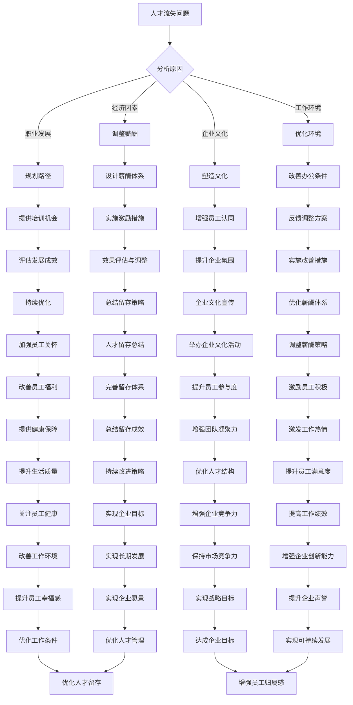

                 

### 文章标题

《人才留存策略：如何留住核心员工》

### 关键词

人才留存、核心员工、薪酬激励、职业发展、工作环境、企业文化、策略分析

### 摘要

本文深入探讨人才留存策略，旨在揭示如何有效留住企业核心员工。通过对人才流失成因、核心员工特点与价值、留存战略意义以及留存策略与方法等内容的详细分析，本文提出了包括薪酬激励、职业发展机会、工作环境优化和企业文化塑造等多维度的留存策略。同时，通过实际案例研究和未来趋势分析，本文为企业和HR管理者提供了系统的人才留存策略指南，以助力企业长期发展。

# 人才留存策略：如何留住核心员工

在当今竞争激烈的市场环境中，人才是企业发展的核心资源。然而，人才流失问题却成为企业普遍面临的挑战。本文旨在通过系统分析人才留存策略，提供一种有效留住核心员工的方法。文章分为三个主要部分：第一部分讨论人才留存的重要性，包括人才流失的成因、核心员工的特点和价值以及人才留存的战略意义；第二部分探讨具体的人才留存策略与方法，包括薪酬激励、职业发展机会、工作环境优化和企业文化塑造；第三部分通过成功案例研究和未来趋势分析，总结人才留存策略的挑战与应对，展望未来人才留存的发展方向。希望通过本文的阐述，能够为企业和HR管理者提供有价值的参考和指导。

## 第一部分：人才留存的重要性

### 第1章：人才流失的成因

人才流失是一个复杂的问题，其成因多种多样。本文将从经济因素、职业发展机会、工作环境与企业文化等多个角度，分析人才流失的主要原因。

#### 1.1.1 经济因素对人才留存的影响

经济因素是影响人才留存的一个重要方面。首先，市场经济的波动和行业的发展状况会直接影响到企业的经营状况和员工的薪酬福利。在经济衰退时期，企业可能会缩减开支，降低员工的薪酬福利，这无疑会影响到员工的工作积极性和忠诚度。其次，经济压力也会促使一些员工为了更好的经济收益而选择跳槽。

#### 1.1.2 职业发展机会对人才留存的影响

职业发展机会是员工留在企业的关键因素之一。许多员工希望在自己的职业生涯中有成长和发展的机会。如果企业不能提供清晰的职业发展路径和培训机会，员工可能会感到自己的职业前景有限，从而选择离开。

#### 1.1.3 工作环境与企业文化对人才留存的影响

工作环境和企业文化对员工的留存也有很大的影响。一个健康的工作环境可以提升员工的工作满意度和忠诚度。相反，一个不良的工作环境，如工作压力大、沟通不畅等，可能会导致员工流失。企业文化则是企业价值观和员工行为准则的体现。一个积极向上、包容多元的企业文化能够吸引和留住优秀人才。

### 第2章：核心员工的特点和价值

核心员工是企业中不可或缺的一部分，他们往往具有以下特点和价值：

#### 2.1.1 核心员工的标准

核心员工通常具备以下标准：一是专业技能过硬，能够承担关键业务和项目；二是工作经验丰富，能够处理复杂问题和突发事件；三是工作态度积极，具备良好的团队合作精神和沟通能力。

#### 2.1.2 核心员工对企业的重要性

核心员工对企业的贡献是不可忽视的。他们不仅能够推动企业的技术创新和业务发展，还能够通过自身的影响力和榜样作用，带动其他员工的积极性和创造力。此外，核心员工的存在也有助于企业的稳定经营和长期发展。

#### 2.1.3 如何识别和评估核心员工

识别和评估核心员工是留住他们的第一步。企业可以通过以下几种方式来识别和评估核心员工：一是通过绩效评估，评估员工的工作表现和贡献；二是通过员工反馈，了解员工对企业的满意度和忠诚度；三是通过人才盘点，分析员工的专业技能和潜力。

### 第3章：人才留存的战略意义

人才留存不仅关系到企业的短期发展，更关系到企业的长期竞争优势。以下是人才留存的战略意义：

#### 3.1.1 长期发展视角下的人才留存

从长期发展的角度来看，人才留存是企业持续创新和发展的基石。只有留住核心员工，企业才能保持稳定的创新能力和竞争力。

#### 3.1.2 企业竞争优势与人才留存

人才是企业最重要的竞争优势之一。通过有效的人才留存策略，企业能够保持优秀人才的持续流入，从而在市场竞争中保持优势。

#### 3.1.3 人才留存对企业文化的塑造

人才留存也有助于企业文化的塑造和传承。一个稳定的核心团队能够共同推动企业文化的建设，使之成为企业的核心竞争力。

## 第二部分：人才留存的策略与方法

### 第4章：薪酬激励策略

薪酬激励是留住核心员工的重要手段之一。合理的薪酬体系设计能够提高员工的工作满意度和忠诚度。

#### 4.1.1 合理薪酬体系设计

合理的薪酬体系设计应包括以下几个方面：一是市场竞争力，即薪酬水平应与市场接轨；二是公平性，即薪酬分配应公平合理；三是多样性，即薪酬形式应多样化，包括基本工资、绩效奖金、股权激励等。

#### 4.1.2 薪酬激励与员工满意度

薪酬激励对员工满意度有着重要的影响。合理的薪酬激励能够提高员工的工作满意度和忠诚度，从而降低员工流失率。

#### 4.1.3 薪酬激励案例解析

以某知名科技企业为例，该企业通过实施薪酬激励机制，大幅提升了员工的工作满意度和忠诚度。具体措施包括：一是建立市场竞争力薪酬体系，使薪酬水平与市场接轨；二是实施绩效奖金制度，激励员工提升工作表现；三是推出股权激励计划，让员工分享企业的发展成果。

### 第5章：职业发展机会

职业发展机会是留住核心员工的另一个关键因素。企业应提供清晰的职业发展路径和培训机会，帮助员工实现职业成长。

#### 5.1.1 职业发展路径规划

职业发展路径规划是企业留住核心员工的重要手段。通过为员工提供明确的职业发展路径，企业可以激励员工不断提升自身能力，从而降低员工流失率。

#### 5.1.2 职业培训与成长

职业培训与成长是员工实现职业发展的关键。企业应提供多样化的培训机会，包括内部培训、外部培训、在线学习等，帮助员工不断提升自身技能和知识水平。

#### 5.1.3 职业发展案例分享

以某大型互联网企业为例，该企业通过实施职业发展机会策略，成功留住了大量核心员工。具体措施包括：一是制定详细的职业发展路径规划，为员工提供明确的职业发展目标；二是提供多样化的培训机会，帮助员工提升技能和知识水平；三是设立内部晋升机制，激励员工积极向上发展。

### 第6章：工作环境优化

工作环境是员工工作的重要场所，优化工作环境有助于提高员工的工作满意度和忠诚度。

#### 6.1.1 健康的工作环境

健康的工作环境是留住核心员工的重要条件。企业应提供安全、舒适、环保的工作环境，确保员工的身体健康和工作安全。

#### 6.1.2 工作与生活的平衡

工作与生活的平衡是员工满意度的重要指标。企业应提供灵活的工作时间和休假政策，帮助员工实现工作与生活的平衡。

#### 6.1.3 优化工作环境的实际案例

以某知名外企为例，该企业通过优化工作环境，大幅提升了员工的工作满意度和忠诚度。具体措施包括：一是提供现代化的办公设施，提升工作舒适度；二是实施弹性工作时间制度，帮助员工实现工作与生活的平衡；三是定期举办员工活动，增强团队凝聚力和员工归属感。

### 第7章：企业文化与员工认同感

企业文化是企业价值观和行为准则的体现，对员工认同感和留存有着重要影响。

#### 7.1.1 企业文化的塑造

企业文化的塑造是企业留住核心员工的重要手段。通过明确的企业价值观和行为准则，企业可以塑造一种积极向上、包容多元的企业文化，从而增强员工的认同感。

#### 7.1.2 员工参与与决策

员工参与与决策是增强员工认同感的重要途径。企业应鼓励员工参与决策过程，提高员工的参与感和归属感。

#### 7.1.3 增强员工认同感的策略

增强员工认同感的策略包括：一是定期举办企业文化活动，提高员工的参与度和归属感；二是建立员工反馈机制，倾听员工的声音，及时解决问题；三是实施员工关怀政策，关注员工的身心健康和工作生活平衡。

## 第8章：人才留存策略的综合运用

人才留存策略需要综合运用，才能达到最佳效果。企业应根据自身情况，灵活运用多种留存策略，实现人才的有效留存。

#### 8.1.1 多策略协同效应

多策略协同效应是指多种留存策略相互配合，产生更大的效果。企业可以通过薪酬激励、职业发展、工作环境优化和企业文化塑造等多种策略的协同作用，提高人才留存率。

#### 8.1.2 人才留存策略的实施与评估

人才留存策略的实施与评估是确保策略有效性的关键。企业应制定详细的实施计划，明确各项策略的执行步骤和责任人。同时，定期对留存策略进行评估，分析效果，及时调整和优化。

#### 8.1.3 持续优化与调整策略

人才留存策略不是一成不变的，企业应根据市场环境、企业发展阶段和员工需求的变化，持续优化和调整留存策略。通过不断改进，企业可以更好地适应外部环境，提高人才留存效果。

## 第三部分：人才留存的案例研究

### 第9章：成功的人才留存案例解析

#### 9.1.1 案例背景与目标

以某知名互联网企业为例，该企业面临着高流失率的问题，严重影响了企业的发展。为了提高人才留存率，企业决定实施一系列人才留存策略。

#### 9.1.2 案例实施策略

该企业采取了一系列具体措施，包括：一是优化薪酬体系，提高员工薪酬水平；二是制定职业发展路径规划，提供多样化的培训机会；三是改善工作环境，实施弹性工作时间制度；四是塑造积极向上的企业文化，鼓励员工参与决策。

#### 9.1.3 案例成效评估

通过实施这些策略，该企业的人才留存率显著提高，员工流失率大幅下降。具体成效包括：员工满意度提升，员工忠诚度增强，企业整体业绩稳步增长。

### 第10章：人才留存策略的挑战与应对

#### 10.1.1 持续改进的重要性

人才留存策略需要持续改进，以适应不断变化的市场环境和员工需求。企业应定期评估留存策略的效果，及时调整和优化。

#### 10.1.2 面对人才流动的挑战

人才流动是企业面临的普遍问题。企业应通过多种措施，如提供有竞争力的薪酬福利、明确的职业发展机会、良好的工作环境等，吸引和留住优秀人才。

#### 10.1.3 创新人才留存策略

随着科技的发展，人才留存策略也需要不断创新。企业可以通过数字化手段，如在线学习平台、智能招聘系统等，提高人才留存效果。

### 第11章：未来人才留存趋势分析

#### 11.1.1 数字化时代的人才需求

在数字化时代，企业对人才的需求发生了变化。企业需要更多具备数字化技能和创新能力的人才，以满足不断变化的市场需求。

#### 11.1.2 人工智能对人才留存的影响

人工智能的发展将对人才留存产生深远影响。企业应关注人工智能对员工工作方式和生活的影响，通过数字化转型和智能化管理，提高人才留存效果。

#### 11.1.3 未来人才留存策略展望

未来人才留存策略将更加注重个性化、数字化和智能化。企业应积极探索新的留存策略，如通过数据分析精准激励员工，利用人工智能优化人才管理，从而实现人才留存的最优化。

### 附录

#### 附录A：人才留存策略工具与方法汇总

在本章中，我们将对人才留存策略中的关键工具和方法进行汇总，以便读者能够快速了解和应用。

#### A.1 薪酬激励工具

薪酬激励是人才留存的重要手段。以下是几种常用的薪酬激励工具：

- **薪酬调查与数据分析**：通过调查市场薪酬水平和员工薪酬满意度，分析企业薪酬竞争力，为薪酬调整提供数据支持。
- **薪酬设计与调整**：设计合理的薪酬体系，包括基本工资、绩效奖金、股权激励等，并根据市场变化和员工表现进行调整。
- **薪酬激励案例分析**：分析成功的企业薪酬激励案例，借鉴其经验，优化企业的薪酬激励策略。

#### A.2 职业发展工具

职业发展机会是吸引和留住人才的关键。以下是几种职业发展工具：

- **职业规划辅导**：为员工提供个性化的职业规划指导，帮助其明确职业目标和发展路径。
- **培训与发展项目**：设计和实施多样化的培训项目，提升员工的技能和知识水平，满足其职业发展需求。
- **职业发展评估**：定期对员工进行职业发展评估，了解其职业成长情况，提供针对性的支持。

#### A.3 工作环境优化工具

工作环境对员工的工作满意度和留存有着重要影响。以下是几种工作环境优化工具：

- **办公环境改善**：提供舒适、安全的办公环境，包括办公设施、办公场所的布局等。
- **员工关怀政策**：制定员工关怀政策，如提供健康体检、心理咨询服务等，关注员工的身心健康。
- **企业文化建设**：营造积极向上的企业文化，通过企业活动、团队建设等增强员工归属感。

#### A.4 人才留存评估指标

为了衡量人才留存策略的效果，企业需要设定一系列评估指标。以下是几种常用的人才留存评估指标：

- **人才留存率**：衡量企业在一定时间内留住员工的比例，反映人才留存的总体效果。
- **员工满意度调查**：通过问卷调查等方式了解员工对企业的满意度，评估员工的工作体验。
- **人才流失率**：衡量企业在一定时间内员工流失的比例，反映人才流失的情况。

通过以上工具和方法的汇总，企业可以更系统地制定和实施人才留存策略，提高人才留存率，实现可持续发展。

### Mermaid 流程图示例

以下是一个简单的Mermaid流程图示例，用于展示人才留存策略的流程：



### 核心算法原理讲解

以下是一个薪酬激励算法的伪代码，用于说明如何根据员工的绩效评估来调整薪酬：

```python
# 初始化员工薪酬
def initialize_salary(employee):
    base_salary = calculate_base_salary(employee)
    return base_salary

# 薪酬调整算法
def adjust_salary(employee, performance_evaluation):
    if performance_evaluation > THRESHOLD_HIGH_PERFORMANCE:
        salary_increment = HIGH_PERFORMANCE_INCREMENT
    elif performance_evaluation > THRESHOLD_AVERAGE_PERFORMANCE:
        salary_increment = AVERAGE_PERFORMANCE_INCREMENT
    else:
        salary_increment = LOW_PERFORMANCE_INCREMENT
    
    new_salary = employee.salary + salary_increment
    return new_salary

# 计算基础薪酬
def calculate_base_salary(employee):
    education_bonus = calculate_education_bonus(employee)
    experience_bonus = calculate_experience_bonus(employee)
    basic_salary = BASE_SALARY + education_bonus + experience_bonus
    return basic_salary

# 计算教育奖金
def calculate_education_bonus(employee):
    education_level = employee.education_level
    if education_level == 'Bachelor':
        bonus = BACHELOR_EDUCATION_BONUS
    elif education_level == 'Master':
        bonus = MASTER_EDUCATION_BONUS
    elif education_level == 'Ph.D.:
        bonus = PHD_EDUCATION_BONUS
    else:
        bonus = 0
    return bonus

# 计算经验奖金
def calculate_experience_bonus(employee):
    years_of_experience = employee.years_of_experience
    if years_of_experience > 5:
        bonus = EXPERIENCE_BONUS_HIGH
    elif years_of_experience > 2:
        bonus = EXPERIENCE_BONUS_MEDIUM
    else:
        bonus = EXPERIENCE_BONUS_LOW
    return bonus

# 参数定义
THRESHOLD_HIGH_PERFORMANCE = 90
HIGH_PERFORMANCE_INCREMENT = 0.1
THRESHOLD_AVERAGE_PERFORMANCE = 60
AVERAGE_PERFORMANCE_INCREMENT = 0.05
LOW_PERFORMANCE_INCREMENT = 0.02
BASE_SALARY = 50000
BACHELOR_EDUCATION_BONUS = 1000
MASTER_EDUCATION_BONUS = 2000
PHD_EDUCATION_BONUS = 3000
EXPERIENCE_BONUS_HIGH = 3000
EXPERIENCE_BONUS_MEDIUM = 2000
EXPERIENCE_BONUS_LOW = 1000
```

此薪酬激励算法首先根据员工的绩效评估结果来决定薪酬增长幅度，然后根据员工的教育水平和工作经验来计算基础薪酬，从而实现个性化的薪酬激励。

### 完整目录大纲

以下是《人才留存策略：如何留住核心员工》的完整目录大纲，涵盖了从背景介绍到具体策略、案例分析以及未来趋势分析的各个方面，旨在为读者提供全面的人才留存策略指南。

---

## 第一部分：人才留存的重要性

### 第1章：人才流失的成因

- **1.1 经济因素对人才留存的影响**
  - **1.1.1 市场经济波动**
  - **1.1.2 企业薪酬福利调整**
  - **1.1.3 经济压力下的员工跳槽动机**

- **1.2 职业发展机会对人才留存的影响**
  - **1.2.1 职业发展路径的缺失**
  - **1.2.2 培训机会的匮乏**
  - **1.2.3 职业规划的不明确**

- **1.3 工作环境与企业文化对人才留存的影响**
  - **1.3.1 工作环境的重要性**
  - **1.3.2 企业文化的塑造**
  - **1.3.3 企业氛围对人才留存的影响**

### 第2章：核心员工的特点和价值

- **2.1 核心员工的标准**
  - **2.1.1 专业技能**
  - **2.1.2 工作经验**
  - **2.1.3 工作态度**

- **2.2 核心员工对企业的重要性**
  - **2.2.1 技术创新的推动者**
  - **2.2.2 业务的稳定器**
  - **2.2.3 企业文化的传承者**

- **2.3 如何识别和评估核心员工**
  - **2.3.1 绩效评估**
  - **2.3.2 人才盘点**
  - **2.3.3 员工反馈**

### 第3章：人才留存的战略意义

- **3.1 长期发展视角下的人才留存**
  - **3.1.1 企业持续创新的基础**
  - **3.1.2 长期竞争力的保障**
  - **3.1.3 企业品牌形象的提升**

- **3.2 企业竞争优势与人才留存**
  - **3.2.1 人才优势的转化**
  - **3.2.2 市场竞争的武器**
  - **3.2.3 产业链的稳固**

- **3.3 人才留存对企业文化的塑造**
  - **3.3.1 企业文化的传承**
  - **3.3.2 员工凝聚力的增强**
  - **3.3.3 组织效率的提升**

## 第二部分：人才留存的策略与方法

### 第4章：薪酬激励策略

- **4.1 合理薪酬体系设计**
  - **4.1.1 市场竞争力分析**
  - **4.1.2 薪酬结构优化**
  - **4.1.3 薪酬调整策略**

- **4.2 薪酬激励与员工满意度**
  - **4.2.1 薪酬激励的作用**
  - **4.2.2 员工满意度调查**
  - **4.2.3 薪酬激励的平衡**

- **4.3 薪酬激励案例解析**
  - **4.3.1 案例一：互联网公司的绩效奖金制度**
  - **4.3.2 案例二：传统制造业的股权激励方案**

### 第5章：职业发展机会

- **5.1 职业发展路径规划**
  - **5.1.1 职业发展的定义**
  - **5.1.2 职业路径的制定**
  - **5.1.3 职业发展评估**

- **5.2 职业培训与成长**
  - **5.2.1 培训内容的设置**
  - **5.2.2 培训方式的创新**
  - **5.2.3 培训效果的评估**

- **5.3 职业发展案例分享**
  - **5.3.1 案例一：大型跨国公司的内部晋升机制**
  - **5.3.2 案例二：创业公司的灵活职业发展机会**

### 第6章：工作环境优化

- **6.1 健康的工作环境**
  - **6.1.1 办公环境的改善**
  - **6.1.2 健康保障政策的制定**
  - **6.1.3 员工健康管理的实践**

- **6.2 工作与生活的平衡**
  - **6.2.1 弹性工作制度的实施**
  - **6.2.2 休假政策的优化**
  - **6.2.3 家庭关怀政策的推行**

- **6.3 优化工作环境的实际案例**
  - **6.3.1 案例一：科技公司的办公环境改造**
  - **6.3.2 案例二：咨询公司的工作与生活平衡策略**

### 第7章：企业文化与员工认同感

- **7.1 企业文化的塑造**
  - **7.1.1 企业文化的定义**
  - **7.1.2 企业价值观的传播**
  - **7.1.3 企业文化的实践**

- **7.2 员工参与与决策**
  - **7.2.1 员工参与机制的建立**
  - **7.2.2 员工决策权的赋予**
  - **7.2.3 员工参与效果的评价**

- **7.3 增强员工认同感的策略**
  - **7.3.1 企业活动的设计**
  - **7.3.2 企业品牌的建设**
  - **7.3.3 企业认同感的评估**

### 第8章：人才留存策略的综合运用

- **8.1 多策略协同效应**
  - **8.1.1 薪酬激励与职业发展的结合**
  - **8.1.2 工作环境优化与企业文化塑造**
  - **8.1.3 策略协同效应的案例分析**

- **8.2 人才留存策略的实施与评估**
  - **8.2.1 策略实施步骤**
  - **8.2.2 策略效果评估指标**
  - **8.2.3 策略调整与优化**

- **8.3 持续优化与调整策略**
  - **8.3.1 市场环境的变化**
  - **8.3.2 员工需求的变化**
  - **8.3.3 策略优化的实践**

## 第三部分：人才留存的案例研究

### 第9章：成功的人才留存案例解析

- **9.1 案例背景与目标**
  - **9.1.1 案例企业的背景**
  - **9.1.2 人才流失的问题**
  - **9.1.3 人才留存的目标**

- **9.2 案例实施策略**
  - **9.2.1 薪酬激励策略**
  - **9.2.2 职业发展策略**
  - **9.2.3 工作环境优化策略**
  - **9.2.4 企业文化塑造策略**

- **9.3 案例成效评估**
  - **9.3.1 人才留存率的提升**
  - **9.3.2 员工满意度的变化**
  - **9.3.3 企业整体绩效的改善**

### 第10章：人才留存策略的挑战与应对

- **10.1 持续改进的重要性**
  - **10.1.1 市场环境的变化**
  - **10.1.2 员工需求的变化**
  - **10.1.3 策略优化的必要性**

- **10.2 面对人才流动的挑战**
  - **10.2.1 高流失率的原因**
  - **10.2.2 应对策略的选择**
  - **10.2.3 流动人才的再利用**

- **10.3 创新人才留存策略**
  - **10.3.1 数字化技术的应用**
  - **10.3.2 个性定制化策略**
  - **10.3.3 创新实践案例分析**

### 第11章：未来人才留存趋势分析

- **11.1 数字化时代的人才需求**
  - **11.1.1 数字技能的重要性**
  - **11.1.2 数据驱动的决策**
  - **11.1.3 数字化人才留存策略**

- **11.2 人工智能对人才留存的影响**
  - **11.2.1 人工智能的发展趋势**
  - **11.2.2 人工智能在人才管理中的应用**
  - **11.2.3 人工智能对人才留存的影响**

- **11.3 未来人才留存策略展望**
  - **11.3.1 策略的创新方向**
  - **11.3.2 长期人才发展的规划**
  - **11.3.3 未来人才留存策略的实施**

### 附录

- **附录A：人才留存策略工具与方法汇总**
  - **A.1 薪酬激励工具**
  - **A.2 职业发展工具**
  - **A.3 工作环境优化工具**
  - **A.4 人才留存评估指标**

- **附录B：人才留存策略实施指南**
  - **B.1 策略实施步骤**
  - **B.2 策略评估方法**
  - **B.3 策略调整建议**

- **附录C：人才留存策略案例分析**
  - **C.1 成功案例**
  - **C.2 失败案例**
  - **C.3 案例总结**

---

通过本目录大纲，读者可以清晰地了解到人才留存策略的各个方面，从而更好地理解和应用这些策略，提升企业的人才留存率，实现企业的长期发展目标。

