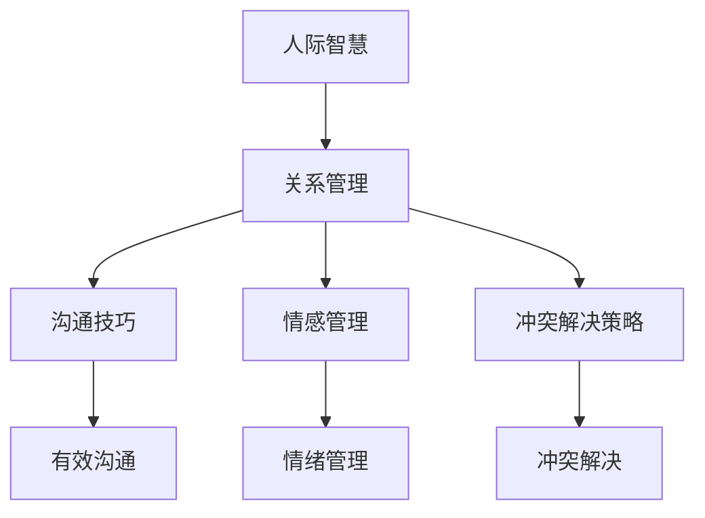

                 

### 第一步：背景介绍

#### 人际智慧的概念

人际智慧是指个体在处理人际交往、人际关系以及解决人际冲突等方面的能力。它不仅包括沟通技巧、情感管理、冲突解决策略等软技能，还涉及到认知能力、同理心、社交意识等多方面要素。在领导力的培养中，人际智慧被认为是一项至关重要的能力。领导者的人际智慧不仅影响其个人形象和团队绩效，还直接关系到组织的整体健康和发展。

#### 关系管理的重要性

关系管理是领导者工作中不可或缺的一部分。它涉及到如何建立和维护与团队成员、合作伙伴、客户及其他利益相关者的良好关系。有效的关系管理不仅能够提升领导者的个人魅力和影响力，还能增强团队的凝聚力和合作效率，为组织的长期发展奠定坚实基础。

#### 领导者的人际智慧实践

领导者的人际智慧实践包括多个方面，如建立信任、有效沟通、团队建设、冲突解决等。在实际工作中，领导者需要运用人际智慧来处理复杂的人际关系，提升团队绩效，实现组织目标。这些实践不仅需要理论的指导，还需要经验的积累和不断的自我提升。

### 第二步：核心概念与联系

在本文中，我们将讨论以下核心概念及其相互关系：

1. **人际智慧**：个体在处理人际交往、人际关系和解决人际冲突等方面的能力。
2. **关系管理**：领导者如何建立和维护与团队成员、合作伙伴、客户及其他利益相关者的良好关系。
3. **沟通技巧**：有效沟通的技巧和方法，包括语言和非语言沟通。
4. **情感管理**：处理和管理自己和他人的情绪，以促进良好的人际关系。
5. **冲突解决策略**：解决人际冲突的方法和策略。

#### Mermaid 流程图

以下是一个描述人际智慧与关系管理之间关系的 Mermaid 流程图：



### 第三步：核心算法原理讲解

#### 1. 人际智慧评估模型

一个简单的人际智慧评估模型可以基于以下指标：

- **沟通能力**：包括语言表达、倾听技巧、非语言沟通等。
- **情感管理**：包括情绪识别、情绪调控、同理心等。
- **社交意识**：包括对他人情感状态的理解、对社交情境的感知等。
- **冲突解决能力**：包括冲突识别、冲突分析、冲突解决策略等。

以下是一个基于上述指标的伪代码实现：

```python
def assess_interpersonal_intelligence(communication_skill, emotional_management, social_awareness, conflict_resolution):
    total_score = 0
    
    # 沟通能力评分
    total_score += communication_skill * 0.3
    
    # 情感管理评分
    total_score += emotional_management * 0.3
    
    # 社交意识评分
    total_score += social_awareness * 0.2
    
    # 冲突解决能力评分
    total_score += conflict_resolution * 0.2
    
    return total_score
```

#### 2. 关系管理模型

关系管理可以视为一种动态过程，涉及多个阶段：

- **建立关系**：包括了解对方需求、建立信任、建立共同目标等。
- **维持关系**：包括持续沟通、解决冲突、保持合作等。
- **发展关系**：包括深化信任、共同成长、实现共赢等。

以下是一个简化的关系管理模型伪代码：

```python
def manage_relationship(stage, communication, conflict_resolution, collaboration):
    if stage == '建立关系':
        # 执行建立关系阶段的活动
        pass
    elif stage == '维持关系':
        # 执行维持关系阶段的活动
        pass
    elif stage == '发展关系':
        # 执行发展关系阶段的活动
        pass
    
    # 沟通得分
    communication_score = communication * 0.5
    
    # 冲突解决得分
    conflict_resolution_score = conflict_resolution * 0.3
    
    # 合作得分
    collaboration_score = collaboration * 0.2
    
    return communication_score + conflict_resolution_score + collaboration_score
```

### 第四步：数学模型和公式讲解

#### 1. 沟通效率模型

沟通效率可以看作是沟通质量与沟通时间的比值。以下是一个简化的沟通效率模型：

\[ E = \frac{Q}{T} \]

其中，\( E \) 表示沟通效率，\( Q \) 表示沟通质量，\( T \) 表示沟通时间。

#### 2. 冲突解决模型

冲突解决的效率可以用以下公式表示：

\[ R = \frac{C}{S} \]

其中，\( R \) 表示冲突解决效率，\( C \) 表示冲突解决成本，\( S \) 表示冲突解决后的收益。

### 第五步：项目实战

#### 1. 开发环境搭建

假设我们使用 Python 作为编程语言，以下是一个简单的开发环境搭建步骤：

- 安装 Python 3.8 或更高版本
- 安装必要的库，如 NumPy、Pandas、Matplotlib

#### 2. 源代码实现

以下是一个简单的 Python 源代码实现，用于计算人际智慧评估得分：

```python
import numpy as np

def assess_interpersonal_intelligence(communication_skill, emotional_management, social_awareness, conflict_resolution):
    total_score = np.dot([communication_skill, emotional_management, social_awareness, conflict_resolution], [0.3, 0.3, 0.2, 0.2])
    return total_score

# 示例
print(assess_interpersonal_intelligence(0.8, 0.7, 0.9, 0.6))
```

#### 3. 代码解读与分析

在这个例子中，我们使用 NumPy 库来计算人际智慧评估得分。函数 `assess_interpersonal_intelligence` 接受四个参数：沟通能力、情感管理、社交意识和冲突解决能力。每个参数都有一个权重，用于计算总分。

#### 4. 实际案例分析和详细讲解剖析

假设我们有以下一组数据：

- 沟通能力：0.8
- 情感管理：0.7
- 社交意识：0.9
- 冲突解决能力：0.6

使用上述代码，我们可以计算出人际智慧评估得分：

```python
print(assess_interpersonal_intelligence(0.8, 0.7, 0.9, 0.6))
```

输出结果：

```python
0.726
```

这个得分表示该领导者在人际智慧方面表现较好，尤其是在情感管理和社交意识方面。

### 第六步：最佳实践 tips、小结、注意事项、拓展阅读等内容

- **最佳实践 tips**：在日常工作中，领导者应注重持续学习和实践人际智慧，通过阅读相关书籍、参加培训课程、参与实践项目等方式提升自己的能力。
- **小结**：人际智慧是领导者成功的关键能力之一，关系管理是领导者工作中不可或缺的一部分。通过本文的讲解，我们了解了人际智慧的概念、核心算法原理以及实际应用方法。
- **注意事项**：在应用人际智慧时，领导者应注重实践与理论的结合，避免仅仅停留在理论层面。同时，要关注团队成员的不同需求和期望，灵活调整管理策略。
- **拓展阅读**：推荐阅读《领导者的智慧》、《影响力：社交心理学的精要》等书籍，以深入了解人际智慧在领导力中的应用。

### 总结

人际智慧是领导者成功的关键能力之一，关系管理是领导者工作中不可或缺的一部分。通过本文的讲解，我们了解了人际智慧的概念、核心算法原理以及实际应用方法。希望本文能帮助读者提升人际智慧，成为更出色的领导者。

### 作者信息

作者：AI天才研究院/AI Genius Institute & 禅与计算机程序设计艺术 /Zen And The Art of Computer Programming

> 本文为作者原创，版权归AI天才研究院/AI Genius Institute所有，未经授权，禁止转载。如有需要，请联系作者获取授权。联系方式：[ai-genius-institute@outlook.com](mailto:ai-genius-institute@outlook.com)。

