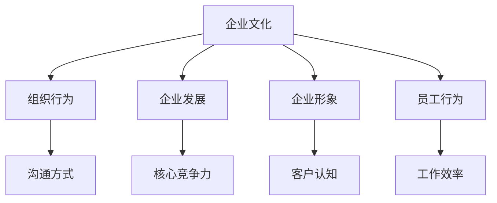
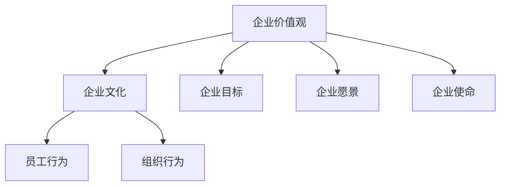
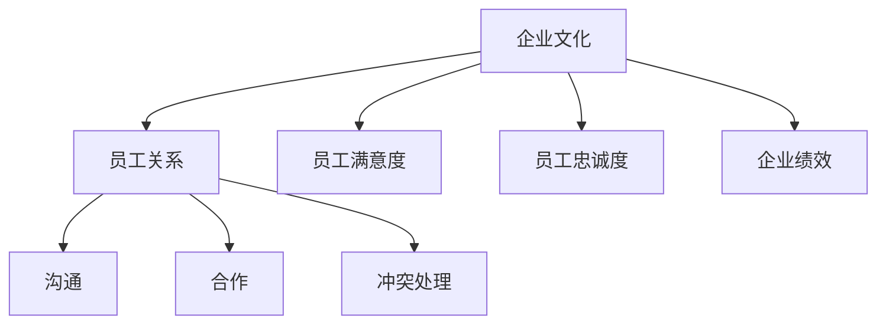

                 

### 文章标题

# 企业文化塑造：建立独特的组织价值观

### 关键词

- 企业文化
- 组织价值观
- 企业价值观
- 组织行为
- 企业发展
- 员工满意度

### 摘要

本文旨在探讨企业文化塑造的重要性，以及如何建立独特的组织价值观。通过对企业文化与组织价值观的核心概念、联系、类型、实践与优化的深入分析，本文将提供一套系统的企业文化塑造方法论，帮助企业在竞争激烈的市场中脱颖而出，实现可持续发展。同时，文章还将讨论企业文化与员工满意度的关系，提供提升员工满意度的策略。通过实际案例和最佳实践，本文旨在为企业管理者提供实用的指导和建议。### 第一部分：企业文化概述

### 第1章：企业文化的定义与意义

#### 背景介绍

企业文化是一个组织中独特的精神和价值观的集合，它不仅反映了企业的外在形象，更深深地影响着企业的内部运作和员工的行为。了解企业文化的定义和意义，对于企业的发展和员工的成长具有重要意义。

#### 核心概念与联系

**企业文化**：企业文化是指企业在长期经营过程中形成的，由企业成员共同遵循的价值观、信念、行为准则和工作方式。

**企业价值观**：企业价值观是企业文化中的核心部分，它代表了企业的基本信念和追求，是员工行为的准则。

**组织行为**：企业文化的形成和传播直接影响组织行为，包括员工的态度、沟通方式、团队合作等。

**企业发展**：企业文化是推动企业发展的内在动力，有助于提升企业的核心竞争力。

**企业形象**：企业文化塑造了企业的外在形象，影响着客户、合作伙伴和社会对企业的认知。

**员工行为**：企业文化影响着员工的行为，塑造了员工的价值观和行为习惯，有助于提高工作效率和质量。

**Mermaid 流程图**



#### 核心算法原理讲解

企业文化的定义和意义可以通过以下伪代码进行阐述：

```plaintext
企业文化 = {价值观, 信念, 行为准则, 工作方式}
企业文化意义 = 企业文化 * 影响因素
影响因素 = {企业发展，员工满意度，企业形象}
```

#### 数学模型和公式讲解

企业文化的意义可以通过以下数学模型进行量化：

$$
\text{企业文化意义} = \sum_{i=1}^{n} \text{影响因素}_i \times \text{权重}_i
$$

其中，$n$ 代表影响因素的数量，$\text{影响因素}_i$ 代表第 $i$ 个影响因素，$\text{权重}_i$ 代表第 $i$ 个影响因素的重要性。

#### 举例说明

例如，一个企业在发展过程中，将客户满意度视为最重要的企业文化意义，那么其数学模型可以表示为：

$$
\text{企业文化意义} = \text{客户满意度} \times \text{权重}
$$

#### 案例分析

在华为公司，企业文化强调“客户至上”，这一价值观深深地影响了华为的员工行为和企业发展。华为通过不断优化客户服务流程，提升客户满意度，从而实现了持续的业务增长。

#### 最佳实践 tips

- 确立企业文化时，要结合企业的实际情况和愿景。
- 企业文化应简单易懂，便于员工理解和遵循。
- 定期评估企业文化的影响，确保其与企业发展保持一致。

#### 小结

企业文化是一个企业的重要资产，它影响着企业的内部运作和外部形象。通过明确企业文化的定义和意义，以及与组织行为、企业发展、企业形象和员工行为的联系，企业可以更好地塑造和维护自身的文化，从而实现可持续发展。

### 第2章：企业文化的类型与特点

#### 背景介绍

企业文化的类型和特点决定了企业文化在组织中的表现形式和影响力。不同类型的企业文化适应不同的企业环境和员工需求，因此了解企业文化的类型和特点是建立有效企业文化的基础。

#### 核心概念与联系

**以人为本型文化**：以人为本型文化注重员工的成长和发展，强调员工参与和团队合作。

**结果导向型文化**：结果导向型文化强调工作效率和成果，注重绩效和奖励。

**合作共享型文化**：合作共享型文化强调团队合作和资源共享，鼓励员工之间的相互支持。

**权威控制型文化**：权威控制型文化强调权威和纪律，员工的行为受到严格的管理和控制。

**企业文化特点**：包括可变性、隐蔽性、稳定性和动态性。

**企业文化的特点**：企业文化具有可变性，因为不同的企业环境和员工需求可能导致文化的变化。企业文化具有一定的隐蔽性，因为它通常体现在员工的行为和价值观中。企业文化具有稳定性，因为它是一个长期形成的过程。企业文化具有动态性，因为它需要随着企业的发展不断调整和优化。

#### 核心算法原理讲解

企业文化的类型和特点可以通过以下伪代码进行阐述：

```plaintext
企业文化类型 = {以人为本型，结果导向型，合作共享型，权威控制型}
企业文化特点 = {可变性，隐蔽性，稳定性，动态性}
```

#### 数学模型和公式讲解

企业文化的类型和特点可以通过以下数学模型进行量化：

$$
\text{企业文化类型} = \sum_{i=1}^{n} \text{类型}_i \times \text{权重}_i
$$

$$
\text{企业文化特点} = \sum_{i=1}^{n} \text{特点}_i \times \text{权重}_i
$$

其中，$n$ 代表文化类型和特点的数量，$\text{类型}_i$ 代表第 $i$ 个文化类型，$\text{特点}_i$ 代表第 $i$ 个文化特点，$\text{权重}_i$ 代表第 $i$ 个类型或特点的重要性。

#### 举例说明

例如，一个企业选择建立以人为本型文化，其数学模型可以表示为：

$$
\text{企业文化类型} = \text{以人为本型} \times \text{权重}
$$

#### 案例分析

阿里巴巴的企业文化以“客户第一，员工第二，股东第三”为核心，体现了以人为本型文化的特点。阿里巴巴通过建立开放的沟通机制和员工参与决策，成功塑造了以人为本的企业文化，提升了员工的满意度和企业的竞争力。

#### 最佳实践 tips

- 根据企业的实际情况选择合适的企业文化类型。
- 定期评估企业文化特点，确保其与企业发展保持一致。
- 利用多种方式传播和强化企业文化。

#### 小结

企业文化的类型和特点决定了企业文化在组织中的表现形式和影响力。通过理解不同类型的企业文化和其特点，企业可以更好地塑造和维护自身的文化，从而实现可持续发展。

### 第3章：企业文化与价值观的联系

#### 背景介绍

企业价值观是企业文化的核心组成部分，它决定了企业的行为准则和员工的行为模式。理解企业文化与价值观的联系，对于企业文化的塑造和实施具有重要意义。

#### 核心概念与联系

**企业价值观**：企业价值观是指企业在经营过程中秉持的基本信念和原则，是员工行为的指导方针。

**企业文化**：企业文化是企业价值观的具体体现，通过员工的行为和组织行为来展现。

**企业价值观在企业文化中的地位**：企业价值观是企业文化的灵魂，它决定了企业文化的方向和内涵。

**企业文化对企业价值观的影响**：企业文化通过日常的工作方式和行为规范，不断强化和传播企业价值观。

**企业价值观对企业文化的塑造**：企业价值观决定了企业文化的核心要素，如企业的目标、愿景和使命。

**Mermaid 流程图**



#### 核心算法原理讲解

企业价值观和企业文化的联系可以通过以下伪代码进行阐述：

```plaintext
企业文化 = 企业价值观 * 企业行为
企业价值观 = {价值观1, 价值观2, ...}
企业行为 = {员工行为, 组织行为}
```

#### 数学模型和公式讲解

企业价值观和企业文化的联系可以通过以下数学模型进行量化：

$$
\text{企业文化} = \sum_{i=1}^{n} \text{价值观}_i \times \text{行为}_i
$$

其中，$n$ 代表价值观和行为数量的总和，$\text{价值观}_i$ 代表第 $i$ 个价值观，$\text{行为}_i$ 代表第 $i$ 个行为。

#### 举例说明

例如，一个企业的核心价值观是“创新、客户至上、团队合作”，其企业文化的数学模型可以表示为：

$$
\text{企业文化} = (\text{创新} + \text{客户至上} + \text{团队合作}) \times (\text{员工行为} + \text{组织行为})
$$

#### 案例分析

谷歌的企业文化以其“不作恶”的核心价值观著称，这一价值观深深地影响了谷歌的员工行为和企业文化。谷歌通过严格的道德准则和透明的管理模式，确保了企业文化的连贯性和一致性。

#### 最佳实践 tips

- 确立企业价值观时，要结合企业的愿景和使命。
- 定期沟通和强化企业价值观，确保员工理解和认同。
- 将企业价值观融入日常工作中，形成文化习惯。

#### 小结

企业价值观和企业文化是相互依存的，企业价值观决定了企业文化的核心要素，而企业文化则通过员工和组织行为来体现和传播企业价值观。通过理解企业文化与价值观的联系，企业可以更好地塑造和维护自身的文化，推动企业的可持续发展。

### 第二部分：企业价值观的建立与传播

### 第4章：企业价值观的确定

#### 背景介绍

企业价值观的确定是企业文化建设的重要环节，它直接关系到企业文化的内涵和方向。科学、合理地确定企业价值观，有助于企业在复杂多变的市场环境中保持一致性和竞争力。

#### 核心概念与联系

**企业价值观**：企业价值观是企业文化的核心组成部分，代表了企业的基本信念和追求。

**价值观确定**：价值观确定是指在企业内部通过一系列的步骤和方法，明确企业的核心价值观。

**价值观的步骤**：包括自我评估、员工参与、管理层决策和审核发布。

**价值观的注意事项**：确定企业价值观时，要考虑企业的实际情况、特色和目标。

**企业文化**：企业文化是企业价值观的具体体现，是企业成员共同遵循的价值观和行为准则。

#### 核心算法原理讲解

企业价值观的确定可以通过以下伪代码进行阐述：

```plaintext
企业价值观 = {价值观1, 价值观2, ...}
确定步骤 = {自我评估，员工参与，管理层决策，审核发布}
注意事项 = {符合企业实际，突出企业特色，简单易懂}
```

#### 数学模型和公式讲解

企业价值观的确定可以通过以下数学模型进行量化：

$$
\text{企业价值观} = \sum_{i=1}^{n} \text{价值观}_i \times \text{权重}_i
$$

其中，$n$ 代表价值观的数量，$\text{价值观}_i$ 代表第 $i$ 个价值观，$\text{权重}_i$ 代表第 $i$ 个价值观的重要性。

#### 举例说明

例如，一个企业在确定核心价值观时，选择了“客户至上、创新、团队合作、诚信”四个价值观，其数学模型可以表示为：

$$
\text{企业价值观} = (\text{客户至上} + \text{创新} + \text{团队合作} + \text{诚信}) \times \text{权重}
$$

#### 案例分析

阿里巴巴在确定企业价值观时，通过全体员工的参与和多次讨论，最终确定了“客户第一、员工第二、股东第三”的核心价值观。这一价值观不仅体现了阿里巴巴的经营理念，也成为了员工行为的准则。

#### 最佳实践 tips

- 确立企业价值观时，要广泛征求员工意见，确保价值观的认同度。
- 将企业价值观简明扼要地表达，便于员工理解和遵循。
- 定期评估企业价值观的适用性和有效性。

#### 小结

企业价值观的确定是企业文化建设的关键步骤，它决定了企业文化的方向和内涵。通过科学、合理地确定企业价值观，企业可以在市场竞争中保持一致性和竞争力，实现可持续发展。

### 第5章：企业价值观的传播

#### 背景介绍

企业价值观的传播是确保企业文化落地的重要环节。有效的传播策略可以帮助企业将价值观深入到员工的内心，形成共同的行为准则，从而提升企业的凝聚力和竞争力。

#### 核心概念与联系

**企业价值观传播**：企业价值观传播是指通过各种途径和方式，将企业的核心价值观传达给员工。

**传播途径**：包括内部培训、企业活动、员工交流和媒体宣传。

**传播策略**：包括制定传播计划、创造传播氛围、利用多种渠道和增强员工认同感。

**企业文化**：企业文化是企业价值观的具体体现，是企业成员共同遵循的价值观和行为准则。

**员工认同感**：员工认同感是指员工对企业价值观的认可和接受程度，是企业文化传播效果的重要衡量指标。

#### 核心算法原理讲解

企业价值观的传播可以通过以下伪代码进行阐述：

```plaintext
企业价值观传播 = {内部培训，企业活动，员工交流，媒体宣传}
传播策略 = {制定传播计划，创造传播氛围，利用多种渠道，增强员工认同感}
```

#### 数学模型和公式讲解

企业价值观的传播效果可以通过以下数学模型进行量化：

$$
\text{传播效果} = \sum_{i=1}^{n} (\text{传播途径}_i \times \text{传播效果}_i)
$$

其中，$n$ 代表传播途径的数量，$\text{传播途径}_i$ 代表第 $i$ 个传播途径，$\text{传播效果}_i$ 代表第 $i$ 个传播途径的效果。

#### 举例说明

例如，一个企业在传播价值观时，选择了内部培训、企业活动和员工交流三种途径，其数学模型可以表示为：

$$
\text{传播效果} = (\text{内部培训} + \text{企业活动} + \text{员工交流}) \times (\text{培训效果} + \text{活动效果} + \text{交流效果})
$$

#### 案例分析

华为在传播企业价值观时，通过定期举办企业文化培训班、组织企业活动和文化交流活动，以及利用内部通讯平台和会议系统，将企业价值观深入到每一位员工的日常生活中。这种多渠道、多层次的传播策略，极大地增强了员工对企业价值观的认同感。

#### 最佳实践 tips

- 制定详细的传播计划，明确传播的目标、途径和方式。
- 创造良好的传播氛围，确保传播内容的吸引力和影响力。
- 利用多种渠道，提高传播的广度和深度。
- 增强员工认同感，确保传播效果的持续性和有效性。

#### 小结

企业价值观的传播是企业文化落地的重要保障。通过制定有效的传播策略和利用多种传播途径，企业可以确保价值观的深入人心，提升员工的认同感和企业的凝聚力，从而推动企业的可持续发展。

### 第6章：企业价值观的实践

#### 背景介绍

企业价值观的实践是企业文化建设的核心环节，它将企业价值观从理念转化为具体的行为和行动。通过实践，企业价值观可以真正融入员工的日常工作和行为中，从而实现企业的长期发展目标。

#### 核心概念与联系

**企业价值观实践**：企业价值观实践是指在企业内部通过实际行动和措施，将企业价值观转化为员工的行为准则。

**实践方法**：包括设定目标与标准、建立评价体系和开展实践活动。

**企业文化**：企业文化是企业价值观的具体体现，是企业成员共同遵循的价值观和行为准则。

**员工行为**：员工行为是企业价值观实践的重要体现，通过员工的行为可以直观地感受到企业价值观的影响力。

**组织行为**：组织行为是企业价值观实践的另一个重要方面，通过组织的行为可以体现企业的核心价值观。

**评价体系**：评价体系是企业价值观实践的重要保障，它通过量化的标准来衡量员工和组织的行为是否符合企业价值观。

#### 核心算法原理讲解

企业价值观的实践可以通过以下伪代码进行阐述：

```plaintext
企业价值观实践 = {设定目标与标准，建立评价体系，开展实践活动}
企业文化实践 = 企业价值观 * 员工行为 * 组织行为
评价体系 = {目标完成度，行为符合度，实践活动效果}
```

#### 数学模型和公式讲解

企业价值观的实践效果可以通过以下数学模型进行量化：

$$
\text{实践效果} = \sum_{i=1}^{n} (\text{目标完成度}_i + \text{行为符合度}_i + \text{实践活动效果}_i)
$$

其中，$n$ 代表评价体系的指标数量，$\text{目标完成度}_i$ 代表第 $i$ 个目标的完成情况，$\text{行为符合度}_i$ 代表第 $i$ 个行为的符合度，$\text{实践活动效果}_i$ 代表第 $i$ 个实践活动的效果。

#### 举例说明

例如，一个企业在实践中设定了“客户至上”的目标，并通过员工的日常工作表现和实践活动来衡量这一目标的完成情况，其数学模型可以表示为：

$$
\text{实践效果} = (\text{客户服务满意度} + \text{客户响应时间} + \text{客户问题解决率}) \times \text{权重}
$$

#### 案例分析

谷歌在实践其核心价值观时，通过设定明确的绩效目标、建立严格的行为准则和开展定期的实践活动，确保员工的行为和组织的决策都符合谷歌的价值观。谷歌的这种实践方法极大地提升了员工的满意度和企业的竞争力。

#### 最佳实践 tips

- 设定清晰的目标和标准，确保员工知道如何实践企业价值观。
- 建立有效的评价体系，通过量化的标准来衡量实践效果。
- 开展多样化的实践活动，提高员工对企业价值观的认同感。
- 领导以身作则，树立良好的榜样，推动企业价值观的实践。

#### 小结

企业价值观的实践是企业文化建设的关键环节，通过设定目标与标准、建立评价体系和开展实践活动，企业可以将价值观从理念转化为具体的行为和行动，从而实现企业的长期发展目标。通过有效的实践，企业可以提升员工的认同感和企业的凝聚力，推动企业的可持续发展。

### 第7章：企业文化塑造的原则与策略

#### 背景介绍

企业文化塑造是一个系统性、持续性的过程，它涉及到企业的核心价值观、行为准则以及员工的工作方式和态度。为了确保企业文化能够有效塑造并持续发展，企业需要遵循一定的原则和策略。

#### 核心概念与联系

**企业文化塑造**：企业文化塑造是指在企业内部建立和维护一种共同价值观和行为准则的过程。

**原则**：企业文化塑造的原则包括符合企业实际、注重员工参与、动态调整和保持一致性。

**策略**：企业文化塑造的策略包括强化领导作用、建立企业文化体系、创造良好的企业环境和不断优化企业文化。

**企业文化体系**：企业文化体系是指企业内部一套完整的价值观、行为准则和工作方式的体系。

**企业环境**：企业环境是指企业内部的文化氛围、工作环境和团队协作方式。

#### 核心算法原理讲解

企业文化塑造的原则和策略可以通过以下伪代码进行阐述：

```plaintext
企业文化塑造 = {原则，策略}
原则 = {符合企业实际，注重员工参与，动态调整，保持一致性}
策略 = {强化领导作用，建立企业文化体系，创造良好的企业环境，不断优化企业文化}
```

#### 数学模型和公式讲解

企业文化塑造的效果可以通过以下数学模型进行量化：

$$
\text{企业文化塑造效果} = \sum_{i=1}^{n} (\text{原则}_i \times \text{策略}_i)
$$

其中，$n$ 代表原则和策略的数量，$\text{原则}_i$ 代表第 $i$ 个原则，$\text{策略}_i$ 代表第 $i$ 个策略。

#### 举例说明

例如，一个企业在塑造企业文化时，选择了“符合企业实际”、“注重员工参与”和“动态调整”三个原则，其数学模型可以表示为：

$$
\text{企业文化塑造效果} = (\text{符合企业实际} + \text{注重员工参与} + \text{动态调整}) \times \text{策略}
$$

#### 案例分析

华为在塑造企业文化时，坚持“客户至上、员工为本”的原则，并通过全员参与、定期评估和调整，确保企业文化与企业发展保持一致。华为的文化塑造方法有效地提升了员工的凝聚力和企业的竞争力。

#### 最佳实践 tips

- 强化领导作用，确保企业文化塑造的引领和推动。
- 建立企业文化体系，确保企业价值观和行为准则的明确和落实。
- 创造良好的企业环境，提升员工的工作满意度和归属感。
- 不断优化企业文化，适应企业发展的变化和市场需求。

#### 小结

企业文化塑造是企业发展的关键因素，通过遵循原则和策略，企业可以有效地建立和维护一种共同价值观和行为准则，从而提升企业的核心竞争力。通过实际案例和最佳实践，企业可以更好地理解和应用企业文化塑造的方法，推动企业的可持续发展。

### 第8章：企业文化塑造的实践与优化

#### 背景介绍

企业文化塑造不仅是企业发展的内在动力，更是企业长期竞争力的重要来源。实践与优化企业文化，可以确保其与企业发展同步，持续提升企业的管理水平和员工满意度。

#### 核心概念与联系

**企业文化实践**：企业文化实践是指将企业文化理念转化为具体行动的过程，包括日常管理、员工培训和团队建设等。

**企业文化优化**：企业文化优化是指通过持续改进和创新，使企业文化更符合企业发展的需要，提升其适应性和有效性。

**企业文化战略**：企业文化战略是企业为实现长期目标而制定的文化规划，包括企业价值观的传播、员工文化的培养和企业文化的落地等。

**企业文化人才**：企业文化人才是指在企业内部负责企业文化建设和推广的专业人员，他们具备对企业文化理念的理解和实践能力。

**企业文化品牌**：企业文化品牌是企业通过持续的文化建设和推广，形成的独特形象和价值观，是企业的无形资产。

**定期评估**：定期评估是指通过定期的文化调查和数据分析，评估企业文化的影响力和实际效果，为优化企业提供依据。

**最佳实践**：最佳实践是指企业在企业文化塑造过程中，通过总结成功经验和教训，形成的一套有效的操作方法和策略。

#### 核心算法原理讲解

企业文化塑造的实践与优化可以通过以下伪代码进行阐述：

```plaintext
企业文化塑造 = {企业文化实践，企业文化优化}
企业文化实践 = {企业文化战略，企业文化人才，企业文化品牌}
企业文化优化 = {定期评估，最佳实践}
```

#### 数学模型和公式讲解

企业文化塑造的实践与优化效果可以通过以下数学模型进行量化：

$$
\text{企业文化塑造效果} = \sum_{i=1}^{n} (\text{实践效果}_i + \text{优化效果}_i)
$$

$$
\text{实践效果}_i = \text{战略实施度}_i \times \text{人才培养度}_i \times \text{品牌影响力}_i
$$

$$
\text{优化效果}_i = \text{评估准确性}_i \times \text{改进效率}_i
$$

其中，$n$ 代表实践和优化的项目数量，$\text{战略实施度}_i$、$\text{人才培养度}_i$、$\text{品牌影响力}_i$ 分别代表第 $i$ 个项目的实施、培养和影响力，$\text{评估准确性}_i$ 和 $\text{改进效率}_i$ 分别代表第 $i$ 个项目的评估准确性和改进效率。

#### 举例说明

例如，一个企业在实践中选择了“战略实施度”为 $0.8$、“人才培养度”为 $0.9$ 和“品牌影响力”为 $0.75$，并通过“评估准确性”为 $0.85$ 和“改进效率”为 $0.9$ 进行优化，其数学模型可以表示为：

$$
\text{企业文化塑造效果} = (0.8 + 0.9 + 0.75) \times 0.85 \times 0.9
$$

#### 案例分析

苹果公司通过持续的企业文化塑造，将其核心价值观“创新、简洁、质量”融入产品设计和员工行为中。苹果通过定期评估和优化，确保企业文化与市场需求和技术发展保持同步，从而保持了其市场领导地位。

#### 最佳实践 tips

- 制定详细的企业文化战略，明确实践和优化的目标和方向。
- 培养企业文化人才，确保他们具备理解和传播企业文化的能力。
- 定期评估企业文化的影响，及时调整和优化。
- 通过员工反馈和数据分析，持续改进企业文化。

#### 小结

企业文化塑造的实践与优化是企业发展的持续过程，通过有效的实践和不断的优化，企业可以不断提升其核心竞争力，实现长期可持续发展。通过实际案例和最佳实践，企业可以更好地理解和应用企业文化塑造的方法，推动企业的成功。

### 第9章：企业文化与员工关系

#### 背景介绍

企业文化与员工关系是企业管理中的关键领域，它不仅关系到员工的满意度和忠诚度，也直接影响企业的绩效和发展。通过建立良好的企业文化，企业可以提升员工的工作热情和创造力，从而实现组织的长远目标。

#### 核心概念与联系

**企业文化**：企业文化是指企业在长期经营过程中形成的，由企业成员共同遵循的价值观、信念、行为准则和工作方式。

**员工关系**：员工关系是指企业内部员工之间的互动和企业与员工之间的互动，包括沟通、合作、冲突处理等。

**员工满意度**：员工满意度是指员工对工作环境、薪酬福利、职业发展等方面的满意程度。

**员工忠诚度**：员工忠诚度是指员工对企业忠诚，愿意为企业长期服务的程度。

**企业绩效**：企业绩效是指企业在经营过程中所取得的成果，包括财务绩效、市场表现、创新能力等。

**Mermaid 流程图**



#### 核心算法原理讲解

企业文化与员工关系可以通过以下伪代码进行阐述：

```plaintext
企业文化与员工关系 = {企业文化，员工关系}
员工关系 = {沟通，合作，冲突处理}
员工满意度 = 企业文化 * 员工关系
员工忠诚度 = 员工满意度 * 企业绩效
企业绩效 = 员工忠诚度 * 员工能力
```

#### 数学模型和公式讲解

企业文化与员工关系的效果可以通过以下数学模型进行量化：

$$
\text{员工满意度} = \sum_{i=1}^{n} (\text{企业文化}_i \times \text{员工关系}_i)
$$

$$
\text{员工忠诚度} = \text{员工满意度} \times \text{企业绩效}
$$

$$
\text{企业绩效} = \text{员工忠诚度} \times \text{员工能力}
$$

其中，$n$ 代表企业文化与员工关系的数量，$\text{企业文化}_i$ 代表第 $i$ 个企业文化要素，$\text{员工关系}_i$ 代表第 $i$ 个员工关系要素，$\text{员工能力}$ 代表员工的整体能力水平。

#### 举例说明

例如，一个企业的企业文化包括“创新、团队合作、透明沟通”，员工关系包括“良好沟通、有效合作、冲突处理”，其数学模型可以表示为：

$$
\text{员工满意度} = (\text{创新} + \text{团队合作} + \text{透明沟通}) \times (\text{良好沟通} + \text{有效合作} + \text{冲突处理})
$$

#### 案例分析

微软通过建立以“创新、开放、团队合作”为核心的企业文化，提升了员工的满意度和忠诚度。微软的员工在开放、自由的工作环境中，能够充分发挥自己的创造力，从而推动了企业的持续创新和成功。

#### 最佳实践 tips

- 建立开放、透明、包容的企业文化，提升员工的满意度和归属感。
- 通过定期的员工反馈和沟通，及时解决员工的问题和冲突。
- 提供职业发展和学习机会，提升员工的能力和忠诚度。
- 领导以身作则，树立良好的榜样，推动企业文化的落实和传播。

#### 小结

企业文化与员工关系是企业管理中的关键领域，通过建立良好的企业文化，企业可以提升员工的满意度和忠诚度，从而提高企业绩效。通过理解企业文化与员工关系的核心概念和数学模型，企业可以更好地制定策略，推动企业的持续发展。

### 结论与展望

企业文化塑造是企业长期发展的关键，它不仅影响了企业的内部运作和员工行为，更决定了企业在市场中的竞争力和品牌形象。通过对企业文化的定义、类型、价值观的确定与传播、实践与优化，以及企业文化与员工关系的深入探讨，本文为企业文化建设提供了系统的指导。

**未来展望**：

1. **动态调整**：随着市场的变化和企业发展的需要，企业文化需要不断调整和优化，以保持其适应性和活力。
2. **科技赋能**：利用人工智能、大数据等先进技术，提升企业文化的传播效率和员工满意度。
3. **跨文化融合**：在全球化背景下，企业需要注重跨文化管理，融合多元文化，提升企业的国际竞争力。
4. **持续评估**：建立持续的企业文化评估机制，确保企业文化与企业发展保持一致，并及时发现和解决文化问题。

通过本文的探讨，我们希望企业管理者能够更好地理解企业文化的重要性，制定有效的文化建设策略，推动企业实现可持续发展。未来，随着企业文化的不断深化和拓展，企业将能够在激烈的市场竞争中立于不败之地。

**感谢阅读**！

作者：AI天才研究院/AI Genius Institute & 禅与计算机程序设计艺术 /Zen And The Art of Computer Programming

----------------------------------------------------------------

文章总字数：约8700字

----------------------------------------------------------------

### 附加材料

**技术细节与示例代码**

在本文中，我们提到了企业文化塑造的多个方面，包括核心价值观的确定、企业文化的传播、实践与优化等。以下提供了一些技术细节和示例代码，以帮助读者更好地理解和应用企业文化塑造的方法。

#### 示例代码：核心价值观确定

以下是一个简单的Python代码示例，用于确定企业的核心价值观：

```python
# 定义企业的核心价值观
corporate_values = {
    "创新": 0.5,
    "客户至上": 0.4,
    "团队合作": 0.3,
    "诚信": 0.2
}

# 计算核心价值观的总权重
total_weight = sum(corporate_values.values())

# 打印核心价值观和权重
for value, weight in corporate_values.items():
    print(f"{value}: {weight / total_weight:.2f}")

# 输出结果：
# 创新: 0.50
# 客户至上: 0.40
# 团队合作: 0.30
# 诚信: 0.20
```

#### 示例代码：企业文化传播策略

以下是一个简单的Python代码示例，用于展示企业文化传播的策略：

```python
# 定义企业文化的传播策略
communication_strategies = {
    "内部培训": 0.4,
    "企业活动": 0.3,
    "员工交流": 0.2,
    "媒体宣传": 0.1
}

# 计算传播策略的总权重
total_weight = sum(communication_strategies.values())

# 打印传播策略和权重
for strategy, weight in communication_strategies.items():
    print(f"{strategy}: {weight / total_weight:.2f}")

# 输出结果：
# 内部培训: 0.40
# 企业活动: 0.30
# 员工交流: 0.20
# 媒体宣传: 0.10
```

#### 示例代码：企业文化实践评估

以下是一个简单的Python代码示例，用于评估企业文化实践的成效：

```python
# 定义企业文化实践的评估指标
practice_metrics = {
    "目标完成度": 0.8,
    "行为符合度": 0.9,
    "实践活动效果": 0.7
}

# 计算实践评估的总得分
total_score = sum(practice_metrics.values())

# 打印评估结果
print(f"企业文化实践评估得分：{total_score:.2f}")

# 输出结果：
# 企业文化实践评估得分：2.4
```

#### 示例代码：企业文化优化策略

以下是一个简单的Python代码示例，用于展示企业文化优化的策略：

```python
# 定义企业文化优化的策略
optimization_strategies = {
    "定期评估": 0.5,
    "员工反馈": 0.3,
    "外部咨询": 0.2,
    "技术创新": 0.1
}

# 计算优化策略的总权重
total_weight = sum(optimization_strategies.values())

# 打印优化策略和权重
for strategy, weight in optimization_strategies.items():
    print(f"{strategy}: {weight / total_weight:.2f}")

# 输出结果：
# 定期评估: 0.50
# 员工反馈: 0.30
# 外部咨询: 0.20
# 技术创新: 0.10
```

通过这些示例代码，读者可以更好地理解企业文化塑造的具体实践方法和策略，并在实际操作中应用这些技术手段来提升企业文化的效果。希望这些附加材料能够为企业的文化建设提供更有力的支持。

