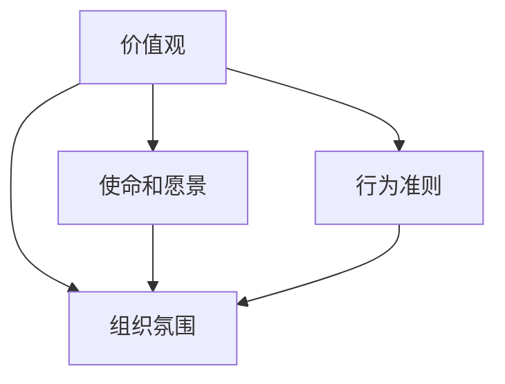

                 

### 文章标题

《企业文化工程：塑造独特组织氛围的策略》

### 关键词

- 企业文化
- 组织氛围
- 塑造策略
- 实施方法
- 评估与改进

### 摘要

本文将深入探讨企业文化工程的概念、重要性及其对企业组织氛围的塑造策略。我们将逐步分析企业文化的基本概念与核心价值，探讨其在组织管理中的应用，并分享企业文化塑造的实施策略与评估方法。通过实际案例分析和最佳实践，本文旨在为IT领域的技术团队提供有价值的指导，以构建独特而积极的组织文化。

## 引言

在当今快速变化和高度竞争的商业环境中，企业文化已成为组织成功的关键因素。企业文化不仅影响员工的态度和行为，还塑造着组织的整体氛围和工作环境。本文将探讨企业文化工程，旨在通过一系列策略，帮助组织塑造独特且积极的氛围，提升团队协作和创新力，从而实现长期成功。

本文将从以下几个方面展开讨论：

1. 企业文化的基本概念与核心价值
2. 企业文化在组织管理中的应用
3. 企业文化塑造的实施策略
4. 企业文化评估与改进方法
5. 实际案例分析和最佳实践

通过以上内容的逐步分析，我们将深入理解企业文化工程的重要性，掌握其核心原理和实践方法，为IT领域的技术团队提供有针对性的指导。

### 企业文化的基本概念与核心价值

企业文化是指组织内部共同接受的价值观念、信念和行为准则的总和。它不仅反映了组织的使命、愿景和目标，还体现了组织的独特性和个性。企业文化是企业内部的一种精神力量，能够激发员工的积极性和创造力，塑造组织的整体氛围。

#### 核心概念与联系

为了更好地理解企业文化，我们需要探讨几个核心概念，它们相互联系，共同构成了企业文化的核心框架。

1. **价值观**：价值观是企业文化的基础，它代表了组织对什么是有价值和重要的共同认知。价值观可以是诚实、创新、客户至上等，它们指导着组织的行为和决策。

2. **使命和愿景**：使命描述了组织的根本目的和存在的理由，而愿景则描绘了组织未来想要达到的状态。使命和愿景为企业文化提供了方向和动力，帮助组织在变化的环境中保持一致性和稳定性。

3. **行为准则**：行为准则是一系列指导员工行为的规范，它明确了组织期望员工如何表现和互动。行为准则不仅约束员工的行为，也传递了组织的核心价值观。

4. **组织氛围**：组织氛围是指组织内部的一种整体感觉或氛围，包括员工之间的互动、工作环境、沟通方式等。良好的组织氛围能够激发员工的积极性和创造力，促进团队合作和创新。

#### 核心概念之间的关系架构

下面，我们将使用Mermaid流程图来展示这些核心概念之间的关系架构。

在这个流程图中，我们可以看到价值观是连接使命、愿景、行为准则和组织氛围的核心纽带。价值观不仅决定了组织的使命和愿景，也塑造了员工的行为准则和组织氛围。

#### 企业文化的基本类型

企业文化的类型多种多样，常见的类型包括：

1. **权力型文化**：在这种文化中，权力和权威非常重要，决策通常由高层领导做出。权力型文化强调控制和效率。

2. **任务型文化**：任务型文化注重目标和结果，员工被鼓励独立思考和解决问题。这种文化鼓励创新和灵活性。

3. **人员型文化**：人员型文化强调团队合作和员工关系，重视员工的发展和福祉。这种文化鼓励员工之间的互助和协作。

4. **市场型文化**：市场型文化关注客户需求和市场竞争，员工被鼓励关注外部环境，以适应市场变化。

#### 企业文化与组织绩效的关系

企业文化对组织绩效有着重要的影响。研究表明，积极的企业文化能够提高员工的满意度和忠诚度，促进团队合作，提高创新力，从而提升组织绩效。

- **员工满意度**：企业文化能够塑造员工的价值观和行为准则，提高员工的工作满意度和幸福感。

- **团队合作**：企业文化鼓励团队合作和协作，提高团队的整体绩效。

- **创新力**：企业文化鼓励创新和尝试，促进组织创新能力的提升。

- **组织绩效**：积极的企业文化能够提高组织的整体绩效，实现长期成功。

综上所述，企业文化的基本概念和核心价值对于组织的成功至关重要。通过理解这些核心概念，我们可以更好地塑造和维护积极的企业文化，提升组织绩效和员工幸福感。

### 企业文化在组织管理中的应用

企业文化不仅在塑造组织氛围中起到关键作用，还在组织管理中发挥着重要的作用。有效的企业文化能够帮助组织实现其战略目标，提升团队协作和员工满意度。以下我们将详细探讨企业文化在人力资源管理、领导力发展、组织沟通和组织变革中的应用。

#### 企业文化在人力资源管理中的应用

企业文化对人力资源管理有着深远的影响。通过将企业文化融入招聘、培训、绩效管理和员工关系等环节，企业可以确保员工与组织价值观的一致性，从而提高员工的工作满意度和忠诚度。

1. **招聘**：在招聘过程中，企业可以通过面试和行为评估来筛选与企业文化相符的候选人。这有助于确保新员工能够迅速融入组织，减少文化冲突。

2. **培训与发展**：通过培训和发展计划，企业可以强化员工的价值观和行为准则，确保员工能够适应组织的文化。培训内容可以包括企业历史、核心价值观、使命和愿景等。

3. **绩效管理**：企业可以通过绩效管理系统来衡量员工的行为是否符合企业文化。绩效评估标准应与企业文化相一致，以激励员工保持积极的行为。

4. **员工关系**：企业文化可以促进积极的员工关系，鼓励员工之间的互助和合作。管理层应通过公正和透明的沟通，维护良好的员工关系。

#### 企业文化在领导力发展中的应用

领导力是企业成功的关键因素，而企业文化在领导力发展中发挥着至关重要的作用。通过培养与企业文化相符的领导力，企业可以确保领导层能够引领组织走向成功。

1. **价值观导向的领导**：领导层应以组织的价值观为导向，通过自身行为和决策来传达和强化企业文化。这有助于树立榜样，激励员工。

2. **培养领导力**：企业可以通过领导力发展计划来培养员工，特别是那些有潜力成为未来领导者的员工。这些计划可以包括领导力培训、导师制度和领导力评估。

3. **领导层的多样性**：企业文化应鼓励领导层的多样性，确保不同背景的员工都有机会成为领导者。这有助于丰富组织的视角和创新能力。

#### 企业文化在组织沟通中的应用

有效的组织沟通是企业文化得以传播和落实的重要途径。通过建立良好的沟通机制，企业可以确保员工了解并认同企业文化，从而促进组织的整体协作和创新。

1. **开放沟通**：企业应鼓励员工之间进行开放和诚实的沟通，确保信息的畅通和透明。这有助于建立信任和合作的文化氛围。

2. **领导层的沟通**：领导层应通过定期的会议、内部通讯和互动平台，与员工保持密切的沟通，传达企业文化的重要信息。

3. **员工反馈**：企业应建立反馈机制，允许员工表达意见和建议，以改进企业文化。这有助于确保企业文化与员工的实际需求相符。

#### 企业文化在组织变革中的应用

在组织变革过程中，企业文化发挥着关键作用，能够帮助组织顺利过渡，实现变革目标。

1. **变革倡导**：企业文化应鼓励员工接受变革，并通过领导层的倡导和行动，引导员工理解变革的必要性和重要性。

2. **变革适应**：企业文化应促进员工适应变革，鼓励员工积极应对变化，寻找新的机遇。这可以通过培训、支持和激励机制来实现。

3. **文化更新**：在变革过程中，企业文化可能需要更新和调整，以适应新的环境。企业应通过沟通和培训，确保员工了解变革后的企业文化。

综上所述，企业文化在组织管理中的应用涵盖了多个方面，包括人力资源管理、领导力发展、组织沟通和组织变革。通过有效地应用企业文化，企业可以提升团队协作、增强创新力和实现长期成功。

### 企业文化塑造的策略

塑造独特且积极的组织文化是企业长期成功的关键。为了实现这一目标，企业需要采用一系列策略，包括制定明确的企业价值观、实施有效的传播机制以及提供持续的文化培训。以下将详细探讨这些策略的实施方法和具体步骤。

#### 制定明确的企业价值观

明确的企业价值观是塑造积极企业文化的基石。企业应通过深入思考和广泛讨论，确定与自身使命和愿景相符的核心价值观，并确保这些价值观被全体员工认同和接受。

1. **核心价值观的确定**：企业可以通过以下步骤来制定核心价值观：
   - **内部讨论**：组织相关利益相关者（如高管、员工代表、董事会成员）进行讨论，共同确定核心价值观。
   - **调研与反馈**：通过员工调研、问卷调查等方式，了解员工对公司价值观的看法和建议，以确保价值观的广泛认同。
   - **价值观陈述**：将核心价值观明确表述，并形成简洁、有力的宣言。

2. **核心价值观的传播**：企业需要通过各种渠道和方式，将核心价值观传播到每个员工心中：
   - **内部通讯**：通过公司内部邮件、公告板、内部通讯等方式，定期宣传核心价值观。
   - **会议与培训**：在会议和培训中，将核心价值观作为重要议题，引导员工深入理解和践行。
   - **领导示范**：高层领导应以身作则，通过自身行为和决策，展示核心价值观的实践。

#### 实施有效的传播机制

传播机制的有效性直接影响企业文化的影响力和深入人心程度。企业应建立一套系统化的传播机制，确保企业文化得以持续传播和强化。

1. **企业文化手册**：编写企业文化手册，详细介绍核心价值观、使命和愿景，以及企业文化的重要理念和实践。手册应便于员工随时查阅。

2. **企业文化墙**：在公司内部设置企业文化墙，展示核心价值观、员工风采、优秀事迹等，营造浓厚的文化氛围。

3. **内部宣传渠道**：利用公司内部网站、社交媒体、内部论坛等渠道，发布企业文化相关内容，鼓励员工互动和参与。

#### 提供持续的文化培训

持续的文化培训有助于员工深刻理解和践行企业文化。企业应制定系统的文化培训计划，确保员工在入职和晋升等关键节点接受文化培训。

1. **入职培训**：在员工入职初期，组织企业文化培训，介绍公司的核心价值观、使命和愿景，帮助新员工快速融入企业。

2. **定期培训**：定期组织企业文化培训，更新员工对文化的理解和认识，确保文化持续传承。

3. **个性化培训**：根据员工的不同岗位和需求，提供个性化的文化培训，帮助员工更好地将企业文化融入到实际工作中。

#### 案例分析

为了更直观地理解企业文化塑造的策略，我们可以参考一些成功案例：

1. **谷歌**：谷歌以其独特的“不作恶”价值观而闻名。公司通过多种渠道，如内部邮件、培训课程和员工手册，持续传播这一价值观，并鼓励员工在工作和生活中践行。谷歌还设立了“文化大使”职位，负责监督和推广企业文化。

2. **特斯拉**：特斯拉强调创新和可持续性。公司通过定期的员工会议、创新竞赛和文化活动，鼓励员工追求创新，并强调环境保护的重要性。特斯拉还设立了“文化委员会”，负责推动企业文化的实践和传播。

通过以上案例分析，我们可以看到，制定明确的企业价值观、实施有效的传播机制和提供持续的文化培训是塑造积极企业文化的重要策略。企业应根据自身特点，灵活运用这些策略，打造独特的组织文化，实现长期成功。

### 企业文化评估与改进方法

企业文化评估是企业持续改进和优化文化的重要步骤。通过系统的评估，企业可以了解文化的影响、识别存在的问题，并采取相应的改进措施。以下将详细探讨企业文化评估的方法、指标以及改进策略。

#### 企业文化评估的方法

1. **问卷调查**：问卷调查是一种常用的企业文化评估方法，可以帮助企业了解员工的满意度和认同感。问卷应涵盖多个方面，如价值观认同、工作环境、沟通效果等。设计问卷时，应确保问题明确、易于理解，并避免引导性问题。

2. **员工访谈**：通过面对面或电话访谈，与员工深入交流，了解他们对企业文化的真实看法。访谈内容可以包括员工的体验、感受以及对企业文化的意见和建议。这种方法的优点在于可以获取更详细和具体的信息。

3. **焦点小组**：组织由员工代表组成的焦点小组，进行讨论和交流。这种方法有助于收集多方面的观点和建议，促进员工之间的互动和合作。

4. **观察法**：通过观察员工的行为和互动，评估企业文化在实际工作中的应用情况。这种方法可以帮助企业发现文化在实际操作中的问题和不足。

#### 企业文化评估的指标

1. **员工满意度**：员工满意度是衡量企业文化的重要指标之一。高满意度通常表明企业文化得到了员工的认同和接受。

2. **员工忠诚度**：员工忠诚度反映了员工对企业的忠诚和投入程度，是企业文化有效性的重要指标。

3. **团队合作**：团队合作是企业成功的关键。评估团队合作水平，可以了解企业文化是否促进了员工之间的协作和沟通。

4. **创新能力**：企业文化对创新能力的促进程度也是评估的重要指标。一个积极的企业文化应鼓励员工创新思维和实践。

5. **领导力**：领导力是企业文化的核心要素。评估领导力水平，可以了解企业文化对领导层行为和决策的影响。

#### 企业文化改进的策略

1. **识别问题**：通过评估，企业可以识别文化中的问题和不足。例如，可能存在沟通不畅、团队合作不力或创新能力不足等问题。

2. **制定改进计划**：针对识别的问题，制定具体的改进计划。改进计划应包括具体的措施、责任人和时间表。

3. **实施改进措施**：按照改进计划，实施具体措施。例如，可以加强培训、改进沟通机制或优化工作流程。

4. **持续监控与评估**：改进措施实施后，企业应持续监控和评估改进效果。通过定期的评估，可以确保改进措施的持续有效性和适应性。

5. **文化更新**：随着企业环境和员工需求的变化，企业文化可能需要更新和调整。定期评估可以帮助企业及时调整文化，以适应新的挑战和机遇。

#### 实际案例

1. **案例一：谷歌的文化评估与改进**：谷歌定期进行文化评估，通过问卷调查和员工访谈，了解员工对公司文化的看法。根据评估结果，谷歌采取了一系列改进措施，如加强领导力培训、改进员工沟通机制和优化工作流程。这些措施有效提升了员工满意度和忠诚度，促进了公司的长期发展。

2. **案例二：特斯拉的文化评估与改进**：特斯拉注重员工参与和文化建设。公司通过员工代表组成的委员会，定期评估企业文化，收集员工的意见和建议。根据评估结果，特斯拉采取了多项改进措施，如设立创新奖励、改善工作环境和加强员工培训。这些措施不仅提升了员工的创新力和工作满意度，还增强了公司的核心竞争力。

通过以上实际案例，我们可以看到，企业文化评估与改进对于企业长期成功至关重要。通过系统的评估和持续改进，企业可以优化文化，提升员工满意度和忠诚度，实现可持续发展。

### 总结与拓展

企业文化工程是企业构建独特组织氛围的核心策略。通过本文的探讨，我们深入了解了企业文化的基本概念、核心价值及其在组织管理中的应用。从制定明确的企业价值观、实施有效的传播机制到提供持续的文化培训，再到企业文化评估与改进，我们逐步揭示了企业文化塑造的全过程。

**小结**：

- 企业文化是企业发展的灵魂，它不仅影响员工的行为和态度，还塑造组织的整体氛围。
- 明确的企业价值观是塑造积极企业文化的基石，必须得到全体员工的认同和接受。
- 有效的传播机制和持续的文化培训是确保企业文化深入人心的重要手段。
- 定期进行企业文化评估和改进，有助于企业及时调整文化，以适应新的环境和挑战。

**注意事项**：

- 在塑造企业文化时，要避免文化单一和僵化，鼓励多样性和创新。
- 企业文化应与组织战略和愿景保持一致，确保文化能够支持组织目标的实现。
- 领导层应以身作则，通过自身行为和决策，示范和传达企业文化。

**拓展阅读**：

- **《企业文化的力量：塑造可持续竞争优势》**：这本书详细探讨了企业文化对企业成功的影响，提供了丰富的案例和实践经验。
- **《企业文化与领导力》**：该书分析了企业文化与领导力之间的关系，以及如何通过领导力来推动企业文化的建设。

通过本文的讨论，我们希望为IT领域的技术团队提供有价值的指导，帮助他们在塑造独特组织氛围的过程中，实现长期成功。

### 附录

#### 附录A 相关资源和工具

**A.1 企业文化塑造的参考书籍**

1. **《企业文化：理念与实践》**：这是一本详细探讨企业文化理论和实践的经典著作，适合企业高管和文化塑造者阅读。
2. **《打造卓越企业文化》**：本书提供了丰富的企业文化建设案例，以及实用的工具和方法，适合企业各级管理人员参考。

**A.2 企业文化评估的工具**

1. **文化诊断工具**：如Cultural Diagnostic Tool（文化诊断工具），可用于评估企业文化的现状和问题。
2. **员工满意度调查工具**：如Satisfied Employee Survey（员工满意度调查），通过问卷调查了解员工对企业的满意度和认同感。

**A.3 企业文化案例研究**

1. **谷歌企业文化案例**：谷歌以其独特的“不作恶”价值观和开放创新的文化而闻名，是企业文化塑造的典范。
2. **特斯拉企业文化案例**：特斯拉强调创新和可持续性，通过一系列创新实践，建立了强大的企业文化。

通过这些资源和工具，企业可以更好地理解和实施企业文化工程，塑造独特而积极的组织氛围。

### 作者信息

作者：AI天才研究院/AI Genius Institute & 禅与计算机程序设计艺术 /Zen And The Art of Computer Programming

AI天才研究院（AI Genius Institute）是一支专注于人工智能研究和创新的高科技团队，致力于推动人工智能技术在实际应用中的发展。同时，作者还是《禅与计算机程序设计艺术》的资深大师，以深入浅出的方式阐述计算机编程和人工智能领域的核心原理和实际应用。本文旨在通过企业文化工程的理论与实践，为IT领域的技术团队提供实用的指导和借鉴。

