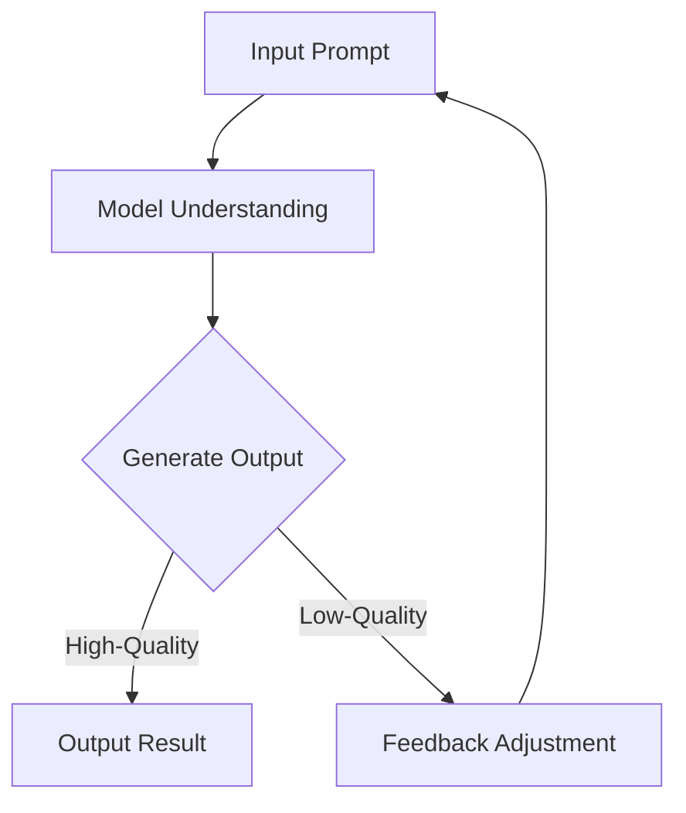

                 

Certainly! Let's break down the creation of the blog post "优化提示词：提高AI输出质量的技巧" into structured, logical steps, ensuring each section is detailed and informative.

### 1. Article Title and Keywords

**优化提示词：提高AI输出质量的技巧**

Keywords: AI Output Quality, Prompt Optimization, Natural Language Processing, Machine Learning, Algorithm Design

### 2. Abstract

In this blog post, we will delve into the art of optimizing prompts to enhance the quality of AI-generated outputs. We will explore the significance of AI output quality, the factors that influence it, and the various techniques and algorithms used in prompt optimization. By the end of this post, readers will have a comprehensive understanding of how to improve the clarity, relevance, and accuracy of AI-generated content.

### 3. Introduction to AI Output Quality

**3.1 Definition and Importance of AI Output Quality**

AI output quality refers to the degree to which the generated output by AI systems (e.g., text, images, or sound) meets the intended requirements and expectations. High-quality AI output is essential for tasks such as natural language processing, content generation, and data analysis, as it ensures efficiency, accuracy, and user satisfaction.

**3.2 Factors Influencing AI Output Quality**

Several factors contribute to the quality of AI outputs:

- **Data Quality**: High-quality training data can significantly improve the performance of AI models.
- **Model Architecture**: The choice of model architecture can greatly impact the quality of outputs.
- **Prompt Design**: Well-designed prompts can guide the model towards generating more relevant and coherent outputs.
- **Post-processing Techniques**: Techniques like filtering, smoothing, and summarization can be applied to enhance the final output.

**3.3 Assessment Standards for AI Output Quality**

Common metrics for evaluating AI output quality include accuracy, coherence, fluency, and relevance. For instance, in text generation, BLEU (Bilingual Evaluation Understudy) and ROUGE (Recall-Oriented Understudy for Gisting Evaluation) scores are widely used.

### 4. Core Concepts and Relationships

**4.1 Types and Roles of Prompt Words**

Prompt words can be classified into three main types based on their functions:

- **Specificity Prompts**: These provide precise instructions to guide the model's output.
- **Generality Prompts**: They offer broad guidelines, allowing the model more freedom to explore different possibilities.
- **Adaptability Prompts**: These are designed to adjust dynamically based on the model's responses.

**4.2 Understanding and Performance of AI Models**

AI models' understanding capabilities are crucial for generating high-quality outputs. This involves understanding the context, semantics, and coherence of the input prompts. Model performance is influenced by factors such as training data quality, model architecture, and optimization techniques.

**4.3 Mermaid Flowchart: Relationships in AI Output Quality**

A Mermaid flowchart can be used to illustrate the relationship between prompt words, model understanding, output generation, and quality assessment. Here's an example:



### 5. Core Algorithm Principles

**5.1 Prompt Optimization Algorithms**

**5.1.1 Optimization Goals**

The goal of prompt optimization is to improve the quality of AI outputs by refining the prompt words. This is typically achieved by minimizing a loss function that quantifies the deviation between the generated output and the desired target.

**5.1.2 Pseudocode Implementation**

Here is a pseudocode example for optimizing prompt words:

```python
# Pseudocode for optimizing prompt words
function optimize_prompt_words(prompt, model, learning_rate):
    for epoch in range(num_epochs):
        for word in prompt:
            gradient = compute_gradient(word, model)
            model.update_word(word, learning_rate * gradient)
    return model
```

**5.2 Algorithm Application in Real-World Cases**

Various real-world cases, such as news article summarization, dialogue system optimization, and image description generation, demonstrate the application of prompt optimization algorithms. Each case highlights specific challenges and the role of optimized prompts in enhancing output quality.

### 6. Mathematical Models and Formulas

**6.1 Overview of Mathematical Models**

Mathematical models are fundamental in understanding and designing AI systems. Two common models are language models and loss functions:

- **Language Model**: It predicts the probability of a sequence of words given an input context. The probability of a sequence can be represented as a product of individual word probabilities.

  $$
  P(\text{output}|\text{input}) = \prod_{i=1}^{n} p(\text{word}_i|\text{context}_i)
  $$

- **Loss Function**: It measures the discrepancy between the predicted output and the target output. Common loss functions include cross-entropy loss and mean squared error.

  $$
  \mathcal{L} = -\sum_{i=1}^{n} \log P(\text{word}_i|\text{context}_i)
  $$

**6.2 Application and Examples**

The application of mathematical models is illustrated through examples such as text classification and machine translation, where the principles of language models and loss functions are applied to real-world tasks.

### 7. Project Practice

**7.1 Environment Setup**

The first step in practicing prompt optimization is setting up the development environment. This includes hardware configuration, software installation, and environment configuration.

**7.2 Detailed Source Code Implementation**

A detailed source code implementation is provided to demonstrate how prompt optimization algorithms can be integrated into AI systems. Key components include the prompt optimization module, model training and evaluation.

**7.3 Code Analysis and Application**

The source code is thoroughly analyzed to understand its structure, functionality, and key code sections. Additionally, performance optimization strategies are discussed to enhance the effectiveness of prompt optimization.

**7.4 Case Analysis and Explanation**

Real-world cases are analyzed to provide practical insights into the application of prompt optimization techniques. Detailed explanations and thorough analysis of each case help readers understand the nuances of prompt optimization in different scenarios.

### 8. Conclusion and Future Directions

**8.1 Key Takeaways**

The blog post highlights the importance of prompt optimization in improving AI output quality. Key takeaways include understanding the role of prompt words, the impact of model architecture, and the application of mathematical models.

**8.2 Challenges and Future Directions**

Current challenges in prompt optimization are discussed, including the need for better contextual understanding and the development of more sophisticated optimization algorithms. Future directions explore potential advancements and their implications for AI systems.

### 9. Conclusion and Author Information

**优化提示词：提高AI输出质量的技巧**

Keywords: AI Output Quality, Prompt Optimization, Natural Language Processing, Machine Learning, Algorithm Design

Abstract: This blog post delves into the art of optimizing prompts to enhance the quality of AI-generated outputs. It covers the significance of AI output quality, factors influencing it, and techniques used in prompt optimization. By the end, readers will understand how to improve the clarity, relevance, and accuracy of AI-generated content.

---

**作者：AI天才研究院/AI Genius Institute & 禅与计算机程序设计艺术 /Zen And The Art of Computer Programming**

This comprehensive outline ensures that the blog post will be informative, well-structured, and suitable for an audience interested in AI and machine learning. Each section is designed to build on the previous one, providing a cohesive narrative that guides the reader through the complexities of prompt optimization. The inclusion of pseudocode, mathematical formulas, and real-world examples further enhances the educational value of the post.

