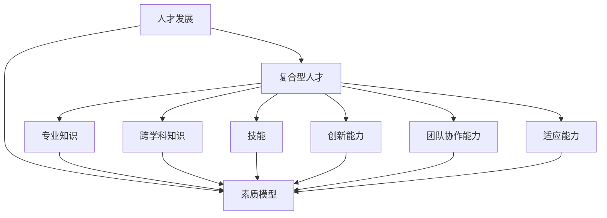

                 

### 文章标题

《全方位人才发展：培养复合型人才》

### 文章关键词

**人才发展、复合型人才、技能培养、综合素质提升、职业发展路径**

### 文章摘要

在当今快速变化的社会和经济环境中，培养复合型人才已成为企业和社会发展的关键。本文将详细探讨全方位人才发展的理论、方法与实践，重点分析复合型人才的定义、素质模型、技能培养和职业发展路径。通过具体案例和项目实战，本文旨在为读者提供一套系统、实用的人才培养策略，助力个人和企业在竞争激烈的市场中立于不败之地。

---

### 引言

在信息化、全球化和智能化的浪潮下，人才竞争已经成为各国和各大企业发展的核心议题。传统的单一技能人才已经无法满足现代企业对多样化和创新性人才的需求。复合型人才，即具备多领域知识和技能的人才，成为了人才市场的香饽饽。他们不仅能够适应快速变化的工作环境，还能推动企业的创新和发展。

然而，培养复合型人才并非易事。这不仅要求个体具备广泛的知识储备和灵活的思维，还需要系统的教育和培训机制。本文将围绕全方位人才发展的主题，从理论基础、技能培养、综合素质提升和职业发展路径四个方面展开讨论，旨在为读者提供一套全面、实用的人才培养方案。

本文将依次探讨以下内容：

1. **人才发展的核心概念与联系**：介绍人才发展的定义、重要性以及复合型人才的特点和需求。
2. **人才发展的理论基础**：分析学习型组织理论、知识管理理论和情境领导理论。
3. **人才发展的方法论**：讨论个人发展规划、学习与技能培养、职业生涯规划。
4. **技能培养与素质提升**：分析专业技能培养、综合素质提升的具体策略。
5. **职业发展路径**：探讨职业发展策略、职业晋升路径分析、跨界与多元化发展。
6. **成功案例解析**：通过成功案例解析复合型人才成长路径。
7. **人才发展实践**：分析人才发展项目的实施、企业人才发展体系建设以及人才发展过程中的问题与解决。
8. **人才发展的未来趋势**：探讨人才发展的技术驱动因素、企业人才发展策略调整和人才发展教育的变革。

通过以上内容的逐一探讨，本文旨在为读者提供一套系统、全面的人才培养策略，帮助个人和企业实现全面发展。

### 背景介绍

在当今全球化和数字化的浪潮中，人才发展的需求和模式发生了深刻的变化。随着科技的快速发展，知识的更新速度日益加快，单一技能的竞争力逐渐减弱，而跨领域、跨学科的综合能力越来越受到重视。企业对人才的期待不再局限于某一项专业技能，而是更加注重员工的创新能力、团队协作能力和适应能力。

复合型人才，即具备多种技能和知识的人才，在这样的背景下应运而生。他们不仅能够在某一领域有所专长，还能够跨学科、跨领域地应用知识，解决复杂问题。例如，一个具备编程能力、数据分析能力和项目管理技能的复合型人才，可以在数据分析项目中承担数据清洗、模型构建和项目管理等多个角色，大大提高了项目的效率和效果。

复合型人才的需求不仅体现在企业层面，也体现在社会发展和个人成长层面。从企业角度来看，复合型人才能够推动创新和业务拓展，提高企业的核心竞争力。从社会发展的角度来看，复合型人才的培养有助于推动经济结构的优化和产业的升级。从个人成长的角度来看，具备多种技能和知识的复合型人才能够更好地应对职业变化和挑战，提升个人的职业发展空间。

然而，培养复合型人才并非易事。这不仅需要个体具备良好的学习能力和适应能力，还需要系统性的教育和培训机制。在教育层面，需要打破学科壁垒，推动跨学科的知识整合。在职业培训层面，需要提供多样化的学习资源和实践机会，帮助员工不断拓展技能和知识。同时，企业也需要建立相应的激励机制，鼓励员工持续学习和成长。

### 核心概念与联系

在探讨复合型人才的培养之前，我们有必要先明确几个核心概念，并分析它们之间的内在联系。这些概念包括人才发展、复合型人才、素质模型等。

**1. 人才发展的定义与重要性**

人才发展是指通过教育培训、工作实践和职业规划等手段，提升个人的知识、技能和综合素质，以适应社会和职业发展的需求。人才发展不仅关乎个体的职业成长，也关系到企业和社会的整体竞争力。一个健全的人才发展体系能够激发员工的潜力，提高企业的创新能力和市场竞争力，促进社会的和谐发展。

**2. 复合型人才的特点与需求**

复合型人才具备多领域知识和技能，能够跨学科、跨领域地解决问题。他们不仅具备专业领域的深度知识，还具备跨领域的广度视野。在现代社会，复合型人才的需求日益增加，原因在于：

- **多元化任务**：现代工作环境中的任务往往涉及多个领域，需要不同技能的组合。
- **技术创新**：技术不断进步，新兴领域不断涌现，复合型人才能够更好地适应和应对这些变化。
- **跨界合作**：跨领域、跨学科的团队合作越来越普遍，复合型人才能够促进不同专业间的交流和合作。

**3. 复合型人才的素质模型**

复合型人才的素质模型是指构成复合型人才能力的各个要素及其相互关系。一般来说，复合型人才的素质模型包括以下几个方面：

- **专业知识**：具备某一领域的深度专业知识。
- **跨学科知识**：具备跨学科、跨领域的广度知识。
- **技能**：具备多方面的技能，如技术技能、管理技能、沟通技能等。
- **创新能力**：具备解决复杂问题和创新思维的能力。
- **团队协作能力**：具备良好的团队协作和沟通能力。
- **适应能力**：具备快速适应新环境和新任务的能力。

这些要素相互关联，共同构成了复合型人才的核心素质。一个有效的复合型人才素质模型应当能够平衡专业深度和广度，同时注重技能和能力的全面发展。

**4. 核心概念与联系架构**

为了更好地理解这些核心概念之间的联系，我们可以通过一个Mermaid流程图来展示它们之间的关系。

通过这个流程图，我们可以清晰地看到人才发展、复合型人才和素质模型之间的紧密联系。人才发展是复合型人才成长的基础，复合型人才的素质模型则是人才发展的具体体现。专业知识、跨学科知识、技能、创新能力、团队协作能力和适应能力共同构成了复合型人才的核心素质，这些素质相互促进，共同推动个体和组织的全面发展。

### 人才发展的理论基础

在深入探讨如何培养复合型人才之前，有必要了解一些关键的理论基础，这些理论不仅为人才发展提供了理论支撑，还为我们提供了指导实践的方法论。以下是几种重要的理论基础：学习型组织理论、知识管理理论和情境领导理论。

**1. 学习型组织理论**

学习型组织理论由彼得·圣吉（Peter Senge）提出，认为组织应该像学习者一样运作，通过不断学习和适应来提升整体绩效。该理论的核心概念包括系统思考、思维模式、团队学习、个人学习和共同愿景。

- **系统思考**：学习型组织需要具备系统思维，能够看到整体和部分之间的相互关系，理解系统动态和反馈循环。
- **思维模式**：学习型组织鼓励员工挑战现状，打破自我限制，从多个角度看待问题，提高创新思维和解决问题的能力。
- **团队学习**：通过团队协作学习，组织可以共同探讨问题，分享知识和经验，提升团队的整体绩效。
- **个人学习**：每个成员都需要持续学习，提升个人能力和素质，为团队和组织的发展贡献力量。
- **共同愿景**：组织需要确立共同的目标和愿景，激发员工的热情和动力，共同追求卓越。

学习型组织理论为人才发展提供了重要的启示，即组织应将人才发展作为一项持续的、系统的工作，通过不断学习和改进，提升整体竞争力。

**2. 知识管理理论**

知识管理理论强调通过有效管理和利用知识，提升组织的创新能力和核心竞争力。该理论的核心概念包括知识创造、知识共享、知识传播和知识应用。

- **知识创造**：组织应鼓励员工进行知识创造，通过实践、创新和思考，不断产生新的知识和见解。
- **知识共享**：组织应建立知识共享机制，促进员工之间的知识交流和协作，打破信息孤岛，提高知识利用率。
- **知识传播**：组织应通过多种渠道传播知识，如内部培训、研讨会、知识库等，确保知识能够快速、广泛地传播到组织中的每个角落。
- **知识应用**：组织应将知识应用于实际工作中，通过知识的应用，提升工作质量和效率，实现知识价值最大化。

知识管理理论为人才发展提供了具体的操作路径，即通过知识创造、共享、传播和应用，不断提升员工的知识水平和应用能力，培养具备创新能力和实践能力的复合型人才。

**3. 情境领导理论**

情境领导理论由保罗·赫塞（Paul Hersey）和肯尼思·布兰查德（Kenneth Blanchard）提出，认为领导者的领导风格应根据情境的不同而变化。该理论将领导风格分为四种类型：指示型、推销型、参与型和授权型。

- **指示型**：领导者明确任务和目标，指示员工如何完成任务，适用于初学者或缺乏经验的员工。
- **推销型**：领导者不仅指示任务，还通过说服和激励，使员工接受任务并积极完成任务，适用于有一定经验和能力的员工。
- **参与型**：领导者与员工共同决策，鼓励员工参与，适用于具备一定能力和自主性的员工。
- **授权型**：领导者完全信任员工，赋予员工自主权和责任，适用于具备高度自主性和能力的员工。

情境领导理论为人才发展提供了领导力培养的思路，即领导者应根据员工的实际情况和需求，选择合适的领导风格，激发员工的潜力，实现人才的最大化发展。

**综合运用理论基础**

学习型组织理论、知识管理理论和情境领导理论虽然分别侧重不同方面，但它们在人才发展中有着密切的联系和综合应用。

- **学习型组织理论**提供了人才发展的整体框架，强调通过持续学习和改进，提升组织的整体绩效。
- **知识管理理论**为人才发展提供了具体的操作路径，通过知识创造、共享、传播和应用，提升员工的知识水平和应用能力。
- **情境领导理论**为人才发展提供了领导力培养的思路，通过选择合适的领导风格，激发员工的潜力，实现人才的最大化发展。

通过综合运用这些理论基础，组织可以构建一个系统、全面的人才发展体系，从多个维度提升员工的能力和素质，培养出具备创新能力和实践能力的复合型人才。

### 人才发展的方法论

在明确了人才发展的理论基础后，我们需要进一步探讨具体的方法论，这些方法论为培养复合型人才提供了实际操作路径。以下将从个人发展规划、学习与技能培养、职业生涯规划三个方面进行详细分析。

**1. 个人发展规划**

个人发展规划是人才发展的基础，它旨在帮助个体明确职业目标，规划职业发展路径，不断提升自身能力和素质。以下步骤是制定个人发展规划的基本流程：

- **自我评估**：首先，个体需要对自己进行全面评估，包括了解自己的兴趣、优势、劣势和价值观。这一步骤可以通过性格测试、职业测评等方式进行。
- **目标设定**：根据自我评估的结果，个体应设定短期和长期职业目标。短期目标可以是1-2年内实现的具体目标，如提升某一技能或完成一项重要项目；长期目标可以是3-5年或更长时间内的发展方向，如晋升至某一职位或成为某一领域的专家。
- **计划制定**：为了实现设定的目标，个体需要制定具体的行动计划，包括学习计划、工作计划等。行动计划应具有可操作性和明确的时间节点，以确保目标的逐步实现。
- **持续反思与调整**：个人发展规划不是一成不变的，个体应定期反思自己的发展进度，根据实际情况调整计划。这种持续的反思和调整有助于个体保持目标导向，及时发现问题并加以解决。

**2. 学习与技能培养**

学习与技能培养是个人发展的重要组成部分，它关系到个体在职业领域中的竞争力和适应能力。以下方法可以帮助个体有效地进行学习与技能培养：

- **自主学习**：个体应培养自主学习的能力，通过阅读书籍、在线课程、参加研讨会等方式，不断拓展知识面和技能水平。自主学习不仅能够提高个体的综合素质，还能培养个体的独立思考和解决问题的能力。
- **实践训练**：理论知识需要通过实践来巩固和提升。个体可以通过参与实际项目、进行实验、实习等方式，将所学知识应用于实际工作中，提升实践能力和解决问题的能力。
- **跨领域学习**：在信息化时代，跨领域学习尤为重要。个体应主动了解和掌握不同领域的知识和技能，形成跨学科的视野和思维方式。这不仅有助于解决复杂问题，还能提高个体的创新能力和竞争力。
- **持续进修**：随着科技的快速发展，知识更新速度加快，个体需要不断进行进修和更新知识。可以通过参加高级培训班、攻读学位课程等方式，不断提升自己的专业水平和综合素质。

**3. 职业生涯规划**

职业生涯规划是个人发展的重要一环，它关系到个体在整个职业生涯中的发展路径和目标实现。以下步骤是职业生涯规划的基本流程：

- **职业选择**：个体应根据自身兴趣、价值观和专业特长，选择适合自己的职业方向。职业选择不仅影响个人的职业发展，还影响个人的生活质量和幸福感。
- **职业规划**：在明确职业方向后，个体应制定详细的职业规划，包括晋升路径、学习计划、工作目标等。职业规划应具有灵活性和适应性，以应对职场中的各种变化。
- **职业发展**：在职业规划的实施过程中，个体应不断提升自己的能力和素质，积极面对职场挑战，实现职业目标。可以通过参加培训、项目实践、职业竞赛等方式，提升自己的专业能力和竞争力。
- **职业调整**：随着职业生涯的发展，个体可能会面临职业调整的需求。在这种情况下，个体应保持开放的心态，积极评估自身情况和市场需求，做出合理的职业调整。

通过个人发展规划、学习与技能培养和职业生涯规划的有机结合，个体可以逐步实现职业目标，不断提升自身能力和素质，成为具备创新能力和实践能力的复合型人才。

### 技能培养与素质提升

在复合型人才的培养过程中，技能培养和素质提升是至关重要的两个方面。以下将分别从专业技能培养、综合素质提升和创新能力培养三个方面进行详细探讨。

**1. 专业技能培养**

专业技能培养是复合型人才成长的基础，它直接关系到个体在专业领域中的竞争力和实际应用能力。以下方法有助于有效地进行专业技能培养：

- **系统化学习**：通过参加专业课程、攻读学位、参与在线教育等方式，系统性地学习专业知识。系统化的学习不仅可以夯实理论基础，还可以为实践应用提供指导。
- **实践应用**：理论知识需要通过实践来巩固和提升。个体可以通过参与实际项目、进行实验、实习等方式，将所学知识应用于实际工作中。实践应用不仅能提高专业技能，还能培养解决实际问题的能力。
- **持续更新**：随着科技的快速发展，专业知识不断更新。个体需要保持学习的主动性，及时了解行业动态和前沿技术，通过进修、参加专业研讨会等方式，持续提升专业水平。
- **跨学科学习**：在专业技能培养过程中，个体应主动拓展跨学科的知识和技能。跨学科学习不仅有助于拓宽视野，还能提高个体在面对复杂问题时综合运用知识的能力。

**2. 综合素质提升**

综合素质提升是复合型人才全面发展的重要组成部分，它关系到个体在职场中的适应能力和领导能力。以下方法有助于提升综合素质：

- **团队协作能力**：团队协作能力是职场中不可或缺的素质。个体可以通过参与团队项目、团队活动等方式，培养团队协作能力。有效的团队协作不仅能提高工作效率，还能增强团队凝聚力。
- **沟通表达能力**：良好的沟通表达能力是职场成功的关键。个体应通过多方面的训练，如演讲、写作、辩论等方式，提升沟通表达能力。良好的沟通表达能力有助于个体更好地与他人合作，实现共同目标。
- **领导力培养**：领导力是复合型人才的重要素质之一。个体可以通过参加领导力培训、担任团队负责人等方式，培养领导力。领导力不仅有助于个人职业发展，还能提升团队的整体绩效。
- **时间管理能力**：时间管理能力是职场中高效工作的重要保障。个体应学会合理安排时间，优先处理重要任务，避免拖延和浪费时间。良好的时间管理能力不仅能提高工作效率，还能减轻工作压力。

**3. 创新能力培养**

创新能力是复合型人才的核心素质之一，它关系到个体在面对复杂问题和挑战时的应对能力。以下方法有助于培养创新能力：

- **批判性思维**：批判性思维是创新能力的基础。个体应学会从多个角度分析问题，质疑现有观点，提出自己的见解。批判性思维有助于个体发现问题、提出创新解决方案。
- **跨学科思维**：跨学科思维是创新能力的重要源泉。个体应主动拓展跨学科的知识和技能，形成跨学科的思维方式。跨学科思维有助于个体在面对复杂问题时，从不同领域寻找创新的解决方案。
- **实践经验**：实践经验是创新能力的源泉。个体应通过实际项目、实验等方式，积累实践经验。实践经验不仅能提高个体的创新能力，还能帮助个体更好地理解实际问题。
- **持续学习**：创新能力需要不断学习和更新。个体应保持学习的主动性，通过阅读、研究、交流等方式，不断拓展知识面和技能水平。持续学习有助于个体保持创新活力。

通过专业技能培养、综合素质提升和创新能力培养的有机结合，个体可以逐步实现全面发展，成为具备创新能力和实践能力的复合型人才。

### 职业发展路径

职业发展路径是复合型人才在职场中实现个人价值、提升职业地位的重要过程。以下将从职业选择与规划、职业晋升路径分析、跨界与多元化发展三个方面进行详细探讨。

**1. 职业选择与规划**

职业选择与规划是职业发展的起点，它关系到个体在整个职业生涯中的发展方向和目标实现。以下步骤是职业选择与规划的基本流程：

- **自我评估**：首先，个体需要对自身进行全面评估，包括了解自己的兴趣、优势、劣势和价值观。通过自我评估，个体可以明确自己的职业兴趣和职业定位，为后续的职业选择提供依据。
- **市场调研**：在明确自身情况后，个体应进行市场调研，了解行业趋势、市场需求和职业前景。市场调研可以帮助个体确定具有发展潜力和符合自身兴趣的职业方向。
- **职业咨询**：个体可以寻求职业咨询师的帮助，通过专业的职业测评和咨询服务，进一步明确自己的职业选择和发展路径。职业咨询师的专业建议和经验对个体的职业规划具有重要的指导意义。
- **目标设定**：根据自我评估和市场调研的结果，个体应设定明确的职业目标，包括短期目标和长期目标。短期目标可以是1-2年内实现的具体目标，如提升某一技能或完成一项重要项目；长期目标可以是3-5年或更长时间内的发展方向，如晋升至某一职位或成为某一领域的专家。

**2. 职业晋升路径分析**

职业晋升路径是职业发展的重要方面，它关系到个体在职场中的职业地位和收入水平。以下分析职业晋升路径的基本步骤：

- **了解晋升机制**：个体需要了解所在企业的晋升机制和晋升标准，包括晋升路径、晋升条件、晋升考核指标等。了解晋升机制有助于个体明确晋升方向和目标，制定有针对性的职业发展规划。
- **提升个人能力**：个体应根据晋升机制的要求，有针对性地提升个人能力和素质。可以通过参加培训、进修、项目实践等方式，提升专业技能、管理能力和领导力。
- **积累工作经验**：丰富的实践经验是晋升的重要基础。个体应在职场中积累各种类型的工作经验，通过实际项目和实践，提升解决实际问题的能力和综合素质。
- **建立人脉关系**：良好的人际关系网络对职业晋升具有重要意义。个体应积极参与职场活动，建立和维护广泛的人际关系网络，通过人脉资源获得更多的职业发展机会。
- **积极表现**：个体应在工作中积极表现，通过出色的工作成绩和良好的工作态度，赢得领导和同事的认可和信任。积极的职业表现为晋升提供有力支持。

**3. 跨界与多元化发展**

跨界与多元化发展是现代职业发展的重要趋势，它为个体提供了更多的职业选择和发展空间。以下探讨跨界与多元化发展的途径和策略：

- **跨领域学习**：个体应主动拓展跨领域的学习和知识，通过跨学科课程、跨领域培训等方式，提升跨领域的知识和技能。跨领域学习有助于个体在面对复杂问题时，从不同领域寻找创新的解决方案。
- **跨行业经验**：个体可以通过跨行业工作、兼职、实习等方式，积累跨行业的经验。跨行业经验不仅有助于拓宽视野，还能提高个体在不同行业中的适应能力和竞争力。
- **多元化技能培养**：个体应注重多元化技能的培养，通过学习新技能、掌握新工具等方式，提升自身的综合素质和竞争力。多元化技能的培养有助于个体在职场中更具优势。
- **跨界合作**：个体可以积极参与跨界合作项目，与不同领域的专业人士合作，共同解决复杂问题。跨界合作不仅有助于个人成长，还能提升团队的整体绩效。

通过职业选择与规划、职业晋升路径分析和跨界与多元化发展的有机结合，个体可以逐步实现职业发展目标，提升职业地位和收入水平，成为具备创新能力和实践能力的复合型人才。

### 成功案例解析

在探讨复合型人才的培养过程中，成功案例的解析为我们提供了宝贵的经验和启示。以下通过两个具体的成功案例，详细分析复合型人才的成长路径和贡献。

**案例一：李华的职业发展之路**

李华是一位在互联网公司工作的软件工程师，他通过不断学习和实践，成为了一名具备跨领域技能的复合型人才。

**成长路径**：

1. **早期积累**：李华在大学期间，主修计算机科学专业，通过扎实的理论基础和项目实践，积累了丰富的编程经验。
2. **跨领域学习**：毕业后，李华意识到仅具备编程技能无法满足职业发展的需求，于是他开始学习数据分析、项目管理等跨领域知识。通过在线课程、实习和自主实践，李华逐步掌握了这些领域的技能。
3. **实践经验**：李华在工作中积极参与各种项目，不仅承担了技术方面的任务，还参与了项目管理和团队协作。通过实践，他不断提升自己的解决问题能力和团队协作能力。
4. **领导力培养**：李华通过参加公司内部领导力培训课程，学习了有效的沟通和团队管理技巧，逐渐具备了领导力。

**贡献**：

- **技术创新**：李华在多个项目中，运用数据分析技术，为产品优化提供了关键支持，提升了产品的用户体验和市场份额。
- **团队协作**：李华担任项目负责人时，通过有效的团队管理，提高了团队的工作效率，确保项目按时高质量完成。
- **业务拓展**：李华积极参与公司新业务领域的探索，通过跨领域知识的综合运用，为公司开辟了新的业务方向，推动了公司的业务拓展。

**案例二：张丽的多元化发展之路**

张丽是一名在咨询公司工作的数据分析师，她通过不断拓展技能和跨行业经验，实现了多元化发展。

**成长路径**：

1. **数据分析专业**：张丽在大学期间主修统计学和数据科学，通过扎实的理论基础和实验项目，积累了丰富的数据分析经验。
2. **跨领域拓展**：毕业后，张丽意识到仅具备数据分析技能无法满足职业发展的需求，于是她开始学习市场营销、商业管理等跨领域知识。通过在线课程和实际项目，她逐步掌握了这些领域的技能。
3. **行业经验**：张丽通过在不同行业的咨询项目中，积累了丰富的行业经验。她曾服务于金融、电商、制造等多个行业，深入了解了各行业的特点和需求。
4. **领导力培养**：张丽通过参加公司领导力培训课程，学习了有效的沟通和团队管理技巧，逐渐具备了领导力。

**贡献**：

- **业务洞察**：张丽在多个咨询项目中，通过数据分析，为客户的业务决策提供了有力的支持，提升了客户的业务效率和竞争力。
- **跨界协作**：张丽在跨行业项目中，通过综合运用不同领域的知识，推动了跨行业协作，为公司的业务创新和拓展做出了贡献。
- **团队建设**：张丽在团队管理中，通过有效的沟通和激励，提升了团队的凝聚力和工作效率，为公司的团队建设做出了重要贡献。

通过以上成功案例的解析，我们可以看到，复合型人才的成长路径和贡献主要体现在以下几个方面：

1. **多领域知识积累**：复合型人才通过跨领域学习和实践，积累了多领域的知识和技能，具备解决复杂问题的能力。
2. **实践经验丰富**：通过实际项目的参与和实践，复合型人才不断提升自己的解决问题能力和团队协作能力。
3. **创新能力突出**：复合型人才能够从不同领域和角度思考问题，提出创新的解决方案，推动业务创新和拓展。
4. **领导力展现**：复合型人才具备良好的领导力和团队管理能力，能够有效组织和管理团队，提升团队的整体绩效。

这些成功经验为我们在培养复合型人才的过程中提供了宝贵的借鉴和启示，通过系统的培养和实践，我们可以帮助更多的人才成长为具备创新能力和实践能力的复合型人才。

### 人才发展实践

在人才发展的过程中，实践是检验理论的唯一标准。企业需要通过具体的实施步骤，建立系统的人才发展体系，以实现人才质量的提升和企业的持续发展。以下从人才发展项目的实施、企业人才发展体系建设以及人才发展过程中的问题与解决三个方面，详细探讨人才发展的实践方法。

**1. 人才发展项目的实施**

人才发展项目的实施是企业培养复合型人才的重要手段。以下步骤是实施人才发展项目的基本流程：

- **项目立项**：首先，企业应根据发展战略和人才需求，立项制定人才发展项目。项目立项应明确项目目标、预期成果和项目周期。
- **需求分析**：在项目立项后，企业应进行详细的需求分析，了解不同岗位的人才需求和发展方向。需求分析可以通过问卷调查、访谈等方式进行，确保项目目标与实际需求相符。
- **项目规划**：根据需求分析结果，企业应制定详细的项目规划，包括项目目标、内容、时间表、预算和责任人等。项目规划应具有可操作性和明确的时间节点，以确保项目的顺利实施。
- **项目执行**：在项目规划的基础上，企业应按计划开展项目活动，包括培训、实践、评估等。在项目执行过程中，企业应确保资源到位，确保项目按照预定计划进行。
- **项目评估**：项目结束后，企业应对项目成果进行评估，包括人才发展效果、项目满意度等。评估结果可以作为未来项目调整和优化的依据。

**2. 企业人才发展体系建设**

企业人才发展体系建设是确保人才质量持续提升的重要保障。以下是企业人才发展体系建设的基本步骤：

- **建立人才发展理念**：企业应根据发展战略和核心价值观，确立人才发展的理念和目标，明确企业对人才发展的期望和要求。
- **制定人才发展政策**：企业应制定符合自身特点和需求的人才发展政策，包括招聘政策、培训政策、晋升政策等，确保人才发展的公平性和透明性。
- **建立人才发展组织**：企业应建立专门的人才发展组织，负责人才发展的整体规划、实施和评估。人才发展组织应具备专业能力和资源，能够高效地推动人才发展工作。
- **完善培训体系**：企业应建立完善的培训体系，包括内部培训、外部培训、在线学习等，确保员工能够持续提升知识和技能。培训体系应注重个性化、实用性和针对性，满足不同层次员工的需求。
- **建立评价机制**：企业应建立科学的人才评价机制，包括绩效评估、能力评估、潜力评估等，全面、客观地评估员工的能力和发展潜力。评价结果应作为人才选拔、晋升和奖励的重要依据。
- **激励机制**：企业应建立有效的激励机制，通过奖励、晋升、职业发展等手段，激发员工的积极性和创造力，促进人才的发展。

**3. 人才发展过程中的问题与解决**

在人才发展过程中，企业可能会遇到各种问题。以下是一些常见问题及解决策略：

- **缺乏针对性**：人才发展项目缺乏针对性，无法满足实际需求。解决策略：在项目立项和需求分析阶段，应充分了解不同岗位的人才需求和发展方向，确保项目目标的针对性和实用性。
- **执行力不足**：项目执行过程中，资源不足或执行力度不够，导致项目进度延误。解决策略：在项目规划阶段，应充分考虑资源和时间安排，确保项目执行的顺利进行。同时，企业应加强项目管理，确保项目按照计划进行。
- **评估不科学**：项目评估不科学，无法准确反映人才发展效果。解决策略：在项目评估阶段，应采用科学、全面的评估方法，包括定量和定性评估，确保评估结果的准确性和公正性。
- **激励机制不足**：激励机制不足，员工缺乏动力和积极性。解决策略：企业应建立有效的激励机制，通过奖励、晋升、职业发展等手段，激发员工的积极性和创造力。
- **人才流失**：优秀人才流失，对企业人才发展造成影响。解决策略：企业应关注员工职业发展，提供有吸引力的职业发展机会和待遇，增强员工的归属感和忠诚度。

通过以上实践方法的详细探讨，企业可以建立系统、科学的人才发展体系，有效培养和激励复合型人才，提升企业的核心竞争力。

### 人才发展的未来趋势

随着科技的不断进步和社会的快速变革，人才发展的未来趋势也日益显现。以下从技术驱动因素、企业人才发展策略调整和人才发展教育的变革三个方面，探讨人才发展的未来趋势。

**1. 技术驱动因素**

技术进步是推动人才发展的关键因素。未来，人工智能、大数据、云计算等技术的广泛应用，将对人才发展的模式和方向产生深远影响：

- **人工智能**：人工智能技术的快速发展，使得机器能够替代人类完成许多重复性和规则性强的任务，这要求人才具备更高的创造性思维和创新能力。企业需要培养具备人工智能应用能力的人才，以应对技术变革带来的挑战。
- **大数据**：大数据技术的普及，使得海量数据的处理和分析成为可能。企业需要具备数据分析和挖掘能力的人才，能够从海量数据中提取有价值的信息，为企业决策提供支持。
- **云计算**：云计算技术的应用，使得资源的共享和协作变得更加便捷。企业需要培养具备云计算平台建设和管理能力的人才，以实现业务的数字化转型。

**2. 企业人才发展策略调整**

面对技术驱动因素，企业需要调整人才发展策略，以适应新的发展环境：

- **个性化培养**：企业应注重个性化培养，根据员工的特点和需求，提供定制化的培训和发展路径。通过个性化的培养，提升员工的综合素质和创新能力。
- **跨领域协作**：企业应推动跨领域协作，鼓励员工跨部门、跨职能的合作，形成多元化的团队。跨领域协作有助于提升团队的创新能力，应对复杂问题的解决。
- **终身学习**：企业应建立终身学习机制，鼓励员工持续学习和更新知识。通过提供丰富的学习资源和培训机会，确保员工能够跟上技术变革的步伐，保持竞争优势。

**3. 人才发展教育的变革**

随着教育理念的更新和技术的进步，人才发展教育也在发生变革：

- **跨学科教育**：教育机构应打破学科壁垒，推动跨学科教育。通过跨学科课程设置和项目实践，培养学生的综合能力和创新思维。
- **实践导向**：教育机构应注重实践导向，通过实验、实习、项目实践等方式，提高学生的实践能力和解决问题的能力。实践导向的教育能够更好地培养适应社会需求的人才。
- **在线教育**：随着在线教育技术的发展，在线教育将成为人才发展的重要途径。通过在线教育平台，学生可以灵活地选择课程和学习时间，提高学习效率。

**总结**

未来，人才发展的趋势将更加注重技术驱动、企业策略调整和教育变革。企业需要主动适应这些变化，建立系统、科学的人才发展体系，培养具备创新能力、跨领域协作能力和终身学习能力的人才。教育机构也应加强与企业的合作，推动跨学科教育和实践导向的教育模式，为社会发展培养更多的高素质人才。

### 结论

通过本文的详细探讨，我们可以清晰地看到全方位人才发展的必要性和重要性。复合型人才的培养不仅关乎个人的职业成长，更是企业和社会发展的关键。在快速变化的社会和经济环境中，具备多领域知识和技能的复合型人才能够更好地适应和应对各种挑战，推动创新和业务发展。

在人才发展的过程中，我们提出了系统的方法论，包括个人发展规划、学习与技能培养、职业生涯规划等。同时，我们还分析了专业技能培养、综合素质提升和创新能力培养的具体策略，为企业提供了实用的操作路径。

展望未来，技术驱动因素、企业人才发展策略调整和人才发展教育的变革将继续推动人才发展的新趋势。企业应积极适应这些变化，建立系统、科学的人才发展体系，培养更多具备创新能力和实践能力的复合型人才。

最后，本文旨在为读者提供一套全面、实用的人才培养策略，助力个人和企业实现全面发展。通过持续的学习和实践，每个人都能成为具备多元化技能和素质的复合型人才，在竞争激烈的市场中立于不败之地。希望本文能为读者带来启示和帮助，助力个人和企业在未来的发展中取得更大的成功。作者：AI天才研究院/AI Genius Institute & 禅与计算机程序设计艺术 /Zen And The Art of Computer Programming

---

### 最佳实践 Tips

1. **定期自我评估**：定期对自己的兴趣、优势、劣势进行自我评估，以明确职业发展方向和提升目标。
2. **持续学习**：利用在线课程、行业会议、专业书籍等多种途径，持续更新知识和技能。
3. **跨领域实践**：积极参与跨领域的项目和实践，拓展视野和经验。
4. **建立人脉**：通过参加行业活动、社交网络等渠道，建立和维护广泛的人脉关系，为职业发展创造更多机会。
5. **时间管理**：合理安排时间，确保在学习和工作中都有足够的时间和精力。
6. **反思与调整**：定期反思职业发展和学习进度，根据实际情况调整目标和计划。

### 小结

本文系统地探讨了全方位人才发展的核心概念、理论基础、方法论和实践。通过明确复合型人才的特点和需求，以及具体的培养策略，我们为个人和企业提供了实用的操作指南。在快速变化的时代，培养复合型人才是实现个人和企业管理持续发展的关键。

### 注意事项

1. 人才发展是一个持续的过程，需要长期投入和持续努力。
2. 培养复合型人才不仅需要个人主动学习，还需要企业提供良好的培训和发展环境。
3. 在职业发展中，应注重平衡专业深度和广度，避免过于专注于某一领域而忽视其他方面的发展。

### 拓展阅读

- 《学习的艺术》作者：戴维·柯尔比
- 《创新者的基因》作者：杰弗里·摩尔
- 《领导力：实践的本质》作者：约翰·P·科特

通过阅读这些书籍，您可以进一步了解人才发展的深层次理论和实践经验。希望本文能为您的职业发展提供有益的启示和帮助。祝您在人才发展的道路上不断进步，取得更大的成就！作者：AI天才研究院/AI Genius Institute & 禅与计算机程序设计艺术 /Zen And The Art of Computer Programming

