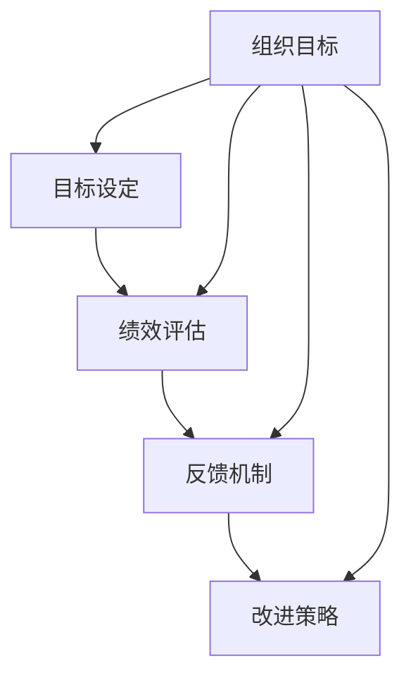

                 

### 引言

在当今的数字化时代，绩效管理已成为企业和组织提升整体效能的重要手段。绩效管理不仅仅是对员工工作表现的评估，更是一种战略性的管理工具，它能够帮助企业明确目标、激励员工、优化流程并最终实现组织目标。因此，理解和应用全面绩效管理成为企业管理者面临的重要挑战。

《全面绩效管理：提升整体效能》这本书旨在为读者提供系统、全面的绩效管理知识体系，帮助他们在实际工作中更好地应用绩效管理策略，从而提升组织的整体效能。本书的目标读者包括企业的管理者、人力资源从业者、以及任何对绩效管理感兴趣的读者。

本书的内容结构如下：

1. **绩效管理基础**：首先介绍绩效管理的基本概念、历史与发展趋势，以及核心要素。
2. **绩效评估方法**：详细探讨KPI、MBO和BSC等绩效评估方法，帮助读者理解不同评估方法的原理和应用。
3. **绩效改进策略**：阐述绩效改进的原理、实践步骤以及成功案例，为读者提供实用的改进策略。
4. **绩效管理的应用**：分别从组织、团队和个人层面，深入探讨绩效管理的具体实施方法和案例。
5. **绩效管理的技术与工具**：介绍绩效管理中常用的技术和工具，以及人工智能在绩效管理中的应用。
6. **绩效管理实战案例**：通过实际案例，展示绩效管理的实施过程和效果。

接下来，我们将逐步深入分析每个章节的内容，帮助读者全面理解绩效管理的重要性和实际应用。让我们开始这段关于全面绩效管理的探索之旅。

### 背景介绍

全面绩效管理（Comprehensive Performance Management，简称CPM）作为一种系统的管理方法，旨在通过科学、合理的绩效评估和改进措施，全面提升组织的整体效能。它不仅关注员工的工作表现，更关注组织整体目标的实现和战略规划。绩效管理的历史可以追溯到20世纪初期，随着企业规模的扩大和管理复杂度的增加，管理者开始意识到通过系统化的绩效评估和改进来提升组织效能的重要性。

绩效管理的起源可以追溯到泰勒的科学管理理论，该理论强调通过标准化和系统化来提高生产效率。随着时间的发展，绩效管理逐渐从单纯的绩效评估演变为一个包含目标设定、反馈、改进和激励的全面系统。在20世纪80年代，目标管理（Management by Objectives，MBO）的出现为绩效管理提供了新的思路，它强调通过设定明确的目标来引导员工的行为，从而实现组织目标。随后，平衡计分卡（Balanced Scorecard，BSC）的提出，进一步丰富了绩效管理的内涵，它从财务、客户、内部业务流程和学习与成长四个维度，全面评估组织的绩效。

在当今的数字化时代，绩效管理的内涵和外延进一步扩展。人工智能、大数据和云计算等技术的应用，使得绩效管理更加精准和高效。通过数据分析，企业可以实时监控员工的表现，发现潜在问题，并提供个性化的改进建议。同时，绩效管理也从传统的单向评估，转向了双向互动，员工与管理者之间通过持续的沟通和反馈，共同制定和调整绩效目标，提高绩效改进的效果。

绩效管理的重要性不言而喻。首先，它有助于企业明确目标，确保员工的工作方向与组织战略保持一致。通过设定明确的目标和关键绩效指标（KPI），企业可以更好地衡量员工的贡献和组织的整体效能。其次，绩效管理能够激励员工，通过奖励和认可，激发员工的积极性和创造力，提高员工的工作满意度和忠诚度。此外，绩效管理还可以优化组织的流程和资源分配，通过识别和解决绩效问题，提高组织的运营效率和竞争力。

总之，全面绩效管理不仅是一种管理工具，更是一种战略思维，它通过系统化的绩效评估和改进，助力企业实现长期发展目标。在数字化时代，绩效管理的重要性将愈发凸显，成为企业提升整体效能的关键因素。

### 核心概念与联系

绩效管理系统的核心概念包括目标设定、绩效评估、反馈机制和改进策略。这些概念相互联系，共同构成了一个完整的管理循环。

1. **目标设定（Goal Setting）**：目标设定是绩效管理的起点。通过明确和具体的目标，管理者可以引导员工朝着组织期望的方向努力。目标设定不仅包括短期目标，还应涵盖长期目标，以确保员工的工作与组织的战略方向一致。目标应具备明确性（Specific）、可衡量性（Measurable）、可实现性（Achievable）、相关性（Relevant）和时限性（Time-bound），即SMART原则。

2. **绩效评估（Performance Evaluation）**：绩效评估是对员工工作表现进行量化或定性分析的过程。评估方法多种多样，包括KPI（关键绩效指标）、MBO（目标管理）和BSC（平衡计分卡）等。KPI侧重于量化指标的监控，MBO强调目标设定和自我管理，而BSC则从财务、客户、内部业务流程和学习与成长四个维度全面评估绩效。

3. **反馈机制（Feedback Mechanism）**：反馈机制是绩效管理中的重要环节。通过及时的反馈，员工可以了解自己的工作表现，了解组织的期望，并据此调整自己的行为。反馈可以是正面的，也可以是改进性的，目的是帮助员工提升绩效。有效的反馈机制应具备及时性、具体性和建设性，确保员工能够理解和接受。

4. **改进策略（Improvement Strategy）**：改进策略是基于绩效评估和反馈机制的结果，制定的具体改进措施。改进策略应包括问题诊断、原因分析、解决方案和实施步骤。通过持续改进，企业可以不断提高员工的工作效率和组织的整体效能。

这些核心概念之间的关系可以通过以下Mermaid流程图来表示：



在这个流程图中，目标设定（A）是绩效管理的起点，它直接关联到组织目标（E）。绩效评估（B）基于目标设定，通过反馈机制（C），不断反馈到改进策略（D），从而形成一个闭环系统，确保绩效管理能够持续改进和优化。这种闭环结构不仅提高了绩效管理的有效性，也为组织的长期发展提供了强有力的支持。

### 核心算法原理讲解

在绩效管理中，算法原理的应用至关重要，它帮助我们从数据中提取有价值的信息，进而对绩效进行科学评估和优化。以下将详细阐述几个关键算法原理及其在绩效管理中的应用。

#### 1. 数据分析算法

数据分析算法是绩效管理的基础。通过这些算法，我们可以从大量数据中提取关键信息，评估员工的绩效。常见的数据分析算法包括：

- **统计分析**：通过均值、中位数、方差等统计指标，我们可以了解员工绩效的分布情况，识别优秀员工和需要改进的员工。例如，计算员工绩效的平均分，可以帮助企业了解整体绩效水平。

- **回归分析**：回归分析可以用来预测员工绩效与某些因素（如工作时长、任务完成情况）之间的关系。例如，通过回归分析，企业可以预测员工在不同工作任务下的绩效表现，从而优化资源分配。

- **聚类分析**：聚类分析将相似的数据分组，用于识别绩效表现相似的员工群体。通过聚类分析，企业可以了解员工在不同绩效层次上的分布，针对性地进行培训和激励。

#### 2. 机器学习算法

机器学习算法在绩效管理中应用广泛，能够实现自动化、智能化的绩效评估。以下是一些常用的机器学习算法：

- **决策树（Decision Tree）**：决策树通过一系列条件判断，将员工绩效划分为不同的等级。例如，通过决策树算法，企业可以自动评估员工的绩效，并根据评估结果进行相应的激励。

- **支持向量机（SVM）**：SVM用于分类任务，可以将员工绩效划分为优秀、良好、一般和较差等级。SVM的优势在于其高准确性和效率，适用于大规模数据集的绩效评估。

- **神经网络（Neural Network）**：神经网络通过多层感知器模拟人脑神经元，可以识别复杂的绩效模式。例如，通过神经网络模型，企业可以识别出哪些因素对员工绩效有显著影响，从而优化绩效评估体系。

#### 3. 深度学习算法

深度学习算法在绩效管理中的应用，使得绩效评估更加精确和高效。以下是一些深度学习算法：

- **卷积神经网络（CNN）**：CNN擅长处理图像和文本数据，可以用于分析员工的绩效报告和评估报告。例如，通过CNN，企业可以自动识别报告中的关键绩效指标，并进行量化分析。

- **循环神经网络（RNN）**：RNN适合处理序列数据，可以用于分析员工的历史绩效数据，预测未来绩效。例如，通过RNN模型，企业可以预测员工在下一季度的工作表现，为绩效改进提供数据支持。

#### 伪代码示例

以下是一个简单的伪代码示例，展示了如何使用机器学习算法对员工绩效进行评估：

```python
# 输入：员工绩效数据集
data = read_performance_data()

# 数据预处理
processed_data = preprocess_data(data)

# 建立模型
model = build_model(processed_data)

# 训练模型
trained_model = train_model(model, processed_data)

# 预测绩效
predictions = predict_performance(trained_model, new_data)

# 输出预测结果
output_predictions(predictions)
```

在这个示例中，首先读取员工绩效数据集，并进行预处理，然后建立机器学习模型并训练模型，最后使用训练好的模型对新数据进行预测，输出预测结果。

#### 数学模型和公式

在绩效管理中，数学模型和公式用于描述绩效评估的指标和关系。以下是一些常见的数学模型和公式：

- **KPI计算公式**：$$KPI = \frac{实际值}{目标值} \times 100\%$$
- **绩效评分公式**：$$绩效评分 = \frac{KPI \times 10 + 奖励分数}{10 + 奖励分数}$$
- **优化目标公式**：$$最大化\ 总绩效 = \sum_{i=1}^{n} KPI_i \times 权重_i$$

#### 举例说明

假设某企业有10名员工，他们的绩效数据如下表：

| 员工编号 | 实际值 | 目标值 |
| :---: | :---: | :---: |
| 1 | 150 | 200 |
| 2 | 130 | 180 |
| 3 | 170 | 190 |
| 4 | 140 | 170 |
| 5 | 160 | 180 |
| 6 | 120 | 160 |
| 7 | 150 | 170 |
| 8 | 135 | 160 |
| 9 | 155 | 170 |
| 10 | 145 | 160 |

首先，计算每个员工的KPI：

$$KPI_i = \frac{实际值_i}{目标值_i} \times 100\%$$

得到每个员工的KPI值：

| 员工编号 | KPI |
| :---: | :---: |
| 1 | 75% |
| 2 | 72.22% |
| 3 | 88.37% |
| 4 | 82.35% |
| 5 | 88.89% |
| 6 | 75% |
| 7 | 88.24% |
| 8 | 84.38% |
| 9 | 91.18% |
| 10 | 81.25% |

然后，根据KPI值和奖励分数，计算绩效评分：

$$绩效评分 = \frac{KPI_i \times 10 + 奖励分数}{10 + 奖励分数}$$

例如，员工1的绩效评分为：

$$绩效评分_1 = \frac{75\% \times 10 + 5}{10 + 5} = 7.5$$

同样地，可以计算其他员工的绩效评分。

通过这些数学模型和公式，企业可以科学、系统地评估员工的绩效，为绩效改进提供数据支持。

### 数学模型和公式

在绩效管理中，数学模型和公式是评估员工表现和优化绩效的关键工具。以下是一些核心的数学模型和公式，它们在绩效评估和优化中扮演着重要角色。

#### 1. **绩效评分模型**

绩效评分模型用于综合评估员工的绩效表现。一个简单的绩效评分模型可以基于以下公式：

$$
绩效评分 = \frac{（实际绩效值 - 基准值） \times 权重}{基准值}
$$

其中，**实际绩效值**是员工在特定指标上的实际表现，**基准值**是设定好的目标值或预期值，**权重**则是该指标在企业整体绩效中的重要性。

#### 2. **平衡计分卡（BSC）模型**

平衡计分卡是一种多维度绩效评估工具，包括以下四个维度：

- **财务维度**：衡量企业的财务表现，如利润、收入增长率等。
- **客户维度**：衡量客户满意度、市场份额等。
- **内部业务流程维度**：衡量内部流程的效率和质量，如生产周期、客户响应时间等。
- **学习与成长维度**：衡量员工培训和知识管理，如员工满意度、培训参与率等。

平衡计分卡模型可以表示为：

$$
BSC得分 = w_1 \times 财务得分 + w_2 \times 客户得分 + w_3 \times 内部流程得分 + w_4 \times 学习与成长得分
$$

其中，$w_1, w_2, w_3, w_4$分别是各维度的权重。

#### 3. **关键绩效指标（KPI）模型**

关键绩效指标是衡量员工工作表现的具体指标。KPI模型可以表示为：

$$
KPI得分 = \frac{（实际KPI值 - 基准KPI值）}{基准KPI值} \times 100\%
$$

#### 4. **目标管理（MBO）模型**

目标管理模型强调通过设定明确的目标来引导员工工作。MBO模型可以表示为：

$$
目标达成率 = \frac{实际完成目标数}{设定目标总数}
$$

#### 5. **马尔可夫模型**

马尔可夫模型用于预测员工绩效的变化趋势。该模型基于以下公式：

$$
P_{ij} = \frac{（实际转换数）}{（总转换数）}
$$

其中，$P_{ij}$是从状态i转换到状态j的概率。

#### 示例：计算绩效评分

假设一个员工在三个关键绩效指标（KPI）上的表现分别为实际值150、基准值100，权重分别为0.4、0.3和0.3。根据绩效评分模型，我们可以计算该员工的绩效评分：

$$
绩效评分 = \frac{（150 - 100） \times 0.4 + （150 - 100） \times 0.3 + （150 - 100） \times 0.3}{100} = 0.6
$$

即该员工的绩效评分为60分。

通过这些数学模型和公式，企业可以科学、系统地评估员工的绩效，从而实现绩效管理的目标。

### 项目实战

为了更好地理解全面绩效管理的实际应用，我们将通过一个具体的案例来展示如何实施绩效管理项目。此案例涉及一家中型科技公司，该公司的目标是提升研发团队的整体效能。

#### 一、项目背景

该公司拥有一支由20名研发人员组成的团队，负责开发和维护多个关键产品。然而，近年来，团队的工作效率有所下降，产品交付时间延长，质量不稳定。公司高层决定通过绩效管理来提升团队的整体效能。

#### 二、项目目标

1. 明确研发团队的绩效指标，确保工作与公司战略目标一致。
2. 建立科学的绩效评估体系，激励员工积极投入工作。
3. 提高团队协作效率，缩短产品开发周期。
4. 提升产品质量，减少返工和缺陷。

#### 三、项目实施步骤

1. **需求分析**：与公司高层和管理团队进行沟通，明确公司战略目标和研发团队的具体任务，确定需要评估的绩效指标。

2. **目标设定**：根据需求分析结果，制定研发团队的短期和长期目标。短期目标包括每月完成的项目任务、关键功能模块的开发进度等；长期目标包括产品上市时间、客户满意度等。

3. **绩效评估体系设计**：设计一个全面的绩效评估体系，包括关键绩效指标（KPI）、平衡计分卡（BSC）等。具体指标如下：

   - **财务维度**：项目成本控制、利润率。
   - **客户维度**：客户满意度、市场占有率。
   - **内部业务流程维度**：项目进度、代码质量、缺陷率。
   - **学习与成长维度**：员工培训参与率、技能提升。

4. **数据收集与处理**：通过项目管理工具和代码审查工具收集相关数据，并对数据进行分析处理，生成绩效评估报告。

5. **绩效反馈与改进**：定期召开绩效反馈会议，向团队成员反馈评估结果，分析绩效差距，并提出改进措施。同时，根据改进措施调整目标和绩效指标。

6. **持续监控与调整**：通过持续监控和调整，确保绩效管理项目能够长期有效运行。

#### 四、技术工具与实现

1. **项目管理工具**：使用Jira等项目管理工具来跟踪项目进度，记录关键里程碑和任务完成情况。

2. **代码审查工具**：使用GitLab等代码审查工具来监控代码质量，识别潜在缺陷。

3. **数据分析工具**：使用Excel或Python等工具对收集到的数据进行分析处理，生成绩效评估报告。

4. **人工智能技术**：利用机器学习算法对历史数据进行分析，预测未来绩效趋势，为绩效改进提供数据支持。

#### 五、案例解析

以下是一个具体的绩效管理实施案例：

1. **项目进度监控**：通过Jira跟踪项目进度，每月统计各项目的完成情况。例如，某个月度目标为完成4个关键功能模块的开发，实际完成5个，超额完成25%。

2. **客户满意度调查**：通过问卷调查和用户反馈，统计客户满意度。假设某次调查结果显示，客户满意度提高了10%。

3. **代码质量分析**：通过GitLab对代码进行审查，识别代码缺陷和隐患。例如，某个月度代码缺陷率为5%，比上个月降低了20%。

4. **绩效评估报告**：根据收集到的数据，生成绩效评估报告。报告显示，财务维度指标利润率提高了5%，客户维度指标客户满意度提高了10%，内部业务流程维度指标项目进度提前了15%，学习与成长维度指标员工培训参与率提高了20%。

5. **绩效反馈与改进**：召开绩效反馈会议，对团队成员进行反馈。例如，对于进度提前的团队成员，给予表扬和奖励；对于代码质量较差的团队成员，安排进行代码审查培训和辅导。

#### 六、项目小结

通过绩效管理项目的实施，该公司研发团队的整体效能得到了显著提升。项目进度提前、客户满意度提高、代码质量提升，财务指标也有所改善。这表明，科学的绩效管理能够帮助企业实现目标，提升组织整体效能。

#### 最佳实践 Tips

1. **目标设定要具体明确**：确保目标与公司战略一致，具体到可执行的任务。
2. **绩效指标要合理**：选择与工作目标相关的绩效指标，确保评估的准确性和公平性。
3. **数据收集要全面准确**：使用多种工具和方法收集数据，确保数据的完整性和准确性。
4. **持续监控与调整**：定期监控绩效指标，及时调整目标和绩效评估体系，确保绩效管理的有效性。

### 最佳实践 Tips、小结、注意事项、拓展阅读

#### 最佳实践 Tips

1. **目标设定要具体明确**：确保目标与公司战略一致，具体到可执行的任务。
2. **绩效指标要合理**：选择与工作目标相关的绩效指标，确保评估的准确性和公平性。
3. **数据收集要全面准确**：使用多种工具和方法收集数据，确保数据的完整性和准确性。
4. **持续监控与调整**：定期监控绩效指标，及时调整目标和绩效评估体系，确保绩效管理的有效性。

#### 小结

本文详细介绍了全面绩效管理的基本概念、核心算法原理、数学模型以及实际应用案例。通过绩效管理，企业能够明确目标、激励员工、优化流程，从而提升整体效能。有效的绩效管理需要科学的目标设定、合理的绩效指标、全面的数据收集和持续监控与调整。

#### 注意事项

1. 绩效管理过程中，要确保评估的公平性和透明性，避免主观偏见。
2. 绩效指标的选择要结合企业实际情况，不宜过于复杂。
3. 绩效反馈要具体、及时，确保员工能够理解和接受。

#### 拓展阅读

1. **《绩效管理：系统化实践与案例分析》**：详细介绍了绩效管理的系统化方法和实际案例。
2. **《平衡计分卡：战略执行与绩效管理》**：深入探讨平衡计分卡的应用和实践。
3. **《机器学习在绩效管理中的应用》**：介绍如何利用机器学习技术提升绩效管理效果。

### 附录

#### 附录A：绩效管理常用术语与解释

- **绩效管理**：指通过系统的方法和工具，对员工的绩效进行评估、反馈和改进，以实现组织目标的过程。
- **关键绩效指标（KPI）**：衡量员工或团队绩效的重要指标。
- **目标管理（MBO）**：一种通过设定明确的目标来引导员工工作的绩效管理方法。
- **平衡计分卡（BSC）**：从财务、客户、内部业务流程和学习与成长四个维度，全面评估企业绩效的管理工具。
- **绩效反馈**：对员工工作表现的评估和反馈，帮助员工了解自己的优势和不足。

#### 附录B：绩效管理工具推荐

- **Jira**：项目管理工具，用于跟踪项目进度和任务完成情况。
- **GitLab**：代码审查工具，用于监控代码质量和识别潜在缺陷。
- **Tableau**：数据可视化工具，用于分析和展示绩效数据。

#### 附录C：绩效管理参考书籍与资源

- **《绩效管理：系统化实践与案例分析》**：详细介绍了绩效管理的实际应用和案例分析。
- **《平衡计分卡：战略执行与绩效管理》**：深入探讨平衡计分卡的理论和应用。
- **《机器学习在绩效管理中的应用》**：介绍如何利用机器学习技术提升绩效管理效果。
- **[绩效管理官网](https://www.performance-management.com/)**：提供绩效管理相关的资源、工具和最佳实践。
- **[哈佛商学院绩效管理课程](https://hbs.edu/course/g-11013.html)**：介绍绩效管理的理论和实践方法。

### 结束语

作者：AI天才研究院/AI Genius Institute & 禅与计算机程序设计艺术 /Zen And The Art of Computer Programming

全面绩效管理是提升企业整体效能的重要手段，通过科学的目标设定、合理的绩效评估和持续的反馈改进，企业能够实现长期发展目标。本文从理论到实践，详细介绍了绩效管理的基本概念、核心算法原理、数学模型以及实际应用案例，希望读者能够通过本文更好地理解和应用绩效管理策略。在数字化时代，绩效管理的重要性将愈发凸显，让我们共同努力，提升组织的整体效能，迎接未来的挑战。感谢您的阅读，祝您在绩效管理领域取得优异成果。

