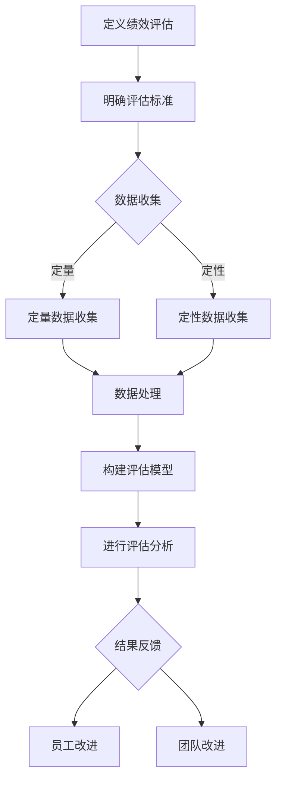

                 

### 引言

#### 绩效评估的重要性

绩效评估作为企业管理的重要组成部分，旨在通过系统化的方法对员工的工作表现进行科学、公正的评价。一个有效的绩效评估体系不仅能够激励员工努力工作，提高工作效率，还能为企业的战略决策提供有力的数据支持。随着组织规模的扩大和业务环境的复杂化，绩效评估在企业管理中的作用越来越凸显。

首先，绩效评估能够帮助组织了解员工的工作表现，发现和解决工作中的问题。通过定期的评估，企业可以及时发现员工在技能、态度、效率等方面的不足，并采取相应的改进措施。其次，绩效评估是薪酬管理的重要依据。公正、客观的绩效评估能够确保员工的薪酬与其工作表现相匹配，激发员工的工作积极性。此外，绩效评估还能够为员工职业发展提供指导，帮助员工了解自己的优势和劣势，制定职业发展计划。

#### 公正与客观评估的主题

在绩效评估过程中，公正性和客观性是至关重要的。公正性意味着评估结果要公平、无偏见，确保每位员工都有同等的机会获得评价。客观性则要求评估标准、方法、过程具有可操作性，确保评估结果的准确性和一致性。

公正的绩效评估能够消除主观偏见，使评估结果更加可靠，从而提高员工对评估的认可度和信任感。客观的绩效评估则能够确保评估过程透明、可追踪，有助于提升企业的管理水平和管理效率。

本书将围绕公正的绩效评估展开，深入探讨如何实现客观评价团队的方法和应用。通过系统的理论和实践分析，我们希望能够为读者提供一套切实可行的绩效评估体系，帮助企业实现高效的人力资源管理。

#### 本书结构概述

本书共分为七个主要章节，旨在从多个维度对绩效评估进行详细探讨。

**第一章 引言**：介绍绩效评估的重要性，引出公正与客观评估的主题，并概述本书的结构。

**第二章 核心概念与联系**：讲解绩效评估的相关概念，如绩效、评估、公正性等，并使用Mermaid流程图展示概念之间的关系。

**第三章 公正与客观评估的方法**：详细讲解公正与客观评估的具体方法和工具，包括绩效指标的选择、数据收集与处理、评估模型的构建以及评估结果的解释与反馈。

**第四章 团队评估的应用场景**：分析不同场景下如何应用绩效评估，如项目团队、职能部门等。

**第五章 案例分析**：通过实际案例，展示绩效评估的应用和效果。

**第六章 项目实战**：提供具体的绩效评估项目实战案例，包括开发环境搭建、源代码实现和代码解读等。

**第七章 总结与展望**：对全书内容进行总结，并对未来绩效评估的发展趋势进行展望。

通过这七个章节的详细讨论，本书旨在为读者提供一套全面、系统的绩效评估方案，帮助企业在人力资源管理中实现公正、客观的评价。

### 核心概念与联系

#### 绩效评估的基本概念

绩效评估是指通过对员工工作表现的量化与质化分析，以确定其工作效果的过程。绩效评估的核心目标在于提供关于员工工作表现的真实、全面、公正的信息，从而为企业的人力资源管理提供决策依据。

**绩效**：绩效是指员工在工作过程中表现出来的能力、态度、行为和成果。绩效可以划分为多个维度，如工作效率、工作质量、团队协作、创新能力、客户满意度等。

**评估**：评估是通过对绩效进行测量、分析和评价，以确定员工工作表现的过程。评估方法可以包括定量评估（如绩效考核表、目标达成度等）和定性评估（如360度评估、领导反馈等）。

**公正性**：公正性是指绩效评估过程中，评估结果公平、无偏见，确保每位员工都有同等的机会获得评价。公正性要求评估标准和方法的透明度，以及评估过程的公正性和一致性。

**客观性**：客观性是指绩效评估过程中，评估标准和方法的科学性、可操作性，确保评估结果的准确性和一致性。客观性要求评估过程中的数据收集和处理具有可验证性，评估结果能够真实反映员工的工作表现。

#### 公正性与客观性的定义

**公正性**：公正性是绩效评估的灵魂，它要求评估过程必须公平、透明、无偏见。公正性的实现依赖于以下几个方面：

1. **评估标准的明确**：评估标准应具体、明确，使每位员工都能清楚地了解自己的工作目标和要求。
2. **评估过程的透明**：评估过程应公开、透明，确保员工了解评估的标准、方法和程序，增加评估的公信力。
3. **评估结果的反馈**：评估结果应及时、准确地反馈给员工，使其了解自己的工作表现，并有针对性地进行改进。

**客观性**：客观性是绩效评估的基石，它要求评估方法和工具的科学性和可操作性。客观性的实现依赖于以下几个方面：

1. **数据收集的准确性**：评估数据应真实、全面，确保评估结果的可靠性。
2. **评估模型的科学性**：评估模型应基于科学的理论和方法，确保评估结果的准确性和一致性。
3. **评估工具的可操作性**：评估工具应简单、易用，使评估过程高效、便捷。

#### 绩效评估与组织管理的联系

绩效评估不仅是对员工工作表现的评估，更是组织管理的重要组成部分。绩效评估与组织管理之间的联系体现在以下几个方面：

1. **人力资源管理**：绩效评估为人力资源管理部门提供了关于员工工作表现的重要信息，有助于制定招聘、培训、晋升等人力资源策略。
2. **战略规划**：绩效评估结果可以作为企业战略规划的参考依据，帮助企业制定更符合实际的人力资源发展战略。
3. **团队协作**：通过绩效评估，可以及时发现团队协作中的问题，促进团队成员之间的沟通与合作，提高团队整体绩效。
4. **组织效能**：绩效评估能够帮助企业识别和培养优秀人才，提升组织整体效能，实现可持续发展。

#### 绩效评估与团队协作的关系

在团队协作中，绩效评估不仅是对个人工作表现的评估，更是对团队整体工作表现的评估。绩效评估对团队协作的影响主要体现在以下几个方面：

1. **激励与反馈**：绩效评估为团队成员提供了明确的激励和反馈，有助于激发团队成员的工作积极性，提高工作效率。
2. **沟通与协调**：绩效评估结果可以作为团队沟通和协调的依据，帮助团队成员了解彼此的工作表现，促进相互之间的协作。
3. **能力提升**：通过绩效评估，团队成员可以了解自己在工作中的不足，有针对性地进行技能提升和职业发展。

#### Mermaid流程图展示

为了更直观地展示绩效评估的概念和流程，我们使用Mermaid流程图对绩效评估的关键步骤进行描述。



通过上述流程图，我们可以清晰地看到绩效评估从定义到结果反馈的整个流程，每个步骤的关键点及其相互关系。

### 公正与客观评估的方法

#### 绩效指标的选择

绩效指标的选择是公正与客观评估的核心环节。选择合适的绩效指标，能够确保评估结果真实、准确，有助于激发员工的工作动力，提升团队整体绩效。以下是选择绩效指标时需要考虑的几个关键因素：

1. **相关性**：绩效指标应与工作目标和岗位职责高度相关，能够准确衡量员工的工作表现。
2. **可度量性**：绩效指标应具有明确的衡量标准，可以通过量化指标进行评估，避免主观判断。
3. **公平性**：绩效指标应公平、透明，使每位员工都有同等的机会获得评价。
4. **灵活性**：绩效指标应根据企业发展和工作需求进行调整，保持动态适应性。

在具体选择绩效指标时，可以采用以下方法：

1. **KPI（关键绩效指标）法**：KPI是一种常用的绩效指标体系，它通过设定具体的、可量化的目标，对员工的工作表现进行评估。KPI的选择应与企业的战略目标相一致，确保评估结果对企业的发展有积极影响。

2. **360度评估法**：360度评估法是一种全面的评估方法，通过收集来自上级、同事、下属和客户等多方面的反馈，对员工的工作表现进行综合评价。这种方法能够提供多角度、全方位的信息，有助于更全面地了解员工的工作表现。

3. **行为锚定评估法**：行为锚定评估法是一种基于行为的评估方法，通过将员工的工作行为与预定的行为锚定标准进行对比，评估员工的工作表现。这种方法能够确保评估结果客观、公正，减少主观判断的影响。

#### 数据收集与处理

数据收集与处理是绩效评估的重要环节，其质量直接影响评估结果的准确性和可靠性。以下是数据收集与处理的关键步骤和方法：

1. **数据来源**：绩效评估的数据来源应多样化，包括定量数据（如工作成果、工作效率等）和定性数据（如客户反馈、同事评价等）。数据来源的多样化有助于全面、客观地评估员工的工作表现。

2. **数据收集方法**：常用的数据收集方法包括问卷调查、面谈、观察和记录等。问卷调查适用于收集大量数据的情景，面谈适用于深入了解员工工作表现的情景，观察和记录则适用于对特定行为或事件的评估。

3. **数据处理流程**：数据处理流程包括数据清洗、数据整合和数据存储等步骤。数据清洗旨在去除无效、错误或重复的数据，确保数据的准确性和一致性。数据整合则是将不同来源的数据进行整合，形成统一的评估数据集。数据存储则应确保数据的安全性和可追溯性。

4. **数据分析方法**：数据分析方法包括统计分析、回归分析、聚类分析等。统计分析用于对数据进行描述和推断，回归分析用于研究变量之间的关系，聚类分析则用于对数据进行分类和分组。选择合适的数据分析方法，能够确保评估结果的科学性和准确性。

#### 评估模型的构建

评估模型的构建是绩效评估的核心环节，其目的是将收集到的数据转化为评估结果。以下是评估模型构建的关键步骤和方法：

1. **评估模型的选择**：评估模型的选择应根据评估目标和数据特点进行。常用的评估模型包括线性模型、非线性模型和混合模型等。线性模型适用于数据呈线性关系的情景，非线性模型适用于数据呈非线性关系的情景，混合模型则适用于数据复杂、关系多样的情景。

2. **模型参数设置**：模型参数设置是评估模型构建的关键环节，直接影响评估结果的准确性。参数设置应基于对数据分布、相关关系和变量重要性的分析，确保参数的合理性和科学性。

3. **模型训练与验证**：模型训练是利用历史数据对评估模型进行训练，使其能够拟合数据分布。模型验证则是通过交叉验证或留一法等方法，检验评估模型在未知数据上的表现，确保评估模型的泛化能力。

4. **模型优化**：模型优化旨在提高评估模型的准确性、可靠性和稳定性。通过调整模型参数、改进模型结构和增加训练数据等手段，可以优化评估模型，提高评估效果。

#### 评估结果的解释与反馈

评估结果的解释与反馈是绩效评估的重要环节，其目的是确保评估结果被员工理解和接受，并转化为实际行动。以下是评估结果解释与反馈的关键步骤和方法：

1. **结果解读**：评估结果解读应基于评估模型和评估指标的含义，将量化结果转化为具体的绩效表现。结果解读应简洁明了，使员工能够快速了解自己的工作表现。

2. **反馈机制设计**：反馈机制设计应确保评估结果能够及时、准确地反馈给员工。反馈机制可以包括一对一反馈、团队会议、书面报告等形式。反馈机制的设计应考虑员工的接受程度和反馈的有效性。

3. **反馈效果评估**：反馈效果评估是检验反馈机制有效性的重要环节。通过评估反馈的效果，可以发现反馈过程中的问题和不足，并采取相应的改进措施。反馈效果评估可以采用问卷调查、面谈等方式进行。

4. **员工改进**：员工改进是绩效评估的最终目标。通过评估结果和反馈，员工应明确自己的工作表现和改进方向，制定具体的改进计划，并采取实际行动进行改进。员工改进的有效性可以通过后续评估结果进行检验。

### 团队评估的应用场景

#### 项目团队评估

项目团队评估是绩效评估的重要组成部分，旨在通过科学、公正的方法对项目团队的工作表现进行评价，以促进项目成功和团队成长。以下是项目团队评估的关键步骤和应用：

1. **项目背景与目标**：明确项目背景和目标，确保评估过程与项目需求相一致。项目背景包括项目类型、规模、时间期限、预算等，项目目标则包括项目成果、质量、进度等。

2. **评估指标设定**：根据项目目标和团队职责，设定具体的评估指标。常见的评估指标包括项目进度、任务完成度、成本控制、质量保证、团队协作等。

3. **数据收集与处理**：通过多种数据收集方法，如问卷调查、面谈、观察等，收集团队工作过程中的相关数据。数据收集应确保全面、真实、准确，为评估提供可靠的基础。

4. **评估模型构建**：选择合适的评估模型，如基于绩效指标的评估模型、基于团队协作的评估模型等，对收集到的数据进行分析和处理，得出评估结果。

5. **结果反馈与改进**：将评估结果及时反馈给团队，讨论存在的问题和改进方向。通过反馈和改进，帮助团队提高工作效率，优化项目成果。

6. **案例分析**：通过实际项目案例，分析项目团队评估的应用和效果。案例可以包括成功案例和失败案例，从中总结经验教训，为后续项目提供参考。

#### 职能部门评估

职能部门评估是对企业内部职能部门工作表现的评估，旨在通过科学、客观的方法衡量职能部门的工作效率和服务质量，为组织管理提供决策依据。以下是职能部门评估的关键步骤和应用：

1. **部门背景与目标**：明确职能部门的背景和目标，确保评估过程与部门职能相一致。部门背景包括部门职责、业务范围、人员配置等，部门目标则包括服务质量、工作效率、成本控制等。

2. **评估指标设定**：根据部门目标和职责，设定具体的评估指标。常见的评估指标包括工作效率、服务质量、客户满意度、成本控制等。

3. **数据收集与处理**：通过多种数据收集方法，如问卷调查、关键绩效指标（KPI）统计、工作日志等，收集部门工作过程中的相关数据。数据收集应确保全面、真实、准确，为评估提供可靠的基础。

4. **评估模型构建**：选择合适的评估模型，如基于KPI的评估模型、基于客户满意度评估模型等，对收集到的数据进行分析和处理，得出评估结果。

5. **结果反馈与改进**：将评估结果及时反馈给部门，讨论存在的问题和改进方向。通过反馈和改进，帮助部门提高工作效率，优化服务质量。

6. **案例分析**：通过实际部门案例，分析职能部门评估的应用和效果。案例可以包括成功案例和失败案例，从中总结经验教训，为后续部门管理提供参考。

#### 团队协作与绩效评估

团队协作是现代企业中不可或缺的一部分，而绩效评估则是衡量团队协作效果的重要手段。以下是团队协作与绩效评估的关联和应用：

1. **团队协作的重要性**：团队协作能够充分发挥团队成员的潜力，提高工作效率，实现项目目标。良好的团队协作有助于提高团队凝聚力，促进知识共享和经验传承。

2. **绩效评估对团队协作的影响**：绩效评估可以激励团队成员积极参与团队协作，明确个人在团队中的角色和责任，促进团队成员之间的沟通和合作。同时，绩效评估结果可以为团队协作提供反馈，帮助团队识别问题和改进方向。

3. **评估指标的设置**：在设置绩效评估指标时，应充分考虑团队协作的要素，如沟通效果、协作效率、项目进度、质量保证等。通过综合评估团队成员的协作表现，可以全面了解团队的整体协作水平。

4. **评估方法的多样化**：为了全面评估团队协作效果，可以采用多种评估方法，如问卷调查、团队访谈、项目回顾等。多样化评估方法可以提供多角度、全方位的信息，确保评估结果的准确性和公正性。

5. **案例分析**：通过实际团队案例，分析团队协作与绩效评估的关联和应用。案例可以包括成功协作的团队和存在协作问题的团队，从中总结经验教训，为后续团队管理提供参考。

### 案例分析

#### 成功案例

**案例背景**：某互联网公司项目组在开发一款重要的新产品时，采用了公正的绩效评估方法，通过科学、客观的评估，提升了团队整体绩效，确保了项目成功。

**具体实施**：

1. **评估指标设定**：项目组根据项目目标和团队职责，设定了包括任务完成度、代码质量、团队协作、客户满意度等多维度的评估指标。

2. **数据收集与处理**：项目组通过定期收集团队成员的工作日志、代码审查结果、客户反馈等多方面数据，进行综合分析，确保评估数据的全面性和准确性。

3. **评估模型构建**：项目组采用了基于绩效指标的评估模型，对收集到的数据进行分析和处理，得出每个成员的绩效评分。

4. **结果反馈与改进**：项目组将评估结果及时反馈给团队成员，讨论存在的问题和改进方向，并根据评估结果调整项目进度和团队协作方式。

**评估效果**：

1. **绩效提升**：通过公正的绩效评估，项目组成员的工作积极性明显提高，工作效率和质量显著提升。

2. **团队凝聚力增强**：团队成员之间的协作更加紧密，沟通更加顺畅，团队凝聚力得到显著增强。

3. **项目成功**：项目在预定时间内高质量完成，客户满意度大幅提升，为公司创造了显著的经济效益。

**案例总结与启示**：本案例表明，公正的绩效评估能够有效提升团队整体绩效，促进项目成功。通过科学、客观的评估方法，可以及时发现和解决团队协作中的问题，提高团队工作效率和质量。

#### 失败案例

**案例背景**：某制造企业生产部门在进行绩效评估时，采用了过于主观的评估方法，导致评估结果不公，引发了员工不满和团队冲突。

**具体实施**：

1. **评估指标设定**：生产部门未设定明确的评估指标，而是依赖部门经理的主观判断进行评估。

2. **数据收集与处理**：部门经理根据个人印象和直觉，对员工的工作表现进行评估，缺乏客观、全面的数据支持。

3. **评估模型构建**：评估模型过于简单，未考虑员工工作表现的多样性和复杂性。

4. **结果反馈与改进**：评估结果未及时反馈给员工，员工对评估结果感到困惑和不满意。

**评估效果**：

1. **员工不满**：员工对评估结果感到不公平，对工作积极性产生负面影响。

2. **团队冲突**：由于评估结果不公，员工之间出现了矛盾和冲突，影响了团队协作。

3. **绩效下降**：生产效率和质量受到严重影响，企业经济损失巨大。

**案例总结与启示**：本案例表明，主观、不公正的绩效评估会导致员工不满和团队冲突，严重影响团队绩效和企业发展。绩效评估必须基于科学、客观的方法，确保评估结果的公正性和准确性。

### 项目实战

#### 项目背景与目标

在本项目实战中，我们选择了一个软件开发项目作为案例，旨在通过公正的绩效评估方法，提高项目团队的工作效率和质量。项目背景如下：

**项目背景**：某互联网公司开发一款企业级管理软件，旨在提高企业的管理效率和决策水平。项目团队由10名成员组成，包括项目经理、开发人员、测试人员、UI设计师等。

**项目目标**：在预定时间内，高质量地完成软件的功能开发、测试和上线，确保客户满意度。

#### 开发环境搭建

为了确保项目团队高效协作，我们首先搭建了如下开发环境：

1. **代码库**：采用Git作为版本控制系统，实现代码的版本管理和协同开发。

2. **协作工具**：使用Jira和Confluence进行项目管理、任务分配和文档管理。

3. **开发工具**：选择IntelliJ IDEA和Visual Studio Code作为主要开发工具，提供强大的代码编辑、调试和构建功能。

4. **测试工具**：采用Selenium进行自动化测试，确保软件质量的稳定和可靠。

#### 源代码实现

在源代码实现过程中，我们遵循以下原则：

1. **模块化设计**：将软件功能划分为多个模块，每个模块由一名开发人员负责，确保代码的可维护性和可扩展性。

2. **代码审查**：定期进行代码审查，确保代码质量符合规范，减少代码缺陷。

3. **单元测试**：为每个模块编写单元测试，确保模块功能正常。

4. **接口文档**：编写详细的接口文档，确保不同模块之间的接口清晰、稳定。

#### 代码解读与分析

以下是项目中的一个关键模块的代码解读：

```java
public class OrderManager {
    // 订单对象列表
    private List<Order> orderList;

    // 构造函数
    public OrderManager() {
        orderList = new ArrayList<>();
    }

    // 添加订单
    public void addOrder(Order order) {
        orderList.add(order);
        System.out.println("订单添加成功！");
    }

    // 查询订单
    public Order getOrder(String orderId) {
        for (Order order : orderList) {
            if (order.getId().equals(orderId)) {
                return order;
            }
        }
        return null;
    }

    // 订单列表
    public List<Order> getOrderList() {
        return orderList;
    }
}
```

**代码解读**：

1. **类定义**：`OrderManager` 类负责订单的管理，包括添加、查询和获取订单列表等功能。
2. **成员变量**：`orderList` 是一个订单对象的列表，用于存储所有订单。
3. **构造函数**：无参数构造函数，初始化订单列表。
4. **添加订单**：`addOrder` 方法添加订单到列表，并在控制台输出成功消息。
5. **查询订单**：`getOrder` 方法通过订单ID查询订单，并返回订单对象。
6. **订单列表**：`getOrderList` 方法返回订单列表。

**代码分析**：

1. **模块化设计**：`OrderManager` 类实现了订单管理的基本功能，具有良好的可扩展性。
2. **代码质量**：代码简洁、清晰，符合编程规范。
3. **单元测试**：为该方法编写单元测试，确保功能正确。

#### 实际案例分析与详细讲解剖析

**实际案例**：在一次项目迭代中，`OrderManager` 模块出现了订单查询功能不稳定的问题，导致客户投诉。

**分析过程**：

1. **问题定位**：通过客户反馈和日志分析，确定问题出现在查询订单的方法`getOrder`上。

2. **代码审查**：对`getOrder` 方法进行代码审查，发现循环条件可能存在问题。

3. **问题修复**：在代码审查中发现，循环条件中的`equals` 方法可能存在误判。通过修改循环条件，确保订单ID匹配。

4. **测试验证**：对修改后的代码进行单元测试和集成测试，确保问题解决。

**详细讲解剖析**：

1. **问题原因**：在原来的代码中，循环条件使用`equals` 方法判断订单ID，可能存在误判。例如，当订单ID包含空格或其他特殊字符时，`equals` 方法可能返回错误的结果。

2. **解决方案**：通过修改循环条件，使用`equals` 方法的重载版本`equalsIgnoreCase`，确保订单ID匹配的准确性。

3. **代码修改**：

    ```java
    public Order getOrder(String orderId) {
        for (Order order : orderList) {
            if (order.getId().equalsIgnoreCase(orderId)) {
                return order;
            }
        }
        return null;
    }
    ```

4. **测试验证**：对修改后的代码进行全面的测试，包括单元测试和集成测试，确保问题解决。

**项目小结**：

通过本次项目实战，我们成功地应用了公正的绩效评估方法，提高了项目团队的工作效率和质量。在项目开发过程中，我们遵循了模块化设计、代码审查、单元测试等原则，确保了代码的质量和稳定性。同时，通过及时发现和解决代码问题，确保了项目的顺利进行。

#### 最佳实践 tips

1. **明确评估目标**：在项目开始前，明确项目的评估目标和关键指标，确保评估过程与项目需求相一致。

2. **数据收集多样化**：通过多种数据收集方法，如问卷调查、面谈、观察等，确保评估数据的全面性和准确性。

3. **代码审查与单元测试**：定期进行代码审查和单元测试，确保代码质量，减少代码缺陷。

4. **及时反馈与改进**：及时反馈评估结果，与团队成员讨论存在的问题和改进方向，确保项目进展顺利。

#### 注意事项

1. **避免主观偏见**：在绩效评估过程中，应避免主观偏见，确保评估结果的公正性和客观性。

2. **数据安全**：在数据收集和处理过程中，确保数据的安全性和隐私性，防止数据泄露。

3. **评估模型优化**：根据项目需求和实际情况，不断优化评估模型，确保评估结果的准确性和有效性。

#### 拓展阅读

1. 《绩效管理：打造高效团队》作者：詹姆斯·凯茨
2. 《绩效评估：方法与实践》作者：约翰·M·伊夫斯
3. 《团队协作与沟通技巧》作者：保罗·J·希里尔

### 总结与展望

#### 全书内容回顾

本书从多个维度对公正的绩效评估进行了深入探讨，包括绩效评估的重要性、核心概念与联系、公正与客观评估的方法、团队评估的应用场景、案例分析、项目实战等。通过系统的理论和实践分析，我们为读者提供了一套全面、系统的绩效评估方案，旨在帮助企业实现高效的人力资源管理。

#### 绩效评估的未来趋势

1. **智能化评估**：随着人工智能技术的发展，智能化评估将成为未来绩效评估的重要趋势。通过大数据分析和机器学习算法，可以更精准地预测员工的表现和潜力，提供个性化的评估报告。

2. **多元化评估**：未来的绩效评估将更加注重多元化，不仅考虑工作成果，还关注员工的工作态度、创新能力、团队协作等多方面因素。这种多元化的评估体系将更好地反映员工的全面能力。

3. **实时评估**：实时评估将取代传统的周期性评估，通过实时监控和反馈，及时识别和解决员工在工作中遇到的问题，提高评估的实时性和有效性。

4. **全球化评估**：随着全球化的发展，企业的员工分布更加广泛，跨文化、跨时区的绩效评估将成为新的挑战。未来的绩效评估将更加注重跨文化的适应性和灵活性。

#### 结论与建议

1. **重视公正与客观**：公正与客观是绩效评估的核心，企业应重视评估体系的公正性和客观性，确保评估结果的可靠性和有效性。

2. **数据驱动**：绩效评估应基于数据驱动，通过全面、准确的数据收集和分析，提供科学的评估依据。

3. **持续改进**：绩效评估是一个持续的过程，企业应不断优化评估体系，适应组织发展和员工需求的变化。

4. **员工参与**：绩效评估应鼓励员工参与，通过员工自我评估、同事互评等方式，提高员工的参与感和认同感。

本书《公正的绩效评估：客观评价团队》旨在为企业和组织提供一套科学、系统的绩效评估方案，帮助实现公正、客观的评价，提升团队绩效和整体效能。希望本书能为读者在绩效评估领域带来启发和帮助。作者：AI天才研究院/AI Genius Institute & 禅与计算机程序设计艺术 /Zen And The Art of Computer Programming。

