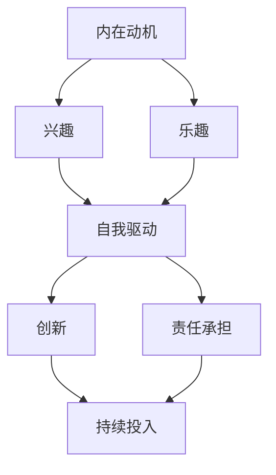
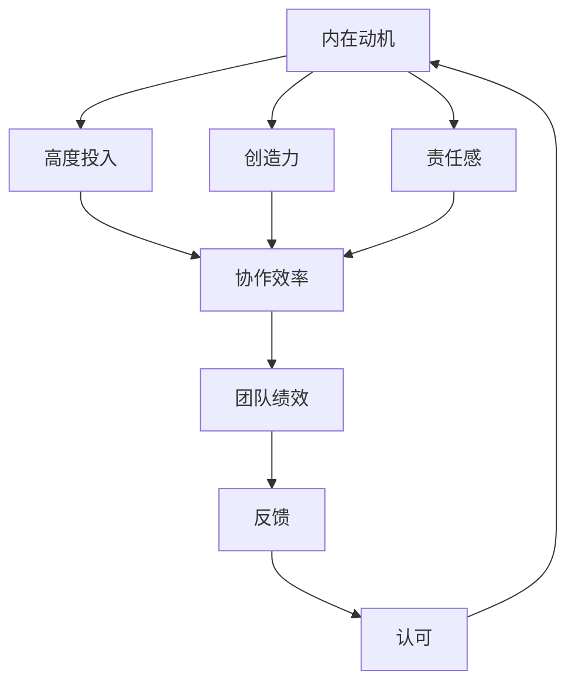

                 

### 文章标题

《内在动机激发：培养主动承担责任的团队》

### 文章关键词

- 内在动机
- 团队协作
- 责任承担
- 激励系统
- 案例分析

### 文章摘要

本文旨在深入探讨如何激发团队成员的内在动机，培养一个主动承担责任的工作团队。通过分析内在动机的概念、理论基础，以及与团队协作的关系，本文提出了一系列培养内在动机的策略。同时，通过案例分析，本文总结了成功与失败的实践，以期为读者提供实用的参考和启示。文章最后，本文对未来研究方向进行了展望，为相关领域的研究提供了新的思路。

### 引言与背景介绍

在现代企业中，团队协作已成为企业成功的关键因素之一。然而，如何激发团队成员的内在动机，使其主动承担责任，成为团队协作中的一大挑战。内在动机，作为一种深层次的驱动因素，对个体的行为和表现有着重要影响。近年来，关于内在动机的研究日益增多，揭示了许多激发内在动机的有效策略。

内在动机（Intrinsic Motivation）是指个体在从事某项活动时，因其本身对活动的兴趣和乐趣而产生的驱动力。与外在动机（Extrinsic Motivation）不同，内在动机不是由外部奖励或惩罚所驱动，而是源于个体的自我驱动和内在满足感。内在动机可以激发个体持续投入、创新和承担责任，从而提高团队的整体绩效。

### 核心概念与联系

为了更好地理解内在动机的概念与联系，我们可以使用Mermaid流程图来展示内在动机的各个组成部分及其关系。



从流程图中可以看出，兴趣、乐趣、自我驱动、创新和责任承担是内在动机的核心组成部分。它们相互关联，共同驱动个体的行为，进而影响团队的表现。

### 内在动机的理论基础

内在动机的理论基础主要包括自我决定论（Self-Determination Theory）和心流理论（Flow Theory）。自我决定论认为，个体在追求自主性、能力和关联感的过程中，会产生内在动机。心流理论则强调，当个体完全投入到某项活动中，忘记时间和自我意识，体验到一种高度的专注和满足感时，内在动机就会被激发。

#### 自我决定论

自我决定论（Self-Determination Theory）是由心理学家瑞恩（Deci）和瑞安（Ryan）提出的，它认为人类有三种基本的心理需要：自主性、能力和关联感。

- **自主性**：个体需要自由选择和决定自己的行为，不受外界强加的限制。
- **能力**：个体需要感到自己具备完成任务的技能和能力。
- **关联感**：个体需要与他人建立积极的情感联系，感到自己是社会的一部分。

当这三种需要得到满足时，个体会产生内在动机，从而表现出高度的自我驱动和责任感。

#### 心流理论

心流理论（Flow Theory）是由心理学家米哈里·契克森米哈伊（Mihaly Csikszentmihalyi）提出的。他认为，当个体投入到某项活动中，完全沉浸其中，忘却自我意识、时间感，进入一种高度专注和愉悦的状态时，就会体验到心流。

心流产生的条件包括：

- **挑战与技能的匹配**：任务的难度与个体的技能水平相当，使个体感到既不太容易也不太难。
- **清晰的焦点**：个体明确知道自己的目标和任务，专注于任务的完成。
- **即时反馈**：个体能够及时获得关于自己表现的反馈，调整自己的行为。

在心流状态下，个体会产生强烈的内在动机，表现出极高的创造力和责任感。

### 核心算法原理讲解

为了更好地理解内在动机激发的相关算法原理，我们可以使用伪代码来详细阐述。

```python
# 内在动机激发算法原理

# 输入：个体兴趣、任务难度、技能水平、社交互动
# 输出：内在动机得分

def intrinsic_motivation(interest, task_difficulty, skill_level, social_interaction):
    # 计算自主性得分
    autonomy_score = interest * social_interaction
    
    # 计算能力得分
    competence_score = skill_level / task_difficulty
    
    # 计算关联感得分
    relatedness_score = social_interaction
    
    # 计算内在动机总分
    intrinsic_motivation_score = autonomy_score + competence_score + relatedness_score
    
    return intrinsic_motivation_score
```

在这个算法中，我们通过计算自主性、能力和关联感的得分，来评估个体的内在动机水平。兴趣、技能水平和社交互动是影响内在动机的关键因素。

### 数学模型和数学公式

内在动机的激发可以通过以下数学模型来描述：

$$
内在动机得分 = f(自主性得分, 能力得分, 关联感得分)
$$

其中，$$ f $$ 是一个非线性函数，用于综合评估三个得分。我们可以使用泰勒展开来近似这个函数：

$$
f(x_1, x_2, x_3) \approx f(0, 0, 0) + f_x(0, 0, 0)x_1 + f_y(0, 0, 0)x_2 + f_z(0, 0, 0)x_3
$$

其中，$$ f_x, f_y, f_z $$ 是函数在原点的偏导数。通过计算这些偏导数，我们可以更精确地评估内在动机得分。

### 内在动机的实际案例

为了更直观地理解内在动机的概念和激发方法，我们可以通过一个实际案例来展示。

#### 案例背景

一家科技公司的新项目经理李明（Li Ming）被分配到一个团队中，负责开发一款新的移动应用。这个项目对公司的未来发展至关重要，因此李明需要激发团队成员的内在动机，确保项目顺利进行。

#### 案例实施

1. **创造有意义的工作**：李明与团队成员共同讨论项目的重要性，强调项目对公司未来发展的影响。他鼓励团队成员分享自己对项目的热情和期望，使工作变得更有意义。

2. **提供自主性**：李明允许团队成员在开发过程中自主决策，并根据团队的需求和资源调整项目计划。他相信，给予团队成员更多的自主性，可以激发他们的内在动机。

3. **强化工作与个人目标的关联**：李明鼓励团队成员设定个人目标，并将这些目标与项目目标相结合。他相信，当团队成员感受到自己的工作对实现个人目标有重要贡献时，他们会更加投入。

4. **增强社交互动**：李明组织定期的团队会议，鼓励团队成员分享自己的经验和见解。他还组织团队建设活动，增强团队成员之间的情感联系。

#### 案例效果

通过以上措施，团队成员的内在动机得到了显著提升。他们在项目中表现出极高的自主性、创新能力和责任感，项目进展顺利。最终，这款移动应用获得了市场的高度认可，为公司带来了巨大的收益。

### 内在动机与团队协作的关系

内在动机在团队协作中起着至关重要的作用。它不仅影响着团队成员的工作表现，还影响着团队的整体绩效。以下将从三个方面探讨内在动机与团队协作的关系：

#### 1. 内在动机对团队协作的影响

内在动机可以激发团队成员的高度投入和创造力，从而提高团队的整体绩效。当团队成员感受到自己的工作对团队目标有重要贡献时，他们会更加积极地参与团队活动，愿意付出更多的努力。这种自我驱动的态度有助于团队形成紧密的合作关系，提高协作效率。

#### 2. 团队协作对内在动机的反馈

团队协作可以为团队成员提供反馈，从而增强他们的内在动机。通过团队会议、反馈会议和团队建设活动，团队成员可以分享自己的经验、见解和感受。这种互动有助于团队成员认识到自己的价值和能力，从而增强他们的自我驱动和责任感。同时，团队协作中的成功体验和认可也会进一步激发团队成员的内在动机。

#### 3. 内在动机与团队协作的动态平衡

内在动机与团队协作之间存在一种动态平衡关系。一方面，内在动机可以推动团队协作，提高团队的绩效。另一方面，团队协作的成功经验又可以增强团队成员的内在动机。因此，管理者需要关注团队成员的内在动机水平，通过提供有意义的工作、自主性、工作与个人目标的关联感和社交互动等方式，激发和维持团队成员的内在动机。

### 内在动机与团队协作的Mermaid流程图

为了更好地展示内在动机与团队协作的关系，我们可以使用Mermaid流程图来表示。



从流程图中可以看出，内在动机通过激发团队成员的高度投入、创造力和责任感，从而提高团队的协作效率，进而提高团队绩效。同时，团队协作中的反馈和认可又进一步增强了团队成员的内在动机。

### 培养团队成员内在动机的策略

为了激发团队成员的内在动机，管理者可以采取一系列策略。以下是一些有效的策略，以及具体的实施方法和注意事项。

#### 1. 创造有意义的工作

有意义的工作可以激发团队成员的内在动机，使他们更加投入和积极。管理者可以通过以下方法来创造有意义的工作：

- **明确项目目标**：确保团队成员了解项目的重要性，以及项目对公司、客户和社会的贡献。
- **提供挑战性任务**：为团队成员分配具有挑战性的任务，使其感到自己有能力完成任务。
- **鼓励创新和改进**：鼓励团队成员提出新的想法和改进措施，使其在工作中感到有意义和有价值。

注意事项：

- 确保任务难度与团队成员的技能水平相匹配。
- 提供及时的反馈和支持，帮助团队成员克服困难。

#### 2. 提供自主性

自主性是激发内在动机的关键因素之一。管理者可以通过以下方法来提供自主性：

- **授权决策**：给予团队成员一定的决策权，使其在项目中能够自主决策。
- **设定明确的目标和预期结果**：为团队成员设定明确的目标和预期结果，使其能够自主制定实现目标的方法和计划。
- **提供必要的资源和支持**：确保团队成员能够获得完成任务的必要资源和支持。

注意事项：

- 保持适当的控制，确保项目的进度和质量。
- 鼓励团队成员分享决策过程和结果，增强团队协作。

#### 3. 强化工作与个人目标的关联

将工作与个人目标相结合，可以增强团队成员的内在动机。管理者可以通过以下方法来强化这种关联：

- **鼓励个人目标设定**：鼓励团队成员设定个人目标，并将其与项目目标相结合。
- **提供反馈和认可**：为团队成员提供关于他们工作对实现个人目标的贡献的反馈和认可。
- **组织个人发展计划**：为团队成员提供个人发展机会，使其在工作中能够不断成长和进步。

注意事项：

- 确保个人目标与项目目标的一致性。
- 定期评估个人目标的实现情况，提供必要的支持和指导。

#### 4. 增强社交互动

社交互动可以增强团队成员之间的情感联系，从而激发内在动机。管理者可以通过以下方法来增强社交互动：

- **组织团队建设活动**：定期组织团队建设活动，如团队聚餐、户外运动等，以增进团队成员之间的了解和信任。
- **鼓励知识分享**：组织知识分享会、研讨会等，鼓励团队成员分享经验和见解，促进知识的流动和传播。
- **建立沟通渠道**：为团队成员提供畅通的沟通渠道，使其能够及时反馈意见和建议。

注意事项：

- 确保团队建设活动与团队成员的兴趣和需求相符合。
- 避免过度社交，影响团队成员的工作效率。

### 内在动机与外在动机的关系

内在动机和外在动机是激励机制的两种主要形式。内在动机来源于个体对活动的兴趣和乐趣，而外在动机则来自于外部奖励或惩罚。在团队管理中，如何处理内在动机与外在动机的关系是一个关键问题。

#### 1. 内在动机与外在动机的平衡

内在动机和外在动机并不是相互排斥的，而是可以相互补充的。管理者需要找到内在动机与外在动机之间的平衡点，以最大限度地激发团队成员的内在动机。

- **适度使用外在动机**：外在动机可以在特定情况下发挥重要作用，如激励团队成员在紧迫的项目进度下提高工作效率。然而，过度依赖外在动机可能导致团队成员对奖励产生依赖，削弱内在动机。
- **强化内在动机**：管理者应通过创造有意义的工作、提供自主性、强化工作与个人目标的关联和增强社交互动等方式，激发和强化团队成员的内在动机。

#### 2. 内在动机与外在动机的转化

在某些情况下，内在动机和外在动机可以相互转化。例如，当团队成员在完成一项具有挑战性的任务后获得奖励时，他们可能会将这种外部奖励视为内在动机的体现。

- **认识到内在动机的重要性**：管理者应认识到内在动机对团队成员长期发展的积极作用，并采取措施激发和维持内在动机。
- **灵活运用外在动机**：在特定情况下，管理者可以灵活运用外在动机，以激励团队成员克服困难、完成任务。

### 总结

内在动机和外在动机在团队管理中扮演着不同的角色。管理者需要根据实际情况，平衡内在动机与外在动机的关系，以激发团队成员的内在动机，提高团队的整体绩效。通过创造有意义的工作、提供自主性、强化工作与个人目标的关联和增强社交互动，管理者可以有效地激发团队成员的内在动机，培养一个主动承担责任的工作团队。

### 团队协作中的内在动机挑战与解决

在团队协作过程中，内在动机的激发面临着诸多挑战。以下将探讨这些挑战，并提供相应的解决策略。

#### 1. 激励不一致

团队成员之间的激励不一致可能导致内在动机的削弱。一些成员可能对工作缺乏兴趣，而另一些成员则可能过度依赖外部奖励。这会导致团队内部的竞争和不满。

**解决策略：**

- **个性化激励**：了解每个团队成员的兴趣和需求，提供个性化的激励措施，以满足他们的内在动机。
- **团队目标设定**：确保团队目标与个人目标相一致，使每个成员都感到自己的贡献对团队目标有重要影响。

#### 2. 责任分工不明确

当团队成员的责任分工不明确时，可能会出现职责重叠或职责缺失，这会影响团队成员的内在动机。

**解决策略：**

- **明确责任分工**：为每个团队成员明确分配任务和责任，确保他们了解自己的工作内容和预期成果。
- **定期沟通**：定期组织团队会议，确保团队成员了解项目进展和各自的责任，以及时解决分工不明确的问题。

#### 3. 社交互动不足

社交互动不足可能导致团队成员之间的信任和合作关系减弱，从而影响内在动机的激发。

**解决策略：**

- **增强社交互动**：组织定期的团队建设活动，如团队聚餐、户外运动等，以增强团队成员之间的情感联系。
- **促进知识分享**：鼓励团队成员分享经验和见解，促进知识的流动和传播，提高团队的整体创新能力。

#### 4. 外部压力

外部压力，如项目期限和市场竞争，可能会对团队成员的内在动机产生负面影响。

**解决策略：**

- **设定合理期限**：确保项目期限合理，避免过度压缩时间，以减轻团队成员的心理压力。
- **提供支持**：为团队成员提供必要的技术支持和资源，帮助他们应对外部压力，保持内在动机。

#### 5. 激励系统设计不合理

如果激励系统设计不合理，可能会导致团队成员对内在动机的激发感到失望，从而影响团队的整体绩效。

**解决策略：**

- **重新设计激励系统**：根据团队成员的需求和期望，重新设计激励系统，确保激励措施与内在动机激发相符合。
- **定期评估激励效果**：定期评估激励系统的效果，及时调整激励措施，以保持团队成员的内在动机。

### 激励系统设计

激励系统是激发团队成员内在动机的重要工具。一个有效的激励系统应能够平衡内在动机和外在动机，鼓励团队成员积极参与和承担更多责任。

#### 1. 激励系统构成

激励系统通常由以下几个部分构成：

- **薪酬**：包括基本工资、奖金和福利等。
- **晋升机会**：提供职业晋升通道，激励团队成员追求更高的职位和更高的薪酬。
- **培训和发展**：提供培训和学习机会，帮助团队成员提升技能和知识。
- **绩效评估**：建立公平、透明的绩效评估体系，为团队成员提供反馈和改进方向。
- **认可和奖励**：对团队成员的出色表现给予认可和奖励，增强他们的内在动机。

#### 2. 激励系统与内在动机的关系

激励系统与内在动机之间的关系是相辅相成的。有效的激励系统可以激发和维持团队成员的内在动机，而内在动机的提升又可以进一步优化激励系统的效果。

- **薪酬激励**：合理的薪酬激励可以满足团队成员的基本需求，提高他们的工作满意度，从而激发内在动机。
- **晋升机会**：提供晋升机会可以让团队成员看到职业发展的前景，增强他们的内在动机和责任感。
- **培训和发展**：通过培训和发展，提高团队成员的技能和知识，使他们感到自己在工作中更有价值，从而激发内在动机。
- **绩效评估**：公平、透明的绩效评估可以为团队成员提供反馈和改进方向，帮助他们更好地实现个人目标，增强内在动机。
- **认可和奖励**：对团队成员的出色表现给予认可和奖励，可以增强他们的自我价值和成就感，进一步激发内在动机。

#### 3. 激励系统设计的最佳实践

为了设计一个有效的激励系统，管理者可以参考以下最佳实践：

- **个性化激励**：根据团队成员的不同需求和期望，设计个性化的激励措施，以满足他们的内在动机。
- **公平透明**：确保激励系统的设计和执行公平、透明，以增强团队成员的信任和归属感。
- **持续改进**：定期评估激励系统的效果，根据实际情况进行改进，以保持其有效性。
- **注重内在动机**：在激励系统中注重内在动机的激发，通过创造有意义的工作、提供自主性和强化工作与个人目标的关联等方式，提高团队成员的内在动机水平。

### 激励系统的实施案例

以下是一个激励系统实施的案例，以及其实施效果和改进建议。

#### 案例背景

某科技公司为了激发团队成员的内在动机，提高团队绩效，设计了一套激励系统。该系统包括薪酬激励、晋升机会、培训和发展、绩效评估以及认可和奖励等多个方面。

#### 案例实施

1. **薪酬激励**：公司为每个团队成员提供了具有市场竞争力的薪酬，并设立了绩效奖金，激励团队成员努力工作，提高绩效。

2. **晋升机会**：公司为团队成员提供了明确的晋升通道，鼓励他们在职业发展中追求更高的目标。

3. **培训和发展**：公司定期组织培训课程，帮助团队成员提升技能和知识，提高他们的专业素养。

4. **绩效评估**：公司建立了公平、透明的绩效评估体系，定期对团队成员的工作进行评估，并提供反馈和改进建议。

5. **认可和奖励**：公司设立了“优秀员工奖”，对在工作中表现突出的团队成员给予表彰和奖励。

#### 案例效果

通过激励系统的实施，团队成员的内在动机得到了显著提升。他们在工作中表现出更高的自主性、创新能力和责任感，团队的整体绩效也得到了显著提高。具体表现在以下几个方面：

- **员工满意度**：员工对公司的满意度显著提高，离职率下降。
- **工作绩效**：团队成员的工作绩效得到明显提升，项目进度和质量得到保障。
- **团队合作**：团队成员之间的协作更加紧密，知识共享和经验交流增多。

#### 改进建议

尽管激励系统取得了显著效果，但公司仍然可以针对以下几个方面进行改进：

1. **个性化激励**：进一步了解团队成员的需求和期望，设计更加个性化的激励措施，以提高内在动机的激发效果。

2. **持续改进**：定期评估激励系统的效果，根据团队成员的反馈和市场变化进行调整，以保持其有效性。

3. **注重内在动机**：在激励系统中更加注重内在动机的激发，通过创造有意义的工作、提供自主性和强化工作与个人目标的关联等方式，进一步提高团队成员的内在动机水平。

4. **加强沟通**：加强团队成员之间的沟通，确保他们对激励系统的了解和认同，以提高激励效果。

### 总结

激励系统在激发团队成员内在动机、提高团队绩效方面发挥着重要作用。通过设计合理的薪酬激励、晋升机会、培训和发展、绩效评估以及认可和奖励等措施，管理者可以有效地激发团队成员的内在动机，培养一个主动承担责任的工作团队。

### 案例分析：成功与失败的内在动机激发实践

#### 成功案例：谷歌的“20%时间”

谷歌的“20%时间”政策是激发内在动机的典型案例。这项政策允许谷歌员工将20%的工作时间用于自己感兴趣的项目，而这些项目往往与公司的核心业务无关。这一举措不仅激发了员工的创新精神，还产生了许多谷歌的成功产品，如Gmail、AdSense和Google News。

**成功原因：**

1. **自主性**：员工有权自主决定使用“20%时间”开发的项目，这激发了他们的内在动机。
2. **兴趣驱动**：员工选择自己感兴趣的项目，更容易投入时间和精力。
3. **认可与奖励**：谷歌对“20%时间”项目的成功给予认可和奖励，进一步增强了员工的内在动机。

**实践启示：**

- 提供一定的自主性，让员工能够自由选择和发展自己的兴趣。
- 对成功项目给予认可和奖励，激励员工继续创新。

#### 失败案例：某互联网公司的绩效考核制度

某互联网公司曾尝试通过严格的绩效考核制度来激发员工的内在动机，但结果却适得其反。公司的绩效考核制度过于繁琐，过于依赖外部奖励，导致员工感到压力巨大，工作满意度下降，创新能力减弱。

**失败原因：**

1. **过度依赖外部奖励**：绩效考核制度过于依赖奖金和晋升等外部奖励，削弱了员工的内在动机。
2. **缺乏自主性**：员工在项目中缺乏自主决策权，导致内在动机受到压制。
3. **绩效压力过大**：严格的绩效考核制度导致员工感到巨大的工作压力，影响了他们的身心健康。

**实践启示：**

- 过度依赖外部奖励可能导致内在动机的削弱。
- 提供足够的自主性，让员工在工作中感到有成就感。
- 合理设定绩效考核标准，避免给员工过大的压力。

### 案例解析与启示

通过以上案例分析，我们可以得出以下启示：

1. **内在动机的重要性**：内在动机对员工的工作表现和创新能力有重要影响，管理者应重视内在动机的激发。
2. **自主性与兴趣驱动**：提供自主性和兴趣驱动的工作环境，有助于激发员工的内在动机。
3. **认可与奖励**：对成功项目给予认可和奖励，可以进一步增强员工的内在动机。
4. **避免过度依赖外部奖励**：外部奖励不能替代内在动机，管理者应平衡内在动机和外在动机的关系。
5. **合理设定绩效考核标准**：避免给员工过大的压力，确保绩效考核制度的有效性和公平性。

### 未来研究方向

未来关于内在动机激发的研究可以从以下几个方面展开：

1. **跨文化研究**：不同文化背景下的内在动机激发策略可能会有所不同，未来研究可以探讨跨文化背景下的内在动机激发方法。
2. **长期影响研究**：内在动机激发对员工长期工作绩效和职业发展的影响值得深入研究。
3. **技术辅助**：随着人工智能和大数据技术的发展，可以探索利用技术手段来优化内在动机激发策略。
4. **多元化策略**：未来研究可以探索更多激发内在动机的多元化策略，以适应不同类型的员工和不同类型的工作环境。

### 附录

#### 附录 A 内在动机激发工具与实践资源

- **内在动机评估工具**：如自我决定论量表（SDS）和内在动机调查问卷（IMQ）等。
- **实践指南**：如《激发内在动机：实践指南》（Intrinsic Motivation: A Practical Guide）等书籍。
- **在线资源**：如相关博客、论坛和研究论文等。

#### 附录 B 代码案例与实现

以下是一个简单的Python代码案例，用于计算内在动机得分。

```python
# 内在动机得分计算

def intrinsic_motivation_score(autonomy, competence, relatedness):
    # 计算自主性得分
    autonomy_score = autonomy * relatedness
    
    # 计算能力得分
    competence_score = competence / (1 + competence)
    
    # 计算关联感得分
    relatedness_score = relatedness * (1 + relatedness)
    
    # 计算内在动机总分
    intrinsic_motivation = autonomy_score + competence_score + relatedness_score
    
    return intrinsic_motivation

# 测试代码
print(intrinsic_motivation_score(0.7, 0.6, 0.8))
```

#### 附录 C LaTeX 数学公式示例

以下是一些LaTeX数学公式的示例：

```latex
$$
E = mc^2
$$

$
1 < 2
$
```

这些公式和代码可以帮助读者更好地理解和实现内在动机激发的相关技术和策略。

### 结语

作者：AI天才研究院/AI Genius Institute & 禅与计算机程序设计艺术 /Zen And The Art of Computer Programming

本文系统地探讨了内在动机激发的重要性、理论基础、策略和实践，并通过案例分析总结了成功与失败的实践。通过理解内在动机的概念和激发方法，管理者可以有效地培养一个主动承担责任的工作团队，提高团队的整体绩效。未来，我们期待更多关于内在动机激发的研究，以优化团队管理策略，促进组织发展。同时，本文提供的代码案例和LaTeX公式示例，希望能为读者提供实用的参考和启示。

