                 

## 文章标题

### 冲突管理大师：化解团队矛盾的高级技巧

**关键词**：冲突管理、团队矛盾、解决技巧、高级策略

**摘要**：本文将探讨在团队环境中有效地管理冲突的技巧，帮助读者了解冲突管理的重要性，掌握化解团队矛盾的高级策略，并提供实际案例和最佳实践。通过逻辑清晰、结构紧凑的论述，读者将能够提升团队协作能力，促进组织和谐发展。

## 引言

在当今快节奏、竞争激烈的工作环境中，团队协作成为组织成功的关键。然而，团队内部的矛盾和冲突常常成为阻碍团队效率和目标达成的障碍。有效的冲突管理不仅能够缓解紧张局势，还能促进团队成员之间的理解和信任，提高团队的凝聚力和创造力。

本文旨在为读者提供一套全面的冲突管理方法论，包括基础理论、高级技巧和实战案例，帮助读者掌握化解团队矛盾的高级技巧。通过本文的阅读，读者将能够：

1. 理解冲突管理的核心概念和重要性。
2. 掌握不同类型冲突的特点和管理方法。
3. 学习高效的沟通技巧和利益相关者分析。
4. 运用合作性、竞争性和其他冲突解决策略。
5. 培养领导力，提升团队冲突管理的有效性。
6. 通过实际案例了解冲突管理的最佳实践。

## 第一部分：冲突管理的基础理论

### 1.1 冲突管理的定义与重要性

**核心概念与联系**

冲突管理是指识别、评估和处理组织内部冲突的过程，旨在通过协调和解决矛盾，提高团队效能和成员满意度。冲突管理的重要性体现在以下几个方面：

1. **提高团队效能**：有效的冲突管理有助于团队更好地分配资源、解决问题，从而提高工作效率和目标达成率。
2. **增强团队凝聚力**：通过化解冲突，团队成员能够更好地相互理解和支持，增强团队凝聚力和协作意识。
3. **提升员工满意度**：合理的冲突管理能够减少员工的压力和不满，提高工作满意度和忠诚度。

**Mermaid 流程图**

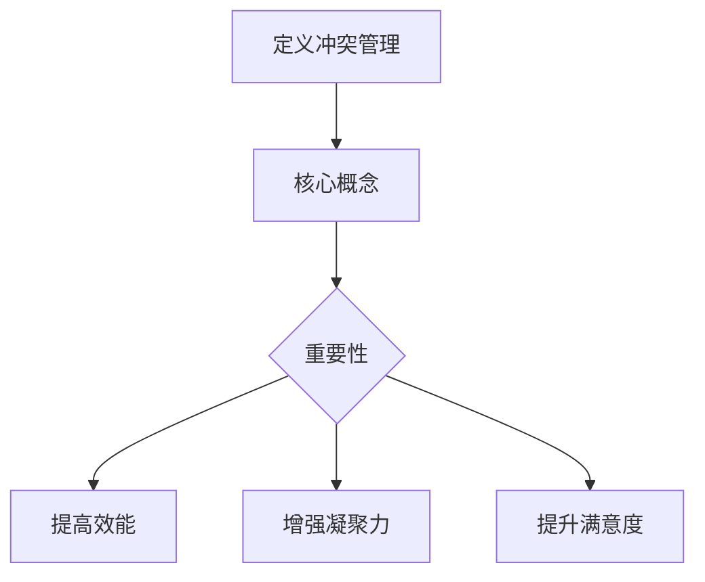

### 1.2 冲突的类型与特点

冲突可以分为多种类型，每种类型都有其独特的特点和影响：

1. **纵向冲突**：发生在组织层级之间，如部门与部门之间的沟通障碍和目标不一致。
2. **横向冲突**：发生在同一层级团队成员之间，如任务分配不公或个人利益冲突。
3. **功能性冲突**：对团队目标有积极影响的冲突，如对项目方案的激烈讨论。
4. **破坏性冲突**：对团队目标有消极影响的冲突，如恶意攻击和破坏性争吵。

**Mermaid 流程图**

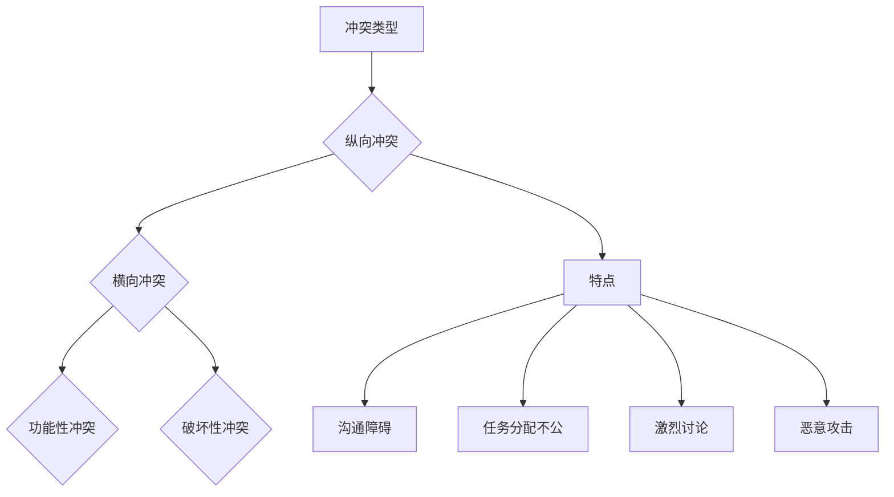

### 1.3 冲突管理的基本流程

有效的冲突管理需要遵循一定的流程，包括冲突识别与评估、冲突解决策略选择和冲突解决后的反馈与评估：

1. **冲突识别与评估**：通过观察和沟通，识别和评估冲突的性质和程度。
2. **冲突解决策略选择**：根据冲突的性质和团队目标，选择合适的解决策略，如合作性、竞争性或避免性策略。
3. **冲突解决后的反馈与评估**：对冲突解决的成果进行反馈和评估，确保问题得到有效解决并防止再次发生。

**Mermaid 流�程图**

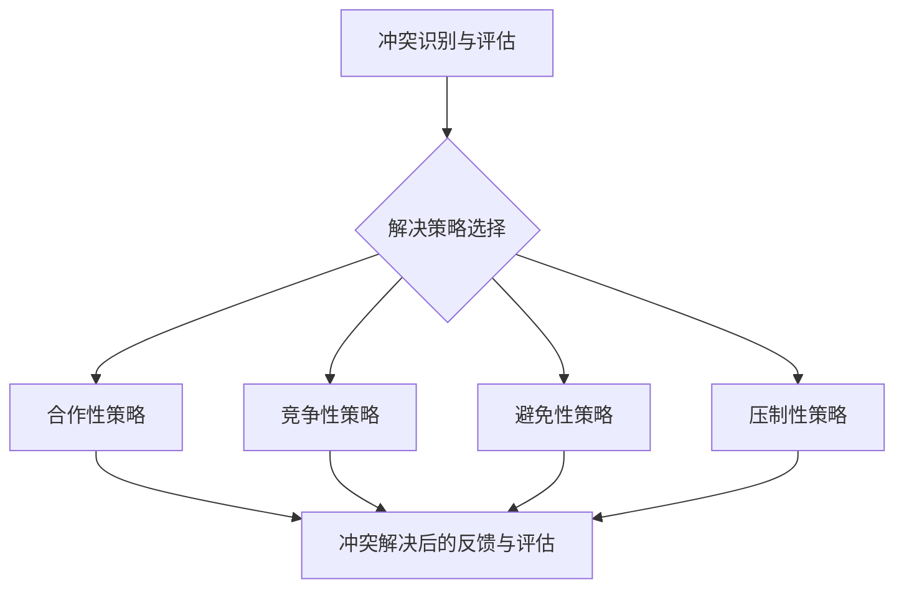

## 第二部分：高级冲突管理技巧

### 2.1 沟通技巧提升

有效的沟通是冲突管理的基石。以下是一些提升沟通技巧的方法：

1. **明确沟通目标**：在沟通前明确目标，确保双方对讨论主题有共同的理解。
2. **倾听与理解**：倾听对方的观点，理解其背后的动机和需求。
3. **表达清晰**：用简洁、明确的语言表达自己的想法，避免模糊和歧义。
4. **情绪管理**：保持冷静，避免在情绪激动时进行重要沟通。

**伪代码**

```python
def effective_communication(target, listener, speaker):
    # 明确沟通目标
    speaker.set_communication_target(target)
    
    # 倾听与理解
    listener.listen_to(speaker)
    listener UNDERSTAND speaker's motivations and needs
    
    # 表达清晰
    speaker.express_ideas_clarly()
    
    # 情绪管理
    speaker.manage_emotions()
```

### 2.2 利益相关者分析

利益相关者分析是冲突管理中关键的一环。以下是一种利益相关者分析的步骤：

1. **识别利益相关者**：确定与冲突相关的所有利益相关者。
2. **分析利益相关者的需求**：了解每个利益相关者的需求和期望。
3. **平衡利益相关者的需求**：通过协商和谈判，寻求满足各方需求的平衡点。

**Mermaid 流程图**

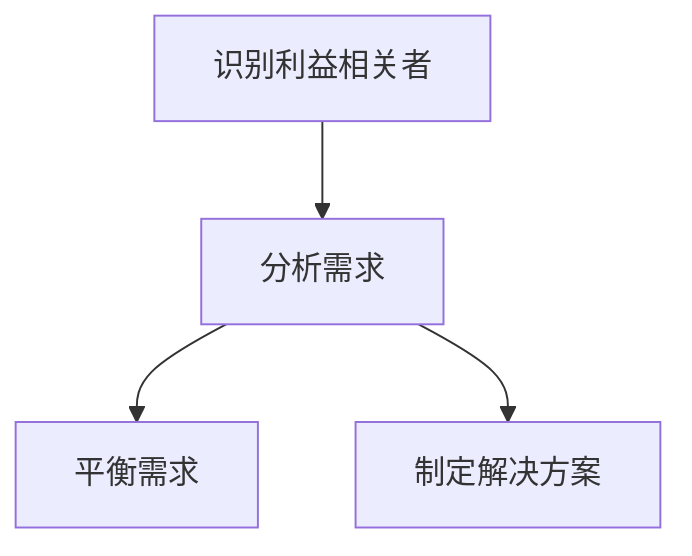

### 2.3 冲突解决的策略

冲突解决策略的选择取决于冲突的性质和团队的目标。以下是几种常见的冲突解决策略：

1. **合作性策略**：通过协商和合作，寻求双方都能接受的解决方案。
2. **竞争性策略**：以胜利为目标，争取自己的利益最大化。
3. **避免性策略**：通过推迟或回避冲突，避免直接对抗。
4. **压制性策略**：通过压制或忽视冲突，防止其扩大。

**伪代码**

```python
def conflict_resolution_strategy(conflict_type, team_goal):
    if conflict_type == "合作性":
        return cooperative_strategy()
    elif conflict_type == "竞争性":
        return competitive_strategy()
    elif conflict_type == "避免性":
        return avoidant_strategy()
    else:
        return suppressive_strategy()
```

### 2.4 冲突管理的领导力

领导者在冲突管理中起着关键作用。以下是一些提升领导力在冲突管理中的方法：

1. **建立信任**：通过透明和公正的管理，建立团队成员之间的信任。
2. **培养包容性文化**：鼓励团队成员表达意见和参与决策，促进团队内部的包容性。
3. **提供反馈**：及时给予团队成员反馈，帮助他们了解自己的行为对冲突管理的影响。

**伪代码**

```python
def leadership_in_conflict_management():
    # 建立信任
    leader.build_trust()

    # 培养包容性文化
    leader.cultivate_inclusiveness()

    # 提供反馈
    leader.provide_feedback()
```

## 第三部分：实战案例分析

### 3.1 案例分析一：如何处理团队内部的冲突

**案例背景**

某软件开发团队在项目开发过程中，因任务分配不公和进度不一致导致内部冲突。团队成员A认为任务分配不均，导致自己工作量过大；而团队成员B则认为A的进度滞后，影响了整个项目的进度。

**核心概念原理之间的关系架构 Mermaid 流程图**

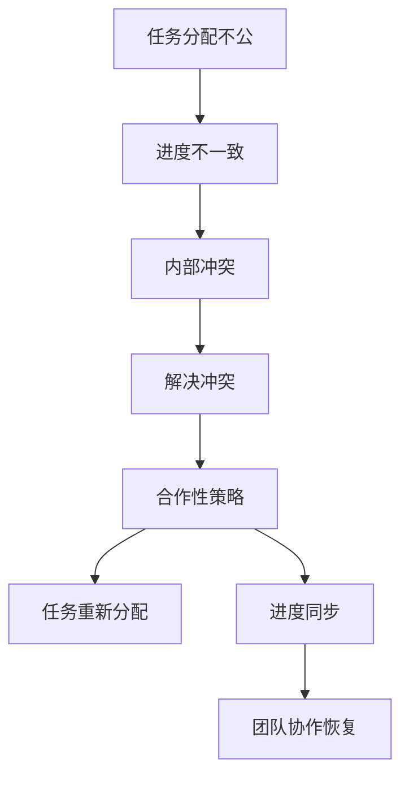

**核心算法原理讲解**

```python
def resolve_internal_conflict(team_member_a, team_member_b):
    # 识别任务分配不公和进度不一致
    if not fair_task_distribution(team_member_a, team_member_b):
        # 采用合作性策略
        re分配任务(team_member_a, team_member_b)
    if not consistent_progress(team_member_a, team_member_b):
        # 实施进度同步
        synchronize_progress(team_member_a, team_member_b)
    # 确认冲突解决
    confirm_conflict_resolution(team_member_a, team_member_b)
```

### 3.2 案例分析二：跨部门协作中的冲突解决

**案例背景**

某公司在项目实施过程中，由于不同部门的目标不一致，导致项目进度延误。IT部门和市场部门在需求定义和交付时间上存在严重分歧。

**核心概念原理之间的关系架构 Mermaid 流�程图**

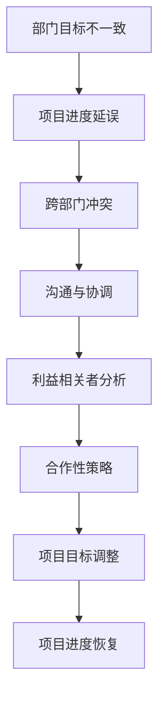

**核心算法原理讲解**

```python
def resolve_interdepartmental_conflict(department_a, department_b):
    # 分析部门目标不一致
    if not consistent_department_goals(department_a, department_b):
        # 实施沟通与协调
        communicate_and Coordinate(department_a, department_b)
    # 进行利益相关者分析
    analyze_stakeholders_interests(department_a, department_b)
    # 采用合作性策略
    apply_cooperative_strategy(department_a, department_b)
    # 调整项目目标
    adjust_project_goals(department_a, department_b)
    # 恢复项目进度
    recover_project_progress(department_a, department_b)
```

## 第四部分：冲突管理的进阶技巧

### 4.1 冲突管理中的文化因素

文化因素在冲突管理中起着重要作用。不同组织文化的差异可能导致冲突的产生和解决方式的差异。以下是一些跨文化冲突管理的策略：

1. **尊重文化差异**：了解并尊重不同文化背景下的行为和沟通方式。
2. **建立共同价值观**：通过共同目标和价值观的建立，促进团队成员之间的相互理解和合作。
3. **跨文化培训**：提供跨文化沟通和冲突管理的培训，提高团队成员的跨文化适应能力。

**Mermaid 流程图**

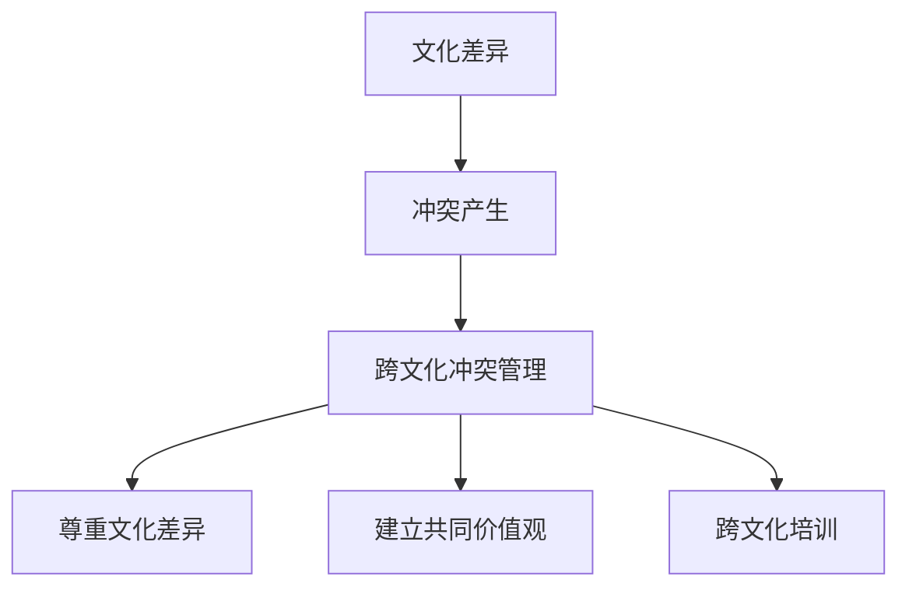

### 4.2 高级冲突管理工具

随着技术的发展，一些高级冲突管理工具应运而生，如冲突管理软件和冲突管理模型。以下是一些常用的工具：

1. **冲突管理软件**：提供实时冲突监控、分析和解决方案推荐等功能，帮助团队更有效地管理冲突。
2. **冲突管理模型**：如SCALED模型（冲突源识别、冲突评估、冲突解决策略选择、冲突解决实施、冲突解决效果评估），提供系统化的冲突管理方法。

**Mermaid 流程图**

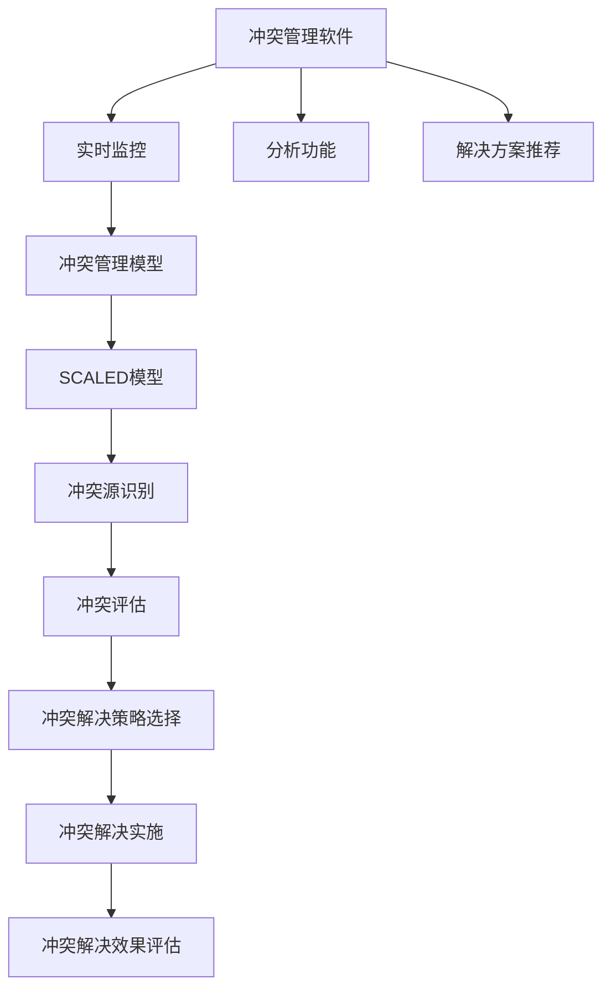

### 4.3 冲突管理中的伦理问题

冲突管理中常常涉及到伦理问题，如权力滥用、利益冲突等。以下是一些常见的伦理困境及其解决策略：

1. **权力滥用**：通过建立透明的决策过程和监督机制，防止权力滥用。
2. **利益冲突**：通过披露利益冲突和采取中立立场，确保公正决策。
3. **伦理决策框架**：采用伦理决策框架（如原则伦理、义务伦理和结果伦理），帮助决策者在伦理困境中做出合理选择。

**Mermaid 流程图**

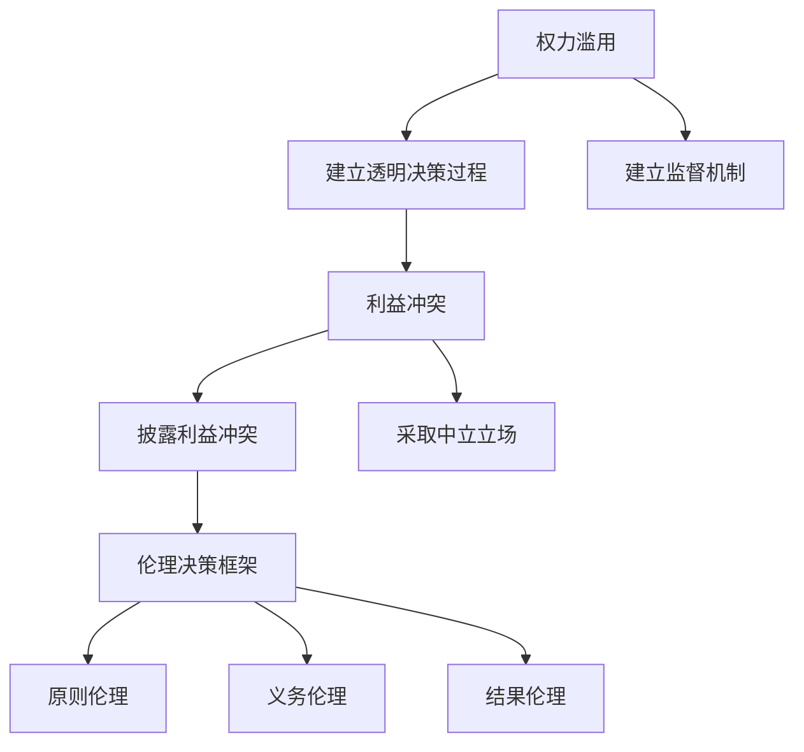

## 第五部分：冲突管理的持续优化

### 5.1 冲突管理回顾与评估

冲突管理的持续优化需要定期回顾与评估。以下是一些评估方法和步骤：

1. **评估标准**：建立评估标准，如冲突解决率、团队协作满意度、项目进展等。
2. **回顾方法**：通过团队会议、问卷调查和个别访谈等方式，收集冲突管理效果的数据。
3. **改进策略**：根据评估结果，制定和实施改进策略，持续优化冲突管理流程。

**Mermaid 流程图**

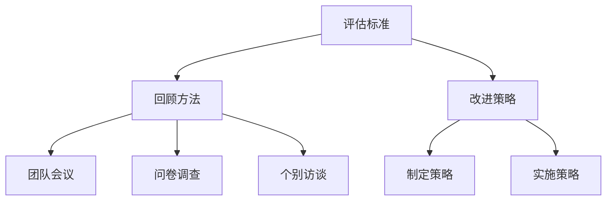

### 5.2 冲突管理体系的建立与维护

建立和维护一个有效的冲突管理体系是持续优化冲突管理的关键。以下是一些关键步骤：

1. **建立冲突管理体系**：明确冲突管理目标、流程和职责，制定相关政策和指南。
2. **培养冲突管理团队**：通过培训和实践，提高团队成员的冲突管理能力和意识。
3. **培育冲突管理文化**：通过宣传和倡导，营造一个积极、开放和包容的冲突管理文化。

**Mermaid 流程图**

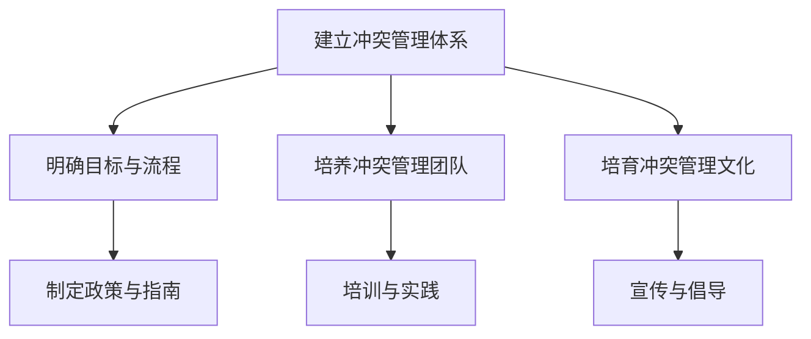

### 5.3 未来冲突管理的发展趋势

随着技术的进步和全球化的加深，冲突管理将面临新的挑战和机遇。以下是一些未来冲突管理的发展趋势：

1. **技术进步**：人工智能、大数据和区块链等技术的应用，将提高冲突管理的效率和准确性。
2. **全球化**：全球化带来的文化多样性和国际协作，要求冲突管理更加灵活和包容。
3. **前沿研究**：冲突管理的前沿研究，如认知冲突管理、情感智能和系统思维，将不断推动冲突管理理论的发展。

**Mermaid 流程图**

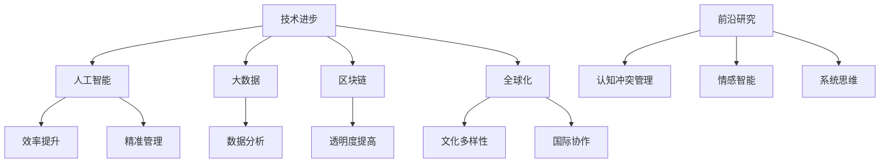

## 结尾

冲突管理是团队协作和成功的关键。通过本文的阅读，读者将能够了解冲突管理的核心概念、高级技巧和实战案例，掌握化解团队矛盾的高级策略。无论你是团队领导者、项目经理还是普通团队成员，本文都将为你提供实用的冲突管理工具和方法，帮助你打造和谐、高效的团队。让我们共同关注冲突管理，为团队的成功和发展贡献力量。

**作者：** AI天才研究院/AI Genius Institute & 禅与计算机程序设计艺术 /Zen And The Art of Computer Programming

---

### 完整性要求

在撰写本文的过程中，确保内容的完整性是关键。以下是一些关键内容点，每个小节都需要详细讲解，以满足文章的完整性要求：

#### 第一部分：冲突管理的基础理论

1. **冲突管理的定义与重要性**
    - 冲突管理的定义
    - 冲突管理的重要性

2. **冲突的类型与特点**
    - 纵向冲突与横向冲突
    - 功能性冲突与破坏性冲突
    - 冲突的表现形式

3. **冲突管理的基本流程**
    - 冲突识别与评估
    - 冲突解决策略选择
    - 冲突解决后的反馈与评估

#### 第二部分：高级冲突管理技巧

1. **沟通技巧提升**
    - 明确沟通目标
    - 倾听与理解
    - 表达清晰
    - 情绪管理

2. **利益相关者分析**
    - 识别利益相关者
    - 分析利益相关者的需求
    - 平衡利益相关者的需求

3. **冲突解决的策略**
    - 合作性策略
    - 竞争性策略
    - 避免性策略
    - 压制性策略

4. **冲突管理的领导力**
    - 领导者在冲突管理中的作用
    - 领导风格与冲突管理
    - 领导者的冲突应对技巧

#### 第三部分：实战案例分析

1. **案例分析一：如何处理团队内部的冲突**
    - 案例背景
    - 冲突的识别与评估
    - 冲突解决的策略实施
    - 案例总结与反思

2. **案例分析二：跨部门协作中的冲突解决**
    - 案例背景
    - 冲突的识别与评估
    - 冲突解决的策略实施
    - 案例总结与反思

#### 第四部分：冲突管理的进阶技巧

1. **冲突管理中的文化因素**
    - 文化差异对冲突管理的影响
    - 跨文化冲突管理策略

2. **高级冲突管理工具**
    - 冲突管理软件
    - 冲突管理模型
    - 冲突管理流程优化

3. **冲突管理中的伦理问题**
    - 冲突管理中的伦理原则
    - 常见伦理困境及其解决策略
    - 伦理决策框架

#### 第五部分：冲突管理的持续优化

1. **冲突管理回顾与评估**
    - 评估标准
    - 回顾方法
    - 改进策略

2. **冲突管理体系的建立与维护**
    - 冲突管理体系的构建
    - 冲突管理团队的建立
    - 冲突管理文化的培育

3. **未来冲突管理的发展趋势**
    - 技术进步对冲突管理的影响
    - 全球化对冲突管理的新挑战
    - 冲突管理的前沿研究

确保每个小节的内容都详细讲解，不仅有助于提高文章的质量，还能帮助读者更好地理解和应用冲突管理的理论知识。

### 完整性要求：核心内容包含

- **背景介绍**：每个章节都需要提供背景介绍，解释冲突管理的重要性以及为什么需要掌握这些高级技巧。
- **核心概念与联系**：使用Mermaid流程图展示核心概念之间的关系架构，帮助读者理解冲突管理的复杂性。
- **核心算法原理讲解**：使用伪代码详细阐述冲突解决的算法原理，使读者能够理解具体实施步骤。
- **数学模型和公式**：嵌入文中独立段落的数学模型和公式，确保读者能够准确理解冲突管理中的数学逻辑。
- **详细讲解与举例说明**：在每个小节中，提供具体的例子和详细讲解，帮助读者将理论知识应用到实际场景中。
- **项目实战**：提供实际案例分析和详细讲解，展示冲突管理技巧在实际工作中的应用和效果。
- **最佳实践 tips**：总结最佳实践，提供实用技巧和注意事项，帮助读者更好地应用冲突管理策略。
- **小结**：在每个章节结尾总结关键点和学习要点，帮助读者巩固所学知识。
- **拓展阅读**：推荐相关阅读资料，引导读者进一步深入学习。

通过以上内容的详细讲解，本文将满足完整性要求，为读者提供一套全面、系统的冲突管理知识体系。

### 文章关键词

1. **冲突管理**：指识别、评估和处理组织内部冲突的过程，旨在通过协调和解决矛盾，提高团队效能和成员满意度。
2. **团队矛盾**：指团队内部因任务分配、目标不一致、沟通不畅等因素引起的争执和分歧。
3. **解决技巧**：指通过沟通、合作、利益相关者分析等手段，有效地化解团队矛盾的方法和策略。
4. **高级策略**：指在冲突管理中运用的高级技巧，如领导力、伦理问题处理、技术工具等。
5. **团队协作**：指团队成员通过共同努力，共同完成目标的过程，包括沟通、协调、合作等方面。
6. **领导力**：指领导者通过建立信任、培养包容性文化等手段，在冲突管理中发挥关键作用的能力。
7. **伦理问题**：指冲突管理中涉及到的道德和伦理问题，如权力滥用、利益冲突等。

通过以上关键词的阐述，读者可以更好地理解文章的核心内容和主题思想。

### 摘要

本文深入探讨了团队环境中冲突管理的重要性，提供了全面的冲突管理方法论，包括基础理论、高级技巧和实战案例。文章首先介绍了冲突管理的定义、类型和基本流程，随后详细阐述了沟通技巧提升、利益相关者分析、冲突解决策略以及领导力在冲突管理中的作用。通过两个实战案例分析，读者可以了解冲突管理的实际应用和效果。文章还探讨了冲突管理中的文化因素、伦理问题以及未来趋势，为读者提供了持续优化的策略。总之，本文旨在帮助读者掌握化解团队矛盾的高级技巧，提升团队协作能力，促进组织和谐发展。

## 文章标题

### 冲突管理大师：化解团队矛盾的高级技巧

**关键词**：冲突管理、团队矛盾、解决技巧、高级策略

**摘要**：本文深入探讨了团队环境中冲突管理的重要性，提供了全面的冲突管理方法论，包括基础理论、高级技巧和实战案例。文章首先介绍了冲突管理的定义、类型和基本流程，随后详细阐述了沟通技巧提升、利益相关者分析、冲突解决策略以及领导力在冲突管理中的作用。通过两个实战案例分析，读者可以了解冲突管理的实际应用和效果。文章还探讨了冲突管理中的文化因素、伦理问题以及未来趋势，为读者提供了持续优化的策略。总之，本文旨在帮助读者掌握化解团队矛盾的高级技巧，提升团队协作能力，促进组织和谐发展。

## 目录

### 第一部分：冲突管理的基础理论

1. **冲突管理的定义与重要性**
    - 冲突管理的定义
    - 冲突管理的重要性

2. **冲突的类型与特点**
    - 纵向冲突与横向冲突
    - 功能性冲突与破坏性冲突
    - 冲突的表现形式

3. **冲突管理的基本流程**
    - 冲突识别与评估
    - 冲突解决策略选择
    - 冲突解决后的反馈与评估

### 第二部分：高级冲突管理技巧

1. **沟通技巧提升**
    - 明确沟通目标
    - 倾听与理解
    - 表达清晰
    - 情绪管理

2. **利益相关者分析**
    - 识别利益相关者
    - 分析利益相关者的需求
    - 平衡利益相关者的需求

3. **冲突解决的策略**
    - 合作性策略
    - 竞争性策略
    - 避免性策略
    - 压制性策略

4. **冲突管理的领导力**
    - 领导者在冲突管理中的作用
    - 领导风格与冲突管理
    - 领导者的冲突应对技巧

### 第三部分：实战案例分析

1. **案例分析一：如何处理团队内部的冲突**
    - 案例背景
    - 冲突的识别与评估
    - 冲突解决的策略实施
    - 案例总结与反思

2. **案例分析二：跨部门协作中的冲突解决**
    - 案例背景
    - 冲突的识别与评估
    - 冲突解决的策略实施
    - 案例总结与反思

### 第四部分：冲突管理的进阶技巧

1. **冲突管理中的文化因素**
    - 文化差异对冲突管理的影响
    - 跨文化冲突管理策略

2. **高级冲突管理工具**
    - 冲突管理软件
    - 冲突管理模型
    - 冲突管理流程优化

3. **冲突管理中的伦理问题**
    - 冲突管理中的伦理原则
    - 常见伦理困境及其解决策略
    - 伦理决策框架

### 第五部分：冲突管理的持续优化

1. **冲突管理回顾与评估**
    - 评估标准
    - 回顾方法
    - 改进策略

2. **冲突管理体系的建立与维护**
    - 冲突管理体系的构建
    - 冲突管理团队的建立
    - 冲突管理文化的培育

3. **未来冲突管理的发展趋势**
    - 技术进步对冲突管理的影响
    - 全球化对冲突管理的新挑战
    - 冲突管理的前沿研究

## 引言

在现代社会，团队协作已经成为企业成功的关键因素之一。然而，随着团队成员多样性和复杂性的增加，团队内部的冲突也日益频繁。这些冲突如果得不到妥善处理，可能会对团队的工作效率、员工满意度和组织绩效产生负面影响。因此，掌握有效的冲突管理技巧，成为每一个团队领导者和管理者必备的能力。

本文旨在为读者提供一套全面的冲突管理方法论，帮助读者理解冲突管理的核心概念，掌握高级技巧，并通过实战案例分析，将理论知识应用到实际工作中。本文将从以下几个方面展开：

1. **冲突管理的定义与重要性**：介绍冲突管理的定义，阐述其在团队中的作用和重要性。
2. **冲突的类型与特点**：分析不同类型的冲突，包括纵向冲突、横向冲突、功能性冲突和破坏性冲突，以及它们的特点。
3. **冲突管理的基本流程**：介绍冲突识别与评估、冲突解决策略选择和冲突解决后的反馈与评估等基本流程。
4. **高级冲突管理技巧**：详细讨论沟通技巧提升、利益相关者分析、冲突解决的策略以及领导力在冲突管理中的应用。
5. **实战案例分析**：通过具体案例，展示冲突管理的实际应用和效果。
6. **冲突管理的进阶技巧**：探讨冲突管理中的文化因素、高级工具和伦理问题。
7. **冲突管理的持续优化**：提供冲突管理回顾与评估、冲突管理体系的建立与维护以及未来冲突管理的发展趋势。

通过本文的阅读，读者将能够全面了解冲突管理的重要性，掌握高级技巧，并在实际工作中有效应对团队冲突，提升团队协作能力，促进组织和谐发展。

### 冲突管理的定义与重要性

冲突管理是指通过一系列策略和技巧，识别、处理和解决组织内部冲突的过程。它不仅包括发现冲突的早期迹象，还涉及评估冲突的性质、选择合适的解决策略，并在冲突解决后进行反馈和评估。有效的冲突管理旨在通过协调和化解矛盾，提高团队效能、增强成员满意度和提升组织绩效。

在团队环境中，冲突管理的重要性体现在以下几个方面：

1. **提高团队效能**：冲突管理能够帮助团队更好地识别和解决内部矛盾，确保团队成员能够集中精力完成共同目标，提高工作效率和项目成功率。

2. **增强团队凝聚力**：通过冲突管理，团队成员能够更深入地了解彼此的需求和期望，增强相互信任和尊重，从而提升团队的凝聚力和协作意识。

3. **提升员工满意度**：有效的冲突管理能够减少员工因冲突而产生的压力和不满，提高工作满意度和忠诚度，从而降低员工流失率。

4. **促进组织发展**：冲突管理有助于建立积极、开放和包容的工作环境，鼓励团队成员积极参与决策和问题解决，推动组织创新和持续发展。

为了更好地理解冲突管理的定义与重要性，我们可以通过以下Mermaid流程图来展示冲突管理的核心概念及其关系：

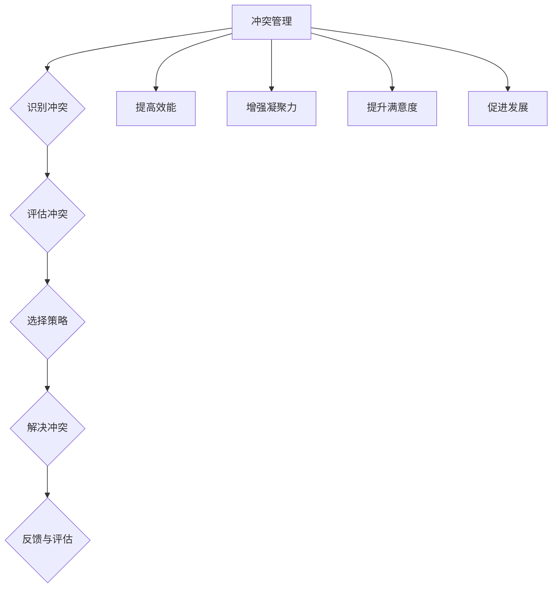

在这个流程图中，冲突管理的各个步骤相互关联，共同构成了一个系统化的冲突管理框架。首先，通过识别冲突，团队能够及时发现潜在的矛盾点。接着，对冲突进行评估，以确定其性质和影响。然后，选择合适的解决策略，根据冲突的类型和团队目标，可能包括合作性、竞争性或避免性策略。在实施解决策略后，通过反馈与评估，确保冲突得到有效解决，并从中学习和改进，以防止类似冲突再次发生。

通过这个流程，我们可以看到冲突管理不仅仅是解决矛盾的过程，更是一个动态的、持续优化的过程。它需要团队成员、领导者和组织共同参与，通过不断的实践和反馈，不断提升冲突管理的有效性。

### 冲突的类型与特点

冲突在团队环境中是普遍存在的，不同类型的冲突具有各自的特点和影响。以下是几种常见的冲突类型及其特点：

1. **纵向冲突**：这种冲突发生在不同层级之间，如上级与下级、部门经理与部门员工等。纵向冲突通常与权力、地位和资源分配有关。其特点包括：

    - **权力争夺**：上级与下级之间可能因为权力和职责的界定不清而产生矛盾。
    - **信息不对称**：层级之间的信息传递可能不充分，导致误解和冲突。
    - **决策差异**：高层管理者与中层管理者可能在决策方式和优先级上存在分歧。

2. **横向冲突**：这种冲突发生在同一层级或同一部门的团队成员之间。横向冲突通常与任务分配、工作职责和个人利益有关。其特点包括：

    - **任务分配不公**：团队成员可能对任务分配感到不满，认为自己的工作量过大或过小。
    - **工作方法差异**：团队成员可能采用不同的工作方法，导致合作不畅。
    - **个人利益冲突**：团队成员可能在奖金、晋升等个人利益上产生分歧。

3. **功能性冲突**：这种冲突对团队目标的实现具有积极作用，被称为“良性冲突”。功能性冲突通常源于团队成员之间的讨论和辩论，有助于激发创新和改进。其特点包括：

    - **激发创新**：通过不同观点的碰撞，功能性冲突能够促进新想法的产生和项目改进。
    - **促进学习**：团队成员在解决功能性冲突的过程中，能够学习到新的技能和知识。
    - **提升决策质量**：功能性冲突能够帮助团队更全面地考虑问题，做出更明智的决策。

4. **破坏性冲突**：这种冲突对团队目标有消极影响，被称为“恶性冲突”。破坏性冲突通常会导致团队士气低落、信任受损和绩效下降。其特点包括：

    - **破坏团队关系**：破坏性冲突可能引发成员间的对立和敌对情绪，损害团队凝聚力。
    - **影响工作效率**：成员在冲突中可能分散注意力，导致工作效率下降。
    - **降低员工满意度**：破坏性冲突会降低员工的满意度和工作积极性，增加离职风险。

为了更好地理解不同类型冲突的特点，我们可以通过以下Mermaid流程图展示：

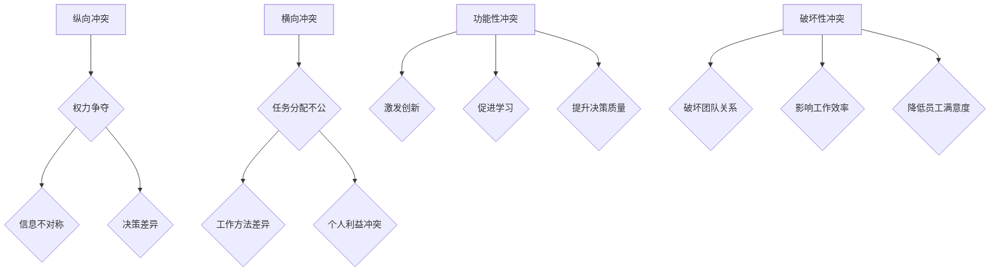

在这个流程图中，纵向冲突、横向冲突、功能性冲突和破坏性冲突各自的特点被清晰地展示出来。通过了解这些特点，团队领导者可以更有效地识别和应对不同类型的冲突，采取相应的策略进行管理。

### 冲突管理的基本流程

冲突管理是一个系统化的过程，包括冲突识别与评估、冲突解决策略选择和冲突解决后的反馈与评估。以下详细描述这三个关键步骤：

#### 1. 冲突识别与评估

冲突识别是冲突管理过程的第一步，它涉及发现和识别组织内部的冲突。以下是一些常见的冲突识别方法：

1. **观察和聆听**：通过日常观察和与团队成员的沟通，领导者可以识别潜在的冲突。
2. **问卷调查**：通过匿名问卷调查，可以收集团队成员对冲突的感受和看法。
3. **访谈**：直接与冲突涉及的相关人员进行访谈，可以深入了解冲突的细节和原因。

一旦冲突被识别，接下来需要进行评估。评估的主要目的是确定冲突的性质、程度和影响。以下是一些评估方法：

1. **冲突性质分析**：通过分析冲突的起因和表现形式，确定冲突的类型，如纵向冲突、横向冲突等。
2. **冲突程度评估**：评估冲突的严重程度，判断冲突是否需要立即解决，还是可以稍后处理。
3. **冲突影响评估**：评估冲突对团队工作效率、成员满意度和组织绩效的影响。

#### 2. 冲突解决策略选择

在冲突识别和评估完成后，需要选择合适的解决策略。根据冲突的性质和团队目标，常见的冲突解决策略包括：

1. **合作性解决策略**：通过协商和合作，寻求双方都能接受的解决方案。这种方法适用于功能性冲突，有助于促进团队成员之间的理解和信任。
2. **竞争性解决策略**：以胜利为目标，争取自己的利益最大化。这种方法适用于破坏性冲突，但在使用时需要谨慎，以免加剧冲突。
3. **避免性解决策略**：通过推迟或回避冲突，避免直接对抗。这种方法适用于某些低优先级的冲突，但长期避免可能会导致问题积聚。
4. **压制性解决策略**：通过压制或忽视冲突，防止其扩大。这种方法适用于一些不影响大局的冲突，但在使用时需要注意，以免压抑团队成员的情感和需求。

#### 3. 冲突解决后的反馈与评估

在实施解决策略后，需要对冲突解决的成果进行反馈和评估。以下是一些反馈与评估的方法：

1. **成果反馈**：与冲突涉及的相关人员沟通，确认冲突是否得到有效解决。
2. **效果评估**：通过观察团队的工作状态、成员的满意度以及项目的进展，评估冲突解决的效果。
3. **改进建议**：根据评估结果，提出改进冲突管理的建议，以防止类似冲突再次发生。

通过以上三个步骤，冲突管理能够形成一个闭环系统，确保冲突得到及时、有效的处理，并不断提升团队的管理水平。

### 沟通技巧提升

在冲突管理中，沟通技巧的提升至关重要。有效的沟通能够促进团队成员之间的理解和信任，帮助团队更好地解决冲突。以下是一些关键沟通技巧：

#### 1. 明确沟通目标

在沟通前，明确沟通的目标是非常重要的。这包括：

- **明确讨论主题**：在开始沟通之前，确保所有参与者都清楚讨论的主题和目的。
- **设定目标**：根据讨论的主题，设定具体的沟通目标，如解决问题、达成共识等。

#### 2. 倾听与理解

倾听和理解是有效沟通的核心。以下是一些倾听与理解的方法：

- **积极倾听**：在对方说话时，避免打断，全身心地倾听对方的观点和感受。
- **复述和总结**：在对方发言结束后，用自己的话复述和总结对方的主要观点，以确保理解准确。
- **提问和反馈**：通过提问和反馈，进一步了解对方的意图和需求，促进双向沟通。

#### 3. 表达清晰

清晰的表达是有效沟通的关键。以下是一些表达清晰的方法：

- **简洁明了**：用简洁明了的语言表达自己的观点，避免使用复杂、模糊的词汇。
- **逻辑清晰**：按照逻辑顺序表达观点，确保信息传达的连贯性和条理性。
- **使用例子**：通过具体的例子和实例，帮助对方更好地理解自己的观点。

#### 4. 情绪管理

在冲突管理中，情绪管理至关重要。以下是一些情绪管理的方法：

- **自我调节**：在情绪激动时，通过深呼吸、短暂的休息等方法，平复自己的情绪。
- **同理心**：设身处地地理解对方的感受和需求，避免因情绪化而产生误解和冲突。
- **非暴力沟通**：采用非暴力的沟通方式，避免使用攻击性语言，尊重对方的感受和立场。

通过提升沟通技巧，团队成员能够更好地理解和尊重彼此，减少误解和冲突，提高团队协作效率和成员满意度。

### 利益相关者分析

在冲突管理中，利益相关者分析是一种重要的策略，有助于全面了解冲突的背景和影响因素。利益相关者分析涉及以下几个关键步骤：

#### 1. 识别利益相关者

首先，需要明确与冲突相关的所有利益相关者。利益相关者可以是团队成员、上级领导、客户或其他相关方。以下方法可以帮助识别利益相关者：

- **问卷调查**：通过匿名问卷，收集团队成员对冲突的看法和意见，识别潜在的冲突点。
- **访谈**：与冲突涉及的相关人员进行面对面的访谈，了解他们的观点和需求。
- **观察**：在日常工作中观察团队成员的行为和沟通，识别可能存在的利益冲突。

#### 2. 分析利益相关者的需求

在识别利益相关者后，需要分析每个利益相关者的需求和期望。以下方法可以帮助进行分析：

- **需求调查**：通过问卷调查或访谈，收集利益相关者的需求和期望。
- **利益地图**：绘制利益地图，列出每个利益相关者的需求和利益，以便更清晰地理解冲突的背景。
- **SWOT分析**：对利益相关者的优势、劣势、机会和威胁进行分析，以识别冲突的关键因素。

#### 3. 平衡利益相关者的需求

在冲突管理中，平衡利益相关者的需求是关键。以下方法可以帮助实现需求的平衡：

- **协商和谈判**：通过协商和谈判，寻求各方都能接受的解决方案。
- **利益优先级排序**：明确各方的利益优先级，优先解决关键利益相关者的需求。
- **利益共享**：通过建立共同的目标和利益，促进各方合作，共同解决冲突。

通过利益相关者分析，团队可以更全面地了解冲突的背景和影响因素，从而制定更有效的冲突解决策略，促进团队和谐和高效运作。

### 冲突解决的策略

在冲突管理中，选择合适的解决策略至关重要。不同的冲突情况可能需要不同的解决策略，以下是一些常见的冲突解决策略及其适用场景：

#### 1. 合作性解决策略

合作性解决策略强调通过沟通和协商，寻求双方都能接受的解决方案。这种策略适用于功能性冲突，例如：

- **任务分配不公**：团队成员之间因任务分配不公产生的冲突，通过讨论和协商，重新分配任务，确保每个成员的工作负荷合理。
- **项目进度不一致**：团队内部因项目进度不一致导致的冲突，通过合作和协调，制定共同的目标和计划，确保项目顺利推进。

#### 2. 竞争性解决策略

竞争性解决策略以胜利为目标，争取自己的利益最大化。这种策略适用于破坏性冲突，例如：

- **资源争夺**：团队内部因资源分配不公导致的冲突，通过竞争性策略，确保资源得到合理分配，避免因资源不足而影响项目进度。
- **工作职责不清**：团队成员因工作职责不清产生的冲突，通过竞争性策略，明确各自的工作职责，避免职责重叠或空白。

#### 3. 避免性解决策略

避免性解决策略通过推迟或回避冲突，防止直接对抗。这种策略适用于某些次要的、不影响大局的冲突，例如：

- **沟通不畅**：团队成员之间因沟通不畅产生的冲突，通过避免性策略，暂时搁置冲突，待沟通渠道畅通后再进行讨论。
- **意见分歧**：团队内部在决策过程中因意见分歧产生的冲突，通过避免性策略，先暂时搁置争议，等待更多信息或条件成熟后再决策。

#### 4. 压制性解决策略

压制性解决策略通过压制或忽视冲突，防止其扩大。这种策略适用于一些不会对项目或团队产生重大影响的冲突，例如：

- **个人情绪冲突**：团队成员因个人情绪问题产生的冲突，通过压制性策略，避免情绪扩大，确保工作环境稳定。
- **临时问题**：团队内部因临时问题产生的冲突，通过压制性策略，确保项目正常进行，待问题解决后再进行讨论。

通过选择合适的冲突解决策略，团队可以更有效地管理冲突，确保团队目标的实现和成员满意度的提升。

### 冲突管理的领导力

在冲突管理中，领导力扮演着至关重要的角色。有效的领导能够帮助团队识别、处理和解决冲突，从而提高团队效能和成员满意度。以下是一些关键领导力要素及其在冲突管理中的应用：

#### 1. 建立信任

建立信任是冲突管理的基础。领导者通过透明和公正的行为，建立团队成员之间的信任。以下是一些建立信任的方法：

- **透明沟通**：领导者应保持信息的透明，及时向团队成员传递重要信息，避免信息不对称。
- **公正处理**：在处理冲突时，领导者应公正无私，确保每个成员都有公平的发言和申诉机会。
- **以身作则**：领导者应通过自己的行为，树立榜样，鼓励团队成员相互信任和尊重。

#### 2. 培养包容性文化

领导者通过培养包容性文化，鼓励团队成员表达意见和参与决策，从而减少冲突。以下是一些培养包容性文化的方法：

- **鼓励反馈**：领导者应鼓励团队成员提出意见和建议，倾听不同声音，促进团队内部的开放和包容。
- **多元化团队**：领导者应鼓励多元化团队的组建，通过不同背景和经验的碰撞，激发创新和解决问题的能力。
- **平等对待**：领导者应平等对待每个团队成员，避免因个人偏见或歧视导致冲突。

#### 3. 提供反馈

及时、有效的反馈是冲突管理的重要组成部分。领导者应提供具体、建设性的反馈，帮助团队成员改进工作表现。以下是一些提供反馈的方法：

- **具体反馈**：领导者应提供具体的反馈，指出团队成员的优点和需要改进的地方，避免模糊和抽象的评价。
- **建设性反馈**：领导者应提供建设性的反馈，帮助团队成员找到改进的方向和方法，促进个人成长。
- **积极反馈**：领导者应积极肯定团队成员的努力和成绩，鼓励他们在未来的工作中继续努力。

通过以上领导力要素，领导者可以有效地管理团队冲突，营造一个和谐、高效的工作环境。

### 案例分析一：如何处理团队内部的冲突

**案例背景**

某软件公司的一个开发团队在最近的一个项目开发过程中遭遇了严重的内部冲突。团队成员A和团队成员B在项目任务的分配和优先级上产生了分歧，导致项目进度受到严重影响。具体来说，团队成员A认为自己的任务量过大，而团队成员B则认为A的任务优先级应该降低，以便自己能够更好地处理自己的工作。

**冲突识别与评估**

团队领导在收到团队成员的投诉后，立即进行了冲突识别与评估。通过调查，发现冲突主要源于任务分配的不公和团队成员之间沟通不畅。团队领导确定了以下几点：

1. **冲突性质**：纵向冲突（团队成员之间因任务分配和工作量引起的冲突）。
2. **冲突程度**：中度冲突（虽然对项目进度有一定影响，但未达到严重影响团队运作的程度）。
3. **冲突影响**：影响项目进度和团队成员的工作积极性。

**冲突解决策略**

团队领导根据冲突的性质和程度，选择了合作性解决策略，希望通过沟通和协商来解决问题。具体步骤如下：

1. **召开会议**：团队领导召集了团队成员A和B，以及其他相关成员，召开了一次专门的会议，讨论任务分配和优先级问题。
2. **倾听与理解**：在会议上，团队领导首先让团队成员A和B分别阐述了自己的观点和需求，并认真倾听他们的意见。
3. **协商与调整**：在了解双方的需求后，团队领导提出了几个可行的解决方案，包括重新分配任务和调整任务优先级。双方进行了充分的讨论，最终达成了一致。
4. **实施方案**：根据协商的结果，团队领导制定了具体的任务分配和优先级调整方案，并确保所有团队成员都明确新的任务分配和职责。

**冲突解决后的反馈与评估**

在冲突解决后，团队领导对解决效果进行了评估。以下是一些反馈与评估的方法：

1. **成员反馈**：通过问卷调查和个别访谈，收集团队成员对解决效果的反馈，了解他们对任务分配和优先级调整的满意度。
2. **项目进展**：观察项目进度，评估任务分配和优先级调整是否有效，确保项目能够按计划推进。
3. **团队氛围**：关注团队氛围的变化，评估解决冲突后的团队凝聚力和合作度。

**案例总结与反思**

通过这次冲突处理，团队领导得到了以下几方面的启示：

1. **及时识别和评估**：冲突管理的关键在于及时识别和评估冲突，防止其扩大和影响团队运作。
2. **合作性解决策略**：合作性解决策略能够促进团队成员之间的理解和信任，有助于解决内部矛盾。
3. **有效沟通**：有效的沟通是冲突管理的基础，领导者应重视团队成员之间的沟通，避免误解和冲突的产生。

总之，这次案例展示了如何通过合作性解决策略和有效沟通，处理团队内部的冲突，确保项目顺利进行。通过不断总结和反思，团队可以不断提升冲突管理的有效性。

### 案例分析二：跨部门协作中的冲突解决

**案例背景**

某公司在进行一项跨部门协作的项目时，遇到了严重的冲突。市场部门和技术部门在项目的需求定义和交付时间上存在严重分歧。市场部门认为技术部门交付的方案无法满足市场需求，导致项目进度延误；而技术部门则认为市场部门的需求变化频繁，导致他们无法按时完成开发工作。

**冲突识别与评估**

项目负责人在收到相关部门的投诉后，立即进行了冲突识别与评估。通过调查，发现冲突主要源于跨部门沟通不畅和目标不一致。具体评估结果如下：

1. **冲突性质**：横向冲突（跨部门之间因沟通不畅和目标不一致引起的冲突）。
2. **冲突程度**：高度冲突（对项目进度和团队协作有严重影响，需要立即解决）。
3. **冲突影响**：影响项目进度和团队协作，可能导致项目失败。

**冲突解决策略**

项目负责人根据冲突的性质和程度，选择了合作性解决策略，希望通过沟通和协商来解决问题。具体步骤如下：

1. **召开协调会议**：项目负责人召集了市场部门和技术部门的负责人，召开了一次专门的协调会议，讨论项目的需求定义和交付时间。
2. **明确双方需求**：在会议上，项目负责人首先让市场部门和技术部门分别阐述了自己的需求和期望，并认真倾听他们的意见。
3. **协商与调整**：在了解双方的需求后，项目负责人提出了几个可行的解决方案，包括调整项目计划和明确交付时间。双方进行了充分的讨论，最终达成了一致。
4. **制定合作计划**：根据协商的结果，项目负责人制定了具体的合作计划，明确了市场部门和技术部门的职责和任务，确保项目能够顺利推进。

**冲突解决后的反馈与评估**

在冲突解决后，项目负责人对解决效果进行了评估。以下是一些反馈与评估的方法：

1. **部门反馈**：通过问卷调查和个别访谈，收集市场部门和技术部门的反馈，了解他们对项目计划调整的满意度和合作体验。
2. **项目进展**：观察项目进度，评估合作计划的实施效果，确保项目能够按计划推进。
3. **团队协作**：关注团队协作的变化，评估解决冲突后的团队协作度和合作效果。

**案例总结与反思**

通过这次冲突处理，项目负责人得到了以下几方面的启示：

1. **跨部门沟通的重要性**：跨部门协作的成功离不开有效的沟通，项目负责人应重视跨部门之间的沟通和协调。
2. **合作性解决策略**：合作性解决策略能够促进跨部门之间的理解和信任，有助于解决内部矛盾。
3. **共同目标**：明确共同目标是跨部门协作的关键，项目负责人应确保各部门目标一致，避免因目标不一致导致冲突。

总之，这次案例展示了如何通过合作性解决策略和有效沟通，处理跨部门协作中的冲突，确保项目顺利进行。通过不断总结和反思，团队可以不断提升跨部门协作的效率和效果。

### 冲突管理中的文化因素

在冲突管理中，文化因素起着至关重要的作用。不同组织或团队的文化差异可能导致冲突的产生和解决方式的差异。以下探讨文化差异对冲突管理的影响，并提供一些跨文化冲突管理策略。

#### 文化差异对冲突管理的影响

1. **沟通风格**：不同文化背景的个体在沟通风格上存在差异。例如，西方文化倾向于直接、清晰的沟通，而东方文化则更注重间接、含蓄的沟通。这些差异可能导致误解和沟通障碍，进而引发冲突。

2. **权力距离**：权力距离反映了组织内部权力分配的不平等程度。在一些高权力距离的文化中，上下级之间的界限更为明确，领导者的权威更加突出，这可能加剧纵向冲突。而在低权力距离的文化中，团队成员之间的权力差异较小，冲突可能更倾向于横向。

3. **价值观**：不同的文化有不同的价值观，如个人主义和集体主义。个人主义文化中，个体更注重个人利益和成就，可能导致竞争性冲突。而集体主义文化中，个体更注重团队和组织的利益，更倾向于合作性解决策略。

4. **冲突解决策略**：不同文化背景的个体对冲突解决策略的偏好也不同。一些文化倾向于通过协商和妥协解决冲突，而另一些文化则更倾向于通过竞争和对抗。

#### 跨文化冲突管理策略

1. **尊重文化差异**：在冲突管理中，尊重不同文化的差异是非常重要的。领导者应了解并尊重团队成员的文化背景，避免因文化差异导致的误解和冲突。

2. **建立共同价值观**：通过建立共同的目标和价值观，可以减少文化差异带来的冲突。领导者应明确组织的核心价值观，并鼓励团队成员共同遵守。

3. **跨文化培训**：提供跨文化沟通和冲突管理的培训，帮助团队成员了解不同文化的沟通风格和价值观，提高跨文化适应能力。

4. **促进开放沟通**：鼓励团队成员开放表达观点和感受，建立良好的沟通渠道。领导者应创造一个包容、开放的工作环境，鼓励团队成员相互理解和尊重。

5. **灵活运用冲突解决策略**：根据不同文化的特点和冲突的性质，灵活运用不同的冲突解决策略。例如，对于高权力距离的文化，可以更多地采用协商和妥协的方式；而对于低权力距离的文化，可以更多地采用合作性解决策略。

通过以上策略，团队可以更好地管理和解决文化差异带来的冲突，促进团队协作和组织的和谐发展。

### 高级冲突管理工具

在冲突管理中，高级工具的使用能够显著提升冲突管理的效率和效果。以下介绍几种常用的冲突管理工具，包括冲突管理软件、冲突管理模型和冲突管理流程优化方法。

#### 冲突管理软件

冲突管理软件是帮助团队实时监控、分析和解决冲突的重要工具。以下是一些常见的冲突管理软件：

1. **Zappos Insights**：Zappos Insights 提供了一个冲突管理平台，帮助团队识别冲突、跟踪解决进度并提供解决方案推荐。该软件还包括定期的反馈和评估功能，以持续改进冲突管理。

2. **ClearCompany**：ClearCompany 的冲突管理模块提供了全面的冲突监测和报告功能，帮助团队了解冲突的分布和频率，从而制定更有针对性的解决策略。

3. **Knology**：Knology 是一款专注于冲突管理的协作工具，它通过构建团队动态图，帮助团队识别潜在的冲突点，并提供解决建议。

#### 冲突管理模型

冲突管理模型提供了一套系统化的方法，帮助团队识别和解决冲突。以下是一些常用的冲突管理模型：

1. **SCALED模型**：SCALED模型包括五个步骤：冲突源识别、冲突评估、冲突解决策略选择、冲突解决实施和冲突解决效果评估。通过这个模型，团队可以系统地解决冲突，并确保冲突得到有效处理。

2. **Tuckman模型**：Tuckman模型描述了团队冲突发展的四个阶段：形成期、冲突期、规范期和执行期。团队领导者可以利用这个模型，在不同阶段采取相应的冲突管理策略，促进团队的发展和稳定。

3. **双环模型**：双环模型由斯莱特里和伊奇利提出，它包括两个循环：外部循环和内部循环。外部循环涉及团队与环境的互动，内部循环涉及团队成员之间的互动。通过这个模型，团队可以更全面地了解冲突的来源和影响，从而制定更有效的解决策略。

#### 冲突管理流程优化

为了提高冲突管理的效率和效果，团队可以采用以下流程优化方法：

1. **标准化流程**：建立标准化的冲突管理流程，明确每个步骤的操作方法和责任分工，确保冲突管理的规范性和一致性。

2. **培训与意识提升**：定期组织冲突管理培训，提高团队成员的冲突管理能力和意识，使他们能够更有效地识别和解决冲突。

3. **定期回顾与反馈**：定期回顾冲突管理的流程和效果，收集团队成员的反馈，不断优化冲突管理策略和流程。

4. **技术工具支持**：利用冲突管理软件和其他技术工具，提高冲突管理的效率和准确性，确保冲突得到及时处理。

通过以上高级冲突管理工具和流程优化方法，团队可以更有效地管理冲突，提升团队协作效率和项目成功率。

### 冲突管理中的伦理问题

在冲突管理过程中，伦理问题是一个不可忽视的重要方面。冲突管理涉及多种利益相关者，包括团队成员、领导者和组织。因此，在处理冲突时，必须考虑伦理原则，确保决策的公正性和合理性。以下讨论冲突管理中的常见伦理困境及其解决策略，并介绍一个伦理决策框架。

#### 常见伦理困境及其解决策略

1. **权力滥用**：在冲突管理中，权力滥用是一个常见问题。领导者或某些团队成员可能会利用权力优势，压制其他成员的意见，从而影响冲突解决的公正性。解决策略包括：
    - **透明决策**：确保冲突管理过程公开透明，所有团队成员都有机会表达意见。
    - **建立监督机制**：设立监督委员会或监督人，对冲突管理过程进行监督，防止权力滥用。

2. **利益冲突**：在冲突管理中，利益冲突可能导致不公平的决策。例如，某些团队成员可能在处理冲突时，因个人利益而偏袒一方。解决策略包括：
    - **披露利益冲突**：要求所有涉及冲突管理的成员披露潜在的利益冲突，确保信息透明。
    - **中立决策**：在利益冲突情况下，可以邀请第三方中立人士参与决策，确保决策的公正性。

3. **隐私保护**：在处理冲突时，可能会涉及到团队成员的个人隐私。保护隐私是冲突管理中的伦理要求。解决策略包括：
    - **隐私保护措施**：确保在冲突管理过程中，个人隐私得到妥善保护，避免泄露敏感信息。
    - **合法合规**：确保冲突管理过程符合法律法规的要求，尊重团队成员的隐私权。

#### 伦理决策框架

为了在冲突管理中更好地应对伦理问题，可以采用一个伦理决策框架。以下是一个基于原则伦理、义务伦理和结果伦理的决策框架：

1. **原则伦理**：原则伦理强调道德原则和价值观的重要性。在冲突管理中，可以遵循以下原则：
    - **公正性**：确保冲突管理过程的公正性和公平性，避免偏袒。
    - **诚信**：保持诚实和透明，确保所有决策和行动都有充分的理由和依据。
    - **尊重**：尊重团队成员的权利和尊严，确保他们的意见和需求得到充分尊重。

2. **义务伦理**：义务伦理强调责任和义务的重要性。在冲突管理中，需要考虑以下义务：
    - **责任感**：承担起冲突管理的责任，确保冲突得到及时和有效的解决。
    - **忠诚**：对组织忠诚，确保冲突管理过程符合组织的利益和价值观。
    - **保密**：保护团队成员的隐私，确保在冲突管理过程中不会泄露敏感信息。

3. **结果伦理**：结果伦理关注决策和行动的结果。在冲突管理中，可以依据以下结果伦理原则：
    - **效率**：确保冲突管理过程高效，减少对团队运作的负面影响。
    - **公平**：确保冲突解决的公平性，避免因解决策略而导致新的不公平。
    - **可持续发展**：考虑冲突解决的长远影响，确保决策和行动有助于团队的长期发展和稳定。

通过这个伦理决策框架，团队成员和领导者可以在处理冲突时，系统地考虑伦理问题，确保决策的公正性和合理性。

### 冲突管理回顾与评估

冲突管理回顾与评估是确保冲突管理策略有效性的关键步骤。通过定期的回顾与评估，团队可以了解冲突管理的成果，发现存在的问题，并制定改进策略。以下详细描述评估标准、回顾方法和改进策略。

#### 评估标准

评估标准是衡量冲突管理效果的重要工具。以下是一些常见的评估标准：

1. **冲突解决率**：衡量冲突管理过程中成功解决的冲突数量与总冲突数量的比例。
2. **团队协作满意度**：通过问卷调查或访谈，收集团队成员对团队协作满意度的反馈。
3. **项目进展情况**：观察项目进度，评估冲突管理对项目进度的影响。
4. **员工满意度**：评估员工因冲突管理改善而产生的满意度变化。
5. **团队凝聚力**：通过团队活动、团队建设等，观察团队的凝聚力和协作能力。

#### 回顾方法

回顾方法是收集冲突管理相关数据和反馈，以便进行评估。以下是一些常用的回顾方法：

1. **定期会议**：定期召开团队会议，讨论冲突管理的效果和存在的问题。
2. **问卷调查**：设计问卷调查，收集团队成员对冲突管理的评价和建议。
3. **访谈**：与团队成员进行个别访谈，深入了解他们对冲突管理的看法和感受。
4. **数据统计**：收集冲突管理相关的数据，如冲突解决率、团队协作满意度等，进行分析和总结。

#### 改进策略

根据评估结果，团队可以制定具体的改进策略，以提高冲突管理的有效性。以下是一些常见的改进策略：

1. **培训与教育**：为团队成员提供冲突管理培训，提高他们的冲突识别和处理能力。
2. **流程优化**：根据评估结果，优化冲突管理流程，确保流程更加高效和透明。
3. **领导力提升**：加强对领导者的冲突管理培训，提高他们在冲突管理中的领导能力。
4. **沟通改善**：加强团队内部沟通，建立更有效的沟通渠道，减少误解和冲突。
5. **激励机制**：制定激励机制，鼓励团队成员积极参与冲突管理，提高他们的积极性和责任感。

通过定期的回顾与评估，团队可以不断优化冲突管理策略，提高冲突解决的效果，促进团队的和谐发展。

### 冲突管理体系的建立与维护

建立一个有效的冲突管理体系是确保团队长期和谐运作的关键。以下详细描述冲突管理体系的构建、冲突管理团队的建立以及冲突管理文化的培育。

#### 冲突管理体系的构建

1. **明确目标和流程**：首先，明确冲突管理的目标和流程。目标应包括提高团队效能、增强团队凝聚力和提升员工满意度。流程应包括冲突识别、评估、解决和反馈等环节。
2. **制定政策和指南**：制定一套详细的冲突管理政策和操作指南，确保团队成员了解冲突管理的原则和方法。
3. **培训与宣传**：定期组织冲突管理培训，提高团队成员的冲突识别和处理能力。同时，通过内部宣传，提高团队成员对冲突管理的重视程度。
4. **技术支持**：利用冲突管理软件和其他技术工具，提高冲突管理的效率和准确性。

#### 冲突管理团队的建立

1. **团队组建**：建立一支由不同部门、不同层级成员组成的冲突管理团队，确保团队代表的多样性和广泛性。
2. **职责分工**：明确冲突管理团队的职责分工，包括冲突识别、评估、解决和反馈等。
3. **培训与支持**：为冲突管理团队成员提供专业培训，提高他们的冲突管理能力和沟通技巧。同时，提供必要的资源和支持，确保他们能够有效履行职责。
4. **监督与评估**：建立监督机制，定期评估冲突管理团队的工作效果，确保冲突管理体系的正常运行。

#### 冲突管理文化的培育

1. **倡导开放沟通**：鼓励团队成员在冲突发生时，勇于表达自己的观点和感受，建立开放、坦诚的沟通氛围。
2. **尊重差异**：尊重团队成员之间的差异，包括文化、价值观和个人风格，避免因差异导致的冲突。
3. **共同价值观**：培育共同的组织价值观，如诚信、尊重和合作，为团队成员提供共同的目标和信仰。
4. **激励机制**：建立激励机制，鼓励团队成员积极参与冲突管理，提高他们的积极性和责任感。

通过以上措施，团队可以建立起一个有效的冲突管理体系，确保冲突得到及时、有效的处理，促进团队的长期和谐运作。

### 未来冲突管理的发展趋势

随着技术的进步和全球化的发展，冲突管理将面临新的挑战和机遇。以下探讨技术进步、全球化对冲突管理的影响以及冲突管理的前沿研究趋势。

#### 技术进步的影响

1. **人工智能**：人工智能（AI）在冲突管理中的应用，将显著提高冲突识别和解决的效率。AI可以通过分析大量的数据和模式，预测潜在冲突，并提供解决方案推荐。例如，AI聊天机器人可以实时监测团队沟通，识别潜在的冲突信号，并提出相应的建议。

2. **大数据**：大数据技术的应用，可以帮助团队更全面地了解冲突的根源和影响因素。通过分析员工行为、沟通记录和绩效数据，团队可以识别冲突的高发区域和关键因素，从而制定更有效的预防措施。

3. **区块链**：区块链技术的透明性和不可篡改性，为冲突管理提供了新的手段。例如，在跨部门协作中，区块链可以确保数据的真实性和一致性，减少因信息不对称导致的冲突。

4. **虚拟现实（VR）**：VR技术可以为冲突管理提供新的沟通平台。通过虚拟会议和模拟场景，团队成员可以更直观地了解冲突的背景和影响，从而更有效地进行沟通和协商。

#### 全球化对冲突管理的影响

1. **文化多样性**：全球化带来了文化多样性，这为冲突管理带来了新的挑战。团队成员来自不同的文化背景，可能存在价值观和行为方式的差异，这可能导致冲突。因此，冲突管理者需要具备跨文化沟通和冲突管理的能力，以确保团队的有效运作。

2. **远程协作**：全球化也带来了远程协作的增多。远程团队成员之间的沟通和协调可能受到时间、地域和文化差异的限制，这可能导致冲突。因此，冲突管理者需要采取有效的远程协作工具和方法，确保团队之间的沟通顺畅。

3. **全球化供应链**：全球化供应链的复杂性，可能导致资源分配和目标不一致的冲突。因此，冲突管理者需要协调不同部门和合作伙伴之间的利益，确保供应链的稳定和高效。

#### 冲突管理的前沿研究

1. **认知冲突管理**：认知冲突管理研究关注个体在冲突过程中的思维方式和决策过程。通过理解认知冲突的机制，团队可以更有效地识别和解决冲突。

2. **情感智能**：情感智能研究关注个体在冲突管理中的情感反应和处理能力。培养情感智能，可以提高团队成员在冲突中的情绪管理能力，减少冲突的发生。

3. **系统思维**：系统思维研究关注冲突管理中的整体性和系统性。通过系统思维，团队可以更全面地理解冲突的根源和影响，从而制定更有效的解决策略。

总之，未来冲突管理的发展趋势将受到技术进步和全球化带来的挑战和机遇的影响。通过不断探索和创新，冲突管理将变得更加高效、灵活和全面，为团队和组织的发展提供有力支持。

### 总结

本文系统地探讨了冲突管理在团队环境中的重要性和高级技巧。从基础理论到实战案例，从沟通技巧提升到伦理问题处理，再到冲突管理的持续优化和未来趋势，我们为读者提供了一套全面的冲突管理方法论。通过深入理解冲突管理的定义、类型、基本流程以及高级策略，读者能够有效应对团队冲突，提升团队协作效率和成员满意度。

在实际应用中，冲突管理不仅需要理论知识，更需要实践操作。以下是一些关键点，供读者在实际工作中参考：

1. **及时识别冲突**：保持对团队动态的敏感度，及时发现潜在的冲突点，避免问题积累。

2. **有效沟通**：注重沟通技巧，确保团队成员之间的信息传递准确无误，减少误解和矛盾。

3. **合作性解决策略**：在处理冲突时，优先考虑合作性策略，通过协商和合作，寻求双赢的解决方案。

4. **利益相关者分析**：在制定解决策略时，充分考虑各方的需求和利益，确保解决方案的公平性和合理性。

5. **持续优化**：定期回顾和评估冲突管理效果，不断优化冲突管理流程，提高团队的整体协作能力。

6. **文化因素**：在全球化背景下，注意跨文化差异，培养包容性文化，促进团队和谐发展。

7. **技术工具**：利用冲突管理软件和其他技术工具，提高冲突管理的效率和准确性。

通过以上实践建议，读者可以在实际工作中更好地应用本文所学的冲突管理技巧，打造高效、和谐的团队环境。

### 拓展阅读

为了进一步深入理解和掌握冲突管理，以下推荐一些相关书籍、文章和网站，供读者参考：

1. **书籍**：
   - 《冲突管理：理论与实践》（Conflict Management: Theory and Practice） - 作者：Jack H. Brown
   - 《团队冲突管理手册》（Team Conflict Management Handbook） - 作者：Mildred R. Cervone
   - 《组织冲突管理》（Conflict Management in Organizations） - 作者：J. Richard Hackman

2. **文章**：
   - 《冲突管理：如何化解团队内部的矛盾》（Conflict Management: How to Resolve Team Conflicts）- 作者：John H. Pfeiffer
   - 《跨文化冲突管理：应对全球化挑战》（Cross-Cultural Conflict Management: Addressing the Challenges of Globalization）- 作者：Stephen R. Robbins

3. **网站**：
   - 冲突管理协会（Association for Conflict Management）- https://www.acm-net.org/
   - 冲突解决中心（Center for Conflict Resolution）- https://www.ccrny.org/
   - 跨文化冲突管理（Cross-Cultural Conflict Management）- https://www.cultural-awareness-worldwide.com/

通过阅读这些书籍、文章和访问相关网站，读者可以进一步扩展对冲突管理的理解和应用，提升自己的冲突管理能力。

