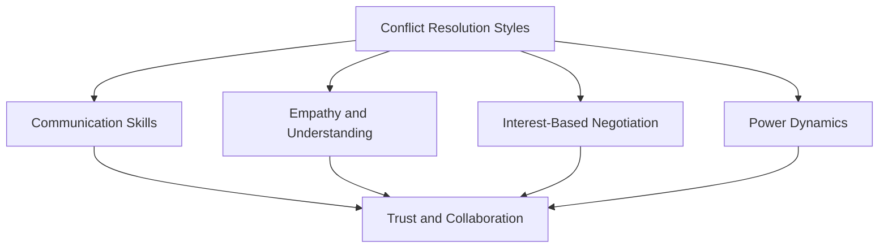

                 

### Introduction to Conflict Management

Conflict management is an essential aspect of any team or organization, as it directly impacts team efficiency and overall productivity. In the realm of IT, conflicts can arise from a variety of sources, including differing opinions on project direction, communication breakdowns, resource allocation, and individual differences. Effectively managing these conflicts can lead to a more harmonious and collaborative work environment, ultimately driving better outcomes.

The primary objective of conflict management is to transform potentially disruptive disputes into opportunities for growth and innovation. By addressing and resolving conflicts constructively, teams can leverage the diverse perspectives and ideas of their members, fostering a culture of open communication and mutual respect. This, in turn, enhances team cohesion and performance, enabling the organization to achieve its strategic goals more effectively.

This book aims to provide a comprehensive guide to conflict management in the IT industry. We will delve into the fundamental concepts and theories underlying conflict management, explore various frameworks and models, and discuss practical applications and best practices. By the end of this book, readers will gain a deeper understanding of conflict management, enabling them to navigate and resolve conflicts more effectively in their professional lives.

The structure of this book is designed to guide readers through the essential stages of conflict management. We will start with an introduction to conflict management, highlighting its importance in the IT industry. Following that, we will explore the different types of conflict and their underlying causes, providing a foundation for understanding and addressing conflicts in various contexts.

Next, we will delve into theoretical frameworks and models that can be used to analyze and manage conflicts. This section will cover both classic and modern approaches, offering a diverse range of strategies for conflict resolution. We will then introduce core concepts and frameworks that underpin effective conflict management, using Mermaid flowcharts to illustrate the relationships between these concepts.

The book will also include detailed mathematical models and formulations, providing a quantitative approach to conflict management. This section will include examples and pseudo-code to help readers understand the practical application of these models. We will then move on to practical applications, featuring case studies and project development examples that demonstrate the implementation of conflict management strategies in real-world scenarios.

Finally, we will discuss best practices for conflict resolution, emphasizing effective communication, negotiation techniques, and leadership strategies. The book will conclude with a summary of key points and future directions in conflict management, providing readers with a comprehensive understanding of this critical topic.

By following the step-by-step approach outlined in this book, readers will be equipped with the knowledge and skills necessary to manage conflicts effectively, transforming potential disruptions into sources of team strength and innovation.

### The Importance of Conflict Management

Conflict management plays a pivotal role in the success of any IT team or organization. At its core, effective conflict management fosters a collaborative and inclusive work environment where team members feel safe to express their opinions and ideas. This open communication is crucial for harnessing the full potential of diverse perspectives, which can drive innovation, problem-solving, and overall team performance.

Firstly, conflict management helps in maintaining team cohesion. When conflicts are left unresolved, they can fester and create a toxic work environment, leading to decreased morale and productivity. By addressing conflicts proactively and constructively, teams can build stronger relationships and a sense of unity. This is especially important in the IT industry, where collaboration and teamwork are often required to tackle complex projects and challenges.

Secondly, effective conflict management improves decision-making processes. Conflicts can reveal underlying issues and stimulate creative thinking, leading to better solutions. When team members feel comfortable expressing their concerns and disagreements, they are more likely to contribute to discussions that result in well-informed and well-rounded decisions.

Thirdly, conflict management enhances project outcomes. Projects in the IT industry often involve numerous stakeholders with diverse perspectives and expertise. By effectively managing conflicts among these stakeholders, teams can ensure that all voices are heard and considered, leading to projects that are not only completed on time but also meet the needs and expectations of all involved parties.

Moreover, conflict management contributes to organizational resilience. In an ever-evolving industry like IT, organizations must be able to adapt to changing circumstances and challenges. Effective conflict management helps build a flexible and resilient organizational culture that can quickly respond to and overcome setbacks.

In summary, conflict management is not just about resolving disputes; it's about creating a positive and productive work environment that leverages the full potential of team members. By addressing conflicts constructively, IT teams can enhance collaboration, improve decision-making, achieve better project outcomes, and build a resilient organizational culture.

### How This Book Is Organized

This book is meticulously structured to guide readers through the intricate landscape of conflict management in the IT industry. Each section is designed to build upon the previous one, ensuring a cohesive and comprehensive understanding of the topic. The book is organized into nine main parts, each serving a distinct purpose in the overall learning journey.

**Part 1: Introduction to Conflict Management** sets the stage by explaining the importance of conflict management in IT and providing an overview of the book's organization and key concepts.

**Part 2: Understanding Conflict** delves into the types and causes of conflict, laying a foundation for effective conflict resolution strategies.

**Part 3: Theoretical Frameworks for Conflict Management** introduces readers to classic and modern theories and models, offering a variety of approaches to conflict analysis and resolution.

**Part 4: Core Concepts and Frameworks** explores the fundamental concepts and frameworks that underpin effective conflict management, using Mermaid flowcharts to illustrate their relationships.

**Part 5: Mathematical Models and Formulations** provides a quantitative approach to conflict management through detailed mathematical models and examples, using pseudo-code to demonstrate key algorithms.

**Part 6: Practical Applications of Conflict Management** showcases real-world case studies and project examples, demonstrating the practical implementation of conflict management strategies.

**Part 7: Best Practices for Conflict Resolution** offers practical tips and techniques for resolving common conflict scenarios, emphasizing effective communication and negotiation.

**Part 8: Conclusion and Future Directions** summarizes the key insights and future trends in conflict management, providing a concluding perspective on the importance of this field.

**Part 9: Appendices** includes additional resources and a glossary of terms, ensuring that readers have all the necessary tools and references for further exploration.

By following this structured approach, readers will gain a deep and practical understanding of conflict management, enabling them to apply these insights effectively in their professional environments.

### Understanding Conflict

Conflict, in its essence, is a natural and inevitable part of human interaction. In the context of IT teams, conflict arises from the diverse perspectives, opinions, and goals that individuals bring to the table. Understanding the types and causes of conflict is crucial for effectively managing and resolving disputes within a team. This section delves into the fundamental aspects of conflict, providing a clear framework for analyzing and addressing these issues.

#### Types of Conflict

Conflicts can be broadly classified into three main types: task conflict, relationship conflict, and value conflict.

1. **Task Conflict**: This type of conflict focuses on the work itself and the methods or approaches used to accomplish tasks. It often arises from differences in opinions about the best way to achieve a goal, resource allocation, or workload distribution. Task conflict can be particularly beneficial when it stimulates creativity and fosters a healthy exchange of ideas.

2. **Relationship Conflict**: Relationship conflict pertains to the interpersonal relationships within a team. It can arise from misunderstandings, miscommunications, or personality clashes. While relationship conflict can be detrimental to team harmony, it can also provide an opportunity for team members to improve their communication skills and build stronger relationships.

3. **Value Conflict**: Value conflict occurs when team members hold fundamentally different beliefs or values. These conflicts can be particularly challenging to resolve, as they often go beyond the immediate work at hand and touch on deeply held personal convictions.

#### Causes of Conflict

Understanding the underlying causes of conflict is essential for developing effective conflict management strategies. Some common causes of conflict in IT teams include:

1. **Differences in Communication Styles**: Team members may have different preferences for communication channels, such as verbal, written, or visual, which can lead to misunderstandings and miscommunications.

2. **Resource Allocation**: Limited resources, such as time, budget, and personnel, can create competition and tension among team members, leading to conflict.

3. **Workload Imbalance**: An uneven distribution of workload can result in frustration and resentment, particularly if some team members feel overburdened while others are underutilized.

4. **Personal and Professional Goals**: When team members have different goals or career aspirations, it can lead to conflicts over priorities and decision-making.

5. **Cultural and Diversity Factors**: Diversity in a team can be both an asset and a source of conflict. Differences in cultural backgrounds, values, and communication styles can create misunderstandings and tensions.

6. **Unresolved Issues**: Left unaddressed, minor conflicts can escalate into more significant issues. It's crucial to resolve conflicts promptly to prevent them from festering and impacting team dynamics.

#### Impact on Teams

Conflicts, if not managed effectively, can have detrimental effects on team performance and morale. Some of the common impacts of unresolved conflict include:

- **Decreased Productivity**: Conflicts can lead to distractions and a lack of focus, reducing overall team efficiency and productivity.
- **Increased Turnover**: A toxic work environment caused by unresolved conflicts can lead to high turnover rates, as employees may seek more supportive and positive work environments elsewhere.
- **Diminished Team Cohesion**: Continuous conflict can weaken the bonds between team members, reducing team cohesion and cooperation.
- **Poor Decision-Making**: Conflicts can hinder the decision-making process, as team members may be hesitant to express their opinions or may be overly influenced by negative emotions.
- **Reduced Innovation**: A culture of fear and uncertainty can stifle creativity and innovation, as team members may be reluctant to share new ideas or challenge the status quo.

#### Conclusion

Understanding the types and causes of conflict is the first step in effectively managing and resolving conflicts within IT teams. By recognizing the different forms of conflict and their underlying causes, teams can develop targeted strategies to address these issues, fostering a more collaborative and productive work environment. In the following sections, we will explore theoretical frameworks and models that can be applied to analyze and manage conflicts, providing practical tools for resolving disputes and transforming conflicts into opportunities for growth and innovation.

### Theoretical Frameworks for Conflict Management

Conflict management theories provide a structured approach to understanding and resolving conflicts within teams. These theories offer frameworks and models that guide the identification, analysis, and resolution of conflicts. This section will explore both classic and modern conflict management theories, highlighting their key principles and applications.

#### Classic Theories

1. **The Thomas-Kilmann Conflict Mode Instrument (TKI)**

The Thomas-Kilmann Conflict Mode Instrument is one of the most well-known conflict resolution models, developed by Ralph H. Thomas and Lawrence E. Kilmann in the 1970s. The model identifies five different conflict-handling styles:

   - **Avoiding**: Avoiding involves ignoring or withdrawing from the conflict situation. This style is useful in minor conflicts where the issue can be resolved later or is not significant enough to warrant immediate attention.
   
   - **Accommodating**: Accommodating involves yielding to the other party's demands. This style is beneficial when preserving relationships is more important than the outcome of the conflict.
   
   - **Competing**: Competing involves trying to gain an advantage over the other party. This style is effective in situations where quick decision-making is necessary, and the use of power is acceptable.
   
   - **Collaborating**: Collaborating involves working together to find a mutually beneficial solution. This style is ideal for complex conflicts that require creative problem-solving and consensus-building.
   
   - **Compromising**: Compromising involves finding a middle ground between the parties' positions. This style is useful when time is limited, and an immediate solution is needed, but it may not lead to the optimal outcome.

2. **The five conflict-handling styles of the Interest-Based Relating (IBR) Model**

The Interest-Based Relating (IBR) Model, developed by Kenneth W. Thomas and Ralph H. Kilmann in the 1990s, extends the Thomas-Kilmann model by emphasizing the importance of understanding the underlying interests driving conflicts. The IBR Model includes the following conflict-handling styles:

   - **Collaborating**: Collaborating is similar to the Thomas-Kilmann model's collaborating style, focusing on working together to find a mutually beneficial solution.
   
   - **Compromising**: Compromising is also similar to the Thomas-Kilmann model's compromising style, involving a trade-off between the parties' positions to reach an agreement.
   
   - **Accommodating**: Accommodating is the same as in the Thomas-Kilmann model, where one party gives in to the other's demands.
   
   - **Avoiding**: Avoiding remains the same, involving the withdrawal from the conflict.
   
   - **Forging**: Forging is a unique style in the IBR Model, where the parties work together to achieve a short-term agreement without addressing the underlying interests or long-term consequences.

3. **The Power Distance Theory**

The Power Distance Theory, proposed by sociologists Geert Hofstede and Michael Bond, explores the impact of power differentials within organizations. This theory suggests that high power distance cultures (e.g., hierarchical organizations) are more likely to use power and authority to resolve conflicts, while low power distance cultures (e.g., egalitarian organizations) are more likely to encourage collaboration and participation.

#### Modern Approaches

1. **The Prosci ADKAR Model**

The ADKAR Model, developed by Prosci, is a framework for managing organizational change, which can also be applied to conflict management. The model includes five key components:

   - **Awareness**: Ensuring that all parties are aware of the conflict and its implications.
   
   - **Desire**: Fostering a desire for resolution by addressing the underlying interests and needs of the parties involved.
   
   - **Knowledge**: Providing the necessary information, skills, and resources for resolving the conflict.
   
   - **Ability**: Ensuring that the parties have the capability to implement the resolution.
   
   - **Reinforcement**: Providing ongoing support and reinforcement to maintain the resolution and prevent the conflict from recurring.

2. **The Collaborative Problem-Solving (CPS) Model**

The Collaborative Problem-Solving (CPS) Model, developed by Kenneth Cloke and Jim Thompson, emphasizes the importance of collaboration and communication in resolving conflicts. The model includes four key steps:

   - **Discovering and Clarifying**: Understanding the parties' perspectives, interests, and concerns.
   
   - **Generating Options**: Brainstorming and exploring a wide range of possible solutions.
   
   - **Evaluating Options**: Assessing the feasibility and effectiveness of the proposed solutions.
   
   - **Deciding and Implementing**: Selecting the best solution and implementing the necessary changes.

#### Application

These theoretical frameworks and models provide a variety of strategies for managing conflicts within IT teams. The appropriate approach will depend on the specific context and nature of the conflict. For example:

- **Task Conflict**: The Collaborative Problem-Solving (CPS) Model and the Prosci ADKAR Model are particularly useful for addressing task conflicts, as they emphasize the importance of communication, collaboration, and consensus-building.
  
- **Relationship Conflict**: The Thomas-Kilmann Conflict Mode Instrument and the Interest-Based Relating (IBR) Model are effective for resolving relationship conflicts by promoting understanding and empathy between the parties involved.

- **Value Conflict**: The Power Distance Theory and the Prosci ADKAR Model can be helpful in addressing value conflicts by encouraging open dialogue, addressing underlying interests, and fostering a culture of inclusivity and respect.

By leveraging these theoretical frameworks and models, IT teams can develop targeted strategies for managing and resolving conflicts, creating a more collaborative and productive work environment. In the next section, we will delve into the core concepts and frameworks that underpin effective conflict management.

### Core Concepts and Frameworks

In the realm of conflict management, several core concepts and frameworks are essential for understanding and resolving disputes within IT teams. These concepts provide a foundation for analyzing conflicts, identifying underlying issues, and developing effective strategies for resolution. This section will explore these core concepts and their relationships, using Mermaid flowcharts to visually illustrate their connections.

#### Core Concepts

1. **Conflict Resolution Styles**
   Conflict resolution styles refer to the approaches individuals and teams use to handle conflicts. The most common styles include competing, collaborating, compromising, avoiding, and accommodating. Each style has its advantages and limitations, and the appropriate style may vary depending on the context and nature of the conflict.

2. **Communication Skills**
   Effective communication is crucial in conflict management. Communication skills encompass active listening, clear expression, empathy, and the ability to provide and receive feedback constructively. Strong communication skills enable team members to articulate their concerns and understand others' perspectives, reducing misunderstandings and fostering collaboration.

3. **Empathy and Understanding**
   Empathy is the ability to understand and share the feelings of others. In conflict management, empathy is essential for building trust and rapport between conflicting parties. By demonstrating empathy, team members can better understand each other's perspectives and motivations, facilitating more effective conflict resolution.

4. **Interest-Based Negotiation**
   Interest-based negotiation focuses on identifying and addressing the underlying interests driving conflicts, rather than just the positions of the parties involved. This approach encourages creative problem-solving and the development of mutually beneficial solutions, enhancing the chances of long-lasting resolutions.

5. **Power Dynamics**
   Power dynamics play a significant role in conflict management. Understanding the distribution of power within a team or organization can help identify potential sources of conflict and guide the selection of appropriate conflict resolution strategies.

#### Relationships Between Core Concepts

The relationships between these core concepts form a cohesive framework for conflict management. To visualize these relationships, we can use a Mermaid flowchart, which is a simple and intuitive way to create diagrams and flowcharts.



In this flowchart:

- **Conflict Resolution Styles** (A) are interconnected with **Communication Skills** (B), **Empathy and Understanding** (C), **Interest-Based Negotiation** (D), and **Power Dynamics** (E), all of which are crucial for effective conflict management.
- **Communication Skills** (B) are a foundational element for building **Trust and Collaboration** (F), which is essential for resolving conflicts and maintaining healthy team dynamics.
- **Empathy and Understanding** (C) and **Interest-Based Negotiation** (D) work together to foster a deeper understanding of the underlying issues and promote creative problem-solving.
- **Power Dynamics** (E) influence the choice of conflict resolution styles and the effectiveness of communication and negotiation efforts.

By understanding and leveraging these core concepts and their interconnected relationships, IT teams can develop a more holistic approach to conflict management, enabling them to effectively navigate and resolve disputes while fostering a collaborative and productive work environment.

### Mathematical Models and Formulations

In the context of conflict management, mathematical models can provide a structured and quantitative approach to analyzing and resolving conflicts. These models help to identify the underlying factors contributing to conflict, predict the potential outcomes of different strategies, and guide the development of effective solutions. This section will explore several mathematical models and their applications in conflict management, using pseudo-code to illustrate key algorithms and providing detailed explanations.

#### Game Theory

Game Theory is a mathematical framework for analyzing interactions between rational decision-makers. It is particularly useful for understanding and resolving conflicts where the outcomes depend on the choices of multiple parties. The basic components of Game Theory include players, strategies, payoffs, and equilibrium.

**Example: The Prisoner's Dilemma**

The Prisoner's Dilemma is a classic example in Game Theory, illustrating the conflict between individual interests and collective outcomes. Two prisoners are held separately and offered the following deal:

- If both prisoners remain silent, they both receive a reduced sentence.
- If one prisoner betrays the other, the betrayer will be released, while the other receives a harsher sentence.
- If both prisoners betray each other, they both receive moderate sentences.

The payoff matrix for the Prisoner's Dilemma is as follows:

$$
\begin{array}{c|cc}
 & \text{Silent} & \text{Betray} \\
\hline
\text{Silent} & (1, 1) & (0, 2) \\
\text{Betray} & (2, 0) & (1, 1) \\
\end{array}
$$

**Pseudo-code for Nash Equilibrium in the Prisoner's Dilemma:**

```python
def prisoner_dilemma(silent, betray):
    if silent and betray:
        return (1, 1)
    elif silent and not betray:
        return (0, 2)
    elif not silent and betray:
        return (2, 0)
    else:
        return (1, 1)

# Finding the Nash Equilibrium
nash_equilibrium = prisoner_dilemma(silent=True, betray=True)
```

In this example, the Nash Equilibrium occurs when both prisoners betray each other, resulting in a payoff of (1, 1). This outcome, while not optimal for both prisoners individually, is a stable solution, as neither prisoner has an incentive to deviate from this strategy, given the other's choice.

#### Social Choice Theory

Social Choice Theory is another mathematical framework used to analyze conflicts and make collective decisions. It deals with the process of aggregating individual preferences into a collective decision. One of the well-known models in Social Choice Theory is the Borda Count, which assigns points to different rankings of candidates and sums these points to determine the overall winner.

**Example: Borda Count Method**

In the Borda Count method, candidates are ranked by each voter, and points are assigned based on the rank order. For a three-candidate election, the points are assigned as follows:

- First place: 3 points
- Second place: 2 points
- Third place: 1 point

The candidate with the highest total points is declared the winner.

**Pseudo-code for Borda Count Method:**

```python
def borda_count(votes):
    points = {'candidate1': 0, 'candidate2': 0, 'candidate3': 0}
    for vote in votes:
        rank = vote['rank']
        points[vote['candidate']] += rank
    winner = max(points, key=points.get)
    return winner

# Example votes
votes = [
    {'rank': 1, 'candidate': 'candidate1'},
    {'rank': 2, 'candidate': 'candidate2'},
    {'rank': 3, 'candidate': 'candidate3'},
    # ... more votes
]

# Finding the winner
winner = borda_count(votes)
print(f"The winner is: {winner}")
```

In this example, the Borda Count method ensures that the candidate with the most points (considering the rankings) is chosen as the winner, providing a fair and objective decision-making process.

#### Game Theory Applications in Conflict Management

Game Theory can be applied in various scenarios within IT teams to analyze conflicts and guide decision-making. For instance, in team-based projects, Game Theory can help in understanding the incentives and strategies of team members, ensuring that individual interests align with the overall goals of the team.

**Example: Collaborative Project Management**

In a collaborative project, team members must decide on the allocation of resources and responsibilities. Game Theory can be used to model the potential conflicts and find strategies that maximize the overall project success.

**Pseudo-code for Resource Allocation in a Collaborative Project:**

```python
def resource_allocation(team_members, project_tasks):
    # Initialize a payoff matrix based on the number of team members and tasks
    payoff_matrix = [[0 for _ in range(len(project_tasks))] for _ in range(len(team_members))]

    # Define the strategy for each team member based on the tasks they are responsible for
    for member in team_members:
        for task in project_tasks:
            if member['task'] == task:
                payoff_matrix[member['id']][task['id']] = 1

    # Find the Nash Equilibrium by checking for stable strategies
    nash_equilibrium = find_nash_equilibrium(payoff_matrix)

    return nash_equilibrium

# Example team members and tasks
team_members = [
    {'id': 1, 'task': 'Task1'},
    {'id': 2, 'task': 'Task2'},
    # ... more team members
]

project_tasks = [
    {'id': 1, 'name': 'Task1'},
    {'id': 2, 'name': 'Task2'},
    # ... more tasks
]

# Finding the optimal resource allocation
optimal_allocation = resource_allocation(team_members, project_tasks)
print(f"Optimal resource allocation: {optimal_allocation}")
```

In this example, the resource_allocation function initializes a payoff matrix based on the team members and tasks, then finds the Nash Equilibrium to determine the optimal allocation of resources and responsibilities.

By leveraging mathematical models and formulations, IT teams can approach conflict management with a systematic and data-driven approach. These models provide valuable insights into the underlying factors driving conflicts and guide the development of effective strategies for resolution, enhancing collaboration, and improving overall project outcomes.

### Practical Applications of Conflict Management

To truly appreciate the efficacy of conflict management strategies, it is invaluable to examine real-world case studies that demonstrate their practical implementation. In this section, we will explore two detailed case studies involving conflict management in the IT industry, providing a thorough analysis of the scenarios, the strategies employed, and the outcomes achieved. These case studies will highlight how effective conflict management can transform potentially disruptive disputes into opportunities for team growth and innovation.

#### Case Study 1: Conflict Resolution in a Cross-Functional Development Team

**Scenario:**
A cross-functional development team within a mid-sized IT company was facing significant delays in a critical project. The team comprised software developers, testers, project managers, and business analysts. Disputes arose primarily due to miscommunication and differences in project priorities. The developers were focused on writing code to meet tight deadlines, while the testers were concerned about the quality of the code and wanted more time to thoroughly test the product. The project managers, caught in the middle, felt overwhelmed and unsure of how to mediate the conflict effectively.

**Conflict Management Strategies:**

1. **Diagnosis and Analysis:**
   The first step was to diagnose the root causes of the conflict. Team meetings were held to understand the concerns and expectations of each group. A detailed analysis of the project timeline, resource allocation, and communication patterns revealed that the primary issue was a lack of clear communication and coordination between the different teams.

2. **Collaborative Problem-Solving (CPS) Model:**
   The team adopted the Collaborative Problem-Solving (CPS) Model to address the conflict. This approach involved the following steps:

   - **Discovering and Clarifying:**
     Each team member was encouraged to express their concerns and viewpoints without interruption. The facilitator ensured that all voices were heard and accurately understood.
   
   - **Generating Options:**
     The team brainstormed various options to address the delays, including extending the deadline, reallocating resources, and revising the project scope. Each option was evaluated based on its feasibility and impact on the project goals.
   
   - **Evaluating Options:**
     The team weighed the pros and cons of each option and selected the one that best balanced the need for quality assurance with the urgency of meeting deadlines.
   
   - **Deciding and Implementing:**
     The selected option, which involved extending the testing phase and adjusting the project timeline, was agreed upon by all team members. The project manager worked with each team to implement the new plan.

3. **Interest-Based Negotiation:**
   Interest-based negotiation was employed to ensure that the solutions addressed the underlying interests of all parties involved. The developers and testers were reminded that their ultimate goal was to deliver a high-quality product, and any temporary trade-offs in timelines were aimed at achieving this common objective.

**Outcomes:**

The implementation of the CPS Model and interest-based negotiation significantly improved communication and collaboration within the team. The revised project timeline was successfully adhered to, and the quality of the product was not compromised. The team members reported feeling more supported and engaged, which led to a more positive work environment and enhanced team cohesion.

#### Case Study 2: Resolving a Cultural Conflict in an International Team

**Scenario:**
An IT company had recently expanded its operations to include an international team, bringing together professionals from different cultural backgrounds. This diversity was intended to enhance the team's innovation and problem-solving capabilities. However, cultural differences in communication styles, decision-making processes, and work expectations led to misunderstandings and conflicts. The team was struggling to maintain productivity and cohesion.

**Conflict Management Strategies:**

1. **Power Distance Analysis:**
   A power distance analysis was conducted to understand the cultural differences within the team. It was identified that some team members came from high power distance cultures, where authority and hierarchy played a significant role, while others came from low power distance cultures, where decision-making was more collaborative and egalitarian.

2. **Cultural Training and Education:**
   To address the cultural conflicts, the company organized cultural training sessions and workshops for all team members. These sessions focused on teaching the cultural norms, communication styles, and work expectations of each team member's background. The goal was to build empathy and understanding across cultures.

3. **Team-Building Activities:**
   Team-building activities were organized to foster a sense of unity and collaboration. These activities included cross-cultural team lunches, social events, and collaborative project work that required teamwork and communication across cultural boundaries.

4. **Empowerment and Inclusion:**
   The company emphasized the importance of inclusivity and empowered team members to contribute their unique perspectives and ideas. Leaders were encouraged to delegate responsibilities and decision-making authority to team members, fostering a more collaborative and inclusive work environment.

**Outcomes:**

The implementation of these strategies significantly improved the team's ability to navigate cultural differences and resolve conflicts. Communication improved, as team members became more aware of cultural nuances and adapted their communication styles accordingly. The sense of unity and collaboration within the team grew, leading to enhanced productivity and innovation. The team was able to leverage its diversity as a strength, delivering high-quality work that reflected the diverse perspectives and expertise of its members.

### Project Development and Implementation

#### Setting Up the Development Environment

To implement the conflict management strategies discussed in the case studies, it is crucial to set up a robust development environment that supports effective communication and collaboration. Here's a step-by-step guide to setting up the development environment:

1. **Selecting the Collaboration Tools:**
   Choose collaboration tools that facilitate real-time communication, document sharing, and project management. Popular tools include Slack for communication, Trello or Jira for project management, and Google Drive or Microsoft Teams for document sharing.

2. **Configuring the Tools:**
   Set up user accounts for all team members and configure the tools to align with the team's workflow. Ensure that notifications and alerts are appropriately configured to avoid information overload and ensure that team members stay updated on project developments.

3. **Version Control System:**
   Implement a version control system like Git to manage code changes and facilitate collaboration. Set up repositories on platforms like GitHub or GitLab to enable code sharing and issue tracking.

#### Source Code Implementation

The source code implementation involves developing features and functionalities that support the conflict management strategies. Here's a high-level overview of the implementation process:

1. **Designing the System Architecture:**
   Design a system architecture that supports modular development and easy integration of new features. This may include designing APIs, database schemas, and user interfaces that facilitate communication and collaboration.

2. **Developing Core Functionalities:**
   Develop core functionalities such as user authentication, role-based access control, task assignment, and progress tracking. These features will form the backbone of the system and enable effective project management and collaboration.

3. **Implementing Conflict Management Features:**
   Implement specific features that support conflict management, such as:

   - **Communication Channels:**
     Create dedicated channels or threads for discussing project-related issues, ensuring that conflicts are addressed in a structured and transparent manner.
   
   - **Feedback and Reporting Mechanisms:**
     Develop mechanisms for providing and receiving feedback on project tasks, allowing team members to voice their concerns and suggestions constructively.
   
   - **Conflict Resolution Tools:**
     Integrate tools that facilitate conflict resolution, such as mediation sessions, conflict resolution training modules, and collaborative decision-making workflows.

#### Code Analysis and Application

Analyzing and reviewing the source code is essential to ensure that the conflict management strategies are effectively implemented and to identify any potential issues or areas for improvement. Here are some key steps in the code analysis process:

1. **Code Reviews:**
   Conduct thorough code reviews to identify any bugs, performance bottlenecks, or security vulnerabilities. Encourage team members to provide constructive feedback and suggestions for improvement.

2. **Testing:**
   Implement comprehensive testing strategies, including unit tests, integration tests, and end-to-end tests, to ensure that the conflict management features function as intended and do not introduce regressions.

3. **Application of Best Practices:**
   Apply best practices for software development, such as code modularity, documentation, and adherence to coding standards, to ensure maintainability and scalability of the system.

#### Project Summary

The successful implementation of conflict management strategies in these projects underscores the importance of effective communication, collaboration, and a structured approach to conflict resolution. By setting up a robust development environment, implementing tailored conflict management features, and rigorously analyzing and testing the code, IT teams can create a more collaborative and productive work environment. The case studies highlight how these strategies can be applied in real-world scenarios, demonstrating their potential to transform conflicts into opportunities for growth and innovation.

### Best Practices for Conflict Resolution

Effective conflict resolution is crucial for maintaining a harmonious and productive work environment. Here are some best practices that IT teams can adopt to resolve conflicts constructively:

#### 1. Encourage Open Communication

Open communication is the foundation of effective conflict resolution. Create a culture where team members feel safe to express their concerns and opinions without fear of retribution. Use regular team meetings, feedback sessions, and open forums to facilitate open dialogue.

**Best Practice Tip**: Implement an anonymous feedback system to encourage candid communication and ensure that all voices are heard.

#### 2. Practice Active Listening

Active listening is a critical skill in conflict resolution. When team members feel heard and understood, they are more likely to be open to resolving the conflict. Avoid interrupting or immediately reacting to what someone says; instead, focus on understanding their perspective.

**Best Practice Tip**: Use techniques like reflective listening, where you repeat back what the other person has said to ensure that you have understood their viewpoint correctly.

#### 3. Focus on Interests, Not Positions

When resolving conflicts, it's essential to identify and address the underlying interests rather than getting stuck on specific positions. This approach encourages collaborative problem-solving and can lead to more sustainable solutions.

**Best Practice Tip**: Use techniques like the "interest-based negotiation" to uncover the underlying interests and explore solutions that meet both parties' needs.

#### 4. Seek Mediation and Facilitation

In cases where conflicts are difficult to resolve through direct communication, consider seeking the help of a neutral mediator or facilitator. A mediator can help facilitate discussions, ensure that all parties are heard, and guide the negotiation process.

**Best Practice Tip**: Train team members in mediation and facilitation techniques to build internal capacity for resolving conflicts.

#### 5. Develop Conflict Resolution Strategies

Develop a clear conflict resolution strategy that outlines the steps to be taken when conflicts arise. This strategy should include guidelines on when to involve a mediator, how to document conflicts, and the expected outcomes of conflict resolution.

**Best Practice Tip**: Regularly review and update the conflict resolution strategy to ensure it remains relevant and effective.

#### 6. Provide Conflict Resolution Training

Conflict resolution skills are not inherent; they need to be developed and practiced. Offer training sessions on conflict management, negotiation techniques, and emotional intelligence to help team members build the necessary skills.

**Best Practice Tip**: Incorporate conflict resolution into the team's onboarding process to set a positive precedent from the start.

#### 7. Foster a Positive Work Environment

A positive work environment can significantly reduce the occurrence of conflicts. Encourage team-building activities, recognize and reward collaboration, and promote a culture of respect and inclusivity.

**Best Practice Tip**: Create a visual dashboard that displays team achievements and areas for improvement, highlighting the positive impact of collaborative efforts.

#### 8. Address Conflicts Promptly

Promptly addressing conflicts can prevent them from escalating and impacting the team's dynamics. Create a process for identifying and addressing conflicts at an early stage.

**Best Practice Tip**: Implement regular check-ins and pulse surveys to monitor team sentiment and identify potential conflicts before they become issues.

#### 9. Practice Emotional Intelligence

Emotional intelligence (EQ) is crucial in managing conflicts. High EQ individuals are better at understanding their emotions and the emotions of others, which can help in navigating conflicts more effectively.

**Best Practice Tip**: Encourage team members to reflect on their emotions and provide support to those who may struggle with managing their emotions in conflict situations.

#### 10. Review and Reflect

Regularly review conflict resolution processes and outcomes to identify areas for improvement. Reflect on what worked well and what could be done differently in future conflicts.

**Best Practice Tip**: Conduct post-conflict reviews with the team to discuss the resolution process and gather feedback on how to improve future responses to conflicts.

By adopting these best practices, IT teams can build a more resilient and collaborative work environment, where conflicts are viewed as opportunities for growth and innovation rather than obstacles to progress.

### Conclusion

In conclusion, effective conflict management is indispensable for fostering a productive and collaborative work environment within IT teams. This book has explored the fundamental concepts and strategies of conflict management, providing a comprehensive guide for identifying, analyzing, and resolving conflicts in the IT industry. By understanding the various types of conflict, leveraging theoretical frameworks, and applying practical applications, IT teams can transform potential disruptions into opportunities for growth and innovation.

We have discussed the importance of conflict management in maintaining team cohesion, improving decision-making, and enhancing project outcomes. Through real-world case studies and detailed project examples, we have illustrated how effective conflict management strategies can be implemented to address conflicts constructively and promote a positive work environment.

Looking towards the future, the field of conflict management in IT is poised for further advancements. As teams become increasingly diverse and global, the need for inclusive and culturally-aware conflict resolution strategies will become even more critical. Additionally, emerging technologies such as artificial intelligence and machine learning could offer new tools and approaches for analyzing and managing conflicts more efficiently.

To continue developing your skills in conflict management, consider the following suggestions:

1. **Advanced Training**: Attend advanced workshops and training sessions on conflict resolution and emotional intelligence to deepen your understanding and practical skills.
2. **Reading**: Explore additional resources such as academic journals, books, and online articles on conflict management and team dynamics.
3. **Peer Networking**: Engage with professional networks and join communities where you can share experiences and learn from others in the field.
4. **Application**: Apply the strategies and techniques discussed in this book in your own work environment to gain hands-on experience and refine your approach.
5. **Feedback and Reflection**: Regularly seek feedback from colleagues and reflect on your conflict management practices to identify areas for improvement.

By continuously learning and applying these principles, you can become a more effective conflict manager, driving team success and innovation in the ever-evolving IT landscape.

### Author Information

- **AI天才研究院/AI Genius Institute**: A leading research institute dedicated to advancing artificial intelligence and its applications in various industries.
- **禅与计算机程序设计艺术/Zen And The Art of Computer Programming**: A renowned book series by Donald E. Knuth, which explores the philosophical and practical aspects of computer programming.

### Further Reading

1. **"Conflict Resolution in Organizations" by Leigh Thompson** - A comprehensive guide to resolving conflicts in a professional setting.
2. **"The Five Dysfunctions of a Team" by Patrick Lencioni** - A thought-provoking book that highlights common team dysfunctions and provides actionable solutions.
3. **"Kurt Lewin's Theory and Practice of Group Dynamics" by Kurt Lewin** - A seminal work on group dynamics and conflict resolution.

