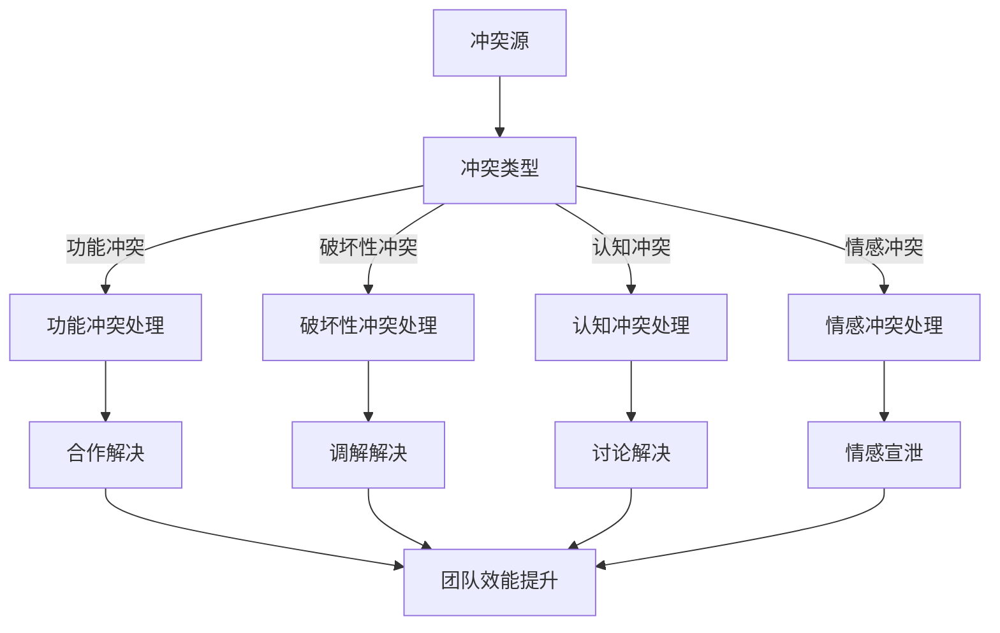
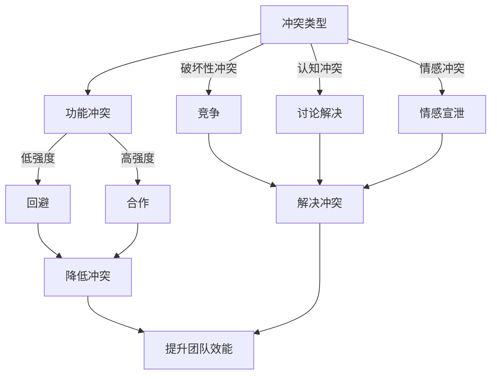

                 

## 冲突管理：将分歧转化为团队优势的方法

### 关键词
- 冲突管理
- 团队合作
- 分歧转化
- 冲突类型
- 冲突解决策略

### 摘要
在现代工作环境中，冲突是不可避免的，尤其是在高度复杂的IT领域。本文旨在探讨冲突管理的方法，特别是如何将团队内部的分歧转化为促进团队整体发展的优势。文章首先介绍了冲突管理的基本概念和重要性，随后深入分析了冲突的类型和特点。接着，文章提出了一系列的冲突解决策略，并使用Mermaid流程图展示了这些策略的架构。最后，通过实际项目案例，本文详细讲解了冲突管理在实践中的应用和效果。

---

### 引言

在现代企业，特别是IT领域，团队合作日益成为推动项目成功的关键因素。然而，随着团队成员背景、技能和观点的多样性，冲突也在所难免。有效的冲突管理不仅有助于缓解紧张气氛，还能将分歧转化为团队的创新动力。本文将从冲突管理的基本概念出发，探讨冲突的类型和特点，并提出一系列的解决策略。通过实际项目案例，我们将看到冲突管理如何在实践中发挥作用，并总结出最佳实践和注意事项。

---

### 冲突管理的基本概念

冲突管理是指在一个组织或团队内部，通过识别、评估、控制和解决冲突的过程，以促进协作、提高团队效能和实现共同目标。有效的冲突管理不仅能够减少冲突带来的负面影响，还能将冲突转化为团队成长的机遇。

**冲突的类型**

冲突可以分为以下几种类型：

1. **功能冲突（Functional Conflict）**：这种冲突是有益的，它可以促进创新和改善团队性能。例如，团队成员之间的观点差异可以激发新的想法和解决方案。
2. **破坏性冲突（Destructive Conflict）**：这种冲突会损害团队关系，降低工作效率，甚至导致项目失败。例如，个人之间的敌对情绪和恶性竞争。
3. **认知冲突（Cognitive Conflict）**：这种冲突是基于不同观点、知识和经验的差异。通过讨论和交流，这些冲突可以转化为有价值的信息和知识。
4. **情感冲突（Emotional Conflict）**：这种冲突源于个人情感和价值观的差异，往往难以通过理性方式解决。

**冲突管理的目的**

冲突管理的目的主要包括：

1. **降低冲突的负面影响**：通过有效的冲突管理，可以减少冲突带来的情绪波动、降低团队士气、提高员工离职率等负面影响。
2. **提高团队效能**：通过将冲突转化为积极的动力，团队可以更有效地协作，提高项目完成质量和效率。
3. **增强团队凝聚力**：通过共同解决冲突，团队成员之间的信任和合作意识可以得到增强。

---

### 核心概念与联系

为了更好地理解冲突管理，我们需要了解以下几个核心概念：

1. **冲突源（Conflict Source）**：冲突的起源，可能是任务分配、资源分配、个人价值观等。
2. **冲突类型（Conflict Type）**：冲突的性质，如功能冲突、破坏性冲突等。
3. **冲突强度（Conflict Intensity）**：冲突的激烈程度，从轻微的摩擦到剧烈的对抗。
4. **冲突解决策略（Conflict Resolution Strategy）**：处理冲突的方法，包括回避、迁就、竞争、合作等。

以下是这些概念之间的Mermaid流程图表示：



通过这个流程图，我们可以清晰地看到冲突源如何影响冲突类型，以及不同类型的冲突如何通过不同的解决策略得到处理。这些策略最终都是为了提升团队效能和凝聚力。

---

### 冲突解决策略

在冲突管理中，选择合适的解决策略至关重要。以下是一些常见的冲突解决策略：

1. **回避（Avoidance）**：通过避免冲突源或冲突情境，暂时缓解冲突。这种方法适用于冲突不严重，且无必要立即解决的问题。
    ```plaintext
    if (conflictIntensity < threshold) {
        ignoreConflict();
    }
    ```

2. **迁就（Accommodation）**：一方在冲突中做出让步，以避免冲突升级。这种方法适用于维护关系比解决问题更重要的情况。
    ```plaintext
    if (preserveRelationship) {
        accommodate();
    }
    ```

3. **竞争（Competing）**：通过强势立场和策略来争夺利益和资源。这种方法适用于冲突涉及关键利益，且时间紧迫的情况。
    ```python
    def compete():
        assert (keyInterest and timeCritical)
        assert (aggressiveStrategy)
    ```

4. **合作（Collaborating）**：通过多方合作和沟通，共同寻找解决方案。这种方法适用于复杂问题，需要集体智慧和努力的情况。
    ```python
    def collaborate():
        assert (complexProblem and diverseExpertise)
        assert (effectiveCommunication)
    ```

这些策略的选择取决于冲突的类型、强度以及团队的具体情况。以下是冲突解决策略的Mermaid流程图表示：



通过这个流程图，我们可以看到不同类型的冲突如何通过不同的策略得到解决，并最终提升团队效能。

---

### 实际项目案例

为了更深入地理解冲突管理在实际项目中的应用，我们来看一个实际案例。

**项目背景**：某IT公司开发一款企业级管理软件，团队成员包括前端、后端、UI设计和产品管理等多个职能角色。在开发过程中，由于任务分配、资源调度和设计理念的不同，团队内部出现了分歧和冲突。

**冲突识别**：通过团队会议和反馈，识别出以下几个主要冲突点：
1. **任务分配**：前端和后端开发团队对任务优先级存在不同意见。
2. **资源调度**：UI设计团队认为资源分配不合理，影响项目进度。
3. **设计理念**：产品管理团队和UI设计团队在用户界面设计上存在理念冲突。

**冲突解决策略**：

1. **合作解决（Collaborating）**：项目负责人组织跨职能团队会议，要求每个团队成员分享自己的观点和担忧，并共同讨论解决方案。通过多次讨论，团队最终确定了任务优先级和资源分配方案。

2. **调解解决（Mediating）**：对于设计理念冲突，项目引入了外部顾问进行调解，通过中立的视角，帮助团队找到了平衡点，最终达成了一致。

3. **情感宣泄（Expressive）**：为了缓解团队成员的情感压力，项目还组织了团队建设活动，如团建游戏和户外拓展，帮助团队成员释放压力，增进相互了解。

**项目效果**：通过有效的冲突管理，项目团队成功克服了内部的分歧，提高了合作效率。最终，项目按计划完成了开发，并得到了客户的认可。

---

### 最佳实践与注意事项

在冲突管理过程中，以下是一些最佳实践和注意事项：

1. **及时识别冲突**：定期组织团队会议，鼓励团队成员分享观点和担忧，及时识别潜在的冲突。
2. **建立共识**：通过共同的目标和价值观，增强团队的凝聚力和共识，减少冲突的发生。
3. **提供培训**：为团队成员提供冲突管理和沟通技巧的培训，提高他们的应对能力。
4. **保持中立**：在冲突解决过程中，管理者应保持中立，避免偏袒任何一方，以增强团队信任。
5. **持续跟进**：冲突解决后，应持续关注其效果，并根据实际情况调整解决方案。

---

### 小结

冲突管理是现代团队工作中不可或缺的一部分。通过有效的冲突管理，团队可以更好地应对挑战，提高整体效能。本文介绍了冲突管理的基本概念、核心概念与联系、冲突解决策略以及实际项目案例。通过这些内容，读者可以更好地理解冲突管理的重要性，并掌握一些实用的冲突解决策略。在实际应用中，结合团队特点和具体情境，灵活运用这些策略，将有助于团队的成功和持续发展。

---

### 作者信息

作者：AI天才研究院/AI Genius Institute & 禅与计算机程序设计艺术 /Zen And The Art of Computer Programming

---

通过这篇文章，我们不仅深入探讨了冲突管理的理论和方法，还通过实际案例展示了其在实践中的应用效果。希望这篇文章能为读者在冲突管理方面提供有价值的参考和指导。在未来的工作中，让我们共同致力于创建一个和谐、高效的团队环境。

