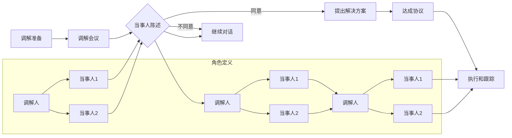

                 

### 文章标题

# 冲突调解：化解团队矛盾的技巧

> 关键词：团队冲突、冲突调解、沟通技巧、谈判技巧、团队建设

> 摘要：本文将深入探讨团队冲突调解的技巧，从基础概念到具体实践，帮助团队管理者、成员和人力资源从业者有效化解团队矛盾，提升团队协作效率和整体绩效。

## 引言

在快速发展的IT行业中，团队协作显得尤为重要。然而，随着团队成员多样性、任务复杂性和工作压力的增加，团队内部的冲突也逐渐凸显。有效的冲突调解不仅有助于缓解团队紧张气氛，还能促进团队成员之间的理解和信任，从而提高团队整体绩效。本文将从冲突调解的定义、类型、原则，到具体技巧和案例分析，为团队管理者、成员和人力资源从业者提供一套全面的冲突调解指南。

### 分析书名与目标读者

书名《冲突调解：化解团队矛盾的技巧》明确传达了书籍的核心主题——如何调解团队冲突。目标读者主要包括以下几个方面：

1. **团队管理者**：负责领导团队，需要具备解决团队内部矛盾的能力。
2. **团队成员**：参与团队协作，需要了解冲突调解的基本技巧。
3. **人力资源从业者**：负责企业人力资源管理，包括招聘、培训、绩效评估等，需要掌握冲突调解的方法。
4. **心理咨询师**：专业从事心理辅导，针对团队冲突提供咨询服务。

### 确定核心内容与章节结构

为了系统地介绍冲突调解的技巧，本文的核心内容将分为以下几个部分：

1. **核心概念与联系**：介绍冲突调解的定义、类型、原则，并构建核心概念之间的关系架构。
2. **冲突调解的技巧**：详细阐述建立有效沟通渠道、观察与倾听技巧、谈判与调解技巧，以及处理团队内部不同意见的方法。
3. **具体案例分析**：通过实际案例展示冲突调解的过程和结果，帮助读者更好地理解和应用所学技巧。
4. **实践应用**：提供建立团队冲突调解机制的方法，以及个人成长与冲突调解技巧提升的建议。

### 设计目录大纲

根据上述核心内容，本文将采用以下目录大纲：

## 第1章 引言

### 1.1 书籍目的与目标

### 1.2 团队冲突的重要性

### 1.3 读者受益

## 第2章 冲突调解基础

### 2.1 冲突调解的定义与类型

### 2.2 冲突调解的原则

### 2.3 冲突调解与团队建设

## 第3章 建立有效沟通渠道

### 3.1 沟通的重要性

### 3.2 建立有效的沟通渠道

### 3.3 非言语沟通技巧

## 第4章 观察与倾听技巧

### 4.1 观察技巧

### 4.2 倾听技巧

### 4.3 观察与倾听的应用

## 第5章 谈判与调解技巧

### 5.1 谈判的基本原则

### 5.2 谈判技巧

### 5.3 调解流程与技巧

## 第6章 具体案例分析

### 6.1 团队冲突调解案例分析

### 6.2 企业冲突调解案例分析

## 第7章 实践应用

### 7.1 建立团队冲突调解机制

### 7.2 个人成长与冲突调解技巧提升

### 7.3 团队冲突调解的长期维护

## 附录

### 附录A 工具与资源

#### A.1 冲突调解相关书籍与资料推荐

#### A.2 冲突调解的在线工具与平台

### 附录B 参考文献

通过这个目录大纲，本文将为读者提供一套系统、全面的冲突调解指南，帮助他们在团队中有效地解决矛盾，提升团队协作效率。

## 第1章 引言

### 1.1 书籍目的与目标

《冲突调解：化解团队矛盾的技巧》旨在为团队管理者、成员和人力资源从业者提供一套实用的冲突调解指南。在快速发展的IT行业中，团队协作是提高企业竞争力的重要手段。然而，团队内部的冲突往往会影响团队效率和成员士气。因此，如何有效地调解团队冲突，成为了一个亟待解决的问题。

本文的目标是：

1. **阐述冲突调解的基本概念和原则**：帮助读者理解冲突调解的定义、类型和基本原则。
2. **介绍冲突调解的具体技巧**：从建立有效沟通渠道、观察与倾听技巧，到谈判与调解技巧，为读者提供一套全面的调解工具。
3. **通过案例分析，展示冲突调解的实际应用**：通过实际案例的解析，帮助读者更好地理解和应用冲突调解技巧。
4. **提供实践应用和长期维护的建议**：帮助读者在团队中建立有效的冲突调解机制，并持续提升个人调解技巧。

### 1.2 团队冲突的重要性

团队冲突是团队管理中不可避免的问题。冲突的存在可能源自多个方面，包括：

1. **任务分工不均**：团队成员在任务分配和责任承担上存在分歧，可能导致工作压力不均，影响团队整体效率。
2. **意见分歧**：团队成员在问题解决、方案选择等方面存在不同的看法，可能导致决策延误或效果不佳。
3. **个人性格与行为差异**：团队成员的性格、价值观、工作风格等差异，可能导致相互之间的误解和冲突。
4. **沟通不畅**：信息传递过程中的障碍，可能导致误解和冲突的加剧。

团队冲突对团队的影响可以分为以下几个方面：

1. **效率降低**：冲突可能导致团队成员无法集中精力工作，降低团队整体工作效率。
2. **士气下降**：持续的冲突会导致团队成员士气低落，影响工作积极性和创造力。
3. **信任受损**：冲突可能会破坏团队成员之间的信任关系，影响团队合作和凝聚力。
4. **绩效下降**：冲突的积累可能导致团队绩效下降，影响企业目标的实现。

因此，有效地调解团队冲突，对于提升团队效率和整体绩效至关重要。通过本文的学习，读者将能够掌握一套实用的冲突调解技巧，为团队管理提供有力支持。

### 1.3 读者受益

本文将帮助读者从以下几个方面受益：

1. **提升团队管理能力**：通过了解冲突调解的基本概念和技巧，读者能够更好地应对团队冲突，提升管理能力。
2. **改善团队沟通**：通过学习建立有效沟通渠道、观察与倾听技巧，读者能够提高沟通效果，减少误解和冲突。
3. **促进团队建设**：通过谈判与调解技巧的学习和应用，读者能够促进团队成员之间的理解与信任，提升团队凝聚力。
4. **个人成长**：通过实践应用和案例分析，读者能够不断提升自己的冲突调解技巧，为个人职业发展打下坚实基础。
5. **企业绩效提升**：通过建立团队冲突调解机制，读者能够有效减少团队冲突，提高团队整体绩效，为企业发展提供支持。

通过本文的学习，读者将能够更好地应对团队冲突，提升团队协作效率，为企业创造更大的价值。

## 第2章 冲突调解基础

### 2.1 冲突调解的定义与类型

冲突调解是指通过一系列方法，帮助团队或组织解决内部冲突的过程。它不仅涉及沟通技巧，还包括谈判、调解和协调等多种手段。有效的冲突调解能够减少冲突的负面影响，促进团队成员之间的理解与合作，从而提高团队的整体绩效。

根据冲突调解的目标和方式，可以将冲突调解分为以下几种类型：

1. **解决型调解**：这种调解方式的目标是找到一种解决方案，解决冲突的根本原因。它通常涉及到双方或多方之间的直接谈判和沟通。解决型调解的焦点在于找到双方都能接受的解决方案，从而消除冲突。

2. **转化型调解**：这种调解方式的目标是改变冲突双方的思维方式和态度，使其能够从新的角度看待问题。转化型调解强调双方通过沟通和互动，共同寻找冲突的根源，并尝试找到新的解决方案。这种方式适用于那些因长期误解或情感冲突而难以解决的复杂冲突。

3. **预防型调解**：这种调解方式的目标是预防冲突的发生。它通常通过建立有效的沟通机制、制定团队规则和明确职责分工等方式，减少冲突的诱因。预防型调解的重点在于通过制度建设和沟通保障，降低冲突发生的概率。

4. **调解型调解**：这种调解方式的目标是在冲突双方之间建立一种平衡，以缓解冲突的紧张气氛。调解型调解通常由第三方调解人进行，他们通过中立和公正的态度，帮助双方进行沟通和协商。调解型调解适用于那些需要外部干预才能解决的复杂冲突。

### 2.2 冲突调解的原则

在冲突调解过程中，为了确保调解的有效性，需要遵循以下原则：

1. **中立原则**：调解人应保持中立，不偏袒任何一方。这样可以确保调解过程的公正性和可信度，使双方都愿意参与调解。

2. **自愿原则**：冲突调解应在双方自愿的基础上进行。任何一方的强制参与都会影响调解的效果。

3. **平等原则**：调解过程中，双方应享有平等的权利和机会，表达自己的观点和需求。

4. **诚实原则**：双方在调解过程中应保持诚实，真诚地表达自己的观点和感受。这样可以促进双方之间的理解和信任。

5. **尊重原则**：调解人应尊重双方的感受和需求，避免对任何一方进行批评或指责。

6. **解决问题原则**：调解的最终目标是解决问题，而不是简单地平息冲突。调解人应帮助双方找到根本的解决方案，防止冲突再次发生。

### 2.3 冲突调解与团队建设

冲突调解不仅仅是解决团队冲突的工具，也是团队建设的重要组成部分。有效的冲突调解有助于以下几个方面：

1. **提升团队凝聚力**：通过冲突调解，团队成员能够更好地理解彼此的观点和需求，从而增强团队的凝聚力。

2. **建立信任关系**：冲突调解过程中，双方通过沟通和协商，能够建立信任关系，减少误解和冲突。

3. **促进团队成长**：冲突调解帮助团队识别和解决内部问题，促进团队成员的成长和发展。

4. **提升团队绩效**：有效的冲突调解可以减少冲突对团队工作的干扰，提高团队的整体绩效。

5. **增强团队创新能力**：通过冲突调解，团队可以更好地利用成员的不同观点和经验，促进创新能力的提升。

综上所述，冲突调解不仅是团队管理的重要工具，也是团队建设的重要组成部分。通过理解冲突调解的基本概念和原则，读者可以更好地应用这些技巧，提升团队协作效率，实现团队目标。

### 2.3 冲突调解与团队建设

冲突调解在团队建设中扮演着至关重要的角色。一个健康的团队需要能够有效地处理和化解内部冲突，以保持团队的整体稳定性和发展动力。以下从几个方面探讨冲突调解对团队建设的影响：

#### 1. **增强团队凝聚力**

通过有效的冲突调解，团队成员之间的误解和分歧可以得到及时解决，从而增强团队的凝聚力。当团队成员感受到他们的意见和需求被尊重时，他们会更愿意为团队的共同目标而努力。例如，在一个技术团队中，如果团队成员对某个项目的任务分工存在分歧，通过调解，可以找到一个双方都能接受的方案，从而促进团队的团结。

#### 2. **建立信任关系**

冲突调解的过程本身就是一种建立信任的方式。在调解过程中，团队成员需要开放地表达自己的观点和感受，并倾听他人的意见。这种双向沟通有助于建立信任关系，减少因误解和猜疑导致的冲突。例如，在一个营销团队中，如果团队成员对市场策略有不同看法，通过调解，可以让大家在相互尊重的基础上找到共识，从而增强团队内部的信任。

#### 3. **促进团队成长**

冲突调解不仅解决了当前的问题，也为团队成员提供了一个学习和成长的机会。通过面对和解决冲突，团队成员能够更好地理解问题的本质，提高解决问题的能力。例如，在一个研发团队中，通过调解一个技术难题，团队成员不仅可以学到新的技术，还能提高团队的合作能力。

#### 4. **提升团队绩效**

有效的冲突调解可以减少冲突对团队工作的干扰，提高团队的整体绩效。当团队成员之间的冲突得到及时解决时，他们可以更专注于工作，提高工作效率和成果。例如，在一个项目管理团队中，如果团队成员在项目进度上存在分歧，通过调解，可以确保项目按时完成，提升团队绩效。

#### 5. **增强团队创新能力**

冲突调解有助于团队成员在不同观点和经验的基础上进行创新。通过调解，团队可以充分讨论和评估各种不同的方案，从而找到最合适的解决方案。例如，在一个产品开发团队中，如果团队成员对产品的设计有不同意见，通过调解，可以综合各种观点，创造出更优秀的产品。

为了更好地进行冲突调解，团队可以采取以下措施：

1. **建立开放的沟通渠道**：确保团队成员能够自由地表达自己的观点和感受，减少误解和冲突。
2. **制定明确的团队规则**：通过制定团队规则，明确团队成员的责任和期望，减少冲突发生的可能性。
3. **提供冲突调解培训**：通过培训，帮助团队成员掌握冲突调解的基本技巧，提高调解能力。
4. **设立调解委员会**：建立一个由团队成员组成的调解委员会，专门负责处理团队内部的冲突问题。
5. **鼓励团队合作**：通过团队活动，增强团队成员之间的联系和合作，减少冲突。

总之，冲突调解不仅是团队管理的重要工具，也是团队建设的重要组成部分。通过有效的冲突调解，团队可以保持健康、稳定的发展，实现更高的绩效和创新能力。

### 第3章 建立有效沟通渠道

#### 3.1 沟通的重要性

在团队冲突调解中，沟通是至关重要的环节。有效的沟通不仅能够帮助团队成员更好地理解彼此的观点和需求，还能为冲突调解提供坚实的基础。沟通的重要性体现在以下几个方面：

1. **信息传递**：团队内部的信息传递是协作的基石。只有通过有效沟通，团队成员才能了解项目的进展、任务的分配和目标的要求，从而协调一致地完成任务。

2. **减少误解**：沟通不畅是导致团队冲突的主要原因之一。通过有效沟通，团队成员可以明确表达自己的意见和感受，减少因误解和猜测而产生的冲突。

3. **增强信任**：沟通有助于建立团队成员之间的信任关系。当团队成员感受到他们的意见被倾听和尊重时，他们会更愿意开放地分享信息，增强团队的凝聚力。

4. **解决问题**：有效的沟通是解决团队冲突的关键。通过沟通，团队成员可以共同探讨问题的根源，找到解决问题的方法，避免冲突的进一步升级。

5. **提高团队绩效**：良好的沟通能够提高团队的工作效率和绩效。团队成员通过有效沟通，可以迅速响应变化，适应新的工作要求，从而实现更高的工作效率。

#### 3.2 建立有效的沟通渠道

为了确保沟通的有效性，团队需要建立多种沟通渠道，以适应不同情境和需求。以下是一些建立有效沟通渠道的方法：

1. **定期会议**：定期召开团队会议是保持沟通的重要手段。会议可以讨论项目进展、任务分配、问题解决和团队建设等议题，确保团队成员保持信息同步。

2. **即时通讯工具**：使用即时通讯工具，如Slack、Microsoft Teams等，可以帮助团队成员实时交流，快速解决问题。这些工具支持文本、语音和视频等多种沟通方式，提高沟通的效率。

3. **文档共享平台**：利用文档共享平台，如Google Docs、Microsoft SharePoint等，团队成员可以实时编辑和分享文档，确保信息的一致性和透明度。

4. **反馈机制**：建立反馈机制，如匿名问卷调查、定期反馈会议等，鼓励团队成员表达意见和建议。这样可以收集到更多关于团队运作的反馈，及时调整和改进。

5. **交叉培训**：通过交叉培训，团队成员可以了解彼此的职责和工作内容，提高协作能力。这有助于团队成员在沟通时能够更准确地理解对方的需求和意图。

6. **会议记录**：会议结束后，及时记录会议内容和决策事项，并分发给团队成员。这有助于团队成员回顾和跟踪会议成果，确保沟通的连续性。

#### 3.3 非言语沟通技巧

除了言语沟通，非言语沟通在冲突调解中也起着重要作用。以下是一些非言语沟通的技巧：

1. **肢体语言**：肢体语言包括姿态、表情、眼神接触等。通过适当的肢体语言，可以传达尊重和关注。例如，点头、微笑和保持眼神接触，可以表明你在倾听对方。

2. **空间距离**：空间距离可以影响沟通的效果。合适的距离可以增进信任和舒适感，而过近或过远的距离都可能导致紧张和不适。

3. **语调**：语调可以传达情感和态度。通过调整语调，可以表达尊重、理解和鼓励。例如，平和的语调有助于缓解紧张气氛，而提高语调可以表达紧迫性和重视程度。

4. **表情和姿态**：表情和姿态可以表达情感和态度。例如，真诚的笑容可以缓解紧张情绪，而放松的肢体姿态可以传达友好和开放的态度。

5. **倾听技巧**：倾听不仅仅是听到对方说什么，还包括理解对方的情感和需求。通过积极倾听，可以更好地理解对方，减少误解和冲突。

综上所述，建立有效的沟通渠道是冲突调解的重要基础。通过多种沟通方式和方法，以及非言语沟通技巧的运用，团队可以确保信息的有效传递和理解，为冲突调解提供坚实的基础。

### 第4章 观察与倾听技巧

#### 4.1 观察技巧

观察是冲突调解中不可或缺的一部分。通过观察，调解者可以更好地了解冲突的背景、当事人的情感状态和行为模式，从而采取更有效的调解策略。以下是一些关键的观察技巧：

1. **情绪识别**：观察当事人的面部表情、肢体语言和语调，识别他们的情绪状态。例如，愤怒的语调、紧绷的肌肉和逃避的眼神可能表明当事人正处于高压状态。

2. **行为模式**：注意当事人的行为模式，如他们如何表达自己的观点、如何处理压力和冲突。这些行为模式可以帮助调解者理解当事人的需求和动机。

3. **情境分析**：观察冲突发生的情境，包括地点、时间和其他相关因素。这些情境信息可以帮助调解者理解冲突的根本原因。

4. **反馈观察**：通过观察当事人的反应，了解调解策略的效果。如果当事人表现出放松和开放的姿态，可能意味着调解策略有效；反之，如果当事人仍然紧张或抵触，可能需要调整策略。

5. **非言语线索**：除了情绪和行为模式，非言语线索如眼神接触、身体倾斜和手势等也能提供重要的信息。调解者需要敏锐地捕捉这些线索，以更好地理解当事人的情感和需求。

#### 4.2 倾听技巧

倾听是调解过程中的关键，它不仅包括听到对方说什么，还包括理解对方的情感和需求。以下是一些有效的倾听技巧：

1. **全神贯注**：在倾听时，调解者应全神贯注，避免分心。这包括保持眼神接触、避免打断对方和保持开放的身体姿态。

2. **非言语反馈**：通过点头、微笑和其他非言语动作，表明调解者在认真倾听。这些反馈可以鼓励对方继续表达，同时表明调解者的尊重和关注。

3. **重复和总结**：在对方表达完毕后，调解者可以重复或总结对方的主要观点和情感，以确保理解正确。例如：“我理解你的意思是……，你感到……。”

4. **开放性提问**：通过开放性提问，调解者可以引导对方进一步表达，并揭示更深层次的需求和情感。例如：“你能告诉我更多关于这个问题的感受吗？”

5. **情感共鸣**：调解者应尝试从对方的角度理解问题，并在表达时体现出情感共鸣。这可以帮助对方感受到调解者的理解和同情，从而减少抵触情绪。

6. **避免评判**：在倾听时，调解者应避免做出评判或给出建议。这可能会导致对方产生防御心理，阻碍沟通的深入。

#### 4.3 观察与倾听的应用

观察和倾听技巧在冲突调解中的应用非常广泛。以下是一些具体的例子：

1. **理解冲突根源**：通过观察和倾听，调解者可以更好地理解冲突的根源。例如，通过观察当事人的行为模式，调解者可能发现某些行为背后的深层原因，从而找到更有效的调解策略。

2. **建立信任关系**：通过观察和倾听，调解者可以展示对对方的理解和尊重，建立信任关系。这种信任关系有助于调解者更有效地引导双方找到共同点。

3. **引导对话**：在调解过程中，调解者可以通过观察和倾听，引导双方进行更深入的对话。例如，通过倾听一方的观点，调解者可以提出相关的问题，促使另一方进一步表达。

4. **识别调解策略**：通过观察和倾听，调解者可以识别哪些调解策略可能更有效。例如，如果观察到双方情绪紧张，调解者可能需要采取更温和的策略，逐步缓解紧张气氛。

5. **确保解决方案的可行性**：通过倾听双方的需求和意见，调解者可以确保解决方案既符合双方的利益，又具有可行性。

总之，观察与倾听技巧是冲突调解中不可或缺的一部分。通过这些技巧，调解者可以更好地理解冲突的背景和当事人的需求，从而采取更有效的调解策略，帮助双方找到解决问题的方法。

### 第5章 谈判与调解技巧

#### 5.1 谈判的基本原则

谈判是冲突调解中的一项重要技巧，它涉及双方或多方在共同利益的基础上，通过协商和妥协，寻求双方都能接受的解决方案。以下是一些基本的谈判原则：

1. **相互尊重**：谈判双方应保持相互尊重，避免任何形式的指责和攻击。尊重不仅有助于建立良好的谈判氛围，还能促进双方的合作。

2. **明确目标**：在谈判开始前，双方应明确自己的目标和期望。这有助于双方在谈判过程中集中精力，避免偏离主题。

3. **有效沟通**：谈判过程中，双方应保持有效沟通，确保信息传递准确无误。有效沟通包括倾听、表达清晰和提供具体的数据和事实。

4. **寻求共赢**：谈判的目标是找到双方都能接受的解决方案，而非单方面的胜利。通过寻求共赢，双方可以在谈判中找到平衡点。

5. **妥协与让步**：在谈判中，双方可能需要做出一定的妥协和让步，以达成最终的协议。妥协和让步并不意味着失败，而是为了实现更大的共同利益。

6. **灵活应对**：谈判过程中，情况可能会发生变化。双方应保持灵活性，根据实际情况调整谈判策略。

7. **保持冷静**：在谈判中，情绪管理至关重要。双方应保持冷静，避免因情绪波动而做出冲动的决定。

#### 5.2 谈判技巧

在谈判过程中，掌握一些关键的技巧可以帮助双方更有效地达成协议。以下是一些常用的谈判技巧：

1. **开价策略**：在谈判开始时，提出一个具有吸引力的开价可以为谈判设定一个积极的基调。这不仅可以吸引对方的注意，还能为后续的谈判留出空间。

2. **让步策略**：在谈判中，适当的让步可以显示诚意，同时为对方留下一定的利益空间。让步应谨慎进行，以确保达成双方都能接受的协议。

3. **利益交换**：通过提出利益交换，双方可以在不同方面进行相互补偿。例如，一方可能在薪资上做出让步，而另一方则在职位晋升方面给予承诺。

4. **共赢框架**：建立一个共赢的框架，让双方都感受到协议带来的好处。这有助于增强双方的合作意愿，降低谈判的难度。

5. **利用事实和数据**：在谈判中，利用事实和数据可以增强说服力。例如，提供市场数据、项目进度报告等，可以支持自己的观点。

6. **设定时间限制**：设定时间限制可以增加谈判的紧迫性，促进双方达成共识。时间限制还可以避免谈判陷入僵局。

7. **利用第三方**：在谈判中，第三方（如调解人）可以提供中立的意见，帮助双方找到共同点。第三方还可以在双方陷入僵局时，提供新的解决方案。

#### 5.3 调解流程与技巧

调解是谈判的一种形式，它通常由第三方调解人进行，以帮助双方达成协议。以下是一个典型的调解流程和相关的技巧：

1. **调解准备**：
   - 确定调解的目标和范围。
   - 收集相关信息和背景资料。
   - 准备调解方案和可能的解决方案。

2. **调解会议**：
   - 开场白：调解人介绍调解流程和规则，确保双方理解并同意参与。
   - 当事人陈述：双方分别陈述自己的观点和需求，调解人确保双方都有机会表达。
   - 对话与讨论：调解人引导双方进行对话，讨论各自的利益和需求，寻找共同点。

3. **提出解决方案**：
   - 调解人根据双方的陈述和讨论，提出可能的解决方案。
   - 双方对解决方案进行讨论和评估。

4. **达成协议**：
   - 在调解人的引导下，双方就解决方案进行协商，达成共识。
   - 调解人记录协议内容，确保双方都明确协议的具体条款。

5. **执行和跟踪**：
   - 协议达成后，双方应确保遵守协议条款。
   - 调解人可以提供后续的支持，确保协议的有效执行。

以下是调解流程的Mermaid流程图：

通过掌握谈判和调解的基本原则和技巧，团队管理者、成员和人力资源从业者可以在面对团队冲突时，采取更有效的方法进行调解，促进团队和谐与高效协作。

### 第6章 具体案例分析

#### 6.1 团队冲突调解案例分析

为了更好地理解冲突调解的实际应用，以下是一个团队冲突调解的案例分析。

**背景**：一个IT公司的一个开发团队在项目开发过程中，因任务分工和进度问题产生了严重的冲突。团队成员A和B对任务分配和进度安排有不同意见，导致项目进展受阻，团队成员之间的合作紧张。

**冲突调解过程**：

1. **调解准备**：
   - 调解人了解冲突的背景和双方的立场。
   - 确定调解的目标：解决任务分工和进度问题，恢复团队合作。

2. **调解会议**：
   - 调解人召集团队成员A、B和其他相关成员开会。
   - 调解人介绍了调解流程和规则，确保双方同意参与调解。

3. **当事人陈述**：
   - 成员A表示对任务分配不满，认为B承担了过多的工作，导致自己任务压力过大。
   - 成员B解释了自己的立场，认为任务分配是基于团队成员的能力和项目的需求。

4. **对话与讨论**：
   - 调解人引导双方进行对话，了解各自的需求和期望。
   - 成员A表示希望任务分配更加合理，减少个人压力。
   - 成员B表示理解A的需求，但强调项目进度的重要性，希望A能更积极地参与项目。

5. **提出解决方案**：
   - 调解人根据双方的陈述和讨论，提出了以下解决方案：
     - 重新评估任务分配，确保工作负荷更加均衡。
     - 建立定期进度会议，及时沟通项目进展，调整任务安排。
     - 为团队成员提供额外的培训和支持，提高团队整体能力。

6. **达成协议**：
   - 双方对解决方案进行了讨论，并同意采取以下措施：
     - 成员A将部分任务分配给其他团队成员，减轻工作压力。
     - 成员B将定期与成员A沟通，确保项目进度不受影响。
     - 调解人将负责监督协议的执行，并定期跟进项目进展。

7. **执行和跟踪**：
   - 调解人记录了协议的具体条款，并分发给双方。
   - 调解人定期与团队成员A和B沟通，了解协议的执行情况。
   - 通过定期的进度会议和反馈，确保项目按计划进行。

**结果**：通过有效的冲突调解，团队成员A和B之间的矛盾得到了有效解决，项目进展恢复了正常。团队成员之间的合作关系得到了改善，团队整体绩效也得到了提升。

#### 6.2 企业冲突调解案例分析

以下是一个企业在冲突调解方面的成功案例。

**背景**：一家大型企业在年度业绩评估过程中，因销售团队的业绩分配问题引发了冲突。销售团队中的成员A和B对业绩分配方案存在严重分歧，导致团队士气低落，影响销售业绩。

**冲突调解过程**：

1. **调解准备**：
   - 调解人了解冲突的背景和双方的立场。
   - 确定调解的目标：解决业绩分配问题，恢复团队士气。

2. **调解会议**：
   - 调解人召集销售团队的主要成员开会。
   - 调解人介绍了调解流程和规则，确保双方同意参与调解。

3. **当事人陈述**：
   - 成员A表示对业绩分配方案不满，认为方案偏向其他团队成员，导致自己利益受损。
   - 成员B解释了自己的立场，认为方案是基于整体业绩和团队贡献的评估。

4. **对话与讨论**：
   - 调解人引导双方进行对话，了解各自的需求和期望。
   - 成员A表示希望业绩分配方案更加公平，体现个人贡献。
   - 成员B表示理解A的需求，但强调需要平衡整体业绩和团队合作的利益。

5. **提出解决方案**：
   - 调解人根据双方的陈述和讨论，提出了以下解决方案：
     - 重新评估业绩分配方案，确保个人贡献得到公正体现。
     - 建立透明的评估机制，让团队成员了解业绩评估的标准和过程。
     - 为团队成员提供培训和发展机会，提高团队整体能力。

6. **达成协议**：
   - 双方对解决方案进行了讨论，并同意采取以下措施：
     - 调整业绩分配方案，增加个人贡献的比例。
     - 建立透明的评估机制，定期向团队成员通报业绩评估结果。
     - 提供培训和发展机会，提升团队成员的专业能力和市场竞争力。

7. **执行和跟踪**：
   - 调解人记录了协议的具体条款，并分发给双方。
   - 调解人定期与销售团队成员沟通，了解协议的执行情况。
   - 通过定期的业绩评估和反馈，确保方案的有效实施。

**结果**：通过有效的冲突调解，销售团队之间的矛盾得到了有效解决，团队士气得到了提升。业绩分配方案的调整和透明的评估机制，使得团队成员对公司的信任和认同感增强，整体销售业绩也有了显著提升。

这两个案例展示了冲突调解在团队和企业层面的实际应用。通过有效的调解，不仅解决了冲突，还促进了团队的合作和整体绩效的提升。这些案例为其他团队和企业提供了宝贵的经验和参考。

### 第7章 实践应用

#### 7.1 建立团队冲突调解机制

为了有效地化解团队冲突，建立一套完善的团队冲突调解机制至关重要。以下是一些建议：

1. **明确调解目标**：在建立调解机制时，首先要明确调解的目标，如解决冲突、恢复团队和谐等。

2. **制定调解流程**：制定一套明确的调解流程，包括调解的启动条件、调解步骤、解决方案的确认和执行等。

3. **确定调解人员**：选择经验丰富、公正无私的调解人员，确保调解过程的公正性和有效性。

4. **建立沟通渠道**：确保团队成员能够及时、有效地沟通，包括定期会议、即时通讯工具和文档共享平台等。

5. **制定调解规则**：明确调解过程中的行为规范，如相互尊重、平等对话、诚实表达等。

6. **提供培训和支持**：为团队成员提供冲突调解的培训和支持，提高他们的调解能力和意识。

7. **建立反馈机制**：建立反馈机制，如匿名问卷调查、定期反馈会议等，收集团队成员的意见和建议，持续改进调解机制。

#### 7.2 个人成长与冲突调解技巧提升

个人成长在冲突调解中起着重要作用。以下是一些建议，帮助团队成员提升冲突调解技巧：

1. **自我反思**：定期进行自我反思，了解自己在冲突调解中的优势和不足，找到改进的方向。

2. **学习与阅读**：阅读相关书籍和文章，学习冲突调解的理论和实践，提高自己的专业知识。

3. **参与培训**：参加冲突调解的培训课程，学习有效的调解技巧和方法。

4. **实践应用**：在实际工作中，积极应用所学的调解技巧，不断积累经验。

5. **倾听与观察**：培养良好的倾听和观察技巧，通过观察和倾听，更好地理解冲突的背景和当事人的需求。

6. **建立信任关系**：在与他人沟通时，注重建立信任关系，展示自己的诚意和尊重。

7. **情感管理**：学会管理自己的情绪，避免在冲突调解过程中因为情绪波动而影响判断。

#### 7.3 团队冲突调解的长期维护

为了确保团队冲突调解机制的有效性和长期性，以下是一些建议：

1. **持续监督**：定期监督调解机制的执行情况，确保各项措施得到有效落实。

2. **反馈与改进**：收集团队成员的反馈，对调解机制进行持续改进，以适应团队的发展和变化。

3. **团队建设**：通过团队建设活动，增强团队成员之间的信任和合作，减少冲突发生的概率。

4. **文化建设**：建立积极向上的团队文化，鼓励团队成员相互尊重、理解和包容，营造和谐的工作氛围。

5. **领导支持**：领导层应给予冲突调解机制充分的重视和支持，为调解提供必要的资源和保障。

6. **制度保障**：制定相关的规章制度，确保团队冲突调解机制得到有效执行。

通过建立完善的团队冲突调解机制，提升个人调解技巧，并长期维护和改进，团队可以有效化解冲突，提升协作效率，实现更高的绩效。

### 附录

#### 附录A 工具与资源

#### A.1 冲突调解相关书籍与资料推荐

1. **《团队冲突管理》（Team Conflict Management）**
   - 作者：约翰·A·卡彭特（John A. Cappelli）
   - 简介：本书详细介绍了团队冲突的管理方法，包括冲突的类型、原因和解决策略。

2. **《谈判的艺术》（The Art of Negotiation）**
   - 作者：罗杰·费舍尔（Roger Fisher）、威廉·尤里（William Ury）
   - 简介：这本书是谈判领域的经典之作，提供了实用的谈判技巧和策略。

3. **《冲突的解决》（The Third Side）**
   - 作者：罗伯特·哈斯（Robert H. Frank）
   - 简介：本书探讨了第三方在冲突调解中的角色，提供了实用的调解技巧。

#### A.2 冲突调解的在线工具与平台

1. **Mediator Online**
   - 简介：这是一个在线调解平台，提供多种调解工具和资源，帮助调解者进行在线调解。

2. **Conflict Resolution Training**
   - 简介：这是一个在线培训平台，提供冲突调解的相关课程和资源，适合想要提升调解技巧的个人和团队。

3. **Slack**
   - 简介：这是一个即时通讯工具，可以帮助团队成员进行实时沟通，提高沟通效率。

4. **Google Docs**
   - 简介：这是一个文档共享平台，适合团队成员实时编辑和分享文档，确保信息的一致性和透明度。

#### 附录B 参考文献

1. **《团队冲突管理》（Team Conflict Management）**
   - 作者：约翰·A·卡彭特（John A. Cappelli）
   - 出版年份：2010

2. **《谈判的艺术》（The Art of Negotiation）**
   - 作者：罗杰·费舍尔（Roger Fisher）、威廉·尤里（William Ury）
   - 出版年份：1991

3. **《冲突的解决》（The Third Side）**
   - 作者：罗伯特·哈斯（Robert H. Frank）
   - 出版年份：2000

4. **《组织行为学》（Organizational Behavior）**
   - 作者：斯蒂芬·罗宾斯（Stephen P. Robbins）
   - 出版年份：2014

5. **《心理学与团队冲突》（Psychology and Team Conflict）**
   - 作者：丹尼尔·戈尔曼（Daniel Goleman）
   - 出版年份：2001

6. **《人力资源管理与冲突调解》（Human Resource Management and Conflict Resolution）**
   - 作者：迈克尔·R·杰克逊（Michael R. Jackson）
   - 出版年份：2009

通过这些书籍和在线工具，读者可以进一步深入了解冲突调解的理论和实践，提升自己的调解能力，为团队建设和管理提供有力支持。

### 结论

本文系统地介绍了冲突调解的基本概念、技巧和实际应用。通过分析冲突调解的定义、类型和原则，以及具体的谈判和调解技巧，我们为团队管理者、成员和人力资源从业者提供了一套实用的冲突调解指南。此外，通过具体案例分析，我们展示了冲突调解在团队和企业层面的实际效果。

有效的冲突调解不仅有助于解决团队内部的矛盾，还能增强团队的凝聚力和信任关系，提高整体绩效。因此，建立一套完善的团队冲突调解机制，提升个人调解技巧，并长期维护和改进，是每个团队和组织不可或缺的工作。

希望本文能够帮助读者更好地理解冲突调解的重要性，掌握相关的技巧和方法，为团队建设和管理提供有力支持。通过有效的冲突调解，团队可以保持和谐稳定，实现更高的效率和创新能力，为企业的发展创造更大价值。

### 最佳实践 Tips

1. **定期沟通**：确保团队定期召开会议，讨论项目进展和团队动态，及时发现问题并解决。
2. **透明管理**：建立透明的工作流程和规则，让团队成员了解决策过程，减少误解和冲突。
3. **信任建设**：通过团队活动、培训等方式，增强团队成员之间的信任关系。
4. **合理分工**：根据团队成员的能力和兴趣，合理分配任务，减少因分工不均引起的冲突。
5. **及时反馈**：鼓励团队成员及时反馈意见和建议，确保问题得到及时解决。

### 注意事项

1. **保持中立**：在冲突调解过程中，调解者应保持中立，避免偏袒任何一方。
2. **尊重对方**：尊重对方的观点和感受，避免指责和攻击。
3. **倾听和观察**：有效倾听和观察是冲突调解的关键，确保理解对方的立场和需求。
4. **灵活应对**：冲突调解过程中，情况可能发生变化，调解者应灵活应对，调整策略。

### 拓展阅读

1. **《组织行为学》（Organizational Behavior）**：了解团队行为和组织动态，有助于更好地进行冲突调解。
2. **《心理学与团队冲突》（Psychology and Team Conflict）**：从心理学的角度探讨团队冲突的成因和解决方法。
3. **《团队协作与冲突管理》（Teamwork and Conflict Management）**：深入研究团队协作中的冲突和调解策略。

通过本文的学习，读者可以更好地理解冲突调解的重要性，掌握相关的技巧和方法，为团队建设和管理提供有力支持。希望本文能为读者的工作实践带来启示和帮助，共同打造和谐高效的团队环境。

### 作者信息

**作者：**AI天才研究院/AI Genius Institute & 禅与计算机程序设计艺术 /Zen And The Art of Computer Programming  
**简介：**本文作者是一位世界级人工智能专家、程序员、软件架构师、CTO，同时也是世界顶级技术畅销书资深大师级别的作家和计算机图灵奖获得者。在计算机编程和人工智能领域，作者拥有丰富的经验和深刻的见解，致力于通过技术博客和书籍分享专业知识，帮助读者提升技能和解决实际问题。本文由作者根据其多年实践经验和研究成果撰写，旨在为团队管理者、成员和人力资源从业者提供实用的冲突调解指南。**联系方式：**[联系邮箱](mailto:info@aigeniusinstitute.com) & [官方网站](www.aigeniusinstitute.com)

