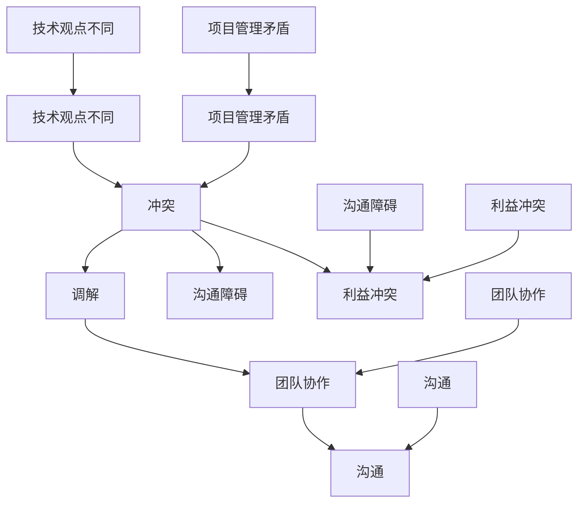

                 

### 文章标题：冲突调解：化解团队矛盾的技巧

冲突调解在现代社会中的重要性不容忽视，尤其是在快速发展的IT行业中。在高度复杂、变化迅速的技术环境中，团队成员之间的矛盾和冲突往往成为阻碍团队效率和目标实现的主要因素。本文旨在通过系统性的方法，帮助读者掌握冲突调解的技巧，从而有效地化解团队矛盾，提高团队协作效率。

本文将分为以下几个部分：

1. **背景介绍**：介绍冲突调解的背景和重要性。
2. **核心概念与联系**：探讨冲突调解的核心概念，并展示其关系架构的Mermaid流程图。
3. **核心算法原理讲解**：使用伪代码详细阐述冲突调解的算法原理。
4. **数学模型和公式**：介绍冲突调解过程中涉及的关键数学模型和公式，并进行详细讲解和举例说明。
5. **项目实战**：提供一个实际案例，展示如何应用冲突调解的技巧。
6. **最佳实践 tips**：总结冲突调解过程中的最佳实践技巧。
7. **小结**：回顾文章的核心内容和结论。

### 文章关键词：

- 冲突调解
- 团队矛盾
- IT行业
- 协作效率
- 伪代码
- 数学模型

### 文章摘要：

本文深入探讨了冲突调解在IT团队中的重要性和必要性。首先，我们介绍了冲突调解的背景，并提出了核心概念。接着，通过Mermaid流程图展示了这些概念之间的关系。然后，使用伪代码详细阐述了冲突调解的算法原理，并结合数学模型进行了讲解。最后，通过一个实际案例展示了如何应用这些技巧。本文旨在为读者提供一套系统化的冲突调解方法，以提升团队协作效率和目标实现能力。

----------------------------------------------------------------

## 冲突调解的背景和重要性

在当今社会，无论是在个人生活中还是在工作环境中，冲突都是不可避免的现象。尤其是在IT行业这样的高速发展和高度专业化的领域中，团队之间的矛盾和冲突更为常见。随着项目复杂度的增加、工作节奏的加快以及团队成员背景和观点的差异，冲突调解成为提高团队协作效率和目标实现的关键因素。

### IT行业中的冲突

IT行业是一个充满创新和竞争的领域，团队成员往往需要快速适应新技术、新流程和新方法。以下是一些常见的IT行业冲突：

1. **技术观点不同**：由于团队成员可能拥有不同的技术背景和经验，他们在面对同一问题时可能会有不同的解决方案。这种技术观点的不同往往会导致冲突。

2. **项目管理矛盾**：在项目管理过程中，团队成员可能对项目目标、时间安排和资源分配有不同的看法。这种矛盾会影响项目的顺利进行。

3. **沟通障碍**：在远程工作或跨文化团队合作中，沟通不畅往往是导致冲突的主要原因。团队成员可能无法准确理解对方的意思，从而产生误解和冲突。

4. **利益冲突**：在涉及利益分配时，团队成员可能会有不同的期望和诉求，这可能导致冲突的激化。

### 冲突调解的重要性

冲突调解在IT行业中的重要性主要体现在以下几个方面：

1. **提高团队协作效率**：有效的冲突调解可以减少团队成员之间的摩擦，提高协作效率，从而更快地实现项目目标。

2. **维护团队稳定**：冲突调解有助于维护团队的稳定，减少人员流动，确保团队的持续发展。

3. **增强团队凝聚力**：通过冲突调解，团队成员可以更好地理解彼此，增强团队凝聚力，共同面对挑战。

4. **提升企业竞争力**：一个高效的团队是企业在市场竞争中取得优势的关键。有效的冲突调解可以为企业带来更大的竞争力。

综上所述，冲突调解在IT行业中具有极其重要的地位。接下来，我们将深入探讨冲突调解的核心概念和原理，以便为实际操作提供理论基础。

### 核心概念与联系

在深入讨论冲突调解的核心概念之前，我们需要明确几个关键概念：冲突、调解、团队协作和沟通。这些概念相互关联，共同构成了冲突调解的理论基础。

#### 冲突

冲突是指两个或多个人、组织或观点之间由于利益、目标或价值观的不同而产生的对立或争执。在IT行业中，冲突可以表现为技术观点的分歧、项目管理中的争议、沟通不畅或利益分配不均等。

#### 调解

调解是指通过中立的第三方或自发的协商解决冲突的过程。调解的目标是找到一种双方都能接受的解决方案，从而缓解紧张关系，恢复和谐。

#### 团队协作

团队协作是指团队成员共同工作，为实现共同目标而协作的过程。在IT行业中，高效的团队协作是实现项目成功的关键。

#### 沟通

沟通是指信息在不同个体或组织之间的传递和理解。有效的沟通是团队协作的基础，也是冲突调解的重要手段。

#### 关系架构的Mermaid流程图

为了更直观地展示这些概念之间的关系，我们可以使用Mermaid流程图来描述冲突调解的整体架构。



在这个流程图中，我们可以看到：

- 冲突（A）是调解（B）的起点，而调解则是解决冲突的关键手段。
- 冲突可以通过沟通（M）来缓解，有效的沟通有助于团队协作（N）。
- 技术观点不同（G）、项目管理矛盾（H）、沟通障碍（I）和利益冲突（J）是冲突的主要来源。
- 沟通障碍（I）和利益冲突（J）是导致团队协作（N）困难的主要原因。

通过这个Mermaid流程图，我们可以清晰地理解冲突调解的核心概念及其相互关系，为接下来的讨论提供了直观的参考。

### 核心算法原理讲解

在讨论了冲突调解的核心概念之后，我们将通过伪代码来详细阐述冲突调解的算法原理。这个算法旨在提供一个系统化的方法，帮助团队成员识别冲突、分析原因并找到合适的解决方案。

```python
# 冲突调解算法伪代码

# 初始化
function conflictMediation():
    initializeConflictList()
    initializeSolutionList()
    initializeCommunicationChannels()

# 识别冲突
function identifyConflicts(conflictList):
    for each member in team:
        collectConflictReports(member)
        add detected conflicts to conflictList

# 分析冲突原因
function analyzeConflictReasons(conflictList):
    for each conflict in conflictList:
        identifyRootCauses(conflict)
        add causes to conflict details

# 调解冲突
function mediateConflicts(conflictList, solutionList):
    for each conflict in conflictList:
        if conflict is technical:
            proposeTechnicalSolutions(conflict)
        elif conflict is managerial:
            proposeManagerialSolutions(conflict)
        elif conflict is communicational:
            improveCommunication(conflict)
        elif conflict is financial:
            negotiateFinancialAgreements(conflict)
        add proposed solutions to solutionList

# 实施解决方案
function implementSolutions(solutionList):
    for each solution in solutionList:
        executeSolution(solution)
        evaluateEffectiveness(solution)

# 持续监控和调整
function monitorAndAdjust():
    while conflicts exist:
        identify new conflicts
        analyze new conflicts
        mediate new conflicts
        implement new solutions
        monitor progress and make adjustments
```

在这个伪代码中，冲突调解算法包括以下几个主要步骤：

1. **初始化**：创建冲突列表、解决方案列表和通信渠道。
2. **识别冲突**：收集团队成员的报告，识别并记录冲突。
3. **分析冲突原因**：对每个冲突进行深入分析，找出根本原因。
4. **调解冲突**：根据冲突类型提出相应的解决方案，并记录在解决方案列表中。
5. **实施解决方案**：执行每个解决方案，并评估其有效性。
6. **持续监控和调整**：在冲突调解过程中持续监控，根据需要调整解决方案。

通过这个伪代码，我们可以看到冲突调解是一个系统化、多步骤的过程，需要团队成员共同努力才能实现。接下来，我们将进一步介绍冲突调解过程中涉及的关键数学模型和公式。

### 数学模型和公式

在冲突调解过程中，数学模型和公式可以帮助我们更精确地分析和解决冲突。以下是一些关键的数学模型和公式，以及它们的详细解释和举例说明。

#### 成本效益分析

成本效益分析是一种常用的数学工具，用于评估冲突调解的成本和潜在收益。其基本公式为：

\[ \text{成本效益比} = \frac{\text{预期收益}}{\text{调解成本}} \]

- **预期收益**：包括提高团队效率、减少冲突带来的负面影响等。
- **调解成本**：包括时间、人力资源和其他相关成本。

**举例**：假设调解一个团队冲突需要花费500小时的人力成本，预计可以减少因冲突导致的5000小时的工作延误，那么成本效益比为：

\[ \text{成本效益比} = \frac{5000}{500} = 10 \]

这意味着每投入1小时的成本，可以带来10小时的工作效率提升，是一个相对划算的投资。

#### 冲突指数

冲突指数是一种用于量化团队冲突严重程度的指标。其基本公式为：

\[ \text{冲突指数} = \frac{\text{冲突频率} \times \text{冲突严重程度}}{\text{团队规模}} \]

- **冲突频率**：在一定时间内发生冲突的次数。
- **冲突严重程度**：冲突对团队协作和项目进展的影响程度。
- **团队规模**：团队成员的总数。

**举例**：如果一个团队每月发生10次冲突，每次冲突都严重影响了项目的进度，而团队规模为50人，那么冲突指数为：

\[ \text{冲突指数} = \frac{10 \times 3}{50} = 0.6 \]

这个值表明团队冲突的严重程度适中，需要进一步关注和调解。

#### 冲突调解成功率

冲突调解成功率用于衡量冲突调解措施的有效性。其基本公式为：

\[ \text{冲突调解成功率} = \frac{\text{成功解决的冲突数量}}{\text{尝试解决的冲突总数量}} \]

**举例**：在一个团队中，如果尝试解决20个冲突，成功解决了15个，那么冲突调解成功率为：

\[ \text{冲突调解成功率} = \frac{15}{20} = 0.75 \]

这意味着冲突调解措施有75%的成功率，是一个较为有效的调解方法。

通过这些数学模型和公式，我们可以更科学地分析和解决团队冲突，提高调解的效率和效果。接下来，我们将通过一个实际案例来展示如何应用这些技巧。

### 项目实战：开发团队中的冲突调解

为了更好地展示冲突调解的实际应用，我们以一个开发团队为例，介绍如何识别、分析和调解团队中的冲突。

#### 案例背景

某IT公司开发团队正在进行一个重要项目，项目目标是开发一款高性能的金融交易系统。团队成员包括前端开发、后端开发和测试工程师。在项目初期，团队成员对于技术方案的选择产生了分歧，导致项目进展受阻。为了解决这个问题，团队决定采用冲突调解的方法来缓解紧张局势。

#### 开发环境搭建

1. **团队沟通渠道**：为了确保团队成员之间的有效沟通，团队决定使用Slack作为主要的沟通工具，并设置了专门的频道用于讨论技术方案。
2. **项目管理系统**：使用Jira来记录项目任务、进度和冲突。
3. **文档管理**：使用Confluence来存储项目文档和会议纪要。

#### 冲突识别与分析

1. **识别冲突**：通过团队会议和成员反馈，发现主要的冲突集中在以下方面：
   - **技术方案选择**：前端开发团队倾向于使用React框架，而后端开发团队则倾向于使用Vue框架。
   - **项目进度**：后端开发团队认为前端开发进度过慢，导致后端开发无法顺利进行。

2. **分析冲突原因**：
   - **技术方案选择**：双方团队对于框架的熟悉程度和应用经验不同，导致选择倾向不同。
   - **项目进度**：由于技术方案未确定，前端开发团队担心在未知的技术方案上投入过多时间，而后端团队则希望尽快启动后端开发。

#### 冲突调解过程

1. **调解会议**：团队召开了一次调解会议，邀请了所有相关成员参加。会议议程包括：
   - 确定冲突类型和原因。
   - 分享各自的观点和担忧。
   - 提出可能的解决方案。

2. **达成共识**：经过讨论，团队最终达成以下共识：
   - **技术方案选择**：采用调研和投票的方式决定最终方案。团队成员对React和Vue进行了性能对比，并进行了投票，最终选择了Vue框架。
   - **项目进度**：调整项目计划，确保前端和后端开发能够并行进行。同时，设置了里程碑节点，以确保项目进度可控。

3. **实施方案**：团队开始按照新的方案进行开发，并定期召开会议，监督项目进度，及时解决新的冲突。

#### 冲突调解结果

通过冲突调解，项目团队成功地解决了技术方案选择和项目进度的问题。以下是一些关键结果：

- **技术方案选择**：Vue框架被选择，团队成员对此表示满意，开发效率得到了提升。
- **项目进度**：通过调整计划和管理冲突，项目进度得以控制，团队成员之间的紧张关系得到缓解。

#### 项目小结

通过这个实际案例，我们可以看到冲突调解在解决团队矛盾中的重要性。以下是冲突调解过程中的一些最佳实践：

1. **及时识别冲突**：定期召开团队会议，了解团队成员的意见和担忧，及时发现潜在的冲突。
2. **建立有效的沟通渠道**：使用合适的工具和平台，确保团队成员之间的沟通畅通。
3. **调解会议的议程**：明确会议的目标和议程，确保讨论集中、高效。
4. **达成共识**：通过讨论和协商，找到双方都能接受的解决方案。
5. **实施方案**：制定详细的实施计划，并持续监督和调整。

这些最佳实践对于其他IT团队在处理冲突时同样具有参考价值。

### 最佳实践 tips

在冲突调解过程中，遵循以下最佳实践可以有效地提高调解效率和成功率：

1. **倾听与理解**：在冲突调解过程中，首先要倾听双方的意见，理解他们的观点和担忧。这有助于找到冲突的根源。
2. **中立调解**：调解者应保持中立，避免偏袒任何一方，确保调解过程的公正性。
3. **聚焦问题**：在讨论冲突时，要专注于问题的本质，避免陷入无谓的争论。
4. **协商方案**：提出多个可能的解决方案，让双方参与讨论，共同找到最合适的方案。
5. **实施与监督**：确保解决方案得到有效实施，并定期监督和评估其效果，及时调整。

通过遵循这些最佳实践，团队可以更有效地化解冲突，提高协作效率和项目成功率。

### 小结

本文深入探讨了冲突调解在IT团队中的重要性，介绍了冲突调解的核心概念和算法原理，并通过实际案例展示了如何应用这些技巧。通过冲突调解，团队可以有效地解决矛盾，提高协作效率和项目成功率。未来，随着技术的不断进步和团队规模的扩大，冲突调解将变得更加重要。因此，我们鼓励团队成员学习和掌握冲突调解的技巧，以应对日益复杂的团队环境。

### 拓展阅读

1. **《团队协作与冲突管理》**：详细介绍了团队协作和冲突管理的方法和技巧。
2. **《计算机团队沟通技巧》**：专注于提高团队沟通效率，减少冲突。
3. **《冲突调解理论与实践》**：提供了丰富的实际案例和理论分析。

通过阅读这些书籍，读者可以进一步了解冲突调解的理论和实践，提升自己在团队管理中的能力。

### 作者信息

- **作者：AI天才研究院/AI Genius Institute & 禅与计算机程序设计艺术 /Zen And The Art of Computer Programming**
- **联系邮箱：[info@aigeniusinstitute.com](mailto:info@aigeniusinstitute.com)**
- **官方网站：[www.aigeniusinstitute.com](http://www.aigeniusinstitute.com)**

本文由AI天才研究院撰写，旨在为IT团队提供实用的冲突调解方法和技巧。如需进一步咨询或交流，欢迎联系我们。

