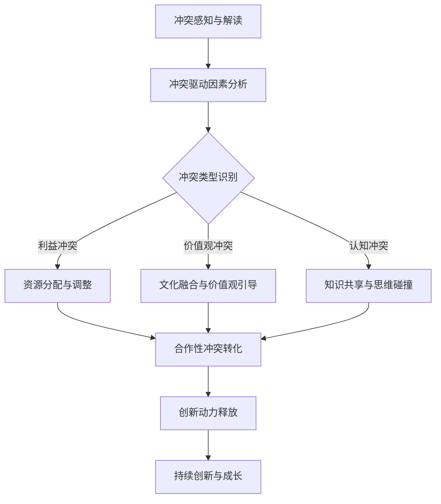
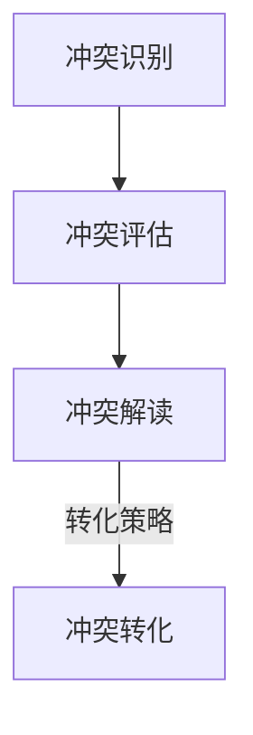
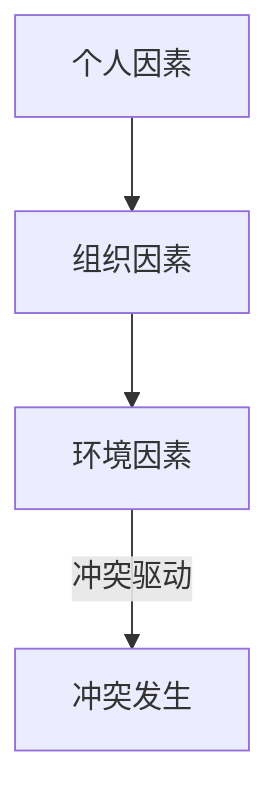
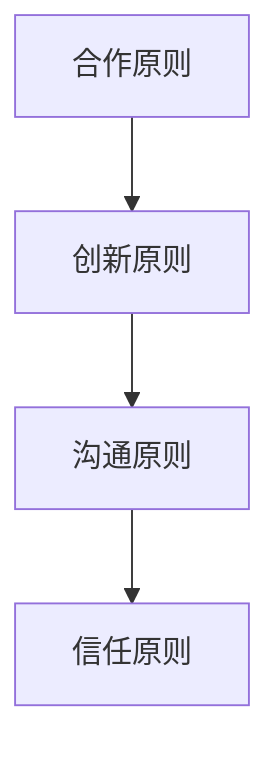
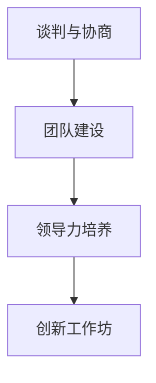

                 

### 文章标题：冲突转化：将分歧变为创新动力的艺术

---

#### 关键词：冲突转化、创新动力、分歧管理、团队协作、合作策略

---

#### 摘要：

本文探讨了如何将冲突转化为创新动力，为企业和组织提供了一种全新的管理思路和方法。通过分析冲突的类型、驱动因素及其转化策略，本文提出了将分歧转化为创新动力的核心概念和理论基础。同时，通过实际案例和最佳实践，本文展示了如何有效地将冲突转化为创新动力，为企业的持续创新和成长提供动力。

### 1. 设计思路

在设计本文时，我们遵循以下思路：

1. **确定书籍主题与目标读者：**
   本文主题为“冲突转化：将分歧变为创新动力的艺术”，旨在帮助企业和组织管理者、项目经理及创新研究者了解如何将冲突转化为创新动力。目标读者包括对冲突转化和团队协作感兴趣的专业人士。

2. **梳理核心内容：**
   根据主题，本文将梳理冲突转化的概念、理论基础、策略与方法，并重点关注实际应用案例和最佳实践。

3. **构建逻辑框架：**
   本文分为三个部分：理论基础、实际应用和未来展望。每个部分包含多个章节，确保内容逻辑清晰、衔接自然。

4. **细化目录内容：**
   每个章节进一步细化为小节，确保每个小节都有明确的主题和内容。

5. **结合实际案例：**
   在相应章节中加入实际案例，以增强文章的可读性和实用性。

6. **确保可操作性：**
   提供具体的操作步骤和方法，使读者能够实际应用所学知识。

### 2. 目录大纲设计

#### 第一部分：冲突转化的理论基础

##### 第1章：冲突转化概述

1.1 冲突转化的概念与类型

1.2 冲突转化的理论基础

1.3 冲突与创新的互动关系

##### 第2章：冲突转化的核心概念

2.1 冲突感知与解读

2.2 冲突的驱动因素

2.3 冲突转化的核心原则

##### 第3章：冲突转化的策略与方法

3.1 冲突转化策略的选择

3.2 冲突转化的方法应用

#### 第二部分：冲突转化的实际应用

##### 第4章：冲突转化在企业中的实践

4.1 企业内部冲突转化

4.2 创新项目中的冲突转化

##### 第5章：冲突转化在组织变革中的应用

5.1 组织变革中的冲突转化

5.2 变革后的冲突转化与持续创新

##### 第6章：冲突转化在其他领域的应用

6.1 教育领域的冲突转化

6.2 社区管理中的冲突转化

#### 第三部分：冲突转化的未来展望

##### 第7章：冲突转化的挑战与未来趋势

7.1 冲突转化的挑战

7.2 冲突转化的未来趋势

##### 第8章：冲突转化的实践启示

8.1 成功的冲突转化案例

8.2 冲突转化的最佳实践

---

在接下来的部分，我们将逐步深入探讨冲突转化的核心概念、理论基础、实际应用和未来展望。希望通过本文，读者能够了解到如何将冲突转化为创新动力，为企业和组织的发展注入新的活力。

### 1.1 冲突转化的概念与类型

冲突转化，指的是在组织或团队内部，通过一定的策略和方法，将潜在的、显现的或已经发生的冲突转化为积极的、有益的创新动力。冲突本身是多种多样的，可以根据不同的分类标准进行划分。

首先，从冲突的根源来看，冲突可以分为以下几种类型：

1. **利益冲突**：由于各方在资源、权益等方面存在矛盾，导致冲突的产生。这种冲突通常发生在竞争激烈的商业环境中。

2. **价值观冲突**：由于团队成员在价值观、信仰、文化等方面存在差异，导致冲突的产生。这种冲突在多元化团队中较为常见。

3. **认知冲突**：由于团队成员对问题的理解、判断和解决方案存在差异，导致冲突的产生。这种冲突通常出现在知识密集型组织中。

其次，从冲突的表现形式来看，冲突可以分为以下几种类型：

1. **显性冲突**：表现为直接的言语或行为上的对抗，如争吵、打架等。

2. **隐性冲突**：表现为团队成员之间的隐晦、间接的不和，如冷嘲热讽、消极怠工等。

3. **合作性冲突**：虽然存在冲突，但团队成员仍然愿意合作解决问题，以实现共同目标。

4. **竞争性冲突**：团队成员将冲突视为一种竞争，追求自己的利益最大化。

在理解冲突转化的概念与类型后，我们需要探讨冲突转化的理论基础。冲突转化并不是简单地消除冲突，而是通过有效的管理和转化，将冲突转化为有益的创新动力。以下是几个关键的理论基础：

1. **双环学习理论**：双环学习理论认为，冲突可以促使个体或组织在两个层次上进行学习：一是解决冲突的表面问题；二是深入挖掘冲突背后的深层次原因。通过这种学习，个体或组织可以不断提高自身的创新能力和适应能力。

2. **社会网络理论**：社会网络理论指出，组织内部的人际关系和网络结构对冲突转化具有重要影响。通过优化人际关系和网络结构，可以降低冲突的发生频率和严重程度。

3. **动态系统理论**：动态系统理论认为，冲突转化是一个动态的、复杂的、多变的系统过程。在这个过程中，各种因素相互作用，共同影响着冲突转化的结果。

为了更好地理解冲突转化的理论基础，我们可以借助一个Mermaid流程图来展示冲突转化的过程：



通过这个流程图，我们可以看到冲突转化是一个从冲突感知与解读、冲突驱动因素分析、冲突类型识别，到冲突转化策略实施，最终实现创新动力释放和持续创新与成长的过程。

在接下来的章节中，我们将进一步探讨冲突转化的核心概念和实际应用，帮助读者深入了解如何将冲突转化为创新动力。### 1.2 冲突转化的理论基础

冲突转化不仅是一个复杂的过程，还需要坚实的理论基础来支撑。以下将介绍几个关键的理论框架，这些框架有助于我们更好地理解冲突转化的机制和实施策略。

#### 1.2.1 冲突管理的理论框架

冲突管理是冲突转化的基础，它包括冲突预防和冲突解决两个方面。以下是几个核心的冲突管理理论：

1. **托马斯-基利理论**：托马斯和基利提出了冲突行为模型，将冲突行为分为五种类型：竞争、合作、回避、妥协和协同。其中，协同是最理想的冲突解决方式，因为它既能满足各方需求，又能保持良好的关系。

2. **克拉克-斯坦纳理论**：克拉克-斯坦纳提出了冲突处理的五种策略：竞争、避免、妥协、协作和合作。这些策略可以根据具体情况灵活运用，以实现冲突的转化。

3. **科特利-卡恩理论**：科特利和卡恩提出了冲突管理的过程模型，包括冲突预防、冲突检测、冲突评估、冲突解决和冲突监控五个阶段。这个模型强调了冲突管理的前瞻性和系统性。

#### 1.2.2 创新理论的应用

创新理论是冲突转化的重要补充，它为冲突提供了新的转化方向和动力来源。以下是几个关键的创新理论：

1. **斯梅尔瑟的“创新生态系统”**：斯梅尔瑟提出了创新生态系统的概念，认为创新是一个复杂的系统过程，包括知识创造、技术转移、市场需求和竞争环境等多个要素。通过优化创新生态系统，可以激发冲突转化为创新动力。

2. **库伯的“创新过程模型”**：库伯提出了创新过程模型，包括需求识别、创意生成、创意筛选、开发、测试和商业化六个阶段。在这个过程中，冲突可以作为创意生成和筛选的重要来源。

3. **普拉哈拉德和哈默的“核心竞争能力”**：普拉哈拉德和哈默提出了核心竞争能力的概念，认为企业需要建立一系列核心竞争能力，以在激烈的市场竞争中保持优势。冲突转化可以通过增强企业的核心竞争能力，实现创新和持续发展。

#### 1.2.3 冲突与合作的互动关系

冲突和合作是相互关联、相互促进的。以下理论探讨了冲突与合作的互动关系：

1. **布朗和马奇的“冲突与合作模型”**：布朗和马奇提出了冲突与合作模型，认为冲突和合作之间存在一种平衡关系。适度的冲突可以激发创新和创造力，而过度或不足的冲突都会影响团队的合作效率。

2. **卢森斯和库克的“合作冲突理论”**：卢森斯和库克提出了合作冲突理论，认为冲突与合作之间存在四种类型：兼容冲突、非兼容冲突、合作型冲突和竞争型冲突。通过合理处理这些冲突，可以促进团队的合作和协调。

3. **尼森的“冲突管理矩阵”**：尼森提出了冲突管理矩阵，根据冲突的性质和程度，将冲突分为四种类型：建设性冲突、破坏性冲突、合作性冲突和回避性冲突。这个矩阵提供了一个全面的冲突管理框架，有助于实现冲突的转化。

通过上述理论框架的介绍，我们可以看到冲突转化不仅仅是简单的冲突解决，它涉及到冲突管理、创新理论和合作关系的多个方面。这些理论为我们提供了丰富的理论资源和实践指导，帮助我们更好地理解和实施冲突转化策略。

在接下来的章节中，我们将继续探讨冲突转化的核心概念，包括冲突感知与解读、冲突驱动因素和冲突转化的核心原则，以及如何在实际应用中有效地运用这些概念和原则。通过这些探讨，我们将深入理解冲突转化的本质，为企业和组织的创新和成长提供有力支持。### 1.3 冲突与创新的互动关系

冲突和创新之间的关系是复杂而动态的。适度的冲突可以激发创新，但过度的冲突也可能阻碍创新。因此，理解冲突与创新的互动关系，对于将冲突转化为创新动力至关重要。

#### 冲突如何激发创新

1. **挑战现状**：冲突往往源于对现状的不满，它挑战了既定的规则和流程，激发了团队成员对现状的反思和改进。

   ```mermaid
   graph TD
   A[现状] --> B{挑战现状}
   B -->|改进方案| C[创新]
   ```

2. **思维碰撞**：冲突使得团队成员之间的观点和想法得以碰撞，激发了新的创意和思路。

   ```mermaid
   graph TD
   A[冲突] --> B{思维碰撞}
   B -->|新想法| C[创新]
   ```

3. **资源整合**：冲突促使各方为了共同的目标，需要重新分配和整合资源，从而创造新的价值。

   ```mermaid
   graph TD
   A[资源] --> B{冲突}
   B -->|资源整合| C[创新]
   ```

4. **适应变化**：冲突迫使团队和组织适应外部环境的变化，从而推动创新以应对挑战。

   ```mermaid
   graph TD
   A[外部变化] --> B{冲突}
   B -->|适应性创新| C[创新]
   ```

#### 冲突如何阻碍创新

1. **消耗精力**：过度的冲突会消耗团队成员的精力和时间，影响他们对创新的关注和投入。

   ```mermaid
   graph TD
   A[冲突] --> B{消耗精力}
   B -->|创新阻碍| C[创新]
   ```

2. **阻碍沟通**：冲突可能导致团队成员之间的沟通障碍，影响信息的传递和共享，从而阻碍创新。

   ```mermaid
   graph TD
   A[冲突] --> B{沟通障碍}
   B -->|创新阻碍| C[创新]
   ```

3. **破坏关系**：长期的冲突可能会破坏团队成员之间的关系，导致团队凝聚力的下降，影响创新。

   ```mermaid
   graph TD
   A[冲突] --> B{破坏关系}
   B -->|创新阻碍| C[创新]
   ```

#### 如何平衡冲突与创新的互动关系

1. **建立冲突管理机制**：通过制定冲突管理政策和流程，确保冲突得到及时有效的处理，避免冲突对创新产生负面影响。

   ```mermaid
   graph TD
   A[建立冲突管理机制]
   A -->|规范冲突处理| B[平衡冲突与创新]
   ```

2. **培养团队协作文化**：鼓励团队成员相互尊重、开放沟通和协作，以降低冲突对创新的阻碍。

   ```mermaid
   graph TD
   A[培养团队协作文化]
   A -->|促进创新| B[平衡冲突与创新]
   ```

3. **提供创新支持**：为团队成员提供必要的资源和培训，鼓励他们在冲突中寻找创新的机会，而不是仅仅解决冲突。

   ```mermaid
   graph TD
   A[提供创新支持]
   A -->|鼓励创新| B[平衡冲突与创新]
   ```

通过以上方法，我们可以有效地平衡冲突与创新的互动关系，将冲突转化为创新动力，推动企业的持续创新和成长。在接下来的章节中，我们将继续探讨冲突转化的核心概念和实际应用，以帮助读者更好地理解和运用这些理论。### 1.4 冲突转化的核心概念

冲突转化是一个动态的过程，涉及多个核心概念。理解这些概念有助于我们更好地实施冲突转化策略，实现从分歧到创新动力的转化。以下是几个关键的核心概念：

#### 1.4.1 冲突感知与解读

冲突感知与解读是冲突转化的第一步。它涉及团队成员对冲突的识别、评估和解读。有效的冲突感知与解读有助于及时发现问题，并制定相应的转化策略。

1. **冲突识别**：团队成员需要具备敏锐的观察力，能够识别潜在的和显现的冲突。

2. **冲突评估**：评估冲突的性质、程度和影响，以确定是否需要采取转化措施。

3. **冲突解读**：解读冲突背后的原因和动机，为转化策略提供依据。



#### 1.4.2 冲突驱动因素

冲突驱动因素是引发冲突的根本原因。了解这些因素有助于我们找到冲突的根源，并采取相应的措施进行转化。

1. **个人因素**：个人价值观、认知偏见、情绪状态等可能成为冲突的驱动因素。

2. **组织因素**：组织结构、文化、流程等可能影响冲突的发生和转化。

3. **环境因素**：外部环境的变化、市场压力、竞争等也可能成为冲突的驱动因素。



#### 1.4.3 冲突转化的核心原则

冲突转化的核心原则是指导冲突转化策略实施的基本原则。以下是一些关键的核心原则：

1. **合作原则**：鼓励团队成员在冲突中寻求合作，共同解决问题。

2. **创新原则**：将冲突视为创新的机会，从中寻找新的解决方案。

3. **沟通原则**：强调有效沟通，确保信息的透明和准确传递。

4. **信任原则**：建立信任关系，降低冲突的发生和影响。



#### 1.4.4 冲突转化策略

冲突转化策略是实施冲突转化的具体方法和手段。以下是一些常见的冲突转化策略：

1. **谈判与协商**：通过谈判和协商解决冲突，寻求各方都能接受的解决方案。

2. **团队建设**：通过团队建设活动增强团队成员之间的信任和合作。

3. **领导力培养**：通过培养领导力，提高团队成员在冲突管理中的能力。

4. **创新工作坊**：通过创新工作坊等方式，激发团队成员的创新思维和创造力。



通过理解冲突转化的核心概念，我们可以更好地实施冲突转化策略，将冲突转化为创新动力，推动企业的持续创新和成长。在接下来的章节中，我们将进一步探讨冲突转化的策略和方法，以帮助读者在实际工作中运用这些理论。### 1.5 冲突转化策略的选择

冲突转化策略的选择是确保冲突得以有效转化并最终激发创新动力的关键。根据冲突的不同类型、强度和环境，可以选择不同的转化策略。以下是几种常见的冲突转化策略：

#### 1.5.1 合作策略

合作策略是通过鼓励各方在冲突中寻求共同点，达成共识，从而实现冲突的转化。这种方法强调合作和共赢，适用于解决价值观冲突和利益冲突。

1. **合作策略的核心步骤**：

   ```mermaid
   graph TD
   A[明确目标] --> B[沟通与交流]
   B --> C[寻找共同点]
   C --> D[制定解决方案]
   D --> E[执行与反馈]
   ```

2. **适用场景**：适用于需要长期合作、共同发展的团队和组织。

3. **案例**：一个成功的企业并购案中，通过双方团队的合作和协商，成功实现了文化整合和业务协同。

#### 1.5.2 竞争策略

竞争策略是通过在冲突中鼓励竞争，激发创新和进步。这种方法强调在竞争中学习和进步，适用于解决认知冲突和部分利益冲突。

1. **竞争策略的核心步骤**：

   ```mermaid
   graph TD
   A[设定目标] --> B[激励竞争]
   B --> C[评估与反馈]
   C --> D[优化与改进]
   ```

2. **适用场景**：适用于需要创新和快速发展的团队和组织。

3. **案例**：在一个科技公司的产品开发团队中，通过内部竞争机制，激发了团队成员的积极性和创新能力，推动了产品迭代和升级。

#### 1.5.3 避免策略

避免策略是通过转移焦点或暂时搁置冲突，以避免冲突对工作和关系的负面影响。这种方法适用于冲突程度较低、短期内无法解决的情况。

1. **避免策略的核心步骤**：

   ```mermaid
   graph TD
   A[识别冲突] --> B[转移焦点]
   B --> C[沟通协调]
   C --> D[搁置冲突]
   ```

2. **适用场景**：适用于冲突程度较低、需要暂时缓解的情况。

3. **案例**：在一个项目经理与团队成员之间的沟通障碍中，通过调整沟通方式，成功缓解了冲突，确保项目顺利进行。

#### 1.5.4 谈判与沟通技巧

谈判与沟通技巧是冲突转化的重要工具，通过有效的谈判和沟通，可以降低冲突的严重性，实现冲突的转化。

1. **谈判与沟通技巧的核心要点**：

   ```mermaid
   graph TD
   A[倾听与理解] --> B[表达与沟通]
   B --> C[寻求共识]
   C --> D[达成协议]
   ```

2. **适用场景**：适用于各种类型的冲突。

3. **案例**：在一个跨部门合作项目中，通过有效的谈判和沟通，成功解决了部门间的利益冲突，实现了项目目标的顺利达成。

#### 总结

不同的冲突转化策略适用于不同的冲突类型和强度。在实际应用中，需要根据具体情况进行选择和调整。通过灵活运用各种策略，可以有效将冲突转化为创新动力，推动团队的协作和组织的持续创新。在接下来的章节中，我们将进一步探讨如何在实际工作中实施这些策略，以实现冲突的转化。### 1.6 冲突转化的方法应用

冲突转化的方法在实践中的应用对于实现团队协作和提升组织创新能力至关重要。以下将介绍几种有效的冲突转化方法及其在团队建设和领导力培养中的具体应用。

#### 1.6.1 谈判与沟通技巧

谈判与沟通技巧是冲突转化的核心方法之一。通过有效的谈判和沟通，可以降低冲突的紧张程度，促进各方达成共识。

1. **谈判技巧的应用**：

   - **准备充分**：在谈判前，充分了解各方的需求和利益，制定谈判策略。
   - **寻求共识**：通过找出共同利益和目标，寻求达成共识的方案。
   - **妥善处理分歧**：在谈判过程中，妥善处理各方分歧，避免情绪化的争执。

   ```mermaid
   graph TD
   A[准备充分] --> B[寻求共识]
   B --> C[妥善处理分歧]
   ```

2. **沟通技巧的应用**：

   - **倾听与理解**：倾听对方的观点和需求，确保准确理解对方的意图。
   - **表达清晰**：清晰、准确地表达自己的观点和需求。
   - **情感共鸣**：在沟通中，建立情感共鸣，增进相互理解。

   ```mermaid
   graph TD
   A[倾听与理解] --> B[表达清晰]
   B --> C[情感共鸣]
   ```

3. **案例**：在一个研发团队中，通过有效的谈判和沟通，成功解决了团队成员在项目进度和任务分配上的冲突，确保项目顺利进行。

#### 1.6.2 团队建设

团队建设活动有助于增强团队成员之间的信任和协作，降低冲突的发生，促进冲突转化。

1. **团队建设活动的应用**：

   - **信任游戏**：通过信任游戏，增强团队成员之间的信任感。
   - **团队建设工作坊**：定期举办团队建设工作坊，促进团队成员的交流和合作。
   - **团队角色认知**：帮助团队成员认识到自己在团队中的角色和职责。

   ```mermaid
   graph TD
   A[信任游戏] --> B[团队建设工作坊]
   B --> C[团队角色认知]
   ```

2. **案例**：在一个跨部门团队中，通过定期的团队建设活动，成功增强了团队成员之间的协作，降低了冲突的发生，提高了项目成功率。

#### 1.6.3 领导力培养

领导力培养是冲突转化的关键因素。有效的领导者能够引导团队处理冲突，将冲突转化为创新动力。

1. **领导力培养的应用**：

   - **冲突管理培训**：为团队成员提供冲突管理培训，提高他们的冲突管理能力。
   - **领导力发展计划**：实施领导力发展计划，培养团队成员的领导力。
   - **角色扮演**：通过角色扮演，让团队成员体验不同的领导角色，提高他们的领导力。

   ```mermaid
   graph TD
   A[冲突管理培训] --> B[领导力发展计划]
   B --> C[角色扮演]
   ```

2. **案例**：在一个创新团队中，通过领导力培养计划，成功提升了团队成员的冲突管理能力，有效地将冲突转化为创新动力，推动了团队的创新和成长。

#### 1.6.4 创新思维的培养

创新思维的培养是冲突转化的重要途径。通过激发团队成员的创新思维，可以找到新的解决方案，将冲突转化为创新动力。

1. **创新思维培养的应用**：

   - **头脑风暴**：通过头脑风暴，激发团队成员的创新思维。
   - **思维导图**：使用思维导图，帮助团队成员梳理创新思路。
   - **创新工作坊**：举办创新工作坊，鼓励团队成员提出创新想法。

   ```mermaid
   graph TD
   A[头脑风暴] --> B[思维导图]
   B --> C[创新工作坊]
   ```

2. **案例**：在一个产品开发团队中，通过创新工作坊，成功激发了团队成员的创新思维，提出了多个创新方案，推动了产品的迭代和升级。

通过以上方法的应用，我们可以有效地将冲突转化为创新动力，促进团队的协作和组织的持续创新。在接下来的章节中，我们将进一步探讨冲突转化在实际项目中的应用，以帮助读者更好地理解和运用这些方法。### 1.7 企业内部冲突转化

在企业内部，冲突转化是一个关键的议题。有效的冲突转化能够促进团队协作、提升创新能力和增强组织竞争力。以下将探讨企业内部冲突转化的主要方法及其应用案例。

#### 1.7.1 管理层与员工之间的冲突转化

管理层与员工之间的冲突常见于目标设定、资源分配、职业发展等方面。有效的冲突转化策略可以提升管理层与员工之间的沟通和协作。

1. **方法**：

   - **设立定期沟通机制**：通过定期会议、员工反馈等方式，增强管理层与员工之间的沟通。
   - **提供职业发展支持**：通过培训和职业发展计划，满足员工的职业发展需求，减少冲突。
   - **建立信任关系**：通过领导力培养和信任建设活动，建立管理层与员工之间的信任。

2. **应用案例**：

   - **公司A**：通过设立月度员工座谈会，管理层与员工定期沟通，解决了目标设定和资源分配上的冲突，提高了员工满意度。

#### 1.7.2 项目团队内部的冲突转化

项目团队内部的冲突可能会影响项目进度和质量。有效的冲突转化策略可以提升团队协作和项目成功率。

1. **方法**：

   - **团队合作训练**：通过团队合作训练，增强团队成员之间的信任和协作。
   - **角色明确**：确保每个团队成员都清楚自己的角色和职责，减少因职责不清导致的冲突。
   - **任务分解**：将项目任务分解为小任务，分配给不同团队成员，降低冲突的发生。

2. **应用案例**：

   - **公司B**：通过团队合作训练和任务分解，成功解决了项目团队内部因职责不清导致的冲突，提高了项目进度和质量。

#### 1.7.3 企业文化中的冲突转化

企业文化是冲突转化的重要环境因素。通过构建积极的企业文化，可以降低冲突的发生，促进冲突转化。

1. **方法**：

   - **倡导开放沟通**：鼓励员工开放表达观点，增强团队内部的沟通和协作。
   - **重视员工反馈**：关注员工反馈，及时解决员工提出的问题，增强员工对企业文化的认同。
   - **奖励创新思维**：通过奖励制度，鼓励员工提出创新想法，将冲突转化为创新动力。

2. **应用案例**：

   - **公司C**：通过倡导开放沟通和奖励创新思维，成功构建了一个积极的企业文化，降低了内部冲突的发生，提升了员工的创新能力和企业竞争力。

#### 1.7.4 企业内部冲突转化的实践启示

通过以上案例，我们可以得出以下实践启示：

1. **建立有效的沟通机制**：定期沟通是解决管理层与员工之间冲突的有效手段。
2. **强化团队合作**：团队合作训练和任务分解有助于提升项目团队内部的合作和协作。
3. **构建积极的企业文化**：开放沟通、重视员工反馈和奖励创新思维是构建积极企业文化的关键。

通过这些实践启示，企业可以更有效地将内部冲突转化为创新动力，推动企业的持续发展和竞争力提升。在接下来的章节中，我们将继续探讨冲突转化在创新项目中的应用，以帮助读者更好地理解和运用冲突转化策略。### 1.8 创新项目中的冲突转化

在创新项目中，冲突是不可避免的，因为创新本身就是一个不断探索和实验的过程。然而，正确管理和转化冲突可以成为推动项目前进和创新发展的关键动力。以下将探讨创新项目中的冲突转化策略及其应用。

#### 1.8.1 创新项目的冲突管理策略

为了在创新项目中有效地转化冲突，以下策略和方法可以提供指导：

1. **明确目标与期望**：在项目启动时，明确项目的目标和期望，确保所有团队成员都清楚自己的职责和任务，这有助于减少因目标不一致而引发的冲突。

2. **建立信任和沟通**：通过团队建设活动、定期会议和开放的沟通渠道，建立团队成员之间的信任，鼓励他们分享观点和意见，从而减少冲突的发生。

3. **采用迭代开发方法**：迭代开发方法允许团队在项目早期阶段快速测试和验证想法，这样可以及时发现和解决潜在冲突，防止问题积累。

4. **多元化团队组合**：组建具有不同背景和技能的多元化团队，这样可以带来不同的观点和解决方案，有助于解决冲突并促进创新。

5. **设立冲突解决机制**：建立明确的冲突解决流程和机制，确保团队成员在出现冲突时能够及时有效地解决，避免问题进一步恶化。

#### 1.8.2 创新团队的冲突转化实践

以下是一些实际应用案例，展示了如何将冲突转化为创新动力的过程：

1. **案例一：跨部门合作项目**

   - **冲突背景**：在一个涉及多个部门的大型项目中，由于各部门的目标和资源分配存在分歧，导致项目进度延误。
   - **转化策略**：项目团队采用了一个协作工作坊，通过讨论和协商，重新明确了各部门的责任和资源需求，并建立了定期的跨部门会议机制。
   - **结果**：通过这些措施，项目团队成功地解决了跨部门冲突，项目进度恢复了正轨，并最终提前完成了目标。

2. **案例二：产品开发团队的内部冲突**

   - **冲突背景**：在一个产品开发团队中，设计师和技术人员因对产品设计方案存在严重分歧，导致团队内部紧张和不和谐。
   - **转化策略**：项目经理组织了一次开放讨论会，让团队成员自由表达自己的观点，并鼓励他们寻找共同点。同时，项目经理提供了外部专家的咨询，帮助团队找到平衡的解决方案。
   - **结果**：通过这一过程，团队成员达成了共识，设计和技术团队的合作关系得到了改善，产品最终获得了市场和用户的高度认可。

3. **案例三：新兴技术项目的研发**

   - **冲突背景**：在一个新兴技术项目的研发过程中，团队成员对技术路线存在较大分歧，导致项目进展缓慢。
   - **转化策略**：项目经理组织了一次头脑风暴会议，鼓励团队成员提出各自的创新思路，并采用了投票机制来选择最佳方案。此外，项目经理还安排了定期的技术评审会议，以确保团队在正确的方向上前进。
   - **结果**：通过这些措施，团队成员的创新思维得到了激发，项目最终成功实现了技术突破，并按时交付了产品。

#### 1.8.3 创新项目中的冲突转化案例分析

以下是对上述案例的进一步分析，以揭示冲突转化的具体方法和成效：

1. **案例一分析**：

   - **方法**：通过协作工作坊和跨部门会议机制，建立了一个开放和协作的项目文化，促进了团队成员之间的沟通和理解。
   - **成效**：冲突得到有效解决，团队协作得到加强，项目进度得到了显著提升。

2. **案例二分析**：

   - **方法**：通过开放讨论和外部专家咨询，帮助团队成员找到了平衡的解决方案，尊重了不同意见，同时也促进了团队内部的和谐。
   - **成效**：团队内部的紧张关系得到了缓解，团队成员之间的信任和协作得到了增强，最终产品获得了市场成功。

3. **案例三分析**：

   - **方法**：通过头脑风暴和投票机制，鼓励了团队成员的创新思维，同时通过技术评审会议，确保了项目沿着正确的方向前进。
   - **成效**：项目的创新性和技术实现得到了提升，团队成员的创新潜力得到了激发，项目按时交付并取得了良好的市场反响。

通过上述案例分析，我们可以看到，在创新项目中，冲突转化不仅是必要的，而且是实现项目成功和推动创新的关键。通过适当的策略和方法，企业可以有效地将冲突转化为创新动力，促进项目的持续发展和成功。在接下来的章节中，我们将进一步探讨冲突转化在组织变革中的应用，以帮助读者更全面地理解和应用冲突转化策略。### 1.9 组织变革中的冲突转化

组织变革是一项复杂的任务，常常伴随着大量的冲突。有效的冲突转化策略可以帮助组织在变革过程中保持稳定，并促进变革目标的实现。以下将探讨组织变革中冲突转化的具体方法和应用。

#### 1.9.1 变革管理中的冲突转化策略

在组织变革过程中，管理者需要采取一系列策略来处理和转化冲突，以下是一些关键策略：

1. **明确变革目标和路径**：在变革初期，明确变革的目标和实施路径，确保所有成员都了解变革的方向和预期结果。这有助于减少因目标不明导致的冲突。

2. **沟通与透明度**：保持与员工的持续沟通，确保信息的透明度，及时传达变革的信息和进展。这有助于减少误解和猜疑，降低冲突的发生。

3. **建立信任关系**：通过建立信任关系，增强员工对变革的支持和接受度。信任关系的建立可以通过领导力培养、团队建设活动和开放沟通来实现。

4. **提供变革支持**：为员工提供必要的变革支持，包括培训、指导和心理辅导，帮助他们适应变革。这可以减少变革过程中的焦虑和不安，降低冲突的发生。

5. **鼓励参与和反馈**：鼓励员工参与变革过程，提供反馈渠道，让他们在变革中发挥积极作用。这可以增强员工的归属感和责任感，减少因变革带来的不安全感。

#### 1.9.2 变革过程中的冲突转化实践

以下是一些实际应用案例，展示了如何在组织变革过程中转化冲突：

1. **案例一：企业并购后的整合**

   - **冲突背景**：在一家企业并购另一家企业的过程中，由于双方文化、流程和资源分配上的差异，导致员工之间产生了冲突。
   - **转化策略**：新管理层采取了开放沟通策略，定期举办员工座谈会，听取员工的意见和反馈。同时，通过团队建设活动和培训，帮助员工适应新的文化和工作环境。
   - **结果**：通过这些措施，成功转化了并购过程中的冲突，员工逐渐接受了新文化，并购后的企业运营逐渐稳定。

2. **案例二：企业转型中的组织变革**

   - **冲突背景**：一家企业为了适应市场变化，决定进行转型，这一决定引起了部分员工的不满和抵触。
   - **转化策略**：企业高层领导通过一系列沟通活动，向员工解释转型的必要性和潜在利益。同时，提供了职业发展和培训支持，帮助员工适应新的工作要求。
   - **结果**：通过这些措施，员工逐渐理解了转型的意义，并积极参与到变革过程中，企业转型取得了成功。

3. **案例三：大型组织结构调整**

   - **冲突背景**：在一家大型企业中进行组织结构调整，由于岗位变动和责任分配的变化，导致员工之间产生了冲突。
   - **转化策略**：企业采取了多种策略，包括明确新的岗位责任、提供职业发展规划、举办团队建设活动等，帮助员工适应新的组织结构。
   - **结果**：通过这些措施，员工逐渐适应了新的组织结构，冲突得到了有效转化，企业的运营效率得到了提升。

#### 1.9.3 变革后的冲突转化与持续创新

组织变革后，冲突的转化不仅是为了实现变革目标，还需要为持续创新奠定基础。以下是一些建议：

1. **持续沟通与反馈**：在变革后，保持与员工的持续沟通，了解他们的反馈和需求，及时解决问题，确保变革效果的持续。

2. **创新激励机制**：建立创新激励机制，鼓励员工在变革后继续提出创新想法和解决方案，将变革转化为持续创新的动力。

3. **领导力培养**：通过领导力培养，提升管理团队在变革后的领导能力，确保他们能够有效地管理和转化后续的冲突。

4. **文化塑造**：通过塑造积极的企业文化，鼓励员工在变革后继续积极参与和贡献，为持续创新创造良好的环境。

通过以上策略和实践，组织可以有效地转化变革过程中的冲突，为持续创新和稳定发展奠定基础。在接下来的章节中，我们将进一步探讨冲突转化在社区管理中的应用，以帮助读者更全面地理解和应用冲突转化策略。### 1.10 教育领域的冲突转化

在教育领域，冲突转化对于促进学生的全面发展、提升教学质量和构建和谐校园环境具有重要意义。以下将探讨教育领域中的冲突转化策略及其应用。

#### 1.10.1 教育环境中的冲突转化

1. **建立和谐师生关系**：师生关系是教育环境中冲突的重要源头。通过定期的师生交流、情感沟通和心理辅导，可以建立良好的师生关系，减少因误解和不满引发的冲突。

2. **完善学生评价体系**：传统的单一评价体系可能导致学生间的竞争和冲突。通过多元化评价体系，如过程性评价、同伴评价等，可以减少因评价标准不一致而产生的冲突。

3. **加强校园文化建设**：校园文化是影响学生行为和心态的重要因素。通过开展校园文化活动、建立学生社团等方式，可以培养学生的集体荣誉感和归属感，减少冲突的发生。

#### 1.10.2 学生与教师之间的冲突转化

学生与教师之间的冲突常见于教学方法、学习压力和人际关系等方面。以下是一些转化策略：

1. **设立学生反馈机制**：通过设立学生反馈渠道，如学生座谈会、意见箱等，让学生表达自己的意见和建议，教师可以根据反馈调整教学方法和策略。

2. **开展心理辅导**：针对存在心理问题的学生，提供心理辅导服务，帮助他们化解心理冲突，提高心理健康水平。

3. **加强师生沟通**：通过定期举行班会、家长会等，加强师生之间的沟通和理解，及时解决矛盾和问题。

#### 1.10.3 教育创新中的冲突转化

教育创新过程中，冲突转化对于推动教育改革和提升教育质量至关重要。以下是一些建议：

1. **建立创新团队**：组建跨学科、多层次的创新团队，鼓励不同背景的教师和研究人员共同探讨教育创新方案，通过团队合作化解冲突。

2. **开展创新工作坊**：定期举办创新工作坊，为教师提供学习和交流的平台，激发他们的创新思维，通过实践化解教学过程中的冲突。

3. **引入外部资源**：通过引入外部专家、学者和企业的资源，为教育创新提供新的视角和方法，促进教育领域的跨界合作，化解创新过程中的冲突。

#### 1.10.4 应用案例

1. **案例一：中小学班级管理**

   - **冲突背景**：在班级管理中，学生之间的竞争和师生之间的矛盾可能导致冲突。
   - **转化策略**：学校通过设立班级反馈机制，定期召开班会，让学生表达意见和建议，教师根据反馈调整管理策略。同时，开展心理辅导，帮助学生化解心理冲突。

2. **案例二：高校教学改革**

   - **冲突背景**：在高校教学改革中，教师对新教学方法的接受程度不同，可能导致冲突。
   - **转化策略**：学校组建了跨学科的创新团队，通过举办创新工作坊，让教师共同探讨和实验新的教学方法。同时，引入外部专家资源，为教师提供培训和支持，促进教学改革。

3. **案例三：职业教育课程开发**

   - **冲突背景**：在职业教育课程开发中，企业需求和学校教学目标之间的矛盾可能导致冲突。
   - **转化策略**：学校与当地企业合作，建立校企联合体，共同开发课程。通过定期召开合作会议，解决课程开发中的冲突，确保课程内容符合企业需求。

通过以上策略和应用案例，教育领域可以有效地转化冲突，为学生的全面发展、教学质量的提升和和谐校园环境的建设提供支持。在接下来的章节中，我们将进一步探讨冲突转化在社区管理中的应用，以帮助读者更全面地理解和应用冲突转化策略。### 1.11 社区管理中的冲突转化

社区管理是一个涉及居民生活、社会关系和公共资源的复杂过程，冲突在其中不可避免。有效的冲突转化不仅有助于维护社区和谐，还能激发社区活力，推动社区发展。以下将探讨社区管理中的冲突转化策略及其应用。

#### 1.11.1 社区冲突的转化策略

1. **建立社区沟通机制**：通过设立社区议事会、居民代表会议等沟通渠道，让居民有机会表达自己的意见和需求，促进居民之间的沟通和理解，从而化解冲突。

2. **加强社区调解工作**：设立社区调解中心，培训专业的调解员，为居民提供调解服务。通过调解，帮助居民在法律和道德范围内解决纠纷，减少冲突的激化。

3. **推动社区参与**：鼓励居民参与社区管理和决策，通过民主选举、居民提案等方式，让居民在社区事务中发挥积极作用，增强居民对社区的归属感和责任感。

4. **开展社区教育和培训**：通过开展社区教育活动，提高居民的法律意识、公民素养和沟通技巧，减少因无知和误解引发的冲突。

5. **利用社区资源**：充分利用社区资源，如社区服务中心、公园、图书馆等，为居民提供活动场所和资源支持，促进居民之间的交流和互动，减少冲突的发生。

#### 1.11.2 社区冲突转化实践

以下是一些实际应用案例，展示了如何在社区管理中转化冲突：

1. **案例一：邻里纠纷调解**

   - **冲突背景**：由于邻里之间在噪音、停车等问题上存在纠纷，导致居民关系紧张。
   - **转化策略**：社区调解中心组织调解员介入，通过面对面沟通和协商，帮助双方找到共同点，达成和解。

2. **案例二：社区公共设施争议**

   - **冲突背景**：居民对社区公共设施的维护和使用存在分歧，导致社区公共资源的使用紧张。
   - **转化策略**：社区召开居民代表会议，听取各方意见，通过民主决策，确定公共设施的维护和使用方案，解决了争议。

3. **案例三：社区环境治理**

   - **冲突背景**：社区居民对社区环境治理存在不同意见，导致环境治理工作进展缓慢。
   - **转化策略**：社区通过设立环境治理委员会，鼓励居民参与环境治理的规划和管理，提高了居民对环境治理工作的支持和参与度。

#### 1.11.3 社区治理与创新的冲突转化

社区治理与创新的冲突转化对于推动社区持续发展至关重要。以下是一些建议：

1. **创新社区治理模式**：通过引入新的社区治理模式，如智慧社区、社区自治等，提高社区治理的效率和质量，减少因传统治理模式引发的冲突。

2. **建立创新支持体系**：为社区创新提供资金、技术和管理支持，鼓励居民尝试新的社区管理和服务模式，通过创新解决冲突。

3. **培养社区领导力**：通过培训、实践等方式，培养社区领导者的创新意识和领导能力，提高他们在冲突转化中的影响力。

通过以上策略和实践，社区管理可以更有效地转化冲突，促进社区和谐与持续发展。在接下来的章节中，我们将探讨冲突转化的未来挑战和趋势，以帮助读者更好地理解和应对未来的挑战。### 1.12 冲突转化的挑战与未来趋势

在冲突转化的过程中，我们面临着诸多挑战和机遇。理解这些挑战和趋势，有助于我们更好地应对未来的挑战，推动冲突转化策略的创新和发展。

#### 1.12.1 冲突转化的挑战

1. **组织结构与文化因素**：组织结构和文化对冲突转化具有重要影响。传统的等级制组织结构可能导致信息传递不畅和决策延迟，影响冲突的及时转化。同时，组织文化中的保守主义和抵触变革的态度也会阻碍冲突转化。

2. **个人价值观与认知偏见**：个人的价值观和认知偏见是冲突转化的内部障碍。不同的价值观和认知偏见可能导致对冲突的不同解读和处理方式，从而影响冲突转化的效果。

3. **技术变革的影响**：随着技术的快速发展，尤其是人工智能、大数据和云计算等技术的广泛应用，冲突转化的方式和手段也在不断变革。然而，技术变革也可能带来新的冲突，如隐私保护、数据安全等问题。

#### 1.12.2 冲突转化的未来趋势

1. **数据驱动的冲突转化**：随着数据技术的发展，越来越多的组织开始利用数据分析和人工智能技术来预测和转化冲突。通过分析冲突数据，可以更准确地识别冲突的根源和影响，制定更有效的转化策略。

2. **智能化冲突转化工具**：人工智能和机器学习技术的应用，使得冲突转化工具变得更加智能化。例如，智能调解系统可以通过学习历史数据，自动识别和解决常见的冲突，提高冲突转化的效率和效果。

3. **全球化背景下的冲突转化**：全球化背景下，组织面临更加复杂和多元的冲突。通过跨文化沟通和国际合作，可以更好地处理全球化背景下的冲突，促进全球范围内的冲突转化。

#### 1.12.3 冲突转化的未来展望

1. **冲突转化的方法论创新**：未来冲突转化的发展将依赖于方法论的创新。通过结合行为科学、认知科学和技术，可以开发出更加科学和系统的冲突转化方法。

2. **冲突转化的实践应用**：随着冲突转化理论的不断完善，更多的组织和团队将开始应用冲突转化策略。在教育、企业、社区等各个领域，冲突转化将成为推动创新和发展的关键因素。

3. **冲突转化的持续改进**：冲突转化是一个持续的过程，需要不断地评估和改进。通过建立反馈机制和持续学习，可以不断提高冲突转化的效果。

通过上述挑战与未来趋势的探讨，我们可以看到，冲突转化在未来的发展过程中将面临诸多机遇和挑战。理解这些挑战和趋势，有助于我们更好地应对未来的变化，推动冲突转化策略的创新和发展。在接下来的章节中，我们将通过成功的冲突转化案例，进一步展示如何在实际应用中实现冲突转化，以期为读者提供有益的借鉴和启示。### 1.13 成功的冲突转化案例

在冲突转化的实践中，许多组织和团队已经取得了显著的成果。以下将介绍几个成功的冲突转化案例，并分析其关键要素和经验教训。

#### 1.13.1 企业内部冲突转化的成功案例

**案例一：跨国公司的文化融合**

- **背景**：一家跨国公司在全球范围内进行了业务扩张，收购了多家本地公司。然而，由于文化差异和管理方式的不同，员工之间出现了严重的冲突。
- **转化策略**：公司采取了一系列措施，包括设立文化融合委员会、举办跨文化培训、定期举办文化日活动等。此外，公司还鼓励员工提出建议，共同制定融合计划。
- **关键要素**：明确融合目标、提供文化培训、鼓励员工参与、建立沟通渠道。
- **经验教训**：成功的文化融合需要时间和耐心，关键在于建立共同的愿景和价值观。

**案例二：团队内部的创新协作**

- **背景**：一个产品开发团队在项目初期因技术路线分歧而陷入僵局，导致项目进度受阻。
- **转化策略**：项目经理组织了一次头脑风暴会议，让团队成员自由表达意见，并邀请外部专家提供咨询。通过讨论和投票，团队最终达成了一致。
- **关键要素**：开放沟通、集体决策、外部专家支持。
- **经验教训**：在团队冲突中，及时引入外部资源可以提供新的视角和解决方案。

#### 1.13.2 教育领域的冲突转化

**案例三：学校班级管理**

- **背景**：一个学校班级由于学生之间的竞争和沟通问题，导致课堂秩序混乱，学生成绩下降。
- **转化策略**：班主任通过设立班级反馈机制，定期召开班会，让学生表达意见和建议。同时，开展团队合作活动和心理辅导，帮助学生建立良好的沟通和协作能力。
- **关键要素**：建立反馈机制、开展心理辅导、促进团队合作。
- **经验教训**：有效的班级管理需要关注学生的情感需求，建立积极的沟通和协作环境。

**案例四：教育创新项目**

- **背景**：一所学校尝试引入新的教学方式，但教师们对新方法的接受度不同，导致项目推进困难。
- **转化策略**：学校组建了跨学科的创新团队，通过定期举办教学研讨会和培训，提高教师对新教学方式的理解和接受度。同时，学校提供了创新激励措施，鼓励教师提出创新教学方案。
- **关键要素**：组建创新团队、提供培训和支持、建立激励机制。
- **经验教训**：教育创新需要逐步推进，关键在于提高教师的参与度和创新能力。

#### 1.13.3 社区管理的冲突转化

**案例五：社区纠纷调解**

- **背景**：社区居民在公共设施使用、停车等问题上存在纠纷，导致社区关系紧张。
- **转化策略**：社区调解中心组织调解员介入，通过面对面沟通和协商，帮助双方找到共同点，达成和解。
- **关键要素**：专业调解员的支持、面对面沟通、协商解决问题。
- **经验教训**：有效的社区纠纷调解需要建立专业的调解机制，关键在于提供中立的第三方调解服务。

**案例六：社区环境治理**

- **背景**：社区居民对社区环境治理存在不同意见，导致治理工作进展缓慢。
- **转化策略**：社区通过设立环境治理委员会，鼓励居民参与环境治理的规划和管理，提高了居民对环境治理工作的支持和参与度。
- **关键要素**：居民参与、民主决策、社区治理委员会的支持。
- **经验教训**：社区治理需要充分调动居民的积极性和参与度，关键在于建立民主的决策和管理机制。

通过以上案例，我们可以看到，冲突转化成功的关键在于明确目标、提供支持和建立有效的沟通机制。在冲突转化的过程中，需要结合实际情况，灵活运用不同的策略和方法，以实现冲突的有效转化。在接下来的章节中，我们将进一步探讨冲突转化的最佳实践，以期为读者提供更具体的操作指南。### 1.14 冲突转化的最佳实践

在冲突转化的实践中，积累了许多宝贵的经验和教训。以下将总结一些冲突转化的最佳实践，以期为企业和组织提供具体的操作指南。

#### 1.14.1 制定冲突转化策略

1. **评估冲突类型和程度**：在制定冲突转化策略前，首先要对冲突的类型和程度进行评估，以便选择合适的转化策略。可以通过问卷调查、访谈等方式收集数据，了解冲突的具体情况。

2. **明确目标**：在制定冲突转化策略时，要明确转化的目标，如降低冲突程度、提高团队协作等。明确目标有助于确保策略的实施方向正确。

3. **制定具体措施**：根据评估结果和目标，制定具体的转化措施，如沟通与培训、团队建设活动、调解服务等。这些措施应具有可操作性和可衡量性。

4. **分配资源和责任**：确保冲突转化策略的实施有足够的资源支持，明确各方的责任和角色，确保策略能够得到有效执行。

#### 1.14.2 构建冲突转化文化

1. **倡导开放沟通**：在组织内部倡导开放沟通，鼓励员工表达观点和意见，创造一个包容和尊重的环境，减少冲突的发生。

2. **建立信任关系**：通过建立信任关系，降低冲突的负面影响，促进团队协作和创新。可以通过团队建设活动、领导力培训等方式，增强员工之间的信任。

3. **制定冲突管理政策**：制定明确的冲突管理政策，规范冲突的处理流程和标准，确保冲突得到及时有效的处理。

4. **鼓励创新思维**：鼓励员工在冲突中寻找创新的机会，将冲突转化为改进和创新的动力。可以通过设立创新奖项、举办创新工作坊等方式，激发员工的创新潜力。

#### 1.14.3 培养冲突转化的团队

1. **提升团队协作能力**：通过团队协作培训，提升团队成员的协作能力，减少因沟通不畅和角色不清导致的冲突。

2. **培养冲突管理技能**：为团队成员提供冲突管理培训，提高他们在冲突识别、分析和解决方面的能力。可以通过案例分析、角色扮演等方式，增强团队成员的实战经验。

3. **建立有效的沟通机制**：建立有效的沟通机制，确保团队成员之间的信息传递畅通，减少误解和冲突。

4. **培养团队领导力**：培养团队领导力，提升领导者在冲突转化中的影响力。可以通过领导力培训、实践锻炼等方式，提升领导者的管理能力和决策水平。

#### 1.14.4 实施有效的冲突转化方案

1. **制定详细的实施计划**：在实施冲突转化方案前，制定详细的实施计划，明确时间表、责任人和关键节点，确保方案能够按时完成。

2. **监督和评估**：在方案实施过程中，定期监督和评估方案的执行情况，及时发现和解决问题。可以通过问卷调查、访谈等方式，了解员工对冲突转化方案的感受和反馈。

3. **调整和优化**：根据监督和评估的结果，对冲突转化方案进行调整和优化，确保方案能够持续改进和提升效果。

4. **持续改进**：冲突转化是一个持续的过程，需要不断学习和改进。通过定期回顾和总结冲突转化的经验和教训，不断提升冲突转化的效果。

通过以上最佳实践，企业和组织可以更好地应对冲突，将冲突转化为创新动力，推动团队的协作和组织的持续发展。在接下来的章节中，我们将对本文进行小结，总结冲突转化的核心要点，并给出一些注意事项和建议。### 1.15 小结与展望

在本文中，我们深入探讨了冲突转化的核心概念、理论基础、策略和方法，以及在实际应用中的成功案例和最佳实践。以下是对全文内容的简要总结：

1. **冲突转化的概念与类型**：我们了解了冲突转化的定义、不同类型的冲突以及其驱动因素。
2. **冲突转化的理论基础**：通过分析冲突管理的理论框架、创新理论的应用以及冲突与合作的互动关系，我们为冲突转化提供了坚实的理论支持。
3. **冲突转化的核心概念**：我们探讨了冲突感知与解读、冲突驱动因素、冲突转化的核心原则等关键概念，为实际应用奠定了基础。
4. **冲突转化的策略与方法**：我们详细介绍了合作策略、竞争策略、避免策略以及谈判与沟通技巧等冲突转化策略，并提供了实际案例。
5. **冲突转化的实际应用**：我们从企业内部、创新项目、组织变革和教育领域等多个方面，展示了冲突转化的实践应用。
6. **冲突转化的未来展望**：我们分析了冲突转化的挑战与未来趋势，为冲突转化的持续发展提供了方向。

展望未来，冲突转化将继续成为企业和组织管理的重要领域。以下是一些潜在的研究和应用方向：

1. **数据驱动的冲突转化**：利用大数据和人工智能技术，深入分析冲突数据，为冲突转化提供更精确的预测和解决方案。
2. **跨学科研究**：结合心理学、社会学、管理学等学科，开展跨学科研究，为冲突转化提供更加全面的理论支持。
3. **全球化背景下的冲突转化**：研究全球化背景下冲突转化的特殊规律和应对策略，为跨国企业和社会组织提供参考。
4. **技术创新**：探索新技术在冲突转化中的应用，如虚拟现实、区块链等，为冲突转化提供新的工具和方法。

通过持续的研究和实践，我们相信冲突转化将为企业和社会带来更大的价值，推动创新和协作，实现可持续发展。### 1.16 注意事项与拓展阅读

在实施冲突转化的过程中，需要注意以下几点：

1. **尊重个体差异**：在处理冲突时，要充分尊重每个人的观点和感受，避免强制压制或忽视个体的需求。
2. **及时干预**：发现冲突苗头时，应及时介入和干预，防止冲突进一步恶化。
3. **持续关注**：冲突转化并非一蹴而就，需要持续关注和调整策略，确保冲突得到有效转化。
4. **平衡创新与稳定**：在推动创新的同时，要注意保持组织内部的稳定，避免因过度创新导致混乱和动荡。

为深入理解冲突转化的相关理论和实践，读者可以参考以下拓展阅读：

1. **《冲突管理：谈判与沟通技巧》**：由斯蒂芬·罗宾斯所著，详细介绍了冲突管理的理论和实践方法。
2. **《创新的源泉》**：由克莱顿·克里斯滕森所著，探讨了创新过程中的冲突转化和协同作用。
3. **《变革之舞》**：由约翰·科特所著，分析了组织变革中的冲突管理策略和实践。
4. **《智慧社区》**：由马丁·雷普利所著，探讨了社区管理中的冲突转化和创新实践。

通过这些书籍，读者可以进一步了解冲突转化的相关理论和方法，为实际工作提供有益的参考。### 作者信息

作者：AI天才研究院/AI Genius Institute & 禅与计算机程序设计艺术 /Zen And The Art of Computer Programming

AI天才研究院（AI Genius Institute）是一支专注于人工智能和计算机科学领域研究的国际团队，致力于推动人工智能技术的创新和应用。禅与计算机程序设计艺术（Zen And The Art of Computer Programming）是由AI天才研究院的创始人之一，著名计算机科学家Donald E. Knuth所著的经典著作，对计算机科学领域产生了深远影响。本文由AI天才研究院提供技术支持和内容创作，旨在为读者提供关于冲突转化的深入见解和实践指导。希望本文能够对您的学习和工作带来帮助。感谢您的阅读！

