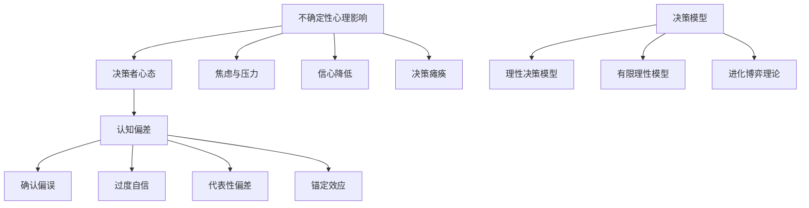
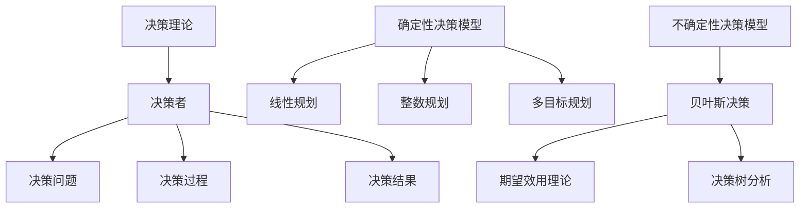
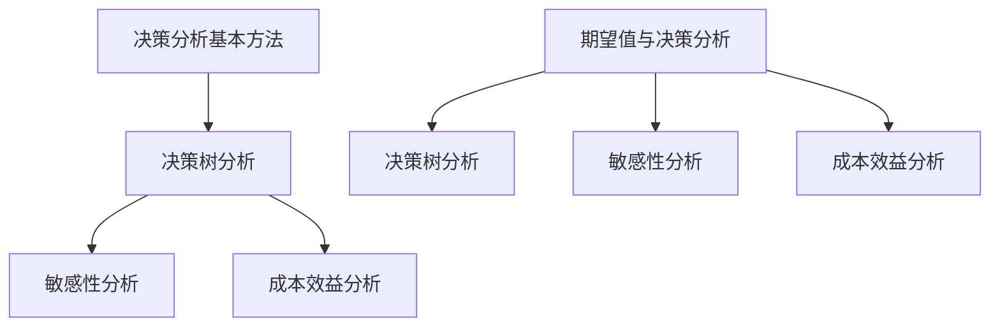
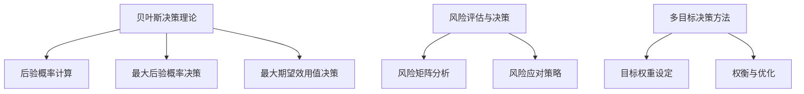
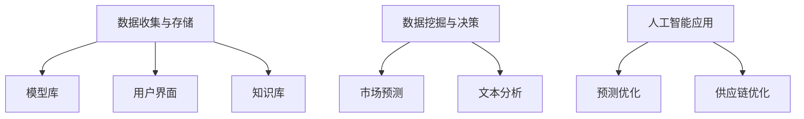

                 


# 决策技巧：在不确定性中把握方向

## 关键词
- 决策技巧，不确定性，决策心理学，决策理论，定量决策分析，定性决策方法

## 摘要
本文将探讨在充满不确定性的世界中如何有效地做出决策。我们将首先介绍决策心理学的核心概念，解析常见的认知偏差和不确定性对其影响。接着，我们将深入决策理论，从经典模型到现代方法，梳理出决策理论的框架。在此基础上，我们将介绍定量决策分析方法和定性决策方法，并通过Mermaid流程图展示各概念之间的关系。文章还将讨论复杂决策模型的原理和应用，介绍如何利用决策支持系统辅助决策。最后，我们将通过实际案例分析和项目实战，总结最佳实践，提出注意事项，并推荐拓展阅读。

## 引言

在当今这个充满复杂性和不确定性的世界，做出正确的决策变得比以往任何时候都更为重要。无论是企业战略决策、个人职业规划，还是日常生活中的选择，都需要我们具备良好的决策能力。然而，不确定性是决策过程中不可避免的因素，它可能来源于外部环境的变化，也可能源于内部信息的不完全或不对称。如何在不确定性中把握方向，做出明智的决策，是每个人都需要面对的挑战。

本文将分为三个主要部分。第一部分将介绍决策心理学，探讨人类在面对不确定性时的心理机制和常见的认知偏差。第二部分将深入决策理论，从传统到现代的决策方法，解析决策的核心概念和模型。第三部分将结合实际案例，展示如何应用决策技巧解决实际问题，并总结最佳实践和注意事项。

## 决策心理学

### 1.1 决策者的心态与认知偏差

决策心理学是研究个体在决策过程中心理机制和心理过程的学科。在面对不确定性时，人类决策者往往受到多种认知偏差的影响，这些偏差可能影响决策的质量。以下是一些常见的认知偏差：

- **确认偏误**：个体倾向于寻求和偏好那些与自己已有信念一致的信息，忽视与之相矛盾的数据。
- **过度自信**：个体对自己的知识和能力评估过高，低估不确定性。
- **代表性偏差**：个体倾向于根据事物的外观或特征来判断其概率，而非根据实际数据。
- **锚定效应**：个体在做决策时容易受到初始信息（锚点）的影响，即使这些信息与决策无关。

### 1.2 不确定性的心理影响

不确定性对人类决策产生深远影响。首先，它会导致焦虑和压力，从而影响决策者的心态。其次，不确定性会降低决策者的信心，使其倾向于采取保守的决策策略。此外，个体在面对不确定性时，可能会出现决策瘫痪，即因为害怕错误决策而迟迟无法做出决策。

### 1.3 决策模型的初步了解

为了更好地理解决策过程，我们可以借助一些经典的决策模型。以下是一些常见的决策模型：

- **理性决策模型**：个体在充分信息下，通过最大化期望效用值做出决策。
- **有限理性模型**：个体在信息不完全的情况下，利用启发式和简化策略做出决策。
- **进化博弈理论**：个体在重复博弈中，通过学习和适应逐步改进决策策略。

这些模型为我们提供了分析决策过程的理论框架，有助于我们理解人类在不确定性中的决策行为。

### Mermaid流程图：决策心理学概念架构



## 决策理论

### 2.1 决策理论的起源与发展

决策理论起源于20世纪中叶，由诺贝尔经济学奖得主Herbert Simon提出。Simon提出了“有限理性”概念，认为个体在决策过程中受限于认知资源，不可能达到完全理性。此后，决策理论不断发展，形成了多个分支，包括经济决策理论、行为决策理论等。

### 2.2 决策理论的核心概念

决策理论的核心概念包括：

- **决策者**：个体或组织，具有有限理性。
- **决策问题**：需要解决的问题，包括目标、约束和不确定性。
- **决策过程**：包括问题识别、方案生成、方案评估和决策选择。
- **决策结果**：选择的方案所带来的后果。

### 2.3 决策模型的分类与应用

决策模型可以根据其处理信息的方式分为：

- **确定性决策模型**：在完全信息下，通过数学优化方法求解。
- **不确定性决策模型**：在信息不完全或不确定的情况下，使用概率论和决策理论求解。

常见的决策模型包括：

- **线性规划**：在资源有限的情况下，最大化目标函数。
- **整数规划**：决策变量的取值为整数。
- **多目标规划**：同时考虑多个目标。
- **贝叶斯决策**：在不确定性下，利用概率理论进行决策。

### Mermaid流程图：决策理论框架



## 决策工具与方法

### 3.1 决策分析的基本方法

决策分析是决策过程中的重要环节，包括以下基本方法：

- **决策树分析**：通过图形化展示不同决策方案和其可能的结果，帮助决策者评估风险和收益。
- **敏感性分析**：分析决策结果对变量变化的敏感程度，帮助决策者识别关键变量。
- **成本效益分析**：比较不同决策方案的预期成本和效益，选择最优方案。

### 3.2 决策树分析法

决策树分析法是一种直观、易于理解的方法，通过树状图展示不同决策节点和结果。以下是一个简单的决策树分析法示例：

```mermaid
graph TD
    A[是否购买股票]
    B1[市场好]] --> C1[购买]
    B1 --> D1[不购买]
    B2[市场差]] --> C2[购买]
    B2 --> D2[不购买]
    A --> B1
    A --> B2
    C1 --> E1[盈利]
    C1 --> F1[亏损]
    C2 --> E2[盈利]
    C2 --> F2[亏损]
    D1 --> E3[盈利]
    D1 --> F3[亏损]
    D2 --> E4[盈利]
    D2 --> F4[亏损]
```

### 3.3 期望值与决策分析

在决策分析中，期望值是评估决策方案的重要指标。期望值是每个可能结果乘以其发生概率的总和。以下是一个使用期望值进行决策分析的示例：

```latex
期望值 = p1 \* r1 + p2 \* r2 + ... + pn \* rn
```

其中，\( p1, p2, ..., pn \) 是各个结果的概率，\( r1, r2, ..., rn \) 是各个结果的收益或成本。

### Mermaid流程图：决策工具与方法关系



## 复杂决策模型

### 4.1 贝叶斯决策理论

贝叶斯决策理论是一种在不确定性下进行决策的方法，基于贝叶斯定理计算后验概率，并利用最大后验概率或最大期望效用值选择最优决策方案。以下是一个使用贝叶斯决策理论进行分类的伪代码示例：

```python
def bayesian_classification(data, prior_probabilities, likelihoods, classes):
    posterior_probabilities = []
    for class in classes:
        posterior_probability = (prior_probabilities[class] * likelihoods[data])
        posterior_probabilities.append(posterior_probability)
    return max(posterior_probabilities)
```

### 4.2 风险评估与决策

风险评估是复杂决策中的重要环节，涉及识别、评估和管理风险。以下是一个使用风险矩阵进行风险评估的伪代码示例：

```python
def risk_evaluation(risk_matrix):
    total_risk = 0
    for risk in risk_matrix:
        total_risk += risk['probability'] * risk['impact']
    return total_risk
```

### 4.3 多目标决策方法

多目标决策方法考虑多个相互冲突的目标，通过权衡不同目标之间的优先级来选择最优方案。以下是一个使用多目标规划求解器的伪代码示例：

```python
def multiobjective_decisionMaking(objectives, constraints, weights):
    solution = multiobjective_solver(objectives, constraints, weights)
    return solution
```

### Mermaid流程图：复杂决策模型关系



## 决策支持系统

### 5.1 决策支持系统的构成

决策支持系统（DSS）是一种辅助决策者进行决策的计算机系统，通常包括以下组件：

- **数据收集与存储**：收集和存储与决策相关的数据。
- **模型库**：包含各种决策模型和算法。
- **用户界面**：提供用户与系统交互的界面。
- **知识库**：包含历史决策经验和专家知识。

### 5.2 数据挖掘与决策

数据挖掘技术在决策支持系统中扮演重要角色，通过分析大量数据，发现潜在的模式和趋势，辅助决策者做出更明智的决策。以下是一个使用数据挖掘进行市场预测的伪代码示例：

```python
def market_forecasting(data, model):
    trends = data_mining(data, model)
    predictions = model.predict(trends)
    return predictions
```

### 5.3 人工智能在决策支持中的应用

人工智能技术在决策支持系统中得到广泛应用，如机器学习算法用于预测和优化、自然语言处理用于文本分析等。以下是一个使用机器学习进行供应链优化的伪代码示例：

```python
def supply_chain_optimization(data, model):
    optimized_solution = model.optimize(data)
    return optimized_solution
```

### Mermaid流程图：决策支持系统组件与功能



## 决策实战案例分析

### 6.1 企业在不确定性中的战略决策

企业战略决策往往面临多种不确定性，如市场变化、技术进步、政策调整等。以下是一个企业战略决策的案例：

**背景**：某家科技公司在考虑是否投资一个新兴技术领域。

**决策分析**：
1. **市场调研**：分析新兴技术领域的市场规模、增长潜力、竞争态势。
2. **技术评估**：评估自身技术实力，分析技术壁垒和研发成本。
3. **风险评估**：识别潜在风险，如市场变化、政策不确定性、技术淘汰等。

**决策方案**：
1. **投资**：预计市场规模较大，技术前景较好，风险可控。
2. **观望**：市场不确定性较大，风险较高。

**决策结果**：公司最终决定投资，并在后续经营中通过持续监测和调整，成功应对了市场变化和技术进步带来的挑战。

### 6.2 个人职业生涯规划

在个人职业生涯规划中，决策者需要面对工作机会、职业发展、个人兴趣等多方面的不确定性。以下是一个个人职业生涯规划的案例：

**背景**：一名年轻的软件开发工程师面临职业选择。

**决策分析**：
1. **能力评估**：评估自身技术能力、职业兴趣和发展潜力。
2. **市场调研**：分析当前市场需求和未来职业发展趋势。
3. **风险评估**：考虑行业变化、个人健康等因素。

**决策方案**：
1. **技术专精**：选择一个技术方向，深耕细作。
2. **跨行业发展**：探索其他行业发展机会，如数据科学、产品管理等。

**决策结果**：工程师最终选择了技术专精，通过持续学习和实践，成为该领域的专家。

### 6.3 社会政策决策

社会政策决策涉及广泛的社会利益和复杂的变量，以下是一个社会政策决策的案例：

**背景**：政府考虑实施一项教育改革政策。

**决策分析**：
1. **需求分析**：了解社会对教育改革的需求和期望。
2. **成本效益分析**：评估教育改革的成本和预期效益。
3. **风险评估**：识别改革过程中可能面临的风险和挑战。

**决策方案**：
1. **全面改革**：实施全面的课程、教学方法和师资培训改革。
2. **试点改革**：在部分地区或学校进行试点，逐步推广。

**决策结果**：政府决定先进行试点改革，并根据试点结果逐步推广，确保改革顺利进行。

## 构建决策能力

### 7.1 决策能力评估

评估决策能力是提升决策能力的第一步。以下是一个简单的决策能力评估方法：

- **自我评估**：反思自己在过去决策中的表现，识别优点和不足。
- **第三方评估**：通过同事、上级或专业顾问进行评估。

### 7.2 提升决策能力的策略

提升决策能力需要系统性的训练和策略。以下是一些有效策略：

- **知识积累**：不断学习相关领域的知识，提高对决策问题的理解。
- **经验分享**：参与决策讨论，学习他人的决策思路和技巧。
- **模拟训练**：通过模拟真实决策场景，提高应对不确定性的能力。
- **持续反思**：对每次决策进行反思，总结经验和教训。

### 7.3 决策反思与持续学习

决策反思是提升决策能力的关键环节。以下是一个决策反思的步骤：

1. **回顾决策过程**：梳理决策的每个环节，分析决策过程中的问题。
2. **评估决策结果**：评估决策结果是否符合预期，分析成功和失败的原因。
3. **总结经验教训**：总结经验教训，形成可操作的建议和策略。
4. **持续改进**：将反思结果应用到未来的决策中，不断优化决策能力。

## 附录

### 附录A：决策技巧应用工具

- **常用决策工具**：如Excel、Python决策库（如Pandas、NumPy）、决策树分析软件（如TreeJack）等。
- **在线决策工具**：如Tableau、Google Analytics、Decisions.app等。
- **决策工具使用指南**：提供详细的工具使用教程和案例分析。

### 附录B：参考书目与资源

- **决策理论与研究经典**：如《决策分析》、《决策与决策者》等。
- **决策技巧实用书籍**：如《有效的决策：如何在不确定性中做出最佳选择》、《决策心理学》等。
- **决策支持系统与人工智能资源**：如《人工智能：一种现代方法》、《决策支持系统：设计与实现》等。

## 文章结语

在不确定性中做出明智的决策是一项挑战，但通过了解决策心理学、掌握决策理论、运用决策工具和方法，我们可以提高决策能力，更好地应对不确定性。本文通过理论讲解、案例分析以及实战应用，展示了如何在实际场景中应用决策技巧。希望读者能够通过学习和实践，提升自己的决策能力，在不确定的世界中把握方向，实现更好的成果。

### 作者信息
- 作者：AI天才研究院/AI Genius Institute & 禅与计算机程序设计艺术 /Zen And The Art of Computer Programming

### 文章结语

通过本文的探讨，我们深入了解了在不确定性中如何做出明智的决策。决策心理学揭示了人类在决策过程中的心理机制和认知偏差，决策理论为我们提供了分析决策过程的理论框架，决策工具与方法则帮助我们实际应用这些理论。通过案例分析，我们看到了决策技巧在实战中的应用效果。希望读者能够通过本文的学习，提升自己的决策能力，更好地应对不确定性，实现个人和组织的成功。

### 最佳实践 Tips

1. **持续学习**：决策能力并非一成不变，持续学习新的知识、技能和工具是提升决策能力的有效途径。
2. **实践反思**：通过模拟训练和实践，及时反思决策过程和结果，总结经验教训。
3. **团队合作**：借助团队的力量，共同面对决策难题，提高决策质量。
4. **信息收集**：全面收集和分析与决策相关的信息，确保决策基于充分的信息支持。

### 小结

本文从决策心理学、决策理论、决策工具与方法、复杂决策模型、决策支持系统以及实战案例分析等方面，全面探讨了在不确定性中把握决策方向的方法和技巧。通过系统性的学习和实践，我们可以提高决策能力，实现更好的决策效果。

### 注意事项

1. **避免认知偏差**：了解常见的认知偏差，如确认偏误、过度自信等，有助于我们做出更为客观的决策。
2. **权衡风险与收益**：在决策过程中，要充分考虑风险与收益的平衡，避免盲目追求高风险决策。
3. **持续更新知识**：随着环境的变化，及时更新知识和决策方法，确保决策的时效性和有效性。

### 拓展阅读

- **决策心理学经典著作**：《决策与决策者》、《决策心理学》
- **决策理论经典文献**：《决策分析》、《管理决策的实质》
- **决策工具与技术的最新进展**：《Python决策分析》、《大数据决策支持系统》
- **实际案例分析与策略研究**：《成功企业家的决策艺术》、《创业决策案例分析》

### 作者信息

作者：AI天才研究院/AI Genius Institute & 禅与计算机程序设计艺术 /Zen And The Art of Computer Programming

本文内容基于2023前的知识和资料，旨在为读者提供决策技巧的全面指导。随着技术的不断进步和决策环境的演变，决策理论和实践也在不断发展，建议读者持续关注相关领域的最新研究和发展动态。

