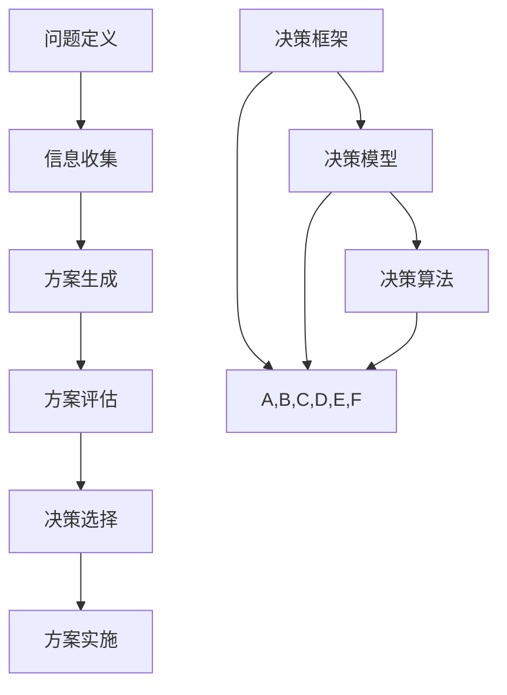

                 

## 决策科学：提高领导决策质量的方法

关键词：决策科学、领导决策质量、数据驱动、心理学因素、实施策略

摘要：本文将深入探讨决策科学的核心概念和方法，探讨如何通过科学的方法提高领导决策的质量。文章首先介绍了决策科学的基本背景和重要性，然后详细分析了决策过程中的关键因素，包括数据驱动、心理学因素以及实施策略。通过详细的案例分析、数学模型和算法讲解，本文旨在为读者提供实用的决策方法和策略，帮助领导者在复杂环境中做出更加明智和有效的决策。

## 引言

在当今快速变化和高度竞争的商业环境中，领导者的决策质量直接关系到组织的成功和生存。决策科学作为一门研究决策过程、方法和效果的学科，为领导者提供了科学的理论和方法，以帮助他们提高决策质量。本文旨在通过系统分析决策科学的核心概念、方法和实际应用，为领导者提供实用的决策框架和策略，以应对各种复杂和不确定的环境。

首先，本文将介绍决策科学的基本背景，包括其发展历程、主要理论和方法。接着，我们将探讨决策过程中涉及的关键因素，包括数据驱动的决策方法、心理学因素以及实施策略。为了更好地理解这些概念，本文将通过具体的案例研究和数学模型进行分析，展示决策科学在实际中的应用。

在文章的后半部分，我们将深入探讨如何通过数据分析和心理学方法来优化决策过程，提高决策的准确性和有效性。此外，本文还将介绍一些实施策略，帮助领导者将决策科学的方法应用到实际工作中，并克服常见的决策陷阱。

最后，本文将总结主要观点，提出一些建议和最佳实践，帮助领导者在实际决策中更好地运用决策科学的方法，提高决策质量。通过本文的阅读，读者将能够更加系统地理解和应用决策科学，为组织和个人带来显著的收益。

## 决策科学的基本概念

决策科学（Decision Science）是一门综合运用多种学科知识来研究决策过程、方法和效果的学科。它涉及经济学、心理学、统计学、计算机科学等多个领域，旨在通过科学的方法提高决策质量和效率。决策科学的核心概念包括决策框架、决策模型和决策算法。

### 决策框架

决策框架是决策科学的基础概念之一，它提供了一个结构化的决策过程，帮助决策者系统地分析和解决问题。一个典型的决策框架通常包括以下几个步骤：

1. **问题定义**：明确决策需要解决的问题或达到的目标。
2. **信息收集**：收集与决策相关的各种信息，包括数据、事实和意见。
3. **方案生成**：根据问题定义和信息收集，生成可能的解决方案。
4. **方案评估**：对每个方案进行评估，包括定量和定性的分析。
5. **决策选择**：基于评估结果选择最佳方案。
6. **方案实施**：实施选定的方案，并进行监控和调整。

这种结构化的决策框架有助于确保决策过程的系统性和科学性，避免因主观偏见和信息不足导致的错误决策。

### 决策模型

决策模型是决策科学中的重要工具，用于模拟和预测决策结果。常见的决策模型包括：

- **线性规划模型**：适用于优化资源分配和成本控制等问题。
- **多目标决策模型**：处理具有多个目标或约束的决策问题。
- **模拟模型**：通过模拟决策过程中的各种情况，预测决策结果。
- **博弈模型**：分析决策者在竞争环境中的行为和策略。

这些模型可以帮助决策者更好地理解问题，探索不同的解决方案，并预测决策的结果。

### 决策算法

决策算法是实现决策过程自动化的工具，通过算法可以处理大量数据，快速生成和评估方案。常见的决策算法包括：

- **决策树算法**：基于树形结构进行决策，通过一系列条件判断来选择最佳方案。
- **支持向量机（SVM）**：用于分类和回归问题，通过找到最优的超平面来分割数据。
- **人工神经网络（ANN）**：模仿人脑神经元连接方式，用于复杂的决策问题。

这些算法可以在大数据环境中快速处理和分析数据，提高决策的效率和准确性。

### 决策科学的发展历程

决策科学的发展可以追溯到20世纪中叶，当时经济学和运筹学的发展为决策研究提供了理论和方法基础。以下是一些重要的里程碑：

- 1950年代：线性规划和整数规划的发展，为优化问题提供了数学工具。
- 1960年代：多目标决策理论和博弈论的发展，丰富了决策模型的理论体系。
- 1970年代：计算机科学的进步，使得决策模型的实际应用成为可能。
- 1980年代：人工智能和机器学习技术的发展，为决策科学带来了新的工具和方法。
- 1990年代：大数据和云计算的兴起，使得决策科学的应用范围进一步扩大。

近年来，随着数据科学和人工智能的快速发展，决策科学在商业、医疗、金融等领域的应用不断拓展，成为推动组织和管理创新的重要力量。

### 决策科学的核心概念之间的关系架构

为了更好地理解决策科学的核心概念，我们可以使用Mermaid流程图来展示它们之间的关系。以下是决策科学核心概念之间的Mermaid流程图：

这个流程图展示了决策框架、决策模型和决策算法之间的相互作用。决策框架提供了一个结构化的决策过程，决策模型用于模拟和预测决策结果，而决策算法则用于自动化实现决策过程。通过这三个核心概念的综合运用，决策科学能够帮助领导者更科学、更高效地做出决策。

在下一节中，我们将深入探讨决策过程中涉及的关键因素，包括数据驱动、心理学因素以及实施策略。

## 数据驱动的决策方法

在当今信息爆炸的时代，数据已成为决策的重要驱动力。数据驱动的决策方法通过系统地收集、分析和利用数据，为决策者提供客观、准确的依据，从而提高决策的准确性和有效性。以下是数据驱动决策方法的基本原理、关键步骤和主要工具。

### 基本原理

数据驱动的决策方法基于以下基本原理：

1. **数据是决策的基础**：决策者需要依赖准确、全面的数据来理解问题，评估不同方案的效果。
2. **系统性分析**：通过系统地收集、整理和分析数据，识别问题、趋势和模式，为决策提供科学依据。
3. **量化评估**：使用量化的指标和方法来评估不同方案的效果，帮助决策者做出基于数据的决策。

### 关键步骤

数据驱动的决策方法通常包括以下关键步骤：

1. **问题定义**：明确决策需要解决的问题或目标，为数据收集和分析指明方向。
2. **数据收集**：从各种来源收集与决策相关的数据，包括内部数据（如企业内部报告、交易记录等）和外部数据（如市场调查、行业报告等）。
3. **数据预处理**：清洗和整理收集到的数据，包括数据清洗、缺失值处理、异常值检测等，确保数据质量。
4. **数据分析**：使用统计学和数据分析方法对预处理后的数据进行分析，包括描述性统计分析、相关性分析、回归分析等，以识别问题和趋势。
5. **方案生成**：基于数据分析结果，生成可能的解决方案。
6. **方案评估**：使用量化指标（如预期收益、风险等）对每个方案进行评估，选择最佳方案。
7. **决策选择**：基于评估结果，选择最佳方案进行实施。

### 主要工具

数据驱动的决策方法依赖于多种工具和技术，以下是其中几种主要工具：

1. **数据分析软件**：如Excel、R、Python等，用于数据清洗、整理和分析。
2. **统计软件**：如SPSS、SAS等，用于复杂的统计分析。
3. **数据挖掘工具**：如Weka、RapidMiner等，用于数据挖掘和模式识别。
4. **机器学习算法**：如决策树、支持向量机、神经网络等，用于预测和分类。
5. **大数据平台**：如Hadoop、Spark等，用于处理和分析大规模数据。

### 数据驱动的决策方法在实际中的应用

数据驱动的决策方法在商业、金融、医疗等领域得到了广泛应用。以下是几个实际应用的例子：

1. **市场营销**：通过数据分析了解客户行为、偏好和市场趋势，优化市场营销策略，提高市场占有率。
2. **风险管理**：通过数据分析识别潜在风险，制定风险控制策略，降低企业风险。
3. **医疗决策**：通过数据分析帮助医生诊断疾病、制定治疗方案，提高医疗效果。
4. **供应链管理**：通过数据分析优化供应链流程，降低成本、提高效率。

### 数据驱动决策方法的优点和局限性

数据驱动决策方法的优点包括：

- **客观性**：基于数据的事实和证据，减少主观偏见。
- **准确性**：通过定量分析和模型预测，提高决策的准确性。
- **效率**：快速处理大量数据，提高决策效率。

然而，数据驱动决策方法也存在一定的局限性：

- **数据质量**：数据质量直接影响决策效果，数据不准确或缺失可能导致错误决策。
- **复杂性**：数据分析过程复杂，需要专业的技术和知识。
- **数据依赖性**：过度依赖数据可能导致忽视其他重要因素，如人际关系和心理因素。

在下一节中，我们将探讨心理学因素如何影响决策过程，并讨论如何通过心理学方法优化决策质量。

## 心理学因素对决策过程的影响

心理学因素在决策过程中起着至关重要的作用，它们可以显著影响决策的质量和效果。理解这些因素有助于领导者更好地应对复杂决策，避免常见的心理陷阱，从而提高决策的科学性和有效性。

### 情绪对决策的影响

情绪是影响决策的重要因素之一。积极情绪可以提高决策的创造性和灵活性，而消极情绪则可能导致决策过度谨慎或过度冒险。研究表明，情绪可以通过以下几种方式影响决策：

1. **决策速度**：情绪状态可以显著影响决策速度。积极情绪通常使决策者更加快速和果断，而消极情绪可能导致决策者犹豫不决。
2. **决策质量**：情绪可以影响对信息的处理和解释。积极情绪使决策者更加乐观和自信，可能忽视潜在风险，而消极情绪则使决策者过于担忧，可能低估机会。
3. **风险偏好**：情绪状态会影响风险偏好。积极情绪可能导致过度乐观和冒险，而消极情绪可能导致过度保守和规避风险。

### 偏见对决策的影响

偏见是决策中常见的心理现象，它们可以扭曲决策者的判断和评估，导致不理性的决策。以下是一些常见的决策偏见：

1. **确认偏见**：决策者在评估信息时，倾向于选择支持已有观点的证据，忽视相反的证据。
2. **代表性偏见**：决策者根据事物的表面特征或经验来判断其概率，而忽视实际概率。
3. **锚定效应**：决策者依赖初始信息（锚点）来评估其他信息，即使这些信息不相关或已过时。
4. **过度自信**：决策者对自己的判断和决策过于自信，忽视不确定性和潜在风险。

### 决策疲劳对决策的影响

决策疲劳是指决策者在长时间或高强度的决策过程中，决策质量逐渐下降的现象。决策疲劳可以通过以下几种方式影响决策：

1. **注意力分散**：长时间决策导致注意力分散，决策者可能忽视重要信息，增加决策错误的风险。
2. **决策过度依赖规则**：决策疲劳可能导致决策者过度依赖既定规则和标准，减少创造性思考和灵活应对。
3. **反应迟钝**：长时间决策使决策者反应迟钝，可能无法及时应对新的变化和挑战。

### 应对策略

为了克服这些心理学因素的影响，领导者可以采取以下策略：

1. **情绪管理**：领导者应学会识别和管理自己的情绪，避免情绪对决策过程的负面影响。例如，可以通过冥想、呼吸练习等方式来缓解压力和焦虑。
2. **避免偏见**：领导者应意识到自己的偏见，并采取批判性思维方法来评估信息，避免盲目接受或忽视证据。
3. **多样化团队**：通过组建多元化的团队，可以减少单一视角的偏见，增加决策的全面性和客观性。
4. **定期休息和调整**：领导者应确保在长时间决策后得到充分的休息和调整，以恢复精力和决策能力。
5. **使用决策支持工具**：借助数据分析和决策支持工具，可以帮助领导者更客观地评估信息和方案，减少人为偏见的影响。

通过理解心理学因素对决策过程的影响，并采取相应的应对策略，领导者可以更好地应对复杂决策，提高决策的科学性和有效性。

在下一节中，我们将探讨如何通过有效的实施策略，将决策科学的方法应用到实际工作中，确保决策的有效执行。

## 实施策略：确保决策的有效执行

决策的科学制定只是成功的第一步，确保决策能够有效执行是领导者面临的更大挑战。有效的实施策略不仅能够提高决策的执行效率，还能增强团队对决策的认同感和执行力。以下是一些关键的实施策略：

### 明确目标和责任

在决策执行过程中，明确目标和责任是至关重要的。领导者需要确保每个团队成员都清楚了解决策的目标和自己的具体职责。以下是一些具体步骤：

1. **制定详细的执行计划**：将决策目标分解为具体的任务和目标，为每个任务分配负责人和时间表。
2. **明确沟通渠道**：确保团队成员之间有畅通的沟通渠道，及时分享信息，确保每个人都了解任务的进展。
3. **建立责任制度**：明确每个成员的责任和权限，确保决策执行过程中的责任清晰，避免推诿和责任不明确。

### 强化团队协作

有效的决策执行需要团队成员之间的紧密协作。以下是一些促进团队协作的策略：

1. **建立共同目标**：确保团队成员共同认同决策的目标和意义，增强团队的凝聚力。
2. **定期团队会议**：通过定期团队会议，讨论决策执行的进展和问题，确保团队成员之间的沟通和协调。
3. **激励和认可**：对在决策执行过程中表现优秀的团队成员进行激励和认可，提高团队的积极性和执行力。

### 监控和反馈

有效的决策执行需要一个持续的监控和反馈机制，以评估执行效果并及时进行调整。以下是一些监控和反馈的策略：

1. **设立关键绩效指标（KPI）**：根据决策目标和任务，设立具体的关键绩效指标，用于评估决策执行的进展和效果。
2. **定期进度报告**：要求团队成员定期提交进度报告，确保领导者能够及时掌握决策执行的进展。
3. **及时反馈**：根据监控结果，及时提供反馈，对成功的部分给予肯定，对存在的问题进行讨论和改进。

### 灵活调整

在决策执行过程中，领导者需要保持灵活，能够根据实际情况及时调整决策。以下是一些灵活调整的策略：

1. **建立应急响应机制**：面对突发事件或不确定性，建立应急响应机制，确保能够迅速做出反应。
2. **鼓励创新和改进**：鼓励团队成员提出创新和改进的建议，不断优化决策执行过程。
3. **持续学习和改进**：通过持续的学习和改进，不断提高决策执行的效率和效果。

### 实战案例：某公司的决策实施策略

以某公司的产品发布决策为例，公司决定发布一款新的智能设备。以下是该公司的决策实施策略：

1. **明确目标和责任**：公司明确了新产品发布的目标和市场预期，为每个团队成员分配了具体的任务和时间表，确保每个人都清楚自己的职责。

2. **强化团队协作**：公司通过定期团队会议和协作工具，确保团队成员之间的沟通和协调，共同推进新产品发布。

3. **监控和反馈**：公司设立了关键绩效指标，包括产品开发进度、市场反馈和销售目标，定期报告进度，并根据反馈进行调整。

4. **灵活调整**：在产品开发过程中，公司根据市场反馈和开发过程中的问题，及时调整开发计划和市场策略，确保新产品能够按时发布。

通过这些实施策略，该公司成功地按时发布了新产品，并获得了良好的市场反响。

总结来说，通过明确目标和责任、强化团队协作、监控和反馈以及灵活调整，领导者可以确保决策的有效执行，从而实现组织的战略目标。在下一节中，我们将总结全文，并给出一些建议和最佳实践，帮助领导者在实际决策中更好地运用决策科学的方法。

## 总结与建议

本文通过系统分析决策科学的核心概念、方法及其在实际中的应用，探讨了如何提高领导决策的质量。以下是我们总结的主要观点和一些建议：

### 主要观点

1. **决策科学的核心概念**：决策框架、决策模型和决策算法是决策科学的重要组成部分，它们共同构建了一个科学、系统的决策过程。
2. **数据驱动决策方法**：通过数据收集、分析和利用，领导者可以做出更准确、更有效的决策。
3. **心理学因素对决策的影响**：情绪、偏见和决策疲劳等心理学因素会影响决策的质量和效果，领导者需要采取策略来应对这些影响。
4. **实施策略**：通过明确目标和责任、强化团队协作、监控和反馈以及灵活调整，领导者可以确保决策的有效执行。

### 建议与最佳实践

1. **培养数据素养**：领导者应提高自身的数据素养，学会利用数据分析工具和方法，从数据中发现问题和机会。
2. **建立数据驱动文化**：在企业内部推广数据驱动的决策方法，鼓励员工基于数据和事实进行决策。
3. **定期进行心理素质培训**：通过心理培训，提高领导者的情绪管理和应对偏见的能力，减少心理因素对决策的负面影响。
4. **建立有效的决策支持系统**：借助现代信息技术，建立决策支持系统，提高决策的效率和准确性。
5. **鼓励创新和改进**：鼓励团队成员提出创新和改进的建议，持续优化决策过程和策略。

### 注意事项

1. **避免过度依赖数据**：数据驱动决策并不意味着完全依赖数据，领导者应结合经验和直觉，做出全面、综合的决策。
2. **保持灵活性**：决策过程中应保持灵活性，能够根据实际情况及时调整策略。
3. **关注团队协作**：决策过程不仅是领导者的个人行为，还需要整个团队的协作和支持，确保决策能够有效执行。

### 拓展阅读

1. **《决策分析》（Decision Analysis）**：介绍了决策分析的基本概念和方法，有助于深入理解决策科学的理论和实践。
2. **《行为决策理论》（Prospect Theory）**：探讨了心理学因素如何影响决策，为领导者提供了应对心理偏见的方法。
3. **《敏捷领导力》（Agile Leadership）**：讨论了在快速变化的环境中，领导者如何通过敏捷方法提高决策质量和执行效率。

通过本文的阅读，读者应能够更加系统地理解和应用决策科学的方法，提高领导决策的质量，为组织和个人带来显著的收益。

### 作者信息

作者：AI天才研究院/AI Genius Institute & 禅与计算机程序设计艺术/Zen And The Art of Computer Programming

