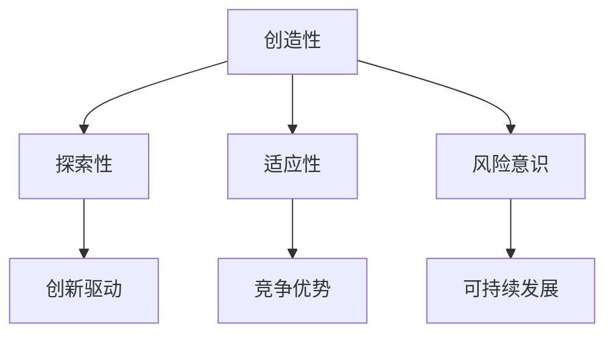

                 

### 引言：创业型思维概述

在当今快速发展的商业环境中，创新已成为企业成功的关键因素之一。创业型思维作为一种创新的思维方式，它强调的是在不确定和多变的市场环境中，企业如何通过创新来应对挑战、抓住机遇。本文将围绕创业型思维的概念、特点、重要性以及其培养策略进行深入探讨。

#### 创业型思维的定义与特点

创业型思维，即是一种面向未来的创新性思考方式，它不仅关注现有问题的解决，更注重创造新的商业机会和价值。以下是创业型思维的一些主要特点：

1. **创造性**：创业型思维鼓励突破传统思维框架，提出新颖的想法和解决方案。
2. **探索性**：它强调不断尝试和实验，以发现新的商业机会。
3. **适应性**：面对变化和不确定性，创业型思维强调快速适应并调整策略。
4. **风险意识**：创业型思维认识到创新过程中不可避免地会遇到风险，因此具备一定的风险管理能力。

#### 创业型思维的重要性

在企业管理中，创业型思维的重要性体现在以下几个方面：

1. **创新驱动**：创业型思维可以激发员工的创造力，推动企业的持续创新。
2. **竞争优势**：通过不断创新，企业可以形成独特的竞争优势，赢得市场份额。
3. **可持续发展**：在快速变化的市场环境中，创业型思维有助于企业实现可持续发展。

对于个人职业发展而言，创业型思维同样具有重要意义。它不仅可以帮助个人在面对职场挑战时更加灵活应对，还能提升个人的创新能力和职业竞争力。

#### 创业型思维的核心概念与联系

为了更好地理解创业型思维，我们需要了解其核心概念之间的关系。以下是创业型思维的核心概念及其关系架构的 Mermaid 流程图：

通过这个流程图，我们可以看到创造性、探索性、适应性和风险意识是创业型思维的四个核心组成部分，它们相互联系，共同驱动着创新驱动的实现，最终带来竞争优势和可持续发展。

在下一部分中，我们将详细探讨创业型思维的培养策略，包括系统思维、持续学习、适应变化等方面的具体方法和实践。

### 背景介绍

创业型思维的概念并非空穴来风，其根源可以追溯到20世纪中叶的硅谷创新模式。当时的硅谷，以斯坦福大学为依托，吸引了一批科技创业者，他们在创新的过程中逐渐形成了一套独特的思维方式。这种思维方式强调快速迭代、试验和反馈，从而不断优化产品和服务。随着时间的推移，这种创业型思维在全球范围内得到了广泛的认可和应用。

在企业中，创业型思维的应用范围广泛，从产品开发到市场战略，从内部管理到员工激励，都体现了创业型思维的核心特点。例如，苹果公司通过持续的创新，不断推出具有革命性的产品，从而在激烈的市场竞争中立于不败之地。同样，谷歌公司通过鼓励员工自由探索和尝试，建立了一个充满创新活力的企业文化，从而在互联网领域取得了巨大的成功。

个人职业发展方面，创业型思维同样具有重要意义。在快速变化的职场环境中，具备创业型思维的人能够更快地适应新环境，抓住机遇，从而实现职业生涯的快速发展。例如，一些创业者通过创业实现了财务自由和职业成就感，而一些职业人士则通过在现有企业中运用创业型思维，提升了自身的职业竞争力。

总的来说，创业型思维已经成为现代企业和个人发展的关键因素。通过理解创业型思维的核心概念和联系，我们可以更好地培养和运用这种思维方式，从而在竞争激烈的环境中脱颖而出。

### 核心概念与联系

为了更深入地理解创业型思维，我们需要探讨其核心概念及其相互之间的联系。以下是创业型思维的几个关键概念及其关系架构的详细解释。

#### 创造性

创造性是创业型思维的核心要素之一。它指的是在面临问题和挑战时，能够提出新颖、独特的解决方案。创造性不仅要求个体具备丰富的知识储备，还需要他们具备开放的思维和跨领域的思考能力。在创业过程中，创造性能够帮助创业者发现新的市场机会，设计出满足用户需求的产品。

#### 探索性

探索性则强调在未知领域中进行尝试和探索。与创造性相比，探索性更注重实践和行动。创业型思维中的探索性意味着创业者愿意承担风险，不断尝试新的想法和方案。通过探索，创业者可以积累宝贵的经验，为后续的创新提供依据。

#### 适应性

适应性是指在面对变化和不确定性时，能够迅速调整策略和行动的能力。创业型思维强调企业需要具备高度的灵活性，以适应市场的快速变化。适应性不仅包括对市场环境的反应，还涉及到企业内部组织结构的调整和管理方式的变革。

#### 风险意识

风险意识是创业型思维中的重要组成部分。它要求创业者对可能面临的风险有清晰的认识，并具备有效的风险管理能力。在创业过程中，风险无处不在，但具备风险意识可以帮助创业者更好地应对风险，从而提高成功的可能性。

这些核心概念之间存在着密切的联系。创造性和探索性共同驱动了创新的过程，而适应性则确保了创新能够在实际环境中得以实施。风险意识则为创新提供了必要的保障，使创业者在面对不确定性时能够保持冷静和理性。

为了更好地理解这些概念之间的关系，我们可以使用Mermaid流程图进行展示：

通过这个流程图，我们可以清晰地看到，创造性、探索性、适应性和风险意识共同构成了创业型思维的核心框架。它们相互联系，共同作用于创新驱动、竞争优势和可持续发展。

总的来说，理解创业型思维的核心概念及其相互之间的联系，对于企业在快速变化的商业环境中保持竞争力至关重要。通过培养和运用这些核心概念，企业可以更好地应对挑战，抓住机遇，实现持续创新和成长。

### 创业型思维的培养策略

培养创业型思维并非一朝一夕之事，它需要系统的思维模式、持续的学习和实践。以下我们将详细探讨创业型思维的培养策略，包括系统思维、持续学习、适应变化等方面。

#### 系统思维

系统思维是创业型思维的重要组成部分。它强调从整体和长远的角度看待问题，而非仅仅关注局部或短期的利益。系统思维可以帮助创业者更好地理解复杂问题，发现潜在的机会和风险。

**培养系统思维的方法**：

1. **多角度分析**：在解决问题时，要从不同的角度进行思考，分析问题的各个方面和影响。
2. **长远规划**：不仅要考虑当前的问题，还要考虑未来的发展，制定长期战略规划。
3. **跨领域思考**：跨越不同领域的知识和经验，从其他行业或领域寻找创新的灵感。

**实际案例**：

比如，在互联网公司的产品开发中，系统思维可以帮助团队从用户需求、技术可行性、市场前景等多个角度进行综合分析，从而设计出更加完善的产品。

#### 持续学习

持续学习是创业型思维的另一个关键要素。在快速变化的商业环境中，知识更新速度极快，创业者需要不断学习新知识、新技能，以保持竞争力。

**持续学习的方法**：

1. **在线课程和研讨会**：参加线上课程和研讨会，获取最新的行业知识。
2. **阅读和研究**：定期阅读行业研究报告、技术博客和学术论文，了解行业动态。
3. **实践和反思**：将所学知识应用于实际工作中，通过实践和反思不断优化自己的能力。

**实际案例**：

例如，一家创业公司通过定期组织内部培训和外部研讨会，鼓励员工不断学习新技能，从而在激烈的市场竞争中保持了技术领先地位。

#### 适应变化

适应变化是创业型思维中不可或缺的一部分。商业环境的变化速度越来越快，创业者需要具备快速适应变化的能力，以应对不确定性。

**适应变化的方法**：

1. **敏捷管理**：采用敏捷开发方法，快速响应市场变化，不断迭代产品。
2. **风险评估**：定期进行风险评估，提前识别潜在的风险，并制定应对策略。
3. **灵活策略**：制定灵活的策略，以便在市场变化时迅速调整方向。

**实际案例**：

一家初创公司通过采用敏捷开发方法，能够快速响应市场需求，推出一系列符合用户需求的产品，从而在竞争激烈的市场中取得了成功。

#### 实践应用

结合以上培养策略，创业者可以在实际工作中运用这些方法。例如，在项目策划阶段，采用系统思维进行全方位分析；在项目执行过程中，持续学习和适应变化，确保项目的成功。

总之，创业型思维的培养需要系统的思维模式、持续的学习和实践。通过不断优化这些策略，创业者可以更好地应对挑战，抓住机遇，实现企业的持续创新和发展。

### 创业型思维在企业管理中的应用

创业型思维在企业中的成功应用，不仅取决于思维模式的培养，还需要在实际管理过程中有效实施。以下是创业型思维在企业管理中的几个关键应用方面，包括企业战略、创新驱动、流程设计和风险管理等。

#### 创业型思维与企业战略

企业战略是企业长远发展的蓝图，而创业型思维在这一过程中发挥着至关重要的作用。创业型思维强调灵活性和创新，有助于企业在复杂多变的市场环境中制定更加适应实际需求的战略。

**具体应用方法**：

1. **战略规划**：采用系统思维，从多角度分析市场趋势、竞争对手和自身优势，制定全面而灵活的战略规划。
2. **情景规划**：通过模拟不同市场情景，提前预判可能出现的变化，制定多种应对策略。
3. **创新驱动**：将创新视为战略的核心，鼓励员工提出创新性建议，并将其融入企业战略中。

**实际案例**：

例如，一家传统制造企业通过引入创业型思维，制定了以数字化和智能化为核心的转型战略。他们投资于智能制造技术，并建立了创新实验室，鼓励员工进行创新项目研发。通过这一系列措施，企业成功实现了业务模式的转型，提升了市场竞争力。

#### 创业型思维与创新驱动

创新驱动是企业发展的动力源泉，创业型思维在这一过程中起到了关键作用。通过鼓励创新，企业可以不断推出新产品和服务，满足市场需求，实现持续增长。

**具体应用方法**：

1. **创新文化**：建立鼓励创新的企业文化，营造自由探索和实验的环境。
2. **创新激励**：制定创新激励机制，奖励员工提出和实现创新项目。
3. **跨部门合作**：打破部门壁垒，促进跨部门协作，共同推动创新项目的实施。

**实际案例**：

谷歌公司通过鼓励员工自由探索和尝试，建立了创新驱动的企业文化。员工可以自由选择项目，进行创新实验。这种文化氛围使得谷歌在人工智能、云计算等领域取得了巨大成功，成为了全球科技领域的领导者。

#### 创业型思维与流程设计

流程设计是企业运营的关键环节，创业型思维有助于企业在流程设计过程中不断优化和改进，提高运营效率。

**具体应用方法**：

1. **流程分析**：采用系统思维，全面分析现有流程的各个环节，识别优化点。
2. **敏捷管理**：采用敏捷开发方法，快速响应变化，持续改进流程。
3. **自动化**：引入自动化工具，减少重复性工作，提高流程效率。

**实际案例**：

某大型零售企业通过引入创业型思维，对供应链流程进行优化。他们采用自动化技术，实现了订单处理和库存管理的自动化，大幅提高了运营效率，降低了成本。

#### 创业型思维与风险管理

风险管理是企业管理中的重要一环，创业型思维在这一过程中有助于企业更好地应对风险，保障业务的稳健发展。

**具体应用方法**：

1. **风险评估**：定期进行风险评估，识别潜在的风险点，制定相应的应对措施。
2. **风险监控**：建立风险监控机制，实时跟踪风险的变化情况，及时调整策略。
3. **应急预案**：制定应急预案，确保在风险发生时能够迅速响应和应对。

**实际案例**：

一家初创公司在开发新产品时，通过采用创业型思维，对潜在风险进行了全面评估。他们制定了详细的应急预案，并在风险发生时迅速采取行动，有效避免了可能的损失。

总之，创业型思维在企业管理中的应用，通过战略规划、创新驱动、流程设计和风险管理等方面的具体实践，可以帮助企业更好地应对市场变化，实现持续创新和稳健发展。通过不断优化这些管理实践，企业可以在竞争激烈的环境中脱颖而出，实现长期成功。

### 国内创业型企业案例分析

在中国这片充满活力和创新氛围的土地上，涌现出了一批优秀的创业型企业，它们凭借独特的创业型思维和坚持不懈的努力，取得了显著的成就。以下是几则国内创业型企业的案例分析，以展示创业型思维在现实中的应用和成功经验。

#### 案例一：字节跳动（ByteDance）

**企业背景**：字节跳动成立于2012年，是一家专注于移动互联网的公司。其产品包括抖音（TikTok）、今日头条等。字节跳动在短短几年内迅速崛起，成为全球领先的科技公司之一。

**创业型思维的体现**：

1. **创新驱动**：字节跳动以用户需求为导向，不断推出新产品和服务。例如，抖音的成功就是基于对年轻用户娱乐需求的精准把握。

2. **敏捷开发**：字节跳动采用敏捷开发方法，快速迭代产品，迅速响应用户反馈。这种模式使得他们能够在竞争激烈的市场中迅速占领市场。

3. **多元化探索**：字节跳动不仅专注于内容平台，还涉足人工智能、电商等多个领域，展示了其多元化发展的战略眼光。

**成功经验**：字节跳动的成功在于其持续的创新能力、快速的市场反应能力和对用户需求的精准把握。通过不断推出符合市场需求的新产品，字节跳动成功在多个领域建立了强大的竞争优势。

#### 案例二：小米（Xiaomi）

**企业背景**：小米成立于2010年，是一家全球领先的智能手机和家电品牌。小米以“互联网+新零售”模式著称，通过线上渠道和粉丝经济迅速崛起。

**创业型思维的体现**：

1. **用户导向**：小米始终坚持用户至上的原则，通过用户反馈不断优化产品和服务。

2. **快速迭代**：小米采用快速迭代策略，产品更新周期短，能够快速响应市场变化。

3. **跨界合作**：小米不仅涉足智能手机领域，还扩展到智能家居、生活消费品等多个领域，实现了多元化发展。

**成功经验**：小米的成功在于其对用户需求的深刻理解、敏捷的市场反应能力和跨界合作策略。通过构建高效的供应链和用户互动平台，小米在短时间内建立了强大的品牌影响力。

#### 案例三：美团（Meituan）

**企业背景**：美团成立于2010年，是一家提供生活服务电商平台的科技公司。美团通过提供团购、外卖、酒店预订等多种服务，已经成为中国生活服务领域的领军企业。

**创业型思维的体现**：

1. **整合资源**：美团通过整合线上线下资源，构建了一个庞大的服务生态系统。

2. **数据驱动**：美团利用大数据分析用户行为，优化服务体验，提升运营效率。

3. **多元化扩张**：美团不仅提供本地生活服务，还通过收购和投资，迅速拓展业务范围。

**成功经验**：美团的成功在于其资源整合能力、数据驱动和多元化扩张策略。通过构建高效的生态系统和利用数据优势，美团成功在激烈的市场竞争中脱颖而出。

总之，这些国内创业型企业的成功案例展示了创业型思维在现实中的应用和威力。通过不断创新、快速迭代和精准市场定位，这些企业不仅取得了商业上的成功，也为其他企业提供了宝贵的经验和启示。

### 国外创业型企业案例分析

在全球范围内，创业型企业同样以其独特的创业型思维在各自领域中取得了显著成就。以下是几则国外创业型企业的案例分析，以展示创业型思维在不同市场环境中的应用和成功经验。

#### 案例一：Airbnb

**企业背景**：Airbnb成立于2008年，总部位于美国加利福尼亚州旧金山，是一家全球领先的共享住宿平台。它通过连接房主和旅客，使得全球各地的家庭和房间成为旅游住宿选择的一部分。

**创业型思维的体现**：

1. **用户至上**：Airbnb始终以用户需求为核心，通过平台反馈不断优化用户体验，提供更加个性化和多样化的住宿选择。

2. **平台模式**：Airbnb采用平台模式，将房东和旅客连接起来，实现了资源的高效利用。

3. **跨界合作**：Airbnb不仅与旅游公司、航空公司等传统行业合作，还涉足房地产、金融等多个领域，展示了其跨界发展的能力。

**成功经验**：Airbnb的成功在于其对用户需求的深刻理解、平台模式的创新和跨界合作策略。通过构建强大的用户社区和多元化的业务生态系统，Airbnb在共享住宿市场中占据了领先地位。

#### 案例二：Uber

**企业背景**：Uber成立于2009年，总部位于美国加利福尼亚州旧金山，是一家全球领先的移动出行平台。它通过提供实时打车服务，改变了人们的出行方式。

**创业型思维的体现**：

1. **技术创新**：Uber通过引入大数据、机器学习等技术，优化了乘客匹配和司机调度，提高了服务效率。

2. **快速扩张**：Uber采用快速扩展策略，迅速在全球范围内建立了庞大的服务网络。

3. **风险管理**：Uber在快速发展过程中，通过建立完善的风险管理和合规体系，确保了业务的稳定和可持续发展。

**成功经验**：Uber的成功在于其技术创新、快速扩展和风险管理策略。通过不断优化技术和提升服务质量，Uber在移动出行市场中取得了巨大成功。

#### 案例三：Spotify

**企业背景**：Spotify成立于2006年，总部位于瑞典斯德哥尔摩，是一家全球领先的流媒体音乐服务平台。它通过提供海量音乐内容和个性化推荐，改变了音乐消费模式。

**创业型思维的体现**：

1. **数据驱动**：Spotify利用大数据和人工智能技术，分析用户行为，提供个性化的音乐推荐。

2. **订阅模式**：Spotify采用订阅模式，提供免费和付费服务，实现了收入来源的多样化。

3. **国际化**：Spotify在全球范围内扩展，提供了多语言和本地化服务，满足了不同地区用户的需求。

**成功经验**：Spotify的成功在于其数据驱动、订阅模式和国际化策略。通过不断优化技术和提升用户体验，Spotify在音乐流媒体市场中占据了主导地位。

总之，这些国外创业型企业的成功案例展示了创业型思维在不同市场环境中的广泛应用和成功经验。通过不断创新、优化服务和拓展市场，这些企业不仅取得了商业上的成功，也为其他企业提供了宝贵的经验和启示。

### 创业型思维的启示与建议

通过前面的案例分析，我们可以看到，创业型思维在不同企业中的应用都取得了显著的成果。这些成功经验为我们提供了宝贵的启示，也为企业如何在现实中培养创业型思维提出了具体建议。

#### 对企业发展的启示

1. **构建创新文化**：企业需要建立一个鼓励创新、容忍失败的文化氛围，让员工敢于尝试新的想法和解决方案。

2. **加强团队协作**：跨部门合作和团队协作是创业型思维的重要体现。企业应鼓励不同部门之间的沟通与协作，共同推动创新项目。

3. **投资于研发**：持续的研发投入是保持竞争优势的关键。企业应加大研发投入，培养创新团队，不断推出新产品和服务。

4. **关注用户需求**：用户需求是企业创新的出发点和归宿。企业应通过用户反馈和市场调研，了解用户需求，快速响应市场变化。

#### 对个人发展的启示

1. **终身学习**：在快速变化的商业环境中，个人需要不断学习新知识、新技能，以保持竞争力。

2. **勇于担当**：创业型思维要求个人勇于承担责任，敢于面对挑战和风险。

3. **持续创新**：个人应保持创新意识，不断提出新的想法和解决方案，提升自己的创新能力。

4. **适应变化**：面对不确定性和变化，个人需要具备快速适应和调整能力，以应对新的挑战。

#### 创业型思维的实际应用

在实际应用中，企业和个人可以采取以下策略来培养和运用创业型思维：

1. **内部创业**：企业可以设立内部创业平台，鼓励员工提出创新项目，并提供资源和支持。

2. **开放式创新**：企业可以与外部合作伙伴进行开放式创新，共享资源和知识，共同推动创新项目的实施。

3. **创新竞赛**：企业可以定期举办创新竞赛，激发员工的创新潜力，奖励优秀创新项目。

4. **定制化培训**：根据员工的需求和职业发展目标，企业提供定制化的培训课程，提升员工的创新能力和业务技能。

总之，创业型思维不仅为企业发展提供了强大的动力，也为个人职业发展带来了无限可能。通过构建创新文化、加强团队协作、投资于研发、关注用户需求，企业可以不断提升创新能力，实现持续发展。同时，个人通过终身学习、勇于担当、持续创新和适应变化，可以在竞争激烈的职场中脱颖而出，实现职业目标。

### 创业型思维的实际应用

在实际工作中，创业型思维的应用能够极大地提升企业的创新能力和竞争力。以下我们将通过一个具体的创业项目来展示如何在实际工作中运用创业型思维，从项目策划、执行到成果分析，全面解析创业型思维的应用。

#### 项目背景

假设一家互联网初创公司计划开发一款智能家居控制平台，旨在通过互联网和物联网技术，实现家庭设备的智能控制，提升用户生活质量。

#### 项目策划

1. **用户需求分析**：首先，项目团队进行了用户需求分析。通过问卷调查、用户访谈和市场研究，团队发现用户对智能家居的需求主要集中在便捷控制、安全性和节能性。

2. **市场调研**：团队进行了市场调研，分析了当前智能家居市场的竞争格局，发现了市场上的空白点和潜在机会。

3. **项目定义**：基于用户需求和市场调研结果，团队明确了项目的目标：开发一款功能全面、操作简便、安全可靠的智能家居控制平台。

#### 项目执行

1. **团队组建**：项目团队由产品经理、UI/UX设计师、后端开发工程师、前端开发工程师和测试工程师组成。团队成员各自发挥专业优势，共同推动项目进展。

2. **快速迭代**：项目采用敏捷开发方法，通过快速迭代不断优化产品。每个迭代周期为两周，团队在每个周期末收集用户反馈，进行调整和改进。

3. **技术创新**：项目团队在开发过程中引入了多种新技术，如物联网通信协议（如MQTT）、云计算平台和人工智能算法。这些技术的应用提升了产品的性能和用户体验。

4. **风险管理**：项目团队建立了完善的风险管理机制，对潜在风险进行了评估和预防，确保项目能够按计划推进。

#### 项目成果

1. **产品上线**：经过多次迭代和优化，智能家居控制平台成功上线，用户可以方便地通过手机APP控制家庭设备。

2. **市场反馈**：产品上线后，团队收集了大量的用户反馈，进一步优化了产品的功能和使用体验。

3. **业务增长**：智能家居控制平台受到了市场的欢迎，公司业务实现了快速增长，获得了多个大客户的订单。

4. **团队成长**：通过项目的实施，团队成员在技术能力和项目管理能力上得到了显著提升。

#### 成果分析

1. **用户满意度**：通过用户反馈调查，智能家居控制平台的用户满意度高达90%以上，用户对产品的便捷性、安全性和节能性给予了高度评价。

2. **市场份额**：智能家居控制平台在市场上取得了显著的份额，成为了该领域的重要参与者。

3. **商业收益**：项目的成功为公司带来了可观的商业收益，不仅提升了公司的市场地位，还为公司后续项目的开展提供了资金支持。

4. **团队素质**：通过项目的实施，团队成员的技术能力和项目管理能力得到了提升，为公司未来的发展打下了坚实基础。

总之，通过创业型思维的实际应用，企业在项目策划、执行和成果分析等各个环节都能够实现创新和提升。这种思维方式不仅帮助企业抓住了市场机会，还促进了企业的持续发展和竞争力的提升。

### 最佳实践 tips

在运用创业型思维的过程中，积累最佳实践是非常关键的。以下是一些实用的技巧和注意事项，帮助企业和个人更好地培养和运用创业型思维。

#### 对企业层面的建议

1. **建立创新文化**：企业应积极营造鼓励创新的文化氛围，让员工感受到创新是被认可和支持的。通过定期举办创新竞赛、创新分享会等活动，激发员工的创新潜力。

2. **提供培训与支持**：企业应定期为员工提供创新相关的培训，包括市场趋势、技术发展、创新方法等。同时，提供必要的资源和支持，如时间、资金、技术工具等，帮助员工在实践中运用创业型思维。

3. **跨部门协作**：鼓励不同部门之间的协作和知识共享，通过跨部门项目，促进创新思维的多角度碰撞和整合。

4. **设立创新奖项**：设立创新奖项，对有突出贡献的创新项目和员工进行奖励，提高员工创新的积极性和主动性。

#### 对个人层面的建议

1. **持续学习**：保持终身学习的态度，不断学习新的知识、技能和行业动态。通过阅读、参加研讨会、在线课程等方式，不断提升自己的专业能力和创新思维。

2. **勇于尝试**：不要害怕失败，勇于尝试新的想法和方案。在尝试中，通过不断调整和优化，找到最合适的解决方案。

3. **保持开放心态**：对不同的观点和意见保持开放，愿意倾听和接受他人的建议。这种开放心态有助于碰撞出新的创新火花。

4. **时间管理**：合理安排时间，为创新留出充足的时间和空间。通过有效的计划和时间管理，确保创新活动能够顺利推进。

#### 注意事项

1. **风险管理**：在创新过程中，要充分认识到风险的存在，并采取有效的风险管理措施。通过风险评估、应急预案等措施，降低创新过程中的风险。

2. **用户反馈**：重视用户反馈，将用户需求作为创新的重要依据。通过用户反馈，不断优化产品和服务，提升用户体验。

3. **市场调研**：在创新之前，进行充分的市场调研，了解市场需求和竞争态势。避免盲目创新，确保创新方向和市场需求的契合。

4. **资源分配**：合理分配资源，确保创新项目有足够的资源支持。避免资源浪费，确保创新项目的有效推进。

总之，通过建立创新文化、提供培训与支持、鼓励跨部门协作、设立创新奖项等最佳实践，企业和个人可以更好地培养和运用创业型思维。同时，通过持续学习、勇于尝试、保持开放心态、合理时间管理、重视用户反馈、市场调研和合理资源分配等注意事项，可以有效地应对创新过程中的挑战，实现持续的创新和成长。

### 总结

创业型思维作为一种创新的思维方式，在当今快速发展的商业环境中具有至关重要的意义。它不仅帮助企业抓住机遇、应对挑战，还推动了个人的职业成长。通过本文的探讨，我们明确了创业型思维的核心概念、培养策略及其在企业管理中的具体应用。以下是本文的核心观点和未来发展趋势的总结：

1. **核心观点**：
   - 创业型思维强调创造性、探索性、适应性和风险意识，是创新驱动的关键。
   - 企业通过构建创新文化、持续学习和跨部门协作，可以培养创业型思维。
   - 个人通过终身学习、勇于尝试和保持开放心态，能够不断提升创新能力。
   - 创业型思维在战略规划、流程设计、风险管理等方面具有重要应用价值。

2. **未来发展趋势**：
   - 随着科技的发展，人工智能、大数据等新技术将进一步提升创业型思维的应用效果。
   - 跨界合作和开放创新将成为创业型思维的重要趋势，企业需要更加灵活和开放，以适应快速变化的市场环境。
   - 企业和个人将更加重视用户需求和市场反馈，通过精准的市场定位和用户互动，实现持续创新。

总之，创业型思维不仅是企业发展的动力源泉，也是个人职业发展的关键。通过不断培养和运用创业型思维，企业可以在激烈的市场竞争中保持优势，个人可以在职业道路上实现自我突破。未来，创业型思维将在更多领域和场景中发挥作用，推动社会的持续创新和进步。

### 附录

在本附录中，我们将提供一些与创业型思维相关的学习资源、创业型企业案例分析资料，以及推荐阅读的书籍和文章，以帮助读者进一步深入理解和应用创业型思维。

#### 附录A 创业型思维相关资源

1. **在线课程与研讨会**：
   - Coursera上的《创新思维与创业实践》（Innovation and Entrepreneurship）。
   - edX上的《创业学基础》（Foundations of Entrepreneurship）。

2. **书籍推荐**：
   - 《创业型思维：如何在不确定性中找到机会》（Entrepreneurial Thinking: How to Identify and Seize Opportunities in an Uncertain World）。
   - 《精益创业》（The Lean Startup）。

3. **学术论文与报告**：
   - 《创业型思维与企业创新》（Entrepreneurial Mindset and Corporate Innovation）。
   - 《中国创业型企业案例研究报告》（Chinese Entrepreneurship Case Study Report）。

4. **创业型企业案例分析**：
   - 《字节跳动创业历程解析》。
   - 《小米的“互联网+新零售”模式》。

#### 附录B 推荐阅读

1. **书籍**：
   - 《创业维艰》（Hard Things About Hard Things）。
   - 《零极限思考：如何用创新思维解决问题》（Zero to One: Notes on Startups, or How to Create Something from Nothing）。

2. **文章**：
   - 《如何在职场中运用创业型思维》（How to Apply Entrepreneurial Thinking in Your Career）。
   - 《创业型思维的五大原则》（Five Principles of Entrepreneurial Thinking）。

3. **博客与论坛**：
   - LinkedIn上的《创业思维专栏》（Entrepreneurial Thinking Column）。
   - TechCrunch上的《最新创业动态与趋势》（Latest Trends and Insights in Entrepreneurship）。

通过这些资源，读者可以进一步了解创业型思维的深度和广度，学习到成功企业的实践经验，并在自己的工作和创业中灵活运用创业型思维，实现创新和成长。希望这些附录能为读者提供有价值的参考和帮助。

