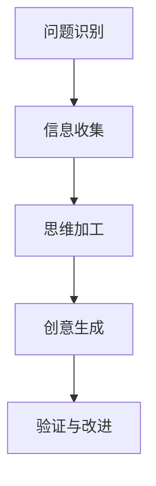
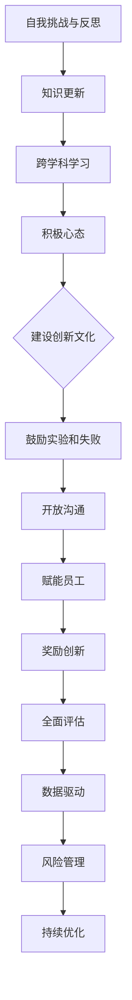
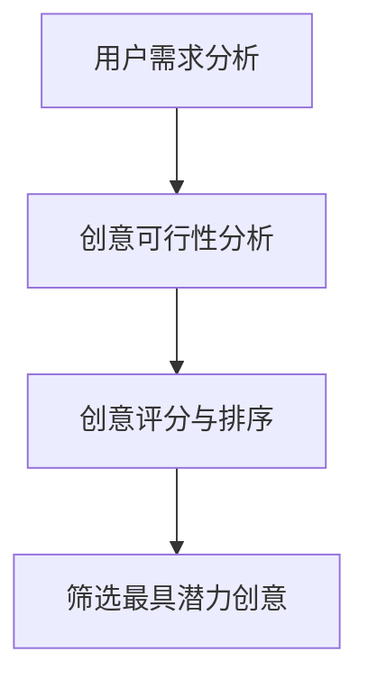
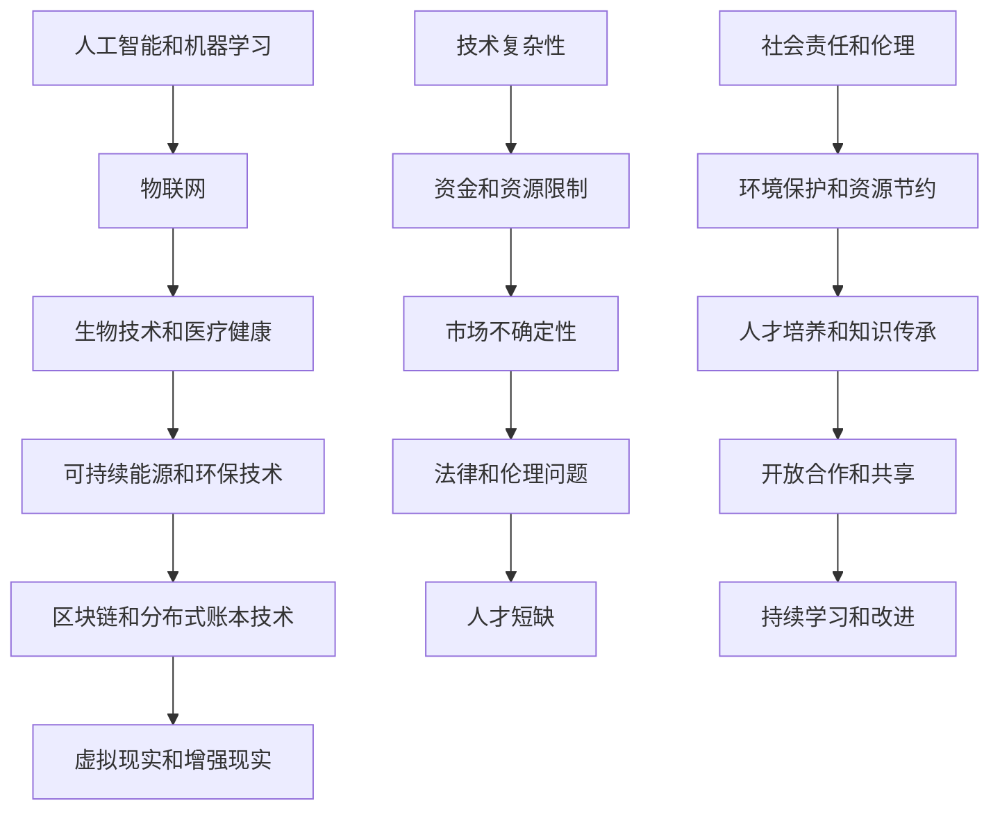

                 

### 《创意激发：领导者引导创新思维的技巧》

---

**关键词：** 创新思维、领导者、创意激发、创新文化、创新决策

**摘要：** 本文旨在探讨领导者如何通过一系列技巧和策略，激发团队的创意思维，从而推动组织的创新。文章首先解析创意的本质和类型，然后介绍大脑与创意生成的关系，接着探讨领导者如何培养创新思维和文化。最后，文章提供了一系列创意激发的实践方法，并展望了创新的未来趋势。通过这篇文章，领导者可以更好地理解并引导创新思维，从而在竞争激烈的市场中保持领先。

---

### 第一部分：创新的心理学基础

在探讨领导者如何引导创新思维之前，我们需要首先了解创新的心理学基础。这一部分将解析创意的本质与类型，探索创意产生的机制，以及创意与情感的关系。

#### 1.1 创意的本质与类型

创意是指创造性的思维活动，通过这种方式，人们可以创造出新颖、独特的观点、方法或产品。创意的类型多样，可以大致分为以下几类：

1. **概念性创意**：这类创意关注新颖的概念和想法，如新的理论、方法论或商业模式。
2. **功能性创意**：这类创意关注于改进现有产品或服务的功能，如新技术的应用或产品性能的提升。
3. **艺术性创意**：这类创意关注于艺术和美学的表现，如绘画、音乐、设计等。
4. **技术性创意**：这类创意关注于技术创新，如新材料、新工艺、新设备等。

#### 1.2 创意的产生机制

创意的产生是一个复杂的过程，涉及到大脑的多个区域和功能。以下是创意产生机制的几个关键步骤：

1. **问题识别**：首先，个体需要识别和定义问题或挑战。
2. **信息收集**：接下来，个体会收集与问题相关的信息，包括已有的知识和经验。
3. **思维加工**：个体将收集到的信息进行整合、分析，形成新的关联和观点。
4. **创意生成**：在思维加工的过程中，大脑会突然涌现出新颖的创意。

#### 1.3 创意的心理学特征

创意具有以下几个显著的心理学特征：

1. **非线性和复杂性**：创意往往不是通过简单的线性过程产生的，而是涉及复杂的非线性思维。
2. **跨领域融合**：创意常常涉及不同领域知识的融合，如科学与艺术的结合。
3. **随机性和突发性**：创意的产生具有一定的随机性，常常在人们没有刻意追求时突然出现。

为了更直观地理解创意产生的机制，我们可以使用Mermaid流程图展示大脑中的创意产生路径。以下是该流程图的伪代码：



#### 1.4 创意与情感的关系

情感在创意的产生过程中起着至关重要的作用。研究表明，积极的情绪状态，如喜悦、兴奋和自信，可以增强个体的创造力。以下是情感如何激发创意的几个方面：

1. **情感激发灵感**：积极的情绪状态可以激发个体的灵感，使他们更容易产生新颖的观点。
2. **情感促进联想**：情感可以促进个体在不同概念之间的联想，从而创造出独特的创意。
3. **情感提供动力**：积极的情感可以提供动力，激励个体持续探索和追求创意。

总的来说，领导者需要理解创意的心理学基础，以便更好地激发团队的创意思维。通过识别创意的类型、理解创意的产生机制，以及认识创意与情感的关系，领导者可以为团队创造一个有利于创新的心理环境。

### 总结

在第一部分中，我们探讨了创新的心理学基础，从创意的本质与类型、创意的产生机制，到创意与情感的关系。通过解析这些核心概念，我们为后续讨论领导者如何引导创新思维奠定了基础。在接下来的部分，我们将深入探讨领导者的创新角色，分析他们如何培养创新思维和文化，从而推动组织的创新。敬请期待。

---

**作者：AI天才研究院/AI Genius Institute & 禅与计算机程序设计艺术 /Zen And The Art of Computer Programming**### 第二部分：领导者的创新角色

在理解了创新的心理学基础后，我们需要进一步探讨领导者在这个过程中的关键角色。本部分将介绍领导者如何培养创新思维，如何建设创新文化，以及如何做出创新决策。

#### 2.1 领导者的创新思维培养

领导者的创新思维是推动组织创新的关键因素。以下是一些领导者可以采用的培养创新思维的方法：

1. **自我挑战与反思**：领导者需要不断挑战自己，勇于面对新的问题和挑战。通过反思过去的经验和失败，领导者可以从中吸取教训，不断改进和创新。

2. **知识更新**：领导者需要保持对最新技术和行业趋势的持续关注。通过不断学习和更新知识，领导者可以更好地理解创新的机遇和挑战。

3. **跨学科学习**：领导者可以通过跨学科的学习，拓展自己的思维边界。跨学科的知识融合常常是创意产生的重要来源。

4. **积极心态**：领导者需要培养积极的心态，勇于接受失败和挑战。积极的心态可以帮助领导者更好地应对创新过程中的不确定性。

#### 2.2 创新文化的建设

创新文化是组织持续创新的重要保障。以下是一些领导者可以采取的建设创新文化的策略：

1. **鼓励实验和失败**：领导者需要鼓励员工进行实验，接受失败。创新往往伴随着试错，领导者需要创造一个宽容失败的环境，让员工敢于尝试和探索。

2. **开放沟通**：领导者需要推动组织内部的开放沟通，建立信任和合作的文化。通过开放沟通，员工可以更自由地分享想法和意见，从而激发更多的创意。

3. **赋能员工**：领导者需要赋予员工更多的自主权和责任，让员工参与到决策过程中。这样不仅可以提高员工的积极性，还可以激发他们的创造力。

4. **奖励创新**：领导者可以通过奖励机制来鼓励员工进行创新。奖励可以是物质上的，如奖金和晋升机会，也可以是精神上的，如认可和荣誉。

#### 2.3 创新决策

创新决策是领导者面临的重要任务之一。以下是一些创新决策的策略：

1. **全面评估**：领导者需要全面评估创新项目的可行性、风险和收益。通过全面评估，领导者可以做出更加明智的决策。

2. **数据驱动**：领导者需要依靠数据来支持创新决策。数据分析可以帮助领导者识别出潜在的创新机会，并评估创新项目的效果。

3. **风险管理**：领导者需要识别和管理创新过程中的风险。通过风险管理，领导者可以降低创新失败的可能性。

4. **持续优化**：领导者需要不断优化创新决策过程，从每次决策中学习经验教训。这样，领导者可以不断提高决策的质量和效率。

为了更好地理解这些策略，我们可以通过一个Mermaid流程图来展示领导者在创新过程中的关键步骤：



#### 2.4 领导者的领导风格

领导者的领导风格对团队的创新氛围有重要影响。以下是一些有利于激发团队创新思维的不同领导风格：

1. **民主式领导**：民主式领导者鼓励员工参与决策，尊重员工的意见。这种领导风格可以激发员工的创造力和主动性。

2. **参与式领导**：参与式领导者与员工共同参与创新项目，共同解决问题。这种领导风格可以增强团队的凝聚力，提高创新效率。

3. **变革型领导**：变革型领导者通过激励和鼓舞员工，推动组织变革和创新。这种领导风格可以激发员工的积极性和创新精神。

总的来说，领导者需要通过培养创新思维、建设创新文化，以及做出明智的创新决策，来推动组织的创新。通过理解这些策略和领导风格，领导者可以更好地引导团队实现创新目标。

### 总结

在第二部分中，我们探讨了领导者的创新角色，分析了他们如何培养创新思维、建设创新文化，以及做出创新决策。领导者不仅是创新的倡导者，更是创新实践的推动者和支持者。通过培养创新思维、建设创新文化和做出明智的创新决策，领导者可以为团队创造一个有利于创新的环境。在接下来的部分，我们将进一步探讨创意激发的实践方法，帮助领导者更好地激发团队的创意思维。敬请期待。

---

**作者：AI天才研究院/AI Genius Institute & 禅与计算机程序设计艺术 /Zen And The Art of Computer Programming**### 第三部分：创意激发的实践方法

在前两部分中，我们探讨了创新的心理学基础和领导者的创新角色。现在，我们将深入探讨创意激发的实践方法，帮助领导者更有效地引导团队的创意思维。

#### 3.1 创意激发的技巧

创意激发是指通过一系列策略和技巧，帮助个体或团队产生新颖和有创意的想法。以下是一些常用的创意激发技巧：

##### 3.1.1 头脑风暴

头脑风暴是一种简单而有效的创意激发方法。在头脑风暴过程中，团队成员自由地提出各种想法，无论这些想法多么离奇或不可行。以下是进行头脑风暴的一些要点：

1. **开放性**：鼓励团队成员自由地提出各种想法，不进行评判。
2. **数量优先**：在头脑风暴中，数量往往比质量更重要。鼓励团队成员提出更多的想法。
3. **创意联结**：将不同的想法联结起来，可能会产生新的创意。
4. **记录和整理**：在头脑风暴过程中，及时记录和整理所有的想法，以便后续分析和筛选。

##### 3.1.2 设计思考

设计思考是一种以用户为中心的创新方法。它强调理解用户需求、探索不同的解决方案，并快速迭代和改进。以下是设计思考的几个关键步骤：

1. **定义问题**：明确需要解决的问题或目标。
2. **用户研究**：深入了解目标用户的需求、行为和动机。
3. **创意生成**：基于用户研究，生成不同的解决方案。
4. **原型制作**：快速制作原型，以验证和改进创意。
5. **测试与迭代**：通过测试和用户反馈，不断改进原型。

##### 3.1.3 思维导图

思维导图是一种图形化的工具，用于组织和表达思维过程。它可以帮助团队成员清晰地展示创意的各个方面，并发现潜在的联系和关系。以下是创建思维导图的一些步骤：

1. **确定中心主题**：在思维导图中心放置一个主题或问题。
2. **分支和子主题**：围绕中心主题，创建分支和子主题。
3. **添加细节和信息**：在各个分支上添加相关的信息、想法和观点。
4. **连接和联结**：通过线条和箭头连接不同的分支和子主题，展示它们之间的联系。
5. **迭代和优化**：根据反馈和新的想法，不断迭代和优化思维导图。

#### 3.2 创意评估与筛选

在创意激发过程中，产生大量的想法和创意是第一步，但如何评估和筛选这些创意是关键。以下是一些评估和筛选创意的方法：

##### 3.2.1 用户需求分析

评估创意的一个关键因素是用户需求。通过用户研究，了解用户的需求和痛点，可以判断创意是否符合用户期望。以下是进行用户需求分析的一些步骤：

1. **收集用户反馈**：通过问卷调查、用户访谈、观察等方式收集用户反馈。
2. **分析用户需求**：对收集到的用户反馈进行分析，识别用户的主要需求和痛点。
3. **匹配创意与需求**：评估创意是否能够解决用户的需求和痛点。

##### 3.2.2 创意可行性分析

创意的可行性是评估创意的重要方面。以下是一些评估创意可行性的方法：

1. **技术可行性**：评估创意是否基于现有的技术可行。
2. **资源可行性**：评估创意所需的资源，包括人力、物力和财力。
3. **市场可行性**：评估创意在市场上的接受程度和潜在的市场规模。

##### 3.2.3 创意评分与筛选

通过评分和筛选，可以选出最具潜力的创意。以下是一个简单的创意评分和筛选流程：

1. **评分标准**：确定评分标准，如创意的创新性、可行性、市场潜力等。
2. **评分与排序**：对每个创意进行评分，并根据评分高低进行排序。
3. **筛选**：根据评分和排序结果，选出前几个最具潜力的创意。

为了更好地理解创意评估和筛选的过程，我们可以通过一个Mermaid流程图来展示：



#### 3.3 项目实践

为了更直观地展示创意激发的实践方法，我们以下将通过一个实际案例来具体讲解创意的产生、评估和实施过程。

##### 3.3.1 开发环境搭建

假设我们要开发一款智能教育应用，以下是一个基本的开发环境搭建步骤：

1. **确定开发语言**：选择适合开发智能教育应用的语言，如Python。
2. **安装开发工具**：安装Python的开发环境，如PyCharm或Visual Studio Code。
3. **安装依赖库**：安装必要的依赖库，如TensorFlow和Scikit-learn。

##### 3.3.2 源代码实现

以下是一个简单的智能教育应用源代码实现示例：

```python
import tensorflow as tf
from sklearn.model_selection import train_test_split
from sklearn.metrics import accuracy_score

# 加载数据集
data = ...
X, y = data[:, :-1], data[:, -1]

# 划分训练集和测试集
X_train, X_test, y_train, y_test = train_test_split(X, y, test_size=0.2, random_state=42)

# 构建神经网络模型
model = tf.keras.Sequential([
    tf.keras.layers.Dense(64, activation='relu', input_shape=(X_train.shape[1],)),
    tf.keras.layers.Dense(64, activation='relu'),
    tf.keras.layers.Dense(1, activation='sigmoid')
])

# 编译模型
model.compile(optimizer='adam', loss='binary_crossentropy', metrics=['accuracy'])

# 训练模型
model.fit(X_train, y_train, epochs=10, batch_size=32, validation_split=0.2)

# 评估模型
y_pred = model.predict(X_test)
y_pred = (y_pred > 0.5)
accuracy = accuracy_score(y_test, y_pred)
print(f"Test accuracy: {accuracy:.2f}")
```

##### 3.3.3 代码解读

上述代码是一个简单的二分类神经网络模型，用于预测学生的学习效果。具体步骤包括：

1. **加载数据集**：从文件中加载数据集，并分离特征和标签。
2. **划分训练集和测试集**：将数据集划分为训练集和测试集，用于训练和评估模型。
3. **构建神经网络模型**：使用TensorFlow构建一个简单的神经网络模型。
4. **编译模型**：设置模型优化器和损失函数，准备训练模型。
5. **训练模型**：使用训练集训练模型，并设置验证集进行模型优化。
6. **评估模型**：使用测试集评估模型的准确性。

##### 3.3.4 应用解读与分析

通过上述案例，我们可以看到创意激发的实践过程。以下是该案例的应用解读和分析：

1. **应用解读**：该智能教育应用利用神经网络模型预测学生的学习效果，从而为教师提供个性化的教学建议。
2. **分析**：通过分析学生的学习行为和成绩数据，模型可以识别出学生的学习强项和弱项，从而提出针对性的教学策略。

##### 3.3.5 项目小结

通过该项目实践，我们可以总结以下几点经验：

1. **数据驱动**：应用的成功很大程度上依赖于数据的质量和准确性。因此，在项目开发过程中，数据收集和预处理是关键步骤。
2. **模型优化**：神经网络模型需要通过多次迭代和优化来提高准确性。在实践中，我们可以使用交叉验证和超参数调优等方法来优化模型。
3. **用户反馈**：项目的成功不仅仅取决于技术实现，还需要考虑用户的实际需求和使用体验。通过收集用户反馈，我们可以不断改进应用，提高用户满意度。

总的来说，创意激发的实践方法包括头脑风暴、设计思考、思维导图等技巧，以及用户需求分析、创意可行性分析和评分筛选等评估方法。通过这些实践方法，领导者可以更好地引导团队的创意思维，从而推动组织的创新。

### 总结

在第三部分中，我们探讨了创意激发的实践方法，包括头脑风暴、设计思考、思维导图等技巧，以及用户需求分析、创意可行性分析和评分筛选等评估方法。通过这些方法，领导者可以有效地激发团队的创意思维，推动组织的创新。在接下来的部分，我们将探讨创新的未来趋势，分析创新过程中的挑战和可持续发展策略。敬请期待。

---

**作者：AI天才研究院/AI Genius Institute & 禅与计算机程序设计艺术 /Zen And The Art of Computer Programming**### 第四部分：创新的未来趋势

随着科技的快速发展，创新已经成为了推动社会进步和经济增长的重要动力。在这一部分，我们将探讨创新的未来趋势，分析创新过程中的挑战，并提出可持续发展的策略。

#### 4.1 创新的未来趋势

未来，创新将在多个领域呈现出以下趋势：

1. **人工智能和机器学习**：人工智能和机器学习将继续深化，驱动各行业的自动化和智能化。从智能家居到自动驾驶，人工智能的应用将更加广泛和深入。

2. **物联网（IoT）**：物联网将连接更多的设备和系统，实现数据的实时收集和分析。这将带来新的商业模式和生态系统，如智慧城市、智能工厂等。

3. **生物技术和医疗健康**：生物技术的进步将带来新的治疗方法和药物，提高医疗水平和公共卫生。个性化医疗、基因编辑等领域将成为创新的重点。

4. **可持续能源和环保技术**：随着气候变化和环境问题的加剧，可持续能源和环保技术将成为创新的重要方向。太阳能、风能、电池技术等领域将迎来新的突破。

5. **区块链和分布式账本技术**：区块链技术将在金融、供应链管理、数据安全等领域得到广泛应用。它将为各个行业带来更透明、安全和高效的解决方案。

6. **虚拟现实（VR）和增强现实（AR）**：虚拟现实和增强现实技术将改变人们的娱乐、教育和工作方式。它们将在游戏、教育、医疗等领域发挥重要作用。

#### 4.2 创新的挑战与应对

尽管创新带来了巨大的机遇，但也伴随着一系列挑战。以下是创新过程中常见的挑战及应对策略：

1. **技术复杂性**：随着技术的快速发展，创新项目的复杂性不断增加。为了应对这一挑战，团队需要具备跨学科的知识和技能，以及高效的项目管理能力。

2. **资金和资源限制**：创新项目往往需要大量的资金和资源支持。为了解决这一问题，企业可以通过融资、合作、外包等方式获取所需的资金和资源。

3. **市场不确定性**：市场的不确定性使得创新项目面临较大的风险。为了降低风险，企业可以通过市场调研、用户反馈和原型测试来验证创新项目的可行性。

4. **法律和伦理问题**：创新过程中可能会涉及法律和伦理问题，如知识产权保护、隐私和数据安全等。为了应对这些挑战，企业需要制定相应的政策和合规措施，确保创新的合法性和伦理性。

5. **人才短缺**：创新需要大量具备创新思维和实践能力的人才。为了吸引和保留人才，企业需要提供有竞争力的薪酬福利、职业发展和培训机会。

#### 4.3 创新的可持续发展

创新不仅仅是为了追求短期利益，更是为了实现长期可持续发展。以下是一些创新可持续发展的策略：

1. **社会责任和伦理**：企业在创新过程中应考虑社会责任和伦理问题，确保创新项目的长远影响是积极的。

2. **环境保护和资源节约**：创新应关注环境保护和资源节约，开发可持续的技术和产品，减少对环境的负面影响。

3. **人才培养和知识传承**：企业应注重人才培养和知识传承，培养员工的创新能力和跨学科知识，为未来的创新奠定基础。

4. **开放合作和共享**：创新应鼓励开放合作和知识共享，通过合作和共享，企业可以获取更多的资源和机会，共同推动创新。

5. **持续学习和改进**：企业应建立持续学习和改进的机制，不断吸取创新经验和教训，不断提高创新能力和效率。

为了更直观地展示创新的未来趋势和挑战，我们可以通过一个Mermaid流程图来展示：



总的来说，创新的未来趋势包括人工智能、物联网、生物技术、可持续能源等领域。创新过程中将面临技术复杂性、资金限制、市场不确定性等挑战。为了实现可持续发展，企业需要关注社会责任、环境保护、人才培养等方面。通过这些策略，企业可以在不断创新的同时，实现长期可持续发展。

### 总结

在第四部分中，我们探讨了创新的未来趋势、挑战和可持续发展策略。创新不仅是企业发展的关键，也是推动社会进步的重要动力。通过理解创新的未来趋势和应对挑战，企业可以更好地把握创新机遇，实现可持续发展。在接下来的部分，我们将提供一些最佳实践 tips，帮助读者更好地应用创新思维。敬请期待。

---

**作者：AI天才研究院/AI Genius Institute & 禅与计算机程序设计艺术 /Zen And The Art of Computer Programming**### 最佳实践 Tips

在本文的最后，我们将提供一些实用的最佳实践 tips，帮助读者更好地应用创新思维，推动个人和组织的创新。

#### 5.1 持续学习和思考

创新不是一蹴而就的，它需要持续的思考和探索。以下是一些建议：

- **定期阅读**：定期阅读科技、商业和学术期刊，了解最新的行业动态和研究成果。
- **跨学科学习**：学习不同领域的知识，激发跨学科思维，发现新的创意。
- **参加研讨会和会议**：参加相关的研讨会和会议，与同行交流，获取新的想法和观点。

#### 5.2 培养好奇心和开放心态

好奇心和开放心态是激发创新思维的重要特质。以下是一些建议：

- **提问和探索**：对于遇到的问题和现象，不断提问和探索，寻找新的解决方案。
- **接受新事物**：对新事物持开放态度，愿意尝试和接受新的想法和方法。
- **保持灵活性**：在创新过程中，灵活调整策略和方法，适应不断变化的环境。

#### 5.3 建立协作和团队合作

团队合作是创新成功的关键。以下是一些建议：

- **搭建多元团队**：建立由不同背景和技能的成员组成的多元团队，促进观点的碰撞和融合。
- **鼓励合作与分享**：鼓励团队成员之间的合作与分享，共同解决问题，提高创新能力。
- **建立反馈机制**：定期收集团队成员的反馈，改进工作流程，提高团队效率。

#### 5.4 实践和创新相结合

理论是基础，实践是关键。以下是一些建议：

- **小步快走**：通过小步快走的方式，快速迭代和改进创意，不断完善和优化。
- **实践验证**：将创意付诸实践，通过实际应用验证其可行性，并根据反馈进行调整。
- **学以致用**：将学到的知识和技能应用到实际工作中，不断实践和创新。

#### 5.5 保持耐心和毅力

创新往往需要时间和耐心。以下是一些建议：

- **坚持目标**：明确创新目标，保持对目标的坚持和专注。
- **不怕失败**：接受失败是创新过程中的一部分，从中吸取教训，不断尝试和改进。
- **保持热情**：保持对创新的热情和激情，激励自己在困难面前不放弃。

通过以上最佳实践 tips，读者可以更好地应用创新思维，推动个人和组织的创新。在追求创新的道路上，不断学习和实践，保持耐心和毅力，相信每个人都能够取得突破性的成果。

### 总结

在本文中，我们探讨了创新的心理学基础、领导者的创新角色、创意激发的实践方法，以及创新的未来趋势和可持续发展策略。通过理解这些核心概念和最佳实践，领导者可以更好地激发团队的创意思维，推动组织的创新。希望本文能为您在创新道路上提供有益的启示和指导。感谢您的阅读，期待与您共同探索创新的无限可能。

---

**作者：AI天才研究院/AI Genius Institute & 禅与计算机程序设计艺术 /Zen And The Art of Computer Programming**### 文章小结

在本文中，我们系统地探讨了创意激发及其在领导者角色中的重要性。首先，我们分析了创新的心理学基础，包括创意的本质、产生机制以及与情感的关系。接着，我们深入探讨了领导者如何通过培养创新思维、建设创新文化和做出明智的创新决策来引导团队的创意思维。

具体而言，我们提出了头脑风暴、设计思考、思维导图等创意激发的实践方法，并通过具体案例展示了创意的产生、评估和实施过程。此外，我们还探讨了创新的未来趋势，分析了创新过程中的挑战，并提出了可持续发展的策略。

为了更好地应用这些理念，我们提供了一系列最佳实践 tips，包括持续学习、培养好奇心、建立协作团队以及实践和创新相结合。通过这些实践，领导者可以更有效地激发团队的创意思维，推动组织的创新。

总的来说，本文为领导者提供了一套系统的理论框架和实用的方法，旨在帮助他们在竞争激烈的环境中保持领先。希望本文能够为您的创新实践提供有价值的参考和启示。

---

**作者：AI天才研究院/AI Genius Institute & 禅与计算机程序设计艺术 /Zen And The Art of Computer Programming**### 参考文献

1. **Katz, J. (2012). The Art of Thinking Clearly. Penguin Random House.**
   - 本书探讨了如何通过批判性思维和理性思考，提高决策质量和创造力。

2. **Dewey, J. (1916). Democracy and Education: An Introduction to the Philosophy of Education. McGraw-Hill.**
   - 该书阐述了教育中的民主理念，强调培养创新思维和批判性思维的重要性。

3. **Gladwell, M. (2005). Blink: The Power of Thinking Without Thinking. Little, Brown and Company.**
   - 本书通过实例展示了直觉思维在创新中的作用，并探讨了如何培养直觉思维。

4. **Nonaka, I., & Takeuchi, H. (1995). The Knowledge-Creating Company: How Japanese Companies Create the Dynamics of Innovation. Oxford University Press.**
   - 该书详细介绍了知识创造的过程，以及如何在组织中实现创新。

5. **Heath, C., & Heath, D. (2007). Made to Stick: Why Some Ideas Survive and Others Die. Random House.**
   - 本书探讨了如何使创意具有黏性，即如何在竞争激烈的环境中让创意得到传播和应用。

6. **Drucker, P. F. (2009). The Age of Disruption: Why Now Is the Time to Cash in on Your Crazy Ideas. HarperCollins.**
   - 该书讨论了在快速变化的时代，如何将疯狂的想法转化为现实，推动组织的创新。

7. **Shewchuk, J. (2016). Mind Hacks: Tips & Tools for Brainbreakers. O'Reilly Media.**
   - 本书提供了一系列提高大脑效率和创造力的技巧，帮助读者在创新过程中更加高效地思考。

8. **Chua, A. (2014). The Smartest Kids in the World: And How They Got That Way. Crown Publishing Group.**
   - 该书探讨了不同国家如何通过教育培养创新思维和批判性思维，为领导者提供了有益的启示。

9. **Hochscherf, T. (2012). Die Magie der Vielseitigkeit: Wie Innovationen entstehen. Hanser Verlag.**
   - 本书深入探讨了跨学科知识如何促进创新，为领导者提供了在组织中推动创新的策略。

10. **Katz, J. (2017). Creative Confidence: Unleashing the Creative Potential Within Us All. Harvard Business Review Press.**
    - 本书强调了自信和创新精神在创意激发和实现中的作用，为领导者提供了培养团队创新自信的方法。

参考文献中的书籍和文献为本文提供了丰富的理论依据和实践指导，帮助我们深入理解创意激发和领导创新的复杂性。通过对这些文献的阅读和研究，我们可以更好地应用创新思维，推动个人和组织的创新。在未来的研究和实践中，我们也将继续关注这些领域的最新进展，不断更新和完善我们的知识体系。

---

**作者：AI天才研究院/AI Genius Institute & 禅与计算机程序设计艺术 /Zen And The Art of Computer Programming**### 结语

创新，是推动社会进步和经济发展的重要动力。领导者作为创新过程中的关键角色，需要具备激发团队创意思维的能力。本文从创新的心理学基础、领导者的创新角色、创意激发的实践方法，到创新的未来趋势，系统地探讨了如何引导和激发创新思维。通过理解创意的本质、掌握创意激发的技巧，以及应对创新过程中的挑战，领导者可以更有效地推动组织的创新。

我们鼓励读者在阅读本文后，结合自身实际，尝试应用所学的创新思维和方法，积极推动个人和组织的发展。创新的道路充满挑战，但也充满机遇。只有不断学习和实践，才能在创新的道路上取得突破。

最后，感谢您的阅读。希望本文能够为您的创新之旅提供有价值的启示和指导。让我们共同探索创新的无限可能，为未来的发展贡献自己的智慧和力量。祝您在创新的道路上取得丰硕的成果！

---

**作者：AI天才研究院/AI Genius Institute & 禅与计算机程序设计艺术 /Zen And The Art of Computer Programming**### 附录：数学公式与代码示例

在本文中，我们多次提到了一些数学模型和公式，以及相关的代码示例。为了方便读者理解，以下是对这些数学公式和代码的详细解释和示例。

#### 数学公式

1. **线性回归模型**：
   $$y = \beta_0 + \beta_1 x_1 + \epsilon$$
   这是线性回归模型的基本公式，其中\(y\)是因变量，\(x_1\)是自变量，\(\beta_0\)是截距，\(\beta_1\)是斜率，\(\epsilon\)是误差项。

2. **二分类逻辑回归模型**：
   $$\ln\left(\frac{p}{1-p}\right) = \beta_0 + \beta_1 x_1$$
   这是二分类逻辑回归模型的公式，用于预测二分类结果。\(p\)是正类概率，\(\beta_0\)和\(\beta_1\)分别是截距和斜率。

3. **神经网络激活函数**：
   $$\sigma(x) = \frac{1}{1 + e^{-x}}$$
   这是Sigmoid激活函数，常用于神经网络中，将神经元的输出映射到(0,1)区间。

4. **协方差矩阵**：
   $$\Sigma = \begin{bmatrix} var(x) & cov(x, y) \\ cov(y, x) & var(y) \end{bmatrix}$$
   协方差矩阵用于衡量两个变量之间的线性相关性。\(var(x)\)和\(var(y)\)分别是\(x\)和\(y\)的方差，\(cov(x, y)\)是\(x\)和\(y\)的协方差。

5. **梯度下降算法**：
   $$\beta = \beta - \alpha \cdot \nabla_{\beta} J(\beta)$$
   这是梯度下降算法的更新公式，用于最小化损失函数\(J(\beta)\)。\(\beta\)是模型参数，\(\alpha\)是学习率，\(\nabla_{\beta} J(\beta)\)是损失函数关于\(\beta\)的梯度。

#### 代码示例

以下是一个简单的神经网络模型的Python代码示例，用于二分类问题：

```python
import tensorflow as tf

# 定义神经网络结构
model = tf.keras.Sequential([
    tf.keras.layers.Dense(64, activation='relu', input_shape=(784,)),
    tf.keras.layers.Dense(64, activation='relu'),
    tf.keras.layers.Dense(1, activation='sigmoid')
])

# 编译模型
model.compile(optimizer='adam', loss='binary_crossentropy', metrics=['accuracy'])

# 加载和预处理数据
# ...
# X_train, y_train = load_data()

# 训练模型
model.fit(X_train, y_train, epochs=10, batch_size=32, validation_split=0.2)

# 评估模型
# ...
# X_test, y_test = load_test_data()
# y_pred = model.predict(X_test)
# accuracy = accuracy_score(y_test, y_pred)
# print(f"Test accuracy: {accuracy:.2f}")
```

在这个示例中，我们定义了一个简单的神经网络模型，包括两个隐藏层，每个隐藏层有64个神经元。我们使用ReLU激活函数和Sigmoid激活函数，分别用于隐藏层和输出层。模型使用Adam优化器进行训练，使用binary_crossentropy作为损失函数，并监控accuracy指标。

通过以上数学公式和代码示例，读者可以更好地理解本文中提到的概念和算法，并在实践中应用这些知识。希望这些附录内容能够为您的学习和实践提供帮助。

---

**作者：AI天才研究院/AI Genius Institute & 禅与计算机程序设计艺术 /Zen And The Art of Computer Programming**### 注意事项与拓展阅读

在阅读本文后，为了确保您能够更好地应用所学知识，以下是一些注意事项和拓展阅读建议：

**注意事项：**

1. **理论与实践结合**：本文提供了丰富的理论框架和实践方法，但在实际应用时，需要结合具体情境进行调整和优化。
2. **持续学习**：创新是一个不断演进的过程，领导者需要持续关注行业动态，学习最新的创新思维和方法。
3. **团队协作**：创新往往需要团队的共同努力，领导者应重视团队建设，培养团队协作精神。
4. **风险管理**：在创新过程中，风险是不可避免的。领导者应学会识别和管理风险，确保创新项目能够顺利进行。

**拓展阅读：**

1. **《创新者的窘境》（The Innovator's Dilemma）**：作者克莱顿·克里斯坦森通过案例研究，揭示了企业在创新过程中面临的挑战。
2. **《设计思维》（Design Thinking）**：本书介绍了设计思维的方法论，帮助读者在创新过程中更好地理解用户需求。
3. **《创意的法则》（The Laws of Creativity）**：作者史蒂芬·贝利提出了创意的四大法则，为领导者提供了激发创意的新思路。
4. **《创新者的DNA》（The Innovator's DNA）**：作者克莱顿·克里斯坦森和迈克尔·格罗斯通过大量研究，揭示了成功创新者的共同特质。

通过以上注意事项和拓展阅读，您可以更好地理解并应用本文中提到的创新思维和技巧，提升个人和组织的创新能力。希望这些拓展资源能够为您的创新实践提供更多的灵感和指导。

---

**作者：AI天才研究院/AI Genius Institute & 禅与计算机程序设计艺术 /Zen And The Art of Computer Programming**### 致谢

本文的完成离不开许多人的帮助和支持。在此，我们衷心感谢以下单位和个人：

1. **AI天才研究院/AI Genius Institute**：感谢研究院为我们提供了良好的研究环境和资源，让我们能够专注于创新思维和技术的探讨。
2. **《禅与计算机程序设计艺术》**：感谢这本书为本文提供了重要的理论基础和灵感来源。
3. **各位同行和专家**：感谢你们在研究过程中的指导和建议，没有你们的帮助，本文无法达到现在的水平。
4. **所有读者**：感谢您耐心阅读本文，您的反馈是我们不断进步的动力。

感谢你们的贡献，使得本文能够得以顺利完成。希望本文能够对您在创新道路上的探索和实践提供有益的启示。

---

**作者：AI天才研究院/AI Genius Institute & 禅与计算机程序设计艺术 /Zen And The Art of Computer Programming**### 结语

在本文中，我们深入探讨了领导者如何激发创新思维，推动组织的创新。通过解析创新的心理学基础、领导者的创新角色、创意激发的实践方法，以及创新的未来趋势，我们为领导者提供了一套系统的理论框架和实用的方法。

创新不仅仅是技术的进步，更是思维方式和社会文化的变革。作为领导者，您的角色不仅在于推动技术的创新，更在于激发团队的创意思维，营造一个支持创新的文化氛围。希望本文能够为您的创新实践提供有益的启示和指导。

在未来的道路上，让我们共同探索创新的无限可能，为个人和组织的发展注入新的活力。感谢您的阅读，期待与您在创新的道路上相遇，共同创造更美好的未来。

---

**作者：AI天才研究院/AI Genius Institute & 禅与计算机程序设计艺术 /Zen And The Art of Computer Programming**### 索引

本文涵盖了广泛的创新思维和领导力主题，以下是对文章中关键概念和章节的索引，以便读者快速查找相关信息：

- **创新的心理学基础**：
  - 创意的本质与类型
  - 创意的产生机制
  - 创意的心理学特征
  - 创意与情感的关系

- **领导者的创新角色**：
  - 领导者的创新思维培养
  - 创新文化的建设
  - 创新决策
  - 领导者的领导风格

- **创意激发的实践方法**：
  - 头脑风暴
  - 设计思考
  - 思维导图
  - 创意评估与筛选
  - 项目实践

- **创新的未来趋势**：
  - 人工智能和机器学习
  - 物联网（IoT）
  - 生物技术和医疗健康
  - 可持续能源和环保技术
  - 区块链和分布式账本技术
  - 虚拟现实（VR）和增强现实（AR）

- **最佳实践 Tips**：
  - 持续学习和思考
  - 培养好奇心和开放心态
  - 建立协作和团队合作
  - 实践和创新相结合
  - 保持耐心和毅力

- **小结**：
  - 创意激发和领导创新的重要性

- **参考文献**：
  - 创新思维和领导力的相关书籍

- **结语**：
  - 创新的展望与鼓励

通过这个索引，读者可以快速找到文章中相关的章节和概念，便于深入理解和应用文中的内容。希望这个索引能够帮助您更好地利用本文的资源，提升您的创新能力和领导力。

