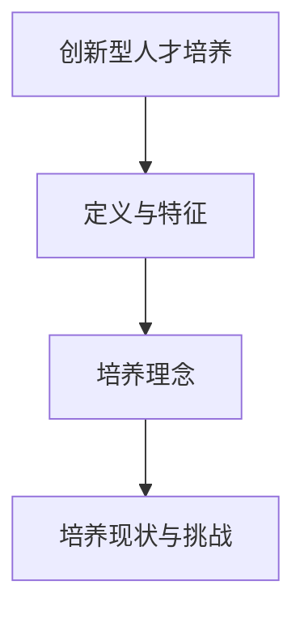

                 


### 文章标题：创新型人才培养：注入团队创新活力

#### 关键词：
- 创新型人才
- 团队创新活力
- 培养策略
- 模型构建
- 政策支持

#### 摘要：
本文旨在探讨如何培养创新型人才，并注入团队创新活力，以应对当前快速变化的技术环境。文章分为五个部分，首先介绍创新型人才的定义与特征，随后讨论团队创新活力的概念与构建。接着，通过实际案例展示创新人才培养和团队活力提升的实践策略。最后，提出政策建议，展望未来发展趋势。文章采用Markdown格式，结合伪代码、LaTeX公式和Mermaid流程图，旨在为读者提供详细而实用的指导。

## 第一部分：创新型人才培养概述

### 1.1 创新型人才的定义与特征

创新型人才是指那些具备创新精神、创造力和实践能力，能够在快速变化的环境中独立思考和解决问题，推动科技进步和社会发展的人。他们的特征包括：

- **创新意识**：持续关注行业动态，善于发现问题，具有探索新方法的欲望。
- **知识广博**：具备跨学科知识，能够将不同领域的知识融合创新。
- **批判思维**：不盲目接受现有观念，敢于质疑并寻求更好的解决方案。
- **实践能力**：不仅理论扎实，更具备将理论应用于实践的能力。

### 1.2 创新型人才的培养理念

创新型人才的培养应遵循以下理念：

- **个性化教育**：尊重个体差异，鼓励自主学习，培养独立思考和解决问题的能力。
- **跨学科融合**：打破学科界限，鼓励跨学科学习和创新。
- **实践导向**：重视实践教育，通过项目实践锻炼实际操作能力。
- **终身学习**：培养持续学习的习惯，适应快速变化的技术环境。

### 1.3 创新型人才的培养现状与挑战

当前，我国在创新型人才培养方面取得了显著进展，但仍面临一些挑战：

- **教育体制制约**：传统教育体制过于注重知识传授，忽视创新能力培养。
- **资源分配不均**：教育资源分配不均，影响创新型人才的广泛培养。
- **企业需求不符**：人才培养与企业需求脱节，导致毕业生创新能力不足。
- **政策支持不足**：缺乏系统的政策支持，影响创新型人才的成长。

## 第二部分：团队创新活力构建

### 2.1 团队创新活力的概念与模型

团队创新活力是指团队在创新过程中表现出的动力、能力和持续性。其模型构建包括以下几个方面：

- **创新动力**：团队成员的创新动机和热情。
- **创新能力**：团队在知识、技能和资源方面的综合能力。
- **创新持续性**：团队在长期创新过程中保持活力和持续性的能力。

### 2.2 影响团队创新活力的关键因素

影响团队创新活力的关键因素包括：

- **文化氛围**：开放、包容、鼓励创新的文化环境有助于激发团队活力。
- **领导风格**：领导者的支持与激励对团队创新活力具有重要影响。
- **组织结构**：灵活的组织结构有助于创新资源的有效配置。
- **资源配置**：合理的人力、物力和财力资源配置是团队创新活力的基础。

### 2.3 提升团队创新活力的策略与方法

提升团队创新活力的策略与方法包括：

- **培养创新思维**：通过培训、研讨等方式，提升团队成员的创新思维能力。
- **建立激励机制**：制定合理的奖励政策，激发团队创新积极性。
- **促进知识共享**：建立知识共享平台，鼓励团队成员分享经验和知识。
- **强化跨部门协作**：通过跨部门合作，拓宽创新视野，提高团队创新能力。

## 第三部分：创新型人才培养实践案例

### 3.1 案例一：某高科技企业的创新人才培养实践

#### 3.1.1 企业背景与挑战

某高科技企业，以科技创新为核心竞争力，但在创新型人才培养方面面临以下挑战：

- **人才储备不足**：缺乏具备创新能力和实践经验的人才。
- **人才培养体系不完善**：缺乏系统的培养计划和培训资源。
- **创新能力不足**：企业内部创新氛围不浓厚，创新能力亟待提升。

#### 3.1.2 创新人才培养方案

企业采取以下措施进行创新人才培养：

- **个性化培训计划**：根据员工特长和需求，制定个性化培训计划。
- **跨学科学习**：鼓励员工参加跨学科课程，拓宽知识面。
- **实践项目**：组织实践项目，提升员工实际操作能力。
- **导师制度**：建立导师制度，为员工提供职业发展指导。

#### 3.1.3 实施效果与评价

实施创新人才培养方案后，企业取得了显著成效：

- **人才储备增加**：员工创新能力和实践能力显著提升。
- **创新氛围改善**：企业内部创新氛围明显改善，创新能力得到增强。
- **业绩提升**：企业新产品研发周期缩短，市场份额提升。

### 3.2 案例二：某互联网公司的团队创新活力提升策略

#### 3.2.1 企业背景与挑战

某互联网公司，以技术创新为驱动力，但在团队创新活力提升方面面临以下挑战：

- **团队协作不畅**：跨部门协作不紧密，影响创新项目推进。
- **资源分配不合理**：人力资源和财务资源分配不均，影响团队创新活力。
- **创新激励机制不足**：缺乏有效的激励机制，员工创新积极性不高。

#### 3.2.2 团队创新活力提升策略

公司采取以下策略提升团队创新活力：

- **优化组织结构**：调整组织架构，促进跨部门协作。
- **资源配置优化**：合理分配人力资源和财务资源，确保团队创新需求得到满足。
- **建立激励机制**：制定创新奖励政策，激励员工积极参与创新项目。
- **文化氛围营造**：营造开放、包容、鼓励创新的企业文化。

#### 3.2.3 实施效果与评价

实施团队创新活力提升策略后，公司取得了积极成果：

- **团队协作提升**：跨部门协作效率提高，创新项目推进顺利。
- **创新能力增强**：员工创新积极性提升，创新成果显著。
- **业绩增长**：公司业绩稳步增长，市场份额扩大。

## 第四部分：政策支持与创新人才培养

### 4.1 政策环境对创新型人才培养的影响

政策环境对创新型人才培养具有重要影响：

- **教育体系改革**：推动教育体制改革，注重培养学生的创新能力和实践能力。
- **企业支持政策**：制定有利于企业创新的政策，鼓励企业投入创新人才培养。
- **资金支持**：提供专项资金支持，为创新人才培养提供资金保障。
- **国际合作**：加强国际合作，借鉴国际先进经验，提升我国创新型人才培养水平。

### 4.2 创新型人才培养的政策建议

为进一步提升创新型人才培养水平，建议采取以下政策措施：

- **完善教育体系**：加强基础教育和高等教育改革，注重培养学生的创新思维和实践能力。
- **加强企业合作**：推动企业与高校、科研机构合作，共同培养创新型人才。
- **政策激励**：制定激励政策，鼓励企业投入创新人才培养，提高员工创新积极性。
- **资金保障**：加大资金投入，为创新人才培养提供充足的资金支持。

## 第五部分：未来展望与趋势

### 5.1 创新型人才培养的未来挑战与机遇

未来，创新型人才培养面临以下挑战与机遇：

- **技术变革**：随着人工智能、大数据等技术的快速发展，对创新型人才培养提出更高要求。
- **全球化竞争**：全球范围内的技术竞争加剧，对创新型人才培养提出新的挑战。
- **可持续发展**：实现可持续发展，需要培养具备创新能力和责任意识的人才。

### 5.2 团队创新活力的未来发展

团队创新活力的未来发展将呈现以下趋势：

- **智能化**：利用人工智能等技术，提升团队创新能力和效率。
- **跨学科融合**：加强跨学科合作，推动创新项目发展。
- **可持续发展**：注重团队创新过程中的可持续发展，实现经济、社会和环境效益的统一。

### 5.3 政策支持与创新人才培养的发展趋势

未来，政策支持与创新人才培养的发展趋势将呈现以下特点：

- **多元化**：政策支持将更加多元化，涉及教育、企业、科研等多个领域。
- **国际化**：加强与国际先进经验的交流与合作，提升我国创新人才培养水平。
- **可持续发展**：注重创新人才培养过程中的可持续发展，实现经济、社会和环境效益的统一。

## 文章总结

创新型人才培养是推动科技进步和社会发展的重要动力。通过培养具备创新能力和实践能力的创新型人才，并注入团队创新活力，企业和社会可以更好地应对快速变化的技术环境。本文从定义、特征、培养理念、实践案例和政策支持等方面对创新型人才培养进行了详细探讨，提出了提升团队创新活力的策略与方法。未来，需要继续加强政策支持，推动教育体制改革，加强企业合作，为创新人才培养提供有力保障。

### 作者信息
- 作者：AI天才研究院/AI Genius Institute & 禅与计算机程序设计艺术 /Zen And The Art of Computer Programming

### 最佳实践 tips

- **培养创新意识**：鼓励员工关注行业动态，培养创新思维。
- **跨学科融合**：组织跨学科研讨会，促进知识共享。
- **实践导向**：通过项目实践锻炼实际操作能力。
- **终身学习**：鼓励员工持续学习，提升个人能力。

### 小结

本文从多个角度探讨了创新型人才培养和团队创新活力构建的重要性，提出了具体策略和方法。希望本文能为读者提供有益的启示和参考。

### 注意事项

- **个性化教育**：尊重个体差异，制定个性化培养计划。
- **资源配置**：合理配置人力资源和财务资源，确保团队创新需求得到满足。
- **激励机制**：建立有效的激励机制，提高员工创新积极性。

### 拓展阅读

- 《创新人才培养与团队活力提升研究》
- 《企业创新活力构建与策略》
- 《跨学科人才培养模式探索》

## 附录

### Mermaid流程图



### 伪代码

```python
# 创新型人才评价系统
def evaluate_innovative_talent(talent):
    # 判断创新意识
    if talent.innovation_consciousness:
        score += 1
    # 判断知识广博
    if talent.knowledge_wide:
        score += 1
    # 判断批判思维
    if talent.critical_thinking:
        score += 1
    # 判断实践能力
    if talent.practice_ability:
        score += 1
    return score
```

### LaTeX公式

$$
\text{创新活力} = f(\text{创新动力}, \text{创新能力}, \text{创新持续性})
$$

### 实际案例解析

#### 案例一：某高科技企业的创新人才培养实践

**背景**：某高科技企业，以科技创新为核心竞争力，但在创新型人才培养方面面临人才储备不足、人才培养体系不完善等问题。

**方案**：

1. **个性化培训计划**：根据员工特长和需求，制定个性化培训计划，提升员工创新能力和实践能力。
2. **跨学科学习**：鼓励员工参加跨学科课程，拓宽知识面。
3. **实践项目**：组织实践项目，提升员工实际操作能力。
4. **导师制度**：建立导师制度，为员工提供职业发展指导。

**实施效果**：

- 人才储备增加：员工创新能力和实践能力显著提升。
- 创新氛围改善：企业内部创新氛围明显改善，创新能力得到增强。
- 业绩提升：企业新产品研发周期缩短，市场份额提升。

**小结**：通过个性化培训计划、跨学科学习、实践项目和导师制度的实施，企业成功培养了具备创新能力和实践能力的人才，提升了整体创新活力。

### 案例二：某互联网公司的团队创新活力提升策略

**背景**：某互联网公司，以技术创新为驱动力，但在团队创新活力提升方面面临团队协作不畅、资源分配不合理等问题。

**方案**：

1. **优化组织结构**：调整组织架构，促进跨部门协作。
2. **资源配置优化**：合理分配人力资源和财务资源，确保团队创新需求得到满足。
3. **建立激励机制**：制定创新奖励政策，激励员工积极参与创新项目。
4. **文化氛围营造**：营造开放、包容、鼓励创新的企业文化。

**实施效果**：

- 团队协作提升：跨部门协作效率提高，创新项目推进顺利。
- 创新能力增强：员工创新积极性提升，创新成果显著。
- 业绩增长：公司业绩稳步增长，市场份额扩大。

**小结**：通过优化组织结构、资源配置优化、建立激励机制和文化氛围营造，公司成功提升了团队创新活力，实现了业绩的稳步增长。

### 文章总结

创新型人才培养和团队创新活力构建是推动科技进步和社会发展的重要动力。通过本文的探讨，我们可以了解到创新型人才的定义与特征、培养理念、实践案例和政策支持等内容。未来，需要继续加强政策支持，推动教育体制改革，加强企业合作，为创新人才培养提供有力保障。同时，注重团队创新活力的提升，实现企业和社会的可持续发展。

### 最佳实践 tips

- **培养创新意识**：鼓励员工关注行业动态，培养创新思维。
- **跨学科融合**：组织跨学科研讨会，促进知识共享。
- **实践导向**：通过项目实践锻炼实际操作能力。
- **终身学习**：鼓励员工持续学习，提升个人能力。

### 小结

本文从多个角度探讨了创新型人才培养和团队创新活力构建的重要性，提出了具体策略和方法。希望本文能为读者提供有益的启示和参考。

### 注意事项

- **个性化教育**：尊重个体差异，制定个性化培养计划。
- **资源配置**：合理配置人力资源和财务资源，确保团队创新需求得到满足。
- **激励机制**：建立有效的激励机制，提高员工创新积极性。

### 拓展阅读

- 《创新人才培养与团队活力提升研究》
- 《企业创新活力构建与策略》
- 《跨学科人才培养模式探索》

### 结语

创新型人才培养和团队创新活力构建是一项系统工程，需要多方协作，共同努力。让我们携手共进，为培养更多创新型人才，注入团队创新活力，推动科技进步和社会发展贡献自己的力量。

### 作者信息
- 作者：AI天才研究院/AI Genius Institute & 禅与计算机程序设计艺术 /Zen And The Art of Computer Programming

