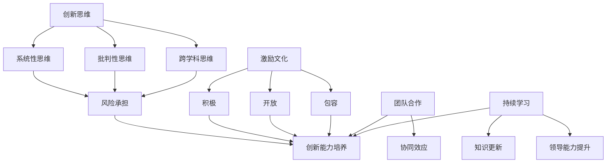
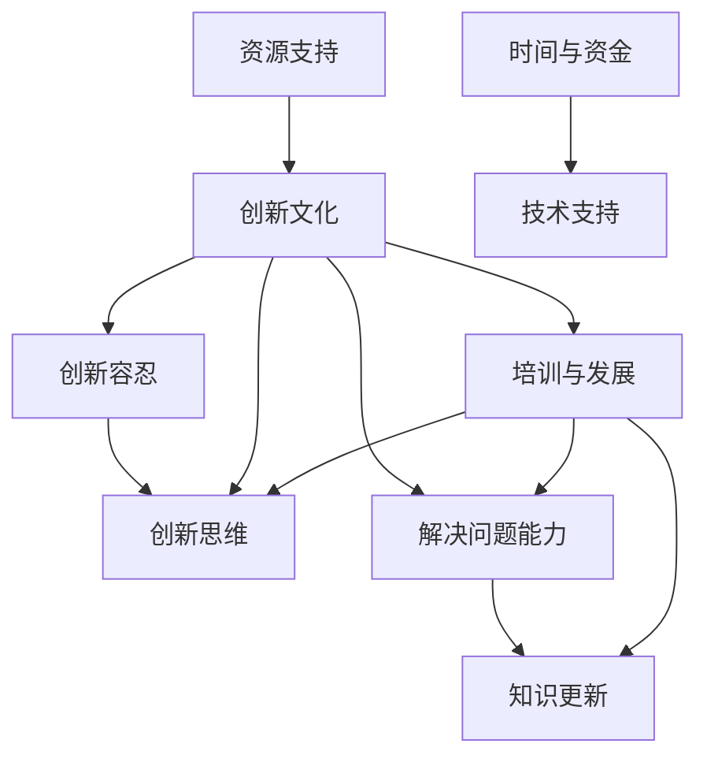
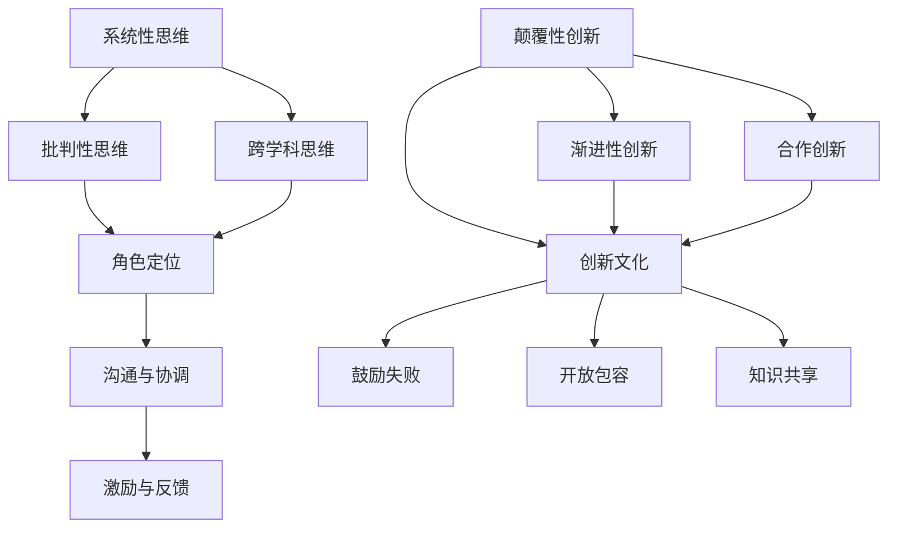
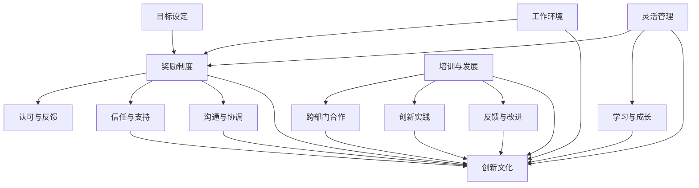

                 

### 引言

在当今快速变革的商业环境中，创新能力已成为组织竞争优势的关键因素。而创新型领导作为激发团队创造力的核心驱动，其在组织成功中的重要性日益凸显。本文旨在探讨创新型领导的本质特征、方法与策略，帮助读者深入了解如何成为一名成功的创新型领导者。

**背景**：随着全球化和数字化浪潮的席卷，企业面临的市场竞争愈发激烈，创新能力成为企业在激烈竞争中脱颖而出的关键。创新型领导不仅能够推动组织实现创新目标，还能够激发团队成员的创造力和积极性。因此，研究创新型领导的重要性及其实践方法具有重要的现实意义。

**目标**：本文的目标是：

1. 明确创新型领导的概念和特征；
2. 阐述激发团队创造力的重要性；
3. 分析创新型领导的方法与策略；
4. 通过实践案例展示创新型领导的实际效果；
5. 提出未来创新型领导发展的趋势与建议。

**结构**：本文将按照以下结构展开：

1. 引言：背景介绍、目标和结构概述；
2. 创新型领导的概念与特征：核心概念和特征分析；
3. 激发团队创造力的重要性：创造力对组织发展的影响；
4. 创新型领导的方法与策略：具体方法和策略分析；
5. 团队成员的激励与培养：激励机制和实践技巧；
6. 创新型领导的实践案例：国内外成功案例解析；
7. 结论与展望：总结和创新型领导发展的趋势。

通过以上结构，本文将逐步引导读者深入理解创新型领导的概念和实践，从而提升读者的领导能力和创新能力。

### 创新型领导的概念与特征

**核心概念**：

创新型领导（Innovative Leadership）是指领导者通过创新思维、创新方法和创新文化来引导团队实现创新目标的能力。这种领导方式不仅仅关注短期的绩效提升，更注重长期的创新能力培养和组织文化的建设。

**联系**：

创新型领导与普通领导之间存在一定的联系，但二者在核心目标和实现方式上存在显著差异。普通领导主要关注组织效率和执行力，而创新型领导则更侧重于激发团队的创造力和创新精神。

**特征分析**：

1. **创新思维**：创新型领导者具备独特的创新思维方式，能够从不同角度看待问题，发现新的解决方案。这种思维方式包括系统性思维、批判性思维和跨学科思维。

2. **风险承担**：创新型领导者愿意承担创新过程中的风险，敢于挑战传统思维和现有流程，勇于尝试新的方法和策略。

3. **激励文化**：创新型领导者注重构建积极、开放和包容的创新文化，鼓励团队成员自由表达观点，积极参与创新过程。

4. **团队合作**：创新型领导者善于与团队成员合作，充分发挥每个人的优势，形成协同效应。

5. **持续学习**：创新型领导者具备持续学习的精神，不断更新自己的知识体系，提升自身的领导能力。

**图解：创新型领导特征架构图**

为了更直观地展示创新型领导特征，我们使用Mermaid流程图来描绘其核心特征之间的关系。

通过上述分析，我们可以看出，创新型领导特征之间相互关联，形成一个完整的创新生态系统。这些特征共同作用于团队，激发团队成员的创造力和创新精神，从而推动组织的创新和发展。

### 激发团队创造力的重要性

创造力是组织持续发展和竞争优势的关键驱动力。一个具有高度创造力的团队能够在面对市场变化和技术进步时，迅速适应并推出创新产品或服务，从而在竞争中占据有利地位。因此，激发团队创造力对于组织的发展至关重要。

**定义与作用**：

创造力（Creativity）是指个体或团队产生新颖、有价值的想法或解决方案的能力。在组织层面，创造力不仅体现在技术创新和产品开发上，还涵盖业务模式创新、管理方法创新等多个方面。具体来说，创造力具有以下作用：

1. **提高竞争力**：通过创新产品或服务，组织能够满足市场需求，赢得更多客户，从而提高市场份额和盈利能力。
2. **推动持续发展**：创新能够带来新的业务增长点，使组织在长期发展中保持活力和竞争力。
3. **提升员工满意度**：创造力强的团队通常具有更开放和积极的工作氛围，能够激发员工的创造力和工作热情，提高员工满意度和忠诚度。

**创造力对组织发展的影响**：

1. **战略层面**：创造力能够帮助组织制定更具前瞻性的战略，使组织在竞争激烈的市场中保持领先地位。
2. **运营层面**：创新过程能够优化业务流程，提高效率，降低成本。
3. **产品层面**：创新产品或服务能够满足客户需求，提升客户体验，增加客户忠诚度。

**创造力培养的重要性**：

组织要实现持续创新，必须重视创造力的培养。以下措施可以帮助组织培养团队创造力：

1. **提供资源支持**：为团队成员提供充足的资源，包括时间、资金和技术支持，让他们能够全身心投入到创新活动中。
2. **构建创新文化**：营造鼓励创新、容忍失败的组织氛围，让团队成员敢于尝试新的想法和方法。
3. **培训与发展**：通过培训和学习，提升团队成员的创新技能和知识，培养他们的创新思维和解决问题的能力。

**图解：创造力培养的架构**

以下是一个用于展示创造力培养核心环节的Mermaid流程图：

通过以上分析，我们可以看出，激发团队创造力对于组织的长期发展和竞争优势至关重要。组织应采取一系列措施，构建有利于创造力培养的环境，从而激发团队的创造力和创新精神，推动组织的持续发展和进步。

### 创新型领导的方法与策略

为了成为一名成功的创新型领导者，领导者需要掌握一系列的方法与策略，以激发团队的创造力并实现创新目标。以下是一些核心的方法和策略：

**1. 创新思维模式**

创新型领导者的思维模式是激发团队创造力的重要基础。以下是一些常见的创新思维模式：

- **系统性思维**：领导者应具备系统性思维，能够从整体上把握问题，发现不同元素之间的关联和相互作用，从而提出创新的解决方案。

- **批判性思维**：领导者应具备批判性思维，对现有观念和方法进行质疑和挑战，从而发现改进的机会。

- **跨学科思维**：领导者应具备跨学科思维，能够结合不同领域的知识和方法，提出创新的解决方案。

**2. 创新策略选择**

在选择创新策略时，领导者需要考虑组织的实际情况和资源。以下是一些常见的创新策略：

- **颠覆性创新**：颠覆性创新是指通过颠覆现有市场规则和商业模式，创造出全新的产品或服务。领导者需要具备勇气和远见，敢于挑战传统思维。

- **渐进性创新**：渐进性创新是指在现有产品或服务的基础上，通过逐步改进和优化，实现小的创新突破。这种策略适合资源有限的组织。

- **合作创新**：合作创新是指通过与其他组织或个人合作，共同开发新的产品或服务。这种策略可以借助外部资源，加速创新过程。

**3. 创新型领导的实践技巧**

在实践中，创新型领导者需要掌握一系列的技巧，以激发团队的创造力：

- **角色定位**：领导者需要明确自己的角色，既要作为创新理念的倡导者，又要作为团队成员的支持者和促进者。

- **沟通与协调**：领导者需要具备良好的沟通与协调能力，能够与团队成员建立信任关系，促进信息共享和协作。

- **激励与反馈**：领导者需要运用激励手段，激发团队成员的创新热情，同时通过反馈机制，帮助团队成员不断改进和创新。

**4. 创新文化的营造**

创新文化是激发团队创造力的关键因素。以下是一些营造创新文化的策略：

- **鼓励失败**：领导者应鼓励团队成员敢于尝试新的想法和方法，即使失败也视为宝贵的经验。

- **开放包容**：领导者应营造开放包容的文化氛围，鼓励团队成员自由表达观点，尊重不同的意见。

- **知识共享**：领导者应促进团队成员之间的知识共享，建立学习型组织，提升整体创新能力。

**图解：创新思维模式与策略选择**

以下是一个用于展示创新思维模式与策略选择的Mermaid流程图：

通过以上分析和图解，我们可以看出，成为一名成功的创新型领导者需要掌握创新思维模式、选择合适的创新策略，并运用一系列实践技巧来激发团队的创造力。领导者应不断学习、实践和反思，以不断提升自己的领导能力，推动组织的创新和发展。

### 团队成员的激励与培养

为了确保创新型领导能够有效发挥作用，团队成员的激励与培养是关键环节。以下是几种关键的激励机制和实践技巧，以及培养策略：

**1. 激励机制**

激励机制是激发团队成员创造力和积极性的重要手段。以下是一些常见的激励机制：

- **目标设定**：为团队成员设定明确、可衡量的目标，帮助他们明确工作方向和期望成果。

- **奖励制度**：建立奖励制度，对达到或超过目标的团队成员给予奖励，如奖金、晋升机会等。

- **认可与反馈**：及时对团队成员的创新行为和成果进行认可，通过正面的反馈激励他们继续保持创新热情。

- **工作环境**：营造良好的工作环境，提供必要的资源和支持，减少团队成员的负担，使他们能够专注于创新工作。

**2. 实践技巧**

在实践中，以下技巧可以帮助领导者有效激励团队成员：

- **信任与支持**：领导者应信任团队成员，提供必要的支持，让他们在创新过程中感到放心和有成就感。

- **沟通与协调**：建立有效的沟通机制，确保团队成员之间的信息流通和协作，减少误解和冲突。

- **灵活管理**：给予团队成员一定的自主权，允许他们根据自己的兴趣和专长选择创新项目，激发他们的创新潜力。

- **学习与成长**：提供学习机会和成长空间，帮助团队成员不断提升自己的技能和知识，增强其创新能力。

**3. 培养策略**

为了培养团队成员的创新能力，领导者可以采取以下策略：

- **培训与发展**：定期组织培训课程，传授创新方法和技能，帮助团队成员掌握创新的工具和技巧。

- **跨部门合作**：鼓励团队成员跨部门合作，促进知识的交流和创新思维的碰撞，激发新的创意。

- **创新实践**：通过组织创新实践活动，如头脑风暴、设计思维工作坊等，鼓励团队成员动手实践，提升他们的创新能力。

- **反馈与改进**：建立反馈机制，对创新实践进行评估和改进，帮助团队成员总结经验，不断优化创新过程。

**图解：团队成员激励与培养架构**

以下是一个用于展示团队成员激励与培养架构的Mermaid流程图：

通过上述激励机制、实践技巧和培养策略，领导者可以有效地激发团队成员的创造力和创新精神，为组织的持续创新和发展提供有力支持。

### 创新型领导的实践案例

为了更好地理解创新型领导在激发团队创造力方面的实际效果，本文将分析几个国内外创新型领导的经典案例，探讨他们的成功经验和教训。

**案例1：谷歌的谢尔盖·布林和拉里·佩奇**

谷歌的创始人谢尔盖·布林和拉里·佩奇是创新型领导的典范。他们通过以下措施激发了团队的创造力：

- **自由的工作环境**：谷歌提供了开放的工作环境，鼓励员工自由地探索和尝试新的想法。员工甚至可以花费20%的时间进行与公司核心业务无关的项目，许多成功的谷歌产品如Gmail和Google News都起源于这种自由探索。

- **鼓励失败**：布林和佩奇认为失败是成功的一部分，他们鼓励员工敢于尝试，即使失败也能从中学习。这种包容失败的文化激励了员工不断创新。

- **跨学科合作**：谷歌鼓励员工跨学科合作，促进不同领域之间的知识共享和思维碰撞，从而产生更多创新性的解决方案。

**成功经验**：

- **创新文化的建立**：通过自由的工作环境和包容失败的文化，谷歌培养了一批具有高度创造力的员工。
- **持续的创新动力**：谷歌的20%时间政策不仅带来了许多成功的产品，还激发了员工的创新热情，使谷歌始终保持创新活力。

**教训**：

- **资源分配**：20%时间政策虽然带来了很多创新，但也可能导致资源分散，影响核心业务的进展。因此，领导者需要在自由探索和创新之间找到平衡。

**案例2：苹果的史蒂夫·乔布斯**

史蒂夫·乔布斯是苹果公司的标志性人物，他的领导风格对苹果的创新成功产生了深远影响。

- **明确愿景**：乔布斯对苹果的愿景非常清晰，他能够将这个愿景传达给团队成员，使大家朝着共同的目标努力。

- **追求卓越**：乔布斯对产品质量和用户体验有着极高的要求，他不断推动团队追求卓越，从而推出一系列引领市场的产品。

- **激发激情**：乔布斯通过激情演讲和激励谈话，激发了员工的创造力和工作热情，使团队成员为实现共同愿景而努力。

**成功经验**：

- **卓越的产品质量**：乔布斯的领导风格使苹果公司能够持续推出高质量的产品，赢得了市场的广泛认可。
- **强大的品牌形象**：乔布斯的领导力和苹果的创新产品共同塑造了强大的品牌形象，使苹果在竞争激烈的市场中脱颖而出。

**教训**：

- **领导者的个人魅力**：乔布斯的领导风格高度依赖于他个人的魅力，如果未来领导者的个人魅力不足，可能会影响公司的创新能力。

**案例3：特斯拉的埃隆·马斯克**

埃隆·马斯克是特斯拉和SpaceX的创始人，他的领导风格和创新能力备受瞩目。

- **长期目标**：马斯克关注长期目标，他的愿景不仅局限于电动汽车，还包括通过SpaceX实现人类火星移民。这种长远的眼光激励了团队成员不断创新。

- **风险承担**：马斯克敢于承担风险，推动特斯拉在电动汽车、电池技术和能源领域进行大量投资，尽管过程中面临诸多挑战，但他的领导风格使团队能够迎难而上。

- **激励文化**：马斯克注重激励文化，他通过高额奖励和股权激励，使团队成员感受到公司对他们的重视，从而激发他们的工作热情和创新能力。

**成功经验**：

- **创新驱动的发展**：特斯拉和SpaceX在各自领域取得了显著的成就，这得益于马斯克的长期目标和风险承担。
- **跨领域创新**：马斯克的领导风格促进了跨领域的创新，使特斯拉在电动汽车和能源领域取得了突破性进展。

**教训**：

- **资源分配**：在追求长期目标的过程中，马斯克可能会分散公司的资源，导致某些领域的进展放缓。因此，领导者需要在资源配置上保持审慎。

通过以上案例分析，我们可以看到，成功的创新型领导者能够通过自由的工作环境、包容失败的文化、明确的愿景、卓越的产品质量、长期目标、风险承担和激励文化等多种方式激发团队的创造力。同时，我们也应从这些案例中吸取经验教训，以不断完善自身的领导能力和激发团队创造力。

### 结论与展望

通过对创新型领导的深入探讨，我们可以得出以下结论：

1. **创新型领导的重要性**：创新型领导不仅能够推动组织实现创新目标，还能够激发团队成员的创造力和积极性，从而提升组织的整体竞争力。

2. **核心概念与特征**：创新型领导的核心概念包括创新思维、风险承担、激励文化和团队合作，这些特征相互关联，形成一个完整的创新生态系统。

3. **激发团队创造力的重要性**：创造力是组织持续发展和竞争优势的关键驱动力，通过培养和激发团队的创造力，组织能够更好地应对市场变化和技术进步。

4. **方法与策略**：创新型领导的方法与策略包括创新思维模式、创新策略选择、实践技巧和营造创新文化，领导者需要结合组织实际情况灵活运用。

5. **团队成员的激励与培养**：通过目标设定、奖励制度、认可与反馈、工作环境优化等激励机制，以及信任与支持、沟通与协调等实践技巧，领导者可以有效地激励团队成员。

6. **实践案例**：通过分析谷歌、苹果和特斯拉等公司的成功案例，我们可以看到创新型领导在激发团队创造力方面的实际效果和关键经验。

**未来发展趋势**：

1. **数字化与智能化**：随着数字技术和人工智能的不断发展，创新型领导需要具备更高的数字化和智能化能力，以应对更加复杂和动态的市场环境。

2. **全球化与多元化**：全球化带来了更多的机遇和挑战，创新型领导需要具备全球视野和多元化思维，推动跨文化团队合作。

3. **可持续发展**：在可持续发展日益重要的背景下，创新型领导需要关注环境、社会和经济效益的平衡，推动绿色创新和可持续发展的战略。

**建议**：

1. **培养创新思维**：领导者应不断培养自己的创新思维，通过学习、实践和反思，提升自身的领导能力和创新能力。

2. **构建创新文化**：组织应积极构建开放、包容和鼓励创新的氛围，为团队成员提供自由探索和支持。

3. **关注团队激励**：领导者应关注团队成员的激励与培养，通过激励机制和实践技巧，激发团队的创造力和创新精神。

通过以上结论和建议，我们可以看到，创新型领导在激发团队创造力方面具有重要作用，未来创新型领导的发展将更加注重数字化、智能化和可持续发展的能力，领导者需要不断学习和实践，以应对不断变化的商业环境。

### 最佳实践 Tips、小结、注意事项、拓展阅读

**最佳实践 Tips**：

1. **建立创新思维模式**：领导者可以通过阅读创新书籍、参加创新培训等方式，培养系统性思维、批判性思维和跨学科思维。

2. **营造包容失败的文化**：鼓励团队成员敢于尝试，即使失败也视为宝贵的经验，从而激发创新热情。

3. **跨部门合作**：推动团队成员跨部门合作，促进知识共享和思维碰撞，产生更多创新想法。

4. **提供资源支持**：确保团队成员有充足的时间、资金和技术支持，让他们能够全身心投入到创新活动中。

**小结**：

本文系统地探讨了创新型领导的本质特征、方法与策略，以及团队成员的激励与培养。通过实践案例的分析，我们看到了创新型领导在激发团队创造力方面的实际效果和关键经验。

**注意事项**：

1. **平衡创新与效率**：在追求创新的同时，领导者应注意平衡创新与效率，避免资源分散。

2. **避免依赖个人魅力**：领导者应注重团队建设，避免过度依赖个人魅力，确保组织长期稳定发展。

**拓展阅读**：

1. **《创新者的窘境》**：克里斯坦森的这本书深入分析了创新者在面对市场变化时面临的挑战，为领导者提供了宝贵的启示。

2. **《精益创业》**：埃里克·莱斯提出了一种基于用户反馈的创业方法，对创新型领导者具有重要的参考价值。

3. **《创新者的基因》**：通过研究成功创新者的行为模式，迪伊·托马斯揭示了创新者共有的特质和行为习惯。

通过阅读这些书籍，读者可以进一步深入了解创新理论和实践，提升自身的领导能力和创新能力。

### 作者信息

作者：AI天才研究院/AI Genius Institute & 禅与计算机程序设计艺术 /Zen And The Art of Computer Programming

