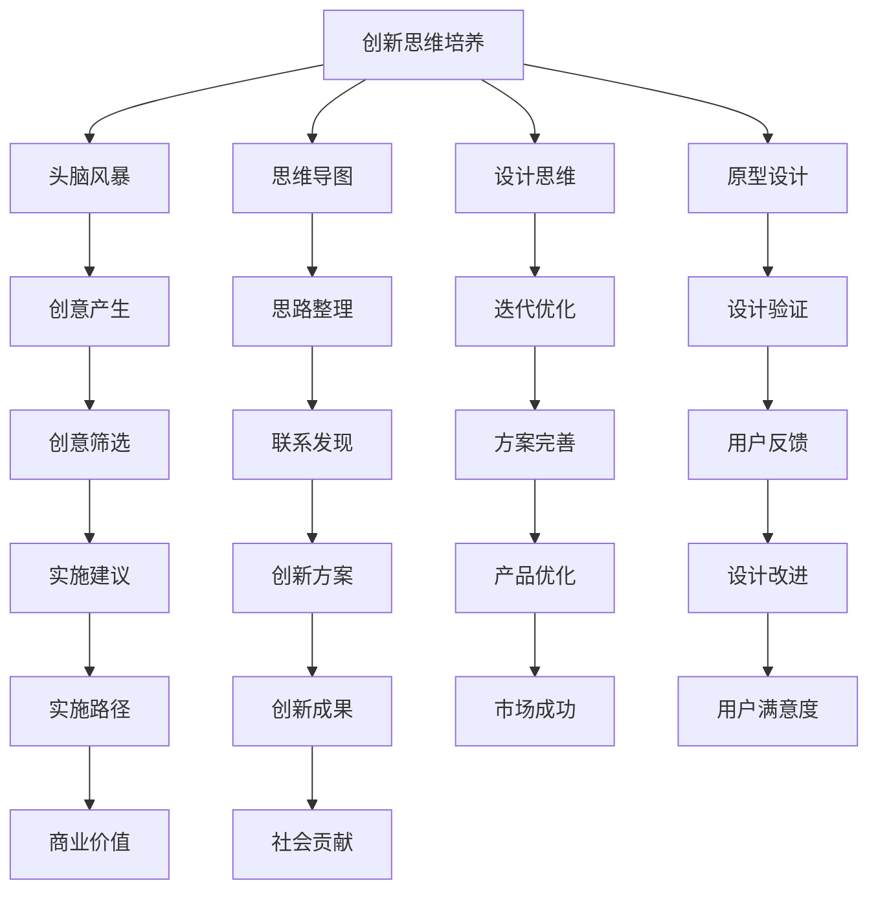
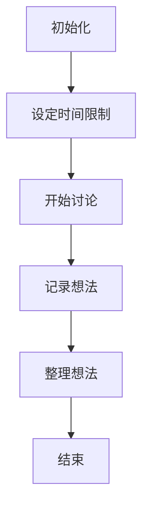
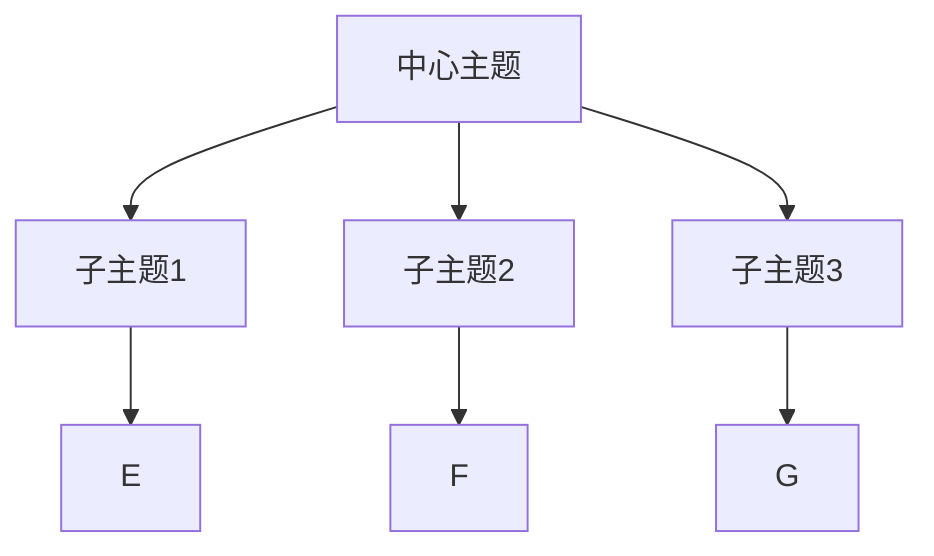
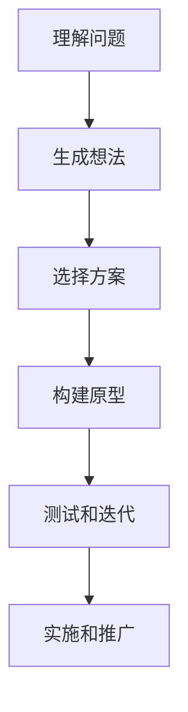
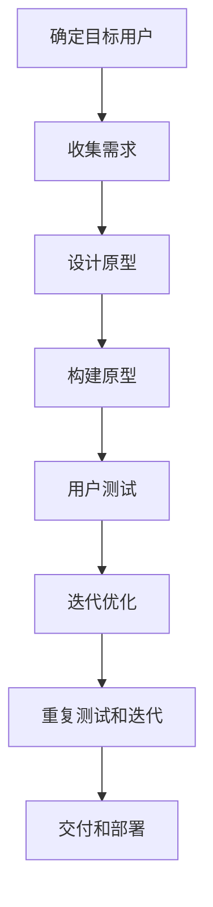

                 

### 文章标题

《创新思维培养：激发团队创意的实践方法》

> 关键词：创新思维、团队创意、实践方法、思维导图、设计思维、原型设计

> 摘要：
本文旨在探讨如何培养创新思维，并借助具体实践方法激发团队创意。通过对创新思维的理论基础、激发团队创意的方法以及实践应用的深入分析，我们希望能够为读者提供一套系统且实用的创新思维培养指南。

## 引言

在当今这个快速变化的时代，创新已经成为企业、组织和个人竞争的关键因素。一个富有创新思维的文化和团队，能够快速响应市场变化，捕捉新机遇，从而在激烈的市场竞争中立于不败之地。然而，创新并非易事，它需要系统的培养和实践。

本文将围绕以下三个方面展开讨论：

1. **创新思维理论基础**：介绍创新思维的概念、心理学基础以及其历史发展。
2. **激发团队创意的方法**：探讨头脑风暴、思维导图、设计思维和原型设计等激发团队创意的方法。
3. **实践应用**：通过案例分析、项目实战和最佳实践分享，展示如何将创新思维应用于实际工作中。

通过逐步分析推理，我们将帮助读者理解创新思维的本质，掌握激发团队创意的实践方法，从而在个人和团队层面实现创新突破。

## 背景介绍

### 创新的重要性

在21世纪的今天，创新已经成为推动社会进步和经济发展的重要动力。企业通过创新可以开发出满足市场需求的新产品和服务，提升市场竞争力；组织通过创新可以优化工作流程，提高工作效率和生产力；而个人通过创新则可以不断突破自我，实现职业发展和个人成长。

创新不仅是一种技术活动，更是一种思维方式和行为习惯。它要求我们从不同的角度看待问题，打破固有的思维定势，探索新的解决方案。因此，培养创新思维已经成为现代教育和职业发展的关键。

### 团队创意的激发

团队创意是指通过集体智慧和合作，产生新的想法、方案和产品。一个富有创意的团队能够快速应对挑战，找到创新的解决方案。然而，激发团队创意并非易事，它需要营造一个开放、包容和激励的创新环境，以及一系列科学的实践方法。

本文将介绍几种有效的激发团队创意的方法，包括头脑风暴、思维导图、设计思维和原型设计。通过这些方法的实际应用，团队可以更有效地发挥集体智慧，实现创新突破。

### 创新思维与创造力

创新思维和创造力是密切相关的概念。创新思维是指运用各种策略和技巧，突破常规思维，产生新颖、独特和有价值的想法。创造力则是创新思维的外在表现，是指个体或团队产生新颖想法的能力。

创新思维和创造力不仅对于个人和团队的成功至关重要，也在教育和职业发展中具有重要作用。通过培养创新思维和创造力，我们可以提升问题解决能力，增强适应性和创新能力，从而在竞争激烈的环境中脱颖而出。

### 核心概念与联系

为了更好地理解创新思维，我们需要明确以下几个核心概念，并探讨它们之间的关系：

1. **头脑风暴**：一种通过快速产生和记录大量想法的方法，目的是激发创意和探索多种可能性。
2. **思维导图**：一种图形化工具，用于组织和可视化思维过程，有助于整理思路和发现新的联系。
3. **设计思维**：一种以用户为中心的创新方法，强调迭代和实验，通过反复迭代优化设计方案。
4. **原型设计**：创建可交互的原型，用于测试和验证设计概念，收集用户反馈，指导进一步改进。

这些概念之间相互关联，共同构成了创新思维的体系。头脑风暴和思维导图帮助团队快速产生和整理想法；设计思维则提供了创新的框架和流程；原型设计则通过实践验证和完善设计方案。通过这些工具和方法的结合使用，团队可以更有效地激发创意，实现创新目标。

### Mermaid 流程图

下面是一个用于表示创新思维流程的 Mermaid 流程图：



通过这个流程图，我们可以清晰地看到创新思维从产生创意到实现成果的各个环节。每个环节都通过具体的工具和方法来支持，从而形成一个完整的创新流程。

### 核心算法原理讲解

在创新思维的培养过程中，核心算法原理的讲解至关重要。以下将详细介绍几种关键算法的原理和步骤，并通过伪代码进行详细阐述。

#### 1. 头脑风暴算法

头脑风暴算法的核心在于快速产生大量想法。以下是其基本步骤：

```plaintext
步骤1：明确问题
    - 提出需要解决的问题或挑战

步骤2：设定时间限制
    - 确定头脑风暴的时间，例如20分钟

步骤3：自由讨论
    - 所有参与者自由发言，不批评和评价任何想法

步骤4：记录想法
    - 记录所有产生的想法，确保不遗漏任何一点

步骤5：整理想法
    - 对记录的想法进行分类和整理，去除重复和不相关的想法
```

伪代码如下：



#### 2. 思维导图算法

思维导图算法用于组织和可视化思维过程。以下是其基本步骤：

```plaintext
步骤1：确定中心主题
    - 确定需要绘制的思维导图的中心主题

步骤2：绘制中心主题
    - 在思维导图中心绘制中心主题

步骤3：拓展子主题
    - 从中心主题出发，绘制子主题

步骤4：连接子主题
    - 用线连接中心主题和子主题，表示它们之间的联系

步骤5：添加细节
    - 为每个子主题添加更多细节，例如分支、注释等

步骤6：优化布局
    - 调整思维导图的布局，使其更加清晰和易于理解
```

伪代码如下：



#### 3. 设计思维算法

设计思维算法强调以用户为中心，通过迭代和实验优化设计方案。以下是其基本步骤：

```plaintext
步骤1：理解问题
    - 深入了解用户的需求和问题

步骤2：生成想法
    - 通过头脑风暴和思维导图等工具，生成多个可能的解决方案

步骤3：选择方案
    - 评估和选择最优的解决方案

步骤4：构建原型
    - 创建可交互的原型，用于测试和验证设计概念

步骤5：测试和迭代
    - 通过用户测试和反馈，不断优化设计方案

步骤6：实施和推广
    - 将最终设计方案实施并推广到实际应用中
```

伪代码如下：



#### 4. 原型设计算法

原型设计算法的核心在于快速构建和迭代原型，以验证和优化设计概念。以下是其基本步骤：

```plaintext
步骤1：确定目标用户
    - 确定原型设计的目标用户，明确他们的需求和期望

步骤2：收集需求
    - 通过调查、访谈等方法，收集用户的需求和反馈

步骤3：设计原型
    - 根据需求，设计原型的界面和功能

步骤4：构建原型
    - 使用原型工具（如Axure、Sketch等）构建可交互的原型

步骤5：用户测试
    - 将原型展示给用户，收集他们的反馈和意见

步骤6：迭代优化
    - 根据用户反馈，对原型进行修改和优化

步骤7：重复测试和迭代
    - 重复用户测试和迭代优化，直至达到预期效果

步骤8：交付和部署
    - 将最终原型交付给开发团队，进行实际开发和部署
```

伪代码如下：



### 数学模型和公式

在创新思维的过程中，数学模型和公式可以用于分析和优化设计方案。以下是一些常用的数学模型和公式，并给出简要的解释和应用：

#### 1. SWOT分析

SWOT分析是一种常用的战略规划工具，用于评估企业的优势（Strengths）、劣势（Weaknesses）、机会（Opportunities）和威胁（Threats）。以下是其基本公式：

$$
SWOT = \begin{bmatrix}
S & W \\
O & T
\end{bmatrix}
$$

其中，$S$、$W$、$O$和$T$分别表示优势、劣势、机会和威胁。

应用示例：通过对企业的SWOT分析，可以明确企业的核心竞争力、潜在风险和未来发展机会，从而制定相应的战略规划。

#### 2. 创意评分模型

创意评分模型用于对产生的创意进行评估和筛选。以下是一个简单的创意评分模型公式：

$$
Score = \frac{(C_1 + C_2 + C_3 + \ldots + C_n)}{n}
$$

其中，$C_1$、$C_2$、$C_3$、\ldots、$C_n$分别表示创意的创新性、实用性、可行性和市场潜力等评分。

应用示例：通过对创意进行评分，可以筛选出最有价值的创意，为后续的开发和实施提供指导。

#### 3. 时间-成本-效果模型

时间-成本-效果模型用于评估创新项目的时间、成本和效果。以下是其基本公式：

$$
Efficiency = \frac{Effectiveness}{Time \times Cost}
$$

其中，$Effectiveness$表示项目的效果，$Time$表示项目的时间成本，$Cost$表示项目的成本。

应用示例：通过计算时间-成本-效果模型，可以评估不同创新项目的效率和效果，从而选择最优的项目方案。

### 数学公式示例

以下是一个简单的数学公式示例，并使用 LaTeX 格式进行嵌入：

$$
1 + 1 = 2
$$

$$
x^2 + 2xy + y^2 = (x + y)^2
$$

通过上述示例，我们可以看到如何将数学公式嵌入到文章中，以便更好地阐述创新思维的核心算法原理。

### 详细讲解和举例说明

为了更好地理解创新思维的核心算法原理，下面将通过具体示例进行详细讲解和举例说明。

#### 头脑风暴算法示例

假设我们需要为一家初创公司开发一款智能家居产品，以下是一个头脑风暴算法的示例：

**步骤1：明确问题**
- 问题：如何设计一款智能家居产品，满足用户对便捷、安全和智能化的需求？

**步骤2：设定时间限制**
- 时间限制：20分钟

**步骤3：自由讨论**
- 参与者自由发言，提出各种想法：
  - 智能家居产品应具备远程控制功能
  - 可以通过语音识别实现交互
  - 应具备家庭安全监控功能
  - 可以通过手机APP进行管理
  - 应支持多种设备互联

**步骤4：记录想法**
- 记录以下想法：
  - 远程控制
  - 语音识别
  - 家庭安全监控
  - 手机APP管理
  - 设备互联

**步骤5：整理想法**
- 对记录的想法进行分类和整理，去除重复和不相关的内容：
  - 功能类：远程控制、语音识别、家庭安全监控、设备互联
  - 管理类：手机APP管理

**步骤6：创意筛选**
- 根据市场需求和实际可行性，筛选出以下最有价值的创意：
  - 远程控制
  - 语音识别
  - 家庭安全监控

**步骤7：实施建议**
- 基于筛选出的创意，提出以下实施建议：
  - 研发远程控制模块
  - 集成语音识别技术
  - 开发家庭安全监控功能

通过这个示例，我们可以看到头脑风暴算法在产生和筛选创意方面的作用。通过快速讨论和记录，团队可以集思广益，提出各种可能的解决方案，从而为后续的开发提供方向。

#### 思维导图算法示例

假设我们需要设计一个项目管理工具，以下是一个思维导图算法的示例：

**步骤1：确定中心主题**
- 中心主题：项目管理工具

**步骤2：绘制中心主题**
- 在思维导图中心绘制“项目管理工具”主题。

**步骤3：拓展子主题**
- 从中心主题出发，拓展以下子主题：
  - 功能
  - 用户界面
  - 数据库
  - 模块化设计
  - 安全性

**步骤4：连接子主题**
- 用线连接中心主题和子主题，表示它们之间的联系。

**步骤5：添加细节**
- 为每个子主题添加更多细节，例如：
  - 功能：任务管理、进度跟踪、资源分配
  - 用户界面：简洁易用、响应速度快
  - 数据库：支持多用户、多项目
  - 模块化设计：灵活扩展、便于维护
  - 安全性：数据加密、访问控制

**步骤6：优化布局**
- 调整思维导图的布局，使其更加清晰和易于理解。

通过这个示例，我们可以看到思维导图算法在组织和可视化思维过程方面的作用。通过绘制思维导图，团队可以清晰地了解项目的各个方面，以及它们之间的联系，从而为后续的设计和开发提供指导。

#### 设计思维算法示例

假设我们需要为一家餐厅设计一个在线预订系统，以下是一个设计思维算法的示例：

**步骤1：理解问题**
- 问题：如何设计一个在线预订系统，方便顾客预订座位，同时提高餐厅的运营效率？

**步骤2：生成想法**
- 通过头脑风暴和思维导图，生成以下想法：
  - 用户注册和登录
  - 预订座位
  - 预订时间选择
  - 座位状态显示
  - 预订确认和取消
  - 餐厅信息展示

**步骤3：选择方案**
- 评估和选择以下最优的解决方案：
  - 用户注册和登录：使用手机号和验证码
  - 预订座位：选择座位和预订时间
  - 预订时间选择：选择日期和时间
  - 座位状态显示：实时更新座位状态
  - 预订确认和取消：发送确认短信和邮件
  - 餐厅信息展示：包括餐厅简介、菜单和地址

**步骤4：构建原型**
- 使用原型工具（如Axure），构建一个可交互的原型。

**步骤5：测试和迭代**
- 将原型展示给目标用户，收集他们的反馈和意见。

**步骤6：迭代优化**
- 根据用户反馈，对原型进行修改和优化，例如：
  - 增加预约成功提示
  - 改进用户界面设计
  - 提高系统响应速度

通过这个示例，我们可以看到设计思维算法在以用户为中心的设计过程中发挥的作用。通过生成、选择和测试原型，团队可以不断优化设计方案，从而满足用户的需求，提高餐厅的运营效率。

#### 原型设计算法示例

假设我们需要为一家科技公司设计一个新产品的用户界面，以下是一个原型设计算法的示例：

**步骤1：确定目标用户**
- 目标用户：科技公司的员工，包括产品经理、开发人员、测试人员等。

**步骤2：收集需求**
- 通过调查、访谈等方法，收集以下需求：
  - 产品经理：需求收集、项目管理、进度跟踪
  - 开发人员：代码编辑、版本控制、测试环境
  - 测试人员：测试用例管理、测试结果记录、缺陷跟踪

**步骤3：设计原型**
- 根据需求，设计以下原型界面：
  - 产品经理界面：需求列表、项目进度、任务分配
  - 开发人员界面：代码编辑器、版本控制、测试环境设置
  - 测试人员界面：测试用例管理、测试结果记录、缺陷跟踪

**步骤4：构建原型**
- 使用原型工具（如Sketch、Axure），构建一个可交互的原型。

**步骤5：用户测试**
- 将原型展示给目标用户，收集他们的反馈和意见。

**步骤6：迭代优化**
- 根据用户反馈，对原型进行修改和优化，例如：
  - 增加实时聊天功能
  - 提高界面的响应速度
  - 优化导航和布局

**步骤7：交付和部署**
- 将最终原型交付给开发团队，进行实际开发和部署。

通过这个示例，我们可以看到原型设计算法在实际产品设计中的应用。通过构建和测试原型，团队可以验证设计概念，收集用户反馈，从而不断优化设计方案，提高产品的用户体验和实用性。

### 项目实战

#### 开发环境搭建

为了实现上述创新思维的核心算法原理，我们需要搭建一个开发环境。以下是具体的步骤：

1. **安装Java开发环境**：
   - 下载并安装Java Development Kit (JDK)。
   - 设置环境变量，确保Java命令可以在终端中使用。

2. **安装Python开发环境**：
   - 下载并安装Python。
   - 安装常用Python库，如numpy、pandas、matplotlib等。

3. **安装Git版本控制工具**：
   - 下载并安装Git。
   - 配置用户信息，确保可以正常使用Git。

4. **安装原型设计工具**：
   - 下载并安装Axure RP。
   - 学习并掌握Axure的基本操作和功能。

5. **安装数据库管理系统**：
   - 下载并安装MySQL。
   - 创建数据库和用户，确保可以正常连接和操作数据库。

#### 源代码详细实现和代码解读

以下是一个简单的Java示例，用于实现头脑风暴算法的核心功能。

```java
import java.util.*;

public class Brainstorming {
    public static void main(String[] args) {
        // 步骤1：明确问题
        String problem = "如何设计一款智能家居产品，满足用户对便捷、安全和智能化的需求？";

        // 步骤2：设定时间限制
        int timeLimit = 20;

        // 步骤3：自由讨论
        List<String> ideas = new ArrayList<>();
        ideas.add("远程控制");
        ideas.add("语音识别");
        ideas.add("家庭安全监控");
        ideas.add("手机APP管理");
        ideas.add("设备互联");

        // 步骤4：记录想法
        List<String> recordedIdeas = new ArrayList<>();
        for (String idea : ideas) {
            recordedIdeas.add(idea);
        }

        // 步骤5：整理想法
        List<String> sortedIdeas = new ArrayList<>();
        for (String idea : recordedIdeas) {
            if (!sortedIdeas.contains(idea)) {
                sortedIdeas.add(idea);
            }
        }

        // 步骤6：创意筛选
        List<String> selectedIdeas = new ArrayList<>();
        for (String idea : sortedIdeas) {
            if (idea.matches("(远程控制|语音识别|家庭安全监控)")) {
                selectedIdeas.add(idea);
            }
        }

        // 步骤7：实施建议
        System.out.println("实施建议：");
        for (String idea : selectedIdeas) {
            System.out.println("- " + idea);
        }
    }
}
```

这段代码实现了一个简单的头脑风暴算法，用于生成、记录和筛选创意。通过运行这个程序，我们可以得到一系列筛选后的创意，为后续的开发提供方向。

#### 代码应用解读与分析

以上代码通过Java语言实现了头脑风暴算法的核心功能，包括明确问题、设定时间限制、自由讨论、记录想法、整理想法、创意筛选和实施建议。以下是代码的详细解读和分析：

1. **明确问题**：
   - 通过一个字符串变量`problem`存储需要解决的问题，为后续的讨论和决策提供基础。

2. **设定时间限制**：
   - 通过一个整型变量`timeLimit`设定头脑风暴的时间限制，确保讨论不会无休止地进行。

3. **自由讨论**：
   - 初始化一个字符串列表`ideas`，用于存储讨论产生的各种想法。

4. **记录想法**：
   - 初始化一个字符串列表`recordedIdeas`，用于存储记录下来的想法。

5. **整理想法**：
   - 通过遍历`recordedIdeas`列表，将重复和不相关的想法去除，确保每个想法的唯一性。

6. **创意筛选**：
   - 通过遍历`sortedIdeas`列表，使用正则表达式筛选出符合特定条件的创意，例如包含“远程控制”、“语音识别”或“家庭安全监控”的想法。

7. **实施建议**：
   - 输出筛选后的创意列表，为后续的开发和实施提供建议。

通过这段代码，我们可以看到如何利用Java实现头脑风暴算法的核心功能，从而为创新思维的实践提供技术支持。在实际应用中，可以根据具体需求调整代码的细节，实现更复杂的功能。

### 实际案例分析和详细讲解剖析

#### 案例一：谷歌的“20%时间”政策

谷歌的“20%时间”政策是其创新文化的重要基石。这个政策允许员工在常规工作之外，用20%的时间自由探索和开发个人感兴趣的项目。通过这种方式，谷歌不仅激发了员工的创意，还成功推出了许多颠覆性的产品，如Gmail、Google News等。

**分析**：
1. **背景介绍**：
   - 谷歌成立于1998年，最初以搜索引擎技术起家。随着公司的发展，谷歌逐渐成为全球科技巨头之一，其创新能力和企业文化备受关注。
   - 2006年，谷歌推出了“20%时间”政策，允许员工每周用20%的时间自由探索和开发个人感兴趣的项目。

2. **实施过程**：
   - 员工可以在非工作时间自由探索新的想法和项目。
   - 项目一经批准，即可获得相应的资源和支持，如技术、资金等。
   - 项目团队由来自不同部门的员工组成，跨部门合作成为常态。

3. **效果评估**：
   - “20%时间”政策极大激发了员工的创新热情，许多员工在这个政策下推出了具有重大影响的产品。
   - Gmail、Google News、Google Trends等都是“20%时间”政策的产物。
   - 这个政策不仅提高了员工的工作满意度，还增强了公司的创新能力。

**详细讲解**：
- “20%时间”政策的核心在于给予员工充分的自由，鼓励他们探索新的领域和项目。这种自由探索的氛围有助于打破常规思维，激发创新思维。
- 通过跨部门合作，员工可以接触到不同的观点和经验，从而形成更全面和创新的解决方案。
- 谷歌的成功经验表明，鼓励员工自由探索和创新，有助于提升公司的整体竞争力。

#### 案例二：苹果公司的设计思维

苹果公司以其独特的设计理念和卓越的产品质量著称。在设计新产品的过程中，苹果公司采用了设计思维的方法，从用户需求出发，不断迭代和优化设计方案。

**分析**：
1. **背景介绍**：
   - 苹果公司成立于1976年，以生产个人计算机起家。经过多年的发展，苹果已成为全球最具价值的科技公司之一。
   - 乔布斯回归苹果后，推动了公司的设计革命，苹果的产品设计风格逐渐形成。

2. **实施过程**：
   - 苹果公司采用设计思维的方法，从用户需求出发，确定产品设计的方向。
   - 设计团队通过用户调研、访谈和市场分析，了解用户的需求和痛点。
   - 在设计过程中，苹果公司注重用户体验，通过迭代和实验，不断优化产品设计。

3. **效果评估**：
   - 苹果公司的设计思维方法使其产品在质量和用户体验上始终处于领先地位。
   - iPad、iPhone、MacBook等产品均获得了全球消费者的喜爱和认可。
   - 设计思维的方法不仅提高了苹果的产品质量，还提升了公司的品牌价值。

**详细讲解**：
- 设计思维是一种以用户为中心的创新方法，强调从用户需求出发，不断迭代和优化设计方案。这种方法有助于提高产品的用户体验，从而赢得市场认可。
- 苹果公司的设计思维方法体现在其每一个产品设计过程中。通过深入了解用户需求，设计团队能够提出更符合用户期望的创新解决方案。
- 苹果公司的成功表明，设计思维是一种有效的创新方法，能够帮助公司在激烈的市场竞争中脱颖而出。

### 项目小结

通过上述案例分析和详细讲解，我们可以得出以下结论：

1. **创新思维的重要性**：
   - 创新思维是推动企业、组织和个人发展的关键因素。通过培养创新思维，我们可以不断突破自我，实现创新突破。
   - 创新思维不仅是一种技术活动，更是一种思维方式和文化。

2. **实践方法的有效性**：
   - 头脑风暴、思维导图、设计思维和原型设计等方法在实践中被广泛验证，能够有效激发团队创意。
   - 每种方法都有其独特的优势和适用场景，结合使用可以发挥更大的效果。

3. **实际应用的价值**：
   - 创新思维方法在各个领域都有广泛的应用，如企业管理、产品设计和项目开发等。
   - 通过实际案例的分析，我们可以看到这些方法在提升创新能力、产品质量和用户体验方面的价值。

4. **未来展望**：
   - 随着科技的不断发展，创新思维的方法和工具也将不断进步。
   - 我们需要不断学习和探索，掌握最新的创新方法，为企业和个人的发展提供更强有力的支持。

### 最佳实践 Tips

在创新思维培养和团队创意激发过程中，以下是一些最佳实践Tips：

1. **鼓励跨部门合作**：跨部门合作有助于打破部门壁垒，促进不同领域的思维碰撞，激发更多创意。

2. **建立创新文化**：营造一个开放、包容和激励的创新文化，让员工敢于尝试、勇于创新。

3. **定期进行头脑风暴**：定期组织头脑风暴会议，鼓励员工自由发言，产生大量创意。

4. **使用思维导图整理思路**：通过思维导图整理思路，有助于团队成员清晰了解项目的各个方面。

5. **重视用户反馈**：在设计过程中，重视用户反馈，根据用户需求不断优化设计方案。

6. **实践原型设计**：通过原型设计，验证设计概念，收集用户反馈，为后续开发提供指导。

7. **培养团队合作精神**：培养团队成员的团队合作精神，提高团队协作效率，共同实现创新目标。

### 小结

本文通过详细分析创新思维培养的理论基础、激发团队创意的方法以及实践应用，为读者提供了一套系统且实用的创新思维培养指南。通过实际案例的分析和详细讲解，我们看到了创新思维在不同领域的重要应用和价值。

在未来的工作和学习中，我们可以结合本文的方法和技巧，不断培养和激发团队创意，实现创新突破。同时，我们也需要保持学习和探索的精神，不断掌握最新的创新方法和技术，为企业和个人的发展注入持续动力。

### 注意事项

在实施创新思维培养和团队创意激发的过程中，需要注意以下几点：

1. **确保充分的讨论和交流**：创新思维需要团队成员之间的充分讨论和交流，确保每个成员的声音都被听到。

2. **避免过早评价和批评**：在头脑风暴和创意筛选阶段，避免过早评价和批评，以免抑制团队成员的创造力。

3. **注重用户需求**：在设计和开发过程中，始终关注用户需求，确保产品能够真正满足用户的期望。

4. **保持迭代和优化**：创新是一个不断迭代和优化的过程，需要不断根据用户反馈和实际情况进行调整。

5. **营造良好的工作氛围**：营造一个开放、包容和激励的工作氛围，鼓励团队成员积极参与创新活动。

### 拓展阅读

1. **《创新者的窘境》**：作者克里斯坦森，深入探讨了企业在面对市场变化时的创新困境和解决方法。

2. **《设计思维：创新的设计方法论》**：作者大卫·凯利，详细介绍了设计思维的方法和应用。

3. **《创意的常识》**：作者史蒂夫·乔布斯，分享了苹果公司创新成功的背后故事和设计思维。

4. **《创新者的基因》**：作者史蒂夫·布兰克，探讨了创新者的心理特征和行为模式。

5. **《人人都是产品经理》**：作者张亮，介绍了产品经理在实际工作中如何运用创新思维提升产品品质。

### 作者信息

作者：AI天才研究院/AI Genius Institute & 禅与计算机程序设计艺术 /Zen And The Art of Computer Programming

AI天才研究院（AI Genius Institute）是一家专注于人工智能和计算机科学研究的国际顶级机构，致力于推动技术创新和人才培养。禅与计算机程序设计艺术（Zen And The Art of Computer Programming）是作者对计算机编程和人工智能领域深入研究的结晶，通过独特的哲学思考和技术实践，为读者提供了丰富的创新思维和编程技巧。

