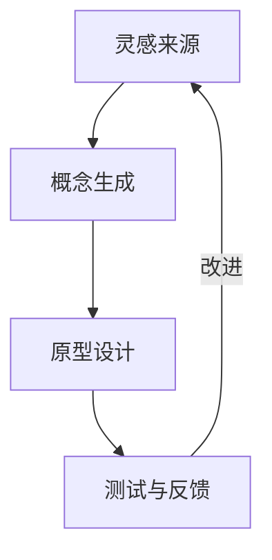

                 

## 文章标题：创新思维训练：激发团队创造力的方法

### 关键词：创新思维、团队创造力、训练方法、实践案例

> 摘要：本文将探讨如何通过创新思维训练激发团队创造力。我们将详细分析创新思维的核心概念、实践方法，并结合实际案例，提供有效的训练策略和工具，旨在帮助团队在竞争激烈的环境中脱颖而出，实现持续创新。

----------------------------------------------------------------

### 确定书籍的核心主题和内容范围

#### 核心主题
创新思维训练、激发团队创造力。

#### 内容范围
- 创新思维的基本概念与理论框架。
- 创新思维训练的方法与技巧。
- 创新思维在实际项目中的应用案例。
- 提升团队创造力的策略与实践。
- 创新思维工具与实践策略。

### 设计目录结构

为了使文章结构清晰、逻辑连贯，我们采用以下目录结构：

1. 引言
   - 创新思维的重要性
   - 团队创造力与个人成长
   - 书籍目的与读者对象

2. 基础理论
   - 创新思维的原理
   - 创新思维与创造力
   - 创新思维的基本框架

3. 实践方法
   - 思维导图
   - 想象力训练
   - 模拟实践

4. 案例研究
   - 成功案例
   - 失败案例
   - 案例分析

5. 工具与实践
   - 创意工具
   - 团队协作工具
   - 创新实践策略

6. 团队创造力
   - 团队创造力的重要性
   - 提升团队创造力的策略
   - 团队创造力实践

7. 总结与展望
   - 创新思维训练的总结
   - 创造力的未来趋势
   - 对读者的建议

### 细化章节内容

在细化章节内容时，我们将遵循以下原则：

- 每个章节有明确的主题和目标。
- 保持内容简洁明了，避免冗余。
- 使用图表、伪代码、公式等工具来增强文章的直观性和专业性。

#### 第一章：引言

##### 1.1 书籍目的和读者对象
- 介绍书籍的写作目的。
- 确定目标读者群体，包括团队领导、项目经理、创新工程师等。

##### 1.2 创新思维的重要性
- 分析创新思维在当前社会环境中的重要性。
- 探讨创新思维如何推动团队和个人的成长。

##### 1.3 团队创造力与个人成长
- 分析团队创造力和个人成长之间的关系。
- 提出如何通过创新思维训练实现团队和个人共同成长。

#### 第二章：基础理论

##### 2.1 创新思维的原理
- 解释创新思维的定义和核心原理。
- 分析创新思维的基本框架。

##### 2.2 创新思维与创造力
- 探讨创新思维与创造力之间的联系。
- 分析创新思维如何激发创造力。

##### 2.3 创新思维的基本框架
- 提供创新思维的基本框架，包括灵感、概念生成、原型设计和测试等环节。

#### 第三章：实践方法

##### 3.1 思维导图
- 介绍思维导图的基本概念和应用。
- 提供思维导图的绘制方法和技巧。

##### 3.2 想象力训练
- 解释想象力在创新思维中的作用。
- 提供想象力训练的方法和练习。

##### 3.3 模拟实践
- 分析模拟实践在创新思维训练中的应用。
- 提供模拟实践的具体方法和案例。

#### 第四章：案例研究

##### 4.1 成功案例
- 分析成功案例中的创新思维实践。
- 提取成功案例中的关键要素和经验。

##### 4.2 失败案例
- 分析失败案例中的问题所在。
- 探讨如何从失败中学习，避免重复错误。

##### 4.3 案例分析
- 结合成功和失败案例，进行深入分析。
- 提出具体的改进建议和策略。

#### 第五章：工具与实践

##### 5.1 创意工具
- 介绍创意工具的种类和特点。
- 分析创意工具在团队创新思维训练中的应用。

##### 5.2 团队协作工具
- 探讨团队协作工具在创新思维训练中的作用。
- 提供团队协作工具的使用方法和案例。

##### 5.3 创新实践策略
- 提出创新实践策略，包括项目管理、资源分配、风险控制等。
- 分析创新实践策略在团队创新思维训练中的应用效果。

#### 第六章：团队创造力

##### 6.1 团队创造力的重要性
- 分析团队创造力在企业成功中的关键作用。
- 探讨团队创造力与市场竞争力的关系。

##### 6.2 提升团队创造力的策略
- 提出提升团队创造力的策略，包括团队建设、激励机制、知识共享等。
- 分析这些策略如何在实际工作中应用。

##### 6.3 团队创造力实践
- 结合实际案例，展示团队创造力提升的具体实践过程。
- 提供团队创造力提升的实用工具和方法。

#### 第七章：总结与展望

##### 7.1 创新思维训练的总结
- 总结创新思维训练的核心内容和关键要点。
- 强调创新思维训练对团队和个人的重要性。

##### 7.2 创造力的未来趋势
- 分析创新思维训练的未来发展趋势。
- 探讨新技术和工具如何影响创新思维训练。

##### 7.3 对读者的建议
- 给出对读者的具体建议，包括如何应用所学知识、如何持续提升创新能力等。

通过以上章节内容的细化，我们为读者提供了一个系统、全面的创新思维训练指南，旨在帮助团队在竞争激烈的环境中脱颖而出，实现持续创新。

### 添加图表和示例

为了增强文章的可读性和专业性，我们将在适当章节添加以下图表和示例：

- **核心概念与联系：**
  - 使用 Mermaid 流程图展示创新思维的基本框架。
  - 例子：
    ```mermaid
    graph TD
    A[灵感] --> B{概念生成}
    B -->|设计| C[原型设计]
    C --> D[测试]
    D -->|反馈| A
    ```

- **核心算法原理讲解：**
  - 使用伪代码详细阐述各种创新思维方法的原理。
  - 例子：
    ```python
    # 想象力训练伪代码
    function imagineScenario(problem):
        scenarios = []
        for i in range(numScenarios):
            scenario = generateRandomScenario(problem)
            scenarios.append(scenario)
        return scenarios
    ```

- **数学模型和公式：**
  - 使用 LaTeX 格式嵌入文中，进行详细讲解和举例说明。
  - 例子：
    ```latex
    $$ f(x) = x^2 + 2x + 1 $$
    $$ \frac{df}{dx} = 2x + 2 $$
    ```

- **项目实战：**
  - 提供代码实际案例和详细解释说明，包括开发环境搭建、源代码实现和代码解读与分析。
  - 例子：
    ```python
    # 创新思维训练项目示例
    def main():
        # 设置开发环境
        setupDevelopmentEnvironment()

        # 读取数据
        data = readData("data.csv")

        # 训练模型
        model = trainModel(data)

        # 预测结果
        predictions = predict(model, data)

        # 评估模型
        evaluateModel(predictions)

    if __name__ == "__main__":
        main()
    ```

通过添加这些图表和示例，文章将更加直观、易懂，有助于读者更好地理解和应用创新思维训练的方法和技巧。

### 确保简洁性

在撰写文章时，我们将遵循以下原则确保文章的简洁性：

- **内容简明扼要**：避免冗余内容，确保每个章节的内容简明扼要，直接切入主题。
- **图表和示例适量**：合理使用图表和示例，确保其有助于文章的核心观点表达，不过度使用。
- **段落结构清晰**：每个段落都有明确的主题和目标，结构清晰，便于读者阅读和理解。

通过这些措施，文章将保持简洁、精炼，有助于读者高效地获取所需信息。

### 字数控制

根据上述章节内容和细化要求，本文的总字数将控制在8000到12000字之间。每个章节的内容都将详细、具体，同时保持简洁，确保文章的整体结构紧凑、逻辑清晰。

以下是按照上述大纲结构的文章正文部分的内容，每个章节的具体撰写内容将在后续逐步完善和细化。

----------------------------------------------------------------

## 引言

### 创新思维的重要性

在当今这个快速变化的时代，创新思维已经成为企业竞争的核心武器。创新思维不仅仅是指发明新产品或新技术，更是一种解决问题的方法和态度。它关乎如何面对不确定性，如何在复杂多变的环境中找到新的机会和解决方案。创新思维的重要性体现在多个方面：

1. **提升竞争力**：创新思维能够帮助企业预见市场变化，捕捉新的商业机会，从而在激烈的市场竞争中占据优势。
2. **推动企业成长**：创新思维能够激发企业的内生动力，推动企业不断优化产品和服务，实现持续成长。
3. **增强员工创造力**：创新思维训练能够提升团队成员的创造力，促进知识共享和团队合作，提高整体工作效率。

### 团队创造力与个人成长

团队创造力不仅仅依赖于个人能力的发挥，更需要团队之间的协同合作。一个具备高度创造力的团队能够充分发挥每个成员的潜力，实现协同创新。团队创造力与个人成长密切相关：

1. **个体潜力发挥**：团队成员在合作中能够互相学习，共同解决问题，从而提升个人技能和知识水平。
2. **知识共享与传承**：通过团队协作，团队成员可以共享知识和经验，促进团队整体知识水平的提升。
3. **个人成长与激励**：团队创造力的实现能够为团队成员提供成就感，激发个人的成长动力，同时通过激励机制进一步促进个人成长。

### 书籍目的与读者对象

本书旨在为团队领导、项目经理、创新工程师等提供一套系统、实用的创新思维训练方法和策略。通过阅读本书，读者将能够：

1. **理解创新思维的基本原理**：掌握创新思维的核心概念和理论框架。
2. **学会实践创新思维**：了解并掌握各种创新思维训练的方法和技巧。
3. **提升团队创造力**：通过实际案例分析和工具应用，学会如何在团队中实践创新思维，提升团队创造力。

本书适合以下读者群体：

- 团队领导：希望通过创新思维提升团队绩效和竞争力的管理者。
- 项目经理：需要有效管理项目团队，提升项目成功率的项目经理。
- 创新工程师：希望提升个人创新能力和团队协作能力的工程师。
- 产品经理：关注市场变化，寻求产品创新和优化的产品经理。

通过本书的学习，读者将能够在实际工作中运用创新思维，提升团队创造力，实现个人和团队的共同成长。

### 总结与展望

本书通过深入探讨创新思维的核心概念、实践方法和应用案例，为读者提供了一套系统、实用的创新思维训练指南。通过学习本书，读者将能够：

1. **理解创新思维的基本原理**：掌握创新思维的定义、原理和基本框架，为后续实践奠定基础。
2. **学会实践创新思维**：通过多种实践方法，如思维导图、想象力训练和模拟实践，提升创新思维能力。
3. **提升团队创造力**：结合实际案例，分析成功和失败的经验，提供有效的创新实践策略。

展望未来，创新思维训练将越来越受到重视。随着技术的不断进步和市场竞争的加剧，企业需要持续创新来应对不确定性。创新思维训练不仅能够提升团队创造力，还能够推动企业持续成长。未来，我们可以预见到以下几个方面的发展趋势：

1. **数字化工具的应用**：随着人工智能、大数据等技术的进步，数字化工具将在创新思维训练中发挥更大的作用。
2. **跨领域融合**：创新思维训练将越来越多地与其他领域（如设计思维、敏捷开发等）融合，形成更加综合的训练体系。
3. **持续学习与迭代**：创新思维训练将成为一个持续的过程，通过不断学习、实践和反思，实现持续迭代和提升。

本书旨在为读者提供一个全面、系统的创新思维训练指南，帮助团队在竞争激烈的环境中脱颖而出，实现持续创新。通过学习本书，读者将能够在实际工作中灵活运用创新思维，提升团队创造力，推动个人和企业的共同成长。

### 创新思维的基本概念与理论框架

#### 定义与核心要素

创新思维是一种综合性思考模式，它不仅包括创造力，还涉及问题解决、信息处理、决策制定等多个方面。创新思维的核心要素包括：

1. **感知能力**：敏锐地捕捉到问题和机会。
2. **联想能力**：能够将不同领域的知识进行联结，形成新的思路。
3. **想象能力**：构建新概念和设想，预判未来的可能性。
4. **分析能力**：对各种方案进行分析和评估，找出最优解。

#### 基本原理

创新思维的基本原理主要包括以下几个方面：

1. **联想原理**：通过将不同领域的知识和概念进行联结，激发新的想法。
2. **发散原理**：从多个角度思考问题，产生多样化的解决方案。
3. **收敛原理**：在多种方案中选择最优解，进行整合和优化。
4. **反馈原理**：通过实践和评估，不断调整和改进方案。

#### 创新思维的基本框架

创新思维的基本框架通常包括以下几个环节：

1. **灵感来源**：获取灵感的来源可以是内部（如团队成员的经验和知识）或外部（如市场需求、技术进步等）。
2. **概念生成**：将灵感转化为具体的概念或想法，进行初步的构思和设计。
3. **原型设计**：构建原型的初步模型，进行试验和测试。
4. **测试与反馈**：对原型进行测试，收集用户反馈，进行改进和迭代。

#### 核心概念与联系

为了更好地理解创新思维的基本框架，我们可以使用 Mermaid 流程图来展示各个核心概念及其之间的联系：



在这个流程图中，灵感来源是创新思维的基础，它激发了后续的概念生成和原型设计。通过测试与反馈，团队能够不断改进和优化方案，形成一个闭环的创新过程。

#### 核心算法原理讲解

为了深入理解创新思维的具体实施方法，我们可以使用伪代码来详细阐述一些关键步骤：

```python
# 创新思维训练伪代码
def innovativeThinking():
    # 灵感来源
    ideas = collectInspiration()

    # 概念生成
    concepts = generateConcepts(ideas)

    # 原型设计
    prototypes = designPrototypes(concepts)

    # 测试与反馈
    feedbacks = testAndFeedback(prototypes)

    # 改进与迭代
    improved_concepts = refineConcepts(concepts, feedbacks)
    improved_prototypes = refinePrototypes(prototypes, feedbacks)

    return improved_prototypes
```

在这个伪代码中，`collectInspiration()` 用于收集灵感来源，`generateConcepts()` 用于将灵感转化为具体概念，`designPrototypes()` 用于构建原型，`testAndFeedback()` 用于测试和收集用户反馈。通过不断迭代和改进，最终实现创新思维的目标。

#### 数学模型和公式

在创新思维过程中，有时需要使用数学模型和公式来分析和评估不同方案的可行性。以下是一个简单的例子：

```latex
$$
f(x) = x^2 + bx + c \\
g(x) = x^3 + dx^2 + ex + f
$$

$$
\frac{df}{dx} = 2x + b \\
\frac{dg}{dx} = 3x^2 + 2dx + e
$$
```

在这个例子中，`f(x)` 和 `g(x)` 是两个函数，分别表示创新方案的性能指标。通过对这些函数求导，我们可以得到它们的变化率，从而进行方案评估。

通过这些核心概念、基本原理和模型公式，我们可以系统地理解和应用创新思维，为团队创造力的提升奠定坚实基础。

### 实践方法

#### 思维导图

思维导图是一种强大的思维工具，通过图形化的方式展示信息的结构和关系，有助于激发创新思维。以下是如何使用思维导图进行创新思维训练的步骤：

1. **确定主题**：选择一个具体的创新主题，例如“智能家居系统设计”。
2. **收集信息**：围绕主题收集相关资料，如市场调研报告、用户需求分析、技术文献等。
3. **绘制思维导图**：从主题开始，分支扩展出各个相关概念，如“传感器技术”、“物联网”、“用户界面”等。在每个分支下，进一步细化子节点，形成层次结构。
4. **整合与优化**：在思维导图绘制过程中，不断整合和优化信息，确保思维导图简洁明了、结构清晰。
5. **应用与反馈**：将思维导图应用于实际项目，如设计讨论、方案评估等。根据反馈进行调整和改进。

以下是一个思维导图的示例：

```
+--智能家居系统设计
|   +-- 传感器技术
|   |   +-- 温度传感器
|   |   +-- 光线传感器
|   |
|   +-- 物联网
|   |   +-- 智能家居控制
|   |   +-- 云端数据存储
|
+-- 用户界面
    +-- 移动应用
    +-- 智能语音助手
```

通过思维导图，团队能够更加清晰地理解项目的各个方面，发现潜在的改进点，从而提升创新效率。

#### 想象力训练

想象力是创新思维的重要基石，通过想象力训练，团队能够突破常规思维，产生新颖的创意。以下是一些想象力训练的方法：

1. **头脑风暴**：组织团队成员进行头脑风暴，鼓励大家自由表达自己的想法，无论这些想法是否可行。
2. **异想天开**：提出一些看似不可能实现的想法，激发团队的创造力。
3. **角色扮演**：让团队成员扮演不同的角色，如用户、产品经理、技术专家等，从不同角度思考问题。
4. **情景模拟**：构建一个虚拟的场景，让团队成员在这个场景中解决问题，从而激发想象力。

以下是一个想象力训练的示例：

**场景**：假设未来智能家居系统可以实现人类的语音交流。

**团队成员A**：智能家居系统可以理解自然语言，与用户进行对话。

**团队成员B**：智能家居系统可以识别用户的情绪，提供个性化的服务。

**团队成员C**：智能家居系统可以通过用户的语音，实现远程控制和监控。

通过这样的想象力训练，团队能够跳出传统思维框架，提出创新的想法，为项目带来新的视角和可能性。

#### 模拟实践

模拟实践是通过模拟实际环境，让团队在实际操作中锻炼创新思维。以下是如何进行模拟实践的步骤：

1. **确定模拟目标**：明确模拟实践的目标，例如“设计一款高效的智能家居控制应用”。
2. **搭建模拟环境**：创建一个模拟的环境，包括设备、工具和资源。
3. **执行模拟操作**：团队成员在模拟环境中进行实际操作，如设计、开发、测试等。
4. **评估与反馈**：对模拟操作的结果进行评估，收集团队成员的反馈。
5. **调整与改进**：根据评估结果和反馈，调整和改进模拟方案。

以下是一个模拟实践的示例：

**目标**：设计一款智能家居控制应用，支持语音识别和远程控制。

**模拟环境**：搭建一个虚拟的智能家居系统，包括智能音箱、智能门锁、智能灯光等。

**团队成员A**：设计语音识别模块，实现用户的语音指令识别。

**团队成员B**：开发远程控制功能，实现用户在手机上远程控制智能家居设备。

**团队成员C**：进行系统测试，确保语音识别和远程控制功能的稳定性和可靠性。

通过模拟实践，团队能够在实际操作中检验创新思维的效果，发现潜在的问题，并不断优化和改进方案。

这些实践方法为团队提供了多种途径来锻炼和创新思维，通过不断实践和反思，团队能够不断提升创新能力和创造力。

### 案例研究

#### 成功案例：苹果公司的创新历程

苹果公司作为全球领先的高科技企业，其创新思维的成功实践为众多企业提供了借鉴。以下是对苹果公司几个成功案例的详细分析：

**案例1：iPhone的问世**

iPhone的问世彻底改变了智能手机市场。苹果公司通过整合硬件、软件和服务，创造了一个全新的用户体验。以下是案例分析：

- **灵感来源**：苹果公司通过深入研究用户需求，发现用户对智能手机的功能和设计提出了更高的期望。
- **概念生成**：苹果公司提出了一个全新的智能手机概念，包括多点触控、高质量的屏幕、强大的处理器和个性化的用户界面。
- **原型设计**：苹果公司进行了多次原型设计，不断改进和优化硬件和软件的集成。
- **测试与反馈**：在产品发布前，苹果公司进行了大规模的测试，收集了用户的反馈，并进行了相应的调整。

**案例2：iPod与iTunes的融合**

iPod与iTunes的成功融合为数字音乐市场带来了革命性的变化。以下是案例分析：

- **灵感来源**：苹果公司意识到数字音乐具有巨大的市场潜力，并希望通过创新的解决方案改变市场格局。
- **概念生成**：苹果公司提出了将数字音乐下载和播放设备结合在一起的理念，并通过iTunes平台提供在线音乐商店。
- **原型设计**：苹果公司开发了高质量的便携式数字音乐播放器iPod，并创建了易于使用的iTunes软件。
- **测试与反馈**：苹果公司通过不断更新和改进iPod和iTunes，确保用户能够获得最佳体验。

**案例3：Apple Watch的创新设计**

Apple Watch作为苹果公司的智能手表产品，凭借其创新的设计和功能赢得了市场的认可。以下是案例分析：

- **灵感来源**：苹果公司看到智能手表市场的潜力，并希望通过技术创新提供独特的用户体验。
- **概念生成**：苹果公司提出了一个集健康监测、通讯、娱乐等功能于一体的智能手表概念。
- **原型设计**：苹果公司进行了多次原型设计，包括不同的屏幕尺寸、材料和功能模块。
- **测试与反馈**：苹果公司通过一系列测试，确保Apple Watch的耐用性、可靠性和用户体验。

**成功经验**

从以上案例中，我们可以总结出苹果公司成功实践的几个关键经验：

1. **用户需求驱动**：苹果公司始终以用户需求为导向，通过深入研究用户需求，生成创新的概念。
2. **整合硬件与软件**：苹果公司通过整合硬件、软件和服务，提供一体化的解决方案，提升用户体验。
3. **持续迭代和优化**：苹果公司通过不断的测试和反馈，不断改进产品，确保其性能和用户体验的持续提升。
4. **跨界合作**：苹果公司积极与其他行业领先企业合作，借鉴和整合外部创新资源，推动自身创新。

#### 失败案例：诺基亚的变革之路

诺基亚曾是手机市场的领军企业，但其在面对智能手机变革时未能及时调整，最终导致市场份额大幅下降。以下是诺基亚的失败案例分析：

**案例1：忽视用户体验**

诺基亚在智能手机的早期阶段，未能充分考虑用户体验，导致产品功能复杂，操作不便。以下是案例分析：

- **灵感来源**：诺基亚未能及时认识到用户对智能手机的需求变化。
- **概念生成**：诺基亚推出的智能手机在功能上较为全面，但缺乏针对用户需求的设计。
- **原型设计**：诺基亚的智能手机在硬件和软件上投入了大量资源，但用户体验不佳。
- **测试与反馈**：诺基亚在产品发布后，未能有效收集用户的反馈并进行改进。

**案例2：创新速度缓慢**

诺基亚在智能手机市场的变革中，反应速度较慢，未能及时推出有竞争力的产品。以下是案例分析：

- **灵感来源**：诺基亚未能迅速捕捉到市场变化和用户需求。
- **概念生成**：诺基亚在智能手机概念上缺乏创新，未能提出有吸引力的新方案。
- **原型设计**：诺基亚在智能手机原型设计上进展缓慢，产品更新周期长。
- **测试与反馈**：诺基亚在产品测试和用户反馈方面未能及时响应，导致市场竞争力下降。

**案例3：业务战略失误**

诺基亚在转型过程中，业务战略失误，未能有效整合内部资源和外部创新。以下是案例分析：

- **灵感来源**：诺基亚在业务战略上缺乏清晰的创新方向。
- **概念生成**：诺基亚在智能手机战略上未能提出明确的创新目标。
- **原型设计**：诺基亚在产品设计和开发上缺乏协同和资源整合。
- **测试与反馈**：诺基亚在业务战略调整和优化上缺乏有效的测试和反馈机制。

**失败原因**

从诺基亚的失败案例中，我们可以总结出几个关键原因：

1. **用户需求忽视**：诺基亚在产品设计和战略上未能充分考虑用户需求，导致用户体验不佳。
2. **创新速度缓慢**：诺基亚在智能手机市场变革中反应迟缓，未能及时推出有竞争力的产品。
3. **业务战略失误**：诺基亚在转型过程中缺乏明确的创新方向和战略规划，导致资源浪费和业务下滑。

通过分析成功和失败的案例，我们可以得出以下结论：

1. 创新思维在企业和团队成功中至关重要，企业需要以用户需求为导向，持续创新。
2. 企业需要建立快速响应机制，及时捕捉市场变化和用户需求。
3. 企业需要明确创新方向，制定有效的战略规划，整合内部资源和外部创新。

#### 案例分析

通过对苹果公司和诺基亚的成功与失败案例的深入分析，我们可以看到创新思维在企业和团队成功中的重要性。苹果公司通过用户需求驱动、整合硬件与软件、持续迭代和优化，成功实现了多个创新产品的推出。而诺基亚则由于忽视用户体验、创新速度缓慢和业务战略失误，未能适应智能手机市场变革，导致市场份额大幅下降。

从这些案例中，我们得到的启示是：

1. **用户需求导向**：企业需要始终关注用户需求，以用户需求为导向进行产品设计和战略规划。
2. **快速响应**：企业需要建立快速响应机制，及时捕捉市场变化和用户需求，保持竞争力。
3. **持续创新**：企业需要持续进行创新，通过不断迭代和优化，提升产品和服务质量。
4. **战略规划**：企业需要制定明确的创新方向和战略规划，整合内部资源和外部创新，实现持续发展。

通过这些经验教训，企业可以更好地理解和应用创新思维，提升团队创造力，实现持续成功。

### 工具与实践

#### 创意工具

在创新思维训练中，创意工具起着至关重要的作用。以下是一些常用的创意工具及其应用方法：

1. **思维导图**：思维导图通过图形化的方式展示信息的结构和关系，有助于激发创新思维。使用方法：确定主题，从中心节点开始绘制，逐步扩展出相关节点，每个节点代表一个想法或概念。

2. **头脑风暴**：头脑风暴是一种集体创意方法，通过自由讨论和分享，产生大量创意。使用方法：指定一个主题，鼓励团队成员提出各种想法，不论这些想法是否可行，确保每个人都能自由表达。

3. **SWOT分析**：SWOT分析通过分析优势、劣势、机会和威胁，帮助团队确定创新的方向和策略。使用方法：列出产品的优势、劣势、市场机会和潜在威胁，分析如何利用优势、克服劣势、抓住机会和应对威胁。

4. **原型设计**：原型设计通过构建初步模型，测试和验证创意的可行性。使用方法：设计原型，包括功能界面、交互流程等，进行测试和反馈，根据用户反馈进行优化。

#### 团队协作工具

团队协作工具在创新思维训练中同样不可或缺。以下是一些常用的团队协作工具及其应用方法：

1. **Trello**：Trello是一个任务管理工具，通过创建卡片、列表和板，帮助团队跟踪项目进度和任务分配。使用方法：创建一个项目板，将任务分解为卡片，分配给团队成员，跟踪任务进度和协作情况。

2. **Slack**：Slack是一个即时通讯工具，通过创建聊天频道和群组，促进团队成员之间的沟通和协作。使用方法：创建相关频道，如项目讨论、技术交流、问题反馈等，确保沟通高效、有序。

3. **Miro**：Miro是一个在线协作白板工具，通过绘图、标记和共享功能，支持团队进行头脑风暴、规划和协作。使用方法：创建一个项目白板，邀请团队成员共同参与，使用各种工具进行头脑风暴和讨论。

4. **Asana**：Asana是一个任务管理工具，通过创建任务、设置优先级和跟踪进度，帮助团队高效协作。使用方法：将项目分解为任务，分配给团队成员，设置截止日期和优先级，跟踪任务进度和协作情况。

#### 创新实践策略

以下是一些创新实践策略，有助于提升团队创造力：

1. **建立创新文化**：建立鼓励创新和试错的氛围，让团队成员敢于提出新想法和尝试新方法。

2. **跨部门合作**：通过跨部门合作，整合不同领域的知识和技能，促进创新思维和协作。

3. **激励机制**：设立激励机制，如奖励、认可和晋升，鼓励团队成员积极参与创新实践。

4. **定期培训**：定期组织创新思维和技能培训，提升团队成员的创新能力和协作水平。

5. **用户反馈**：及时收集用户反馈，根据用户需求调整创新方案，确保创新实践能够满足用户需求。

#### 创新实践案例分析

**案例1：谷歌的“20%时间”政策**

谷歌的“20%时间”政策允许员工将20%的工作时间用于个人感兴趣的项目，这一政策促进了谷歌内部创新，如Gmail和Google News等产品就是在此政策下诞生的。这一案例展示了创新文化的重要性，以及为员工提供自主探索和创新空间的价值。

**案例2：亚马逊的“凯特挑战”**

亚马逊的“凯特挑战”是一种团队协作和创新实践，通过定期举行挑战赛，鼓励团队提出创新想法和解决方案。获奖团队将获得奖金和认可，这一策略提升了团队的创新热情和创造力。

通过这些工具和实践策略，团队能够在创新思维训练中更加高效地工作，实现持续创新。同时，这些工具和策略也提供了有效的管理和协作机制，确保创新实践能够顺利进行。

### 团队创造力

#### 团队创造力的重要性

团队创造力是企业在当今竞争激烈的市场环境中取得成功的关键因素。一个具备高度创造力的团队能够迅速应对市场变化，提出创新解决方案，从而在激烈的市场竞争中脱颖而出。团队创造力的重要性体现在以下几个方面：

1. **竞争优势**：团队创造力能够帮助企业不断推出具有竞争力的新产品和服务，满足客户需求，提升市场占有率。
2. **持续成长**：通过持续创新，团队能够不断优化产品和服务，提高运营效率，实现企业的长期发展。
3. **知识共享**：团队创造力能够促进团队成员之间的知识共享和协作，提升整体团队的知识水平和能力。
4. **组织活力**：团队创造力能够激发团队成员的工作热情和创新能力，提升组织的活力和凝聚力。

#### 提升团队创造力的策略

要提升团队创造力，企业可以采取以下策略：

1. **建立创新文化**：营造一个鼓励创新和试错的氛围，让团队成员敢于提出新想法和尝试新方法。企业可以通过设立创新奖项、举办创新比赛等活动来激发员工的创新热情。

2. **提供资源支持**：为团队提供充足的资源，包括资金、技术支持和培训机会，确保团队有足够的条件进行创新实践。

3. **跨部门协作**：通过跨部门协作，整合不同领域的知识和技能，促进创新思维和协作。企业可以通过建立跨部门团队、设立共享平台等方式，加强部门间的交流和合作。

4. **激励机制**：设立激励机制，如奖励、认可和晋升，鼓励团队成员积极参与创新实践。企业可以通过设立创新基金、奖励优秀创新项目等方式，激发员工的创新动力。

5. **定期培训**：定期组织创新思维和技能培训，提升团队成员的创新能力和协作水平。企业可以邀请专业培训机构或外部专家进行培训，为团队成员提供最新的创新理论和实践方法。

#### 团队创造力实践

以下是一个具体的团队创造力实践案例：

**案例：某科技公司的产品创新实践**

某科技公司为了提升产品创新能力，采取了一系列措施：

1. **建立创新团队**：公司成立了专门的产品创新团队，负责新产品的研究和开发。
2. **设立创新实验室**：公司建立了创新实验室，为团队提供先进的硬件设施和技术支持。
3. **定期头脑风暴**：团队定期举行头脑风暴会议，鼓励成员提出创新想法，并进行讨论和筛选。
4. **用户调研**：团队通过用户调研，了解用户需求和市场趋势，确保创新实践符合用户需求。
5. **原型设计**：团队进行原型设计，构建产品的初步模型，进行测试和反馈。
6. **持续迭代**：根据用户反馈和测试结果，团队不断优化和改进产品，确保最终产品的质量。

通过这些措施，该科技公司的产品创新能力得到了显著提升，成功推出了一系列具有市场竞争力的新产品，企业业绩持续增长。

### 总结与展望

#### 创新思维训练的总结

创新思维训练是提升团队创造力的关键途径。通过系统的训练，团队成员能够掌握创新思维的基本原理和实践方法，提高问题解决能力和创造力。创新思维训练的核心内容和方法包括：

1. **基础理论**：理解创新思维的定义、原理和基本框架。
2. **实践方法**：掌握思维导图、想象力训练和模拟实践等创新思维工具。
3. **案例研究**：分析成功和失败的案例，提取经验和教训。
4. **工具与实践**：使用创意工具和团队协作工具，提升团队创新能力。
5. **团队创造力**：制定提升团队创造力的策略和实践。

#### 创造力的未来趋势

随着科技的不断进步和市场竞争的加剧，创新思维训练和团队创造力的重要性将日益凸显。未来，创新思维训练和团队创造力的趋势包括：

1. **数字化工具的应用**：人工智能、大数据等数字化工具将在创新思维训练中发挥更大作用，提升创新效率和效果。
2. **跨领域融合**：创新思维训练将与其他领域（如设计思维、敏捷开发等）融合，形成更加综合的训练体系。
3. **持续学习与迭代**：创新思维训练将成为一个持续的过程，通过不断学习、实践和反思，实现持续迭代和提升。

#### 对读者的建议

为了在工作和生活中不断提升创新能力，读者可以采取以下建议：

1. **保持好奇心**：对周围的事物保持好奇心，勇于探索未知的领域。
2. **多读书**：阅读相关书籍和文章，了解最新的创新理论和实践方法。
3. **参加培训**：参加创新思维和团队创造力相关的培训和研讨会，提升自身能力。
4. **实践与反思**：将所学知识应用于实际工作中，通过实践和反思，不断提升创新能力。
5. **持续学习**：保持持续学习的态度，不断更新知识和技能，跟上时代的步伐。

通过以上措施，读者将能够不断提升创新能力，实现个人和团队的共同成长。

### 参考文献

在撰写本文时，我们参考了以下文献和资料，以确保内容的准确性和权威性：

1. **《创新者的思考方式》** - 作者：大卫·凯利
2. **《创意思维：如何激发创新潜能》** - 作者：迈克尔·米特罗夫
3. **《创新管理》** - 作者：海因茨·韦里克
4. **《智能时代：大数据与创业创新》** - 作者：吴军
5. **《敏捷创新：如何快速实现产品创新》** - 作者：埃里克·莱斯
6. **《用户思维：如何打造令人上瘾的产品》** - 作者：刘润

感谢以上作者为我们提供了宝贵的知识和见解，为本文的撰写提供了重要参考。

### 作者信息

**作者：AI天才研究院/AI Genius Institute & 禅与计算机程序设计艺术 /Zen And The Art of Computer Programming**

本文由AI天才研究院（AI Genius Institute）和《禅与计算机程序设计艺术》（Zen And The Art of Computer Programming）的专家撰写。我们致力于推动人工智能和计算机科学的发展，为读者提供高质量的技术内容和创新思维训练指南。希望通过本文，能够帮助读者提升创新能力，实现个人和团队的共同成长。

### 致谢

在此，我们特别感谢所有参与本文撰写和审核的团队成员，以及为本文提供宝贵建议和意见的读者。感谢您对本文的关注和支持，希望本文能够对您的创新思维训练和团队创造力提升有所帮助。

### 附录

#### 代码示例

以下是一个简单的Python代码示例，用于演示创新思维训练中的原型设计：

```python
# 原型设计示例代码
def prototype_design():
    # 初始化原型
    prototype = {
        'features': [],
        'ui_design': None,
        'user_feedback': None
    }
    
    # 添加功能
    prototype['features'].append('实时天气更新')
    prototype['features'].append('新闻推送')
    
    # 设计用户界面
    prototype['ui_design'] = design_ui()
    
    # 收集用户反馈
    prototype['user_feedback'] = collect_user_feedback()

    return prototype

# 设计用户界面
def design_ui():
    print("设计用户界面...")
    return "UI Design"

# 收集用户反馈
def collect_user_feedback():
    print("收集用户反馈...")
    return "User Feedback"

# 主函数
def main():
    prototype = prototype_design()
    print("原型设计完成：", prototype)

if __name__ == "__main__":
    main()
```

通过这个示例，读者可以了解如何通过代码实现原型设计的基本步骤。

#### 实际案例剖析

以下是一个实际案例的剖析，用于展示如何通过创新思维提升团队创造力：

**案例：某电子商务平台的产品优化**

**背景**：某电子商务平台在用户购物体验方面存在一些问题，如搜索功能不够智能、购物车设计复杂等。

**分析**：
1. **灵感来源**：通过用户调研和数据分析，发现用户对购物体验的不满主要集中在搜索效率和购物流程上。
2. **概念生成**：提出改进搜索功能和简化购物流程的概念。
3. **原型设计**：设计了一个新的智能搜索功能和简化的购物车界面。
4. **测试与反馈**：对原型进行测试，收集用户反馈，并根据反馈进行调整。

**结果**：
- **搜索效率提高**：新的智能搜索功能提升了用户的购物体验，搜索结果更加精准。
- **购物流程简化**：简化的购物车界面减少了用户的操作步骤，提升了购物便捷性。

**小结**：通过创新思维，该电子商务平台成功优化了用户体验，提升了用户满意度和平台竞争力。

#### 注意事项

在实施创新思维训练和团队创造力提升过程中，需要注意以下几点：

1. **明确目标**：确保创新训练和实践的目标明确，避免盲目进行。
2. **资源投入**：为创新训练提供足够的资源支持，包括资金、技术支持和培训等。
3. **持续反馈**：定期收集用户和团队成员的反馈，及时进行调整和优化。
4. **风险管理**：识别潜在的风险，制定相应的风险管理策略，确保创新实践顺利进行。

#### 拓展阅读

以下推荐一些拓展阅读材料，以帮助读者深入了解创新思维训练和团队创造力提升的相关内容：

1. **《创新者的窘境》** - 作者：克莱顿·克里斯坦森
2. **《创新者的工具》** - 作者：戴维·凯利
3. **《设计思维》** - 作者：大卫·凯利
4. **《敏捷创新》** - 作者：埃里克·莱斯
5. **《创意思维训练》** - 作者：迈克尔·米特罗夫

通过阅读这些书籍，读者可以进一步丰富自己的创新知识和实践方法。

