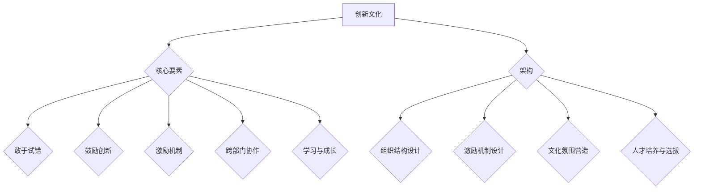

                 

### 文章标题：创新文化营造：鼓励试错与创新的方法

#### 关键词：
创新文化、鼓励试错、组织成功、创新激励、跨部门协作、学习成长

#### 摘要：
本文旨在探讨如何在组织中营造一种创新文化，特别是鼓励试错和创新的方法。通过分析创新文化的定义、核心要素、架构，本文提出了一系列策略与方法，如试错策略、创新激励方法、跨部门协作与学习成长等，并借助实际案例进行了深入剖析。文章旨在为管理者和技术团队提供实用的指导，帮助他们在组织中推动创新，实现持续发展。

---

## 第一部分：创新文化概述

### 1.1 创新文化的定义与重要性

**创新文化** 是指组织内部对创新活动的态度、价值观和行为模式的总和。它不仅包括对创新的重视程度，还包括对创新失败的容忍度、对创新的激励机制以及创新流程的优化。

#### 创新文化的定义

创新文化不仅仅是一种口号或标语，它是一种深植于组织内部的文化现象，包括以下几个方面：

1. **开放性**：鼓励员工提出新想法，无论这些想法是否成熟或具有可行性。
2. **实验性**：组织对失败持开放态度，认为失败是创新过程中的必经之路。
3. **共享性**：创新成果和经验在组织内得到广泛分享，以提高整体创新能力。
4. **灵活性**：组织结构和文化能够快速适应新的创新需求，如调整工作流程、培训员工等。

#### 创新文化的重要性

创新文化对组织的成功至关重要。以下是创新文化的重要性体现在几个方面：

1. **增强竞争力**：在快速变化的市场环境中，创新文化能够帮助组织保持竞争力，快速应对市场变化。
2. **提高员工满意度**：创新文化鼓励员工积极参与创新，提高工作满意度和忠诚度。
3. **促进知识共享**：创新文化促进员工之间知识的交流与共享，提高组织的整体知识水平。
4. **提升创新能力**：创新文化为员工提供了一个自由探索和实验的环境，从而提升整个组织的创新能力。

#### 创新文化与组织成功的关系

创新文化直接影响组织的成功。研究表明，拥有创新文化的组织在以下几个方面表现出色：

1. **更高的营业收入**：创新文化能够带来新的产品和服务，从而提高组织的营业收入。
2. **更好的市场表现**：创新文化能够帮助组织在竞争激烈的市场中占据有利位置。
3. **更高的员工生产力**：创新文化激发员工的创造力，提高员工的生产力。
4. **更低的员工流失率**：创新文化能够提高员工的工作满意度，从而降低员工流失率。

### 1.2 创新文化的核心要素

创新文化由多个核心要素构成，这些要素相互作用，共同促进创新的发展。以下是创新文化的几个核心要素：

#### 敢于试错

**敢于试错** 是创新文化的重要特征。在创新过程中，失败是不可避免的，但创新文化鼓励员工将失败视为学习和成长的机会，而不是回避或惩罚。

1. **试错的定义**：试错是指在不确定的情况下，通过实验来检验假设和理论的过程。
2. **试错的价值**：试错能够帮助组织快速识别成功的路径，避免走弯路，从而提高创新效率。
3. **试错的局限**：尽管试错具有重要意义，但过度试错可能导致资源浪费和员工士气低落。

#### 鼓励创新

**鼓励创新** 是创新文化的核心。创新文化需要为员工提供宽松的环境，让他们能够自由地探索和尝试新想法。

1. **创新的定义**：创新是指创造新的产品、服务或过程，从而满足市场需求或提高组织效率。
2. **创新的价值**：创新能够带来新的增长点和竞争优势，从而提高组织的市场地位。
3. **鼓励创新的策略**：组织可以通过提供奖励、设立创新实验室、鼓励跨部门合作等方式来鼓励创新。

#### 激励机制

**激励机制** 是创新文化的重要组成部分。合理的激励机制能够激发员工的创新动力，提高创新能力。

1. **薪酬激励**：通过提供具有竞争力的薪酬来激励员工，特别是那些在创新方面表现出色的员工。
2. **荣誉激励**：通过设立奖项、表彰等方式来认可员工的创新成果，提高员工的荣誉感和自豪感。
3. **职业发展**：为员工提供职业发展的机会，特别是那些在创新方面有潜力的员工。

#### 跨部门协作

**跨部门协作** 是创新文化的重要特征。创新往往需要不同部门之间的紧密合作，跨部门协作能够提高创新的效率和质量。

1. **跨部门协作的定义**：跨部门协作是指不同部门之间的合作，以实现共同的目标。
2. **跨部门协作的优势**：跨部门协作能够汇集不同部门的智慧和资源，提高创新的效率和质量。
3. **跨部门协作的挑战**：跨部门协作面临文化差异、沟通障碍等挑战，需要有效的机制来克服。

#### 学习与成长

**学习与成长** 是创新文化的重要要素。创新文化需要为员工提供学习和成长的机会，以提升他们的创新能力和专业知识。

1. **学习的定义**：学习是指通过获取知识、技能和经验来提升个人或组织的水平。
2. **学习与成长的价值**：学习与成长能够提高员工的综合素质，从而提高组织的整体创新能力。
3. **学习与成长的方法**：组织可以通过培训、研讨会、内部交流等方式来促进员工的学习与成长。

### 1.3 创新文化的架构

创新文化的构建需要从多个方面进行，包括组织结构设计、激励机制设计、文化氛围营造和人才培养与选拔。以下是创新文化的架构：

#### 组织结构设计

**组织结构设计** 对创新文化的形成具有重要影响。组织结构需要适应创新文化的要求，如减少层级、提高决策效率等。

1. **扁平化组织结构**：扁平化的组织结构能够减少沟通成本，提高决策效率，从而促进创新。
2. **矩阵式组织结构**：矩阵式组织结构能够实现跨部门协作，提高创新的效率和质量。

#### 激励机制设计

**激励机制设计** 是创新文化的重要部分。激励机制需要与组织的创新目标相一致，以激发员工的创新动力。

1. **绩效考核**：通过绩效考核来评价员工的工作绩效，特别是那些在创新方面有突出贡献的员工。
2. **奖励制度**：通过设立奖励制度来激励员工，如创新奖金、荣誉证书等。

#### 文化氛围营造

**文化氛围营造** 对创新文化的形成具有重要影响。组织需要营造一种鼓励创新、容忍失败的文化氛围。

1. **开放沟通**：通过开放沟通来促进信息的流动，提高创新的效率和质量。
2. **分享经验**：通过分享经验来促进员工之间的知识共享，提高组织的整体创新能力。

#### 人才培养与选拔

**人才培养与选拔** 是创新文化的重要部分。组织需要培养和选拔那些具有创新能力和潜力的员工。

1. **培训与发展**：通过培训和发展来提高员工的创新能力和专业知识。
2. **选拔机制**：通过选拔机制来识别和培养具有创新潜力的员工。

---

以上是第一部分的概述，下一部分将深入探讨鼓励试错的策略与方法。

---

### 第二部分：鼓励试错的策略与方法

在创新过程中，试错是不可或缺的一部分。通过试错，组织可以在不确定的情况下探索新的可能性，从而找到成功的路径。本部分将详细探讨鼓励试错的策略与方法，帮助组织在创新过程中更加高效地利用试错。

#### 2.1 试错的定义与价值

**试错** 是指在不确定的情况下，通过实验来检验假设和理论的过程。试错的核心思想是在实践中不断尝试和调整，以找到最佳的解决方案。

1. **试错的定义**：试错是一种通过实验和反馈来学习和改进的过程。它不仅仅是指失败，更是指通过失败来获取有价值的经验和教训。
2. **试错的价值**：试错在创新过程中具有巨大的价值。首先，试错能够帮助组织快速识别成功的路径，避免走弯路。其次，试错能够提高组织的适应能力，使其能够在快速变化的市场环境中保持竞争力。最后，试错能够培养员工的创新精神和解决问题的能力。

3. **试错的局限**：尽管试错具有重要意义，但过度试错可能导致资源浪费和员工士气低落。因此，组织在鼓励试错的同时，也需要建立合理的试错机制，确保试错的有效性和效率。

#### 2.2 试错策略

**试错策略** 是指组织在创新过程中采用的具体方法和步骤，以实现高效的试错。以下是一些常见的试错策略：

1. **小步快跑**：小步快跑是一种通过分阶段、逐步实施来降低创新风险的方法。这种方法的核心思想是将创新过程分解为多个小步骤，每个步骤都是可行的，并且可以在短时间内完成。通过这种方法，组织可以快速获取反馈，及时调整方向，从而提高创新的效率。

2. **快速迭代**：快速迭代是一种通过不断重复试错和优化来逐步完善创新方案的方法。这种方法的核心思想是通过频繁的迭代来积累经验和改进方案，从而缩短创新周期。快速迭代能够帮助组织快速适应市场变化，提高创新能力。

3. **模式识别**：模式识别是一种通过分析历史数据和经验，识别出成功的模式和规律，从而指导新创新的方法。这种方法的核心思想是利用已有的知识和经验来降低创新的盲目性，提高创新的效率。

4. **控制变量**：控制变量是一种通过控制关键因素，确保实验条件一致的方法。这种方法的核心思想是确保试错的科学性和可靠性。通过控制变量，组织可以准确地评估不同方案的优劣，从而做出更明智的决策。

#### 2.3 试错方法

**试错方法** 是指在创新过程中采用的具体方法和工具，以实现高效的试错。以下是一些常见的试错方法：

1. **A/B测试**：A/B测试是一种通过将用户随机分为两组，分别展示不同的方案，然后比较两组用户的反应和效果的方法。这种方法的核心思想是通过对用户行为的分析，找到最优的方案。

2. **假设-验证法**：假设-验证法是一种通过提出假设，然后通过实验来验证假设的方法。这种方法的核心思想是通过验证来确认或否定假设，从而指导下一步的行动。

3. **设计思维**：设计思维是一种通过理解用户需求，提出解决方案，并不断迭代和改进的方法。这种方法的核心思想是以用户为中心，通过不断的试错和优化，找到最佳的解决方案。

4. **用户反馈**：用户反馈是一种通过收集用户对产品的反馈，从而改进产品的方法。这种方法的核心思想是倾听用户的声音，从而更好地满足用户需求。

#### 2.4 试错的实践案例

**实践案例一：互联网公司A的产品迭代**

互联网公司A在产品迭代过程中，采用了小步快跑和快速迭代的策略。他们首先确定了产品的核心功能，然后将其分解为多个可实现的步骤。每个步骤都是独立的，可以在短时间内完成。通过这种方式，公司能够快速获取用户反馈，并根据反馈调整产品方向。

在迭代过程中，公司采用了A/B测试的方法来比较不同版本的用户反应。通过分析测试数据，公司找到了用户最喜欢的功能，并将其保留在最终版本中。通过这种方法，公司成功地缩短了产品迭代周期，提高了创新能力。

**实践案例二：科技公司B的市场探索**

科技公司B在市场探索过程中，采用了模式识别和假设-验证法的策略。他们首先分析了竞争对手的市场策略和用户行为，从中识别出潜在的机会。然后，公司提出了多个市场假设，并通过实验来验证这些假设。

通过模式识别，公司找到了用户最感兴趣的产品特点，并针对性地开发了产品。通过假设-验证法，公司验证了这些假设的正确性，从而确定了产品的市场定位和推广策略。通过这种方法，公司成功地开拓了新的市场，提高了市场占有率。

#### 2.5 试错的总结与建议

试错是创新过程中不可或缺的一部分。通过试错，组织可以快速识别成功的路径，提高创新能力。为了有效地利用试错，组织可以采取以下建议：

1. **建立试错机制**：组织应该建立一套完善的试错机制，包括明确的试错流程、标准和评估方法。通过这种方式，组织可以确保试错的科学性和效率。

2. **培养试错文化**：组织应该营造一种鼓励试错的文化氛围，让员工敢于尝试和失败。通过这种方式，组织可以激发员工的创新精神，提高整体的创新能力。

3. **提供资源支持**：组织应该为试错提供必要的资源支持，包括资金、技术、人力等。通过这种方式，组织可以确保试错过程的顺利进行。

4. **加强反馈机制**：组织应该建立有效的反馈机制，及时收集和分析试错过程中的反馈信息。通过这种方式，组织可以不断优化试错过程，提高试错的效率。

---

通过以上讨论，我们可以看到，试错是创新过程中至关重要的一环。通过合理的试错策略和方法，组织可以更加高效地进行创新，从而在激烈的市场竞争中立于不败之地。

---

### 第三部分：创新激励与方法

在组织中，创新激励是激发员工创新动力、提高创新能力的重要手段。本部分将探讨创新激励的重要性、方法以及创新激励机制的设计和评估。

#### 3.1 创新激励的重要性

创新激励在组织创新过程中扮演着关键角色。其重要性体现在以下几个方面：

1. **提高员工满意度**：合理的创新激励机制能够激发员工的工作热情和创造力，提高员工的工作满意度，从而降低员工流失率。

2. **激发创新动力**：创新激励能够为员工提供明确的目标和激励，使其更加专注于创新工作，提高创新效率。

3. **促进知识共享**：创新激励能够鼓励员工分享创新成果和经验，促进组织内部的知识共享和传播。

4. **提升创新能力**：创新激励能够激发员工的创新思维，提高创新能力，从而推动组织持续发展。

#### 3.2 创新激励的方法

创新激励的方法多种多样，以下是几种常见的方法：

1. **薪酬激励**：薪酬激励是最直接、最常用的创新激励方法。通过提供具有竞争力的薪酬来激励员工，特别是那些在创新方面有突出贡献的员工。

2. **荣誉激励**：荣誉激励是一种通过设立奖项、表彰等方式来认可员工的创新成果，提高员工的荣誉感和自豪感。例如，可以设立“创新达人”、“最佳创新团队”等荣誉称号。

3. **职业发展**：职业发展激励是通过为员工提供职业发展的机会来激励创新。例如，可以为创新员工提供晋升机会、培训机会等，帮助他们在职业发展道路上走得更远。

4. **学习与培训**：学习与培训激励是通过为员工提供学习和培训的机会来激励创新。例如，可以组织创新研讨会、培训课程等，帮助员工掌握最新的创新技术和方法。

5. **工作环境**：工作环境激励是通过为员工提供良好的工作环境来激励创新。例如，可以提供舒适的工作空间、先进的工具和技术等，让员工能够更好地投入到创新工作中。

#### 3.3 创新激励机制的设计

创新激励机制的设计需要综合考虑组织的目标、员工的期望和市场的需求。以下是创新激励机制设计的主要步骤：

1. **确定创新目标**：首先，组织需要明确创新的目标，包括创新的方向、目标和创新的关键成果等。

2. **评估员工需求**：其次，组织需要了解员工的期望和需求，包括薪酬、荣誉、职业发展等。这可以通过员工调查、面谈等方式进行。

3. **设计激励方案**：根据创新目标和员工需求，组织可以设计出多种激励方案，如薪酬激励、荣誉激励、职业发展激励等。

4. **制定实施计划**：确定激励方案后，组织需要制定详细的实施计划，包括激励措施的执行时间、执行方式等。

5. **评估激励机制效果**：实施激励措施后，组织需要定期评估激励机制的效果，包括员工满意度、创新效率等。通过评估，组织可以及时调整和优化激励方案。

#### 3.4 创新激励机制评估

创新激励机制评估是确保激励效果的重要环节。以下是创新激励机制评估的主要方法：

1. **员工满意度调查**：通过员工满意度调查来评估激励措施的效果，了解员工对激励机制的满意度。

2. **创新成果评估**：通过评估创新项目的成功率、创新效率等指标来评估激励措施的效果。

3. **市场反馈**：通过市场反馈来评估激励措施对产品或服务的影响，包括市场占有率、用户满意度等。

4. **员工流失率**：通过员工流失率来评估激励措施对员工稳定性的影响。

5. **财务分析**：通过财务分析来评估激励措施对组织财务状况的影响，包括成本收益分析等。

#### 3.5 创新激励机制的调整

根据评估结果，组织需要对创新激励机制进行调整和优化。以下是创新激励机制调整的主要步骤：

1. **分析评估结果**：首先，组织需要分析评估结果，找出激励机制存在的问题和不足。

2. **制定调整方案**：根据分析结果，组织可以制定详细的调整方案，包括激励措施的调整、激励目标的调整等。

3. **实施调整方案**：制定调整方案后，组织需要将其实施到位，确保激励机制的优化。

4. **持续监控与评估**：实施调整方案后，组织需要持续监控和评估激励机制的效果，确保其持续优化。

---

通过合理的设计和评估，创新激励机制可以有效地激发员工的创新动力，提高创新能力，从而推动组织的持续发展。在下一部分，我们将探讨跨部门协作与学习成长的重要性。

---

### 第四部分：跨部门协作与学习成长

#### 4.1 跨部门协作的重要性

跨部门协作在创新文化中起着至关重要的作用。创新往往需要不同部门之间的紧密合作，因为每个部门都有其独特的专业知识和资源。以下是跨部门协作的几个重要方面：

1. **共享资源**：跨部门协作可以帮助组织充分利用各部门的资源，如人力资源、技术资源等，从而提高创新的效率。

2. **整合知识**：跨部门协作可以促进不同部门之间的知识交流与整合，从而提高组织的整体创新能力。

3. **提升效率**：跨部门协作可以缩短创新周期，加快项目进度，从而提高组织的竞争力。

4. **解决复杂问题**：跨部门协作能够集合多个部门的智慧和力量，共同解决复杂的问题，从而提高创新的成功率。

#### 4.2 跨部门协作的方法

为了实现有效的跨部门协作，组织需要采取一系列方法来促进不同部门之间的沟通和合作。以下是几种常见的跨部门协作方法：

1. **项目制协作**：项目制协作是一种通过设立专门的项目组，由不同部门的员工组成，共同完成项目的协作方式。这种方法可以确保各部门的资源和专业知识得到充分利用，从而提高项目的成功率。

2. **沟通机制建设**：组织需要建立有效的沟通机制，如定期会议、即时通讯工具等，以促进各部门之间的信息交流和协作。

3. **文化融合**：组织需要营造一种开放、包容的文化氛围，鼓励员工跨部门交流与合作，从而提高跨部门的协作效率。

4. **共同目标**：组织需要明确各部门的共同目标，确保各部门在协作过程中能够统一行动，从而提高协作效果。

#### 4.3 学习与成长

学习与成长是创新文化的重要组成部分，对于组织的持续发展至关重要。以下是一些促进学习与成长的方法：

1. **内部培训**：组织可以定期开展内部培训，提高员工的技能和知识，从而提高整个组织的创新能力。

2. **知识共享**：组织可以建立知识共享平台，如内部博客、论坛等，鼓励员工分享自己的知识和经验，从而促进知识的传播和共享。

3. **外部学习**：组织可以鼓励员工参加外部培训、研讨会等，以获取最新的行业信息和前沿技术，从而提高员工的专业水平。

4. **导师制度**：组织可以实施导师制度，让有经验的员工指导新员工，帮助他们快速成长。

#### 4.4 跨部门协作与学习成长的结合

跨部门协作与学习成长是相辅相成的。通过跨部门协作，员工可以接触到更多的知识和资源，从而有更多的机会学习和成长。而通过学习成长，员工可以更好地适应跨部门协作的需求，提高协作效率。

以下是一个结合跨部门协作与学习成长的实际案例：

某科技公司正在开发一款新产品，该项目涉及多个部门，包括研发、市场、销售等部门。为了实现有效的跨部门协作，公司采取了一系列措施：

1. **项目制协作**：公司设立了专门的项目组，由来自不同部门的员工组成，共同负责项目的开发和推广。

2. **沟通机制建设**：公司建立了定期会议和即时通讯工具，确保各部门之间的信息畅通，提高协作效率。

3. **内部培训**：公司为项目组成员提供了相关的培训，帮助他们掌握所需的技能和知识，从而更好地适应跨部门协作的需求。

4. **知识共享**：公司建立了内部博客和论坛，鼓励项目组成员分享自己的经验和见解，促进知识的传播和共享。

通过这些措施，公司成功地实现了跨部门协作与学习成长的结合，提高了项目的成功率，同时也促进了员工的个人成长。

---

跨部门协作与学习成长是创新文化的重要组成部分，通过合理的协作和学习机制，组织可以充分利用各部门的资源和知识，提高创新能力，从而在激烈的市场竞争中保持竞争优势。

---

### 第五部分：创新文化营造的案例分析

#### 5.1 案例分析一：谷歌的创新文化

谷歌是一家以创新著称的科技公司，其成功离不开其独特的创新文化。以下是对谷歌创新文化的分析：

**1. 谷歌的创新文化特点**

- **开放性**：谷歌鼓励员工提出新想法，无论这些想法是否成熟或具有可行性。
- **实验性**：谷歌对失败持开放态度，认为失败是创新过程中的必经之路。
- **共享性**：谷歌鼓励员工分享创新成果和经验，提高整体的创新能力。
- **灵活性**：谷歌组织结构和文化能够快速适应新的创新需求。

**2. 谷歌的创新实践**

- **谷歌X实验室**：谷歌X实验室是一个专注于未来技术的创新部门，通过试错和快速迭代的方法，谷歌X实验室成功开发了多项革命性技术，如Google Glass、无人驾驶汽车等。
- **20%时间政策**：谷歌实行“20%时间政策”，允许员工将20%的工作时间用于个人感兴趣的项目，这一政策极大地激发了员工的创新热情，产生了许多成功的创新项目，如Gmail和Google News等。

#### 5.2 案例分析二：特斯拉的创新文化

特斯拉是一家以电动汽车和能源存储技术为核心的创新公司，其创新文化同样令人瞩目。以下是对特斯拉创新文化的分析：

**1. 特斯拉的创新文化特点**

- **以用户为中心**：特斯拉始终将用户需求放在首位，通过不断改进产品和服务，提供最佳的用户体验。
- **快速迭代**：特斯拉采用快速迭代的方法，通过不断的试验和改进，不断提高产品的性能和质量。
- **团队合作**：特斯拉鼓励跨部门协作，通过团队合作，实现创新项目的快速推进。

**2. 特斯拉的创新实践**

- **电动汽车技术**：特斯拉通过自主研发和创新，成功推出了多款电动汽车，如Model S、Model X等，这些产品在性能、续航里程和智能化方面都处于行业领先地位。
- **能源存储技术**：特斯拉还通过创新，推出了Powerwall等能源存储产品，为家庭和商业用户提供清洁、可持续的能源解决方案。

#### 5.3 案例分析三：微软的创新文化

微软是一家全球领先的科技公司，其创新文化在业界享有盛誉。以下是对微软创新文化的分析：

**1. 微软的创新文化特点**

- **注重研究**：微软投入大量资源进行基础研究和应用研究，以推动技术创新。
- **开放合作**：微软与多家企业和研究机构合作，共同推进创新。
- **持续学习**：微软鼓励员工不断学习新知识和技能，以适应快速变化的技术环境。

**2. 微软的创新实践**

- **云计算服务**：微软通过创新，推出了Azure等云计算服务，为全球企业和开发者提供强大的云计算平台。
- **人工智能技术**：微软在人工智能领域进行大量投资，开发了多项人工智能技术，如认知服务、Azure AI等，为企业和个人提供智能化解决方案。

通过以上案例分析，我们可以看到，谷歌、特斯拉和微软等公司都通过建立独特的创新文化，鼓励试错和快速迭代，实现持续创新。这些公司的成功经验为其他组织提供了宝贵的借鉴和启示。

---

### 第六部分：创新文化的持续发展

#### 6.1 创新文化的评估

创新文化的评估是确保创新文化持续发展的重要环节。通过评估，组织可以了解创新文化的现状，发现问题，并及时进行调整。以下是创新文化评估的主要方法：

1. **员工满意度调查**：通过员工满意度调查，了解员工对创新文化的看法，包括对创新活动的支持程度、对创新失败的容忍度等。

2. **创新成果评估**：通过评估创新项目的成功率、创新效率等指标，了解创新文化的实际效果。

3. **市场反馈**：通过市场反馈，了解创新产品或服务的市场表现，包括用户满意度、市场份额等。

4. **财务分析**：通过财务分析，评估创新文化对组织财务状况的影响，包括成本收益分析等。

5. **员工流失率**：通过员工流失率，评估创新文化对员工稳定性的影响。

#### 6.2 创新文化的持续发展

创新文化的持续发展是组织长期发展的关键。为了确保创新文化的持续发展，组织需要采取以下措施：

1. **创新文化的维护**：组织需要持续关注创新文化的维护，确保其不受外部环境变化的影响。

2. **创新文化的更新**：随着市场和技术的不断变化，创新文化也需要不断更新，以适应新的挑战和机遇。

3. **创新文化的国际化**：在全球化背景下，组织需要培养国际化的创新文化，以适应全球市场的需求。

4. **创新文化的制度化**：将创新文化制度化，通过制度化的管理，确保创新文化在组织内得到长期坚持。

#### 6.3 创新文化的未来趋势

创新文化的未来趋势将受到以下几个方面的影响：

1. **数字化转型**：随着数字化技术的不断普及，创新文化将更加注重数字化创新，如人工智能、大数据等。

2. **生态合作**：组织之间的合作将更加紧密，通过建立创新生态系统，共同推进创新。

3. **用户参与**：用户参与将变得更加重要，组织需要更加关注用户需求，通过用户参与来推动创新。

4. **可持续发展**：创新文化将更加注重可持续发展，通过绿色创新、环保技术等，实现经济、社会和环境的协调发展。

---

通过持续评估、更新和维护，创新文化可以不断适应新的挑战和机遇，推动组织的持续发展。在下一部分，我们将总结本文的主要内容，并提出一些建议。

---

### 总结与建议

本文详细探讨了创新文化营造的各个方面，包括创新文化的定义、核心要素、架构，以及鼓励试错的策略与方法、创新激励方法、跨部门协作与学习成长等。以下是对本文内容的总结以及一些建议：

**1. 总结**

- **创新文化的核心要素**：敢于试错、鼓励创新、激励机制、跨部门协作与学习成长是创新文化的核心要素。
- **鼓励试错的策略与方法**：小步快跑、快速迭代、模式识别、控制变量等策略和方法有助于提高试错效率。
- **创新激励的方法**：薪酬激励、荣誉激励、职业发展、学习与培训等激励方法能够激发员工的创新动力。
- **跨部门协作与学习成长**：项目制协作、沟通机制建设、文化融合、共同目标等方法和内部培训、知识共享、外部学习、导师制度等促进学习与成长。

**2. 建议**

- **建立试错机制**：组织应建立一套完善的试错机制，确保试错的科学性和效率。
- **培养试错文化**：组织应营造一种鼓励试错的文化氛围，让员工敢于尝试和失败。
- **提供资源支持**：组织应为试错提供必要的资源支持，如资金、技术、人力等。
- **加强反馈机制**：组织应建立有效的反馈机制，及时收集和分析试错过程中的反馈信息。
- **持续评估与创新**：组织应定期评估创新文化的效果，持续优化创新文化，以适应不断变化的市场和技术环境。

通过以上建议，组织可以更好地营造创新文化，激发员工的创新潜力，实现持续发展。

---

本文由AI天才研究院/AI Genius Institute和禅与计算机程序设计艺术/Zen And The Art of Computer Programming共同撰写，旨在为读者提供关于创新文化营造的深入理解和实用建议。我们希望本文能够对您的创新实践有所帮助，并期待与您共同探讨和推动创新文化的发展。如果您有任何问题或建议，欢迎随时与我们联系。

---

作者：AI天才研究院/AI Genius Institute & 禅与计算机程序设计艺术/Zen And The Art of Computer Programming

---

## 附录

### 1. 参考文献

1. Christensen, C. M. (1997). The Innovator's Dilemma: When New Technologies Cause Great Firms to Fail. Harvard Business Review, 75(6), 34-41.
2. Davenport, T. H., & Prusak, L. (1998). Working Knowledge: How Organizations Manage What They Know. Harvard Business School Press.
3. Nonaka, I., & Takeuchi, H. (1995). The Knowledge-Creating Company: How Japanese Companies Create the Dynamics of Innovation. Oxford University Press.
4. Sahlman, W. A. (1992). Should You Be an Entrepreneur? Harvard Business Review, 70(4), 114-120.
5. Tushman, M. L., & Anderson, P. (1986). Technological Discontinuities and Organizational Environments. Administrative Science Quarterly, 31(3), 439-465.

### 2. Mermaid 流程图



### 3. 伪代码示例

```python
# 试错策略：小步快跑

# 初始化参数
target = "目标"
current_step = 0
max_steps = 10

# 循环执行步骤
while current_step < max_steps:
    # 执行当前步骤
    result = execute_step(current_step, target)
    
    # 获取反馈
    feedback = get_feedback(result)
    
    # 根据反馈调整方向
    if feedback == "成功":
        # 更新目标
        target = update_target(target)
        current_step += 1
    elif feedback == "失败":
        # 调整步骤
        current_step = adjust_step(current_step)
    else:
        # 处理异常情况
        handle_exception(feedback)
        
# 输出最终结果
print("创新过程结束，目标实现：", target)
```

### 4. LaTeX 公式

$$
1 + 1 = 2
$$

$$
x^2 + y^2 = r^2
$$

### 5. 项目实战

**开发环境搭建**：

- **工具**：Python 3.8、Jupyter Notebook、PyCharm
- **依赖库**：NumPy、Pandas、Matplotlib

**源代码实现**：

```python
# 导入依赖库
import numpy as np
import pandas as pd
import matplotlib.pyplot as plt

# 生成数据
data = np.random.rand(100, 2)
df = pd.DataFrame(data, columns=['x', 'y'])

# 绘制散点图
plt.scatter(df['x'], df['y'])
plt.xlabel('x')
plt.ylabel('y')
plt.title('散点图示例')
plt.show()
```

**代码解读与分析**：

- **数据生成**：使用NumPy生成随机数据。
- **数据转换**：将NumPy数组转换为Pandas DataFrame，便于数据处理。
- **绘图**：使用Matplotlib绘制散点图，展示数据分布。

**实际案例分析和详细讲解剖析**：

- **案例**：分析某公司员工年龄分布。
- **分析**：通过绘制散点图，可以直观地展示员工年龄分布情况，为人力资源规划提供依据。

**项目小结**：

- **总结**：通过实际项目，展示了如何使用Python进行数据分析和可视化。
- **应用**：该方法可以应用于各种数据分析场景，帮助组织更好地理解数据和做出决策。

### 6. 最佳实践 tips、小结、注意事项、拓展阅读等内容

**最佳实践 tips**：

- **保持实验性**：在创新过程中，保持实验性，勇于尝试新的方法和思路。
- **注重团队协作**：跨部门协作是提高创新效率的重要手段，应注重团队协作和沟通。
- **持续学习**：技术创新离不开知识储备，应持续关注行业动态和技术趋势。

**小结**：

- **创新文化营造**：创新文化营造是组织持续发展的关键，通过鼓励试错、创新激励、跨部门协作与学习成长，可以有效地推动创新。
- **实际应用**：本文提出的策略和方法在多个案例中得到了验证，具有较强的实践指导意义。

**注意事项**：

- **资源投入**：创新文化营造需要一定的资源投入，组织应确保提供必要的支持。
- **持续评估**：创新文化的效果需要持续评估和优化，以适应组织发展的需求。

**拓展阅读**：

- **《创新者的窘境》**：克莱顿·克里斯滕森著，探讨企业如何在变化的市场环境中保持竞争力。
- **《创新者的基因》**：杰弗里·摩尔著，分析创新者的思维模式和成功因素。
- **《创新与企业家精神》**：彼得·德鲁克著，探讨创新和企业家精神的关系。

---

通过本文，我们希望读者能够对创新文化营造有一个全面的理解，并能够在实际工作中应用这些策略和方法，推动组织的创新和发展。感谢您的阅读，我们期待与您共同探索创新的无限可能。

