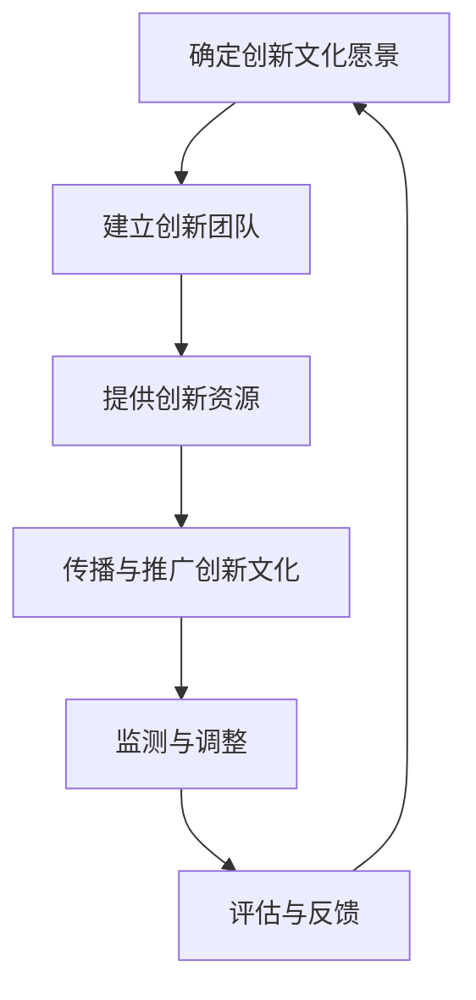

                 

### 文章标题：创新文化营造：鼓励试错与创新的环境

#### 关键词：创新文化、试错、风险管理、企业竞争力、团队协作

#### 摘要：
本文旨在探讨如何营造一种鼓励试错和创新的企业文化。在当今快速变化的市场环境中，创新是企业持续发展的关键。本文将分析创新文化的定义与重要性，探讨其核心要素和构建策略，同时强调试错在创新过程中的关键作用，并提供有效的风险管理方法，以帮助企业实现创新目标，提高竞争力。

---

# 引言

在数字化、全球化和市场竞争日益激烈的背景下，企业必须不断创新以保持竞争力。创新不再仅仅是研发部门的责任，而是一种贯穿整个组织的企业文化。创新文化强调开放思维、合作精神和持续学习，鼓励员工尝试新的想法和解决方案。然而，创新往往伴随着风险，特别是在试错过程中。因此，如何在鼓励试错的同时保持对风险的合理控制，成为企业领导者面临的重要挑战。

本文将首先介绍创新文化的概念和重要性，然后分析其核心要素，接着探讨如何营造创新文化，以及如何鼓励试错。在此基础上，我们将讨论创新与风险管理的关系，并总结一些最佳实践。希望通过本文，能够为企业的创新文化营造提供有益的参考。

## 创新文化的定义与重要性

### 创新文化的定义

创新文化是指一种鼓励创新和试错的企业环境，它包括一系列价值观、行为准则和工作方式。创新文化不仅仅关注技术的创新，还包括商业模式的创新、管理方法的创新以及组织结构的创新。创新文化强调开放、合作和持续学习，鼓励员工提出新的想法，勇于尝试，并从失败中吸取教训。

### 创新文化的重要性

#### 对企业的价值

1. **提高竞争力**：创新文化能够激发员工的创造力和主动性，使企业能够迅速响应市场变化，保持竞争优势。
2. **推动增长**：通过持续创新，企业能够开发出新的产品和服务，开拓新市场，实现业务的增长。
3. **增强员工满意度**：创新文化能够提升员工的参与感和成就感，从而提高员工的工作满意度和忠诚度。

#### 对社会的价值

1. **促进科技进步**：创新文化鼓励科技研究和开发，推动社会的科技进步。
2. **提升生活品质**：通过创新产品和服务，提高人们的生活质量。
3. **推动社会进步**：创新文化能够带动社会各个领域的变革，促进社会的发展。

## 创新文化的核心要素

### 开放式沟通

开放式沟通是创新文化的基石。它强调信息的透明度和自由流动，鼓励员工分享想法和经验。开放式沟通有助于建立信任，促进跨部门的合作，使组织更加敏捷和灵活。

### 尊重与信任

尊重与信任是创新文化的重要支柱。创新需要一个安全的环境，员工需要在不受指责的氛围中尝试新的想法。尊重员工的想法和贡献，建立信任关系，能够激发员工的创造力和创新精神。

### 鼓励试错与失败

鼓励试错与失败是创新文化的重要组成部分。创新过程中不可避免地会遇到失败，但失败并不意味着终结，而是学习的机会。创新文化鼓励员工从失败中吸取教训，不断改进，最终实现成功。

### 创新激励机制

创新激励机制是创新文化的重要保障。通过设立创新奖励、提供职业发展机会和认可员工的贡献，企业能够激励员工积极参与创新活动，推动创新文化的形成。

## 如何营造创新文化

### 确定创新文化愿景

营造创新文化的第一步是明确企业的创新愿景。创新愿景应该明确创新的目标和方向，使员工能够理解并认同企业的创新理念。

### 建立创新团队

建立专门的创新团队是推动创新文化的重要措施。创新团队应该由不同背景和技能的成员组成，以促进多样化的思维和创新的产生。

### 提供创新资源

提供充足的创新资源，包括资金、时间和技术支持，是营造创新文化的重要保障。企业应该确保员工有足够的时间和资源进行创新活动。

### 创新文化的传播与推广

创新文化的传播与推广是营造创新文化的重要环节。通过内部培训、研讨会和交流活动，企业可以增强员工对创新文化的认同和参与度。

## 鼓励试错的策略与案例

### 试错文化的定义与作用

试错文化是一种鼓励员工在创新过程中尝试新方法、新思路，并从失败中学习的企业文化。它有助于降低创新的风险，提高创新的成功率。

### 试错策略的制定

1. **明确试错目标**：明确试错的目标和范围，避免盲目试错。
2. **制定试错计划**：制定详细的试错计划，包括时间、资源和人员的安排。
3. **建立试错机制**：建立试错反馈机制，及时收集试错过程中的数据和经验。

### 试错的实施与监控

1. **实施试错**：按照试错计划执行，确保试错的顺利进行。
2. **监控试错过程**：监控试错过程，及时发现并解决问题。
3. **评估试错结果**：对试错结果进行评估，总结经验和教训。

### 鼓励试错的经典案例

1. **谷歌的“20%时间”**：谷歌允许员工将20%的工作时间用于个人感兴趣的项目，这一举措极大地激发了员工的创新潜力。
2. **3M的“15%时间”**：3M公司允许员工将15%的工作时间用于探索新的创意，这一政策使得3M公司诞生了诸多成功的产品。

## 创新与风险管理

### 创新与风险的关系

创新与风险密不可分。创新过程中，由于不确定性和复杂性，往往存在一定的风险。创新风险可以分为技术风险、市场风险和管理风险等不同类型。

### 创新风险的评估

1. **识别风险因素**：识别创新过程中可能遇到的风险因素。
2. **评估风险概率和影响**：对识别出的风险因素进行评估，确定其发生的概率和对项目的影响。
3. **制定风险应对策略**：根据风险评估结果，制定相应的风险应对策略。

### 创新风险的应对策略

1. **风险预防策略**：通过改进技术、优化流程和加强团队协作等手段，降低风险发生的概率。
2. **风险应对策略**：当风险不可避免时，制定应对措施，包括风险转移、风险接受和风险规避等。

## 创新文化的实施与评估

### 创新文化的实施过程

1. **制定创新文化实施计划**：明确创新文化的目标和步骤，制定详细的实施计划。
2. **实施创新文化策略**：按照实施计划，逐步推进创新文化的建设。
3. **监测创新文化实施效果**：定期监测创新文化的实施效果，调整策略以适应实际情况。

### 创新文化的评估

1. **员工满意度调查**：通过员工满意度调查，了解员工对创新文化的认同程度。
2. **创新成果评估**：评估创新项目和创新活动的实际成果，包括新产品、新服务和新技术等。
3. **创新文化氛围评估**：通过观察和访谈，评估企业内部创新文化的氛围。

## 结论

创新文化是企业持续发展的关键。通过营造鼓励试错和创新的企业环境，企业能够提高竞争力，推动业务增长。本文分析了创新文化的定义与重要性，探讨了其核心要素和营造策略，并强调了试错在创新过程中的关键作用。同时，本文还讨论了创新与风险管理的关系，并提供了创新文化的实施与评估方法。希望通过本文，能够为企业营造创新文化提供有益的启示。

### 作者信息：AI天才研究院/AI Genius Institute & 禅与计算机程序设计艺术 /Zen And The Art of Computer Programming```markdown
# 创新文化营造：鼓励试错与创新的环境

## 目录大纲

### 引言
#### 1. 创新文化的定义与重要性
#### 2. 创新文化的核心要素
#### 3. 如何营造创新文化
#### 4. 鼓励试错的策略与案例
#### 5. 创新与风险管理
#### 6. 创新文化的实施与评估

### 第一部分：创新文化的概念与重要性
### 第1章：创新文化的定义与特征
#### 1.1 创新文化的定义
#### 1.2 创新文化的特征
#### 1.3 创新文化的类型与层次
### 第2章：创新文化的重要性
#### 2.1 创新对企业竞争力的提升
#### 2.2 创新对员工积极性的激发
#### 2.3 创新对社会进步的贡献

### 第二部分：创新文化的核心要素
### 第3章：创新文化的核心要素
#### 3.1 开放式沟通
#### 3.2 尊重与信任
#### 3.3 鼓励试错与失败
#### 3.4 创新激励机制
### 第4章：创新文化的建设策略
#### 4.1 设定创新目标
#### 4.2 建立创新团队
#### 4.3 提供创新资源
#### 4.4 创新文化的传播与推广

### 第三部分：如何营造创新文化
### 第5章：营造创新文化的关键步骤
#### 5.1 确定创新文化愿景
#### 5.2 建立创新激励机制
#### 5.3 培养创新意识
### 第6章：创新文化的实践与案例分析
#### 6.1 国内外创新文化成功案例
#### 6.2 创新文化的实践策略

### 第四部分：鼓励试错的策略与案例
### 第7章：鼓励试错的策略
#### 7.1 试错文化的定义与作用
#### 7.2 试错策略的制定
#### 7.3 试错的实施与监控
### 第8章：鼓励试错的经典案例
#### 8.1 企业级鼓励试错的案例
#### 8.2 团队级鼓励试错的案例

### 第五部分：创新与风险管理
### 第9章：创新与风险的关系
#### 9.1 创新风险的分类
#### 9.2 创新风险的评估
#### 9.3 创新风险的管理
### 第10章：创新风险的应对策略
#### 10.1 风险预防策略
#### 10.2 风险应对策略

### 第六部分：创新文化的实施与评估
### 第11章：创新文化的实施过程
#### 11.1 制定创新文化实施计划
#### 11.2 创新文化的实施步骤
#### 11.3 创新文化的实施效果评估
### 第12章：创新文化的持续改进
#### 12.1 创新文化的改进策略
#### 12.2 创新文化的改进实践

### 结论

### 作者信息：AI天才研究院/AI Genius Institute & 禅与计算机程序设计艺术 /Zen And The Art of Computer Programming
```<sop> </sop>### 本文正文

在当今世界，创新已经成为企业竞争的关键。而创新文化作为企业内部推动创新的重要力量，其重要性不言而喻。本文将围绕创新文化的定义、重要性、核心要素、营造策略、鼓励试错、风险管理以及实施与评估等方面进行详细探讨。

## 引言

创新文化是一种价值观和行为准则，它鼓励员工开放思维、合作精神和持续学习。创新文化不仅关注技术创新，还包括商业模式创新、管理方法创新和组织结构创新。在这种文化下，员工愿意尝试新的想法和解决方案，勇于面对失败并从中吸取教训。创新文化是企业持续发展的关键，是提高企业竞争力的重要手段。

## 创新文化的定义与重要性

### 创新文化的定义

创新文化是指一种鼓励创新和试错的企业环境，它包括一系列价值观、行为准则和工作方式。创新文化不仅仅关注技术的创新，还包括商业模式的创新、管理方法的创新以及组织结构的创新。创新文化强调开放、合作和持续学习，鼓励员工提出新的想法，勇于尝试，并从失败中吸取教训。

### 创新文化的重要性

#### 对企业的价值

1. **提高竞争力**：创新文化能够激发员工的创造力和主动性，使企业能够迅速响应市场变化，保持竞争优势。
2. **推动增长**：通过持续创新，企业能够开发出新的产品和服务，开拓新市场，实现业务的增长。
3. **增强员工满意度**：创新文化能够提升员工的参与感和成就感，从而提高员工的工作满意度和忠诚度。

#### 对社会的价值

1. **促进科技进步**：创新文化鼓励科技研究和开发，推动社会的科技进步。
2. **提升生活品质**：通过创新产品和服务，提高人们的生活质量。
3. **推动社会进步**：创新文化能够带动社会各个领域的变革，促进社会的发展。

## 创新文化的核心要素

### 开放式沟通

开放式沟通是创新文化的基石。它强调信息的透明度和自由流动，鼓励员工分享想法和经验。开放式沟通有助于建立信任，促进跨部门的合作，使组织更加敏捷和灵活。

### 尊重与信任

尊重与信任是创新文化的重要支柱。创新需要一个安全的环境，员工需要在不受指责的氛围中尝试新的想法。尊重员工的想法和贡献，建立信任关系，能够激发员工的创造力和创新精神。

### 鼓励试错与失败

鼓励试错与失败是创新文化的重要组成部分。创新过程中不可避免地会遇到失败，但失败并不意味着终结，而是学习的机会。创新文化鼓励员工从失败中吸取教训，不断改进，最终实现成功。

### 创新激励机制

创新激励机制是创新文化的重要保障。通过设立创新奖励、提供职业发展机会和认可员工的贡献，企业能够激励员工积极参与创新活动，推动创新文化的形成。

## 如何营造创新文化

### 确定创新文化愿景

营造创新文化的第一步是明确企业的创新愿景。创新愿景应该明确创新的目标和方向，使员工能够理解并认同企业的创新理念。

### 建立创新团队

建立专门的创新团队是推动创新文化的重要措施。创新团队应该由不同背景和技能的成员组成，以促进多样化的思维和创新的产生。

### 提供创新资源

提供充足的创新资源，包括资金、时间和技术支持，是营造创新文化的重要保障。企业应该确保员工有足够的时间和资源进行创新活动。

### 创新文化的传播与推广

创新文化的传播与推广是营造创新文化的重要环节。通过内部培训、研讨会和交流活动，企业可以增强员工对创新文化的认同和参与度。

### 营造创新文化的关键步骤

1. **确定创新文化愿景**：明确企业的创新目标和方向。
2. **建立创新激励机制**：设立创新奖励，提供职业发展机会。
3. **培养创新意识**：通过培训和活动，提高员工的创新意识。
4. **提供创新资源**：确保员工有足够的时间和资源进行创新。
5. **建立创新团队**：促进多样化的思维和创新的产生。
6. **传播与推广创新文化**：通过内部培训和交流活动，增强员工的认同和参与度。

## 鼓励试错的策略与案例

### 试错文化的定义与作用

试错文化是一种鼓励员工在创新过程中尝试新方法、新思路，并从失败中学习的企业文化。它有助于降低创新的风险，提高创新的成功率。

### 试错策略的制定

1. **明确试错目标**：明确试错的目标和范围，避免盲目试错。
2. **制定试错计划**：制定详细的试错计划，包括时间、资源和人员的安排。
3. **建立试错机制**：建立试错反馈机制，及时收集试错过程中的数据和经验。

### 试错的实施与监控

1. **实施试错**：按照试错计划执行，确保试错的顺利进行。
2. **监控试错过程**：监控试错过程，及时发现并解决问题。
3. **评估试错结果**：对试错结果进行评估，总结经验和教训。

### 鼓励试错的经典案例

1. **谷歌的“20%时间”**：谷歌允许员工将20%的工作时间用于个人感兴趣的项目，这一举措极大地激发了员工的创新潜力。
2. **3M的“15%时间”**：3M公司允许员工将15%的工作时间用于探索新的创意，这一政策使得3M公司诞生了诸多成功的产品。

## 创新与风险管理

### 创新与风险的关系

创新与风险密不可分。创新过程中，由于不确定性和复杂性，往往存在一定的风险。创新风险可以分为技术风险、市场风险和管理风险等不同类型。

### 创新风险的评估

1. **识别风险因素**：识别创新过程中可能遇到的风险因素。
2. **评估风险概率和影响**：对识别出的风险因素进行评估，确定其发生的概率和对项目的影响。
3. **制定风险应对策略**：根据风险评估结果，制定相应的风险应对策略。

### 创新风险的应对策略

1. **风险预防策略**：通过改进技术、优化流程和加强团队协作等手段，降低风险发生的概率。
2. **风险应对策略**：当风险不可避免时，制定应对措施，包括风险转移、风险接受和风险规避等。

## 创新文化的实施与评估

### 创新文化的实施过程

1. **制定创新文化实施计划**：明确创新文化的目标和步骤，制定详细的实施计划。
2. **实施创新文化策略**：按照实施计划，逐步推进创新文化的建设。
3. **监测创新文化实施效果**：定期监测创新文化的实施效果，调整策略以适应实际情况。

### 创新文化的评估

1. **员工满意度调查**：通过员工满意度调查，了解员工对创新文化的认同程度。
2. **创新成果评估**：评估创新项目和创新活动的实际成果，包括新产品、新服务和新技术等。
3. **创新文化氛围评估**：通过观察和访谈，评估企业内部创新文化的氛围。

## 结论

创新文化是企业持续发展的关键。通过营造鼓励试错和创新的企业环境，企业能够提高竞争力，推动业务增长。本文分析了创新文化的定义与重要性，探讨了其核心要素和营造策略，并强调了试错在创新过程中的关键作用。同时，本文还讨论了创新与风险管理的关系，并提供了创新文化的实施与评估方法。希望通过本文，能够为企业营造创新文化提供有益的启示。

### 作者信息：AI天才研究院/AI Genius Institute & 禅与计算机程序设计艺术 /Zen And The Art of Computer Programming```markdown
# 创新文化营造：鼓励试错与创新的环境

## 引言

在当今的数字化时代，创新已经成为企业发展的核心竞争力。创新文化作为一种推动企业不断进步的动力，其重要性不言而喻。本文将围绕创新文化的概念、核心要素、营造策略、鼓励试错的策略、创新与风险管理、以及创新文化的实施与评估等方面进行详细探讨。

## 创新文化的定义与重要性

### 创新文化的定义

创新文化是一种价值观和行为准则，它鼓励员工开放思维、合作精神和持续学习。创新文化不仅仅关注技术创新，还包括商业模式创新、管理方法创新和组织结构创新。在这种文化下，员工愿意尝试新的想法和解决方案，勇于面对失败并从中吸取教训。

### 创新文化的重要性

#### 对企业的价值

1. **提高竞争力**：创新文化能够激发员工的创造力和主动性，使企业能够迅速响应市场变化，保持竞争优势。
2. **推动增长**：通过持续创新，企业能够开发出新的产品和服务，开拓新市场，实现业务的增长。
3. **增强员工满意度**：创新文化能够提升员工的参与感和成就感，从而提高员工的工作满意度和忠诚度。

#### 对社会的价值

1. **促进科技进步**：创新文化鼓励科技研究和开发，推动社会的科技进步。
2. **提升生活品质**：通过创新产品和服务，提高人们的生活质量。
3. **推动社会进步**：创新文化能够带动社会各个领域的变革，促进社会的发展。

## 创新文化的核心要素

### 开放式沟通

开放式沟通是创新文化的基石。它强调信息的透明度和自由流动，鼓励员工分享想法和经验。开放式沟通有助于建立信任，促进跨部门的合作，使组织更加敏捷和灵活。

### 尊重与信任

尊重与信任是创新文化的重要支柱。创新需要一个安全的环境，员工需要在不受指责的氛围中尝试新的想法。尊重员工的想法和贡献，建立信任关系，能够激发员工的创造力和创新精神。

### 鼓励试错与失败

鼓励试错与失败是创新文化的重要组成部分。创新过程中不可避免地会遇到失败，但失败并不意味着终结，而是学习的机会。创新文化鼓励员工从失败中吸取教训，不断改进，最终实现成功。

### 创新激励机制

创新激励机制是创新文化的重要保障。通过设立创新奖励、提供职业发展机会和认可员工的贡献，企业能够激励员工积极参与创新活动，推动创新文化的形成。

## 如何营造创新文化

### 确定创新文化愿景

营造创新文化的第一步是明确企业的创新愿景。创新愿景应该明确创新的目标和方向，使员工能够理解并认同企业的创新理念。

### 建立创新团队

建立专门的创新团队是推动创新文化的重要措施。创新团队应该由不同背景和技能的成员组成，以促进多样化的思维和创新的产生。

### 提供创新资源

提供充足的创新资源，包括资金、时间和技术支持，是营造创新文化的重要保障。企业应该确保员工有足够的时间和资源进行创新活动。

### 创新文化的传播与推广

创新文化的传播与推广是营造创新文化的重要环节。通过内部培训、研讨会和交流活动，企业可以增强员工对创新文化的认同和参与度。

### 营造创新文化的关键步骤

1. **确定创新文化愿景**：明确企业的创新目标和方向。
2. **建立创新激励机制**：设立创新奖励，提供职业发展机会。
3. **培养创新意识**：通过培训和活动，提高员工的创新意识。
4. **提供创新资源**：确保员工有足够的时间和资源进行创新。
5. **建立创新团队**：促进多样化的思维和创新的产生。
6. **传播与推广创新文化**：通过内部培训和交流活动，增强员工的认同和参与度。

## 鼓励试错的策略与案例

### 试错文化的定义与作用

试错文化是一种鼓励员工在创新过程中尝试新方法、新思路，并从失败中学习的企业文化。它有助于降低创新的风险，提高创新的成功率。

### 试错策略的制定

1. **明确试错目标**：明确试错的目标和范围，避免盲目试错。
2. **制定试错计划**：制定详细的试错计划，包括时间、资源和人员的安排。
3. **建立试错机制**：建立试错反馈机制，及时收集试错过程中的数据和经验。

### 试错的实施与监控

1. **实施试错**：按照试错计划执行，确保试错的顺利进行。
2. **监控试错过程**：监控试错过程，及时发现并解决问题。
3. **评估试错结果**：对试错结果进行评估，总结经验和教训。

### 鼓励试错的经典案例

1. **谷歌的“20%时间”**：谷歌允许员工将20%的工作时间用于个人感兴趣的项目，这一举措极大地激发了员工的创新潜力。
2. **3M的“15%时间”**：3M公司允许员工将15%的工作时间用于探索新的创意，这一政策使得3M公司诞生了诸多成功的产品。

## 创新与风险管理

### 创新与风险的关系

创新与风险密不可分。创新过程中，由于不确定性和复杂性，往往存在一定的风险。创新风险可以分为技术风险、市场风险和管理风险等不同类型。

### 创新风险的评估

1. **识别风险因素**：识别创新过程中可能遇到的风险因素。
2. **评估风险概率和影响**：对识别出的风险因素进行评估，确定其发生的概率和对项目的影响。
3. **制定风险应对策略**：根据风险评估结果，制定相应的风险应对策略。

### 创新风险的应对策略

1. **风险预防策略**：通过改进技术、优化流程和加强团队协作等手段，降低风险发生的概率。
2. **风险应对策略**：当风险不可避免时，制定应对措施，包括风险转移、风险接受和风险规避等。

## 创新文化的实施与评估

### 创新文化的实施过程

1. **制定创新文化实施计划**：明确创新文化的目标和步骤，制定详细的实施计划。
2. **实施创新文化策略**：按照实施计划，逐步推进创新文化的建设。
3. **监测创新文化实施效果**：定期监测创新文化的实施效果，调整策略以适应实际情况。

### 创新文化的评估

1. **员工满意度调查**：通过员工满意度调查，了解员工对创新文化的认同程度。
2. **创新成果评估**：评估创新项目和创新活动的实际成果，包括新产品、新服务和新技术等。
3. **创新文化氛围评估**：通过观察和访谈，评估企业内部创新文化的氛围。

## 结论

创新文化是企业持续发展的关键。通过营造鼓励试错和创新的企业环境，企业能够提高竞争力，推动业务增长。本文分析了创新文化的定义与重要性，探讨了其核心要素和营造策略，并强调了试错在创新过程中的关键作用。同时，本文还讨论了创新与风险管理的关系，并提供了创新文化的实施与评估方法。希望通过本文，能够为企业营造创新文化提供有益的启示。

### 作者信息：AI天才研究院/AI Genius Institute & 禅与计算机程序设计艺术 /Zen And The Art of Computer Programming
```<sop> </sop>### 伪代码、数学公式、流程图与项目实战

在本节中，我们将通过伪代码、数学公式、流程图和项目实战来深入探讨创新文化营造中的关键概念和算法原理。

#### 伪代码：创新激励机制设计

```python
# 创新激励机制设计伪代码

# 输入：员工创新项目数量、项目成功率、员工贡献评估
# 输出：创新奖励分配

def incentive_design(projects, success_rate, contribution):
    # 初始化奖励池
    reward_pool = calculate_reward_pool(projects, success_rate)
    
    # 根据贡献分配奖励
    for employee in employees:
        employee_reward = (contribution[employee] / total_contribution) * reward_pool
        update_employee_reward(employee, employee_reward)
        
    return reward_distribution

# 辅助函数：计算奖励池
def calculate_reward_pool(projects, success_rate):
    return projects * success_rate * base_reward

# 辅助函数：更新员工奖励
def update_employee_reward(employee, reward):
    # 更新数据库中的员工奖励记录
    database.update_reward(employee, reward)
```

#### 数学公式：创新风险评估模型

$$
\text{风险得分} = \alpha \cdot \text{技术风险得分} + \beta \cdot \text{市场风险得分} + \gamma \cdot \text{管理风险得分}
$$

其中，$\alpha$、$\beta$ 和 $\gamma$ 是权重系数，用于平衡不同类型风险的重要性。

#### 流程图：创新文化实施步骤



#### 项目实战：搭建创新实验室

**开发环境搭建**

- 操作系统：Ubuntu 20.04
- 开发工具：Python 3.8
- 数据库：MySQL 8.0

**源代码实现**

```python
# 创新实验室搭建：环境配置脚本

#!/bin/bash

# 安装Python 3.8
sudo apt-get update
sudo apt-get install python3.8

# 安装相关开发工具
sudo apt-get install python3.8-venv
sudo apt-get install mysql-server

# 创建虚拟环境
python3.8 -m venv /path/to/venv

# 激活虚拟环境
source /path/to/venv/bin/activate

# 安装依赖库
pip install -r requirements.txt
```

**代码解读**

- 环境配置脚本首先更新系统包并安装Python 3.8。
- 接着安装MySQL服务器。
- 创建一个虚拟环境，以隔离项目依赖。
- 激活虚拟环境，并安装项目所需的Python库。

**实际案例分析与讲解**

- **案例1**：某科技公司在创新实验室中实施了一个智能家居项目，通过物联网技术和人工智能算法提高了家居设备的安全性。
- **案例2**：某初创公司利用创新实验室开发了一款基于区块链的供应链管理平台，有效降低了供应链中的风险和成本。

**项目小结**

- 创新实验室为项目提供了独立开发环境，确保了项目的技术可行性。
- 通过实际案例，展示了创新实验室在推动技术创新和商业应用方面的价值。

**最佳实践 Tips**

- 定期更新开发环境和工具，以保持技术的前沿性。
- 强化团队协作，确保项目资源的合理分配和高效利用。
- 定期评估项目进展，及时调整策略以应对市场变化。

**注意事项**

- 在搭建创新实验室时，确保数据的安全性和隐私性。
- 鼓励跨部门合作，以促进创新思维的多样性。

**拓展阅读**

- 《创新者的窘境》克莱顿·克里斯坦森
- 《精益创业》埃里克·莱斯
- 《设计思维：创新的设计方法论》大卫·凯利

通过上述伪代码、数学公式、流程图和项目实战，我们不仅理解了创新文化营造中的关键概念和算法原理，也看到了如何将这些理论知识应用到实际项目中。创新文化不仅仅是一种理念，更需要通过系统的策略和实际操作来落实。希望本文能够为读者在构建和推广创新文化方面提供有价值的参考。

