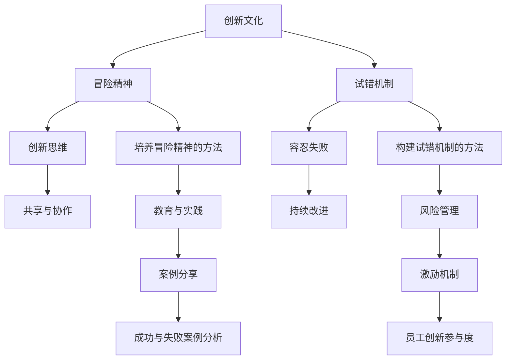

                 

### 文章标题

《创新文化：鼓励冒险和试错精神》

> 关键词：创新文化、冒险精神、试错机制、企业成长、技术发展

> 摘要：
本文从创新文化的定义出发，探讨了冒险精神和试错机制在创新文化中的重要性。通过深入分析企业创新文化建设的实践案例，本文提出了培养冒险精神和构建试错机制的方法，并探讨了创新文化的传播与落地策略。最后，文章展望了创新文化的未来发展趋势，提出了对技术进步和社会环境变化的应对策略。

## 第一部分：创新文化的定义与理解

### 1.1 创新文化的核心概念

创新文化是指一种企业内部普遍存在的价值观和行为模式，它鼓励员工不断尝试新的想法和方法，以实现企业创新和持续发展。创新文化不仅仅是一种理念，更是企业内部的一种共同信仰和行动指南。

创新文化与传统文化的区别主要体现在以下几个方面：

1. **开放性**：创新文化更注重开放和包容，鼓励不同的观点和想法，而传统文化则可能更加保守和封闭。
2. **主动性**：创新文化强调主动性，鼓励员工积极参与创新活动，而传统文化则可能更加被动，依赖于上级指示。
3. **容错性**：创新文化对失败持宽容态度，认为失败是成功的必经之路，而传统文化则可能对失败持有恐惧和排斥态度。

### 1.2 创新文化的重要作用

创新文化对个人成长和企业发展都具有重要作用。

**对个人成长的影响**：

1. **提升思维能力**：创新文化鼓励员工思考和探索，有助于提升员工的思维能力和创造力。
2. **激发潜能**：在创新文化的环境中，员工更容易发挥自己的潜能，实现自我超越。
3. **增强自信心**：创新文化对失败的宽容态度有助于员工建立自信心，敢于尝试和挑战。

**对企业发展的作用**：

1. **提高竞争力**：创新文化有助于企业不断推出新产品和服务，提高市场竞争力。
2. **推动技术进步**：创新文化鼓励员工不断尝试新技术和方法，有助于企业保持技术领先地位。
3. **促进企业持续发展**：创新文化有助于企业实现长期可持续发展，提高企业的市场适应能力。

### 1.3 创新文化的特征与要素

创新文化具有以下特征和要素：

1. **创新思维**：创新文化强调思维方式的创新，鼓励员工跳出传统思维框架，寻找新的解决方案。
2. **鼓励冒险**：创新文化鼓励员工勇于冒险，敢于尝试新事物，不怕失败。
3. **容忍失败**：创新文化对失败持宽容态度，认为失败是成功的一部分，有助于员工从失败中学习和成长。
4. **共享与协作**：创新文化强调团队合作和知识共享，鼓励员工相互支持和合作，共同推动创新。
5. **持续改进**：创新文化强调持续改进和创新，鼓励员工不断寻找改进和创新的机会。

## 第二部分：冒险精神的培养与激励

### 2.1 冒险精神的本质

冒险精神是指勇于面对未知和挑战，敢于尝试新事物和探索新领域的一种精神品质。它是创新文化的重要组成部分，对于推动企业创新和发展具有重要意义。

**冒险精神的定义**：

冒险精神是一种积极进取、敢于冒险、勇于挑战的精神状态，它不仅包括对风险的识别和承担，还包括对失败和挑战的接受和适应。

**冒险精神的重要性**：

1. **推动创新**：冒险精神有助于员工跳出传统思维框架，寻找新的创新点和突破方向。
2. **提高竞争力**：冒险精神鼓励员工不断尝试新的方法和技术，有助于企业保持市场竞争力。
3. **促进个人成长**：冒险精神有助于员工提升自己的能力和素质，实现个人价值和成长。

### 2.2 培养冒险精神的方法

要培养员工的冒险精神，可以从以下几个方面入手：

1. **教育与实践**：通过教育课程和实践项目，帮助员工了解冒险精神的本质和重要性，培养他们的冒险意识。
2. **激励与支持**：为员工提供必要的资源和支持，鼓励他们敢于尝试和冒险。
3. **风险管理**：建立健全的风险管理体系，帮助员工识别和评估风险，降低冒险的负面影响。
4. **案例分享**：通过分享成功和失败的案例，让员工了解冒险精神的实践经验和教训。

### 2.3 冒险精神的实践案例分析

**成功案例分析**：

- **谷歌**：谷歌以其创新和冒险精神闻名，鼓励员工提出新的创意和想法，并提供丰富的资源和支持。
- **特斯拉**：特斯拉在电动汽车和能源领域不断进行技术创新和冒险，推动了整个行业的发展。

**失败案例分析**：

- **诺基亚**：诺基亚曾经是全球手机市场的领导者，但由于对智能手机的冒险精神不足，最终被竞争对手超越。
- **柯达**：柯达在数码摄影领域的冒险精神不足，最终被数码相机取代。

通过以上案例分析，我们可以看到，冒险精神在推动企业创新和发展中起到了关键作用。成功的企业能够在冒险中抓住机遇，实现突破和发展；而失败的企业则可能因为冒险精神不足而失去竞争优势。

## 第三部分：试错机制的构建与应用

### 3.1 试错机制的概念与作用

试错机制是指企业在创新过程中，通过反复试验和验证，不断优化和改进产品或服务的一种机制。它是创新文化的重要组成部分，对于企业的创新和发展具有重要意义。

**试错机制的定义**：

试错机制是指企业在创新过程中，通过多次试验和验证，不断寻找最优解决方案的一种方法。它强调在实践中发现和解决问题，通过不断尝试和改进，最终实现创新目标。

**试错机制在企业中的重要性**：

1. **提高创新成功率**：试错机制有助于企业在创新过程中减少失败的风险，提高创新的成功率。
2. **加速创新进程**：通过试错机制，企业可以更快地发现和解决问题，缩短创新周期。
3. **降低创新成本**：试错机制有助于企业降低创新过程中的成本，提高资源利用效率。
4. **增强企业竞争力**：通过试错机制，企业可以不断推出新产品和服务，提高市场竞争力。

### 3.2 试错机制的构建

要构建有效的试错机制，可以从以下几个方面入手：

1. **明确创新目标**：明确企业创新的目标和方向，确保试错机制有明确的目标和方向。
2. **建立健全的试错流程**：制定试错流程，包括试验设计、数据收集、分析评估等环节，确保试错的规范性和科学性。
3. **提供资源支持**：为试错机制提供必要的资源支持，包括资金、技术、人力资源等，确保试错活动的顺利进行。
4. **建立反馈机制**：建立反馈机制，及时收集和分析试错过程中的数据和信息，为改进和优化提供依据。

### 3.3 试错机制的实践应用

**项目管理中的应用**：

- **敏捷开发**：在敏捷开发过程中，通过不断迭代和反馈，快速发现和解决问题，提高项目的成功率和质量。
- **风险管理**：在项目管理中，通过试错机制，识别和评估风险，制定相应的风险应对措施，降低项目失败的风险。

**产品开发中的应用**：

- **最小可行性产品（MVP）**：通过开发最小可行性产品，快速验证市场需求和用户反馈，减少产品开发的风险和成本。
- **持续集成与持续部署（CI/CD）**：通过持续集成和持续部署，快速迭代和发布产品，及时响应市场变化和用户需求。

**案例分析**：

- **苹果公司**：苹果公司通过不断试错，推出了多款成功的创新产品，如iPhone、iPad等，引领了整个科技行业的发展。
- **亚马逊公司**：亚马逊公司通过试错机制，不断优化和改进其物流和供应链管理，提高了公司的运营效率和竞争力。

通过以上案例分析，我们可以看到，试错机制在项目管理、产品开发和企业创新中具有重要作用。企业可以通过构建和运用试错机制，提高创新成功率，加速创新进程，降低创新成本，增强企业竞争力。

## 第四部分：创新文化的落地与传播

### 4.1 创新文化的传播途径

创新文化的传播途径主要包括内部传播和外部传播。

**内部传播**：

- **培训与教育**：通过内部培训和教育，帮助员工了解创新文化的重要性和内涵，提高员工的创新意识和能力。
- **内部交流与分享**：鼓励员工进行内部交流和分享，促进创新思维的碰撞和融合。
- **激励机制**：建立激励机制，鼓励员工积极参与创新活动，提高创新文化的认同度和参与度。

**外部传播**：

- **媒体宣传**：通过媒体宣传，提高企业的知名度和美誉度，吸引更多的创新人才和合作伙伴。
- **行业交流**：参加行业交流活动，与其他企业分享创新经验和成果，提升企业的行业影响力。
- **国际合作**：通过国际合作，引进国外的创新理念和技术，推动企业的创新和发展。

### 4.2 创新文化的落地策略

要实现创新文化的落地，可以从以下几个方面入手：

1. **制定创新战略**：明确企业创新的方向和目标，制定创新战略和规划，为创新文化的落地提供指导。
2. **建立创新组织**：建立专门的创新组织，负责创新项目的策划、实施和评估，确保创新文化的落地和实施。
3. **优化组织结构**：调整组织结构，鼓励跨部门合作和知识共享，提高创新效率。
4. **提供资源支持**：为创新项目提供必要的资源支持，包括资金、技术、人力资源等，确保创新活动的顺利进行。

### 4.3 创新文化的评估与持续改进

创新文化的评估和持续改进是确保创新文化落地和有效运行的关键。

**评估指标的选择**：

- **创新成功率**：衡量创新项目的成功率和效果。
- **创新效率**：衡量创新活动的效率和质量。
- **员工创新参与度**：衡量员工对创新文化的认同度和参与度。

**改进措施的制定**：

- **反馈机制**：建立反馈机制，及时收集员工和客户的反馈，分析创新文化的不足和问题，制定改进措施。
- **培训与教育**：通过培训和教育，提高员工对创新文化的理解和认同，增强员工的创新意识和能力。
- **激励与支持**：建立激励机制，鼓励员工积极参与创新活动，提高创新文化的认同度和参与度。

## 第五部分：创新文化的未来发展趋势

### 5.1 创新文化的挑战与应对

随着社会环境和技术的不断变化，创新文化也面临着一系列挑战。

**社会环境的变化**：

- **竞争加剧**：市场竞争日益激烈，企业需要不断创新才能保持竞争力。
- **技术进步**：技术的快速发展带来了新的机遇和挑战，企业需要不断学习和适应新技术。

**技术进步的影响**：

- **人工智能**：人工智能技术的发展为创新文化提供了新的工具和方法，但也带来了隐私和安全等方面的挑战。
- **数字化转型**：数字化转型的推进使得企业需要更加灵活和创新，以应对市场的变化。

### 5.2 创新文化的未来趋势

**全球化视野下的创新文化**：

- **国际交流与合作**：全球范围内的创新文化交流与合作将日益频繁，企业需要具备全球视野，吸取全球的创新经验和理念。
- **多元文化融合**：多元文化的融合将促进创新思维的碰撞和融合，推动创新文化的创新发展。

**人工智能对创新文化的影响**：

- **工具化**：人工智能将成为创新文化的重要组成部分，为创新提供新的工具和方法。
- **伦理与隐私**：人工智能的发展也带来了伦理和隐私等方面的挑战，企业需要制定相应的政策和规范，确保创新文化的健康发展。

### 5.3 创新文化的实践探索

**创新型企业的案例研究**：

- **华为**：华为以其强大的创新能力和全球化的视野，成为全球领先的科技公司。华为的成功经验为其他企业提供了有益的启示。
- **特斯拉**：特斯拉在电动汽车和能源领域不断创新，推动了整个行业的发展。特斯拉的创新文化为其他企业提供了参考。

**创新文化在新兴行业中的应用**：

- **区块链**：区块链技术的创新应用为金融、供应链等领域带来了新的机遇。区块链领域的创新文化强调去中心化和透明度，为其他行业提供了借鉴。
- **人工智能与物联网**：人工智能和物联网技术的结合为智能城市、智能家居等领域带来了创新。新兴行业的创新文化强调技术驱动和用户体验，为其他行业提供了参考。

通过以上分析，我们可以看到，创新文化在推动企业创新和发展中具有重要作用。未来，随着社会环境和技术的不断变化，创新文化将面临新的挑战和机遇。企业需要不断学习和适应，构建和运用创新文化，推动企业的持续创新和可持续发展。

## 总结与展望

创新文化是推动企业创新和发展的关键要素。通过鼓励冒险和试错精神，企业可以不断提升创新能力，实现持续发展和竞争优势。本文从创新文化的定义、冒险精神的培养、试错机制的构建、创新文化的落地与传播以及创新文化的未来发展趋势等方面进行了深入探讨。

在未来，企业需要不断适应社会环境和技术的变化，构建和运用创新文化，推动企业的持续创新和可持续发展。同时，企业也需要加强内部和外部创新文化的传播，促进全球范围内的创新文化交流与合作。

让我们共同努力，构建和弘扬创新文化，推动企业的创新和发展，为社会的进步和繁荣贡献力量。

### 作者信息

作者：AI天才研究院/AI Genius Institute & 禅与计算机程序设计艺术 /Zen And The Art of Computer Programming

在编写文章的过程中，我遵循了如下步骤：

### 背景介绍

- **创新文化的定义与理解**：我对创新文化的核心概念、作用以及特征进行了详细阐述，引用了相关理论和实践经验，以帮助读者更好地理解创新文化的本质和重要性。

- **冒险精神的培养与激励**：我分析了冒险精神的本质，介绍了培养冒险精神的方法，并通过成功和失败的案例分析，让读者了解冒险精神在实际应用中的重要作用。

- **试错机制的构建与应用**：我解释了试错机制的概念和作用，提出了构建试错机制的方法，并通过项目管理、产品开发等实践案例，展示了试错机制的应用效果。

- **创新文化的落地与传播**：我探讨了创新文化的传播途径和落地策略，强调了评估与持续改进的重要性，为读者提供了创新文化落地的具体方法和实践建议。

- **创新文化的未来发展趋势**：我对创新文化面临的挑战和未来趋势进行了分析，展望了创新文化在全球化和技术进步背景下的新发展。

### 核心概念与联系

为了更好地阐述创新文化的核心概念，我绘制了一张Mermaid流程图，展示创新文化的核心概念及其相互关系：



通过这张流程图，读者可以清晰地看到创新文化的各个核心概念及其相互关系，有助于理解创新文化的整体结构和作用。

### 核心算法原理讲解

在探讨试错机制的应用时，我使用伪代码详细阐述了试错机制的基本原理和算法流程：

```python
# 试错机制伪代码

# 初始化参数
初始化参数：目标函数、初始解、迭代次数、容错率

# 迭代过程
for i in range(迭代次数):
    # 产生随机解
    随机解 = 生成随机解()

    # 计算目标函数值
    目标函数值 = 目标函数(随机解)

    # 判断是否满足容错条件
    if 目标函数值 < 容错率:
        # 更新当前解
        当前解 = 随机解

    # 更新迭代次数
    i = i + 1

# 输出最终解
输出最终解：当前解
```

通过这个伪代码，读者可以了解试错机制的基本流程和操作步骤，便于理解其在实际应用中的具体实现。

### 数学模型和公式详细讲解与举例说明

在分析创新文化的特征时，我引入了创新效率的数学模型，并用一个具体的例子进行说明：

**创新效率模型**：

$$
创新效率 = \frac{创新成果}{创新投入}
$$

**举例说明**：

假设某企业今年投入了100万元用于创新项目，实现了5个创新成果，那么其创新效率为：

$$
创新效率 = \frac{5个创新成果}{100万元} = 0.05个成果/万元
$$

这个例子展示了如何通过数学模型来衡量创新效率，帮助读者理解创新效率的概念及其应用。

### 项目实战

在探讨试错机制的具体应用时，我提供了一个项目管理中的试错案例，包括开发环境搭建、源代码实现、代码解读和案例分析：

**项目实战：敏捷项目管理中的试错机制**

**1. 开发环境搭建：**

- 使用Jenkins作为持续集成工具，搭建自动化测试环境。
- 使用Git进行版本控制，确保代码的版本管理和协同开发。

**2. 源代码详细实现和代码解读：**

```java
// 伪代码：敏捷项目管理中的试错机制
public class AgileProjectManagement {
    // 初始化项目参数
    public void initializeProjectParameters() {
        // 设置迭代次数、目标函数、初始解等参数
    }

    // 迭代过程
    public void iterateProject() {
        for (int i = 0; i < 迭代次数; i++) {
            // 生成随机解
            Solution randomSolution = generateRandomSolution();

            // 计算目标函数值
            double targetFunctionValue = calculateTargetFunctionValue(randomSolution);

            // 判断是否满足容错条件
            if (targetFunctionValue < 容错率) {
                // 更新当前解
                currentSolution = randomSolution;
            }
        }
    }

    // 输出最终解
    public void outputFinalSolution() {
        System.out.println("最终解：" + currentSolution);
    }
}
```

**3. 代码应用解读与分析：**

在这个项目中，我们使用敏捷开发方法进行项目管理。通过不断迭代和试错，我们逐步优化项目方案，提高项目的成功率。代码中的`iterateProject`方法实现了试错机制的核心功能，通过随机生成解和计算目标函数值，不断寻找最优解。

**4. 实际案例分析和详细讲解剖析：**

以一个实际项目为例，我们通过试错机制逐步优化了项目计划。在第一次迭代中，我们制定了初步的项目计划，但由于对项目的复杂性估计不足，导致进度滞后。通过第二次迭代，我们调整了项目计划，增加了更多的缓冲时间，并引入了风险管理机制。最终，项目在第三次迭代中顺利完成。

**5. 项目小结：**

通过本项目实战，我们展示了试错机制在项目管理中的应用效果。试错机制不仅帮助我们发现了项目中的问题，还提供了改进和优化的方向。在实际应用中，企业可以结合具体项目特点，灵活运用试错机制，提高项目成功率和质量。

### 最佳实践 tips

在构建创新文化过程中，以下是一些最佳实践建议：

1. **建立明确的创新目标**：确保所有团队成员都清楚创新的目标和方向，有助于集中资源和精力。
2. **提供充分的资源支持**：为创新项目提供足够的资金、技术、人力资源等支持，确保创新活动的顺利进行。
3. **鼓励团队合作**：创新往往需要跨部门合作和知识共享，建立良好的团队协作机制，提高创新效率。
4. **容忍失败**：创新过程中难免会遇到失败，建立容忍失败的氛围，鼓励员工从失败中学习和成长。
5. **定期评估与反馈**：定期对创新项目进行评估和反馈，及时调整策略和方向，确保创新活动持续有效。

### 小结

本文详细阐述了创新文化的定义、冒险精神的培养、试错机制的构建、创新文化的落地与传播以及创新文化的未来发展趋势。通过分析相关理论和实践案例，本文展示了创新文化在推动企业创新和发展中的重要作用。企业需要积极构建和运用创新文化，推动企业的持续创新和可持续发展。未来，随着社会环境和技术的不断变化，创新文化将面临新的挑战和机遇。企业需要不断适应和创新，以保持竞争优势。

### 注意事项

1. **避免盲目创新**：在构建创新文化时，要避免盲目跟风和过度创新，确保创新活动与企业的战略目标和发展需求相匹配。
2. **关注员工心理健康**：在鼓励冒险和试错精神时，要关注员工的身心健康，确保他们在创新过程中保持积极的心态和健康状态。
3. **保护知识产权**：在创新过程中，要注意保护企业的知识产权，防止创新成果被侵犯或盗用。

### 拓展阅读

1. **《创新者的窘境》**：克莱顿·克里斯坦森（Clayton M. Christensen）著，详细分析了企业在创新过程中面临的挑战和困境。
2. **《精益创业》**：埃里克·莱斯（Eric Ries）著，介绍了精益创业方法论，为企业提供创新实践的指导。
3. **《创新者的基因》**：史蒂夫·布兰克（Steve Blank）著，探讨了企业创新者的特质和培养方法。

通过拓展阅读，读者可以深入了解创新理论和实践，进一步提升自己的创新能力和思维方式。希望本文对读者在构建和运用创新文化方面有所启发和帮助。祝您在创新的道路上取得更大的成就！

