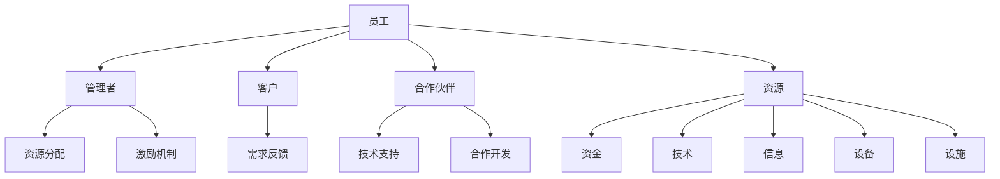

                 

# 创新生态系统：营造鼓励创意的组织环境

## 关键词
创新生态系统、创意激发、组织文化、组织环境、创新管理、绩效评估、数学模型

## 摘要
本文将深入探讨创新生态系统的概念、构建方法以及实际应用。我们将分析创新生态系统的核心组成部分，探讨如何营造鼓励创意的组织环境，并介绍创新生态系统在不同行业中的成功案例。通过详细的案例分析、数学模型和项目实战，我们将了解如何有效构建和管理创新生态系统，为组织带来持续的创新动力和竞争优势。

## 引言

在当今快速变化和竞争激烈的市场环境中，创新能力已成为组织持续发展的关键驱动力。为了在激烈的市场竞争中脱颖而出，许多组织开始重视创新生态系统的构建。创新生态系统是一个复杂的网络结构，它包括各种相互关联的元素，如员工、管理者、客户、合作伙伴和资源等。这些元素共同作用，形成一种支持创意产生、发展和实现的良性循环。

本文将围绕创新生态系统的构建和管理展开讨论，具体内容包括：

1. **创新生态系统的定义与重要性**
2. **鼓励创意的组织环境**
3. **组织文化的塑造与改变**
4. **创新生态系统的构建与运营**
5. **创新生态系统的行业案例分析**
6. **创新生态系统的国际比较**
7. **构建个人创新生态系统**

通过上述内容，我们将系统地理解创新生态系统的概念，掌握如何营造鼓励创意的组织环境，并学会如何在不同行业和应用场景中构建和管理创新生态系统。

## 创新生态系统的定义与重要性

### 1.1 创新生态系统的概念

创新生态系统是一个比喻，用来描述一个支持创新产生、发展和实现的复杂网络结构。这个网络结构中包含了多个相互关联的元素，如员工、管理者、客户、合作伙伴、资源等。这些元素相互作用，共同促进创新的形成和发展。

创新生态系统的核心组成部分可以概括为以下几个方面：

1. **员工**：创新生态系统的主体，他们是创意的源泉和实现者。员工的能力、动机和创新文化是影响创新生态系统绩效的关键因素。
2. **管理者**：管理者在创新生态系统中扮演着重要的角色，他们需要提供资源、支持和激励，创造一个有利于创新的环境。
3. **客户**：客户的需求和反馈是创新的重要驱动力。他们的参与和反馈可以帮助组织更好地理解市场需求，从而产生更具针对性的创新。
4. **合作伙伴**：合作伙伴包括供应商、咨询公司、大学和研究机构等。他们可以为组织提供技术支持、资源分享和合作开发的机会，增强创新能力。
5. **资源**：资源包括资金、技术、信息、设备和设施等。这些资源是创新活动的基础，确保创新能够在实际中得到实现。

### 1.2 创新生态系统的组成部分

为了更清晰地理解创新生态系统的构成，我们可以通过Mermaid流程图来展示各个组成部分及其相互关系：

### 1.3 创新生态系统与传统管理模式对比

与传统的管理模式相比，创新生态系统具有以下显著特点：

1. **开放性**：创新生态系统强调开放性和合作，鼓励内部和外部资源的共享与整合。而传统管理模式往往倾向于封闭和独立运营。
2. **灵活性**：创新生态系统具有高度灵活性，能够快速适应外部环境的变化。传统管理模式则更注重稳定性和长期规划。
3. **多样性**：创新生态系统包含多种不同类型的元素，如员工、客户、合作伙伴等。这些多样性的元素相互影响，形成丰富的创新氛围。传统管理模式则更多关注单一要素的优化。

### 1.4 创新生态系统的价值

创新生态系统对组织具有多方面的价值：

1. **提高创新能力**：通过整合内部和外部资源，创新生态系统可以激发员工的创造力，提高组织的整体创新能力。
2. **增强市场竞争力**：创新是组织在市场中保持竞争优势的关键。创新生态系统可以帮助组织更快地响应市场需求，开发出更具竞争力的产品和服务。
3. **促进可持续发展**：创新生态系统不仅关注短期收益，还注重长期可持续发展。通过不断地创新和优化，组织可以保持持续的竞争优势。

### 1.5 创新生态系统的关键要素

为了构建一个有效的创新生态系统，以下关键要素至关重要：

1. **领导层的支持**：领导层的支持是创新生态系统成功的关键。他们需要提供资源、制定政策，并鼓励员工进行创新。
2. **员工能力**：员工的能力和素质是创新生态系统的基石。组织需要通过培训和发展项目，提升员工的技术能力和创新思维。
3. **激励与反馈机制**：有效的激励和反馈机制可以激发员工的创新动力。组织可以通过奖金、晋升和公开表彰等方式，激励员工进行创新。
4. **资源共享**：资源共享是创新生态系统的一个重要特点。组织需要建立开放的资源共享平台，促进内部和外部资源的有效利用。
5. **持续改进**：创新生态系统不是一成不变的，它需要不断地进行评估和改进。组织需要定期评估创新生态系统的绩效，并根据评估结果进行相应的调整和优化。

通过上述分析和探讨，我们可以看到，创新生态系统是一个复杂而有机的网络结构，它包含多个相互关联的元素，共同促进创新的形成和发展。理解创新生态系统的概念和组成部分，对于组织来说，是构建和管理创新生态系统的第一步。在接下来的章节中，我们将进一步探讨如何营造鼓励创意的组织环境，以及如何在实际中构建和运营创新生态系统。

### 鼓励创意的组织环境

在一个鼓励创意的组织环境中，员工能够自由地表达自己的想法，不断地探索和尝试新的解决方案。这种环境不仅能够激发员工的创造力，还能够促进组织整体的创新水平。那么，如何营造一个鼓励创意的组织环境呢？以下是一些关键策略和方法。

#### 2.1 创意与创意管理的概念

首先，我们需要明确创意的概念。创意是一种新颖的思想、想法或解决方案，它可以通过创新的方式解决问题或创造价值。创意管理则是指一系列管理策略和工具，旨在激发、捕捉、发展和实施创意。

创意管理的关键目标包括：

1. **激发创意**：通过创造一个开放、包容和支持的环境，激发员工的思想和想象力。
2. **捕捉创意**：建立有效的机制和工具，确保创意能够被及时捕捉和记录。
3. **发展和实施创意**：通过资源分配、团队协作和项目管理，将创意转化为实际的产品和服务。

#### 2.2 组织环境对创意的影响

组织环境是影响创意产生和发展的关键因素。一个支持创意的组织环境通常具备以下特点：

1. **开放性和包容性**：组织鼓励不同背景和观点的碰撞，这种多样性有助于激发新的创意。
2. **信任和支持**：组织内部建立信任机制，员工可以自由地表达自己的想法和意见，而不用担心批评或惩罚。
3. **灵活性和适应性**：组织能够快速适应变化，提供必要的资源和支持，帮助员工实现创意。
4. **激励和奖励**：组织通过奖金、晋升和其他激励措施，鼓励员工提出和实现创意。

#### 2.3 创意激发的方法与工具

为了营造一个鼓励创意的组织环境，组织可以采用以下方法与工具：

1. **头脑风暴**：头脑风暴是一种常用的创意激发方法。通过集体讨论，鼓励参与者提出尽可能多的想法，无论这些想法是否实际可行。
2. **思维导图**：思维导图可以帮助组织系统地组织和展示创意，通过分支和连接，发现新的关联和可能性。
3. **自由写作**：自由写作是一种不拘泥于规则和限制的写作方式，鼓励员工自由地表达自己的想法，释放创造力。
4. **游戏化**：通过游戏化的方式，将创意激发融入到有趣的活动和挑战中，激发员工的参与热情和创造力。

#### 2.4 创意管理的实践案例分析

以下是一个创意管理的实践案例：

某科技公司采用了一种名为“创意邮箱”的工具，鼓励员工随时随地提交创意。每个员工都可以匿名提交自己的想法，公司会对这些创意进行评估和分类，并根据创意的质量和可行性给予相应的奖励。这一机制不仅提高了员工的参与度，还激发了大量的创新思维，公司的产品和服务质量因此得到了显著提升。

#### 2.5 创意管理的评估与改进

为了确保创意管理的效果，组织需要定期对创意管理的过程和结果进行评估。以下是一些评估和改进的方法：

1. **定量分析**：通过统计提交的创意数量、实现率、奖励金额等指标，评估创意管理的整体效果。
2. **定性分析**：通过员工满意度调查、创意实施后的反馈等方式，了解创意管理的实际效果和员工的真实感受。
3. **持续改进**：根据评估结果，对创意管理策略和工具进行优化和改进，以更好地激发员工的创意。

通过上述方法和策略，组织可以有效地营造一个鼓励创意的环境，激发员工的创新潜力，推动组织的持续发展。

### 组织文化的塑造与改变

组织文化是影响员工行为和决策的关键因素，它对创新生态系统的构建和运行起着至关重要的作用。一个积极、开放和创新的组织文化可以极大地促进员工的创造力，提升组织的整体创新能力。因此，塑造和改变组织文化是构建有效创新生态系统的关键步骤。

#### 3.1 组织文化的概念与特征

组织文化是指组织在长期发展过程中形成的共同价值观、信仰、行为准则和工作方式。它不仅影响员工的态度和行为，还决定组织的氛围和效率。组织文化的特征包括：

1. **共同价值观**：组织文化建立在共同的价值观之上，这些价值观为员工提供行为指南，促进团队合作和协作。
2. **信仰和行为准则**：组织文化通过一系列信仰和行为准则来规范员工的行为，这些准则反映了组织的价值观和目标。
3. **氛围和效率**：组织文化塑造了一种特定的氛围，影响员工的工作态度和效率。一个积极的文化可以激发员工的积极性，提高工作效率。

#### 3.2 塑造创新组织文化的策略

要塑造一个创新组织文化，组织可以采取以下策略：

1. **明确价值观**：组织需要明确和创新相关的核心价值观，并将这些价值观融入到组织的日常运营中。例如，创新、学习、协作和开放等价值观。
2. **领导层的示范**：领导层需要在日常工作中展现创新行为，通过示范作用激发员工的创新意识。领导层的支持和鼓励是创新文化形成的关键。
3. **培训和发展**：组织可以通过培训和发展项目，提高员工的技术能力和创新思维。这包括创新方法、设计思维和项目管理等方面的培训。
4. **激励机制**：组织需要建立有效的激励机制，鼓励员工提出和实现创新。这可以包括奖金、晋升、公开表彰和其他形式的奖励。
5. **开放沟通**：组织应该鼓励开放沟通，建立透明和开放的沟通渠道，使员工能够自由地表达自己的想法和建议。
6. **文化活动和社交**：组织可以通过举办文化活动和社交活动，促进员工之间的交流和合作，增强团队凝聚力和创新氛围。

#### 3.3 改变组织文化的挑战与路径

改变组织文化是一个复杂的过程，面临着诸多挑战。以下是一些常见的挑战和应对路径：

1. **传统的文化阻力**：长期形成的传统组织文化可能会抵制变革，员工可能会对新的文化产生疑虑和抵触。组织需要通过沟通和教育，解释变革的必要性和好处，逐步消除阻力。
2. **领导层的支持**：领导层的支持是改变组织文化的关键。领导层需要积极参与变革过程，并提供必要的资源和激励。
3. **时间和资源的投入**：改变组织文化需要时间和资源的投入。组织需要为变革提供充足的时间和资源，确保变革的顺利进行。
4. **评估和反馈**：组织需要定期评估变革的效果，并根据反馈进行调整和优化。这有助于确保变革的方向和效果。

#### 3.4 组织文化评估与持续改进

为了确保组织文化的有效性，组织需要定期进行文化评估，并持续改进。以下是一些评估和改进的方法：

1. **员工满意度调查**：通过员工满意度调查，了解员工对组织文化的感受和反馈，识别改进的机会。
2. **行为观察**：通过观察员工的行为，评估文化的影响和效果。这包括员工的工作方式、团队合作和创新能力等方面。
3. **文化指标**：建立一套文化指标，用于评估组织文化的各个方面，如创新水平、团队合作、员工满意度等。
4. **反馈与调整**：根据评估结果，对组织文化进行反馈和调整。这可以包括改进培训计划、优化激励机制、加强沟通等。

通过上述策略和步骤，组织可以有效地塑造和改变组织文化，营造一个鼓励创新的环境，为创新生态系统的构建和运行提供坚实的基础。

### 创新生态系统的构建与运营

构建一个有效的创新生态系统不仅需要明确其核心组成部分，还需要制定具体的构建和运营策略。以下将详细探讨创新生态系统的构建原则、关键要素及其运营方法。

#### 4.1 创新生态系统构建的原则

1. **系统性原则**：创新生态系统是一个复杂的系统，包含多个相互关联的子系统。构建创新生态系统时，需要考虑各子系统之间的相互关系和协同效应，确保系统整体的有效运作。
2. **开放性原则**：创新生态系统需要具备开放性，鼓励内外部资源的共享与交流。开放性有助于吸引更多的创新要素进入系统，促进创意的碰撞和融合。
3. **灵活性原则**：创新生态系统应具备灵活性，能够快速适应外部环境和内部需求的变化。灵活性是创新生态系统持续发展的关键。
4. **可持续性原则**：创新生态系统不仅追求短期创新成果，还应注重长期可持续发展。可持续性有助于确保创新生态系统的持久性和稳定性。

#### 4.2 创新生态系统运营的关键要素

1. **资源要素**：资源是创新生态系统的基础。这些资源包括资金、技术、人才、信息、设备等。有效的资源管理是确保创新活动顺利进行的关键。
2. **激励机制**：激励机制是激发员工创新动力的关键。组织应建立公平、透明的激励机制，包括奖金、晋升、荣誉等，以鼓励员工积极参与创新活动。
3. **信息交流**：信息交流是创新生态系统的重要组成部分。组织应建立高效的沟通渠道，确保信息在内部和外部之间的自由流动。
4. **风险管理**：创新过程充满不确定性，组织需要建立有效的风险管理机制，以应对创新过程中的风险和挑战。
5. **评估与反馈**：定期评估创新生态系统的运行效果，并根据反馈进行持续改进。评估与反馈是确保创新生态系统有效运行的重要手段。

#### 4.3 创新生态系统的构建步骤

1. **明确目标**：首先，组织需要明确创新生态系统的目标，包括创新方向、预期成果等。明确的目标有助于指导后续的构建工作。
2. **资源整合**：根据创新目标，整合内部和外部资源，确保资源的有效配置和利用。资源整合是构建创新生态系统的基础。
3. **制度设计**：设计合适的创新管理制度，包括激励机制、评估机制、风险控制机制等。制度设计是创新生态系统稳定运行的重要保障。
4. **团队构建**：构建由不同专业背景、技能和经验组成的创新团队，确保团队具备多样化的创新能力和协作精神。
5. **环境营造**：营造一个支持创新的文化氛围，鼓励员工自由表达意见，提供必要的培训和支持。

#### 4.4 创新生态系统运营方法

1. **项目化管理**：将创新活动项目化，通过项目管理的工具和方法，确保创新活动的目标明确、进度可控、资源高效利用。
2. **合作与交流**：鼓励内部和外部合作，建立合作网络，促进信息交流和资源共享。
3. **持续改进**：定期评估创新生态系统的运行效果，根据反馈进行持续改进。
4. **激励机制**：建立有效的激励机制，鼓励员工积极参与创新活动，提升创新积极性。

#### 4.5 创新生态系统的评估与优化

1. **绩效评估**：通过定性和定量指标，评估创新生态系统的绩效，如创新成功率、创新速度、市场占有率等。
2. **反馈机制**：建立反馈机制，收集员工和合作伙伴的反馈，及时调整创新生态系统运营策略。
3. **持续优化**：根据评估结果和反馈，持续优化创新生态系统，提升其运行效率和创新能力。

通过以上构建和运营方法，组织可以有效地构建和管理创新生态系统，推动持续创新，实现组织的长期发展。

### 创新生态系统的行业案例分析

创新生态系统在不同行业中的应用展现了其独特的价值。以下是几个不同行业中的创新生态系统案例分析，这些案例揭示了如何在不同环境中构建和管理创新生态系统，以及其成功的关键因素。

#### 5.1 科技行业的创新生态系统案例分析

在科技行业，创新生态系统是推动技术进步和市场领导的关键。以Google为例，其创新生态系统以其开放的文化和强大的资源整合能力而著称。Google通过其“20%时间”项目允许员工将部分工作时间用于个人感兴趣的项目，这一政策激发了员工的创新潜力，诞生了包括Gmail和Google News在内的多个成功产品。

**成功因素：**
- **开放的内部创业环境**：允许员工自由探索新项目和想法。
- **强大的资源整合能力**：Google提供了丰富的技术、资金和人力资源，支持创新项目的实施。
- **高效的协作机制**：通过内部沟通平台和协作工具，促进不同团队之间的信息共享和协作。

#### 5.2 文化创意行业的创新生态系统案例分析

在文化创意行业，创新生态系统的构建通常依赖于创意的多样性和跨行业的合作。Netflix作为一个成功的例子，通过其内容平台和广泛的合作伙伴网络，成功地推动了一系列创新内容的生产。

**成功因素：**
- **多元化的内容创作团队**：Netflix拥有来自不同文化背景和专业领域的创作者，这有助于创造出多样化的内容。
- **广泛的合作伙伴网络**：与制作公司、独立创作者和内容平台合作，扩大内容来源和创意输入。
- **用户反馈机制**：通过用户行为分析和反馈，及时调整内容策略，提高内容的创新性和市场适应性。

#### 5.3 医疗健康行业的创新生态系统案例分析

在医疗健康行业，创新生态系统的重要性尤为突出，因为它直接关系到患者的健康和生命安全。以辉瑞公司为例，其创新生态系统通过多渠道的合作和持续的研究，推动了多个重要的药物和技术的研发。

**成功因素：**
- **跨学科研究团队**：辉瑞通过跨学科的研究团队，结合医药、生物学、工程技术等多领域的专业知识，加速创新进程。
- **全球合作网络**：与全球的研究机构、大学和制药公司建立合作，共享资源和研究成果。
- **患者参与**：通过患者的参与和反馈，辉瑞能够更好地理解患者的需求，为产品创新提供方向。

#### 5.4 教育行业的创新生态系统案例分析

在教育行业，创新生态系统有助于提高教育质量和学习体验。以Khan Academy为例，其基于互联网的学习平台通过开放的资源和个性化学习路径，为学生提供了丰富的学习机会。

**成功因素：**
- **开放的教育资源**：Khan Academy提供了大量的免费教育资源，任何人都可以访问和利用。
- **个性化学习路径**：通过数据分析，为每个学生提供个性化的学习建议，提高学习效果。
- **社区支持**：建立一个由教师、学生和家长组成的社区，促进知识和经验的共享。

#### 5.5 制造业的创新生态系统案例分析

在制造业，创新生态系统通过智能化和自动化技术推动了生产效率的提升。以西门子为例，其通过构建智能工厂，实现了生产流程的自动化和优化。

**成功因素：**
- **智能制造技术**：通过采用物联网、人工智能和大数据分析等先进技术，实现生产过程的智能化。
- **灵活的供应链管理**：与供应商和合作伙伴建立紧密的合作关系，确保供应链的灵活性和响应速度。
- **持续的技术研发**：持续投入研发，不断引进和开发新技术，保持竞争优势。

通过这些案例，我们可以看到，不同行业的创新生态系统虽然各有特点，但它们都依赖于开放的文化、高效的资源整合、多样化的合作网络和持续的改进与创新。这些成功因素为其他行业提供了宝贵的借鉴和启示。

### 创新生态系统的国际比较

创新生态系统在不同国家和地区之间存在着显著的差异，这些差异主要体现在政策支持、市场环境、企业文化和教育体系等方面。以下将比较几个主要发达国家的创新生态系统，分析其特点及其对创新生态系统的推动作用。

#### 6.1 发达国家的创新生态系统特点

1. **美国**：美国的创新生态系统以其开放性和多样性著称。美国拥有世界一流的研究机构和大学，如麻省理工学院、斯坦福大学等，这些机构为创新提供了坚实的基础。此外，美国政府对创新给予了高度支持，通过财政补贴、税收优惠和知识产权保护等政策，鼓励企业和个人进行创新。硅谷作为全球科技中心，吸引了大量创业者、投资者和工程师，形成了浓厚的创新氛围。

2. **欧洲**：欧洲的创新生态系统以合作和多元性为特点。欧洲各国政府通过联合研究和创新项目，促进了跨国合作。例如，欧洲联盟（EU）通过“地平线2020”计划（Horizon 2020）等科研项目，支持跨国创新合作。此外，欧洲的企业普遍重视研发投入，拥有强大的创新能力。德国、瑞典和瑞士等国家的创新生态系统在制造业、生物技术和新材料等领域具有较强的竞争力。

3. **日本**：日本创新生态系统以精细化和高效率为特点。日本企业在产品研发和制造过程中注重细节和精度，形成了强大的创新能力和高质量的产品。日本政府通过政策激励和产业扶持，推动了技术创新和产业升级。此外，日本企业普遍实行终身雇佣制，这有助于稳定员工队伍，提高员工的工作积极性和创新能力。

4. **以色列**：以色列的创新生态系统以其高密度和创新活跃度为特点。以色列是世界上每千人中拥有公司数量最多的国家之一，其初创企业集中在科技、生物技术和金融科技等领域。以色列政府通过提供创业资金、税收优惠和科研支持等政策，为创新提供了良好的环境。此外，以色列的高等教育机构和研究机构与产业界紧密合作，促进了科技成果的转化。

#### 6.2 发展中国家的创新生态系统现状

与发达国家相比，发展中国家的创新生态系统相对较弱，但许多国家正在努力提升其创新能力。以下是一些发展中国家的创新生态系统现状：

1. **中国**：中国的创新生态系统近年来取得了显著进展。中国政府通过一系列政策支持，如“大众创业、万众创新”战略和“国家科技重大专项”等，推动了创新活动的广泛开展。中国拥有庞大的人才储备和市场需求，这为创新提供了良好的环境。然而，中国的创新生态系统仍面临一些挑战，如知识产权保护不力、企业研发投入不足等。

2. **印度**：印度的创新生态系统以其软件和信息技术产业而闻名。印度拥有大量优秀的IT工程师和软件开发者，其在软件开发、移动应用和数据分析等领域具有较强的竞争力。印度政府通过提供财政补贴、税收优惠和研发支持等政策，鼓励创新活动。然而，印度的创新生态系统仍面临基础设施不足、市场不成熟等挑战。

3. **巴西**：巴西的创新生态系统主要集中在农业、生物技术和能源领域。巴西政府通过提供资金支持、技术转移和国际合作等政策，推动了技术创新和产业发展。然而，巴西的创新生态系统仍面临投资不足、市场不成熟等问题。

#### 6.3 创新生态系统的全球化趋势

随着全球化的深入发展，创新生态系统的全球化趋势愈发明显。跨国合作和知识共享成为推动全球创新的重要力量。以下是一些全球化趋势：

1. **跨国创新合作**：发达国家和发展中国家之间的创新合作不断加强。跨国企业和研究机构通过联合研究和项目合作，共享资源和知识，推动技术创新。

2. **全球创新网络**：全球范围内的创新网络正在形成，各国通过创新中心、科技园区和孵化器等平台，建立全球创新网络。这些网络促进了知识和技术的高效传播和利用。

3. **知识产权保护**：随着全球创新活动的增加，知识产权保护成为全球化创新的重要保障。各国纷纷加强知识产权法律建设和执法力度，保护创新成果。

综上所述，不同国家的创新生态系统具有各自的特点和优势，但都面临着不同的挑战。全球化趋势为各国创新生态系统提供了新的机遇，通过跨国合作和知识共享，可以推动全球创新的发展，实现共同进步。

### 构建个人创新生态系统

在当今快速变化的时代，个人创新生态系统的构建变得愈发重要。通过系统化地管理和优化个人资源、技能和思维方式，个人可以持续地激发创意，提高创新能力和竞争力。以下将介绍如何构建个人创新生态系统，包括所需策略和实际案例。

#### 7.1 个人创新生态系统的概念

个人创新生态系统是指一个由个人资源、技能、思维方式、社交网络等组成的有机系统，旨在激发创意、推动个人创新过程。这个系统不仅关注个人能力的提升，还关注如何有效地整合内外部资源，实现创新的持续性和高效性。

#### 7.2 构建个人创新生态系统的策略

1. **明确目标与愿景**：
   - 首先，个人需要明确自己的创新目标和愿景。这有助于指导个人在创新过程中的努力方向，确保创新活动与个人长远发展目标相一致。
   - 例子：某软件开发工程师希望提升在人工智能领域的创新能力和影响力，他的目标可以是开发一款革命性的AI产品。

2. **提升自身技能**：
   - 个人需要通过学习和实践不断提升自己的技能和知识，这是创新的基础。可以通过参加培训、在线课程、阅读专业书籍等方式进行学习。
   - 例子：为了提升编程能力，该工程师可以参加高级编程课程、阅读相关技术书籍，并参与开源项目。

3. **建立多样化的社交网络**：
   - 社交网络是获取新信息和资源的重要渠道。个人需要建立多样化的社交网络，包括同事、行业专家、同行等。
   - 例子：该工程师可以加入专业协会、技术社区，并积极参与行业活动，扩大自己的社交圈子。

4. **培养创新思维**：
   - 创新思维是激发创意的关键。个人可以通过思维训练、头脑风暴、跨界学习等方式培养创新思维。
   - 例子：通过阅读设计思维相关的书籍、参加创新思维训练工作坊，该工程师可以提升自己的创新思维。

5. **优化工作环境**：
   - 工作环境对创新过程具有重要影响。个人需要创造一个有利于创新的工作环境，包括物理环境、心理环境等。
   - 例子：该工程师可以为自己创造一个安静、舒适的工作空间，同时保持积极、开放的心态。

6. **定期反思与调整**：
   - 个人需要定期反思自己的创新过程和成果，根据反思结果进行调整和优化。这有助于个人不断改进和创新生态系统。
   - 例子：该工程师可以每月进行一次自我评估，分析自己的创新表现，制定改进计划。

#### 7.3 个人创新生态系统的维护与优化

1. **持续学习与成长**：
   - 创新生态系统需要不断更新和优化，个人需要持续学习新的知识和技能，以适应不断变化的环境。
   - 例子：该工程师可以定期更新自己的技能库，学习新的编程语言和技术框架。

2. **积极参与创新实践**：
   - 实践是检验创新的唯一标准。个人需要积极参与各种创新项目，将理论知识转化为实际成果。
   - 例子：该工程师可以参与公司内部创新项目，或者自己发起创新项目，实现创新理念。

3. **建立反馈机制**：
   - 反馈是优化创新生态系统的关键。个人需要建立有效的反馈机制，收集用户、同事和其他利益相关者的反馈，及时调整创新策略。
   - 例子：该工程师可以通过用户调研、同事反馈等方式，了解产品或项目的表现，并根据反馈进行改进。

4. **保持心态平衡**：
   - 创新过程充满挑战和不确定性，个人需要保持积极的心态，面对失败和挫折。心态平衡有助于个人持续创新。
   - 例子：该工程师可以通过运动、冥想等方式，保持心理健康，提升创新能力。

#### 7.4 个人创新生态系统案例分享

以下是一个个人创新生态系统的案例：

某设计师在构建个人创新生态系统时，采取了以下策略：

1. **明确目标与愿景**：她希望成为一名具备国际视野的创意设计师。
2. **提升自身技能**：她通过参加设计学院的高级课程，学习最新的设计技术和趋势。
3. **建立多样化社交网络**：她加入了多个设计社区，参加了多个国际设计展会，与全球的设计师建立了联系。
4. **培养创新思维**：她通过阅读设计思维书籍、参与创新工作坊，培养了自己的创新思维。
5. **优化工作环境**：她在家中创造了一个专门的工作室，配备了先进的设计工具和设备。
6. **定期反思与调整**：她每月进行自我评估，分析自己的设计作品和市场反馈，制定改进计划。

通过这些策略，她不仅提升了自己的设计能力，还获得了一系列国际设计奖项，实现了自己的创新目标。

构建个人创新生态系统需要明确目标、持续学习、优化资源和管理心态。通过有效的策略和持续的努力，个人可以不断提升创新能力，实现持续的创新和发展。

### 结论

创新生态系统是推动组织和个人持续创新的重要保障。通过系统地构建和运营创新生态系统，组织可以激发员工的创造力，提高整体创新能力，从而在激烈的市场竞争中脱颖而出。本文详细探讨了创新生态系统的定义、重要性、构建原则、运营方法以及在不同行业和地区的应用案例，提供了构建和管理创新生态系统的全面指导。

在个人层面，构建个人创新生态系统同样重要。通过明确目标、提升技能、建立社交网络和优化工作环境，个人可以持续地激发创意，提高创新能力和竞争力。

展望未来，创新生态系统的发展将继续受到技术进步、全球化趋势和政策环境的影响。组织和个人需要不断适应变化，优化创新生态系统，以应对未来的挑战和机遇。通过持续的创新和改进，我们可以共同推动社会的进步和发展。

### 附录

#### 附录A：创新生态系统相关资源与工具

1. **书籍推荐**：
   - 《创新者的窘境》
   - 《创意的诞生》
   - 《设计思维：创新发明的秘密》

2. **在线课程**：
   - Coursera上的“设计思维与创新策略”
   - edX上的“创新与创业”

3. **工具与平台**：
   - MindManager（思维导图软件）
   - Slack（团队协作工具）
   - GitHub（代码托管平台）
   - Trello（项目管理工具）

#### 附录B：创新生态系统构建与运营工具表

1. **头脑风暴工具**：
   - Miro（在线协作白板）
   - Sketchboard（在线原型设计）

2. **项目管理工具**：
   - Asana（任务管理工具）
   - Jira（敏捷项目管理）

3. **数据分析工具**：
   - Tableau（数据可视化工具）
   - Excel（数据分析软件）

4. **协作与沟通工具**：
   - Zoom（视频会议软件）
   - Microsoft Teams（团队协作平台）

#### 最佳实践 Tips

1. **建立明确的创新目标**：确保创新活动与组织或个人目标一致。
2. **鼓励多样化的团队组成**：多样化的团队可以带来不同的视角和创意。
3. **定期评估和反馈**：定期评估创新效果，及时调整策略。
4. **培养创新思维**：通过培训和工作坊，提高员工的创新思维能力。

### 小结

本文系统地探讨了创新生态系统的构建和管理，提供了详细的案例分析和最佳实践建议。通过有效地构建和管理创新生态系统，组织和个人可以持续激发创新，实现持续发展和竞争优势。

### 注意事项

1. **持续投入**：创新需要持续的资金和资源投入，确保创新生态系统的稳定运行。
2. **风险管理**：创新过程中充满不确定性，需要建立有效的风险管理机制。
3. **文化塑造**：创新文化的塑造是构建创新生态系统的基础，需要长期努力。

### 拓展阅读

1. **《创新者的DNA》**：克莱顿·克里斯坦森
2. **《创新者的思考方式》**：迈克尔·雷蒙德

通过上述资源和建议，读者可以进一步了解和创新生态系统的构建与管理。希望本文能够为读者提供有价值的参考，助力他们在创新道路上取得成功。

### 作者信息

作者：AI天才研究院/AI Genius Institute & 禅与计算机程序设计艺术 /Zen And The Art of Computer Programming

