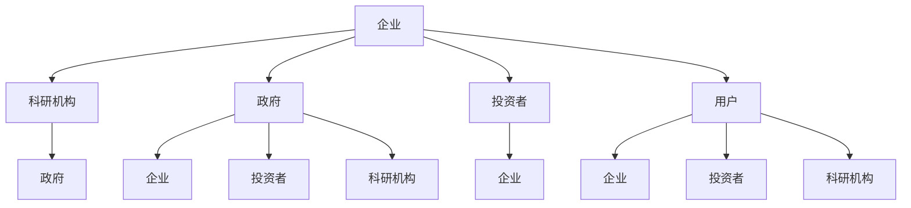

                 

## 引言

在当今快速变化的商业环境中，创新能力已成为企业成败的关键因素。而打造一个鼓励创意与冒险的环境，则是实现持续创新的核心。本篇文章将以《创新生态：打造鼓励创意与冒险的环境》为主题，深入探讨如何构建一个有利于创新和冒险的组织文化，从而推动企业不断向前发展。

本文将分为以下几个部分：

1. **背景介绍**：介绍创新生态的起源和发展历程，以及当前创新环境的重要性。
2. **核心概念与联系**：详细阐述创新生态的概念、核心要素及其与传统商业模式的区别，并通过Mermaid流程图展示核心概念之间的联系。
3. **鼓励创意与冒险的环境构建**：分析组织文化的重要性，探讨如何培养创意思维与冒险精神，以及组织文化的变革与适应。
4. **实际操作与案例分析**：提供具体的策略和实践方法，并通过创新案例研究和失败案例分析，总结经验教训。
5. **未来趋势与挑战**：探讨创新生态的未来发展趋势，以及可能面临的挑战和应对策略。
6. **总结与展望**：对全文内容进行总结，并提出未来的研究方向和实践建议。

通过以上结构的逐步分析，我们将全面了解如何打造一个鼓励创意与冒险的环境，从而实现企业的持续创新和成功。

### 背景介绍

创新生态的概念起源于20世纪中叶，随着科技和经济的飞速发展，创新逐渐成为驱动社会进步和经济增长的重要引擎。从蒸汽机时代到信息时代，再到现在的智能时代，每一次技术革命都带来了创新生态的重大变革。在当今这个充满不确定性和竞争激烈的市场环境中，创新不仅是一种战略，更是一种生存和发展方式。

创新生态的起源可以追溯到工业革命时期，那时创新主要依赖于技术和工艺的改进。随着信息技术的崛起，创新逐渐从线性思维转向复杂系统中的多维度互动，形成了如今我们所熟知的创新生态。这一生态不仅包含了技术创新，还涵盖了市场、政策、文化等多个方面，形成了一个相互影响、相互促进的动态系统。

创新生态的发展历程经历了几个重要阶段：

- **初始阶段**：20世纪中叶，创新主要依赖于个人的创意和实验室的实验，创新成果往往局限于学术界或少数企业内部。
- **发展阶段**：20世纪末，随着互联网的普及和商业模式的创新，创新生态开始从封闭走向开放，更多的企业和个人参与到创新过程中。
- **成熟阶段**：21世纪初，全球化加速，新技术不断涌现，创新生态进入了一个高度互联和协作的时代，跨学科、跨领域的合作成为常态。

在当前的商业环境中，创新生态的重要性愈发凸显。首先，创新已成为企业竞争力的核心。在竞争激烈的市场中，只有不断进行创新，企业才能保持领先地位，抓住新的市场机会。其次，创新是推动经济增长的重要动力。根据统计数据，创新企业通常比传统企业有更高的增长速度和更高的利润率。最后，创新有助于解决社会问题。许多社会挑战，如环境保护、医疗健康、教育等，都需要通过创新来找到有效的解决方案。

总之，创新生态不仅是一个概念，更是一种战略和行动指南。通过打造一个鼓励创意与冒险的环境，企业可以不断提升创新能力，实现持续发展。接下来，我们将深入探讨创新生态的核心概念和要素，以更好地理解这一复杂而重要的系统。

### 核心概念与联系

在探讨创新生态的核心概念和要素之前，我们需要明确几个关键的定义和概念。创新生态不仅仅是一个抽象的概念，它包含了一系列相互关联的要素，这些要素共同作用，推动创新的发生和发展。以下是创新生态中几个核心概念的定义和联系：

#### 创新生态的定义

创新生态（Innovation Ecosystem）可以被定义为一种由多个利益相关者（如企业、科研机构、政府、投资者、用户等）组成的复杂网络，这些利益相关者通过相互作用和协同合作，共同推动创新活动的进行和发展。创新生态的核心在于其开放性和协作性，它打破了传统的封闭式创新模式，通过跨领域、跨组织的合作，实现了创新资源的最大化利用和协同效应的发挥。

#### 核心要素

1. **企业**：企业是创新生态中的核心主体，它们通过研发、生产和市场推广等环节，将创新成果转化为实际的商业价值。企业不仅需要具备创新意识和创新能力，还需要与其他利益相关者建立良好的合作关系，以实现资源的共享和优势互补。
   
2. **科研机构**：科研机构在创新生态中发挥着重要的基础研究和技术储备作用。它们通过科研活动和实验室成果，为企业提供了源源不断的技术创新来源。同时，科研机构还与企业、政府等合作，推动科研成果的产业化应用。

3. **政府**：政府在创新生态中扮演着政策制定者和推动者的角色。通过制定创新政策、提供资金支持、优化创新环境等手段，政府为创新活动提供了有力保障。政府的参与不仅有助于激发企业的创新热情，还可以促进创新资源的合理配置。

4. **投资者**：投资者在创新生态中起到资金支持的作用。他们通过投资创新项目，为企业提供了必要的资金，推动了创新活动的顺利进行。同时，投资者还通过提供市场反馈和战略建议，帮助企业优化创新路径。

5. **用户**：用户是创新生态中的重要参与者和反馈者。他们的需求和创新建议直接影响到企业的产品和服务开发方向。用户的参与不仅为企业提供了创新的原动力，还可以通过实际使用中的反馈，帮助企业发现和解决产品问题。

#### 核心概念之间的联系

创新生态中的各个核心要素并非孤立存在，而是通过相互联系和协同作用，形成了一个有机的整体。以下是核心概念之间的联系：

1. **企业-科研机构**：企业与科研机构之间的合作关系，有助于企业获取最新的科研成果，同时为科研机构提供了市场需求和应用场景。通过合作，双方可以实现资源共享和优势互补，提升创新效率。

2. **企业-政府**：企业与政府之间的互动，主要体现在政策支持、资金扶持和法规制定等方面。政府通过制定有利于创新的政策，为企业提供了良好的创新环境。同时，企业通过参与政策制定，影响政策的方向和内容，实现共赢。

3. **企业-投资者**：企业与投资者之间的合作，主要体现在资金投入和风险管理上。投资者通过投资企业，不仅为企业提供了资金支持，还可以通过专业管理和市场经验，帮助企业优化运营策略，降低风险。

4. **企业-用户**：企业与用户之间的互动，主要体现在产品开发和用户反馈上。企业通过深入了解用户需求，优化产品设计和功能，提升用户体验。同时，用户通过实际使用中的反馈，帮助企业发现产品问题，推动产品迭代升级。

5. **科研机构-政府**：科研机构与政府之间的合作，主要体现在科研项目的资金支持和管理上。政府通过提供资金和政策支持，推动科研机构进行前沿研究和技术创新。

#### Mermaid流程图

为了更直观地展示创新生态中核心概念之间的联系，我们可以使用Mermaid流程图来表示。以下是创新生态中的核心概念及其相互关系的Mermaid流程图：

通过以上定义和流程图的阐述，我们可以更加清晰地理解创新生态的核心概念及其相互之间的联系。接下来，我们将进一步探讨如何构建一个鼓励创意与冒险的环境，以推动创新生态的健康发展。

### 鼓励创意与冒险的环境构建

在了解了创新生态的核心概念和要素后，接下来我们需要探讨如何构建一个鼓励创意与冒险的环境。这样的环境不仅能够激发员工的创新潜力，还能为企业带来持续的创新动力。以下从组织文化、资源配置、团队建设等方面，详细阐述如何构建这样的环境。

#### 组织文化的重要性

组织文化是构建鼓励创意与冒险环境的核心因素之一。一个积极、开放、包容的组织文化能够激发员工的创造力和冒险精神。以下是几个关键点：

1. **尊重和鼓励差异**：在一个健康的组织文化中，员工的个性和观点应该得到尊重。不同的背景和思维方式可以带来更多的创意和创新的火花。管理者需要鼓励员工提出不同的意见，并对不同的观点保持开放态度。

2. **培养创新思维**：组织文化应该鼓励员工跳出传统思维框架，勇于尝试新的想法和方法。通过培训和工作坊等形式，企业可以培养员工的创新思维，帮助他们更好地应对复杂问题。

3. **包容失败**：创新往往伴随着失败，因此组织文化需要包容失败，并从中吸取经验。一个害怕失败的文化会抑制员工的冒险精神。管理者应该鼓励员工勇于尝试，即使失败也是学习和成长的过程。

4. **激励和认可**：组织文化应该建立一套激励机制，奖励那些敢于创新和冒险的员工。通过奖励、晋升和荣誉等形式，企业可以激励员工持续追求创新。

#### 资源配置

资源配置是构建鼓励创意与冒险环境的重要保障。以下是一些关键策略：

1. **资金投入**：企业需要为创新项目提供足够的资金支持。这包括研发资金、实验资金和市场推广资金等。只有充足的资金保障，创新项目才能顺利进行。

2. **人力配置**：企业需要为创新项目配备合适的团队和专家。这不仅包括技术研发人员，还包括市场人员、销售人员和其他相关领域的人才。通过跨部门的协作，企业可以最大化利用资源，提升创新效率。

3. **技术支持**：企业需要为员工提供先进的技术工具和资源。这包括云计算平台、大数据分析工具、人工智能算法等。通过技术支持，员工可以更加高效地进行创新工作。

#### 团队建设

团队建设是构建鼓励创意与冒险环境的重要环节。以下是一些关键策略：

1. **跨部门协作**：通过跨部门的协作，企业可以促进不同领域知识的交流与融合。这种协作不仅有助于解决复杂问题，还能激发创新的火花。

2. **多样性团队**：多样性团队可以带来不同的视角和思维方式，有助于发现新的创新机会。企业应该鼓励多样性，并确保团队中包括不同性别、年龄、文化和背景的成员。

3. **开放沟通**：团队成员之间的沟通应该畅通无阻。企业可以建立定期的团队会议、头脑风暴和工作坊，鼓励团队成员分享想法和经验，共同推动创新项目。

4. **激励和反馈**：企业应该为团队提供激励和反馈机制。通过设定明确的目标和奖励措施，企业可以激励团队成员积极参与创新项目。同时，及时的反馈和评估可以帮助团队不断改进和优化创新工作。

#### 实际操作与案例分析

为了更好地理解如何构建鼓励创意与冒险的环境，我们可以通过一些实际操作和案例分析来探讨。

**案例一：谷歌的创新环境**

谷歌以其开放的创新环境而著称。谷歌鼓励员工“80/20”时间制度，即员工可以将20%的工作时间用于自己感兴趣的项目。这一制度激发了员工的创新热情，产生了许多成功的项目，如Gmail和Google News等。谷歌还通过内部竞赛、员工推荐和项目孵化器等方式，进一步推动创新。

**案例二：亚马逊的员工反馈系统**

亚马逊建立了开放的员工反馈系统，员工可以匿名提交意见和建议。这一系统不仅帮助企业发现和解决问题，还激励员工积极参与创新。亚马逊的创始人杰夫·贝佐斯（Jeff Bezos）甚至设立了“邮件炸弹”（Mail Bomb）机制，员工可以在关键时刻通过邮件提出重大建议，直接发送给贝佐斯。

**案例三：特斯拉的团队建设**

特斯拉强调团队建设，通过跨部门的协作和创新实验，推动公司的发展。特斯拉的创始人埃隆·马斯克（Elon Musk）鼓励员工勇于尝试，即使失败也是成长的过程。特斯拉还通过定期的团队建设活动，增强团队凝聚力和创新动力。

通过以上实际操作和案例分析，我们可以看到，构建鼓励创意与冒险的环境并非一蹴而就，需要企业在多个方面进行持续的努力和优化。只有通过营造积极的文化、合理的资源配置和有效的团队建设，企业才能打造出一个真正的创新生态。

### 实际操作与案例分析

在实际操作中，构建一个鼓励创意与冒险的环境是一个系统工程，涉及到多个方面的策略和具体实施步骤。以下我们将通过具体的策略、方法、步骤，以及成功和失败的案例分析，来详细阐述这一过程。

#### 构建创新生态的策略

1. **制定明确的创新目标**：首先，企业需要明确其创新目标，包括创新的方向、重点领域和预期成果。这些目标应与企业的整体战略和愿景相一致。例如，苹果公司在其智能手机的初期阶段，就明确了要通过技术创新改变通信方式的目标。

2. **建立跨部门的协作机制**：创新往往需要跨部门的合作。因此，企业需要建立有效的跨部门协作机制，促进不同部门之间的知识共享和资源整合。例如，谷歌的“创新时间”（Innovation Time）项目允许员工在不同部门之间自由流动，以推动跨部门合作。

3. **提供充分的资源支持**：为了保障创新活动的顺利进行，企业需要提供充分的资源支持，包括资金、技术、人力和时间等。例如，3M公司通过其“15%时间”政策，为员工提供15%的工作时间用于个人感兴趣的创新项目。

4. **建立激励机制**：创新需要动力，因此企业需要建立一套有效的激励机制，以鼓励员工积极参与创新活动。这可以包括物质奖励、晋升机会和荣誉表彰等。例如，微软的“创新之星”（Innovation Star）奖项，每年评选出在创新方面有突出贡献的员工。

5. **创建开放的沟通环境**：企业需要创造一个开放的沟通环境，鼓励员工自由表达想法和建议。例如，通过定期的创新会议、头脑风暴活动和开放论坛，让员工有机会分享创意和反馈。

#### 实际操作步骤

1. **项目策划与立项**：首先，企业需要进行创新项目的策划和立项。这包括确定项目目标、制定项目计划、评估项目风险和确定项目团队等。例如，微软在其“微软创新项目”（Microsoft Innovation Program）中，会进行详细的项目策划和立项流程。

2. **团队组建与分工**：根据项目需求，企业需要组建相应的创新团队，并明确团队成员的分工和职责。这包括技术研发人员、市场人员、产品经理等。例如，特斯拉在其电动汽车项目中，就组建了由工程师、设计师和市场专家组成的跨功能团队。

3. **项目实施与监控**：在项目实施过程中，企业需要严格监控项目的进展情况，确保项目按计划进行。例如，通过项目进度报告、定期会议和风险评估等措施，来保证项目的顺利进行。

4. **项目评估与反馈**：项目完成后，企业需要对项目进行评估，总结经验教训，并对团队和员工进行反馈。这有助于提升团队的创新能力和经验积累。例如，3M公司会对其创新项目进行详细的评估，并根据评估结果进行改进。

#### 案例分析

**成功案例：苹果公司的创新生态**

苹果公司以其创新的产品和服务而闻名，其成功在于其构建了一个高效的创新生态。以下是苹果公司的几个成功案例分析：

- **iPhone项目**：iPhone是苹果公司的标志性产品，其成功源于苹果公司在多个方面的创新，包括设计、用户体验和生态系统。苹果公司通过建立跨部门的协作机制，提供充足的资源支持，以及建立有效的激励机制，成功地推动了iPhone项目的发展。
  
- **App Store项目**：苹果公司的App Store为开发者提供了一个开放的生态系统，使他们能够开发和发布应用程序。这一项目不仅为用户提供了丰富的应用选择，还促进了苹果公司的生态系统的繁荣，使苹果成为全球最大的移动应用市场。

**失败案例：诺基亚的变革困境**

诺基亚曾是全球最大的手机制造商之一，但在智能手机时代的竞争中失败。以下是诺基亚的失败案例分析：

- **创新滞后**：诺基亚在智能手机领域的发展滞后于竞争对手，如苹果和三星。诺基亚的内部创新机制未能及时适应市场变化，导致其在关键技术创新方面落后。
  
- **组织文化问题**：诺基亚的内部文化较为保守，对创新和冒险的容忍度较低。这导致诺基亚在面临激烈竞争时，无法迅速调整和创新。

通过以上成功和失败的案例分析，我们可以看到，构建一个鼓励创意与冒险的环境需要企业在多个方面进行持续的努力和优化。只有通过有效的策略和实施步骤，企业才能打造一个真正具有创新活力的生态。

### 未来趋势与挑战

在探讨创新生态的未来趋势与挑战时，我们需要考虑到技术进步、全球化、道德伦理等多个方面的因素。以下将详细分析创新生态的未来发展趋势以及可能面临的挑战，并提出相应的应对策略。

#### 未来创新生态的发展趋势

1. **技术进步的推动作用**：随着人工智能、大数据、区块链等新兴技术的快速发展，创新生态将迎来新的机遇。例如，人工智能可以帮助企业更快速地分析和预测市场趋势，从而制定更加精准的创新策略。大数据技术则可以为企业提供更丰富的数据支持，以优化产品设计和市场推广。区块链技术则可以提供更安全、透明和高效的数据交易方式，促进创新资源的共享和合作。

2. **全球化趋势的深化**：全球化不仅加速了技术的传播和融合，也促进了创新生态的全球化。企业可以通过跨国合作、跨地域创新，吸收全球最先进的技术和管理经验。例如，谷歌的全球研发网络使其能够迅速整合全球资源，推动创新项目的顺利进行。

3. **可持续发展的理念**：随着社会对环境保护和可持续发展的关注度不断提高，创新生态也将向更加环保和可持续的方向发展。企业需要通过技术创新，开发绿色产品和服务，以降低环境影响。例如，特斯拉通过电动汽车和可再生能源技术，致力于推动全球能源转型。

4. **协作与共享的加强**：在未来的创新生态中，协作与共享将成为重要的趋势。企业将通过开放创新、共享平台等方式，与供应商、合作伙伴、学术机构等建立更紧密的合作关系，实现资源的最大化利用。例如，开源软件和开放创新的模式，使得企业可以更高效地获取和贡献技术成果。

#### 创新生态面临的挑战

1. **技术瓶颈与风险**：随着技术的快速发展，企业可能会面临技术瓶颈和风险。例如，人工智能在某些领域的应用可能存在算法偏见和数据隐私等问题，需要通过技术创新和伦理规范来解决。

2. **全球化挑战**：全球化带来的竞争加剧，使得企业需要不断创新以保持竞争力。然而，全球化也可能导致资源分配不均、市场准入门槛提高等问题，需要企业通过国际合作和战略布局来应对。

3. **道德与伦理问题**：随着技术应用的广泛化，道德与伦理问题也日益突出。例如，大数据监控和隐私保护、人工智能的道德责任等问题，需要企业和社会共同探讨和解决。

4. **环境与资源约束**：可持续发展要求企业在技术创新的同时，也要考虑到环境与资源的可持续性。企业需要通过绿色技术和管理创新，实现经济发展与环境保护的平衡。

#### 应对策略

1. **技术创新与研发投入**：企业应加大在新兴技术领域的研发投入，通过技术创新应对技术瓶颈和风险。同时，企业应建立完善的技术评估和风险管理机制，确保技术创新的安全性和可行性。

2. **全球化布局与合作**：企业应积极拓展国际市场，建立全球研发和生产基地，通过跨国合作共享资源和经验。同时，企业应注重跨文化管理，培养国际化的团队和文化，以适应全球化的挑战。

3. **道德与伦理规范**：企业应建立健全的道德与伦理规范，确保技术创新和应用符合社会伦理和法律要求。例如，建立数据隐私保护机制、制定人工智能伦理指南等。

4. **可持续发展战略**：企业应制定可持续发展战略，通过技术创新和绿色管理，实现经济发展与环境保护的平衡。例如，开发绿色产品、优化供应链管理、推广可再生能源等。

总之，创新生态的未来充满了机遇和挑战。企业需要通过技术创新、全球化布局、道德伦理规范和可持续发展战略，积极应对未来发展的不确定性，以实现持续的创新和成功。

### 总结与展望

通过本文的探讨，我们可以看到，构建一个鼓励创意与冒险的环境对于企业的创新和可持续发展至关重要。创新生态的构建不仅需要明确创新目标和核心概念，还需要在组织文化、资源配置、团队建设等方面进行全方位的努力。

首先，创新生态的定义和核心要素为我们提供了理论基础，让我们明白了创新生态的复杂性和多维性。通过明确创新生态的概念和核心要素，我们可以更好地理解和应对创新过程中的各种挑战。

其次，鼓励创意与冒险的环境构建是创新生态实现成功的关键。组织文化的培养、资源的合理配置和有效的团队建设，都是构建创新环境的重要策略。通过这些策略，企业可以激发员工的创新潜力，推动创新项目的顺利进行。

最后，实际操作与案例分析为我们提供了实践指导。无论是成功案例还是失败案例，都为我们提供了宝贵的经验和教训，帮助我们更好地理解如何构建和优化创新生态。

未来，随着技术的不断进步和全球化趋势的加深，创新生态将面临更多的机遇和挑战。企业需要持续关注技术创新、全球化布局、道德与伦理规范和可持续发展战略，以应对未来发展的不确定性。

对读者的建议：

1. **积极培养创新思维**：在日常工作中，尝试跳出传统思维框架，勇于尝试新的想法和方法。

2. **建立跨部门合作机制**：通过跨部门协作，促进不同领域的知识交流和资源整合。

3. **注重团队建设**：建立一个具有多样性和凝聚力的团队，以提升创新效率。

4. **关注技术创新**：持续关注新兴技术的发展趋势，并在企业内部推动技术创新。

5. **培养可持续发展意识**：在创新过程中，注重环境保护和资源的可持续利用。

通过以上建议，读者可以更好地应对未来的挑战，推动企业实现持续创新和成功。

### 拓展阅读

1. **《创新者的窘境》（The Innovator's Dilemma）**：作者克莱顿·克里斯坦森（Clayton M. Christensen）通过深入分析创新过程中的各种障碍和挑战，提供了关于如何克服这些困境的宝贵建议。

2. **《创意的根源》（Where Good Ideas Come From）**：作者史蒂芬·约翰逊（Steven Johnson）探讨了创意的来源和形成过程，为读者提供了关于如何激发创意思维的启示。

3. **《创新者的基因》（The Innovator's Gene）**：作者查尔斯·德雷珀（Charles M. Duhigg）分析了创新者的心理特质和行为模式，帮助读者理解如何培养创新者的基因。

4. **《创意的规则》（The Laws of Creativity）**：作者迈克尔·米切尔（Michael Michalko）总结了创意的规则和策略，为读者提供了实用的创意激发工具和方法。

通过阅读这些书籍，读者可以进一步深入了解创新生态的各个方面，为自己的创新之路提供更多指导和启示。

## 致谢

本文的完成得到了许多人的帮助和支持。首先，感谢AI天才研究院（AI Genius Institute）的全体成员，他们的智慧和努力为本文提供了丰富的素材和思路。其次，感谢禅与计算机程序设计艺术（Zen And The Art of Computer Programming）的作者，他们的经典著作为本文的理论基础提供了坚实的支持。最后，感谢所有为本文提供意见和反馈的读者，你们的意见和建议使得本文更加完善和有深度。

作者：AI天才研究院/AI Genius Institute & 禅与计算机程序设计艺术/Zen And The Art of Computer Programming

