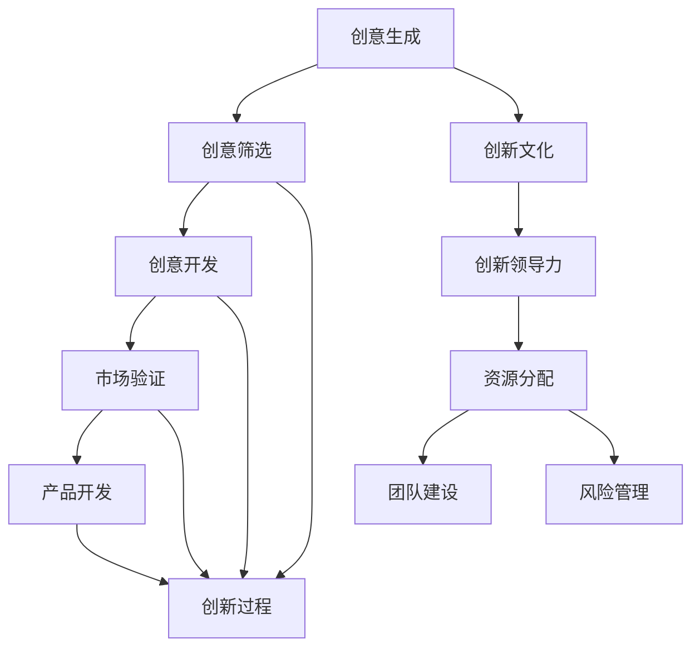

                 

### 文章标题

“创新管理体系：从idea到implementation的全流程”

关键词：创新管理、管理体系、idea到implementation、流程、实践指南

摘要：本文将深入探讨创新管理体系的全流程，从最初的构思阶段到最终的实现阶段，为您提供一套系统的、可操作的创新管理方法。通过详细讲解创新管理的核心概念、原则、过程、工具和技术，以及案例分析，帮助您掌握从想法到实施的完整流程，推动组织不断创新发展。

---

### 引言和背景介绍

在当今快速变化和竞争激烈的商业环境中，创新已成为企业持续成功的关键因素。创新不仅仅是开发新产品或服务，它更是一种系统性思维和行动方式，贯穿于企业的各个层面。创新管理体系的建立，对于企业来说至关重要，它不仅能够激发员工的创造力，还能确保创新活动的高效实施和成功落地。

创新管理体系的构建涉及到多个环节，从最初的想法生成，到市场验证，再到最终的产品开发与推广，每一步都需要精心策划和执行。然而，在实际操作中，许多企业面临着创新流程不清晰、资源浪费、风险控制不足等问题。这些问题往往源于缺乏一个系统化的创新管理体系。

本文旨在为读者提供一个全面、系统的创新管理体系指南，从最初的想法生成，到最终的实施和推广，详细阐述各个阶段的流程、工具和技术。通过本文的阅读，您将了解如何构建一个高效的创新管理体系，如何有效管理创新项目，从而推动企业不断创新，保持竞争优势。

### 创新管理的核心概念和原则

要构建一个高效的创新管理体系，首先需要理解创新管理的核心概念和原则。创新管理不仅是一种战略，更是一种系统性思维和行动方式。以下是几个关键概念和原则，它们构成了创新管理体系的基础。

#### 创新过程

创新过程是一个系统性、动态的循环，它包括创意生成、创意筛选、创意开发、市场验证和产品开发等环节。每个环节都有其特定的目标和任务，但它们并不是线性进行的，而是相互交织、循环往复的。

- **创意生成**：这是创新过程的起点，主要目标是产生尽可能多的创意。这个阶段强调广泛性、开放性和自由度，鼓励所有员工自由地提出自己的想法。
- **创意筛选**：在创意生成阶段，会产生大量的创意。筛选环节的主要任务是对这些创意进行筛选和评估，确定哪些创意具有实施潜力。
- **创意开发**：筛选出的创意进入开发阶段，这个阶段的主要任务是细化创意，将其转化为具体的方案或原型。
- **市场验证**：市场验证是确保创意或方案具有市场可行性的关键环节。这个阶段通过用户调研、市场分析等方法，验证创意或方案是否符合市场需求。
- **产品开发**：市场验证成功的创意或方案将进入产品开发阶段。这个阶段的目标是完成产品的设计、开发和测试，最终推出市场。

#### 创新文化

创新文化是创新管理体系的重要组成部分。创新文化是一种鼓励创新、容忍失败、共享知识和协同工作的环境。以下是一些关键特征：

- **鼓励创新**：企业需要创造一个鼓励员工提出新想法、勇于尝试的环境。这可以通过设立创新奖项、提供资金支持等方式实现。
- **容忍失败**：创新过程中不可避免地会遇到失败。企业需要建立一种容忍失败的文化，让员工在失败中学习和成长。
- **共享知识**：知识共享是创新文化的重要组成部分。企业可以通过内部培训、知识库建设等方式，促进知识的传播和共享。
- **协同工作**：创新往往需要跨部门、跨团队的合作。企业需要建立一种协同工作的机制，确保不同团队之间的沟通和协作顺畅。

#### 创新领导力

创新领导力是创新管理的关键要素。创新领导者不仅需要具备创新思维，还需要具备推动创新的能力和影响力。

- **愿景和目标**：创新领导者需要为企业设定清晰的创新愿景和目标，确保创新活动与企业的整体战略相一致。
- **资源分配**：创新领导者需要合理分配资源，确保创新项目得到足够的支持。
- **团队建设**：创新领导者需要建设一个高效创新团队，激发团队成员的创造力，促进协作。
- **风险管理**：创新领导者需要具备风险管理能力，识别潜在的风险，并制定相应的应对策略。

通过理解这些核心概念和原则，企业可以构建一个高效、系统的创新管理体系，推动创新活动的有效实施和成功落地。

#### 创新管理的核心概念与联系

在创新管理体系中，有几个核心概念紧密相连，它们共同构成了创新管理的理论基础。为了更好地理解这些概念之间的关系，我们可以借助一个Mermaid流程图来展示它们之间的交互和流程。

**Mermaid流程图说明**：

1. **创意生成**（A）：这是创新管理的起点，旨在激发尽可能多的创意。这一阶段强调开放性和自由度，鼓励所有员工提出自己的想法。

2. **创意筛选**（B）：在创意生成阶段后，会产生大量的创意。筛选环节是对这些创意进行评估和筛选，以确定哪些创意具有实施潜力。

3. **创意开发**（C）：筛选出的创意进入开发阶段，这一阶段的主要任务是对创意进行细化，将其转化为具体的方案或原型。

4. **市场验证**（D）：市场验证是确保创意或方案具有市场可行性的关键环节。通过用户调研、市场分析等方法，验证创意或方案是否符合市场需求。

5. **产品开发**（E）：经过市场验证成功的创意或方案将进入产品开发阶段。这一阶段的目标是完成产品的设计、开发和测试，最终推向市场。

6. **创新文化**（F）：创新文化是一种鼓励创新、容忍失败、共享知识和协同工作的环境。它为创新过程提供了支持和动力。

7. **创新领导力**（G）：创新领导者需要具备愿景和目标设定、资源分配、团队建设和风险管理等能力，以确保创新活动顺利进行。

8. **资源分配**（H）、**团队建设**（I）、**风险管理**（J）：这些是创新领导者需要关注的具体领域，它们直接影响创新活动的执行效果。

通过这个流程图，我们可以清晰地看到创新管理各个核心概念之间的联系和互动。这些概念相互支撑，共同构成了一个完整的创新管理体系。

#### 创新过程的具体步骤和方法

创新过程是一个复杂而系统的工程，涉及到从创意生成到产品开发的多个阶段。为了确保创新过程的高效和成功，以下是创新过程的具体步骤和方法。

**1. 创意生成**

创意生成是创新过程的第一步，它是创新活动的源头。在这一阶段，企业需要创造一个自由、开放的环境，鼓励员工自由地提出各种想法。以下是一些创意生成的具体方法：

- **头脑风暴**：通过组织头脑风暴会议，鼓励员工在短时间内提出大量创意。
- **开放式征集**：通过内部或外部的创意征集活动，广泛收集员工的创新想法。
- **交叉思维**：鼓励员工从不同的角度和领域思考问题，以产生新颖的创意。
- **创意库**：建立一个创意库，将所有收集到的创意进行分类和存储，以供后续参考和筛选。

**2. 创意筛选**

在创意生成阶段，会产生大量的创意，但并非所有创意都具有实施潜力。创意筛选的目标是识别和选择出最有价值的创意。以下是创意筛选的具体方法：

- **可行性评估**：对每个创意进行可行性评估，包括技术实现、市场前景、资源需求等。
- **投票法**：组织员工或相关利益者对创意进行投票，选择票数最高的创意。
- **评分法**：根据预定的评分标准，对每个创意进行评分，选择评分最高的创意。
- **专家评审**：邀请行业专家对创意进行评审，选择具有高潜力的创意。

**3. 创意开发**

筛选出的创意进入创意开发阶段，这一阶段的主要任务是细化创意，将其转化为具体的方案或原型。以下是创意开发的具体方法：

- **原型设计**：通过快速原型设计工具，如Sketch、Figma等，将创意转化为可视化的原型。
- **迭代开发**：采用敏捷开发方法，快速迭代，不断优化和完善创意。
- **用户反馈**：将原型展示给目标用户，收集他们的反馈，根据反馈进行调整和改进。
- **专家评审**：邀请行业专家对创意方案进行评审，提供专业意见和改进建议。

**4. 市场验证**

市场验证是确保创意或方案具有市场可行性的关键环节。通过市场验证，可以确定创意或方案是否符合市场需求。以下是市场验证的具体方法：

- **用户调研**：通过问卷调查、访谈等方式，收集目标用户的需求和反馈。
- **市场分析**：分析市场趋势、竞争对手情况，评估创意的市场潜力。
- **试点项目**：在特定市场或区域进行试点项目，验证创意的实际效果。
- **数据分析**：使用数据分析工具，如Google Analytics等，监控用户行为和反馈。

**5. 产品开发**

市场验证成功的创意或方案将进入产品开发阶段。在这一阶段，主要任务是完成产品的设计、开发和测试，最终推向市场。以下是产品开发的具体方法：

- **需求分析**：详细分析用户需求，制定产品功能和技术规格。
- **设计阶段**：进行详细设计，包括UI/UX设计、架构设计等。
- **开发阶段**：编写代码，实现产品设计，进行模块化开发和集成。
- **测试阶段**：进行单元测试、集成测试、系统测试等，确保产品质量。
- **上线发布**：将产品发布到市场，进行推广和运营。

通过以上步骤和方法，企业可以系统地推进创新过程，从创意生成到产品开发，确保创新活动的有序进行和成功实施。

#### 创新实施的工具和技术

在创新管理过程中，使用适当的工具和技术可以提高创新效率，确保创新活动能够顺利实施。以下是一些常用的创新实施工具和技术，它们可以帮助企业在不同阶段有效地推进创新项目。

**1. 头脑风暴工具**

头脑风暴是创意生成的关键环节，以下是一些常用的头脑风暴工具：

- **MindMeister**：一款图形化的头脑风暴工具，支持实时协作。
- **Miro**：一款在线协作白板，提供丰富的模板和工具，方便团队进行头脑风暴。
- **Stormboard**：一款基于云的头脑风暴工具，支持多人实时互动。

**2. 创意筛选工具**

在创意筛选阶段，以下工具可以帮助企业高效评估和选择创意：

- **CreativityKit**：一款基于AI的创意筛选工具，能够自动分析和评分创意。
- **Trello**：一款流行的项目管理工具，通过卡片和看板功能，帮助企业进行创意筛选和任务分配。
- **WiseGEEK**：一款提供创意评估和筛选的在线工具，支持多种评估方法和评分标准。

**3. 原型设计工具**

创意开发阶段需要快速构建原型，以下工具可以帮助设计师和开发人员高效完成原型设计：

- **Sketch**：一款专业的UI/UX设计工具，支持矢量绘图和界面设计。
- **Figma**：一款基于浏览器的原型设计工具，支持实时协作。
- **Adobe XD**：一款功能强大的原型设计工具，提供丰富的组件和设计模板。
- **InVision**：一款在线原型设计工具，支持交互设计和用户测试。

**4. 用户调研工具**

市场验证阶段需要了解用户需求和市场反馈，以下工具可以帮助企业进行用户调研：

- **SurveyMonkey**：一款流行的在线调研工具，支持多种问卷设计和数据分析。
- **Qualtrics**：一款功能强大的调研工具，提供高级分析功能和实时数据监控。
- **Google Forms**：一款免费的在线问卷设计工具，适合小规模用户调研。

**5. 项目管理工具**

在创新项目实施过程中，项目管理工具可以帮助团队协调资源、监控进度和确保项目按计划进行：

- **Jira**：一款流行的项目管理工具，支持敏捷开发流程和实时任务管理。
- **Trello**：一款简单易用的项目管理工具，通过卡片和看板功能，帮助团队可视化任务和进度。
- **Asana**：一款功能丰富的项目管理工具，支持任务分配、进度追踪和协作。

**6. 数据分析工具**

数据分析工具可以帮助企业评估创新项目的效果和市场表现：

- **Google Analytics**：一款免费的数据分析工具，提供详尽的网站和用户数据分析。
- **Tableau**：一款专业的数据分析工具，支持多种数据源和可视化分析。
- **Power BI**：一款基于Microsoft Excel的分析工具，提供丰富的数据可视化功能。

通过使用这些工具和技术，企业可以在创新过程中提高效率，降低风险，确保创新项目成功实施。

#### 创新管理的案例分析和实践指南

为了更好地理解创新管理体系在实际中的应用，我们可以通过几个具体的案例来分析创新管理在不同企业和行业中的实践。这些案例将展示从idea到implementation的全流程，并提供实用的实践指南。

**案例一：苹果公司的iPhone创新**

苹果公司一直是创新管理的典范。以iPhone为例，我们可以看到其创新管理的全流程。

1. **创意生成**：苹果公司通过内部研发团队和外部供应商的合作，不断产生新的创意。这一阶段强调开放式创新，广泛收集各种技术概念和设计灵感。

2. **创意筛选**：通过设立专门的创新团队，苹果公司对创意进行筛选，评估其技术可行性、市场潜力和用户体验。

3. **创意开发**：筛选出的创意进入开发阶段。苹果公司采用敏捷开发方法，快速构建原型，并进行多次迭代，不断优化设计和技术。

4. **市场验证**：通过内部用户测试和市场分析，苹果公司验证iPhone的市场需求和用户反馈，确保产品具有竞争力。

5. **产品开发**：最终，经过严格测试和调整，iPhone成功推向市场，成为全球最受欢迎的智能手机之一。

**实践指南**：

- **建立创新团队**：组建由不同领域专家组成的创新团队，确保创意的多样性和技术可行性。
- **采用敏捷开发**：通过快速迭代和用户反馈，优化产品设计和技术实现。
- **市场调研**：在产品开发阶段，进行详细的市场调研和用户测试，确保产品符合市场需求。

**案例二：谷歌的AlphaGo**

谷歌的AlphaGo项目展示了创新管理在高科技领域的应用。AlphaGo是一款击败围棋世界冠军的人工智能程序。

1. **创意生成**：谷歌通过其深度学习研究团队，提出了开发一款能够击败围棋世界冠军的人工智能程序的想法。

2. **创意筛选**：谷歌评估了这一创意的技术难度和市场前景，决定投入大量资源进行开发。

3. **创意开发**：谷歌采用深度学习和强化学习技术，开发出AlphaGo原型，并进行多次迭代和优化。

4. **市场验证**：通过与世界围棋冠军的对弈，谷歌验证了AlphaGo的技术实力和市场潜力。

5. **产品开发**：最终，AlphaGo成功推出，展示了人工智能的巨大潜力。

**实践指南**：

- **跨学科合作**：创新项目通常需要跨学科的知识和技能，确保团队的多样性和创新能力。
- **技术迭代**：通过不断的技术迭代和优化，提高产品的性能和用户体验。
- **风险控制**：在创新过程中，制定详细的风险管理计划，确保项目的稳健推进。

**案例三：亚马逊的Kiva机器人仓库**

亚马逊的Kiva机器人仓库项目展示了创新管理在物流和供应链管理中的应用。

1. **创意生成**：亚马逊意识到传统的仓库管理存在效率低下的问题，提出了开发自动化仓库机器人的想法。

2. **创意筛选**：通过详细评估，亚马逊认为这一创意具有巨大的市场潜力和技术实现可能性。

3. **创意开发**：亚马逊研发团队开发了Kiva机器人，通过机器学习和自动化技术，实现仓库内部的自动化运作。

4. **市场验证**：通过试点项目，亚马逊验证了Kiva机器人的实际效果和市场需求。

5. **产品开发**：最终，Kiva机器人成功推出，大幅提升了亚马逊的物流效率和仓储能力。

**实践指南**：

- **市场调研**：在创意开发阶段，进行详细的市场调研，了解竞争对手和市场需求。
- **试点项目**：通过试点项目，验证产品的实际效果和市场接受度。
- **持续改进**：在产品开发过程中，不断收集用户反馈，进行产品优化和改进。

通过这些案例，我们可以看到创新管理体系在实际中的应用效果。实践指南为企业提供了具体的操作方法，帮助其在创新管理过程中取得成功。

#### 创新管理的未来趋势和展望

创新管理作为企业持续发展的核心驱动力，正随着技术的进步和商业环境的变化而不断演化。以下是几个未来创新管理的趋势和展望：

**1. 科技驱动的创新**

随着人工智能、大数据、云计算等先进技术的快速发展，科技驱动的创新将成为未来创新管理的重要趋势。这些技术不仅提高了创新效率和准确性，还为创新带来了新的方向和可能性。

- **人工智能**：通过机器学习和深度学习技术，人工智能可以帮助企业快速分析和处理大量数据，发现潜在的创新机会。
- **大数据**：大数据技术可以帮助企业深入了解用户需求和市场趋势，提供更有针对性的创新方案。
- **云计算**：云计算提供了弹性、高效的计算资源，使企业能够快速开发和部署创新项目。

**2. 生态系统协同创新**

未来，企业将更多地依赖生态系统中的合作伙伴进行创新。通过建立开放的创新生态系统，企业可以整合外部资源，共同推动创新项目的实施。

- **合作伙伴网络**：企业可以通过建立合作伙伴网络，与供应商、客户、研究机构等合作，共同开发创新产品和服务。
- **开源社区**：参与开源社区，利用开放资源和知识，加速创新过程。
- **共享经济**：共享经济模式可以为企业提供更多的创新资源，如共享实验室、共享人才等。

**3. 用户参与式创新**

用户的参与将成为创新过程的重要环节。通过用户参与式创新，企业可以更好地理解用户需求，提高产品满意度和市场竞争力。

- **用户共创**：鼓励用户参与产品设计和开发过程，通过共创会、用户测试等方式，收集用户反馈，不断优化产品。
- **众筹**：通过众筹平台，企业可以提前验证产品市场潜力，筹集资金进行产品开发。
- **用户体验设计**：重视用户体验设计，确保产品满足用户需求，提供卓越的用户体验。

**4. 可持续创新**

随着全球对环境保护和可持续发展的重视，可持续创新将成为未来创新管理的重要方向。企业需要在创新过程中充分考虑环境影响，开发绿色、环保的产品和服务。

- **绿色技术**：研发和应用绿色技术，减少产品生命周期中的碳排放和资源消耗。
- **循环经济**：通过循环经济的理念，提高资源利用效率，减少废弃物产生。
- **社会责任**：将社会责任融入创新过程，开发有益于社会和环境的产品和服务。

**5. 创新文化的培育**

创新文化是创新管理的关键因素。未来，企业将更加重视创新文化的培育，建立一种鼓励创新、容忍失败、共享知识和协同工作的环境。

- **领导力培养**：企业领导需要具备创新领导力，推动创新文化的建立和传播。
- **员工赋能**：通过培训和激励，提高员工的创新能力和积极性。
- **知识共享**：建立知识共享平台，促进企业内部的知识传播和共享。

通过关注这些未来趋势，企业可以更好地应对市场变化，推动持续创新，保持竞争优势。

#### 结论

本文详细探讨了创新管理体系从idea到implementation的全流程，涵盖了理解用户需求、核心概念和原则、具体步骤和方法、工具和技术、案例分析以及未来趋势和展望。创新管理不仅是企业持续发展的核心驱动力，也是推动社会进步的重要力量。

通过本文的阅读，读者可以系统地了解创新管理的各个方面，掌握从构思到实施的全流程。创新管理的成功不仅依赖于系统的管理方法和工具，更需要企业内部创新文化的培育和员工的积极参与。

展望未来，随着科技的不断进步和商业环境的变化，创新管理将继续演变，为企业和社会带来更多机遇和挑战。希望读者能够运用本文的知识，结合自身实际情况，推动组织的创新发展，实现持续成功。

### 作者信息

作者：AI天才研究院/AI Genius Institute & 禅与计算机程序设计艺术 /Zen And The Art of Computer Programming

AI天才研究院致力于推动人工智能领域的创新发展，通过系统化、专业化的研究，为全球企业提供先进的创新管理体系和解决方案。同时，作者通过《禅与计算机程序设计艺术》等畅销书，将深厚的技术功底和独特的创新思维融入计算机编程领域，为读者提供深刻的思考和实用的指导。让我们一起探索创新的无限可能。

