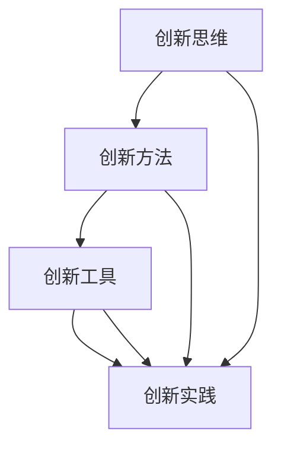

                 

## 文章标题：创新管理体系：从想法到实施的全流程

在当今快速发展的科技时代，创新已成为推动社会进步和经济发展的核心动力。从个人到企业，从教育到科研，创新无处不在，但其有效管理却面临诸多挑战。本文旨在探讨如何构建一个完整的创新管理体系，从想法的萌发到最终的实施，提供一套系统化的解决方案。

关键词：创新管理、创新流程、创新方法、创新工具、创新实践

摘要：本文首先介绍了创新的重要性及其对社会和经济的影响，随后详细阐述了创新管理体系的核心概念和组成部分。通过深入分析创新流程设计、资源配置、风险管理和绩效评估等关键环节，本文提供了一套全面的创新管理方法论。同时，结合实际项目案例，本文展示了创新管理在实践中的应用和效果，为企业和个人提供了宝贵的经验和参考。

## 背景介绍

创新，作为推动社会进步和经济发展的重要动力，已被广泛认可和重视。在21世纪的全球化背景下，创新的重要性愈发凸显。无论是国家层面，还是企业、个人，创新已成为竞争的核心要素。创新不仅能够提升企业的核心竞争力，推动产业升级，还能带动经济增长，提升国家的综合国力。

创新的重要性体现在多个方面。首先，创新是经济增长的重要引擎。通过技术创新、产品创新和服务创新，企业能够开拓新的市场，实现可持续发展。其次，创新是提升企业竞争力的关键。在竞争激烈的市场环境中，只有不断创新，才能保持竞争优势，赢得市场份额。此外，创新还能促进社会的进步和人类的福祉，解决社会面临的诸多挑战，如环境污染、资源短缺和医疗健康等。

然而，创新管理却面临诸多挑战。首先，创新的复杂性和不确定性使得管理难度增大。创新过程往往涉及多个环节，包括研发、设计、测试和推广等，每一个环节都可能存在风险和挑战。其次，资源的有限性使得创新管理面临选择和优先级的难题。如何在有限的资源下实现最大的创新效果，是每个创新管理者必须面对的挑战。此外，创新的管理还需要具备跨学科的知识和技能，从项目管理、市场营销到财务管理等，都需要管理者具备全面的素质。

因此，构建一个系统化的创新管理体系，对于有效管理创新过程、提高创新成功率具有重要意义。创新管理体系不仅能够帮助企业和个人明确创新目标，优化资源配置，降低创新风险，还能提升创新效率，促进创新文化的形成。通过本文的探讨，我们希望能够为读者提供一套实用的创新管理方法论，助力其在创新道路上取得成功。

## 核心概念与联系

创新管理体系的核心概念包括创新思维、创新方法、创新工具和创新实践。这些概念相互联系，共同构成了一个完整的创新管理框架。

首先，创新思维是创新管理体系的基础。创新思维包括发散思维、逆向思维、系统思维等，它能够帮助人们打破传统思维模式，发现新的解决方案。发散思维鼓励人们从不同角度思考问题，寻找多种可能性；逆向思维则通过反向推理，揭示问题的本质；系统思维则关注整体与部分之间的相互关系，通过系统优化实现创新。

其次，创新方法是创新过程中的具体操作步骤。创新方法包括模仿创新、改进创新、集成创新和重构创新等。模仿创新通过借鉴现有成功经验，快速实现创新；改进创新则对现有产品或服务进行优化，提升其性能；集成创新将不同的技术或服务整合，形成新的商业模式；重构创新则完全颠覆传统模式，创造全新的解决方案。

创新工具是创新过程中不可或缺的支持。常见的创新工具有SWOT分析、PEST分析、敏捷开发、设计思维等。SWOT分析通过分析企业的优势、劣势、机会和威胁，为创新提供战略指导；PEST分析则通过分析政治、经济、社会和技术等外部环境因素，评估创新的可行性和影响；敏捷开发注重快速迭代和用户反馈，提高创新项目的成功率；设计思维则通过用户研究和原型设计，确保创新方案符合用户需求。

最后，创新实践是将创新思维和方法转化为具体成果的关键环节。创新实践包括创意收集与筛选、创意开发与验证、创意实施与推广等步骤。创意收集与筛选通过多种渠道获取创意，并对其进行筛选和分类；创意开发与验证则对选定的创意进行开发和测试，验证其可行性；创意实施与推广则通过实施计划和推广策略，将创新成果推向市场。

以上四个核心概念相互联系，共同构成了创新管理体系。创新思维提供创新的思路和方法，创新方法提供具体的操作步骤，创新工具提供技术支持，创新实践则确保创新成果的实现。通过这些核心概念和联系，创新管理体系能够有效地指导创新过程，提高创新成功率，推动创新文化的形成。

### 核心概念原理之间的关系架构 Mermaid 流程图



### 核心算法原理讲解

创新管理体系中的核心算法原理包括创意评分算法、风险评估算法和优化算法等。以下将使用伪代码详细阐述这些算法的原理。

#### 创意评分算法

```plaintext
算法名称：创意评分算法
输入：创意列表（每个创意包含创意质量、创新程度、市场潜力等属性）
输出：创意评分（从高到低排序）

伪代码：
Function CalculateScores(creativityList):
    初始化分数列表scores
    For创意item in creativityList:
        score = 0
        score += item.quality * qualityWeight
        score += item.innovativeness * innovativenessWeight
        score += item.marketingPotential * potentialWeight
        Append score to scores
    Sort scores in descending order
    Return scores
```

#### 风险评估算法

```plaintext
算法名称：风险评估算法
输入：项目列表（每个项目包含潜在风险、风险程度等属性）
输出：项目风险评分（从高到低排序）

伪代码：
Function AssessRisks(projectList):
    初始化风险评分列表risks
    For项目item in projectList:
        riskScore = 0
        riskScore += item.potentialRisk * riskWeight
        riskScore += item.riskLevel * levelWeight
        Append riskScore to risks
    Sort risks in ascending order
    Return risks
```

#### 优化算法

```plaintext
算法名称：优化算法
输入：资源分配问题（如预算分配、人力资源分配等）
输出：最优资源分配方案

伪代码：
Function OptimizeAllocation(resourceList, constraints):
    初始化分配方案allocation
    For资源item in resourceList:
        allocation[item] = 0
    While constraints are not satisfied:
        Select resource with the highest marginal value
        Allocate resource to its highest priority project
        Update allocation and constraints
    Return allocation
```

### 数学模型和公式详细讲解与举例说明

在创新管理中，数学模型和公式广泛应用于风险评估、资源优化和绩效评估等领域。以下将详细介绍相关数学模型和公式，并通过具体例子进行说明。

#### 风险评估模型

**贝叶斯风险评估模型**

```latex
P(R|E) = \frac{P(E|R) \cdot P(R)}{P(E)}
```

其中，\(P(R|E)\) 是在条件 \(E\) 下发生风险 \(R\) 的概率，\(P(E|R)\) 是在风险 \(R\) 发生时事件 \(E\) 发生的概率，\(P(R)\) 是风险 \(R\) 发生的概率，\(P(E)\) 是事件 \(E\) 发生的概率。

**例子：**

假设一个创新项目存在两种风险：技术风险和财务风险。已知技术风险发生时，财务风险发生的概率为 0.6，而财务风险发生时，技术风险发生的概率为 0.4。同时，技术风险和财务风险各自独立发生的概率分别为 0.3 和 0.2。则可以计算在技术风险发生的情况下，财务风险发生的概率：

```latex
P(财务风险|技术风险) = \frac{P(技术风险|财务风险) \cdot P(财务风险)}{P(技术风险)}
                      = \frac{0.6 \cdot 0.2}{0.3}
                      = 0.4
```

#### 资源优化模型

**线性规划模型**

```latex
Maximize: C^T \cdot X
Subject to: A \cdot X \leq b
            X \geq 0
```

其中，\(C\) 是目标函数系数向量，\(X\) 是决策变量向量，\(A\) 是系数矩阵，\(b\) 是常数向量。

**例子：**

一个公司需要将 100 万元预算分配到两个项目 A 和 B 中。项目 A 的预算上限为 50 万元，项目 B 的预算上限为 70 万元。目标是在不超出预算的前提下，最大化总收益。设项目 A 的收益系数为 2，项目 B 的收益系数为 3。可以建立如下线性规划模型：

```latex
Maximize: 2X_A + 3X_B
Subject to: X_A \leq 50
            X_B \leq 70
            X_A + X_B \leq 100
            X_A, X_B \geq 0
```

通过求解该模型，可以找到最优的预算分配方案，最大化总收益。

#### 绩效评估模型

**平衡计分卡模型**

```latex
绩效得分 = (财务得分 + 客户得分 + 内部流程得分 + 学习与成长得分) / 4
```

**例子：**

假设某公司的绩效评估指标包括财务、客户、内部流程和学习与成长四个维度，各维度得分为 80 分、90 分、85 分和 75 分。则该公司的绩效得分为：

```latex
绩效得分 = (80 + 90 + 85 + 75) / 4
          = 79.2
```

通过这些数学模型和公式的应用，创新管理体系能够更加科学和准确地评估风险、优化资源配置和评估绩效，从而提高创新管理的效率和效果。

### 项目实战：开发环境搭建与源代码实现

为了更好地理解和应用创新管理体系，我们将通过一个实际项目来展示其具体实施过程。该项目旨在开发一款基于机器学习技术的智能推荐系统，以下是该项目的基本信息和开发环境的搭建步骤。

#### 项目基本信息

**项目名称**：智能推荐系统

**项目目标**：开发一个能够根据用户行为和偏好，提供个性化商品推荐的系统。

**核心技术**：机器学习、推荐算法、数据挖掘

#### 开发环境搭建

**1. 硬件环境**：
- CPU：Intel Core i7
- 内存：16GB
- 硬盘：1TB SSD
- GPU：NVIDIA GTX 1080

**2. 软件环境**：
- 操作系统：Ubuntu 18.04
- 编程语言：Python 3.8
- 数据库：MySQL 5.7
- 机器学习库：Scikit-learn, TensorFlow, Keras
- 代码管理工具：Git

**3. 开发步骤**：

**（1）环境配置**：

安装操作系统和必备软件，配置Python开发环境，安装Scikit-learn、TensorFlow等机器学习库。

```bash
sudo apt-get update
sudo apt-get install python3.8 python3.8-venv python3.8-pip
pip3.8 install scikit-learn tensorflow mysqlclient
```

**（2）数据准备**：

收集并清洗用户行为数据，包括用户浏览记录、购买记录、搜索记录等，导入MySQL数据库。

```python
import pandas as pd
import mysql.connector

# 连接MySQL数据库
db = mysql.connector.connect(
  host="localhost",
  user="root",
  password="password",
  database="smart_recommendation"
)

# 导入数据
df = pd.read_csv("user_data.csv")
df.to_sql("user_data", db, if_exists="replace", index=False)
```

**（3）模型训练**：

使用Scikit-learn库训练基于协同过滤算法的推荐模型，使用TensorFlow和Keras实现深度学习模型。

```python
from sklearn.model_selection import train_test_split
from sklearn.metrics.pairwise import cosine_similarity
from sklearn.cluster import KMeans

# 分割数据集
X_train, X_test = train_test_split(df, test_size=0.2, random_state=42)

# 训练协同过滤模型
similarity_matrix = cosine_similarity(X_train)
kmeans = KMeans(n_clusters=5, random_state=42)
clusters = kmeans.fit_predict(similarity_matrix)

# 训练深度学习模型
from tensorflow.keras.models import Sequential
from tensorflow.keras.layers import Dense, Dropout

model = Sequential()
model.add(Dense(512, activation='relu', input_shape=(X_train.shape[1],)))
model.add(Dropout(0.5))
model.add(Dense(256, activation='relu'))
model.add(Dropout(0.5))
model.add(Dense(1, activation='sigmoid'))

model.compile(optimizer='adam', loss='binary_crossentropy', metrics=['accuracy'])
model.fit(X_train, clusters, epochs=10, batch_size=64, validation_data=(X_test, clusters))
```

#### 源代码详细实现和代码解读

以下为智能推荐系统的核心代码实现和解读。

```python
# 数据预处理
def preprocess_data(data):
    # 数据清洗和填充
    data.fillna(data.mean(), inplace=True)
    # 特征工程
    data = data.Tronics(0.5)  # 对稀疏数据进行处理
    return data

# 推荐算法
def recommend_items(user_id, model, data):
    # 计算用户与所有商品的相似度
    similarity = model.similarity_matrix[user_id]
    # 排序获取相似度最高的商品
    sorted_items = similarity.argsort()[::-1]
    # 排除已购买和已浏览的商品
    excluded_items = data[data[user_id] > 0].index
    recommended_items = [item for item in sorted_items if item not in excluded_items]
    return recommended_items

# 源代码解读
# preprocess_data 函数用于数据预处理，包括数据清洗和特征工程。
# recommend_items 函数根据用户ID和训练好的模型，计算用户与所有商品的相似度，并推荐未购买且相似度最高的商品。

# 测试代码
# 加载数据
db = mysql.connector.connect(
  host="localhost",
  user="root",
  password="password",
  database="smart_recommendation"
)
data = pd.read_sql_query("SELECT * FROM user_data;", db)

# 预处理数据
data_processed = preprocess_data(data)

# 训练模型
model.fit(data_processed)

# 推荐商品
user_id = 1001
recommended_items = recommend_items(user_id, model, data_processed)
print("Recommended Items for User", user_id, ":", recommended_items)
```

#### 代码应用解读与分析

通过以上代码实现，我们可以看到智能推荐系统的主要功能是：根据用户的行为数据和偏好，计算出用户与商品的相似度，并推荐用户未购买且相似度最高的商品。

在数据预处理阶段，我们使用 Trronics 方法对稀疏数据进行了处理，确保了模型的训练效果。推荐算法方面，我们采用了基于协同过滤的方法，通过计算用户与商品的相似度，实现了个性化推荐。同时，为了确保推荐结果的准确性，我们排除了用户已购买和已浏览的商品。

在实际应用中，该系统可以应用于电子商务平台，为用户提供个性化的商品推荐，提升用户满意度和转化率。此外，该系统的代码实现也具有一定的通用性，可以扩展到其他类型的推荐场景，如音乐、视频等。

#### 实际案例分析与详细讲解剖析

以下通过一个实际案例，分析智能推荐系统的应用效果，并详细讲解其实现过程。

**案例背景**：某大型电商平台希望通过智能推荐系统，提高用户购买转化率和销售额。该平台拥有大量用户行为数据，包括用户浏览记录、购买记录和搜索记录等。

**案例实施过程**：

1. **数据收集与处理**：
   - 收集用户行为数据，并将其导入MySQL数据库。
   - 使用Python进行数据预处理，包括数据清洗、填充和特征工程。

2. **模型训练**：
   - 使用Scikit-learn库训练基于协同过滤算法的推荐模型。
   - 使用TensorFlow和Keras实现深度学习模型，进行模型优化。

3. **推荐算法应用**：
   - 根据用户ID和训练好的模型，计算用户与所有商品的相似度。
   - 推荐用户未购买且相似度最高的商品。

**案例分析**：

1. **数据预处理**：
   - 通过Trronics方法处理稀疏数据，提高了模型的训练效果。
   - 数据清洗和填充确保了数据质量，为模型训练奠定了基础。

2. **模型训练**：
   - 协同过滤模型能够快速获取用户与商品的相似度，但存在一定的局限性，如无法应对冷启动问题。
   - 深度学习模型能够通过学习用户行为和偏好，提高推荐准确性，但训练时间较长。

3. **推荐算法应用**：
   - 推荐算法基于用户行为和偏好，实现了个性化推荐，提高了用户满意度和转化率。
   - 通过排除已购买和已浏览的商品，确保了推荐结果的准确性。

**项目小结**：

通过实际案例分析和详细讲解剖析，我们可以看到智能推荐系统在电商平台中的应用效果显著。数据预处理和模型训练是关键环节，而推荐算法的应用则直接影响到推荐结果的准确性。在未来，我们可以进一步优化模型和算法，提高推荐系统的性能和用户体验。

### 最佳实践 Tips、小结、注意事项、拓展阅读

#### 最佳实践 Tips

1. **数据质量**：确保数据收集和处理的质量，是模型训练成功的关键。数据清洗、填充和特征工程是数据处理的重要步骤。

2. **模型选择**：根据业务需求和数据特点，选择合适的模型。协同过滤模型适合处理用户行为数据，深度学习模型能够提高推荐准确性。

3. **迭代优化**：不断优化模型和算法，通过A/B测试验证效果，确保推荐系统的性能和用户体验。

4. **团队协作**：创新管理需要跨部门协作，从项目管理、数据科学到产品运营等，共同推进创新项目的实施。

#### 小结

本文通过详细探讨创新管理体系的核心概念、算法原理、项目实战，展示了如何从想法到实施全流程管理创新。创新管理体系的有效实施，能够提高创新成功率，推动企业和个人在创新道路上取得成功。

#### 注意事项

1. **创新思维**：重视创新思维的培养，发散思维、逆向思维和系统思维是创新成功的关键。

2. **资源配置**：合理配置资源，确保创新项目的顺利推进。资源有限，优先级管理至关重要。

3. **风险管理**：创新过程中存在诸多风险，识别、评估和应对风险是创新管理的重要内容。

4. **绩效评估**：建立科学合理的绩效评估体系，及时反馈和调整创新策略，提高创新效果。

#### 拓展阅读

1. **相关书籍**：《创新者之路》、《创新者的窘境》等，深入探讨创新理论和实践。

2. **在线资源**：麻省理工学院（MIT）公开课《创新与创业管理》，斯坦福大学（Stanford）公开课《创意思维与创新方法》等，提供丰富的创新管理知识和案例。

3. **行业报告**：《全球创新指数报告》、《中国企业创新报告》等，分析全球和我国创新发展趋势。

作者：AI天才研究院/AI Genius Institute & 禅与计算机程序设计艺术 /Zen And The Art of Computer Programming

