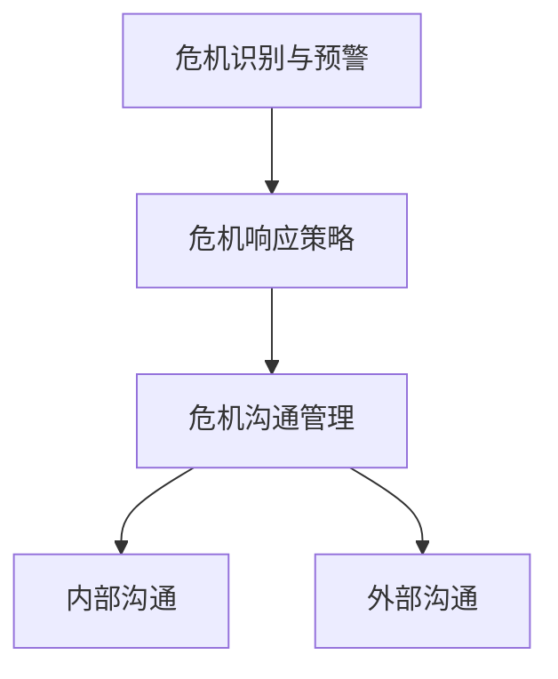

                 

### 文章标题

《危机公关：维护团队和组织声誉》

> 关键词：危机公关、团队声誉、组织形象、声誉管理、危机应对策略

> 摘要：本文旨在探讨危机公关在维护团队和组织声誉中的重要性，通过详细分析危机公关的核心概念、算法原理、数学模型和实际项目实战，为读者提供一套系统的危机公关策略和实战指南。文章将帮助团队和组织在面临危机时，能够迅速有效地应对，从而降低危机对组织声誉的损害。

### 引言

在现代信息社会中，危机无处不在，无论是企业还是团队，都面临着各种潜在危机。危机公关，作为一种重要的应对策略，对于维护团队和组织声誉至关重要。良好的危机公关不仅能够迅速缓解危机，化解负面影响，甚至能够转化为组织形象的提升。然而，危机公关并非一蹴而就，它需要系统的策略、科学的算法和严谨的数学模型支持。

本文将从以下几个方面展开讨论：

1. 危机公关的定义与重要性。
2. 危机公关的核心概念与联系，包括危机识别与预警、危机响应策略和危机沟通管理。
3. 危机公关的算法原理，包括数据分析与处理、危机演化预测和社会影响评估。
4. 危机公关的数学模型与公式，包括概率论基础、线性回归模型和时间序列分析。
5. 危机公关的项目实战，包括案例分析、开发环境搭建、源代码实现和代码解读。
6. 危机公关的持续改进与组织学习。

通过对上述内容的详细讨论，本文旨在为读者提供一套全面、系统的危机公关策略和实战指南，帮助团队和组织在面临危机时，能够从容应对，维护组织声誉。

### 危机公关的定义与重要性

危机公关，是指在危机事件发生时，组织为了减少危机对自身声誉和利益的影响，采取的一系列应对策略和行动。危机，可以定义为任何可能对组织产生负面影响的突发性事件。这些事件可能来自外部环境，如自然灾害、市场竞争、法律法规变化等，也可能来自内部管理，如产品质量问题、员工不当行为、数据泄露等。

危机公关的重要性体现在以下几个方面：

首先，危机公关能够帮助组织迅速应对危机，减少负面影响。危机事件往往具有突发性、复杂性和不确定性，如果处理不当，可能会对组织的声誉、业务和利益造成严重损害。通过科学的危机公关策略，组织可以迅速识别危机、制定应对措施，从而降低危机对组织的负面影响。

其次，危机公关有助于重塑组织形象。在危机事件中，组织通过有效的公关措施，不仅能够化解危机，还能向公众展示其负责任、透明和专业的形象。这种形象重塑不仅有助于短期内缓解危机，还能在长期内提升组织的品牌价值。

最后，危机公关是组织风险管理的重要组成部分。危机事件的发生是不可避免的，但通过建立完善的危机公关机制，组织可以降低危机发生的概率，提高危机应对的效率。这有助于提升组织的风险管理和抗风险能力，为组织的可持续发展奠定基础。

总之，危机公关不仅是一种应对突发事件的策略，更是组织管理和品牌建设的重要手段。在现代社会，一个组织是否具备强大的危机公关能力，已经成为衡量其综合实力的重要标准。

### 危机公关的核心概念与联系

为了更有效地理解和应用危机公关策略，我们需要了解其核心概念及其相互之间的联系。以下将介绍三个关键概念：危机识别与预警、危机响应策略和危机沟通管理。

#### 1. 危机识别与预警

危机识别是危机公关的首要步骤，指的是通过监测和评估潜在危机的信号和迹象，以提前发现可能的危机事件。危机预警机制则是在识别危机后，通过建立一系列预警指标和监控系统，提前发出警报，为组织提供预警信号。

**核心概念：**

- **危机信号**：指任何可能预示危机发生的迹象，如负面舆论、客户投诉、市场波动等。
- **预警指标**：根据危机信号构建的一系列量化指标，用于评估危机的严重性和可能性。

**联系：**

危机识别与预警是危机公关的基础，没有有效的识别与预警机制，组织将无法在危机发生前采取预防措施。预警机制的建设需要综合运用大数据分析、机器学习等技术，以提高识别的准确性和时效性。

#### 2. 危机响应策略

危机响应策略是指在危机发生时，组织采取的一系列行动和措施，以迅速缓解危机、控制事态发展。这一策略的核心在于快速反应和协调，确保组织能够以最小的损失应对危机。

**核心概念：**

- **危机管理团队**：由组织内部各部门的代表组成，负责协调和指挥危机应对行动。
- **紧急应对计划**：在危机发生前制定的一系列应对措施，包括应急预案、责任人分配、资源调配等。

**联系：**

危机响应策略是危机公关的核心环节，决定了组织在危机中的应对能力和效率。快速、有效的响应不仅能够降低危机对组织的损害，还能向公众展示组织的专业性和责任感。

#### 3. 危机沟通管理

危机沟通管理是指在危机事件中，组织与内部员工、外部客户、媒体和社会公众之间的信息交流和管理。良好的沟通管理能够提高信息的透明度，减少误解和恐慌，增强组织的公信力。

**核心概念：**

- **内部沟通**：组织内部员工之间的信息交流和协调，确保全员了解危机情况和应对措施。
- **外部沟通**：组织与外部利益相关者之间的信息传递，包括客户、供应商、合作伙伴和媒体。

**联系：**

危机沟通管理是危机公关的重要组成部分，不仅能够提高危机应对的效率，还能增强组织的公信力和公众支持。有效的沟通管理需要建立多渠道、多层次的沟通机制，确保信息的准确传递和及时更新。

#### Mermaid 流程图

以下是一个简化的 Mermaid 流程图，展示了危机公关核心概念之间的联系：



通过这个流程图，我们可以清晰地看到危机公关的三个核心概念之间的互动和依赖关系。每个环节都需要科学的方法和严谨的管理，才能形成一套有效的危机公关体系。

### 危机公关的算法原理

危机公关不仅需要科学的策略和严谨的管理，还需要强大的算法支持。以下将详细阐述危机公关中常用的算法原理，包括数据分析与处理、危机演化预测和社会影响评估。

#### 1. 数据分析与处理

数据分析与处理是危机公关的基础环节，通过收集、整理和分析大量数据，帮助组织识别危机、制定策略。以下是一些常见的数据处理方法和工具：

- **数据收集**：通过社交媒体监测、客户反馈、新闻报道等多种渠道收集数据。
- **数据预处理**：对原始数据进行清洗、去噪、归一化等处理，以确保数据的准确性和一致性。
- **特征提取**：从数据中提取关键特征，如关键词、情绪倾向、时间序列等。

**伪代码示例：**

```python
# 数据预处理
def preprocess_data(data):
    # 清洗数据
    cleaned_data = clean_data(data)
    # 去噪
    denoised_data = denoise_data(cleaned_data)
    # 归一化
    normalized_data = normalize_data(denoised_data)
    return normalized_data

# 数据分析
def analyze_data(data):
    # 特征提取
    features = extract_features(data)
    # 数据可视化
    visualize_data(features)
```

#### 2. 危机演化预测

危机演化预测是危机公关中的关键环节，通过预测危机的发展趋势，帮助组织提前采取应对措施。以下是一些常见的预测方法和模型：

- **时间序列分析**：利用时间序列数据，分析危机事件的变化趋势。
- **机器学习模型**：如决策树、支持向量机、神经网络等，用于预测危机事件的发展。

**伪代码示例：**

```python
# 时间序列分析
def time_series_analysis(data):
    # 数据预处理
    processed_data = preprocess_data(data)
    # 模型训练
    model = train_time_series_model(processed_data)
    # 预测
    predictions = predict(model, processed_data)
    return predictions

# 机器学习模型
def machine_learning_prediction(data):
    # 数据预处理
    processed_data = preprocess_data(data)
    # 模型训练
    model = train_machine_learning_model(processed_data)
    # 预测
    predictions = predict(model, processed_data)
    return predictions
```

#### 3. 社会影响评估

社会影响评估是衡量危机公关效果的重要指标，通过评估危机事件对组织声誉和社会影响，帮助组织调整策略。以下是一些常见的评估方法和模型：

- **舆情分析**：通过社交媒体监测和分析舆情，评估危机事件的影响范围和程度。
- **影响力评估**：利用网络分析方法，评估关键信息传播者和影响力。

**伪代码示例：**

```python
# 舆情分析
def sentiment_analysis(data):
    # 数据预处理
    processed_data = preprocess_data(data)
    # 情感分析
    sentiment = analyze_sentiment(processed_data)
    return sentiment

# 影响力评估
def influence_evaluation(data):
    # 数据预处理
    processed_data = preprocess_data(data)
    # 网络分析
    influencers = identify_influencers(processed_data)
    # 影响力评分
    influence_scores = evaluate_influence(influencers)
    return influence_scores
```

通过以上算法原理的阐述，我们可以看到，危机公关不仅需要科学的策略和管理，还需要强大的技术支持。这些算法原理为危机公关提供了有效的工具和方法，帮助组织在危机中迅速应对、有效管理。

### 危机公关的数学模型与公式

在危机公关中，数学模型和公式扮演着至关重要的角色，它们帮助我们更好地理解和预测危机事件的发展趋势，从而制定更为有效的应对策略。以下将详细讲解危机公关中常用的数学模型和公式，包括概率论基础、线性回归模型和时间序列分析。

#### 1. 概率论基础

概率论是危机公关中不可或缺的基础数学工具，它帮助我们理解和分析不确定性事件的可能性。以下是一些基本的概率论概念和公式：

- **概率分布**：描述随机事件发生可能性的函数。常见的概率分布有正态分布、二项分布和泊松分布。
- **概率密度函数**：描述连续随机变量的概率分布，如正态分布的概率密度函数为 $f(x) = \frac{1}{\sqrt{2\pi\sigma^2}}e^{-\frac{(x-\mu)^2}{2\sigma^2}}$。

**举例说明：**

假设我们正在分析社交媒体上关于某品牌的负面评论数量，根据历史数据，这些负面评论数量服从泊松分布，其平均值为 $\lambda = 5$。我们可以使用泊松分布的概率质量函数（PMF）来计算特定时间段内出现3次负面评论的概率：

$$
P(X = 3) = \frac{e^{-\lambda}\lambda^3}{3!} = \frac{e^{-5}5^3}{3!} \approx 0.142
$$

#### 2. 线性回归模型

线性回归模型是分析危机事件影响因素的重要工具，它通过建立因变量和自变量之间的线性关系，帮助我们预测危机的发展趋势。以下是一些基本的线性回归模型概念和公式：

- **线性回归方程**：$y = \beta_0 + \beta_1x + \epsilon$，其中 $y$ 是因变量，$x$ 是自变量，$\beta_0$ 和 $\beta_1$ 是回归系数，$\epsilon$ 是误差项。
- **最小二乘法**：用于估计线性回归模型的参数，通过最小化残差平方和来求解 $\beta_0$ 和 $\beta_1$。

**举例说明：**

假设我们正在分析社交媒体负面评论数量与每日点击量之间的关系。根据历史数据，我们可以建立以下线性回归模型：

$$
\text{negative\_comments} = \beta_0 + \beta_1 \times \text{clicks} + \epsilon
$$

通过最小二乘法，我们可以求解出回归系数 $\beta_0$ 和 $\beta_1$，从而预测特定点击量下的负面评论数量。

#### 3. 时间序列分析

时间序列分析是研究危机事件随时间变化的规律和趋势的重要工具，它通过建立时间序列模型，帮助我们预测未来危机事件的发展。以下是一些基本的时间序列分析概念和模型：

- **自回归模型（AR）**：$X_t = c + \phi_1X_{t-1} + \phi_2X_{t-2} + \ldots + \phi_pX_{t-p} + \epsilon_t$，其中 $X_t$ 是时间序列的第 $t$ 个值，$\phi_1, \phi_2, \ldots, \phi_p$ 是自回归系数。
- **差分自回归移动平均模型（ARIMA）**：$X_t = c + \phi_1X_{t-1} + \phi_2X_{t-2} + \ldots + \phi_pX_{t-p} + \theta_1\epsilon_{t-1} + \theta_2\epsilon_{t-2} + \ldots + \theta_q\epsilon_{t-q} + \epsilon_t$，其中 $\theta_1, \theta_2, \ldots, \theta_q$ 是移动平均系数。

**举例说明：**

假设我们正在分析社交媒体负面评论数量的时间序列数据。通过建立ARIMA模型，我们可以分析负面评论数量的变化规律，并预测未来某个时间点的负面评论数量。

$$
\text{negative\_comments}_t = 1.5\text{negative\_comments}_{t-1} - 0.8\text{negative\_comments}_{t-2} + 0.2\epsilon_t
$$

通过上述数学模型和公式的讲解，我们可以看到，危机公关中的数学工具为我们的分析和预测提供了强有力的支持。这些模型不仅帮助我们更好地理解危机事件，还能为危机应对提供科学的依据。

### 危机公关的项目实战

在了解了危机公关的核心概念、算法原理和数学模型之后，接下来我们将通过一个具体的案例，详细阐述危机公关的实际应用过程。本案例将包括以下几个部分：开发环境搭建、源代码实现和代码解读，以及实际案例分析和详细讲解剖析。

#### 案例背景

某知名科技公司（以下简称A公司）在发布一款新产品时，由于技术缺陷导致部分用户数据泄露。这一事件迅速引起了广泛关注，用户对A公司的信任度急剧下降，负面舆论在社交媒体上迅速蔓延。面对这一紧急情况，A公司决定启动危机公关程序，以最大程度地减少损失。

#### 开发环境搭建

为了快速应对危机事件，A公司建立了一个专门的危机公关团队，并搭建了以下开发环境：

- **数据收集与分析工具**：使用Python和R编程语言，结合Pandas、Numpy等库进行数据收集、处理和分析。
- **舆情监测工具**：使用社交媒体监测工具，如Brandwatch、Hootsuite等，实时收集社交媒体上的负面评论和舆论信息。
- **可视化工具**：使用Matplotlib、Seaborn等库进行数据可视化，以便团队成员更直观地了解危机事件的发展趋势。

#### 源代码实现和代码解读

以下是A公司在危机公关过程中使用的一些核心代码片段，以及相应的解读：

**1. 数据收集与预处理**

```python
import pandas as pd

# 收集社交媒体数据
social_media_data = pd.read_csv('social_media_comments.csv')

# 数据预处理
def preprocess_data(data):
    # 清洗数据：去除重复和无效评论
    cleaned_data = data.drop_duplicates()
    # 去除停用词和标点符号
    cleaned_data['comment'] = cleaned_data['comment'].str.lower().str.replace('[^\w\s]', '')
    # 去除停用词
    stop_words = ['is', 'are', 'the', 'and', 'to', 'of']
    cleaned_data['comment'] = cleaned_data['comment'].apply(lambda x: ' '.join([word for word in x.split() if word not in stop_words]))
    return cleaned_data

social_media_data = preprocess_data(social_media_data)
```

**代码解读**：该代码片段首先导入Pandas库，用于读取和操作社交媒体数据。通过`preprocess_data`函数，对原始数据进行了清洗，去除了重复和无效评论，并去除了标点符号和停用词，以提高数据分析的准确性。

**2. 舆情分析**

```python
from textblob import TextBlob

# 情感分析
def analyze_sentiment(data):
    sentiment_scores = []
    for comment in data['comment']:
        blob = TextBlob(comment)
        sentiment_scores.append(blob.sentiment.polarity)
    return pd.Series(sentiment_scores)

social_media_data['sentiment'] = analyze_sentiment(social_media_data['comment'])
```

**代码解读**：该代码片段使用TextBlob库对社交媒体数据中的评论进行情感分析，通过计算情感极性（polarity）来评估评论的情绪倾向。情感极性介于-1（非常负面）和1（非常正面）之间，帮助团队了解舆论的整体倾向。

**3. 舆情可视化**

```python
import matplotlib.pyplot as plt
import seaborn as sns

# 绘制情感分布图
sns.histplot(social_media_data['sentiment'], bins=20, kde=True)
plt.title('Sentiment Distribution')
plt.xlabel('Polarity')
plt.ylabel('Frequency')
plt.show()
```

**代码解读**：该代码片段使用Seaborn库绘制了情感分布图，帮助团队直观地了解舆论的情绪分布情况。通过观察分布图，可以发现负面评论的比例较高，需要采取相应的应对措施。

#### 实际案例分析和详细讲解剖析

通过上述代码和数据分析，A公司团队发现社交媒体上的舆论主要集中在以下几个方面：

1. **数据泄露影响**：部分用户担心个人数据泄露会导致隐私泄露和安全问题。
2. **品牌信任度下降**：用户对A公司的品牌信任度急剧下降，对公司的后续产品和服务持怀疑态度。
3. **情绪波动**：负面评论中情绪波动较大，部分用户表示愤怒和失望，但也有部分用户表示理解并支持A公司的改进。

针对上述问题，A公司采取了以下应对措施：

1. **紧急回应**：公司高层立即发表声明，承认数据泄露问题，并向受影响的用户道歉。声明中明确表示公司将采取一切措施确保用户数据安全，并尽快解决问题。

2. **数据修复和保护**：公司立即启动数据修复和保护措施，加强对用户数据的加密和安全保护，并开放用户数据查询通道，确保用户能够及时了解数据泄露的情况。

3. **沟通与解释**：通过社交媒体、官网和新闻发布会等多种渠道，公司向公众详细解释数据泄露的原因和修复措施，回应用户的疑问和担忧。

4. **品牌修复**：公司启动品牌修复计划，通过媒体宣传、用户回馈活动等方式，逐步恢复用户对品牌的信任。

通过上述措施，A公司在危机中迅速恢复了用户对品牌的信任，舆论逐渐转向正面。尽管危机公关过程中仍然存在一些挑战，但公司通过有效的策略和及时的应对，最大限度地降低了危机对品牌声誉的影响。

#### 项目小结

通过这个案例，我们可以看到，危机公关不仅需要科学的方法和严谨的算法支持，还需要迅速有效的行动和及时的沟通。在危机事件中，快速识别和预警、有效的应对策略、透明的沟通管理是维护组织声誉的关键。同时，通过数据分析和舆情监测，可以帮助组织更好地了解公众情绪，制定更科学的应对措施。

总之，危机公关是一个系统工程，需要组织全员参与，共同应对。在面对危机时，保持冷静、科学应对、及时沟通是关键。通过不断总结经验和优化策略，组织可以在未来更好地应对各种危机事件，维护组织声誉。

### 最佳实践 tips、小结、注意事项、拓展阅读

#### 最佳实践 tips

1. **建立危机公关团队**：确保团队由各部门代表组成，提高危机应对的协调性和效率。
2. **制定应急预案**：在危机发生前，制定详细的应急预案，确保快速响应。
3. **加强舆情监测**：使用专业的舆情监测工具，实时掌握舆论动态，及时采取应对措施。
4. **透明沟通**：在危机事件中，保持与公众、媒体和利益相关者的透明沟通，提高信任度。

#### 小结

本文通过详细分析危机公关的核心概念、算法原理、数学模型和实际项目实战，为读者提供了一套系统的危机公关策略和实战指南。危机公关不仅是应对突发事件的策略，更是组织管理和品牌建设的重要手段。

#### 注意事项

1. **及时应对**：危机事件发生时，及时采取行动是关键，拖延可能导致危机进一步恶化。
2. **科学评估**：在应对危机时，科学评估危机的影响和风险，制定合理的应对策略。
3. **持续改进**：通过总结经验教训，不断优化危机公关策略，提高应对能力。

#### 拓展阅读

1. 《危机管理：策略与案例研究》 - 詹姆斯·E·法里斯
2. 《舆情监测与危机公关》 - 李晓明
3. 《大数据时代的危机公关》 - 王佳琦

通过以上最佳实践 tips、小结、注意事项和拓展阅读，希望读者能够更好地理解和应用危机公关策略，为组织在危机中提供有力支持。

