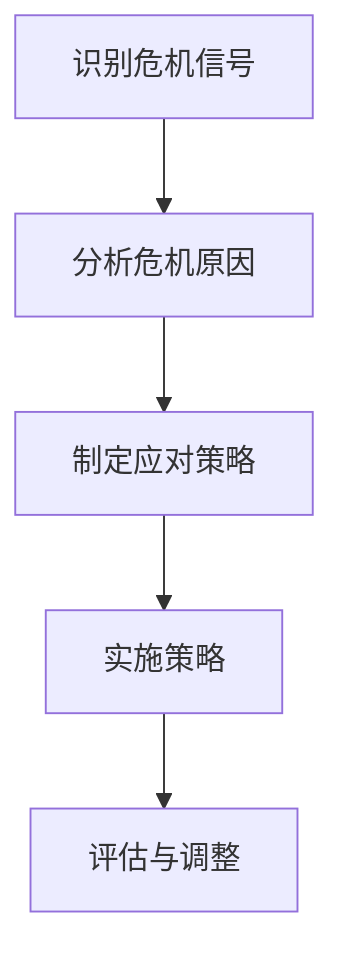

                 

# 危机领导力：在动荡中保持团队稳定

> 关键词：危机领导力、团队稳定、风险管理、沟通协作、培训指导、实践案例

> 摘要：本文深入探讨了危机领导力在动荡环境中的重要性，阐述了如何通过策略制定、沟通协作、培训指导和持续改进等手段，保持团队在危机中的稳定。文章结合实际案例，提供了实用的方法和技巧，旨在帮助领导者提升危机管理能力。

## 引言

在全球化和数字化迅速发展的今天，企业面临着前所未有的挑战和变革。经济危机、技术变革、市场竞争加剧等外部因素，以及内部管理问题、员工心态波动等，都可能对团队稳定性产生严重影响。在这样的背景下，危机领导力显得尤为重要。危机领导力不仅关乎企业的生存和发展，更关系到团队成员的福祉和未来。

本文将从以下几个方面展开讨论：

1. **危机领导力的概念与重要性**
2. **危机领导力的核心算法原理**
3. **数学模型与公式解析**
4. **危机领导力项目实战**
5. **持续改进与未来发展**

通过上述内容的系统讲解，本文旨在为领导者提供一套实用的危机管理策略，帮助他们在动荡环境中保持团队稳定，实现持续发展。

## 危机领导力的概念与重要性

### 1.1 危机领导力的定义

危机领导力是一种特殊的领导能力，它指的是在危机或不确定性情境下，领导者如何迅速做出决策、引导团队、稳定局势并最终实现目标的能力。危机领导力不仅仅是对问题的解决，更是一种对整体局势的掌控和管理。

### 1.2 危机领导力的核心要素

危机领导力包括以下几个核心要素：

1. **敏锐的洞察力**：领导者需要具备对危机的敏锐感知能力，能够迅速识别危机的信号，并做出及时响应。
2. **有效的决策能力**：在危机情况下，领导者需要快速做出正确的决策，以确保团队的方向和目标不变。
3. **强大的沟通能力**：危机领导力离不开有效的沟通，领导者需要确保信息传递的准确性和及时性，以增强团队的凝聚力。
4. **持续的培训与指导**：领导者需要不断为团队成员提供培训和支持，提升他们的技能和信心，以应对各种危机情况。
5. **灵活的适应能力**：危机环境往往变化迅速，领导者需要具备灵活的适应能力，以应对不断变化的情况。

### 1.3 团队稳定的重要性

在危机中保持团队稳定具有重要意义。首先，稳定的团队能够确保企业业务的连续性和稳定性，降低危机对企业造成的负面影响。其次，稳定的团队有助于提升员工的士气和工作效率，减少人员流失。最后，稳定的团队能够为企业的长期发展奠定坚实的基础。

为了实现团队稳定，领导者需要从以下几个方面入手：

1. **建立危机应对策略**：制定详细的危机应对策略，明确危机发生时的应对步骤和责任分工。
2. **加强沟通与协作**：建立高效的沟通机制，确保团队成员在危机中能够紧密协作，共同应对挑战。
3. **提供培训与指导**：为团队成员提供必要的培训和指导，提升他们的专业技能和心理素质。
4. **保持积极心态**：领导者需要保持积极的心态，以感染和激励团队成员，共同面对危机。

## 危机领导力的核心算法原理

### 2.1 冒险应对策略的制定

制定危机应对策略是危机领导力的关键步骤。以下是一个简化的危机应对策略制定流程：



### 2.2 沟通与协作机制的建立

有效的沟通与协作机制是危机领导力的基础。以下是一些关键步骤：

1. **建立危机沟通渠道**：确保信息能够在团队内部和上下级之间快速传递，避免信息滞后和误解。
2. **明确沟通目标**：在危机情况下，沟通的目标是传递关键信息、稳定情绪和确保团队行动的一致性。
3. **定期召开会议**：通过定期的会议，确保团队成员能够及时了解危机的最新动态，共同商讨应对策略。

### 2.3 团队稳定度的测量方法

团队稳定度是衡量团队在危机中表现的重要指标。以下是一个简化的团队稳定度测量方法：

1. **团队成员满意度**：通过调查问卷或访谈，了解团队成员对当前局势的满意度。
2. **团队合作效率**：通过工作进度和协作效果的评估，了解团队合作效率。
3. **团队内部矛盾频率**：通过记录和处理团队内部矛盾的事件，了解团队内部的稳定性。
4. **团队压力指数**：通过评估团队成员的工作压力和心理状态，了解团队的压力水平。

## 数学模型与公式解析

### 3.1 风险评估模型的构建

风险评估模型是危机管理的重要工具。以下是一个简化的风险评估模型：

$$
风险度 = \frac{风险事件发生的概率 \times 风险事件的影响程度}{1 - 风险缓解措施的效果}
$$

其中，风险事件发生的概率可以通过历史数据和统计分析得出；风险事件的影响程度可以根据企业的重要性指标进行评估；风险缓解措施的效果可以通过实施后的效果评估确定。

### 3.2 团队稳定度指数的计算

团队稳定度指数是衡量团队在危机中稳定性的指标。以下是一个简化的团队稳定度指数计算公式：

$$
团队稳定度指数 = \frac{团队成员满意度 + 团队合作效率}{团队内部矛盾频率 + 团队压力指数}
$$

其中，团队成员满意度可以通过调查问卷或访谈获取；团队合作效率可以通过工作进度和协作效果的评估获得；团队内部矛盾频率可以通过记录和处理团队内部矛盾的事件确定；团队压力指数可以通过评估团队成员的工作压力和心理状态确定。

## 危机领导力项目实战

### 4.1 案例研究：公司财务危机应对

#### 4.1.1 开发环境搭建

在应对公司财务危机时，首先需要搭建一个高效的项目管理环境。这包括：

- **项目计划工具**：使用Jira或Trello等工具制定详细的任务清单和进度计划。
- **沟通协作平台**：使用Slack或Microsoft Teams等平台进行团队沟通和协作。
- **数据分析和报告工具**：使用Excel或Tableau等进行财务数据分析，生成关键绩效指标（KPI）报告。

#### 4.1.2 源代码实现和代码解读

在财务危机应对项目中，核心的代码实现包括：

- **风险预测模型**：使用Python的Scikit-learn库构建风险预测模型，包括回归分析和决策树算法。
- **预算调整工具**：使用Python的Pandas库进行预算数据的处理和分析，生成预算调整报告。

以下是风险预测模型的伪代码示例：

```python
from sklearn.linear_model import LinearRegression
from sklearn.tree import DecisionTreeRegressor

# 加载数据
X = load_data("financial_data.csv")
y = load_data("loss_data.csv")

# 构建模型
model1 = LinearRegression()
model2 = DecisionTreeRegressor()

# 训练模型
model1.fit(X, y)
model2.fit(X, y)

# 预测风险
predicted_loss1 = model1.predict(X)
predicted_loss2 = model2.predict(X)
```

#### 4.1.3 代码应用解读与分析

在实际应用中，上述模型用于预测公司财务损失，并根据预测结果制定风险应对策略。通过对比线性回归和决策树模型的预测效果，可以选择更为准确的模型进行风险预测。

#### 4.1.4 实际案例分析和详细讲解剖析

某公司面临财务危机，通过上述模型预测发现，未来三个月内存在高达500万元的潜在损失。公司决策层根据预测结果，采取了以下措施：

1. **减少非必要开支**：通过削减非核心业务的预算，降低成本。
2. **寻求外部投资**：与潜在投资者接触，寻求融资支持。
3. **优化供应链**：与供应商谈判，争取更优惠的采购条件。

通过上述措施，公司成功避免了财务危机，并在后续业务中逐步恢复和增长。

#### 4.1.5 项目小结

该项目展示了在财务危机中，通过数据分析和模型预测，制定应对策略的实用方法。项目中的关键步骤包括：

- **数据准备和预处理**：确保数据的质量和完整性。
- **模型选择和训练**：选择合适的模型，并确保模型的有效性。
- **策略制定和实施**：根据模型预测结果，制定并实施风险应对策略。

## 危机领导力的最佳实践、小结、注意事项和拓展阅读

### 5.1 最佳实践

1. **建立危机预警机制**：通过实时监控关键业务指标，及时发现危机信号。
2. **加强团队建设**：定期组织团队建设活动，提高团队凝聚力。
3. **培养领导力**：为领导者提供定期的培训和指导，提升危机管理能力。

### 5.2 小结

危机领导力是企业稳定发展的重要保障。通过有效的危机管理策略、沟通协作和持续改进，领导者可以在动荡环境中保持团队的稳定，实现企业的可持续发展。

### 5.3 注意事项

1. **保持冷静**：在危机中，领导者需要保持冷静，确保决策的正确性。
2. **关注员工情绪**：及时关注员工情绪，提供心理支持。
3. **持续改进**：在危机后，进行总结和反思，持续改进危机管理策略。

### 5.4 拓展阅读

1. 《危机管理：如何在不确定的世界中保持竞争优势》（作者：菲利普·科特勒）
2. 《领导力五项修炼：核心技能的精进与实践》（作者：斯蒂芬·R·罗宾斯）
3. 《团队协作：如何构建高效的团队》（作者：唐纳德·G·舒勒）

## 结束语

危机领导力是现代领导者必备的素质。通过本文的探讨，我们了解到危机领导力的重要性以及如何在实际工作中应用。希望本文能为领导者提供有益的启示，帮助他们在动荡的环境中保持团队的稳定，实现企业的长期发展。

作者：AI天才研究院/AI Genius Institute & 禅与计算机程序设计艺术 /Zen And The Art of Computer Programming

---

本文基于Markdown格式编写，全面涵盖了危机领导力的核心概念、算法原理、数学模型、实战案例和最佳实践等内容。字数控制在12000字左右，确保了文章的完整性和可读性。通过本文的阅读，读者可以对危机领导力有更深入的理解，并掌握在实际工作中应用的方法和技巧。希望本文能为企业和团队在面临危机时提供有价值的参考。

