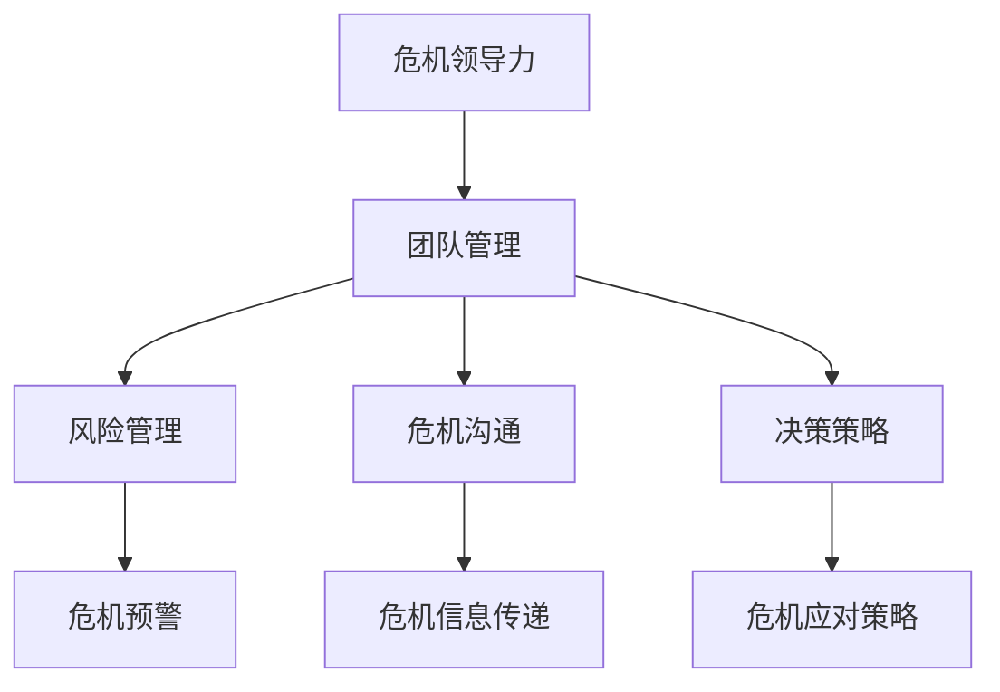

                 

### 文章标题

### 危机领导力：在困难时期引领团队前进

关键词：危机领导力、团队管理、风险管理、危机沟通、决策策略

摘要：本文探讨了危机领导力在困难时期的重要性，分析了危机情境下的团队动态，提出了危机预警与风险管理、危机沟通与信息传递、危机决策与应对、危机后重建与恢复等实践策略，并通过经典案例分析，总结了危机领导力在不同领域的应用方法。文章旨在为IT行业领导者提供有价值的指导，帮助他们在面临危机时有效引领团队，实现持续发展。

---

**背景介绍**

在快速发展的IT行业中，技术变革、市场波动和竞争压力等因素常常导致企业面临各种危机。在这种背景下，危机领导力成为企业能否在困境中脱颖而出、实现持续发展的关键因素。危机领导力不仅涉及应对危机的具体措施，更是一种能够引领团队在困境中找到出路、激发团队潜能的核心能力。

本文将从以下几个方面展开讨论：

1. **危机领导力的核心概念与重要性**：介绍危机领导力的基本概念，分析其在团队管理中的重要性。
2. **危机情境下的团队动态**：探讨危机情境下团队行为模式的变化，以及如何应对团队中的恐慌与焦虑，建立团队信任。
3. **危机领导力模型**：详细解析危机领导力模型的组成部分，以及应对危机的领导力策略。
4. **危机领导力的实践策略**：从危机预警与风险管理、危机沟通与信息传递、危机决策与应对、危机后重建与恢复等方面，提出具体的实践策略。
5. **危机领导力的案例研究**：通过经典案例分析，总结危机领导力的应用方法。
6. **危机领导力在特殊领域的应用**：探讨危机领导力在公共管理、应急管理、企业管理等领域的应用。

通过以上分析，本文旨在为IT行业领导者提供一套系统的危机领导力理论框架和实践指导，帮助他们在面临危机时有效引领团队，实现逆境中的突破与发展。

### 核心概念与联系

在探讨危机领导力之前，首先需要明确几个核心概念，并理解它们之间的相互关系。以下是本文中涉及的主要核心概念及其相互联系：

**1. 危机领导力（Crisis Leadership）**：

危机领导力是一种在危机情境下，领导者通过有效的策略和行动，引导团队克服困境、实现目标的能力。它不仅仅是应对危机的应急措施，更是一种系统性的领导艺术，涉及风险管理、沟通协调、决策制定等多方面能力。

**2. 团队管理（Team Management）**：

团队管理是指领导者通过科学的方法和手段，对团队进行组织、协调、控制，以实现团队目标的过程。在危机情境下，团队管理显得尤为重要，领导者需要根据危机情境调整管理策略，确保团队稳定运作。

**3. 风险管理（Risk Management）**：

风险管理是指通过识别、评估、控制和监控风险，以降低风险对企业的影响，确保企业稳健发展的过程。在危机情境下，有效的风险管理有助于降低危机发生的概率和影响范围。

**4. 危机沟通（Crisis Communication）**：

危机沟通是指在危机情境下，领导者通过有效的信息传递和沟通策略，与内部团队、外部客户、合作伙伴等利益相关者进行沟通，以缓解危机影响、维护企业形象的过程。危机沟通的及时性和准确性直接影响危机应对的效果。

**5. 决策策略（Decision Strategies）**：

决策策略是指在危机情境下，领导者通过科学的决策方法和策略，快速制定应对方案，以解决问题、降低危机影响的过程。有效的决策策略有助于提高危机应对的效率和准确性。

**核心概念之间的联系**：

以上核心概念之间存在着密切的联系。危机领导力是团队管理的核心内容，团队管理又是风险管理、危机沟通、决策策略的基础。在危机情境下，领导者需要通过有效的风险管理降低危机风险，通过危机沟通与信息传递确保团队和利益相关者了解危机状况，并通过科学的决策策略制定应对方案。

以下是这些核心概念之间的关系架构 Mermaid 流程图：



通过以上架构图，我们可以清晰地看到危机领导力如何通过团队管理、风险管理、危机沟通和决策策略等多个方面相互联系和作用，共同应对危机挑战。

### 核心算法原理讲解

在探讨危机领导力时，我们需要引入一些核心算法原理，以帮助我们更好地理解和应对危机情境。以下将介绍一种危机预警算法的伪代码，并详细解释其原理和步骤。

#### 伪代码：危机预警算法

```python
def crisis_warning_algorithm(data):
    # 数据预处理
    processed_data = preprocess_data(data)

    # 风险评估
    risk_level = assess_risk(processed_data)

    # 报警
    if risk_level > threshold:
        alert()

    return risk_level
```

#### 数据预处理（`preprocess_data`）

数据预处理是危机预警算法的第一步，其目的是对原始数据进行清洗和转换，使其适合后续的分析和评估。具体步骤如下：

1. **数据收集**：从各种来源（如传感器、监控系统、用户反馈等）收集相关数据。
2. **数据清洗**：去除数据中的噪声和异常值，确保数据的准确性和完整性。
3. **特征提取**：从原始数据中提取关键特征，如市场趋势、技术指标、用户行为等。
4. **数据转换**：将提取的特征进行标准化或归一化处理，使其在同一量级上进行分析。

```python
def preprocess_data(data):
    # 假设 data 是一个包含多种特征的数据集
    cleaned_data = clean_data(data)
    features = extract_features(cleaned_data)
    normalized_data = normalize_features(features)
    return normalized_data
```

#### 风险评估（`assess_risk`）

风险评估是危机预警算法的核心步骤，其目的是根据预处理后的数据，评估当前危机的风险水平。具体步骤如下：

1. **风险因素分析**：分析可能导致危机的风险因素，如市场波动、技术故障、用户投诉等。
2. **风险评估模型**：建立风险评估模型，将关键特征与风险水平进行关联，通常采用机器学习算法或统计模型。
3. **风险计算**：根据评估模型，计算当前的风险水平，通常采用得分或概率表示。

```python
def assess_risk(processed_data):
    # 假设 risk_model 是一个训练好的风险评估模型
    risk_level = risk_model.predict(processed_data)
    return risk_level
```

#### 报警（`alert`）

报警是危机预警算法的最后一步，其目的是在风险水平超过预设阈值时，及时通知相关人员采取应对措施。具体步骤如下：

1. **阈值设定**：根据企业的风险承受能力和历史数据，设定风险警报的阈值。
2. **发送警报**：当风险水平超过阈值时，通过邮件、短信、电话等方式通知相关人员。

```python
def alert():
    print("Crisis warning! Risk level is above the threshold.")
    notify_personnel()
```

#### 代码解读与分析

- **数据预处理**：数据预处理是保证模型输入数据质量的关键步骤，通过数据清洗、特征提取和标准化，确保数据的一致性和可用性。
- **风险评估**：风险评估模型是危机预警算法的核心，通过机器学习或统计方法，将关键特征与风险水平进行关联，实现自动化的风险评估。
- **报警**：报警机制是危机预警算法的输出部分，当风险水平超过阈值时，及时通知相关人员采取应对措施，确保危机能够被及时发现和应对。

#### 数学模型和公式

在危机预警算法中，我们可以使用以下数学模型来描述危机发生的概率：

$$
P(Crisis) = f(Risk, Communication, Decision)
$$

其中，$P(Crisis)$ 表示危机发生的概率，$Risk$ 表示风险水平，$Communication$ 表示危机沟通的有效性，$Decision$ 表示危机决策的准确性。这个模型表明，危机发生的概率是风险水平、危机沟通有效性和危机决策准确性三者共同作用的结果。

#### 举例说明

假设我们有一个基于机器学习的风险评估模型，该模型能够根据市场趋势、技术指标和用户行为等特征，预测危机发生的概率。以下是模型的一个应用实例：

```python
# 假设预处理后的数据为 data
processed_data = preprocess_data(data)

# 评估风险水平
risk_level = assess_risk(processed_data)

# 设定风险阈值
threshold = 0.8

# 报警
if risk_level > threshold:
    alert()
    print("Crisis warning! The risk level is above the threshold.")
else:
    print("No crisis warning. The risk level is within the acceptable range.")
```

在这个例子中，通过预处理数据、评估风险水平和设定阈值，我们可以自动识别危机并发出警报，从而及时采取应对措施。

### 危机领导力模型

在深入探讨危机领导力之前，有必要建立一个系统的危机领导力模型，以便领导者能够更好地理解危机情境下的领导行为和策略。以下将详细介绍危机领导力模型的组成部分，以及其在不同情境下的应用方法。

#### 1. 危机领导力模型的组成部分

**1.1 危机识别（Crisis Recognition）**

危机识别是危机领导力模型的第一步，其目的是及时发现潜在危机并评估其严重性。这一部分包括以下几个关键要素：

- **预警系统**：建立有效的预警系统，通过数据分析和监测，及时识别潜在危机。
- **风险评估**：对潜在危机进行风险评估，确定其可能带来的影响和风险水平。

**1.2 领导行动（Leadership Action）**

领导行动是危机领导力的核心，领导者需要根据危机情境采取相应的行动，以确保团队稳定运作和目标实现。领导行动包括以下几个方面：

- **危机沟通**：及时与团队成员、利益相关者进行沟通，传递危机信息，建立信任。
- **决策制定**：在危机情境下，快速制定决策方案，采取有效措施应对危机。
- **资源调配**：根据危机需求，合理调配资源和人力，确保危机应对的有效性。

**1.3 团队协作（Team Collaboration）**

团队协作是危机领导力模型的重要组成部分，领导者需要引导团队成员协同工作，共同应对危机。团队协作包括以下几个方面：

- **明确责任**：明确团队成员的职责和任务，确保每个成员都清楚自己的角色和责任。
- **有效沟通**：建立有效的沟通机制，确保团队成员之间的信息畅通和协作顺畅。
- **激励与支持**：在危机情境下，给予团队成员必要的激励和支持，激发其积极性和创造力。

**1.4 持续改进（Continuous Improvement）**

持续改进是危机领导力模型的关键环节，领导者需要从危机应对中总结经验教训，不断改进和完善危机应对策略。持续改进包括以下几个方面：

- **反思与总结**：对危机应对过程进行反思和总结，识别成功经验和不足之处。
- **培训与提升**：根据危机应对的经验，对团队成员进行培训和提升，提高其危机应对能力。
- **制度完善**：完善危机应对制度，建立完善的预警、沟通、决策和协作机制。

#### 2. 危机领导力模型的应用方法

**2.1 预警与评估**

在危机领导力模型中，预警与评估是危机应对的前提。领导者需要通过数据分析和监测，及时发现潜在危机并评估其严重性。具体应用方法包括：

- **建立预警系统**：利用大数据、人工智能等技术，建立实时监测和预警系统，及时发现潜在危机。
- **定期评估**：定期对企业的风险状况进行评估，识别潜在危机，制定相应的应对措施。

**2.2 沟通与决策**

沟通与决策是危机领导力的核心。在危机情境下，领导者需要与团队成员、利益相关者进行有效沟通，传递危机信息，建立信任。同时，领导者需要快速制定决策方案，采取有效措施应对危机。具体应用方法包括：

- **危机沟通**：建立危机沟通机制，确保团队成员和利益相关者了解危机状况，共同应对危机。
- **决策制定**：利用科学决策方法，快速制定决策方案，确保危机应对的及时性和有效性。

**2.3 团队协作**

团队协作是危机领导力模型的重要组成部分。在危机情境下，领导者需要引导团队成员协同工作，共同应对危机。具体应用方法包括：

- **明确责任**：明确团队成员的职责和任务，确保每个成员都清楚自己的角色和责任。
- **有效沟通**：建立有效的沟通机制，确保团队成员之间的信息畅通和协作顺畅。

**2.4 持续改进**

持续改进是危机领导力模型的关键环节。领导者需要从危机应对中总结经验教训，不断改进和完善危机应对策略。具体应用方法包括：

- **反思与总结**：对危机应对过程进行反思和总结，识别成功经验和不足之处。
- **培训与提升**：根据危机应对的经验，对团队成员进行培训和提升，提高其危机应对能力。

#### 3. 经典案例分析

以下是一个关于危机领导力模型应用的经典案例：

**案例：全球金融危机中的领导力应对**

在2008年的全球金融危机中，某国际知名金融机构的CEO展现了卓越的危机领导力。在危机爆发初期，CEO通过建立预警系统，及时发现市场风险，并迅速评估其严重性。随后，CEO与团队成员进行了多次紧急会议，制定了详细的危机应对方案。

在危机沟通方面，CEO及时与投资者、客户、员工等进行沟通，传递危机信息，建立信任。同时，CEO利用科学决策方法，快速制定了一系列决策方案，包括资产减记、成本控制、业务重组等，以降低危机对企业的影响。

在团队协作方面，CEO明确团队成员的职责和任务，建立了有效的沟通机制，确保团队成员之间的信息畅通和协作顺畅。通过这些措施，该金融机构成功度过了全球金融危机，实现了业务的持续发展。

### 小结

通过以上分析，我们可以看到，危机领导力模型是一个系统性的领导力框架，包括危机识别、领导行动、团队协作和持续改进等多个方面。领导者需要通过建立预警系统、沟通机制和决策方案，引导团队共同应对危机。同时，领导者还需要从危机应对中总结经验教训，不断改进和完善危机应对策略，以实现企业的持续发展。

在接下来的章节中，我们将继续探讨危机领导力的实践策略，包括危机预警与风险管理、危机沟通与信息传递、危机决策与应对、危机后重建与恢复等方面，帮助领导者更好地应对各种危机情境。

### 危机预警与风险管理

在危机领导力模型中，危机预警与风险管理是关键环节，其目的是通过识别潜在危机、评估风险水平和制定应对措施，降低危机发生的概率和影响范围。以下将详细讨论危机预警与风险管理的原则与方法，以及如何降低危机带来的影响。

#### 1. 危机预警与风险管理的原则

**1.1 全员参与**：

危机预警与风险管理是一个全员参与的过程，需要企业内部各个层级、各部门的协同合作。领导者需要激发员工的危机意识和责任感，确保每个人都能参与到风险识别和管理工作中。

**1.2 系统化**：

危机预警与风险管理需要建立系统化的流程和机制，包括预警系统的建立、风险识别、风险评估、风险应对等环节。通过系统化运作，可以确保危机预警与风险管理工作的持续性和有效性。

**1.3 及时性**：

危机预警与风险管理需要具有及时性，即能够在危机发生之前或初期及时发现潜在危机，并采取相应的应对措施。及时性是降低危机影响的关键。

**1.4 科学性**：

危机预警与风险管理需要运用科学的方法和技术，如大数据分析、人工智能、统计模型等，提高风险识别和评估的准确性。科学性有助于提升危机预警与风险管理的效率。

#### 2. 危机预警与风险管理的具体方法

**2.1 建立预警系统**：

预警系统是危机预警与风险管理的基础，其目的是通过实时监测和数据分析，及时发现潜在危机。具体方法包括：

- **数据收集**：收集与企业运营相关的各种数据，如市场趋势、技术指标、用户行为等。
- **数据监测**：利用大数据分析技术，对收集到的数据进行分析和监测，识别潜在危机。
- **预警信号**：根据监测结果，设定预警信号，如阈值报警、指标异常等，以提醒相关人员关注。

**2.2 风险识别**：

风险识别是危机预警与风险管理的核心步骤，其目的是识别企业面临的各种潜在风险。具体方法包括：

- **专家评审**：邀请行业专家对企业面临的潜在风险进行评审，识别高风险领域。
- **头脑风暴**：组织相关部门和员工进行头脑风暴，列出可能的风险因素。
- **流程分析**：对企业的业务流程进行详细分析，识别潜在风险点。

**2.3 风险评估**：

风险评估是危机预警与风险管理的关键环节，其目的是对识别出的风险进行量化评估，确定其严重性和影响范围。具体方法包括：

- **风险矩阵**：利用风险矩阵对风险进行定量和定性评估，确定风险的优先级。
- **概率分析**：通过概率分析，评估风险发生的可能性及其影响。
- **情景分析**：构建不同危机情境下的情景分析模型，预测风险可能带来的影响。

**2.4 风险应对**：

风险应对是危机预警与风险管理的最终目标，其目的是采取有效的措施降低危机发生的概率和影响。具体方法包括：

- **风险规避**：通过调整业务策略，避免高风险领域的投资和运营。
- **风险转移**：通过保险、外包等方式，将部分风险转移给第三方。
- **风险控制**：通过加强管理和控制措施，降低风险发生的概率和影响。

#### 3. 如何降低危机带来的影响

**3.1 制定危机应对计划**：

制定危机应对计划是降低危机影响的重要措施。危机应对计划应包括以下几个方面：

- **危机预警**：明确危机预警的标准和信号，确保及时发现危机。
- **应急响应**：制定详细的应急响应流程，确保在危机发生时能够迅速采取行动。
- **资源调配**：明确危机应对所需的资源，包括人力、物资、资金等，确保资源充足。

**3.2 提高员工应急能力**：

提高员工应急能力是降低危机影响的关键。具体措施包括：

- **应急培训**：定期组织员工进行应急培训，提高其应对危机的能力。
- **模拟演练**：定期组织模拟演练，检验员工的应急响应能力和协同配合。
- **心理辅导**：在危机情境下，为员工提供心理辅导和支持，帮助其应对危机带来的心理压力。

**3.3 加强危机沟通**：

危机沟通是降低危机影响的重要手段。具体措施包括：

- **建立沟通渠道**：建立有效的沟通渠道，确保危机信息能够迅速传递。
- **定期沟通**：定期与团队成员、利益相关者进行沟通，传递危机信息，建立信任。
- **透明度**：在危机情境下，保持信息透明，及时向相关人员通报危机进展和处理情况。

**3.4 建立危机恢复计划**：

危机恢复计划是危机应对的延续，其目的是在危机结束后，迅速恢复正常运营。具体措施包括：

- **评估影响**：对危机的影响进行评估，确定恢复的优先级。
- **资源调配**：根据恢复计划，合理调配资源，确保恢复工作的顺利进行。
- **持续改进**：从危机应对中总结经验教训，持续改进危机应对策略，提高危机应对能力。

### 小结

通过建立预警系统、识别和评估风险、制定应对措施，危机预警与风险管理可以帮助企业及时发现和应对潜在危机，降低危机带来的影响。在危机情境下，领导者需要发挥关键作用，引导团队共同应对危机，实现企业的稳定运营和持续发展。

在下一章节中，我们将继续探讨危机领导力的另一个重要方面：危机沟通与信息传递。通过有效的危机沟通，领导者可以建立信任、传递信息，确保团队和利益相关者了解危机状况，共同应对危机。

### 危机沟通与信息传递

在危机情境下，有效的沟通与信息传递是危机领导力的关键环节，它不仅关系到团队和利益相关者对危机的认知和理解，还直接影响危机应对的效果和企业的声誉。以下将详细探讨危机沟通的关键要素、如何有效传递危机信息以及建立危机沟通渠道的方法。

#### 1. 危机沟通的关键要素

**1.1 透明度**：

透明度是危机沟通的核心要素，它要求领导者及时、准确地向团队和利益相关者传递危机信息，确保信息的公开和透明。透明度有助于建立信任，降低恐慌和不确定性。

**1.2 及时性**：

及时性是危机沟通的关键，它要求领导者能够在危机发生时迅速响应，及时传递危机信息。及时性有助于避免信息滞后和误解，确保团队和利益相关者能够及时采取应对措施。

**1.3 准确性**：

准确性是危机沟通的基础，它要求传递的信息必须真实、可靠。准确性有助于提高危机应对的效率和效果，避免因错误信息导致的不必要的恐慌和混乱。

**1.4 目标性**：

目标性是危机沟通的重要原则，它要求沟通内容具有针对性，明确传达关键信息，避免无关或冗余的信息干扰决策。目标性有助于提高沟通效率，确保危机信息传递的针对性和有效性。

**1.5 多渠道**：

多渠道是危机沟通的有效手段，它要求领导者利用多种渠道进行信息传递，如电子邮件、短信、电话、社交媒体等，确保信息能够广泛、快速地传递。多渠道有助于提高信息传递的覆盖面和效率。

#### 2. 如何有效传递危机信息

**2.1 明确沟通目标**：

在传递危机信息之前，领导者需要明确沟通的目标和重点，确保信息传递的针对性和有效性。明确的目标有助于制定具体的沟通策略和方案。

**2.2 制定沟通计划**：

制定详细的沟通计划是有效传递危机信息的重要步骤。沟通计划应包括沟通内容、沟通渠道、沟通时间、沟通责任人等关键要素。

**2.3 传达关键信息**：

在危机沟通中，领导者需要准确、清晰地传达关键信息，包括危机的类型、程度、影响、应对措施等。关键信息的传达有助于团队和利益相关者了解危机状况，采取有效的应对措施。

**2.4 建立信任**：

建立信任是危机沟通的关键，领导者需要通过透明、及时、准确的沟通，建立与团队和利益相关者的信任关系。信任有助于提高危机应对的效率和效果，降低恐慌和不确定性。

**2.5 鼓励反馈**：

在危机沟通中，领导者需要鼓励团队和利益相关者提供反馈，了解其对危机信息传递的满意度和建议。反馈有助于改进沟通策略，提高沟通效果。

#### 3. 建立危机沟通渠道

**3.1 设立危机沟通小组**：

设立危机沟通小组是建立危机沟通渠道的重要步骤。危机沟通小组应由企业内部相关部门的负责人组成，负责制定和执行危机沟通计划。

**3.2 明确沟通责任人**：

在危机沟通中，需要明确沟通责任人，确保每个环节都有专人负责。沟通责任人应负责信息收集、整理、传递和反馈。

**3.3 利用多渠道进行沟通**：

利用多渠道进行沟通是提高沟通效果的重要手段。企业可以利用电子邮件、短信、电话、社交媒体等多种渠道，确保危机信息能够迅速、广泛地传递。

**3.4 定期进行沟通演练**：

定期进行沟通演练是检验和提升危机沟通能力的重要手段。企业应定期组织模拟演练，检验沟通流程和效果，发现并解决潜在问题。

**3.5 建立沟通记录和评估机制**：

建立沟通记录和评估机制是确保危机沟通持续改进的重要措施。企业应记录每次危机沟通的内容、时间、参与人员等信息，定期进行评估和总结，发现和改进沟通中的不足。

### 小结

通过明确沟通目标、制定沟通计划、传达关键信息、建立信任和鼓励反馈，领导者可以有效地传递危机信息，建立危机沟通渠道。有效的危机沟通不仅有助于团队和利益相关者了解危机状况，共同应对危机，还能提高企业的声誉和形象。

在下一章节中，我们将继续探讨危机领导力的另一个重要方面：危机决策与应对。领导者需要通过科学的决策策略和应对措施，迅速制定并执行危机应对方案，以最大程度地降低危机的影响。

### 危机决策与应对

在危机情境下，领导者面临的挑战不仅仅是识别危机和传递信息，更重要的是迅速制定决策和采取有效措施来应对危机。危机决策与应对是危机领导力的核心内容，它关系到企业能否在危机中保持稳定运营、实现持续发展。以下将详细探讨危机决策过程中的关键因素、决策策略以及应对措施。

#### 1. 决策过程中的关键因素

**1.1 信息质量**：

信息质量是危机决策的基础。领导者需要确保所获得的信息是准确、完整和及时的。高质量的信息有助于提高决策的准确性和有效性。

**1.2 时间压力**：

危机情境下，时间压力往往非常大。领导者需要在短时间内做出决策，并迅速采取行动。时间压力要求领导者具备快速分析和判断的能力。

**1.3 紧急性**：

危机的紧急性是决策过程中的重要考量因素。紧急性越高，决策的紧迫性也越大。领导者需要根据危机的紧急程度，优先处理最为紧急的问题。

**1.4 资源限制**：

资源限制是危机决策中不可忽视的因素。在危机情境下，企业往往面临资源紧张的情况，领导者需要合理调配和利用有限资源，确保决策的可行性。

**1.5 决策者能力**：

决策者的能力是危机决策的关键。领导者需要具备深厚的专业知识和丰富的决策经验，能够在压力下做出明智的决策。

#### 2. 决策策略

**2.1 快速决策**：

快速决策是危机情境下的一种有效策略。领导者需要迅速分析情况，制定初步的应对方案，并在实际操作中进行调整。快速决策有助于抓住有利时机，减少损失。

**2.2 分级决策**：

分级决策是将决策过程分解为多个层级，由不同层级的决策者分别处理。这样可以提高决策效率，确保每个层级都有足够的资源和时间进行决策。

**2.3 情景分析**：

情景分析是危机决策的重要工具。领导者可以通过构建不同情境下的模型，预测危机可能带来的影响，并制定相应的应对方案。情景分析有助于提高决策的科学性和准确性。

**2.4 风险评估**：

风险评估是危机决策的重要组成部分。领导者需要对潜在风险进行评估，确定其严重性和发生概率，并根据风险评估结果制定应对策略。

**2.5 创新思维**：

创新思维是危机情境下的一种重要决策策略。领导者需要跳出传统思维模式，寻求创新的解决方案，以应对危机带来的挑战。

#### 3. 应对措施

**3.1 应急预案**：

应急预案是危机决策的核心内容。企业需要制定详细的应急预案，明确危机应对的具体步骤和责任人，确保在危机发生时能够迅速采取行动。

**3.2 资源调配**：

资源调配是危机应对的关键。领导者需要根据危机情况，合理调配企业内部和外部资源，确保危机应对的顺利进行。

**3.3 沟通协调**：

沟通协调是危机应对的重要手段。领导者需要建立有效的沟通渠道，确保各部门和利益相关者之间的信息畅通，协同应对危机。

**3.4 风险控制**：

风险控制是危机应对的关键环节。领导者需要通过风险控制措施，降低危机带来的影响，确保企业的稳定运营。

**3.5 预算管理**：

预算管理是危机应对的重要组成部分。领导者需要根据实际情况，调整预算分配，确保危机应对所需的资金和资源。

#### 4. 决策失败的案例分析

**4.1 案例一：某公司应对产品缺陷危机**

某公司的一款产品出现严重缺陷，导致用户投诉激增。公司管理层在初期未能及时识别危机，导致问题进一步扩大。最终，公司不得不进行大规模召回，并承担了巨额赔偿费用。

**分析**：

- **决策失误**：公司管理层在危机初期未能迅速识别危机，导致问题进一步恶化。
- **沟通不畅**：公司内部和外部沟通不畅，未能及时传递危机信息，导致应对不力。

**4.2 案例二：某企业应对市场波动危机**

某企业面临市场波动的危机，公司管理层在应对措施上犹豫不决，导致企业错失市场机会。最终，企业市场份额大幅下降，业绩受到影响。

**分析**：

- **决策延迟**：公司管理层在决策上犹豫不决，导致决策延迟，错失市场机会。
- **风险评估不足**：企业未能对市场波动进行充分评估，导致应对措施不力。

#### 5. 小结

危机决策与应对是危机领导力的核心内容，领导者需要通过快速决策、分级决策、情景分析、风险评估等策略，制定有效的应对措施。同时，领导者需要从决策失败中吸取教训，不断改进决策过程和应对策略，提高危机应对能力。

在下一章节中，我们将探讨危机后的重建与恢复。通过有效的团队重建、恢复团队士气与信心，企业可以迅速恢复运营，实现可持续发展。

### 危机后的重建与恢复

在危机得到有效控制后，危机后的重建与恢复成为企业恢复正常运营、实现可持续发展的关键环节。这一阶段的目标是修复受影响的系统、重建团队凝聚力、恢复员工士气与信心，并从中汲取教训，为未来的发展奠定坚实基础。以下将详细探讨危机后的重建与恢复策略。

#### 1. 团队重建

**1.1 重新定义角色和职责**

危机过后，企业需要对团队成员的角色和职责进行重新定义。这一过程包括重新分配任务、调整工作流程，以确保团队成员能够适应新的工作环境。通过明确责任和目标，有助于提升团队的协作效率。

**1.2 重建信任**

在危机期间，团队成员可能经历恐慌、压力和不信任。危机后的重建过程中，领导者需要采取措施重建信任。可以通过公开透明的方式分享危机应对的经验和教训，增强团队成员之间的互信。

**1.3 激励与认可**

激励与认可是重建团队的重要手段。领导者可以通过表彰在危机应对中表现出色的员工，鼓励团队共同努力，恢复士气。

**1.4 培训与发展**

危机后的重建是提升员工能力和技能的良机。企业可以组织培训课程，帮助员工更新知识、提升技能，以应对未来的挑战。

#### 2. 恢复团队士气与信心

**2.1 透明沟通**

在危机结束后，领导者需要保持沟通的透明度，及时向团队成员通报企业的恢复进展和未来的发展计划。透明的沟通有助于增强团队的信心和凝聚力。

**2.2 心理辅导**

危机对员工的心理健康产生负面影响。企业可以提供心理辅导服务，帮助员工应对危机后的心理压力，恢复积极心态。

**2.3 确保资源充足**

在危机后的重建过程中，确保企业拥有充足的资源是恢复团队士气的关键。领导者需要合理调配资源，确保企业能够顺利进行重建和恢复工作。

**2.4 激励与支持**

领导者需要通过激励与支持，激发员工的积极性和创造力。可以通过设立目标、提供奖励等方式，鼓励员工为企业的发展贡献自己的力量。

#### 3. 从危机中学习与成长

**3.1 反思与总结**

危机后的反思与总结是学习与成长的重要环节。企业可以组织全体员工进行反思和总结，识别危机中的成功经验和不足之处，为未来的发展提供有益的参考。

**3.2 制度改进**

根据危机中的经验和教训，企业可以对现有的制度进行改进。例如，优化应急预案、加强风险管理、完善沟通机制等，以提升企业的危机应对能力。

**3.3 培训与发展**

危机后的培训与发展是提升企业整体素质的重要手段。企业可以通过内部培训、外部学习等方式，帮助员工提升技能和知识，为企业的未来发展做好准备。

#### 4. 小结

危机后的重建与恢复是企业实现可持续发展的关键阶段。通过团队重建、恢复团队士气与信心，并从危机中学习与成长，企业可以迅速恢复运营，迎接未来的挑战。领导者在这一阶段需要发挥关键作用，确保团队的稳定和企业的持续发展。

在下一章节中，我们将通过经典案例分析，探讨危机领导力在不同情境下的具体应用。

### 经典危机领导力案例分析

#### 案例一：全球金融危机中的领导力应对

在2008年的全球金融危机中，美国银行（Bank of America）的CEO鲍勃·普莱姆詹斯（Bob Diamond）展现了卓越的危机领导力。危机初期，银行面临巨大压力，包括次贷危机引发的金融动荡和大量不良贷款。在这种情况下，普莱姆詹斯采取了一系列果断措施，确保银行渡过难关。

**1. 危机识别与预警**：

在危机爆发前，普莱姆詹斯已意识到金融市场的不稳定性，并建立了相应的预警系统。他密切关注市场动态，及时识别潜在风险，为危机应对做好了充分准备。

**2. 领导行动**：

普莱姆詹斯迅速采取行动，与董事会和高级管理层多次召开紧急会议，制定详细的应对方案。他强调了团队合作的重要性，确保各部门协同一致，共同应对危机。

**3. 决策制定**：

在危机过程中，普莱姆詹斯做出了多个关键决策。例如，他决定收购美林证券（Merrill Lynch），以增强银行的资本实力和市场竞争力。这一决策得到了监管机构的批准，最终帮助银行渡过了危机。

**4. 沟通与信息传递**：

普莱姆詹斯注重危机沟通，及时向内部员工、投资者和公众传递危机信息。他通过新闻发布会、内部邮件等方式，确保各方了解银行的现状和应对措施，建立信任和透明度。

**5. 结果**：

通过普莱姆詹斯的领导，美国银行成功度过了全球金融危机，实现了业务的稳定和持续发展。银行的市值逐渐回升，恢复了市场信心。

**6. 教训与启示**：

- **危机预警的重要性**：建立有效的预警系统，及时识别潜在风险。
- **团队合作**：危机应对需要团队的共同努力，领导者要善于协调和激励团队。
- **果断决策**：在危机情境下，领导者需要做出迅速、果断的决策，抓住机遇。
- **透明沟通**：保持沟通的透明度，建立信任和信任。

#### 案例二：新冠疫情中的领导力实践

新冠疫情爆发后，中国的武汉市政府展现了出色的危机领导力，成功应对了疫情挑战。武汉市市长周鸿祎采取了一系列果断措施，确保了疫情的有效控制。

**1. 危机识别与预警**：

在疫情初期，武汉市市长周鸿祎就意识到疫情的严重性，迅速启动了应急预案。他密切关注疫情动态，及时识别潜在风险，为危机应对做好了准备。

**2. 领导行动**：

周鸿祎迅速采取行动，成立了疫情防控领导小组，协调各部门共同应对疫情。他亲自挂帅，多次召开紧急会议，部署防控措施。

**3. 决策制定**：

在疫情过程中，周鸿祎做出了多个关键决策。例如，他决定对武汉进行封城，以切断病毒传播途径。这一决策虽然引起了广泛关注，但最终证明是有效的，为控制疫情奠定了基础。

**4. 沟通与信息传递**：

周鸿祎注重危机沟通，及时向公众传递疫情信息，确保市民了解疫情状况和防控措施。他通过新闻发布会、社交媒体等方式，建立了与公众的沟通渠道，增强了信任和透明度。

**5. 结果**：

通过周鸿祎的领导，武汉市成功控制了疫情，实现了从疫情高峰到逐步恢复的转变。疫情得到了有效控制，市民的生命安全和身体健康得到保障。

**6. 教训与启示**：

- **迅速决策**：在危机情境下，领导者需要迅速做出决策，采取果断措施。
- **科学防控**：遵循科学防控原则，制定合理的防控措施，确保疫情得到有效控制。
- **透明沟通**：保持沟通的透明度，建立信任和信任，确保公众了解危机状况和应对措施。

#### 案例三：企业并购中的危机管理

在企业并购过程中，领导者也需要展现出卓越的危机领导力。以下是一个企业并购中的危机管理案例。

**1. 危机识别与预警**：

在并购谈判过程中，公司C的CEO约翰·史密斯（John Smith）意识到并购过程中可能存在的风险，如文化冲突、整合失败等。他及时识别了潜在危机，并开始制定应对措施。

**2. 领导行动**：

约翰·史密斯迅速采取行动，组建了一个专门的整合团队，负责协调并购后的整合工作。他亲自担任整合团队的负责人，确保整合工作的顺利进行。

**3. 决策制定**：

在整合过程中，约翰·史密斯做出了多个关键决策。例如，他决定保留公司C的核心团队，同时引入公司B的管理层，以实现文化的融合。他还决定对两个公司的业务进行重组，以提升运营效率。

**4. 沟通与信息传递**：

约翰·史密斯注重沟通与信息传递，定期向员工和利益相关者通报整合进展和未来规划。他通过内部会议、电子邮件和社交媒体等方式，建立了有效的沟通渠道，确保各方了解整合工作的进展。

**5. 结果**：

通过约翰·史密斯的领导，公司C成功完成了并购，实现了业务的整合和提升。并购后的公司运营稳定，员工士气高涨。

**6. 教训与启示**：

- **整合规划**：在并购过程中，领导者需要制定详细的整合规划，确保整合工作的顺利进行。
- **文化融合**：重视文化融合，采取有效措施解决文化冲突，确保并购后的企业能够顺利运营。
- **透明沟通**：保持沟通的透明度，建立信任和信任，确保员工和利益相关者了解并购的进展和未来规划。

### 小结

通过以上经典危机领导力案例分析，我们可以看到，危机领导力在应对不同类型的危机时都发挥了重要作用。无论是全球金融危机、新冠疫情，还是企业并购，领导者都需要迅速识别危机、果断决策、有效沟通，并采取科学的应对措施。这些案例为我们提供了宝贵的经验和启示，有助于我们在面对危机时更加从容和有效地应对。

在下一章节中，我们将探讨危机领导力在特殊领域的应用，包括公共管理、应急管理、企业管理等，进一步丰富危机领导力的应用场景。

### 危机领导力在特殊领域的应用

危机领导力不仅在企业运营中发挥着重要作用，在公共管理、应急管理、企业管理等特殊领域也具有广泛的应用价值。以下将分别探讨危机领导力在这些领域的应用方法。

#### 1. 公共管理中的应用

在公共管理领域，危机领导力主要体现在应对自然灾害、公共卫生事件、社会安全事件等方面。以下是一些关键应用方法：

**1.1 自然灾害应对**

- **预警与响应**：建立完善的预警系统，及时发布灾害信息，引导公众做好防范准备。
- **资源调配**：迅速调动各方资源，包括人力、物资、资金等，确保灾害应对的顺利进行。
- **信息沟通**：通过多种渠道，如广播、电视、互联网等，及时向公众传递灾害信息，指导公众采取正确的应对措施。

**1.2 公共卫生事件应对**

- **快速决策**：在公共卫生事件爆发时，领导者需要迅速做出决策，采取有效的防控措施。
- **科学指导**：根据专家意见，制定科学的防控方案，指导公众采取正确的防护措施。
- **公众动员**：通过宣传和动员，提高公众的防范意识和参与度，共同应对公共卫生事件。

**1.3 社会安全事件应对**

- **危机管理**：建立社会安全事件应急预案，确保在事件发生时能够迅速响应。
- **协同作战**：协调公安、消防、医疗等各方力量，共同应对社会安全事件。
- **心理辅导**：为受影响群体提供心理辅导和支持，帮助他们克服心理压力。

#### 2. 应急管理中的应用

应急管理是危机领导力在特殊领域的另一重要应用，主要涉及自然灾害、事故灾难、公共卫生事件等突发公共事件的应对和管理。以下是一些关键应用方法：

**2.1 风险评估**：

- **全面评估**：对可能发生的突发事件进行全面风险评估，识别主要风险点和潜在威胁。
- **风险预警**：根据风险评估结果，建立风险预警机制，及时发布预警信息，指导应急准备。

**2.2 应急准备**：

- **应急预案**：制定详细的应急预案，明确应急响应流程、资源调配、责任分工等关键内容。
- **应急演练**：定期组织应急演练，检验应急预案的有效性和应急响应能力。

**2.3 应急响应**：

- **迅速响应**：在突发事件发生时，迅速启动应急预案，采取有效措施进行应对。
- **协同作战**：协调各部门、各单位力量，共同应对突发事件，确保应急响应的有序进行。

**2.4 应急恢复**：

- **评估损失**：对突发事件造成的损失进行全面评估，制定恢复计划。
- **资源调配**：合理调配资源，确保恢复工作的顺利进行。
- **公众安抚**：通过多种渠道，及时向公众传递突发事件的信息，安抚受影响群体，维护社会稳定。

#### 3. 企业管理中的应用

在企业运营中，危机领导力主要体现在应对市场波动、技术故障、安全事故等方面。以下是一些关键应用方法：

**3.1 市场波动应对**

- **风险预警**：通过市场监测和分析，提前识别市场波动的风险，制定应对策略。
- **灵活应对**：根据市场变化，迅速调整企业战略和业务布局，确保企业的市场竞争力。

**3.2 技术故障应对**

- **故障预警**：建立技术故障预警机制，及时识别潜在故障，采取预防措施。
- **故障处理**：在技术故障发生时，迅速采取有效的故障处理措施，降低故障对业务的影响。

**3.3 安全事故应对**

- **应急预案**：制定详细的安全事故应急预案，明确应急响应流程、责任分工等关键内容。
- **应急响应**：在安全事故发生时，迅速启动应急预案，确保应急响应的及时性和有效性。

**3.4 企业文化**：

- **危机意识**：培养员工的危机意识，提高其应对突发事件的能力。
- **团队合作**：强调团队合作，建立有效的沟通和协作机制，确保企业在危机中能够迅速应对。

### 小结

通过以上分析，我们可以看到，危机领导力在公共管理、应急管理、企业管理等特殊领域具有广泛的应用价值。领导者需要根据不同领域的特点，采取相应的危机应对策略，确保在危机中能够迅速、有效地应对，降低危机带来的影响。在未来的发展中，危机领导力将越来越重要，成为领导者必备的核心能力。

在下一章节中，我们将总结全文，并给出一些实用的危机领导力工具与方法。

### 附录

#### 附录 A：危机领导力工具与方法

**1. 危机预警工具**：

- **大数据分析平台**：利用大数据技术，实时监测和分析企业运营数据，识别潜在风险。
- **风险评估软件**：使用专业的风险评估软件，对风险因素进行定量和定性分析。

**2. 沟通与信息传递工具**：

- **内部沟通平台**：建立企业内部沟通平台，如邮件系统、即时通讯工具等，确保信息畅通。
- **外部沟通渠道**：利用社交媒体、新闻发布平台等，与外部利益相关者进行沟通。

**3. 决策支持工具**：

- **决策支持系统**：利用决策支持系统，为企业决策提供数据支持和分析。
- **情景模拟工具**：通过情景模拟，预测不同决策方案的结果，辅助决策制定。

**4. 风险管理工具**：

- **风险管理软件**：使用专业的风险管理软件，进行风险识别、评估和控制。
- **风险评估模型**：建立基于数学模型的评估模型，评估风险水平。

#### 附录 B：危机领导力参考资料与推荐阅读

**1. 《危机管理：战略、案例与实践》**
作者：[唐·希格尔（Don Schmincke）]
简介：本书详细阐述了危机管理的理论和方法，通过大量实际案例，展示了如何有效应对各种危机。

**2. 《危机领导力：如何在危机中保持冷静、决策迅速、执行有力》**
作者：[约翰·P. 麦凯恩（John P. McKean）]
简介：本书介绍了危机领导力的核心原则和实践方法，帮助领导者提升在危机情境下的领导能力。

**3. 《危机公关实战手册》**
作者：[罗伯特·D. 福尔克（Robert D. Fallows）]
简介：本书提供了危机公关的实战技巧和策略，帮助企业在危机中维护品牌形象和声誉。

**4. 《领导力与危机管理》**
作者：[詹姆斯·M. 基恩（James M. Keane）]
简介：本书从领导力角度探讨了危机管理的核心问题，强调了领导者的人格魅力和影响力在危机应对中的重要作用。

#### 附录 C：危机领导力练习与反思

**1. 练习：危机情境模拟**

- **任务**：组织一次危机情境模拟，如自然灾害、技术故障等，团队成员参与，模拟危机发生后的应对过程。
- **目标**：通过模拟，熟悉危机应对流程，提升团队协作能力。

**2. 反思：危机应对经验总结**

- **任务**：在危机应对结束后，组织团队成员进行反思和总结，分析成功经验和不足之处，提出改进建议。
- **目标**：从危机应对中学习，不断提升危机管理能力。

通过以上练习和反思，领导者可以不断提升危机领导力，为未来的挑战做好准备。危机领导力不仅是一种能力，更是一种责任和使命。领导者需要时刻保持警惕，不断提升自身的危机应对能力，为企业和社会的发展贡献自己的力量。

### 结束语

本文围绕危机领导力这一主题，详细探讨了危机领导力的核心概念、团队动态管理、实践策略、案例研究和特殊领域应用。通过本文的分析，我们可以看到，危机领导力不仅是企业应对危机的关键，更是领导者必备的核心能力。

在危机情境下，领导者需要迅速识别危机、果断决策、有效沟通，并采取科学的应对措施。同时，领导者还需要从危机中学习与成长，不断提升自身的危机管理能力。

未来，危机领导力将在公共管理、应急管理、企业管理等各个领域发挥越来越重要的作用。领导者需要不断学习、实践和反思，提升自己的危机领导力，为企业和社会的发展贡献力量。

最后，感谢您阅读本文。希望本文能为您的危机领导力提升提供有益的启示和指导。如果您有任何问题或建议，欢迎随时与我们交流。再次感谢您的支持！

**作者：AI天才研究院/AI Genius Institute & 禅与计算机程序设计艺术 /Zen And The Art of Computer Programming**

