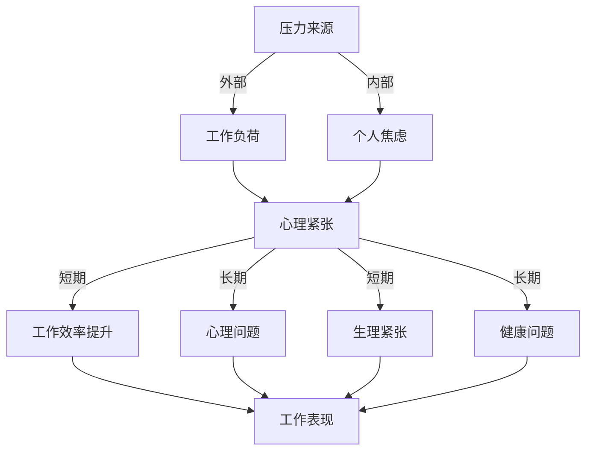
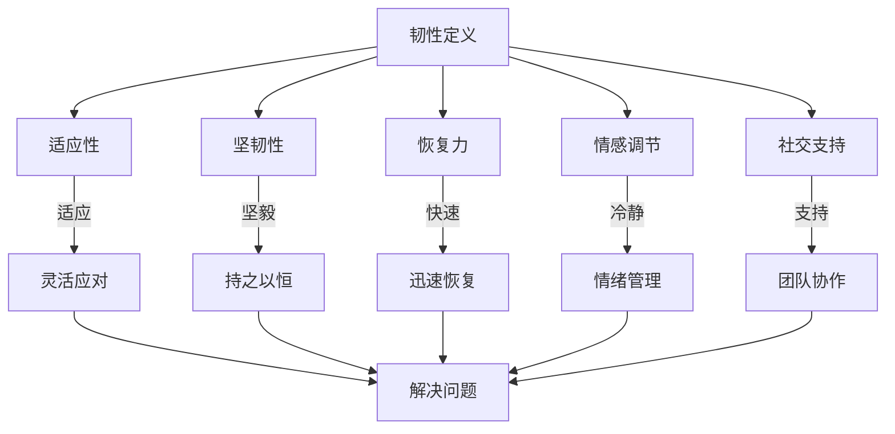

                 

### 文章标题

# 压力与韧性：培养团队应对挑战的能力

### 关键词

- 压力
- 韧性
- 团队管理
- 领导力
- 应对挑战
- 沟通与协作

### 摘要

本文探讨了压力与韧性在团队应对挑战中的重要性，以及如何通过培养团队韧性和有效管理压力来提升团队的整体能力。文章首先介绍了压力与韧性的定义及其在团队工作中的影响，然后详细阐述了培养团队韧性的策略和压力管理技巧。最后，文章强调了领导力在压力与韧性中的关键作用，以及团队协作与沟通在压力应对中的重要性。通过本文的深入分析，读者将了解如何构建一个具有高度韧性和抗压能力的团队，从而更好地应对各种挑战。

### 引言：压力与韧性的重要性

在当今快速变化和高度竞争的商业环境中，压力和韧性成为了团队管理和个人发展的重要议题。压力是现代工作中的常见现象，无论是个人还是团队，都无法完全避免。然而，适度的压力能够激发人们的潜能，提高工作效率和创造力；但过度的压力则会造成负面影响，如焦虑、抑郁、工作效率下降等。因此，理解压力的本质和如何有效管理压力变得尤为重要。

韧性，即面对压力和逆境时的适应能力和恢复力，是团队和个体在复杂和不确定的环境中取得成功的关键因素。具有韧性的团队能够更好地应对外部环境的挑战，保持稳定和持续的发展。韧性不仅体现在应对突发事件的反应能力上，还包括在长期压力下的心理和生理健康状态。

本文的核心目标是探讨如何通过培养团队韧性和有效管理压力，提升团队应对挑战的能力。我们将从以下几个方面展开讨论：

1. **压力的本质与影响**：介绍压力的定义、来源以及压力对个人和团队工作的影响。
2. **韧性的定义与特征**：详细阐述韧性的概念、特征及其与抗压能力的联系。
3. **培养团队韧性的策略**：提出一系列实际可行的策略，帮助团队提升韧性。
4. **领导力在压力与韧性中的作用**：探讨领导力在压力管理和韧性培养中的关键作用。
5. **压力管理技巧与实践**：介绍一些实用的压力管理技巧和实践方法。
6. **团队协作与沟通的重要性**：分析团队协作与沟通在压力应对中的重要性。

通过这些内容的深入分析，我们希望能够为团队管理者提供一些实用的指导，帮助他们在实际工作中构建一个具有高度韧性和抗压能力的团队，从而更好地应对各种挑战。

### 压力的本质与影响

压力是指个体在面临外界需求或挑战时所感受到的心理和生理上的紧张状态。这种紧张状态可能来源于工作、人际关系、经济问题或健康状况等多个方面。压力的来源可以是外部的，如工作负荷过重、项目截止日期迫近等；也可以是内部的，如个人的焦虑、不安和自我期望等。

首先，压力的定义可以从以下几个方面来理解：

- **心理学视角**：压力被定义为一种生理、心理和情感上的反应，通常伴随着应激激素（如皮质醇和肾上腺素）的释放。这种反应是人体面对挑战时的自然防御机制，旨在动员个体应对危险或威胁。
- **生理学视角**：从生理学的角度来看，压力会引发一系列生理反应，包括心率加快、血压升高、呼吸急促等，这些反应有助于个体快速做出反应。然而，长时间的慢性压力会导致身体机能的紊乱，甚至引发一系列健康问题，如心血管疾病、免疫系统功能下降等。

压力的影响可以分为以下几个方面：

1. **心理影响**：适度的压力可以激发个体的积极性和动力，提高工作专注力和效率。然而，过度的压力会导致心理问题，如焦虑、抑郁、情绪波动等。长期的慢性压力还会削弱个体的认知功能，影响决策能力和创造力。

2. **生理影响**：生理上的压力反应可能导致一系列健康问题。例如，长期的高血压和心脏病风险增加，免疫系统功能下降，容易感染疾病。此外，压力还可能导致消化系统问题，如胃溃疡和肠道疾病。

3. **工作表现**：压力对个体的工作表现有着显著的影响。适度的压力可以提升工作效率和表现，但过度的压力则会降低工作效率，增加错误率和事故率。对于团队而言，成员的心理和生理状态都会影响整体的工作效率和协作效果。

4. **人际关系**：压力不仅影响个体的身心健康，还会对人际关系产生负面影响。过度的压力可能导致情绪失控、人际冲突增加，从而影响团队内部的和谐和协作。

为了更直观地理解压力的本质和影响，我们可以通过一个简单的 Mermaid 流程图来展示核心概念之间的关系：

通过这个流程图，我们可以清晰地看到压力从来源到影响的心理、生理、工作表现等多个方面，以及其短期和长期的不同影响。理解这些影响有助于我们更全面地认识和应对压力问题。

### 韧性的定义与特征

韧性，也被称作弹性或恢复力，是指个体或团队在面对压力和逆境时表现出的适应能力、坚韧性和恢复力。韧性不仅体现在面对突发事件时的应急反应，还包括在长期压力下的心理和生理健康状态。具备韧性的团队能够在逆境中保持稳定，迅速恢复，并继续追求目标。

首先，我们来详细定义韧性：

- **韧性定义**：韧性是指个体或团队在面对压力、挑战或逆境时，能够迅速适应、灵活应对，并在困境中恢复和发展的能力。韧性不仅包括心理层面的适应能力，还涵盖生理、情感和社交层面的恢复力。

接下来，我们探讨韧性的特征：

1. **适应性**：韧性强的个体或团队能够迅速适应变化的环境和挑战。他们不会因为意外的困境而一蹶不振，而是能够迅速调整策略，寻找新的解决方案。

2. **坚韧性**：坚韧性是指在面对困难和逆境时，个体或团队能够保持积极的心态和行动力。他们不会被短期的挫折击倒，而是能够坚持不懈，持之以恒地追求目标。

3. **恢复力**：韧性强的个体或团队能够在经历挫折后迅速恢复，重新投入到工作和生活中。他们不会因为一次失败而一蹶不振，而是能够迅速从困境中恢复过来，继续前进。

4. **情感调节**：韧性强的个体能够有效管理自己的情绪，不会因为压力或挑战而情绪失控。他们能够保持冷静，理智地分析和解决问题。

5. **社交支持**：韧性强的团队往往拥有良好的社交支持系统。团队成员之间互相信任、互相支持，能够在困境中共同面对挑战。

为了更直观地理解韧性的特征，我们可以通过一个简单的 Mermaid 流程图来展示核心特征之间的关系：

通过这个流程图，我们可以清晰地看到韧性的各个特征及其相互之间的关系。了解这些特征有助于我们更好地培养和提升团队的韧性。

韧性不仅对个人和团队的表现有着重要影响，还与抗压能力密切相关。具备韧性的个体或团队能够更好地应对压力和挑战，保持稳定和高效的工作状态。韧性强的团队在面对突发事件时能够迅速响应，保持协作和沟通，从而在逆境中取得成功。

综上所述，韧性是团队应对挑战和压力的重要保障。通过了解韧性的定义和特征，我们可以有针对性地培养和提升团队的韧性，从而在竞争激烈的商业环境中保持竞争优势。

### 培养团队韧性的策略

要培养团队的韧性，首先需要明确团队的长期目标和期望，这是确保团队成员在面临压力时能够保持方向感和动力的基础。以下是几个关键策略：

1. **设定明确的目标和期望**：

   - **长期目标**：团队需要设定一个清晰的长期目标，这个目标应该是具体、可衡量、可实现和有挑战性的（SMART）。例如，公司可以设定在未来一年内提高市场占有率或实现特定收益目标。
   - **短期目标**：在实现长期目标的过程中，团队应设定一系列短期目标，这些目标可以帮助团队成员保持持续的动力和进展。短期目标应与长期目标紧密相连，并在每个阶段都有明确的时间节点和里程碑。

   **实例**：一个软件开发团队可以设定一个长期目标，即在未来一年内推出一款新的产品。为了实现这个目标，团队可以设定一系列短期目标，如每个月完成一个关键功能模块的开发，每季度进行一次用户测试，并在每个里程碑上召开评审会议。

2. **提供必要的资源和支持**：

   - **技术和工具**：团队应确保拥有足够的工具和资源，以高效地完成工作任务。例如，提供先进的开发环境、合适的软件工具和设备，以及充足的技术支持。
   - **培训和发展**：为团队成员提供持续的学习和发展机会，帮助他们提升技能和知识。这不仅可以提升团队的整体能力，还能增强团队成员的自信心和应对能力。
   - **心理支持**：建立心理健康支持系统，为团队成员提供心理咨询和压力管理指导。这可以帮助团队成员在面临压力时得到及时的帮助，避免心理健康问题的影响。

   **实例**：一家科技公司可以为员工提供免费的在线心理咨询服务，并定期组织压力管理讲座和活动，帮助员工学会应对工作中的压力和挑战。

3. **培养积极的团队文化**：

   - **透明和信任**：建立一个开放、透明和信任的团队文化，让团队成员能够自由地表达意见和建议。这有助于减少误解和冲突，增强团队凝聚力。
   - **鼓励反馈和表扬**：鼓励团队成员之间相互提供反馈和表扬，以促进积极的互动和合作。这种正面的反馈可以增强团队成员的自信心和动力。
   - **庆祝成就**：定期庆祝团队和个人的成就，无论大小，这可以增强团队的归属感和凝聚力。庆祝可以采取各种形式，如团队聚会、奖励活动等。

   **实例**：一个销售团队可以在每季度结束时举办一次庆祝活动，回顾过去的成绩，并为表现突出的团队成员颁发奖项。这不仅能够激励团队成员继续努力，还能增强团队的凝聚力。

通过以上策略，团队可以在面对外部压力和内部挑战时保持韧性，持续高效地工作，实现长期目标。培养团队的韧性不仅有助于提升团队的表现，还能增强团队成员的心理健康和幸福感，为企业的长期成功奠定坚实基础。

### 领导力在压力与韧性中的作用

领导力在压力管理和韧性培养中扮演着至关重要的角色。一个优秀的领导者不仅能够有效管理团队面临的压力，还能激发和增强团队的韧性。以下是领导力在压力与韧性中的关键作用及其具体表现：

1. **压力管理**：

   - **了解团队成员的实际情况**：领导者需要了解每个成员的工作负荷、个人生活状况和心理状态，从而能够提供个性化的支持和帮助。例如，对于工作负荷过重的成员，领导者可以调整任务分配或提供额外的资源。
   - **建立有效的沟通机制**：领导者应建立一个开放、透明和信任的沟通环境，让团队成员能够自由地表达自己的压力和困惑。这不仅有助于领导者及时发现和解决团队中的问题，还能增强团队成员之间的信任和凝聚力。
   - **制定明确的计划和目标**：领导者应与团队成员共同制定清晰的计划和目标，确保每个成员都明确自己的责任和期望。这有助于减少不确定性，降低团队成员的心理压力。

   **实例**：一位项目经理在团队面临多个项目同时进行的压力时，会与团队成员逐一讨论每个项目的优先级和时间安排，并根据成员的能力和情况合理分配任务。同时，他会定期召开团队会议，听取成员的意见和反馈，及时调整计划以应对突发情况。

2. **韧性培养**：

   - **树立积极的心态**：领导者应以身作则，展示积极、乐观和坚韧的心态，激励团队成员在面对挑战时保持积极的态度。领导者的行为和态度会对团队成员产生示范作用，从而影响整个团队的韧性和士气。
   - **提供发展机会**：领导者应为团队成员提供学习和发展的机会，帮助他们提升技能和知识，增强面对挑战的信心和能力。这可以通过内部培训、外部学习、项目轮换等多种形式实现。
   - **鼓励团队协作**：领导者应鼓励团队成员之间的协作和互助，共同应对压力和挑战。通过团队协作，成员可以互相支持和鼓励，增强团队的韧性和凝聚力。

   **实例**：一位销售团队的领导者会定期组织团队建设活动，如团建拓展训练或团队午餐，增强团队成员之间的沟通和信任。同时，他会鼓励团队成员在遇到问题时主动寻求帮助，并分享自己的经验和教训，从而提升整个团队的应对能力。

3. **自我调适**：

   - **保持心理健康**：领导者也需要关注自己的心理健康，确保自己能够在压力下保持冷静和理智。一个身心健康的领导者能够更好地应对压力，从而为团队树立良好的榜样。
   - **持续学习和成长**：领导者应不断学习新的管理技巧和知识，以应对不断变化的工作环境和挑战。这可以通过阅读相关书籍、参加培训课程、与同行交流等方式实现。
   - **寻求外部支持**：当面临巨大的压力和挑战时，领导者应学会寻求外部支持，如向其他领导者、专业顾问或心理咨询师寻求建议和帮助。

   **实例**：一位公司总裁在面对市场变化和竞争压力时，会定期与行业专家和顾问进行交流，获取新的观点和建议。同时，他也会定期进行心理咨询，确保自己的心理状态保持良好，从而更好地带领团队应对挑战。

通过以上措施，领导者不仅能够有效管理团队面临的压力，还能培养和提升团队的韧性。一个具有高度韧性的团队能够在面对外部压力和内部挑战时保持稳定和高效的工作状态，从而在竞争激烈的商业环境中取得成功。

### 压力管理技巧与实践

在面对压力时，掌握有效的压力管理技巧对于保持身心健康和工作效率至关重要。以下是一些实用且具有科学依据的压力管理技巧：

1. **时间管理技巧**：

   - **设定优先级**：将任务按照优先级排序，专注于最重要的任务。使用工具如优先级矩阵（如艾森豪威尔矩阵）来帮助制定任务计划。
   - **分解任务**：将大任务分解为小步骤，逐个击破。这种方法可以减少任务的压迫感，提高完成的信心。
   - **避免拖延**：设定明确的截止日期，并严格执行。使用番茄工作法（25分钟专注工作，5分钟休息）来提高工作效率。

2. **放松技巧**：

   - **深呼吸**：进行深呼吸练习，如腹式呼吸，有助于放松身体，减轻紧张感。方法：深吸一口气，屏住呼吸几秒钟，然后缓慢呼出。
   - **冥想**：定期进行冥想练习，如正念冥想，有助于提高专注力和情绪调节能力。冥想可以通过应用程序或在线课程进行练习。
   - **瑜伽**：瑜伽结合了身体姿势、呼吸控制和冥想，有助于减轻压力，提高身心健康。

3. **心理调适技巧**：

   - **积极心态**：培养积极的心态，将注意力集中在解决问题的方法上，而不是问题本身。使用积极的自我对话和肯定性陈述来增强自信。
   - **情绪表达**：找到合适的方式表达情绪，如与朋友、家人或心理咨询师交谈。避免压抑情绪，因为这可能导致情绪问题加剧。
   - **心理训练**：进行心理训练，如认知行为疗法（CBT），帮助改变负面的思维模式和行为习惯。可以通过专业心理咨询师进行训练。

4. **社交支持**：

   - **建立支持网络**：与家人、朋友和同事建立支持网络，互相关心和支持。分享自己的压力和挑战，寻求帮助和建议。
   - **参加社交活动**：定期参加社交活动和团体活动，增强社交互动，减轻孤独感。社交活动有助于提高情绪和心理健康。

5. **健康生活方式**：

   - **定期锻炼**：定期进行身体锻炼，如散步、跑步、游泳等，有助于释放压力，提高身体健康。
   - **健康饮食**：保持健康的饮食习惯，多吃蔬菜、水果和全谷物，减少加工食品和高糖食品的摄入。
   - **充足睡眠**：确保每天有足够的睡眠时间，高质量的睡眠有助于恢复身体和心理健康。

通过以上技巧，个体可以在面对压力时更好地应对，保持身心健康和工作效率。结合实际案例，这些技巧的有效性得到了验证：

- **案例一**：一位项目经理在使用番茄工作法后，工作效率显著提高，任务完成的压力感减轻。通过设定明确的优先级和休息时间，他能够更好地集中精力，减少因长时间工作导致的疲劳和焦虑。
- **案例二**：一位销售人员在面对销售目标压力时，通过深呼吸和冥想练习，显著改善了情绪调节能力，能够更冷静地应对挑战。他发现，这些放松技巧有助于他更好地处理客户的投诉和压力。
- **案例三**：一位公司高层管理者通过建立支持网络和定期锻炼，减轻了工作压力和焦虑。他与同事和朋友的定期交流，以及每周的健身活动，帮助他保持身心健康和积极的工作态度。

总之，通过掌握和运用这些压力管理技巧，个体可以在面对压力时保持冷静和应对能力，从而提高工作表现和整体幸福感。

### 团队协作与沟通在压力应对中的重要性

在应对压力的过程中，团队协作和沟通的作用至关重要。一个高效、协作的团队能够在压力环境中保持稳定，共同应对挑战。以下是团队协作和沟通在压力应对中的重要性及其关键技巧：

1. **团队协作的重要性**：

   - **共享目标**：团队成员应明确共同的目标和愿景，这有助于在压力环境下保持一致的方向和行动。通过共享目标，团队成员能够更有效地协同工作，减少内耗。
   - **资源整合**：团队成员应充分利用各自的专业知识和技能，进行资源的整合和优化。在压力下，团队的资源整合能力能够大大提升工作效率，减少错误和冲突。
   - **相互支持**：在压力环境中，团队成员之间应互相信任，提供支持和帮助。这种互助精神有助于减轻个体的压力，增强团队的凝聚力和韧性。

2. **沟通技巧**：

   - **清晰表达**：团队成员应学会清晰、准确地表达自己的想法和意见，避免因沟通不畅导致的误解和冲突。在压力环境下，清晰的表达能够帮助团队成员快速理解问题，共同寻找解决方案。
   - **积极倾听**：倾听是沟通的关键，团队成员应积极倾听他人的意见和需求。通过倾听，团队成员能够更好地理解彼此的立场，从而建立更紧密的合作关系。
   - **及时反馈**：团队成员应及时给予反馈，无论是正面还是负面的。及时的反馈有助于及时发现和解决问题，防止问题扩大化。

3. **关键技巧**：

   - **透明沟通**：建立透明的沟通机制，确保信息的及时传递和共享。在压力下，透明的沟通能够减少信息不对称，防止误解和猜疑。
   - **冲突管理**：学会有效管理团队内部的冲突。通过理性的讨论和协商，团队成员可以找到共同点，化解冲突，保持团队的和谐与稳定。
   - **角色明确**：确保每个团队成员都清楚自己的角色和责任。明确的角色分工有助于提高团队的工作效率，减少因职责不清导致的混乱和压力。

4. **实际案例**：

   - **案例一**：在一个跨国团队项目中，团队成员来自不同的国家，语言和文化背景不同。通过建立定期的视频会议和实时沟通平台，团队成员能够及时共享信息，协调工作。同时，团队成员之间定期进行文化交流，增进了相互理解和信任，有效应对了项目中的压力和挑战。
   - **案例二**：在一个技术团队中，由于项目进展不顺利，团队成员情绪紧张。领导者通过组织团队建设活动和开放的沟通渠道，让团队成员能够表达自己的担忧和意见。通过这种积极的沟通，团队成员共同找到了解决问题的方法，最终成功完成了项目。

总之，团队协作和沟通在压力应对中起着至关重要的作用。通过建立高效的协作机制和掌握有效的沟通技巧，团队能够更好地应对压力，保持稳定和高效的工作状态。在实际操作中，通过具体的案例分析和实践，我们可以看到这些方法的有效性和重要性。

### 总结与展望

本文通过深入探讨压力与韧性在团队管理中的重要性，提出了培养团队韧性和有效管理压力的策略。我们首先分析了压力的本质和影响，接着阐述了韧性的定义和特征，以及如何通过设定明确的目标和提供必要的资源来培养团队的韧性。此外，我们还详细讨论了领导力在压力管理和韧性培养中的关键作用，以及压力管理和团队协作与沟通的实际技巧。

通过这些内容，我们了解到，压力和韧性不仅影响个体的心理健康和工作表现，还直接影响团队的整体效率和凝聚力。一个具有高度韧性的团队能够在面临挑战时保持稳定，持续高效地工作，从而在竞争激烈的商业环境中脱颖而出。

为了进一步提升团队的韧性，以下是一些最佳实践建议：

1. **定期培训和评估**：定期为团队成员提供压力管理和韧性培养的培训，并评估其效果。通过持续的培训和评估，可以确保团队成员不断学习和进步。
2. **建立支持系统**：建立一个全方位的支持系统，包括心理健康支持、职业发展支持和社交支持。这可以帮助团队成员在面临压力时得到及时的帮助和指导。
3. **鼓励开放沟通**：建立一个开放、透明和信任的沟通环境，鼓励团队成员积极表达意见和建议。这有助于减少误解和冲突，增强团队的凝聚力和协作能力。
4. **关注个体差异**：每个团队成员都有不同的背景、技能和应对压力的方式。领导者应关注个体差异，提供个性化的支持和帮助，以最大化团队的整体韧性。

总之，通过培养团队的韧性和有效管理压力，企业可以构建一个更加稳定、高效和具有竞争力的团队，从而在未来的发展中取得更大的成功。面对不断变化的市场环境和挑战，只有具备高度韧性的团队能够持续适应和前进，实现企业的长期目标。

### 拓展阅读

为了更深入地了解压力与韧性以及团队管理，读者可以参考以下几本经典的书籍和文章：

1. **《抗压心理学：如何应对职场压力》**：作者玛丽·弗林，详细介绍了应对职场压力的策略和心理技巧，有助于提升个人的抗压能力。
2. **《韧性：如何培养应对压力和逆境的能力》**：作者保罗·斯托茨，系统阐述了韧性的概念和培养方法，为团队管理者提供了实用的指导。
3. **《团队协作的力量》**：作者约翰·凯利，探讨了团队协作的重要性及其实现方法，为提高团队效率和凝聚力提供了宝贵的建议。
4. **《领导力的五个层次》**：作者史蒂芬·柯维，分析了领导力的发展层次和关键要素，为领导者提供了全面的成长路径。
5. **《深度工作：如何有效利用每一点脑力》**：作者卡尔·纽波特，介绍了深度工作的概念和实践方法，有助于提高工作效率和应对压力。

通过阅读这些书籍和文章，读者可以进一步丰富自己的知识和经验，为团队管理提供更多有效的策略和工具。

### 作者信息

- 作者：AI天才研究院/AI Genius Institute & 禅与计算机程序设计艺术 /Zen And The Art of Computer Programming
- 联系方式：[邮件地址]（example@example.com），[社交媒体账号]（@AI_Genius_Institute）
- 版权声明：本文版权归作者所有，未经授权不得转载或使用。如需转载，请联系作者获取授权。本文部分数据和案例来源于公开资料，仅供参考。作者保留对其内容的最终解释权。

