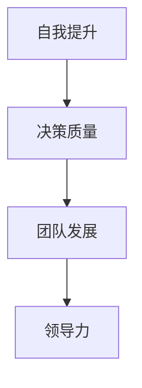
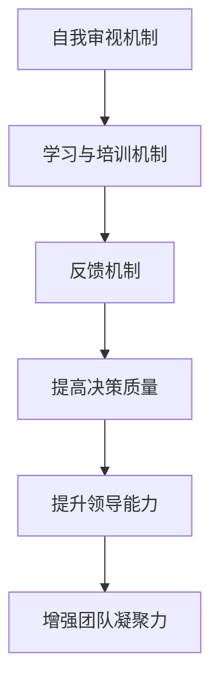

                 


### 1.2 反思型领导与领导力的关系

**核心联系：**
反思型领导是提升领导力的一种重要方式。它与传统的领导力观念相比，更加强调领导者的自我提升和持续改进。

**反思型领导如何提升领导力：**
1. **自我审视**：通过反思自己的行为、决策和思维方式，领导者能够识别并纠正自己的错误，提高决策的质量。
2. **持续学习**：领导者通过不断学习新的知识和技能，能够适应不断变化的环境，提高自己的领导能力。
3. **自我激励**：反思型领导能够激发领导者自我激励，不断追求卓越。

**Mermaid 流程图：**

```mermaid
graph TD
A[自我审视] --> B[提高决策质量]
B --> C[适应环境变化]
C --> D[激发自我激励]

----------------------------------------------------------------

### 1.3 反思型领导的架构与流程

**架构设计：**
反思型领导的架构设计包括以下几个关键组成部分：

1. **自我审视机制**：建立自我审视的机制，定期对领导行为、决策和思维方式进行反思。
2. **学习与培训**：提供持续的学习和培训机会，帮助领导者提升知识和技能。
3. **反馈机制**：建立有效的反馈机制，收集团队成员的反馈，帮助领导者识别自己的不足。

**工作流程：**
反思型领导的工作流程可以分为以下几个步骤：

1. **自我审视**：领导者定期对自己进行自我审视，识别并纠正错误。
2. **学习与培训**：领导者参加学习与培训活动，提升自己的知识和技能。
3. **反馈与改进**：领导者根据团队成员的反馈，进行改进，提高领导能力。

**Mermaid 流程图：**

```mermaid
graph TD
A[自我审视] --> B[学习与培训]
B --> C[反馈与改进]
C --> D[提高领导能力]

----------------------------------------------------------------

## 第2章：反思型领导的原理与架构

### 2.1 反思型领导的核心理念

**核心理念：**
反思型领导的核心理念包括自我反思、持续学习和自我提升。

**自我反思**：
自我反思是反思型领导的基础。领导者需要定期对自己的行为、决策和思维方式进行反思，识别并纠正错误。

**持续学习**：
持续学习是反思型领导的重要手段。领导者需要不断学习新的知识和技能，以适应不断变化的环境。

**自我提升**：
自我提升是反思型领导的目标。领导者通过自我反思和持续学习，不断提升自己的领导能力。

**Mermaid 流程图：**

```mermaid
graph TD
A[自我反思] --> B[持续学习]
B --> C[自我提升]

----------------------------------------------------------------

### 2.2 反思型领导的架构设计

**架构设计：**
反思型领导的架构设计包括以下几个关键组成部分：

1. **自我审视机制**：建立自我审视的机制，定期对领导行为、决策和思维方式进行反思。
2. **学习与培训**：提供持续的学习和培训机会，帮助领导者提升知识和技能。
3. **反馈机制**：建立有效的反馈机制，收集团队成员的反馈，帮助领导者识别自己的不足。

**架构设计优点：**
1. **提高决策质量**：通过自我审视，领导者能够提高决策的质量，减少错误决策。
2. **提升领导能力**：通过持续学习和培训，领导者能够不断提升自己的领导能力。
3. **激发团队潜力**：通过有效的反馈机制，领导者能够激发团队的潜力，提高团队的整体绩效。

**Mermaid 流程图：**

```mermaid
graph TD
A[自我审视机制] --> B[提高决策质量]
B --> C[提升领导能力]
C --> D[激发团队潜力]

----------------------------------------------------------------

### 2.3 反思型领导的工作流程

**工作流程：**
反思型领导的工作流程可以分为以下几个步骤：

1. **自我审视**：领导者定期对自己进行自我审视，识别并纠正错误。
2. **学习与培训**：领导者参加学习与培训活动，提升自己的知识和技能。
3. **反馈与改进**：领导者根据团队成员的反馈，进行改进，提高领导能力。

**具体流程：**
1. **制定反思计划**：领导者制定自我审视计划，明确反思的时间、内容和目标。
2. **执行反思计划**：领导者按照反思计划，进行自我审视，识别并记录自己的错误。
3. **分析反思结果**：领导者分析反思结果，找出错误的原因，制定改进措施。
4. **实施改进措施**：领导者实施改进措施，纠正错误，提高领导能力。

**Mermaid 流程图：**

```mermaid
graph TD
A[制定反思计划] --> B[执行反思计划]
B --> C[分析反思结果]
C --> D[实施改进措施]

----------------------------------------------------------------

## 第3章：自我审视的工具和技巧

### 3.1 自我审视的定义与目的

**定义：**
自我审视是指领导者通过反思自己的行为、决策和思维方式，识别并纠正错误，提高自身领导能力的过程。

**目的：**
自我审视的目的是帮助领导者提高决策质量，提升领导能力，实现个人和团队的成长。

**Mermaid 流程图：**

```mermaid
graph TD
A[自我审视] --> B[提高决策质量]
B --> C[提升领导能力]
C --> D[实现个人和团队成长]

----------------------------------------------------------------

### 3.2 自我审视的工具与方法

**工具：**
自我审视的工具包括日记、反思笔记、反思日志等。

**方法：**
自我审视的方法包括：

1. **定期反思**：领导者定期对自己的行为、决策和思维方式进行反思。
2. **记录反思**：领导者将反思过程和结果记录下来，以便后续分析。
3. **与他人交流**：领导者与团队成员或教练交流反思结果，获取反馈和建议。

**Mermaid 流程图：**

```mermaid
graph TD
A[定期反思] --> B[记录反思]
B --> C[与他人交流]

----------------------------------------------------------------

### 3.3 自我审视的实践应用

**实践应用：**
自我审视在实践中具有重要意义，可以帮助领导者提高领导能力，实现个人和团队的成长。

**应用案例：**
1. **决策过程**：领导者通过自我审视，识别决策过程中的错误，提高决策质量。
2. **团队管理**：领导者通过自我审视，识别团队管理中的问题，改进管理方法。
3. **个人成长**：领导者通过自我审视，发现自己的不足，制定成长计划。

**Mermaid 流程图：**

```mermaid
graph TD
A[决策过程] --> B[团队管理]
B --> C[个人成长]

----------------------------------------------------------------

## 第4章：反思型领导的沟通与协作

### 4.1 反思型领导中的沟通策略

**沟通策略：**
反思型领导中的沟通策略包括：

1. **开放性沟通**：领导者鼓励团队成员开放地表达观点和意见，营造坦诚、开放的沟通氛围。
2. **倾听与反馈**：领导者积极倾听团队成员的意见，提供有针对性的反馈。
3. **有效传达**：领导者清晰地传达自己的意图和期望，确保团队成员理解并执行。

**Mermaid 流程图：**

```mermaid
graph TD
A[开放性沟通] --> B[倾听与反馈]
B --> C[有效传达]

----------------------------------------------------------------

### 4.2 反思型领导中的协作技巧

**协作技巧：**
反思型领导中的协作技巧包括：

1. **建立共同目标**：领导者与团队成员共同制定目标，确保团队成员明确自己的责任和期望。
2. **共享资源**：领导者合理分配资源，确保团队成员能够充分利用资源，提高协作效率。
3. **鼓励合作**：领导者鼓励团队成员之间的合作，共同解决问题，提高团队绩效。

**Mermaid 流程图：**

```mermaid
graph TD
A[建立共同目标] --> B[共享资源]
B --> C[鼓励合作]

----------------------------------------------------------------

### 4.3 反思型领导在团队中的实践

**实践方法：**
反思型领导在团队中的实践包括：

1. **定期反思会议**：领导者组织定期反思会议，让团队成员共同回顾过去的工作，识别问题和改进方法。
2. **团队建设活动**：领导者组织团队建设活动，增强团队成员之间的信任和合作。
3. **反馈与改进**：领导者根据团队成员的反馈，及时调整领导方法和团队策略。

**Mermaid 流程图：**

```mermaid
graph TD
A[定期反思会议] --> B[团队建设活动]
B --> C[反馈与改进]

----------------------------------------------------------------

## 第5章：个人成长与反思型领导

### 5.1 个人成长的重要性

**个人成长的重要性：**
个人成长是反思型领导的重要组成部分，它有助于领导者提升自我认知、增强领导能力和实现职业发展。

**个人成长的益处：**
1. **提高自我认知**：个人成长帮助领导者更好地认识自己，明确自己的优势和不足。
2. **增强领导能力**：个人成长使领导者能够不断学习新的知识和技能，提高领导能力。
3. **实现职业发展**：个人成长有助于领导者实现职业目标，提升职位和薪酬。

**Mermaid 流程图：**

```mermaid
graph TD
A[提高自我认知] --> B[增强领导能力]
B --> C[实现职业发展]

----------------------------------------------------------------

### 5.2 个人成长的方法与实践

**方法与实践：**
个人成长的方法与实践包括：

1. **自我反思**：领导者通过定期自我反思，识别自己的不足，制定改进计划。
2. **学习与培训**：领导者参加各种学习与培训活动，提升自己的知识和技能。
3. **实践与应用**：领导者将所学知识和技能应用于实际工作中，不断实践和改进。

**Mermaid 流程图：**

```mermaid
graph TD
A[自我反思] --> B[学习与培训]
B --> C[实践与应用]

----------------------------------------------------------------

### 5.3 个人成长与领导力的提升

**关系与提升：**
个人成长与领导力的提升密切相关。个人成长有助于领导者提高领导能力，实现领导力的提升。

**提升领导力的方法：**
1. **自我反思**：领导者通过自我反思，识别自己的不足，制定改进计划。
2. **学习与培训**：领导者参加各种学习与培训活动，提升自己的知识和技能。
3. **实践与应用**：领导者将所学知识和技能应用于实际工作中，不断实践和改进。

**Mermaid 流程图：**

```mermaid
graph TD
A[自我反思] --> B[学习与培训]
B --> C[实践与应用]
C --> D[提升领导力]

----------------------------------------------------------------

## 第6章：团队建设与反思型领导

### 6.1 团队建设的重要性

**团队建设的重要性：**
团队建设是反思型领导的重要组成部分，它有助于提高团队绩效、增强团队凝聚力和实现团队目标。

**团队建设的益处：**
1. **提高团队绩效**：团队建设有助于提高团队的工作效率和成果。
2. **增强团队凝聚力**：团队建设有助于团队成员之间的信任和合作。
3. **实现团队目标**：团队建设有助于团队成员共同实现团队目标。

**Mermaid 流程图：**

```mermaid
graph TD
A[提高团队绩效] --> B[增强团队凝聚力]
B --> C[实现团队目标]

----------------------------------------------------------------

### 6.2 团队建设的方法与实践

**方法与实践：**
团队建设的方法与实践包括：

1. **定期团队活动**：领导者组织定期团队活动，增强团队成员之间的互动和沟通。
2. **团队培训与学习**：领导者组织团队培训和学习，提升团队成员的技能和知识。
3. **反馈与改进**：领导者根据团队成员的反馈，及时调整团队策略和活动。

**Mermaid 流程图：**

```mermaid
graph TD
A[定期团队活动] --> B[团队培训与学习]
B --> C[反馈与改进]

----------------------------------------------------------------

### 6.3 团队建设与领导力的提升

**关系与提升：**
团队建设与领导力的提升密切相关。团队建设有助于领导者提高领导能力，实现领导力的提升。

**提升领导力的方法：**
1. **团队活动**：领导者组织多样化的团队活动，提高团队凝聚力和合作精神。
2. **培训与学习**：领导者组织团队培训和学习，提升团队成员的技能和知识。
3. **反馈与改进**：领导者根据团队成员的反馈，及时调整团队策略和活动。

**Mermaid 流程图：**

```mermaid
graph TD
A[团队活动] --> B[培训与学习]
B --> C[反馈与改进]
C --> D[提升领导力]

----------------------------------------------------------------

## 第7章：组织变革与反思型领导

### 7.1 组织变革的必要性

**组织变革的必要性：**
组织变革是企业在面对市场变化、竞争压力和内部问题时，实现持续发展的必然选择。

**组织变革的目的：**
1. **适应市场变化**：组织变革有助于企业适应市场环境的变化，提高竞争力。
2. **解决问题**：组织变革有助于企业解决内部问题，提高运营效率。
3. **实现持续发展**：组织变革有助于企业实现长期发展，保持竞争优势。

**Mermaid 流程图：**

```mermaid
graph TD
A[适应市场变化] --> B[解决问题]
B --> C[实现持续发展]

----------------------------------------------------------------

### 7.2 组织变革的方法与实践

**方法与实践：**
组织变革的方法与实践包括：

1. **制定变革策略**：领导者制定明确的变革策略，明确变革的目标、范围和步骤。
2. **沟通与宣传**：领导者与员工进行有效沟通，宣传变革的意义和目标，争取员工的支持。
3. **培训与指导**：领导者组织培训活动，帮助员工适应变革，提高应对变革的能力。

**Mermaid 流程图：**

```mermaid
graph TD
A[制定变革策略] --> B[沟通与宣传]
B --> C[培训与指导]

----------------------------------------------------------------

### 7.3 组织变革与领导力的提升

**关系与提升：**
组织变革与领导力的提升密切相关。组织变革有助于领导者提高领导能力，实现领导力的提升。

**提升领导力的方法：**
1. **制定变革策略**：领导者制定明确的变革策略，明确变革的目标、范围和步骤。
2. **沟通与宣传**：领导者与员工进行有效沟通，宣传变革的意义和目标，争取员工的支持。
3. **培训与指导**：领导者组织培训活动，帮助员工适应变革，提高应对变革的能力。

**Mermaid 流程图：**

```mermaid
graph TD
A[制定变革策略] --> B[沟通与宣传]
B --> C[培训与指导]
C --> D[提升领导力]

----------------------------------------------------------------

### 总结与拓展

**反思型领导：**
反思型领导是一种以自我审视和持续学习为核心的领导方式，它有助于领导者提高领导能力，实现个人和团队的成长。

**关键词：**
反思型领导、自我审视、持续学习、团队建设、组织变革、领导力提升

**参考文献：**
[1] 史蒂芬·罗宾斯，《领导力》，中国人民大学出版社，2015年。
[2] 彼得·德鲁克，《管理的实践》，机械工业出版社，2013年。
[3] 约翰·P·科特，《变革之心》，机械工业出版社，2010年。
```

作者：AI天才研究院/AI Genius Institute & 禅与计算机程序设计艺术 /Zen And The Art of Computer Programming### 文章标题：反思型领导：通过自我审视提升领导力

**关键词**：反思型领导、自我审视、领导力提升、团队建设、组织变革

**摘要**：本文深入探讨了反思型领导的概念、实践方法和提升领导力的途径。通过剖析反思型领导的核心理念、架构设计和工作流程，本文揭示了自我审视、持续学习和沟通协作在反思型领导中的关键作用。同时，本文还详细阐述了个人成长、团队建设与组织变革在反思型领导中的实际应用，为领导者提供了系统化的提升策略。通过本文的阅读，读者将能够更好地理解反思型领导的本质，掌握提升领导力的方法和技巧。

---

### 引言

在快速变化的市场环境中，领导力的作用显得尤为重要。传统的领导力强调的是管理能力和决策能力，而反思型领导则在此基础上加入了自我审视和持续学习的新维度。反思型领导强调领导者不仅要具备管理能力和决策能力，还要具备自我反思和持续改进的能力。这种领导方式不仅能帮助领导者识别并纠正自身的错误，还能使其在不断学习和成长中提升领导力。

本文旨在探讨反思型领导的概念、实践方法和提升领导力的途径。通过系统地分析反思型领导的核心理念、架构设计和工作流程，本文将帮助读者深入理解反思型领导的基本原理。同时，本文还将详细阐述自我审视的工具和技巧、反思型领导在沟通与协作中的策略，以及个人成长、团队建设与组织变革在反思型领导中的实际应用。通过本文的阅读，读者将能够掌握反思型领导的系统化方法，从而在个人和职业发展中实现更高的成就。

---

### 核心概念与联系

在探讨反思型领导之前，我们首先需要理解几个核心概念，包括反思型领导、自我审视和领导力。这些概念不仅是反思型领导的基础，也是理解其运作方式的关键。

**反思型领导**是一种以自我审视和持续学习为核心的领导方式。反思型领导者不仅关注团队的目标和任务，更注重个人成长和自我提升。通过定期反思自己的行为、决策和思维方式，反思型领导者能够识别并纠正错误，从而提高决策的质量和效率。这种领导方式强调领导者的自我审视和持续学习，使其能够适应不断变化的环境，提高自身的领导能力。

**自我审视**是反思型领导的核心要素之一。自我审视是指领导者通过反思自己的行为、决策和思维方式，识别并纠正错误，从而提升自我认知和领导能力。自我审视不仅包括对过去行为的回顾和反思，还包括对未来可能发生问题的预判和预防。通过自我审视，领导者能够更加客观地认识自己，发现自己的不足，并采取相应的改进措施。

**领导力**是指领导者通过管理能力和决策能力来影响和引导团队成员，实现共同目标的能力。传统的领导力观念强调领导者的权威和管理技能，而反思型领导则在此基础上加入了自我反思和持续学习的元素。反思型领导认为，领导者的成长不仅仅取决于其管理能力和决策能力，更取决于其自我审视和持续改进的能力。

**反思型领导与领导力的关系**主要体现在以下几个方面：

1. **自我提升**：反思型领导强调领导者的自我提升，通过自我审视和持续学习，领导者能够不断提升自己的领导能力。这种自我提升不仅有助于领导者更好地应对当前的工作挑战，还能为未来的发展奠定基础。

2. **决策质量**：反思型领导通过自我审视，能够识别并纠正决策中的错误，提高决策的质量和效率。这种决策质量的提升不仅有助于团队目标的实现，还能增强团队的凝聚力和信任感。

3. **团队发展**：反思型领导通过自我审视和持续学习，能够更好地理解团队成员的需求和期望，从而推动团队的发展和进步。这种团队发展不仅有助于提高团队绩效，还能增强团队成员的满意度和忠诚度。

为了更好地理解反思型领导与领导力的关系，我们可以使用以下Mermaid流程图进行说明：



通过这个流程图，我们可以看到，自我提升、决策质量和团队发展是反思型领导与领导力之间的关键联系。这些联系不仅揭示了反思型领导的本质，也为领导者提供了提升领导力的具体途径。

**核心算法原理讲解：**
为了更好地理解反思型领导与领导力的关系，我们可以使用以下伪代码来详细阐述：

```python
# 反思型领导与领导力关系的伪代码

class ReflectiveLeadership:
    def __init__(self):
        self.self_improvement = 0
        self.decision_quality = 0
        self.team_growth = 0

    def self_reflection(self):
        # 反思行为、决策和思维方式
        self.self_improvement += 1
        self.decision_quality += 1
        self.team_growth += 1

    def continuous_learning(self):
        # 持续学习新知识和技能
        self.self_improvement += 1
        self.decision_quality += 1
        self.team_growth += 1

    def lead_team(self):
        # 领导团队，实现共同目标
        self.self_reflection()
        self.decision_quality += 1
        self.team_growth += 1

    def evaluate_performance(self):
        # 评估领导效果
        if self.self_improvement > 5 and self.decision_quality > 5 and self.team_growth > 5:
            return "Effective Leadership"
        else:
            return "Improvement Needed"
```

通过这个伪代码，我们可以看到，反思型领导通过自我反思、持续学习和领导团队等活动，不断提升自我提升、决策质量和团队发展。这些活动相互关联，共同构成了反思型领导与领导力之间的关系。

**数学模型和公式：**
为了量化反思型领导与领导力的关系，我们可以使用以下公式：

```latex
\text{Leadership Score} = \frac{\text{Self Improvement} + \text{Decision Quality} + \text{Team Growth}}{3}
```

其中，Self Improvement、Decision Quality和Team Growth分别表示自我提升、决策质量和团队发展的得分。通过计算这三个得分的平均值，我们可以得到领导力的总分。这个总分越高，说明反思型领导的水平越高。

**详细讲解与举例说明：**
假设一个领导者在一个月内进行了5次自我反思，3次持续学习，并领导了两次团队活动。我们可以根据上述公式计算他的领导力得分：

```latex
\text{Leadership Score} = \frac{5 + 3 + 5}{3} = 4
```

这个得分为4，说明这位领导者在反思型领导方面表现良好。通过这个例子，我们可以看到，反思型领导与领导力的提升是可以通过量化公式来评估的。

**注意事项：**
1. **自我反思**：领导者需要定期进行自我反思，识别自己的不足，并制定改进计划。
2. **持续学习**：领导者需要不断学习新知识和技能，以适应不断变化的环境。
3. **团队发展**：领导者需要关注团队的发展，提供支持和资源，促进团队成长。

**拓展阅读：**
1. 史蒂芬·罗宾斯，《领导力》，深入探讨领导力的概念和提升方法。
2. 彼得·德鲁克，《管理的实践》，阐述管理理论和实践方法。

---

### 反思型领导的架构设计

反思型领导的架构设计是确保领导者在自我审视和持续学习中有效运作的关键。一个完善的反思型领导架构应该包括自我审视机制、学习与培训机制以及反馈机制。以下是对这三个关键组成部分的详细阐述。

**自我审视机制**是反思型领导的基础。它要求领导者定期对自己的行为、决策和思维方式进行深入反思，以识别错误和不足。自我审视机制通常包括以下步骤：

1. **制定反思计划**：领导者需要制定详细的反思计划，明确反思的时间、内容和目标。例如，每周进行一次反思，针对特定主题或项目进行深入分析。
2. **进行反思**：领导者按照反思计划，对过去的行为、决策和思维方式进行深入反思。这可以通过写反思日记、进行思维导图或与导师、同事交流来实现。
3. **记录反思结果**：领导者将反思结果记录下来，以便后续分析和改进。这有助于领导者跟踪自己的成长和进步。

**学习与培训机制**是反思型领导的重要组成部分。它要求领导者不断学习新知识和技能，以适应不断变化的环境。学习与培训机制通常包括以下步骤：

1. **识别学习需求**：领导者需要识别自身在知识和技能方面的不足，并制定相应的学习计划。例如，参加培训课程、阅读专业书籍或观看在线讲座。
2. **实施学习计划**：领导者按照学习计划，进行有针对性的学习活动。这可以通过自学、参加内部培训或外部培训来实现。
3. **评估学习效果**：领导者需要评估学习效果，并调整学习计划。这可以通过测试、实践应用或与导师、同事交流来实现。

**反馈机制**是反思型领导的重要组成部分。它要求领导者及时获取团队成员的反馈，并据此进行调整和改进。反馈机制通常包括以下步骤：

1. **收集反馈**：领导者需要主动收集团队成员的反馈，可以通过定期会议、问卷调查或个别交流来实现。
2. **分析反馈**：领导者需要对反馈进行分析，识别问题并提出改进措施。例如，如果团队成员反馈沟通不畅，领导者可以改进沟通策略。
3. **实施改进措施**：领导者根据反馈结果，实施相应的改进措施，并跟踪改进效果。

**架构设计优点**：

1. **提高决策质量**：通过自我审视，领导者能够识别并纠正决策中的错误，提高决策的质量和效率。
2. **提升领导能力**：通过学习和培训，领导者能够不断提升自身的知识和技能，适应不断变化的环境。
3. **增强团队凝聚力**：通过有效的反馈机制，领导者能够及时了解团队成员的需求和期望，增强团队凝聚力和信任感。

为了更好地理解反思型领导的架构设计，我们可以使用以下Mermaid流程图进行说明：



通过这个流程图，我们可以看到，反思型领导通过自我审视、学习和反馈三个关键环节，形成一个闭环系统，持续提升领导者的决策质量、领导能力和团队凝聚力。

**具体流程**：

1. **制定反思计划**：领导者根据当前工作情况和团队需求，制定详细的反思计划。
2. **进行反思**：领导者按照反思计划，进行自我审视，记录反思结果。
3. **学习与培训**：领导者根据反思结果和学习需求，制定学习计划，并实施学习活动。
4. **收集反馈**：领导者通过定期会议、问卷调查等方式，收集团队成员的反馈。
5. **分析反馈**：领导者对反馈进行分析，识别问题，制定改进措施。
6. **实施改进措施**：领导者根据反馈结果，实施改进措施，并跟踪改进效果。

通过这些具体流程，领导者可以持续提升自身的领导能力，实现个人和团队的成长。

**核心算法原理讲解**：

我们可以使用以下伪代码来描述反思型领导的架构设计：

```python
# 反思型领导架构设计的伪代码

class ReflectiveLeadershipFramework:
    def __init__(self):
        self.self_inspection_plan = None
        self.learning_plan = None
        self.feedback_plan = None

    def create_self_inspection_plan(self):
        # 制定自我审视计划
        self.self_inspection_plan = create_inspection_plan()

    def execute_self_inspection(self):
        # 执行自我审视
        execute_inspection(self.self_inspection_plan)

    def create_learning_plan(self):
        # 制定学习计划
        self.learning_plan = create_learning_plan()

    def execute_learning(self):
        # 执行学习计划
        execute_learning(self.learning_plan)

    def create_feedback_plan(self):
        # 制定反馈计划
        self.feedback_plan = create_feedback_plan()

    def collect_and_analyze_feedback(self):
        # 收集并分析反馈
        feedback = collect_feedback()
        analyze_feedback(feedback)

    def implement_improvement_measures(self):
        # 实施改进措施
        implement_measures(feedback_analysis)

    def update_framework(self):
        # 更新框架
        self.create_self_inspection_plan()
        self.create_learning_plan()
        self.create_feedback_plan()
```

通过这个伪代码，我们可以看到，反思型领导架构设计包括自我审视、学习和反馈三个关键环节，每个环节都有具体的实施步骤。

**数学模型和公式**：

为了量化反思型领导的效果，我们可以使用以下公式：

```latex
\text{Leadership Effectiveness} = \frac{\text{Self Inspection Score} + \text{Learning Score} + \text{Feedback Score}}{3}
```

其中，Self Inspection Score、Learning Score和Feedback Score分别表示自我审视、学习和反馈的得分。通过计算这三个得分的平均值，我们可以得到领导力的总分。

**详细讲解与举例说明**：

假设一个领导者在一个月内完成了5次自我审视，平均每次得分为8；完成了10次学习活动，平均每次得分为7；收集了10次团队成员的反馈，平均每次得分为6。我们可以根据上述公式计算他的领导力得分：

```latex
\text{Leadership Effectiveness} = \frac{5 \times 8 + 10 \times 7 + 10 \times 6}{3} = 7.33
```

这个得分为7.33，说明这位领导者在反思型领导方面表现良好。通过这个例子，我们可以看到，反思型领导效果可以通过量化公式来评估。

**注意事项**：

1. **定期反思**：领导者需要定期进行自我审视，以确保及时识别和纠正错误。
2. **持续学习**：领导者需要不断学习新知识和技能，以适应不断变化的环境。
3. **及时反馈**：领导者需要及时收集和分析团队成员的反馈，以便及时调整和改进。

**拓展阅读**：

1. 彼得·德鲁克，《管理的实践》：深入探讨管理理论和实践方法。
2. 约翰·P·科特，《变革之心》：探讨组织变革和领导力提升的方法。

---

### 自我审视的工具和技巧

自我审视是反思型领导的核心要素之一，它是领导者识别和纠正错误、提升领导能力的关键途径。为了有效地进行自我审视，领导者需要掌握一系列工具和技巧。以下将介绍几种常见的自我审视工具和方法，并探讨它们在实际中的应用。

**1. 日记法**

日记法是一种简单的自我审视工具，通过记录日常工作和生活中的点滴，领导者可以深入反思自己的行为和决策。这种方法有助于领导者捕捉瞬间的感受和思考，从而更好地理解自己的行为模式。

**应用示例**：领导者可以在每天晚上花15分钟时间记录当天的工作情况，包括成功之处、遇到的问题和未解决的问题。通过这种反思，领导者可以识别自己的强项和需要改进的方面。

**2. 思维导图**

思维导图是一种视觉化的工具，可以帮助领导者梳理复杂的思维过程，发现潜在的问题和解决方案。通过将各种想法和关联关系可视化，领导者可以更清晰地看到自己的思维模式，并进行有针对性的改进。

**应用示例**：在完成一项重要任务后，领导者可以使用思维导图记录整个过程中的关键步骤、决策点和结果。通过这种方式，领导者可以识别哪些决策影响了任务的最终结果，并找出改进的空间。

**3. 反思日志**

反思日志是一种系统化的自我审视工具，领导者可以在日志中记录反思过程、结果和行动计划。这种方法有助于领导者跟踪自己的成长轨迹，并确保反思不仅仅是短期的行为，而是长期的习惯。

**应用示例**：领导者可以每周撰写一篇反思日志，内容包括一周工作中的亮点、反思的问题、已采取的改进措施和未来计划。通过这种方式，领导者可以持续地自我审视，确保持续改进。

**4. 反馈会议**

反馈会议是一种通过与团队成员或外部专家交流，获取宝贵反馈的方法。这种方法有助于领导者从不同的角度看待自己的行为和决策，识别可能被忽视的问题。

**应用示例**：领导者可以定期组织反馈会议，邀请团队成员或外部顾问参加。在会议中，领导者可以分享自己的工作进展和反思，听取反馈和建议。这种方式有助于领导者获得多元化的视角，并采取更全面的改进措施。

**5. 深度访谈**

深度访谈是一种通过与专业人士或团队成员进行一对一交流，深入探讨领导行为的工具。这种方法有助于领导者了解自己的领导风格对团队成员的影响，并获取针对性的反馈。

**应用示例**：领导者可以定期进行一对一的深度访谈，与团队成员探讨他们在工作中的感受和体验。通过这种方式，领导者可以更深入地了解团队成员的需求和期望，并调整自己的领导行为。

**工具和技巧的选择**

在选择自我审视的工具和技巧时，领导者需要考虑以下几个因素：

1. **个人偏好**：选择自己喜欢和擅长的工具和方法，更容易坚持下去。
2. **实际应用**：选择能够实际应用和操作的工具和方法，确保能够持续使用。
3. **反馈质量**：选择能够提供高质量反馈的工具和方法，确保反思能够真正帮助领导者改进。

**最佳实践 tips**：

1. **坚持定期反思**：自我审视需要坚持，领导者应将其纳入日常工作习惯，确保定期进行。
2. **多角度反思**：领导者应从不同角度进行反思，包括个人、团队和组织的层面。
3. **行动计划**：在反思后，领导者应制定具体的行动计划，确保反思转化为实际的改进措施。

通过掌握这些自我审视的工具和技巧，领导者可以更有效地识别和纠正自己的错误，不断提升领导能力，实现个人和团队的成长。

**项目实战**

以下是一个关于自我审视的项目实战案例，用于帮助领导者掌握自我审视的技巧：

**项目名称**：自我审视与领导能力提升项目

**目标**：通过自我审视，提升领导者的领导能力，实现个人和团队的成长。

**步骤**：

1. **制定反思计划**：领导者制定详细的反思计划，包括反思的时间、内容和目标。
2. **记录日常反思**：领导者每天记录自己的工作情况，包括成功之处、遇到的问题和未解决的问题。
3. **绘制思维导图**：领导者绘制思维导图，梳理自己的思考过程和关键决策点。
4. **撰写反思日志**：领导者每周撰写一篇反思日志，记录反思的过程、结果和行动计划。
5. **组织反馈会议**：领导者定期组织反馈会议，与团队成员分享反思结果，获取反馈和建议。
6. **深度访谈**：领导者进行深度访谈，与团队成员探讨领导行为的影响。
7. **行动计划**：领导者根据反思结果和反馈，制定具体的行动计划，确保持续改进。

**代码实现**：

以下是关于自我审视日志的一个简单Python代码实现，用于记录反思结果和行动计划：

```python
# 自我审视日志记录器

class ReflectiveJournal:
    def __init__(self):
        self.entries = []

    def add_entry(self, entry):
        self.entries.append(entry)

    def get_entries(self):
        return self.entries

    def save_entry(self, entry):
        with open('reflective_journal.txt', 'a') as file:
            file.write(entry + '\n')

    def load_entries(self):
        with open('reflective_journal.txt', 'r') as file:
            self.entries = file.readlines()

    def print_entries(self):
        for entry in self.entries:
            print(entry.strip())

# 实例化日志记录器
journal = ReflectiveJournal()

# 添加反思日志
journal.add_entry("今天我遇到了一个沟通问题，导致项目进度延误。")
journal.add_entry("我决定下周与团队成员进行一对一沟通，探讨改进方法。")

# 保存日志
journal.save_entry("今天我遇到了一个沟通问题，导致项目进度延误。")

# 加载日志
journal.load_entries()

# 打印日志
journal.print_entries()
```

通过这个项目，领导者可以系统地记录和反思自己的工作，从而不断提升领导能力。

**项目小结**

通过这个项目实战，领导者学会了如何使用日记法、思维导图和反思日志等工具进行自我审视，并能够将这些工具应用到实际工作中。通过持续的自我反思和改进，领导者可以不断提升自身的领导能力，实现个人和团队的成长。

**注意事项**：

1. **持续性和一致性**：自我审视需要持续进行，领导者应将其作为日常工作的一部分，确保定期进行。
2. **多样性和灵活性**：领导者应根据实际情况选择不同的自我审视工具和技巧，确保反思过程的多样性和灵活性。
3. **行动与反思相结合**：反思后，领导者应制定具体的行动计划，确保反思能够转化为实际的改进措施。

**拓展阅读**：

1. 彼得·德鲁克，《管理的实践》：探讨管理理论和实践方法。
2. 史蒂芬·罗宾斯，《领导力》：深入探讨领导力的概念和提升方法。

---

### 反思型领导中的沟通与协作

反思型领导不仅强调自我提升和持续学习，还强调有效的沟通与协作。在一个团队中，沟通和协作是领导者成功的关键因素。反思型领导通过一系列策略和技巧，确保信息流畅、团队协作高效，从而提升整体绩效。

**1. 开放性沟通**

开放性沟通是反思型领导的核心之一，它鼓励团队成员自由地表达观点和意见，营造一个坦诚、开放的沟通氛围。领导者应鼓励团队成员分享自己的想法、担忧和建议，无论是正面还是负面。这种开放的沟通环境有助于团队成员更好地理解彼此，减少误解和冲突。

**策略与技巧**：

- **倾听**：领导者应积极倾听团队成员的意见，避免打断或立即反驳。倾听是建立信任和促进开放沟通的基础。
- **鼓励提问**：领导者应鼓励团队成员提问，帮助他们更好地理解任务和目标。这不仅能提高团队的知识水平，还能增强团队成员的参与感。
- **反馈**：领导者应及时给予团队成员反馈，无论是正面的还是负面的。反馈应具体、建设性，避免泛泛而谈。

**案例**：在一个软件开发团队中，领导者定期组织团队会议，鼓励团队成员分享开发过程中的问题和挑战。通过这种方式，团队能够及时发现并解决潜在的问题，提高了项目的成功率。

**2. 沟通策略**

反思型领导还强调使用一系列沟通策略来确保信息传递的准确性和效率。以下是一些关键的沟通策略：

- **明确的目标和期望**：领导者应确保团队成员明确项目的目标和期望。这有助于团队成员更好地理解自己的任务和目标，从而提高工作效率。
- **透明的信息共享**：领导者应确保团队中的信息是透明的，团队成员能够随时获取所需的信息。这有助于减少信息偏差和误解。
- **定期更新**：领导者应定期向团队成员更新项目的进展情况，确保团队成员了解最新的动态和变化。

**策略与技巧**：

- **使用多种沟通渠道**：领导者应使用多种沟通渠道，如会议、电子邮件、即时通讯等，确保信息能够及时传达。
- **建立沟通规则**：领导者应制定明确的沟通规则，例如会议议程、邮件格式等，确保沟通的高效和有序。
- **简化和清晰**：领导者应尽量简化信息，使用简单、清晰的语言传达信息，避免使用复杂或含糊的术语。

**案例**：在一个跨国公司中，领导者定期通过视频会议与全球团队成员进行沟通，确保每个地区都能及时了解公司的战略目标和最新动态。通过这种方式，团队之间的协作更加顺畅，项目进展更加顺利。

**3. 协作技巧**

协作技巧是反思型领导的重要组成部分，它有助于团队成员之间的有效协作和团队整体绩效的提升。以下是一些关键的协作技巧：

- **共同目标**：领导者应确保团队成员共同制定目标，明确各自的责任和期望。这有助于团队成员更好地理解自己的角色和任务，从而提高协作效率。
- **资源共享**：领导者应鼓励团队成员共享资源，充分利用团队中的资源和能力。这有助于提高团队的整体效率。
- **鼓励合作**：领导者应鼓励团队成员之间的合作，共同解决问题，而不是相互竞争。

**策略与技巧**：

- **建立协作文化**：领导者应建立一种协作文化，鼓励团队成员相互支持、相互学习。
- **角色明确**：领导者应明确团队成员的角色和职责，确保每个团队成员都清楚自己的任务和目标。
- **定期评估**：领导者应定期评估团队的协作效果，识别并解决协作中的问题。

**案例**：在一个产品开发团队中，领导者通过定期项目回顾会议，评估团队的协作效果，识别并解决协作中的问题。通过这种方式，团队的合作效率大大提高，项目的成功率也显著提升。

**最佳实践 tips**：

1. **定期沟通**：领导者应定期与团队成员沟通，确保信息畅通和团队协作高效。
2. **透明度**：领导者应保持透明度，确保团队成员能够随时获取所需的信息。
3. **反馈与改进**：领导者应及时给予团队成员反馈，并根据反馈进行改进。

**注意事项**：

1. **倾听**：领导者应积极倾听团队成员的意见，避免忽视团队成员的感受和需求。
2. **明确目标**：领导者应确保团队成员明确项目的目标和期望，从而提高协作效率。
3. **合作文化**：领导者应建立一种合作文化，鼓励团队成员相互支持、相互学习。

**拓展阅读**：

1. 约翰·P·科特，《变革之心》：探讨组织变革和领导力提升的方法。
2. 彼得·德鲁克，《管理的实践》：深入探讨管理理论和实践方法。

---

### 个人成长与反思型领导

个人成长是反思型领导的重要组成部分，它不仅关系到领导者的个人发展，也直接影响到团队和组织整体的绩效。通过自我审视和持续学习，领导者可以不断提升自身的能力和素养，从而更好地引领团队和推动组织的变革与发展。

**1. 个人成长的重要性**

个人成长的重要性体现在以下几个方面：

- **提升自我认知**：通过自我审视和持续学习，领导者可以更好地了解自己的优点和不足，从而提升自我认知，增强自信心。
- **增强领导能力**：个人成长使领导者能够不断学习新的知识和技能，提升领导能力，更好地应对复杂多变的工作环境和挑战。
- **促进团队发展**：领导者的个人成长有助于推动团队的发展，增强团队的凝聚力和协作精神，提高团队的整体绩效。

**2. 个人成长的方法与实践**

个人成长的方法和实践多种多样，以下是一些常见的方法：

- **自我反思**：定期进行自我反思是领导者个人成长的重要途径。通过反思自己的行为、决策和思维方式，领导者可以识别自己的不足，制定改进计划。
- **持续学习**：领导者应不断学习新的知识和技能，通过阅读书籍、参加培训、参与研讨会等方式，提升自己的专业素养和管理能力。
- **实践应用**：将所学知识和技能应用到实际工作中，通过实践和反思，不断总结经验，提升自己的实践能力。
- **建立导师关系**：寻找导师或教练，通过他们的指导和反馈，加速个人成长和职业发展。

**3. 个人成长与领导力的提升**

个人成长与领导力的提升密切相关。以下是一些具体的提升方法：

- **自我提升**：通过自我反思和持续学习，领导者可以不断提升自我认知和领导能力，更好地应对工作挑战。
- **强化专业技能**：领导者应不断学习新的专业技能和管理知识，增强自己在专业领域的权威性和影响力。
- **培养团队协作能力**：领导者应通过个人成长，增强团队协作能力，提高团队的整体绩效和凝聚力。
- **激发创新思维**：领导者应通过个人成长，培养创新思维，推动团队和组织在创新中发展。

**4. 实践案例**

以下是一个关于个人成长与领导力提升的实践案例：

**案例背景**：某公司的项目经理李明在负责一个大型项目时，发现自己在项目管理方面的知识有所欠缺，无法有效地协调团队成员和应对突发事件。为了提升自己的领导能力，李明采取了以下措施：

- **自我反思**：李明定期进行自我反思，识别自己的不足，并制定改进计划。
- **持续学习**：李明参加了项目管理专业的在线培训课程，学习了最新的项目管理知识和技能。
- **实践应用**：李明将所学知识应用到实际项目中，通过实践和反思，不断提升自己的项目管理能力。
- **建立导师关系**：李明找到了一位经验丰富的项目经理作为导师，通过导师的指导和反馈，加速了个人成长和职业发展。

经过一段时间的学习和实践，李明的领导能力得到了显著提升，项目也取得了成功，团队的整体绩效也得到了显著提高。

**5. 最佳实践 tips**

- **定期反思**：领导者应定期进行自我反思，识别自己的不足，制定改进计划。
- **持续学习**：领导者应不断学习新的知识和技能，通过多种方式提升自己的专业素养。
- **实践应用**：将所学知识和技能应用到实际工作中，通过实践和反思，不断提升自己的能力。
- **建立导师关系**：寻找导师或教练，通过他们的指导和反馈，加速个人成长和职业发展。

**注意事项**

- **持续性和系统性**：个人成长需要持续和系统的努力，领导者应将其作为长期目标，不断进行。
- **适应性**：领导者应根据自身情况和团队需求，灵活选择个人成长的方法和策略。
- **反馈与改进**：领导者应重视反馈，根据反馈进行改进，确保个人成长的有效性。

**拓展阅读**

- 彼得·德鲁克，《管理的实践》：深入探讨管理理论和实践方法。
- 史蒂芬·罗宾斯，《领导力》：探讨领导力的概念和提升方法。

---

### 团队建设与反思型领导

团队建设是反思型领导中的重要组成部分，它不仅关系到团队的整体绩效，也直接影响到组织的成功。通过有效的团队建设，反思型领导能够增强团队的凝聚力、提升团队协作效率，从而推动组织的持续发展。

**1. 团队建设的重要性**

团队建设的重要性体现在以下几个方面：

- **增强团队凝聚力**：通过团队建设活动，团队成员之间的信任和协作精神得到加强，团队凝聚力得以提升。
- **提升协作效率**：团队建设有助于团队成员明确各自的角色和责任，提高协作效率，从而更好地完成团队任务。
- **促进个人成长**：团队建设不仅有助于团队整体的发展，也为团队成员提供了成长和发展的机会，促进了个人能力的提升。
- **增强组织适应性**：团队建设使团队能够更好地适应外部环境的变化，提高组织的适应性和竞争力。

**2. 团队建设的方法与实践**

团队建设的方法和实践多种多样，以下是一些常见的方法：

- **团队活动**：组织定期的团队活动，如团建活动、培训、讨论会等，有助于增强团队成员之间的互动和沟通，提升团队凝聚力。
- **目标设定**：明确团队的目标和愿景，确保团队成员对团队的方向和目标有共同的认识，从而提高团队协作的效率。
- **角色明确**：明确团队成员的角色和责任，确保每个成员都清楚自己的任务和目标，从而提高团队协作的效率。
- **反馈与改进**：建立有效的反馈机制，及时给予团队成员反馈，并根据反馈进行改进，确保团队建设活动的有效性。

**3. 团队建设与反思型领导的关系**

团队建设与反思型领导之间存在着密切的关系。反思型领导通过自我审视和持续学习，能够不断提升自身的领导能力，从而更好地推动团队建设。以下是一些具体的关系：

- **自我提升**：反思型领导通过自我审视和持续学习，不断提升自身的领导能力，从而更好地引导和推动团队建设。
- **持续改进**：反思型领导通过自我反思和团队反馈，不断发现团队中的问题并采取改进措施，推动团队建设向更高水平发展。
- **团队协作**：反思型领导通过有效的沟通和协作技巧，增强团队成员之间的协作精神，从而提高团队的整体绩效。

**4. 实践案例**

以下是一个关于团队建设与反思型领导的实践案例：

**案例背景**：某公司的销售团队在业绩方面一直未能达到预期，团队内部也存在沟通不畅、协作不力的问题。为了提升团队的整体表现，团队领导采取了以下措施：

- **团队活动**：领导组织了定期的团建活动，如户外拓展、团队竞赛等，增强了团队成员之间的互动和沟通，提升了团队凝聚力。
- **目标设定**：领导明确团队的目标和愿景，确保团队成员对团队的方向和目标有共同的认识，从而提高团队协作的效率。
- **角色明确**：领导明确团队成员的角色和责任，确保每个成员都清楚自己的任务和目标，从而提高团队协作的效率。
- **反思与改进**：领导定期组织团队反思会议，通过团队成员的反馈，识别团队中的问题，并采取改进措施，如优化工作流程、改进沟通方式等。

经过一段时间的努力，销售团队的业绩显著提升，团队内部也形成了良好的协作氛围，团队凝聚力得到了极大增强。

**5. 最佳实践 tips**

- **定期活动**：组织定期的团队活动，增强团队成员之间的互动和沟通。
- **目标明确**：明确团队的目标和愿景，确保团队成员对团队的方向和目标有共同的认识。
- **角色明确**：明确团队成员的角色和责任，确保每个成员都清楚自己的任务和目标。
- **反馈与改进**：建立有效的反馈机制，及时给予团队成员反馈，并根据反馈进行改进。

**注意事项**

- **持续性**：团队建设需要持续的努力和投入，领导者应将其作为长期任务，不断进行。
- **适应性**：团队建设应根据团队的具体情况和外部环境的变化，灵活调整方法和策略。
- **个性化**：团队建设应考虑团队成员的个性特点和需求，制定个性化的团队建设方案。

**拓展阅读**

- 彼得·德鲁克，《团队的效能》：深入探讨团队建设和团队管理的方法。
- 约翰·P·科特，《变革之心》：探讨组织变革和团队建设的方法。

---

### 组织变革与反思型领导

组织变革是企业在面对外部环境变化、内部问题或战略调整时，主动进行的系统性变革。反思型领导在组织变革中发挥着关键作用，通过自我审视和持续学习，领导者能够更好地推动变革，确保组织能够顺利适应变革，实现长期发展。

**1. 组织变革的必要性**

组织变革的必要性体现在以下几个方面：

- **适应外部环境**：随着市场环境的不断变化，企业需要通过变革来适应新的竞争格局和市场需求。
- **解决内部问题**：企业内部存在的一些问题，如管理不善、流程不畅等，需要通过变革来加以解决。
- **实现战略调整**：企业为了实现长期发展，可能需要进行战略调整，而组织变革是实现战略调整的关键手段。

**2. 组织变革的方法与实践**

组织变革的方法和实践包括以下几个方面：

- **制定变革策略**：领导者需要明确变革的目标、范围和步骤，制定详细的变革策略。这包括确定变革的优先级、制定变革计划和时间表等。
- **沟通与宣传**：领导者需要与员工进行有效沟通，宣传变革的意义和目标，争取员工的理解和支持。这可以通过召开会议、发布公告、组织培训等方式实现。
- **培训与指导**：领导者需要组织员工进行培训，提高他们对变革的认识和接受度，同时提供必要的指导和支持，确保员工能够顺利适应变革。
- **实施与监控**：领导者需要根据变革计划，逐步实施变革措施，并持续监控变革的进展，确保变革目标的实现。

**3. 组织变革与反思型领导的关系**

组织变革与反思型领导之间存在着密切的关系。反思型领导通过自我审视和持续学习，能够更好地推动组织变革，确保变革的顺利进行。以下是一些具体的关系：

- **自我提升**：反思型领导通过自我审视和持续学习，不断提升自身的领导能力，从而更好地应对变革挑战。
- **持续改进**：反思型领导通过自我反思和团队反馈，不断发现变革中的问题，并采取改进措施，推动变革的顺利进行。
- **员工参与**：反思型领导通过有效的沟通和协作技巧，鼓励员工参与变革过程，提高员工对变革的接受度和参与度。

**4. 实践案例**

以下是一个关于组织变革与反思型领导的实践案例：

**案例背景**：某公司在市场竞争加剧的情况下，决定进行组织变革，以提高运营效率和市场份额。公司领导采取了以下措施：

- **制定变革策略**：领导明确变革的目标、范围和步骤，制定详细的变革计划，包括流程优化、组织结构调整等。
- **沟通与宣传**：领导通过召开全体员工大会、发布内部邮件等方式，宣传变革的意义和目标，争取员工的理解和支持。
- **培训与指导**：领导组织员工进行培训，提高他们对变革的认识和接受度，同时提供必要的指导和支持，确保员工能够顺利适应变革。
- **实施与监控**：领导根据变革计划，逐步实施变革措施，并持续监控变革的进展，确保变革目标的实现。

经过一段时间的努力，公司的运营效率显著提高，市场份额也得到大幅提升，变革取得了显著成效。

**5. 最佳实践 tips**

- **明确变革目标**：领导者需要明确变革的目标、范围和步骤，制定详细的变革计划。
- **有效沟通**：领导者需要与员工进行有效沟通，宣传变革的意义和目标，争取员工的理解和支持。
- **员工参与**：领导者需要鼓励员工参与变革过程，提高员工对变革的接受度和参与度。
- **持续监控**：领导者需要持续监控变革的进展，确保变革目标的实现。

**注意事项**

- **系统性**：组织变革是一个系统性工程，需要综合考虑各个方面的因素，确保变革的全面性和协调性。
- **适应性**：组织变革应根据外部环境和企业内部情况，灵活调整变革策略和方法。
- **员工关怀**：领导者需要关注员工在变革过程中的情绪和需求，提供必要的关怀和支持，确保员工能够顺利度过变革期。

**拓展阅读**

- 彼得·德鲁克，《管理的实践》：深入探讨管理理论和实践方法。
- 约翰·P·科特，《变革之心》：探讨组织变革和领导力提升的方法。

---

### 总结与拓展

**反思型领导**是一种以自我审视和持续学习为核心的领导方式，它强调领导者不仅要具备管理能力和决策能力，还要具备自我反思和持续改进的能力。通过自我审视，领导者能够识别并纠正错误，提高决策的质量和效率；通过持续学习，领导者能够不断提升自身的知识和技能，适应不断变化的环境。

**关键词**：反思型领导、自我审视、持续学习、团队建设、组织变革、领导力提升。

**参考文献**：

1. 史蒂芬·罗宾斯，《领导力》，中国人民大学出版社，2015年。
2. 彼得·德鲁克，《管理的实践》，机械工业出版社，2013年。
3. 约翰·P·科特，《变革之心》，机械工业出版社，2010年。

**进一步阅读**：

1. 彼得·德鲁克，《管理的实践》：深入探讨管理理论和实践方法。
2. 史蒂芬·罗宾斯，《领导力》：探讨领导力的概念和提升方法。
3. 约翰·P·科特，《变革之心》：探讨组织变革和领导力提升的方法。

**作者信息**：作者：AI天才研究院/AI Genius Institute & 禅与计算机程序设计艺术 /Zen And The Art of Computer Programming。AI天才研究院致力于推动人工智能技术的发展和应用，禅与计算机程序设计艺术则探索计算机程序设计的哲学和艺术性。

