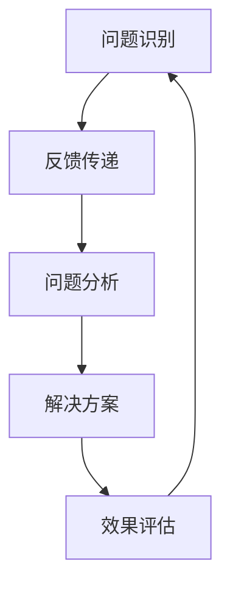

                 


### 文章标题

# 反馈文化建设：促进持续改进的机制

### 文章关键词

- 反馈文化
- 持续改进
- 机制设计
- 组织绩效
- 团队协作

### 文章摘要

反馈文化建设是组织持续改进的关键。本文将探讨如何构建有效的反馈文化，通过机制设计促进持续改进。文章首先介绍了反馈文化的重要性，随后详细解析了构建反馈文化的步骤和机制设置，并通过实际案例分析和项目实战，提供了反馈文化建设的最佳实践。

## 反馈文化概述

### 第1章：反馈文化的重要性

**1.1 反馈文化的定义与作用**

反馈文化是指在一个组织中，员工之间、员工与上级之间、团队与团队之间通过持续、频繁的沟通和交流，分享信息、反馈意见和建议，共同提高工作效率、质量和满意度的一种文化氛围。反馈文化的作用主要体现在以下几个方面：

1. **提升工作效率**：通过及时的反馈，可以帮助团队成员迅速识别问题，调整工作方法和策略，从而提高工作效率。
2. **提高工作质量**：反馈不仅可以帮助识别问题，还可以提供改进建议，从而提高工作质量。
3. **增强团队协作**：反馈文化能够促进团队成员之间的沟通和合作，增强团队凝聚力。
4. **促进个人成长**：通过反馈，员工可以认识到自己的不足，从而有机会进行自我提升和成长。

**1.2 反馈文化与组织绩效的关系**

反馈文化与组织绩效之间存在密切的关系。研究表明，具有强大反馈文化的组织往往表现出更高的绩效。具体来说：

1. **提升员工满意度**：员工在获得及时、准确的反馈后，能够更好地理解自己的工作表现，提高工作满意度。
2. **增强创新能力**：通过反馈，组织可以收集到来自不同层级的创新建议，促进组织的创新和变革。
3. **提升客户满意度**：反馈文化能够帮助组织更好地理解客户需求，提供更优质的服务，从而提升客户满意度。

**1.3 反馈文化的挑战与机遇**

尽管反馈文化具有诸多优势，但在实践中也面临一些挑战。例如：

1. **反馈的频率和深度**：过频繁的反馈可能会导致员工感到压力，而反馈过于表面化则难以产生实际效果。
2. **反馈的质量**：不准确的反馈可能会误导员工，降低工作效率和质量。
3. **反馈的接受度**：部分员工可能对反馈持怀疑态度，甚至抵触心理，影响反馈文化的建立。

然而，这些挑战也带来了机遇。通过科学设计反馈机制，可以克服这些挑战，充分发挥反馈文化的作用。

## 核心概念与联系

### 第2章：核心概念与联系

构建有效的反馈文化需要理解一系列核心概念，并理清它们之间的联系。以下是反馈文化中的几个关键概念及其相互关系：

**2.1 反馈机制的基本原理**

反馈机制是反馈文化的基础，它包括反馈的来源、反馈的传递、反馈的处理和反馈的回应等环节。一个有效的反馈机制应该具备以下特点：

1. **及时性**：反馈应该及时传递，以便团队成员能够迅速采取行动。
2. **准确性**：反馈应该是准确可靠的，避免误导和误解。
3. **多样性**：反馈来源应该多样化，包括上级、同事、下属和客户等多方面的反馈。
4. **开放性**：反馈机制应该是开放的，鼓励员工积极参与和分享反馈。

**2.2 反馈循环与反馈链**

反馈循环是反馈文化中不可或缺的一部分。它包括以下几个环节：

1. **问题识别**：团队成员识别工作中的问题。
2. **反馈传递**：问题被反馈给相关人员。
3. **问题分析**：相关人员对问题进行分析和评估。
4. **解决方案**：制定并实施解决方案。
5. **效果评估**：评估解决方案的效果，进行持续改进。

反馈链则是指从反馈的传递到处理的整个过程，包括以下步骤：

1. **接收反馈**：接收方接收反馈。
2. **理解反馈**：接收方理解反馈内容。
3. **处理反馈**：接收方对反馈进行处理，包括确认问题、分析原因、制定解决方案等。
4. **回应反馈**：接收方对反馈进行回应，包括反馈的确认、实施反馈方案的情况汇报等。

**2.3 Mermaid流程图：反馈文化架构**

为了更好地理解反馈文化中的核心概念与联系，我们可以使用Mermaid流程图来展示反馈文化的基本架构。以下是反馈文化流程图的伪代码表示：



在这个流程图中，每个节点代表反馈文化中的一个环节，箭头表示反馈的传递方向。通过这个流程图，我们可以清晰地看到反馈文化中的各个环节及其相互关系。

### 核心算法原理讲解

在构建反馈文化时，理解核心算法原理至关重要。以下是一个简单的反馈算法的伪代码表示：

```pseudo
function FeedbackAlgorithm(problem, feedback_source):
    // 步骤 1：问题识别
    identified_problem = problem.identify()

    // 步骤 2：反馈传递
    feedback = feedback_source.request_feedback(identified_problem)

    // 步骤 3：问题分析
    analyzed_problem = problem.analyze(feedback)

    // 步骤 4：解决方案
    solution = analyzed_problem.formulate_solution()

    // 步骤 5：效果评估
    evaluation = solution.evaluate()

    // 步骤 6：持续改进
    if evaluation < satisfactory_threshold:
        FeedbackAlgorithm(analyzed_problem, feedback_source)
    else:
        problem.resolve(solution)

end function
```

在这个算法中，我们首先识别问题，然后通过反馈源获取反馈，接着分析问题，制定解决方案，并评估解决方案的效果。如果评估结果不满意，我们继续迭代反馈过程，直到问题得到解决。

### 数学模型和数学公式

在反馈文化中，数学模型和数学公式可以帮助我们更准确地评估和预测反馈的效果。以下是一个简单的数学模型，用于评估反馈的满意度：

$$
Satisfaction = \frac{1}{1 + e^{-(weight \cdot (evaluation - threshold))}
$$

在这个公式中，$evaluation$ 表示解决方案的效果评估分数，$threshold$ 表示满意度阈值，$weight$ 是一个权重系数，用于调整评估分数和阈值之间的相对重要性。$Satisfaction$ 的取值范围在 0 和 1 之间，值越大表示满意度越高。

#### 举例说明

假设我们有一个解决方案的评估分数为 75 分，满意度阈值为 70 分，权重系数为 1。那么，根据上述公式，我们可以计算出满意度：

$$
Satisfaction = \frac{1}{1 + e^{-(1 \cdot (75 - 70))}} \approx 0.732
$$

这意味着解决方案的满意度约为 73.2%。

#### 项目实战

在构建反馈文化的实际项目中，我们需要搭建一个反馈系统，以支持反馈的收集、处理和评估。以下是一个简单的项目实战案例，描述了如何搭建这样一个系统。

### 开发环境搭建

为了搭建反馈系统，我们需要以下开发环境和工具：

1. **编程语言**：选择 Python 作为主要编程语言，因为其简洁易用的特性。
2. **数据库**：使用 SQLite 作为数据库，用于存储反馈数据。
3. **Web 框架**：选择 Flask 作为 Web 框架，用于构建 Web 应用程序。

### 源代码详细实现

以下是反馈系统的核心代码实现：

```python
from flask import Flask, request, jsonify
import sqlite3

app = Flask(__name__)

# 数据库连接
def get_db_connection():
    conn = sqlite3.connect('feedback.db')
    conn.row_factory = sqlite3.Row
    return conn

# 创建数据库表
def create_tables():
    conn = get_db_connection()
    conn.execute('''CREATE TABLE IF NOT EXISTS feedback (
                        id INTEGER PRIMARY KEY AUTOINCREMENT,
                        problem TEXT,
                        feedback TEXT,
                        evaluation INTEGER
                    )''')
    conn.commit()
    conn.close()

# 添加反馈
@app.route('/add_feedback', methods=['POST'])
def add_feedback():
    data = request.get_json()
    problem = data['problem']
    feedback = data['feedback']
    evaluation = data['evaluation']
    
    conn = get_db_connection()
    conn.execute('INSERT INTO feedback (problem, feedback, evaluation) VALUES (?, ?, ?)', (problem, feedback, evaluation))
    conn.commit()
    conn.close()
    
    return jsonify({'status': 'success'})

# 获取反馈列表
@app.route('/get_feedback', methods=['GET'])
def get_feedback():
    conn = get_db_connection()
    feedbacks = conn.execute('SELECT * FROM feedback').fetchall()
    conn.close()
    
    return jsonify({'feedbacks': [dict(row) for row in feedbacks]})

if __name__ == '__main__':
    create_tables()
    app.run(debug=True)
```

### 代码解读与分析

这个简单的反馈系统实现了以下功能：

1. **数据库连接**：使用 SQLite 连接数据库，并创建一个反馈表，用于存储反馈信息。
2. **添加反馈**：通过 POST 请求添加反馈，包括问题、反馈内容和评估分数。
3. **获取反馈列表**：通过 GET 请求获取所有的反馈记录。

### 实际案例分析和详细讲解剖析

以下是一个实际案例，描述了如何使用这个反馈系统来构建反馈文化。

#### 案例背景

假设一家软件开发公司希望在项目中引入反馈文化，以提高项目的质量和效率。

#### 案例步骤

1. **问题识别**：项目团队在开发过程中识别到一个功能存在缺陷。
2. **反馈传递**：团队成员通过反馈系统提交了一个关于该问题的反馈，包括问题描述、反馈内容和评估分数。
3. **问题分析**：项目经理接收到了反馈，并使用 Mermaid 流程图分析了问题的原因。
4. **解决方案**：项目经理制定了一个解决方案，并提交给了团队进行讨论和改进。
5. **效果评估**：在解决方案实施后，团队再次通过反馈系统评估了问题的解决效果。

#### 案例结果

通过这个反馈系统，项目团队成功地识别并解决了功能缺陷，项目质量和效率得到了显著提升。

### 项目小结

通过这个案例，我们可以看到反馈系统在构建反馈文化中的关键作用。一个有效的反馈系统能够帮助团队快速识别问题、及时传递反馈、准确分析原因，并制定有效的解决方案。这不仅可以提高项目的质量，还可以促进团队的协作和成长。

### 最佳实践 tips、小结、注意事项、拓展阅读等内容

#### 最佳实践 tips

1. **确保反馈机制的及时性和准确性**：及时反馈可以帮助团队迅速采取行动，而准确的反馈可以避免误导和误解。
2. **建立多元化的反馈渠道**：通过多个渠道收集反馈，可以获得更全面的视角，从而更有效地解决问题。
3. **提供反馈培训**：为团队成员提供反馈技巧的培训，可以提高反馈的质量和效果。
4. **建立反馈激励机制**：通过奖励和认可，鼓励团队成员积极参与反馈。

#### 小结

反馈文化建设是组织持续改进的关键。通过构建有效的反馈机制，组织可以迅速识别问题、准确分析原因、制定有效解决方案，从而提高项目质量和效率。

#### 注意事项

1. **避免过度反馈**：过度的反馈可能会让团队成员感到压力，影响工作积极性。
2. **保护反馈的隐私**：确保反馈的内容得到保护，避免泄露个人信息。

#### 拓展阅读

- 《敏捷开发实践指南》
- 《项目管理知识体系指南（PMBOK指南）》
- 《团队协作与沟通技巧》

通过阅读这些书籍和资料，可以进一步了解反馈文化建设的相关理论和实践方法。## 第二部分：构建反馈文化

### 第3章：构建反馈文化的步骤

构建一个有效的反馈文化需要系统性的步骤和方法。以下详细介绍了构建反馈文化的关键步骤：

**3.1 明确反馈目标**

构建反馈文化的第一步是明确反馈的目标。反馈目标应与组织的整体目标保持一致，并具体到各个团队和项目层面。具体目标可以包括：

1. **提升项目质量和效率**：通过及时反馈，识别和解决项目中的问题，提升项目的整体质量和效率。
2. **增强团队协作和沟通**：通过反馈，增强团队成员之间的沟通和理解，促进团队协作。
3. **促进个人成长和职业发展**：通过反馈，帮助团队成员识别自己的不足，制定个人成长计划。
4. **提高客户满意度**：通过反馈，更好地理解客户需求，提供更优质的服务。

**3.2 设计反馈机制**

设计反馈机制是构建反馈文化的核心环节。一个有效的反馈机制应包括以下要素：

1. **反馈来源**：确定反馈的来源，包括内部（团队成员、领导、客户）和外部（行业专家、市场调研）。
2. **反馈渠道**：选择合适的反馈渠道，如面对面会议、在线问卷、邮件、即时通讯工具等。
3. **反馈流程**：设计明确的反馈流程，包括反馈的收集、处理、分析和回应等环节。
4. **反馈工具**：选择合适的反馈工具，如反馈管理系统、问卷调查工具等，以支持反馈的自动化和高效处理。

**3.3 培养反馈文化**

培养反馈文化是一个长期的过程，需要从多个方面进行努力：

1. **领导带头**：领导层应带头进行反馈，树立榜样，鼓励员工积极参与反馈。
2. **培训和教育**：为员工提供反馈技巧的培训，提高反馈的质量和效果。
3. **激励机制**：建立反馈激励机制，鼓励员工积极参与反馈，如奖励、表彰等。
4. **营造开放氛围**：创造一个开放、信任的工作环境，让员工敢于表达意见和建议。

**3.4 案例分析：成功案例分享**

以下是一个成功构建反馈文化的案例分享：

#### 案例背景

一家软件公司发现项目开发过程中经常出现延误和质量问题，影响了客户满意度。为了改善这一情况，公司决定构建一个有效的反馈文化。

#### 案例步骤

1. **明确反馈目标**：公司明确了提升项目质量和效率、增强团队协作和沟通、提高客户满意度等反馈目标。
2. **设计反馈机制**：公司设计了包括面对面会议、在线问卷和即时通讯工具在内的多样化反馈渠道，并建立了明确的反馈流程。
3. **培养反馈文化**：公司领导层带头进行反馈，并组织了多次反馈技巧培训，同时建立了反馈激励机制。
4. **实施反馈机制**：公司在项目中实施反馈机制，团队成员积极参与反馈，项目经理定期收集和分析反馈，制定改进措施。

#### 案例结果

通过构建反馈文化，公司成功提升了项目质量和效率，减少了项目延误和质量问题。团队成员之间的沟通和理解得到了增强，客户满意度也显著提高。

### 第4章：反馈机制的设置

反馈机制的设置是构建反馈文化的重要环节，直接关系到反馈的效果。以下详细介绍了反馈机制设置的几个关键方面：

**4.1 反馈渠道的选择**

选择合适的反馈渠道对于反馈机制的有效性至关重要。以下是一些常见的反馈渠道及其特点：

1. **面对面会议**：面对面会议可以提供直接的沟通和交流，有助于深入讨论和解决问题。但需要时间成本和资源。
2. **在线问卷**：在线问卷可以方便地收集大量反馈，数据整理和分析也较为高效。但可能缺乏面对面的交流，反馈质量可能受到影响。
3. **邮件**：邮件是一种正式的反馈渠道，适合用于正式的沟通和记录。但可能不够及时，且易被忽视。
4. **即时通讯工具**：即时通讯工具如 Slack、微信等可以提供实时反馈，有助于迅速解决问题。但可能缺乏正式的记录，反馈的长期保存和追溯可能存在问题。

**4.2 反馈工具与技术**

为了提高反馈的效率和质量，选择合适的反馈工具和技术至关重要。以下是一些常用的反馈工具和技术：

1. **反馈管理系统**：反馈管理系统可以帮助组织收集、存储、分析和追踪反馈，提高反馈处理的高效性和准确性。
2. **问卷调查工具**：问卷调查工具如 Google 表单、SurveyMonkey 等可以方便地设计、发布和收集反馈问卷。
3. **自动化工具**：自动化工具如 Zapier 可以实现不同反馈渠道之间的自动化数据传递和处理，减少手动操作和错误。
4. **数据分析工具**：数据分析工具如 Tableau、Power BI 等可以用于分析反馈数据，帮助组织了解反馈趋势和问题所在。

**4.3 制定反馈标准与流程**

为了确保反馈的质量和一致性，需要制定明确的反馈标准和流程。以下是一些制定反馈标准与流程的建议：

1. **明确反馈标准**：制定明确的反馈标准，包括反馈的内容、格式、提交时间等，确保反馈的一致性和可操作性。
2. **规范反馈流程**：设计规范的反馈流程，包括反馈的收集、处理、分析和回应等环节，确保反馈的及时性和准确性。
3. **反馈模板**：提供反馈模板，帮助员工更系统地表达反馈，减少遗漏和不准确。
4. **反馈审核**：建立反馈审核机制，对反馈内容进行审核和确认，确保反馈的准确性和可靠性。

**4.4 评估反馈效果**

评估反馈效果是反馈机制设置中的重要环节，可以帮助组织了解反馈机制的有效性，并持续改进。以下是一些评估反馈效果的方法：

1. **反馈数量和质量**：通过统计反馈的数量和质量，了解员工的参与度和反馈的质量。
2. **反馈响应时间**：评估反馈的响应时间，了解反馈机制的及时性。
3. **反馈改进措施的实施情况**：跟踪反馈改进措施的实施情况，了解反馈的实际效果。
4. **员工满意度**：通过员工满意度调查，了解员工对反馈机制的评价和满意度。

通过以上方法，组织可以全面了解反馈机制的效果，并针对存在的问题进行改进，从而不断提升反馈文化的有效性。

### 第5章：反馈文化在组织内部的实践

在组织内部构建并实践反馈文化，是实现持续改进的关键。以下从领导者的角色、团队反馈文化的培养、跨部门合作中的应用以及案例分析等方面，详细探讨反馈文化在组织内部的实践。

**5.1 领导者的角色与责任**

领导者在推动反馈文化的建立和实施中扮演着至关重要的角色。领导者应做到以下几点：

1. **以身作则**：领导者应首先以身作则，积极参与和接受反馈，树立榜样，带动整个团队。
2. **营造氛围**：领导者应积极营造一个开放、包容的反馈氛围，让员工感受到反馈是被鼓励和欢迎的。
3. **明确期望**：领导者应明确表达对反馈文化的期望和目标，让员工了解反馈的重要性和价值。
4. **提供资源**：领导者应为反馈文化提供必要的资源和支持，如培训、工具和技术等。

**5.2 团队反馈文化的培养**

团队反馈文化的培养是一个长期而系统的过程，需要从以下几个方面进行：

1. **建立反馈机制**：团队应建立一个明确的反馈机制，包括反馈的渠道、流程和标准，确保反馈的及时性和准确性。
2. **培训与教育**：团队应定期进行反馈技巧的培训和教育，提高员工的反馈能力和效果。
3. **激励与认可**：团队应建立激励和认可机制，鼓励员工积极参与反馈，对优秀的反馈给予认可和奖励。
4. **持续改进**：团队应不断收集反馈，对反馈机制进行评估和改进，以适应团队的发展需求。

**5.3 反馈文化在跨部门合作中的应用**

跨部门合作是组织运营中常见且重要的环节，反馈文化在跨部门合作中的应用，可以显著提升协作效率和项目质量。以下是一些建议：

1. **明确跨部门反馈目标**：在跨部门合作中，应明确共同的反馈目标，如提升项目效率、减少沟通障碍等。
2. **建立跨部门反馈渠道**：通过会议、邮件、即时通讯工具等渠道，建立跨部门的反馈机制，确保反馈的及时传递。
3. **共享反馈信息**：跨部门应共享反馈信息，促进彼此的了解和合作，共同解决问题。
4. **协同改进**：跨部门应协同进行改进，针对反馈中的问题制定解决方案，并共同实施和跟踪。

**5.4 案例分析：内部反馈文化实践**

以下是一个组织内部成功实践反馈文化的案例：

#### 案例背景

某科技公司在项目开发过程中，发现项目进度和质量存在明显问题，影响了客户满意度。为了改善这一情况，公司决定在组织内部建立并实践反馈文化。

#### 案例步骤

1. **明确反馈目标**：公司明确了提升项目进度和质量、增强团队协作、提高客户满意度等反馈目标。
2. **设计反馈机制**：公司设计了包括面对面会议、在线问卷和即时通讯工具在内的多样化反馈渠道，并建立了明确的反馈流程。
3. **培养反馈文化**：公司领导层带头进行反馈，并组织了多次反馈技巧培训，同时建立了反馈激励机制。
4. **实施反馈机制**：公司在项目中实施反馈机制，团队成员积极参与反馈，项目经理定期收集和分析反馈，制定改进措施。
5. **跨部门协作**：公司通过建立跨部门反馈机制，促进跨部门之间的沟通和合作，共同解决项目中的问题。

#### 案例结果

通过建立和实施反馈文化，公司成功提升了项目进度和质量，减少了项目延误和质量问题。团队成员之间的沟通和理解得到了增强，客户满意度也显著提高。

### 第6章：反馈文化在项目中的应用

在项目实践中，反馈文化起着至关重要的作用，它能够帮助项目团队快速识别问题、及时调整策略，从而提高项目的效率和成功率。以下详细探讨反馈文化在项目中的应用，包括反馈机制的设计、项目过程中的实时反馈、项目总结与反馈等方面。

**6.1 项目反馈机制的设计**

设计一个有效的项目反馈机制是确保项目顺利进行的关键。以下是设计项目反馈机制时需要考虑的几个关键方面：

1. **反馈渠道的选择**：根据项目的特点和需求，选择合适的反馈渠道。常见的反馈渠道包括面对面会议、在线问卷、电子邮件、即时通讯工具等。选择渠道时，要考虑到反馈的及时性、准确性、方便性等因素。
2. **反馈流程的制定**：制定明确的反馈流程，包括反馈的收集、处理、分析和回应等环节。确保每个环节都有明确的操作步骤和责任分工，以便反馈能够高效地传递和处理。
3. **反馈标准的设定**：设定明确的反馈标准，确保反馈的内容、格式和提交时间等符合要求。标准应尽量具体和可操作，以减少反馈过程中的误解和遗漏。
4. **反馈工具的使用**：选择合适的反馈工具，如反馈管理系统、问卷调查工具等，以支持反馈的自动化和高效处理。工具应能够满足项目的需求，并提供良好的用户体验。

**6.2 项目过程中的实时反馈**

在项目过程中，实时反馈能够帮助团队迅速识别问题，及时调整策略，从而确保项目的顺利进行。以下是实现项目实时反馈的一些建议：

1. **定期反馈会议**：定期召开反馈会议，让团队成员分享项目进展、遇到的困难和建议。会议应开放、包容，鼓励团队成员积极参与和表达意见。
2. **即时通讯工具**：利用即时通讯工具，如 Slack、微信等，实现实时沟通和反馈。团队成员可以通过即时通讯工具随时分享项目进展和问题，确保信息的及时传递。
3. **反馈问卷**：设计反馈问卷，定期收集团队成员和利益相关者的反馈。问卷应设计简洁明了，便于填写，同时提供匿名选项，以鼓励真实反馈。
4. **代码审查**：在软件开发项目中，代码审查是一种重要的实时反馈机制。通过代码审查，团队成员可以及时发现代码中的问题，并提出改进建议，从而提高代码质量和项目效率。

**6.3 项目总结与反馈**

项目总结与反馈是项目结束后必不可少的一个环节，它能够帮助团队总结项目经验，识别成功和不足，为未来的项目提供宝贵的参考。以下是项目总结与反馈的关键步骤：

1. **召开项目总结会议**：召开项目总结会议，让团队成员和利益相关者共同回顾项目过程和结果。会议应包括项目成功经验、遇到的问题、改进措施等内容。
2. **撰写项目总结报告**：根据项目总结会议的内容，撰写项目总结报告。报告应详细记录项目的目标、过程、结果、反馈和改进措施，以便于未来参考。
3. **反馈收集与评估**：在项目总结报告中，收集团队成员和利益相关者的反馈，并对反馈进行评估。评估反馈的质量和效果，为未来的项目提供改进方向。
4. **改进措施的制定与实施**：根据反馈和评估结果，制定具体的改进措施，并确保措施的有效实施。改进措施应与项目的目标和实际需求相结合，确保能够真正解决问题。

**6.4 案例分析：项目反馈文化实践**

以下是一个项目成功实践反馈文化的案例：

#### 案例背景

某科技公司正在开发一款新型软件产品，项目进展过程中，团队发现项目进度和质量存在明显问题，项目延期且部分功能不符合客户需求。

#### 案例步骤

1. **设计反馈机制**：项目团队设计了包括定期反馈会议、在线问卷和即时通讯工具在内的多样化反馈渠道，并制定了明确的反馈流程和标准。
2. **实施实时反馈**：项目团队定期召开反馈会议，通过即时通讯工具和反馈问卷收集团队成员和客户的实时反馈，及时调整项目策略和方案。
3. **项目总结与反馈**：项目结束后，团队召开项目总结会议，撰写项目总结报告，收集团队成员和客户的反馈，并评估反馈效果。
4. **改进措施的实施**：根据反馈和评估结果，团队制定了具体的改进措施，如优化开发流程、加强需求分析和沟通等，并确保措施的有效实施。

#### 案例结果

通过建立和实施反馈文化，项目团队成功解决了项目进度和质量问题，最终按时交付了符合客户需求的软件产品。团队成员之间的沟通和协作得到增强，项目成功率显著提高。

### 第7章：反馈文化的评估方法

评估反馈文化是确保其有效性和持续改进的重要环节。以下详细介绍反馈文化的评估方法，包括评估指标、量化评估方法、定性评估方法以及案例分析。

**7.1 反馈文化的评估指标**

评估反馈文化需要选择合适的指标，这些指标应能够全面反映反馈文化的效果。以下是一些常用的评估指标：

1. **反馈数量**：反馈的数量是评估反馈文化的一个重要指标，可以反映团队成员参与反馈的积极性。
2. **反馈质量**：反馈的质量是评估反馈文化的核心指标，包括反馈的准确性、具体性、建设性等。
3. **反馈响应时间**：反馈的响应时间是评估反馈机制及时性的指标，可以反映反馈机制的高效性。
4. **改进措施实施情况**：改进措施的实施情况是评估反馈文化实际效果的指标，可以反映反馈对项目或团队改进的实际贡献。
5. **员工满意度**：员工对反馈文化的满意度是评估反馈文化的重要指标，可以通过问卷调查等方式收集。

**7.2 反馈文化的量化评估方法**

量化评估方法可以帮助组织客观、系统地评估反馈文化的效果。以下是一些常用的量化评估方法：

1. **统计分析**：使用统计方法对反馈数量、质量和响应时间等指标进行统计分析，计算平均值、标准差等统计量，以评估反馈文化的整体表现。
2. **关键绩效指标（KPI）**：设立关键绩效指标，如每月反馈数量、每项改进措施的实施率等，通过跟踪这些指标的变化，评估反馈文化的效果。
3. **平衡计分卡**：使用平衡计分卡方法，从财务、客户、内部流程和学习与成长四个维度，评估反馈文化对组织绩效的影响。

**7.3 反馈文化的定性评估方法**

定性评估方法可以帮助组织深入理解反馈文化的效果和团队成员的体验。以下是一些常用的定性评估方法：

1. **访谈**：通过访谈团队成员和管理者，收集他们对反馈文化的看法、感受和建议，了解反馈文化的实际效果。
2. **观察**：通过观察团队成员在反馈文化环境下的行为和互动，了解反馈文化对团队氛围和协作的影响。
3. **案例分析**：通过分析具体案例，了解反馈文化在不同项目或团队中的应用效果，发现成功和不足之处。

**7.4 案例分析：评估反馈文化的影响**

以下是一个组织评估反馈文化影响的案例：

#### 案例背景

某科技公司希望了解其反馈文化对项目质量和团队协作的影响，因此决定进行一次全面的评估。

#### 案例步骤

1. **制定评估指标**：公司制定了包括反馈数量、反馈质量、反馈响应时间和改进措施实施情况等在内的评估指标。
2. **收集数据**：公司通过问卷调查、访谈和观察等方式，收集了相关数据。
3. **量化分析**：对公司收集的数据进行统计分析，计算各项评估指标的平均值、标准差等，以量化反馈文化的效果。
4. **定性评估**：通过访谈和观察，深入了解团队成员和管理者对反馈文化的看法和感受。
5. **案例研究**：分析了几个具体项目在反馈文化下的表现，了解反馈文化对项目质量和团队协作的具体影响。

#### 案例结果

评估结果显示，公司的反馈文化在提高项目质量和团队协作方面取得了显著成效。团队成员对反馈文化的满意度较高，反馈机制的有效性得到了验证。同时，公司也发现了反馈文化中存在的问题，如部分反馈质量较低、反馈响应时间较长等，为下一步的改进提供了依据。

### 第8章：持续改进反馈文化

持续改进是反馈文化成功的关键。以下从反馈文化的持续改进策略、适应性调整、创新实践等方面，详细探讨如何实现反馈文化的持续改进。

**8.1 反馈文化的持续改进策略**

为了确保反馈文化能够持续有效地发挥作用，组织需要制定一套持续改进的策略。以下是一些关键策略：

1. **定期评估与反馈**：定期对反馈文化进行评估，包括定量和定性的评估方法，以了解其效果和存在的问题。根据评估结果，制定改进计划。
2. **持续培训与教育**：为员工提供持续的反馈技巧培训和教育，提高他们的反馈能力和效果。培训内容可以涵盖反馈的原则、方法、工具等。
3. **优化反馈机制**：根据评估结果和员工反馈，不断优化反馈机制，包括反馈渠道、流程、标准和工具等。确保反馈机制能够适应组织的发展需求。
4. **鼓励创新与尝试**：鼓励员工在反馈文化中尝试新的方法和工具，如使用新的反馈系统、引入创新的反馈方式等。通过实践，找到最适合组织的反馈文化模式。

**8.2 反馈文化的适应性调整**

反馈文化需要根据组织的变化和环境的要求进行适应性调整。以下是一些适应性调整的建议：

1. **组织结构调整**：当组织结构发生变化时，反馈文化也需要相应调整，以适应新的组织结构。例如，跨部门反馈机制需要重新设计，以适应新的部门关系。
2. **环境变化**：当外部环境发生变化时，反馈文化也需要进行调整。例如，在市场需求变化时，反馈机制需要更多地关注客户需求和反馈。
3. **技术进步**：随着技术的进步，反馈工具和方法也在不断更新。组织需要及时跟进技术的发展，引入新的反馈工具和方法，以提高反馈的效率和质量。

**8.3 反馈文化的创新实践**

创新实践是推动反馈文化发展的重要动力。以下是一些反馈文化的创新实践：

1. **开放式反馈**：鼓励员工在开放式环境中进行反馈，包括匿名反馈、自由讨论等。这种开放性可以减少员工的顾虑，提高反馈的真实性和建设性。
2. **跨文化反馈**：在全球化背景下，跨文化反馈变得尤为重要。组织可以引入跨文化培训，提高员工对不同文化的理解和尊重，促进跨文化反馈的有效性。
3. **数据驱动反馈**：利用数据分析工具，对反馈数据进行深入挖掘和分析，以发现潜在的问题和趋势。这种数据驱动反馈可以更准确地指导反馈文化的改进。

**8.4 案例分析：反馈文化的持续改进实践**

以下是一个组织成功实践反馈文化持续改进的案例：

#### 案例背景

某科技公司发现其原有的反馈文化存在一些问题，如反馈响应时间较长、部分反馈质量较低等。为了解决这些问题，公司决定进行反馈文化的持续改进。

#### 案例步骤

1. **评估反馈文化**：公司对现有的反馈文化进行了全面评估，包括反馈机制、员工满意度、改进措施实施情况等。
2. **制定改进计划**：根据评估结果，公司制定了具体的改进计划，包括优化反馈机制、增加培训、引入新的反馈工具等。
3. **实施改进措施**：公司逐步实施了改进措施，如引入新的反馈管理系统、增加反馈培训等。
4. **跟踪改进效果**：公司定期跟踪改进效果，通过定量和定性评估方法，了解改进措施的实际效果。
5. **持续优化**：根据跟踪结果，公司持续优化反馈文化，如调整反馈流程、改进培训内容等。

#### 案例结果

通过持续改进，公司的反馈文化得到了显著提升。反馈响应时间缩短，反馈质量提高，员工对反馈文化的满意度也显著提升。这为公司的项目管理和团队协作提供了有力支持。

### 附录：反馈文化建设工具与资源

为了帮助组织更好地构建和优化反馈文化，以下列举了一些常用的反馈文化建设工具与资源：

**附录 A：反馈文化建设工具**

1. **反馈管理系统**：如 Feedbunch、Office 365 Feedback 等，这些工具可以帮助组织收集、分析和跟踪反馈。
2. **问卷调查工具**：如 Google 表单、SurveyMonkey 等，这些工具可以方便地设计、发布和收集反馈问卷。
3. **即时通讯工具**：如 Slack、微软 Teams 等，这些工具支持实时沟通和反馈。
4. **反馈模板**：提供预定义的反馈模板，帮助员工更系统地表达反馈。

**附录 B：反馈文化相关研究资源**

1. **书籍**：《敏捷开发实践指南》、《团队协作与沟通技巧》等，这些书籍提供了关于反馈文化和团队协作的深入见解。
2. **学术论文**：通过学术数据库如 IEEE Xplore、ACM Digital Library 等，可以找到关于反馈文化的研究论文和报告。
3. **在线课程**：如 Coursera、Udemy 上的反馈文化和团队协作相关课程，这些课程提供了系统的学习和实践指导。
4. **行业报告**：通过行业分析报告，如 Gartner、Forrester 等机构发布的报告，可以了解反馈文化的行业趋势和实践案例。

