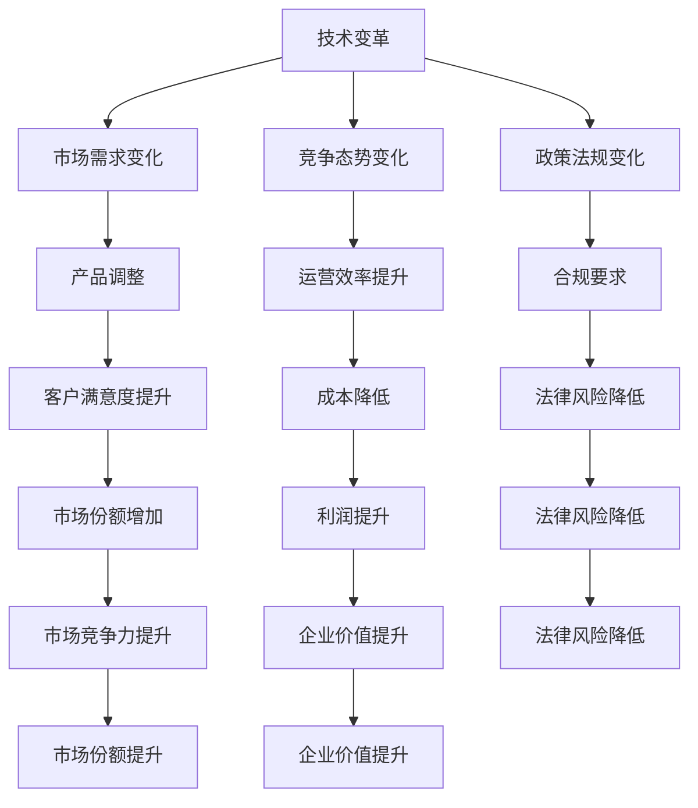

                 

### 文章标题

《变革管理：引领团队适应新环境》

### 关键词

变革管理、团队适应、组织变革、领导力、个人发展、案例研究、数字化变革

### 摘要

本文旨在探讨变革管理在引领团队适应新环境中的重要作用。文章首先定义了变革管理的概念，并阐述了其在组织发展中的重要性。接着，分析了组织变革的驱动因素，详细介绍了变革管理的三个阶段：准备工作、启动阶段、实施阶段和巩固阶段。随后，文章探讨了团队建设与沟通策略，强调了领导力在变革管理中的关键作用，以及个人如何在变革中提升自我。通过案例研究，本文总结了成功与失败的变革管理经验，并为未来的变革管理趋势提供了展望。文章最后，还提供了变革管理工具与资源的附录，以供读者参考。

## 第一部分：变革管理的理论基础

### 第1章：变革管理的概念与重要性

#### 1.1 变革管理的定义

变革管理是一种系统化的方法和过程，旨在帮助组织在面临外部环境变化时，实现平稳过渡和持续发展。它涉及识别和评估变化的需求，制定策略和计划，实施变革措施，以及监控变革效果，以确保组织能够适应新环境。

在IT行业中，变革管理尤为重要。随着技术的快速发展，企业需要不断更新其技术架构和业务流程，以保持竞争力。变革管理在这个过程中起到了关键作用，它帮助企业有效应对技术变革带来的挑战，确保团队能够顺利适应新环境。

#### 1.2 变革管理的重要性

变革管理的重要性体现在以下几个方面：

1. **提升组织竞争力**：通过变革管理，组织能够及时调整战略和流程，以适应市场变化，从而在竞争中保持领先地位。
2. **提高员工满意度**：有效的变革管理可以帮助员工更好地理解变革的必要性，减少因变革带来的不安和抵触情绪，提高员工的工作积极性和满意度。
3. **降低变革风险**：变革管理提供了一个系统化的框架，帮助组织识别和评估变革过程中的潜在风险，并采取相应的措施进行规避或缓解。
4. **促进知识转移**：变革管理过程中，组织内部的交流与合作得到加强，有助于知识共享和转移，提高整个组织的创新能力。

#### 1.3 变革管理的核心原则

变革管理的核心原则包括以下几个方面：

1. **以客户为中心**：变革的最终目的是满足客户需求，因此，在变革过程中，必须始终关注客户需求的变化，并根据客户需求进行相应调整。
2. **全员参与**：变革的成功离不开全体员工的参与和支持，因此，需要建立开放、透明的沟通机制，让员工充分了解变革的必要性，鼓励他们积极参与变革。
3. **渐进式变革**：变革应该是一个渐进的过程，而不是一蹴而就。通过逐步推进变革，可以降低变革带来的风险和阻力。
4. **领导力**：领导者在变革管理中扮演着关键角色。他们需要具备远见卓识，善于沟通和激励团队，以推动变革的顺利进行。
5. **持续改进**：变革不是一次性的活动，而是一个持续的过程。组织需要不断审视和优化变革措施，以适应不断变化的环境。

### 第2章：组织变革的驱动因素

#### 2.1 技术变革

技术变革是组织变革的主要驱动因素之一。随着科技的快速发展，新技术、新工具和新平台不断涌现，企业需要不断更新其技术架构和业务流程，以保持竞争力。技术变革可能涉及以下几个方面：

1. **硬件升级**：如服务器升级、网络设备更新等。
2. **软件升级**：如操作系统、数据库、开发工具等。
3. **云计算与大数据**：云计算和大数据技术的发展，为企业提供了更灵活、高效的数据存储和处理能力。
4. **物联网（IoT）**：物联网技术的应用，使得企业能够更好地整合内部和外部的数据，实现智能化管理。

#### 2.2 市场变革

市场变革是组织变革的另一个重要驱动因素。市场环境的变化，如市场需求、竞争态势、政策法规等，都可能促使企业进行变革。

1. **市场需求变化**：随着消费者需求的变化，企业需要调整产品和服务，以更好地满足市场需求。
2. **竞争加剧**：在竞争激烈的市场环境中，企业需要不断优化其业务流程和运营效率，以降低成本、提高竞争力。
3. **政策法规**：政府出台的新政策、新法规，可能对企业的运营产生重大影响，促使企业进行变革。

#### 2.3 社会变革

社会变革也是影响组织变革的重要因素。社会环境的变化，如文化、教育、价值观等，都可能对企业的运营和管理产生影响。

1. **文化多元化**：随着全球化的发展，企业需要面对多元化的文化背景，这可能影响到企业的管理方式和团队协作。
2. **教育普及**：随着教育水平的提升，员工的专业知识和技能也在不断提高，企业需要不断更新培训计划，以适应员工的发展需求。
3. **价值观变化**：社会价值观的变化，如对社会责任和可持续发展的关注，可能促使企业重新审视其业务模式和运营策略。

#### 2.4 变革的驱动因素分析

为了更好地理解组织变革的驱动因素，我们可以使用Mermaid流程图来展示各因素之间的关系：

从流程图中可以看出，各个驱动因素相互关联，共同推动组织进行变革。企业需要综合考虑这些因素，制定相应的变革策略，以实现持续发展。

### 第3章：变革管理的过程

变革管理的过程可以分为以下几个阶段：

#### 3.1 变革的准备工作

在变革准备工作阶段，组织需要完成以下几个任务：

1. **评估变革需求**：通过市场调研、员工访谈、数据分析等方法，评估组织面临的变革需求，明确变革的目标和方向。
2. **制定变革计划**：根据评估结果，制定详细的变革计划，包括变革的范围、时间表、资源配置等。
3. **组建变革团队**：组建一支由高层管理人员、相关部门负责人和专家组成的变革团队，负责推进变革工作。
4. **建立沟通机制**：建立开放、透明的沟通机制，确保员工了解变革的必要性和重要性，减少因信息不对称导致的误解和抵触。

#### 3.2 变革的启动阶段

在变革启动阶段，组织需要完成以下几个任务：

1. **宣传变革**：通过内部会议、培训、宣传册等方式，向员工宣传变革的必要性和目标，提高员工对变革的认知和支持度。
2. **动员员工**：通过激励措施，如奖励制度、晋升机会等，鼓励员工积极参与变革。
3. **确定变革路线图**：根据变革计划，制定详细的变革路线图，明确各个阶段的任务和时间表。
4. **启动变革项目**：按照变革路线图，启动各个变革项目，逐步推进变革。

#### 3.3 变革的实施阶段

在变革实施阶段，组织需要完成以下几个任务：

1. **监控变革进度**：定期检查变革项目的进展情况，确保按照计划进行。
2. **解决变革中的问题**：在变革过程中，可能会遇到各种问题和挑战，需要及时解决，确保变革的顺利进行。
3. **调整变革策略**：根据实际情况，对变革策略进行调整，以适应新的变化。
4. **强化团队协作**：通过团队建设活动、沟通培训等方式，增强团队协作，提高变革效率。

#### 3.4 变革的巩固阶段

在变革巩固阶段，组织需要完成以下几个任务：

1. **评估变革效果**：对变革效果进行评估，包括对业务指标、员工满意度等方面的评估，以了解变革的成效。
2. **总结变革经验**：总结变革过程中的经验教训，为未来变革提供参考。
3. **巩固变革成果**：通过制定长期发展规划、优化业务流程等方式，巩固变革成果，确保变革的持续性。
4. **持续改进**：根据市场变化和业务需求，持续改进变革措施，以保持组织的竞争力。

### 第二部分：团队适应新环境的策略

#### 第4章：团队建设与沟通策略

#### 4.1 团队建设的重要性

团队建设是组织变革过程中至关重要的一环。一个高效的团队能够更好地应对变革带来的挑战，实现组织的目标。

**团队建设的重要性体现在以下几个方面：**

1. **提高团队凝聚力**：通过团队建设活动，增强团队成员之间的信任和协作，提高团队的凝聚力。
2. **提升团队效率**：团队建设有助于优化团队结构和分工，提高团队的整体工作效率。
3. **促进知识共享**：团队建设可以促进团队成员之间的知识共享和经验交流，提高团队的创新能力和应变能力。
4. **增强员工归属感**：团队建设可以让员工感受到组织的关怀和支持，增强员工的归属感和满意度。

#### 4.2 建立有效的团队沟通机制

有效的团队沟通是团队建设的关键。一个良好的沟通机制可以确保信息的畅通无阻，减少误解和冲突，提高团队的工作效率。

**建立有效的团队沟通机制，需要考虑以下几个方面：**

1. **明确沟通目标**：团队沟通的目标是确保信息的准确传递和有效利用，提高团队的工作效率。
2. **选择合适的沟通方式**：根据沟通内容和目标，选择合适的沟通方式，如面对面交流、邮件、电话、视频会议等。
3. **制定沟通计划**：制定明确的沟通计划，包括沟通的时间、地点、参与人员、沟通内容等，确保沟通的有序进行。
4. **建立反馈机制**：建立反馈机制，让团队成员能够及时了解沟通效果，并对沟通方式进行改进。
5. **培养沟通技能**：通过培训和实践，提高团队成员的沟通技能，确保沟通的顺畅和有效。

#### 4.3 提高团队适应能力

在变革过程中，团队适应能力至关重要。一个具备高适应能力的团队能够迅速调整策略，应对变革带来的挑战。

**提高团队适应能力，可以从以下几个方面入手：**

1. **增强团队灵活性**：通过调整团队结构和分工，提高团队的灵活性和应变能力。
2. **促进知识更新**：鼓励团队成员不断学习新知识和技能，提高团队的创新能力。
3. **加强团队协作**：通过团队建设活动，增强团队成员之间的信任和协作，提高团队的整体适应能力。
4. **建立问题解决机制**：建立高效的问题解决机制，确保团队在面对问题时能够迅速找到解决方案。
5. **培养团队领导力**：培养团队成员的领导力，提高团队的决策能力和执行力。

### 第5章：变革管理中的领导力

#### 5.1 领导者在变革中的作用

领导者在变革管理中扮演着至关重要的角色。他们的决策、行为和沟通能力直接影响变革的成败。

**领导者在变革中的作用包括：**

1. **制定变革策略**：领导者需要根据组织目标和外部环境，制定明确的变革策略，确保变革的方向和目标。
2. **沟通变革愿景**：领导者需要向团队成员清晰地传达变革的愿景和目标，激发他们的积极性和参与度。
3. **激励员工**：领导者需要运用激励手段，如奖励、晋升等，激励员工积极参与变革，提高他们的工作热情。
4. **解决冲突**：在变革过程中，可能会出现各种冲突和问题，领导者需要及时解决，确保变革的顺利进行。
5. **监督变革进展**：领导者需要定期检查变革的进展情况，及时调整变革策略，确保变革目标的实现。

#### 5.2 领导者如何引领团队适应新环境

为了有效引领团队适应新环境，领导者需要具备以下能力：

1. **愿景领导**：领导者需要有远见，能够预见未来的变化，并制定相应的战略和规划。
2. **变革驱动**：领导者需要具备推动变革的能力，敢于冒险，勇于尝试新方法。
3. **激励与支持**：领导者需要激励团队成员，为他们提供支持和资源，帮助他们适应新环境。
4. **沟通能力**：领导者需要具备良好的沟通能力，能够与团队成员建立信任，有效传达变革的愿景和目标。
5. **适应性**：领导者需要具备适应性，能够快速调整策略，应对变革过程中的挑战。

#### 5.3 领导者的变革管理技能培养

为了提高领导者的变革管理技能，组织可以采取以下措施：

1. **培训与发展**：提供变革管理的培训课程，帮助领导者掌握变革管理的理论知识和实践技能。
2. **实践与反馈**：鼓励领导者参与实际变革项目，通过实践锻炼变革管理能力，并根据反馈进行改进。
3. **导师制度**：为领导者配备导师，指导他们在变革管理过程中的困惑和问题，提高他们的变革管理能力。
4. **团队建设**：通过团队建设活动，增强领导者的团队协作和沟通能力，提高他们的领导力。
5. **持续学习**：鼓励领导者持续学习，关注行业动态和变革管理的新趋势，不断更新自己的知识和技能。

### 第6章：变革管理中的个人发展

#### 6.1 个人适应新环境的策略

在变革过程中，个人也需要积极适应新环境，以保持竞争力和发展潜力。

**个人适应新环境的策略包括：**

1. **主动学习**：积极学习新知识和技能，提升自己的专业素养，以适应新环境的要求。
2. **建立人际关系**：通过建立广泛的人际关系网络，获取更多的资源和信息，提高自己的适应能力。
3. **调整心态**：保持积极的心态，面对变革带来的挑战，以乐观的态度应对。
4. **灵活调整**：根据新环境的要求，灵活调整自己的工作方式和行为习惯，提高自己的适应能力。
5. **寻求支持**：在遇到困难时，主动寻求同事、领导或专业人士的帮助，共同解决问题。

#### 6.2 提高个人变革管理能力

为了提高个人的变革管理能力，可以采取以下措施：

1. **自我反思**：定期进行自我反思，总结自己在变革过程中的经验和教训，找出不足之处，并制定改进计划。
2. **参与培训**：参加变革管理的培训课程，学习变革管理的理论知识和实践技能。
3. **实践与反思**：在实际工作中，积极参与变革项目，通过实践锻炼变革管理能力，并根据反馈进行改进。
4. **建立支持网络**：与同事、领导和其他专业人士建立良好的关系，共同探讨变革管理的问题和解决方案。
5. **持续学习**：关注行业动态和变革管理的新趋势，不断更新自己的知识和技能。

#### 6.3 职业生涯规划与变革

在职业生涯规划中，个人需要考虑如何应对变革，以实现职业发展目标。

**职业生涯规划与变革的关系包括：**

1. **明确职业目标**：根据个人兴趣、能力和市场需求，明确自己的职业目标，制定长期和短期的职业发展规划。
2. **适应环境变化**：随着外部环境的变化，个人需要不断调整自己的职业规划，以适应新的市场需求。
3. **提升职业素养**：通过学习和实践，提升自己的专业素养和技能，提高自己的竞争力。
4. **抓住机遇**：在变革中，积极抓住机遇，提升自己的职业地位和收入水平。
5. **持续发展**：在职业生涯中，不断追求自我提升和职业发展，实现人生价值。

### 第7章：案例研究

#### 7.1 成功的变革管理案例

在变革管理中，成功案例为其他组织提供了宝贵的经验和启示。

**成功的变革管理案例包括：**

1. **案例1：某科技公司的数字化转型**：某科技公司通过数字化转型，成功提升了业务效率和竞争力。他们采取了以下措施：
   - 明确数字化转型目标；
   - 制定详细的实施计划；
   - 加强团队协作，提高员工技能；
   - 逐步推进变革，确保平稳过渡。

2. **案例2：某制造企业的精益生产变革**：某制造企业通过实施精益生产，成功降低了成本，提高了产品质量。他们采取了以下措施：
   - 评估变革需求，制定变革计划；
   - 培训员工，提高他们的技能；
   - 实施精益生产工具，优化生产流程；
   - 定期评估变革效果，持续改进。

#### 7.2 失败的变革管理案例

失败的变革管理案例也为其他组织提供了教训。

**失败的变革管理案例包括：**

1. **案例1：某电商企业的客户关系管理变革**：某电商企业试图通过客户关系管理变革提高客户满意度，但最终失败。原因如下：
   - 变革目标不明确；
   - 员工参与度低；
   - 沟通不畅，导致员工对变革理解不一致；
   - 变革过程中缺乏监督和调整，导致变革效果不佳。

2. **案例2：某金融机构的流程优化变革**：某金融机构试图通过流程优化提高运营效率，但最终失败。原因如下：
   - 变革计划过于理想化，未充分考虑到实际情况；
   - 变革过程中缺乏员工参与和支持；
   - 变革措施缺乏系统性，导致变革效果不明显；
   - 变革后未能进行有效的评估和反馈，导致问题未能及时解决。

#### 7.3 从案例中学习变革管理经验

通过分析成功和失败的变革管理案例，我们可以总结出以下经验：

1. **明确变革目标**：在变革管理过程中，必须明确变革的目标，确保变革方向正确。
2. **充分沟通**：确保员工充分了解变革的必要性和目标，提高员工的参与度和支持度。
3. **制定详细计划**：制定详细的变革计划，包括变革的范围、时间表、资源配置等，确保变革的有序进行。
4. **加强团队协作**：建立有效的团队协作机制，提高团队的执行力。
5. **持续监督和调整**：在变革过程中，持续监督和调整变革措施，确保变革目标的实现。
6. **评估变革效果**：在变革结束后，对变革效果进行评估，总结经验教训，为未来变革提供参考。

### 第三部分：变革管理的未来趋势

#### 第8章：数字化时代的变革管理

随着数字技术的飞速发展，数字化已成为时代发展的主流。数字化技术对变革管理产生了深远的影响，为变革管理提供了新的工具和方法。

#### 8.1 数字化技术对变革管理的影响

数字化技术对变革管理的影响主要体现在以下几个方面：

1. **提高变革效率**：数字化技术使得信息传递更加迅速、准确，有助于提高变革的效率。
2. **增强员工参与度**：数字化工具如在线协作平台、虚拟会议等，有助于增强员工的参与度，提高变革的执行力度。
3. **优化变革流程**：数字化技术可以帮助组织优化变革流程，提高变革的透明度和可追溯性。
4. **提高变革监控能力**：数字化工具如数据分析和监控平台，可以实时监控变革的进展情况，帮助组织及时发现问题并采取措施。

#### 8.2 数字化时代的变革管理策略

在数字化时代，组织需要采取以下策略进行变革管理：

1. **加强数字化意识**：组织需要提高员工的数字化意识，让他们了解数字化技术对变革管理的重要性。
2. **提升数字化能力**：组织需要提升员工的数字化能力，包括数据分析和处理、数字化工具使用等。
3. **建立数字化平台**：组织需要建立数字化平台，如在线协作平台、数据监控平台等，为变革管理提供技术支持。
4. **加强数字化培训**：组织需要提供数字化培训，帮助员工掌握数字化工具和技能，提高他们的数字化能力。
5. **注重数据驱动**：在变革管理过程中，注重数据驱动，根据数据分析和反馈调整变革策略，提高变革效果。

#### 8.3 数字化变革管理的挑战与机遇

数字化变革管理既带来了机遇，也面临挑战。

**数字化变革管理的挑战包括：**

1. **技术风险**：数字化技术的不确定性和风险，如数据泄露、系统故障等，可能对变革管理产生不利影响。
2. **员工抵触**：员工可能对数字化变革产生抵触情绪，影响变革的顺利进行。
3. **数据安全**：数字化变革过程中，数据安全和隐私保护是一个重要问题。

**数字化变革管理的机遇包括：**

1. **提高效率**：数字化技术可以帮助组织提高变革效率，降低变革成本。
2. **增强员工参与度**：数字化工具可以增强员工的参与度，提高变革的执行力度。
3. **优化流程**：数字化技术可以帮助组织优化变革流程，提高变革的透明度和可追溯性。
4. **提高监控能力**：数字化工具可以提高变革的监控能力，帮助组织及时发现问题并采取措施。

### 第9章：未来变革管理的趋势

随着外部环境的变化和数字化技术的不断发展，变革管理也在不断演进。未来变革管理将呈现以下趋势：

#### 9.1 变革管理的未来发展

1. **更加强调数据驱动**：未来变革管理将更加注重数据分析和反馈，根据数据驱动变革策略。
2. **更加注重个人发展**：未来变革管理将更加关注个人的发展，帮助员工提升能力和适应新环境。
3. **更加注重可持续性**：未来变革管理将更加注重可持续性，实现短期利益与长期发展的平衡。

#### 9.2 变革管理的新方法

1. **敏捷变革管理**：敏捷变革管理强调快速响应变化，通过迭代和增量方式实现变革。
2. **组织学习**：组织学习强调通过知识共享和团队协作，提高组织的适应能力和创新能力。
3. **变革领导力**：变革领导力强调领导者具备推动变革的能力和素质，通过领导力推动组织变革。

#### 9.3 变革管理的新挑战

1. **数字化风险**：随着数字化技术的应用，变革管理面临数字化风险，如数据安全、系统故障等。
2. **员工抵触**：员工对变革的抵触情绪可能影响变革的顺利进行。
3. **跨文化管理**：全球化背景下，跨文化管理成为变革管理的新挑战。

### 附录

#### 附录 A：变革管理工具与资源

以下是一些常见的变革管理工具和资源：

1. **项目管理工具**：如Jira、Trello等，用于规划和跟踪变革项目。
2. **沟通工具**：如Slack、Microsoft Teams等，用于团队沟通和协作。
3. **数据分析和监控工具**：如Tableau、Google Analytics等，用于分析和监控变革效果。
4. **学习资源**：如在线课程、图书、研讨会等，用于提升变革管理技能。

#### 附录 B：参考文献

1. **《变革管理：如何应对持续变化的世界》**，作者：约翰·P·科特、詹姆斯·L·赫斯克特。
2. **《数字化时代的变革管理》**，作者：托马斯·H·达文波特、罗伊·罗斯。
3. **《敏捷变革管理》**，作者：戴夫·尼克尔森。
4. **《组织学习》**，作者：彼得·圣吉。
5. **《变革领导力》**，作者：约翰·P·科特。作者：AI天才研究院/AI Genius Institute & 禅与计算机程序设计艺术 /Zen And The Art of Computer Programming
--------------------------------------------------------------------

