                 

# 《可持续发展领导：平衡经济、社会和环境责任》目录大纲

## 引言

### 1.1 可持续发展的背景与意义

**背景介绍**：
- **可持续发展的定义**：可持续发展是指满足当代人的需求，同时不损害后代人满足其需求的能力的发展模式。
- **可持续发展的重要性**：在全球环境问题、资源枯竭和人口增长等挑战日益严峻的背景下，可持续发展成为全球各国和各行业共同追求的目标。
- **我国可持续发展战略**：我国提出了“绿色发展、循环发展、低碳发展”的战略，旨在实现经济、社会和环境的协调发展。

**核心概念与联系**：
- **经济责任**：可持续发展领导在经济责任方面的表现，主要体现在经济效益和可持续发展之间的关系。
- **社会责任**：企业或组织在社会责任方面的表现，包括员工权益、社会贡献和社区发展等方面。
- **环境责任**：企业或组织在环境保护方面的责任，包括减少污染、资源节约和生态保护等方面。

**Mermaid 流程图**：

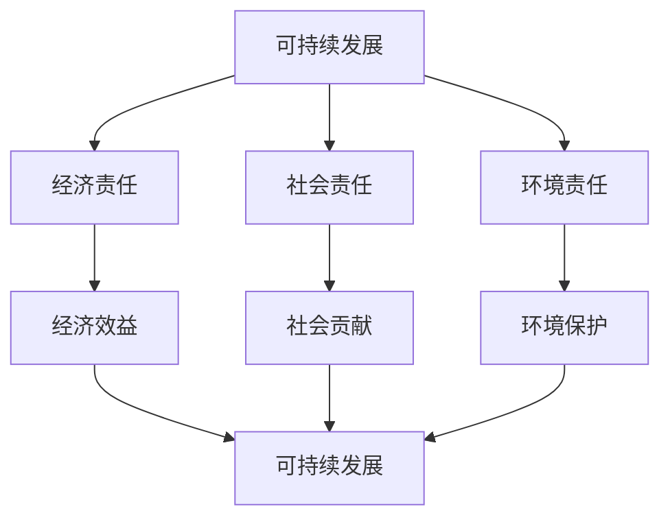

### 1.2 书籍目标与读者对象

**书籍目标**：
- **介绍可持续发展领导的概念、原则和实践**。
- **分析经济、社会和环境责任的关系和平衡**。
- **提供可持续发展战略规划和实施的指导**。

**读者对象**：
- **企业管理者**：希望了解可持续发展领导理念和实践，提升企业可持续发展能力。
- **政策制定者**：关注可持续发展战略和政策制定，提高决策的科学性和有效性。
- **学术界研究者**：对可持续发展领导和经济、社会、环境责任的研究感兴趣。

## 可持续发展领导概述

### 2.1 可持续发展的定义与原则

**定义**：
- **可持续发展**：在满足当前需求的同时，不损害子孙后代满足其需求的能力。
- **可持续发展的三要素**：经济、社会和环境。

**核心原则**：
1. **公平性原则**：确保不同地区、不同社会群体之间的公平发展。
2. **持续性原则**：确保资源的合理利用和生态系统的健康。
3. **共同性原则**：全球性问题需要全球范围内的合作和共同努力。

**核心概念与联系**：
- **经济责任**：可持续发展领导在经济责任方面的表现，体现在经济效益和可持续发展之间的关系。
- **社会责任**：企业或组织在社会责任方面的表现，包括员工权益、社会贡献和社区发展等方面。
- **环境责任**：企业或组织在环境保护方面的责任，包括减少污染、资源节约和生态保护等方面。

**Mermaid 流程图**：


### 2.2 可持续发展领导者的角色

**角色定义**：
- **战略规划者**：制定可持续发展的战略规划和目标，确保企业或组织的长远发展。
- **执行推动者**：推动可持续发展战略的落实和执行，确保各项政策和措施的到位。
- **沟通协调者**：与内部员工、外部合作伙伴和社会各界进行有效沟通，形成共识和合力。

**核心概念与联系**：
- **经济责任**：可持续发展领导者需要考虑经济效益和可持续发展之间的关系，实现经济、社会和环境的平衡。
- **社会责任**：可持续发展领导者需要关注企业或组织的社会责任，确保员工权益、社会贡献和社区发展。
- **环境责任**：可持续发展领导者需要重视环境保护，推动绿色技术和可持续发展。

**Mermaid 流.flow**图**：

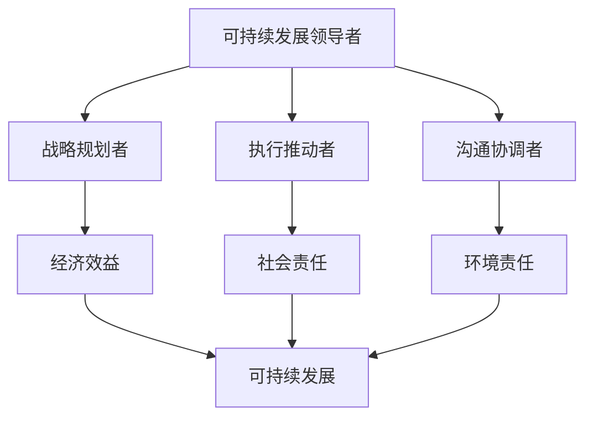

### 2.3 国际可持续发展领导框架与标准

**国际可持续发展领导框架**：
- **全球契约**：由联合国发起，旨在推动企业履行社会责任，实现可持续发展。
- **国际标准化组织（ISO）**：发布了一系列关于可持续发展的标准和指南，如ISO 26000社会责任指南。
- **全球报告倡议组织（GRI）**：制定了一套可持续发展报告标准，帮助企业披露与环境、社会和经济相关的信息。

**国际可持续发展领导标准**：
1. **经济责任**：包括财务绩效、资源利用效率和创新能力等方面。
2. **社会责任**：包括员工权益、社会贡献和供应链管理等方面。
3. **环境责任**：包括环境保护、资源管理和绿色技术创新等方面。

**核心概念与联系**：
- **经济责任**：可持续发展领导者需要遵循国际标准和指南，提高经济效益和可持续发展能力。
- **社会责任**：可持续发展领导者需要关注员工权益、社会贡献和供应链管理，提升社会责任水平。
- **环境责任**：可持续发展领导者需要重视环境保护和资源管理，推动绿色技术创新和可持续发展。

**Mermaid 流程图**：

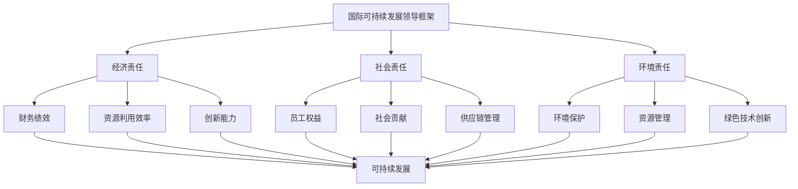

## 经济责任

### 3.1 经济增长与可持续发展的关系

**经济增长与可持续发展的关系**：
- **经济增长**：指国家或地区的经济总量增加，通常通过GDP来衡量。
- **可持续发展**：在满足当前需求的同时，不损害子孙后代满足其需求的能力。

**核心概念与联系**：
- **经济效益**：可持续发展领导者需要关注经济效益，通过提高生产效率、优化资源配置和推动创新来实现经济增长。
- **可持续发展**：可持续发展领导者需要确保经济增长与环境保护和社会责任的平衡，实现经济、社会和环境的协调发展。

**Mermaid 流程图**：

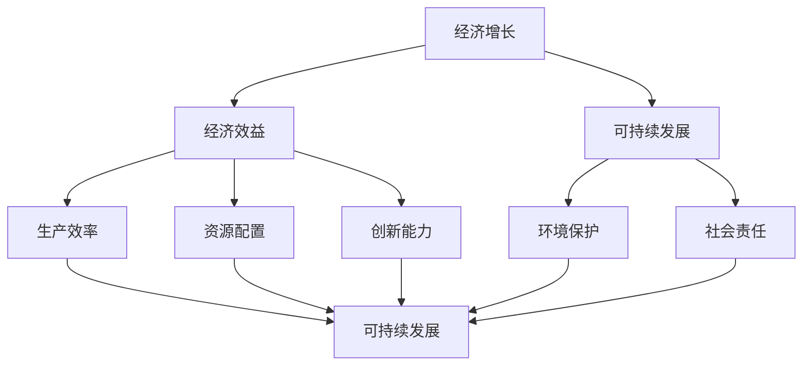

### 3.2 创新与转型策略

**创新与转型策略**：
- **创新**：指通过新技术的研发、新产品的推出和新服务的提供等方式，提高企业或组织的竞争力和创新能力。
- **转型策略**：指通过调整企业或组织的业务模式、管理方式和资源配置等，实现可持续发展目标。

**核心概念与联系**：
- **创新**：可持续发展领导者需要关注技术创新，通过研发新技术、新产品和新服务，提高企业或组织的竞争力。
- **转型策略**：可持续发展领导者需要关注业务转型，通过调整业务模式、管理方式和资源配置等，实现可持续发展目标。

**Mermaid 流程图**：

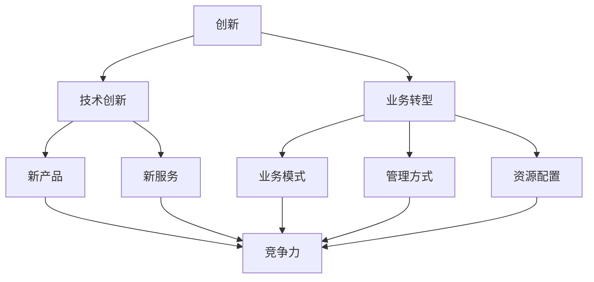

### 3.3 成本效益分析与投资决策

**成本效益分析**：
- **定义**：指通过比较项目或决策的成本和效益，评估其经济合理性。
- **核心概念**：经济效益与成本的平衡。

**投资决策**：
- **定义**：指在资源有限的情况下，选择最有利于企业或组织长远发展的投资方案。
- **核心概念**：投资效益与风险的管理。

**核心概念与联系**：
- **成本效益分析**：可持续发展领导者需要通过成本效益分析，评估可持续发展项目的经济合理性。
- **投资决策**：可持续发展领导者需要在资源有限的情况下，选择最有利于企业或组织长远发展的投资方案。

**Mermaid 流程图**：

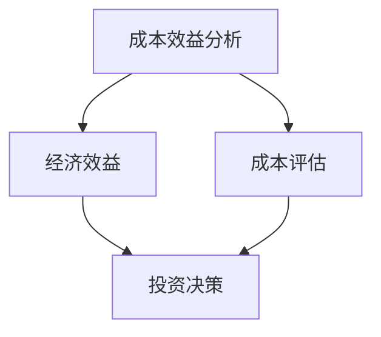

## 社会责任

### 4.1 社会责任的概念与实践

**社会责任的定义**：
- **社会责任**：企业或组织在追求经济利益的同时，关注和承担对社会和环境的责任。

**社会责任的实践**：
1. **员工权益**：保障员工的基本权益，提供良好的工作环境和培训机会。
2. **社会贡献**：参与社会公益活动，为社会发展做出贡献。
3. **社区发展**：关注社区需求，参与社区建设和发展。

**核心概念与联系**：
- **社会责任**：可持续发展领导者需要关注员工权益、社会贡献和社区发展，实现经济、社会和环境的平衡。

**Mermaid 流程图**：

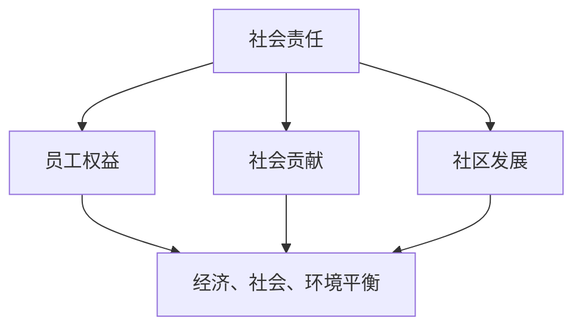

### 4.2 社会影响评估方法

**社会影响评估方法**：
- **定性评估方法**：通过专家访谈、焦点小组讨论和案例分析等方式，评估项目或决策对社会的影响。
- **定量评估方法**：通过统计数据、数学模型和计算机模拟等方式，评估项目或决策对社会的影响。

**核心概念与联系**：
- **定性评估方法**：可持续发展领导者需要通过专家访谈、焦点小组讨论和案例分析等方式，全面了解项目或决策对社会的影响。
- **定量评估方法**：可持续发展领导者需要通过统计数据、数学模型和计算机模拟等方式，精确评估项目或决策对社会的影响。

**Mermaid 流程图**：

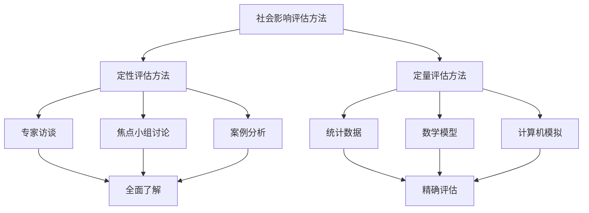

### 4.3 社会责任战略的制定与实施

**社会责任战略的制定**：
- **目标设定**：明确社会责任战略的目标，包括员工权益、社会贡献和社区发展等方面。
- **策略规划**：制定具体的社会责任策略，包括行动方案、资源分配和时间表等。

**社会责任战略的实施**：
- **行动计划**：将社会责任战略转化为具体的行动计划，确保各项措施得到有效执行。
- **监控与评估**：对社会责任战略的实施情况进行监控和评估，及时调整和优化。

**核心概念与联系**：
- **社会责任战略**：可持续发展领导者需要制定明确的社会责任战略，确保社会责任目标的实现。
- **实施与监控**：可持续发展领导者需要确保社会责任战略的有效实施和持续改进。

**Mermaid 流程图**：

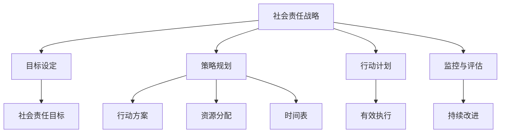

## 环境责任

### 5.1 环境问题的挑战

**环境问题的挑战**：
- **气候变化**：全球气候变化导致极端天气事件增多，对生态系统和人类生活造成严重影响。
- **资源枯竭**：自然资源的过度开采和浪费，导致资源枯竭和生态破坏。
- **污染问题**：空气、水和土壤污染严重，影响人类健康和生态系统的平衡。

**核心概念与联系**：
- **环境责任**：可持续发展领导者需要关注环境问题，采取有效措施减少环境污染和资源浪费。

**Mermaid 流程图**：

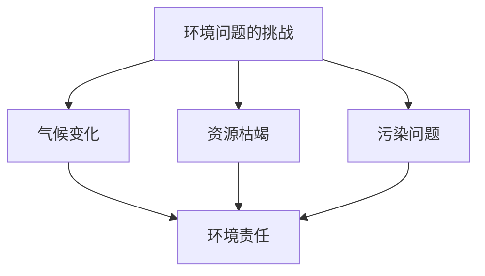

### 5.2 环境责任的实施与效果评估

**环境责任的实施**：
- **环境保护政策**：制定和实施环境保护政策，如减少污染物排放、推广节能减排技术等。
- **绿色技术创新**：研发和应用绿色技术，降低能源消耗和减少污染。

**效果评估**：
- **监测与报告**：建立环境监测系统，定期监测和报告环境指标。
- **绩效评估**：对环境责任的实施效果进行评估，包括环境效益、经济效益和社会效益等方面。

**核心概念与联系**：
- **环境责任实施**：可持续发展领导者需要制定和实施环境保护政策，推广绿色技术创新。
- **效果评估**：可持续发展领导者需要对环境责任的实施效果进行监测和评估，持续优化和改进。

**Mermaid 流流程图**：

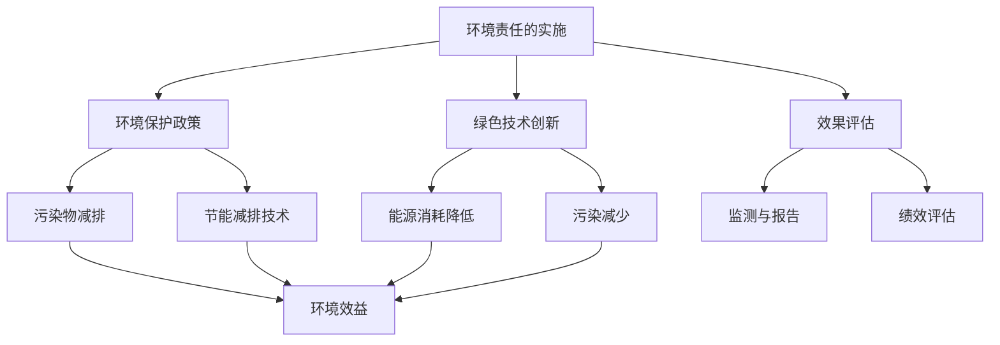

### 5.3 绿色技术创新与应用

**绿色技术创新**：
- **清洁能源技术**：研发和应用清洁能源技术，如太阳能、风能和核能等，减少对化石燃料的依赖。
- **资源循环利用技术**：研发和应用资源循环利用技术，提高资源利用效率，减少废弃物产生。

**应用领域**：
- **工业**：在工业生产过程中应用绿色技术，提高生产效率，减少污染和资源浪费。
- **交通**：在交通运输领域推广清洁能源汽车和公共交通系统，减少尾气排放。
- **建筑**：在建筑领域应用绿色建筑技术，提高建筑能效，减少能源消耗。

**核心概念与联系**：
- **绿色技术创新**：可持续发展领导者需要推动绿色技术创新，提高资源利用效率和减少环境污染。
- **应用领域**：绿色技术创新在各个领域的应用，实现经济、社会和环境的协调发展。

**Mermaid 流程图**：

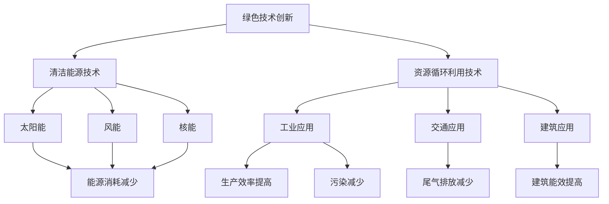

## 可持续发展的战略规划

### 6.1 可持续发展目标的设定

**可持续发展目标的设定**：
- **长远目标**：设定长期可持续发展目标，如环境保护、社会贡献和经济发展的目标。
- **短期目标**：设定短期可持续发展目标，如年度环境保护指标、社会贡献目标和经济效益目标。

**核心概念与联系**：
- **目标设定**：可持续发展领导者需要明确长远和短期目标，确保可持续发展战略的可行性和有效性。

**Mermaid 流程图**：

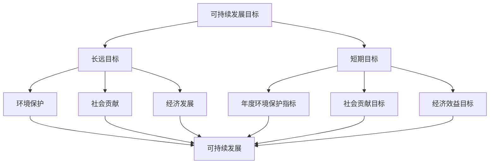

### 6.2 战略规划的过程与方法

**战略规划的过程**：
1. **现状分析**：分析企业或组织的当前发展状况，包括经济、社会和环境方面。
2. **目标设定**：根据现状分析，设定长期和短期可持续发展目标。
3. **策略规划**：制定具体的可持续发展策略，包括经济、社会和环境责任方面的策略。
4. **行动计划**：制定具体的行动计划，确保可持续发展策略得到有效实施。
5. **监控与评估**：对可持续发展战略的实施情况进行监控和评估，及时调整和优化。

**核心概念与联系**：
- **战略规划过程**：可持续发展领导者需要按照战略规划的过程，确保可持续发展战略的制定和实施。

**Mermaid 流程图**：

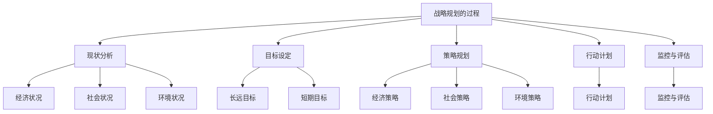

### 6.3 风险管理与应对策略

**风险管理与应对策略**：
- **风险识别**：识别可持续发展过程中可能遇到的经济、社会和环境风险。
- **风险评估**：评估各种风险的概率和影响程度。
- **风险应对策略**：制定相应的风险应对策略，包括风险规避、风险转移和风险缓解等。

**核心概念与联系**：
- **风险管理**：可持续发展领导者需要关注风险管理和应对策略，确保可持续发展目标的实现。

**Mermaid 流程图**：

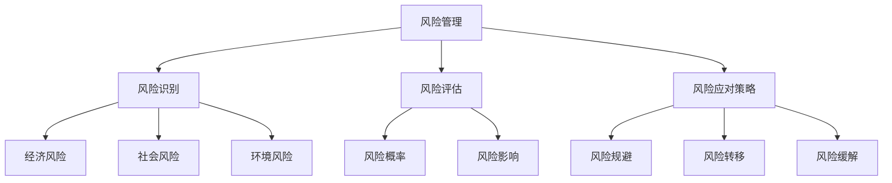

## 可持续发展的实施与监控

### 7.1 实施策略与行动计划

**实施策略与行动计划**：
- **制定实施策略**：根据可持续发展战略，制定具体的实施策略，包括经济、社会和环境责任方面的策略。
- **制定行动计划**：将实施策略转化为具体的行动计划，明确行动目标、责任人和时间表。

**核心概念与联系**：
- **实施策略**：可持续发展领导者需要制定具体的实施策略，确保可持续发展战略得到有效实施。
- **行动计划**：可持续发展领导者需要制定具体的行动计划，确保各项措施得到有效执行。

**Mermaid 流程图**：

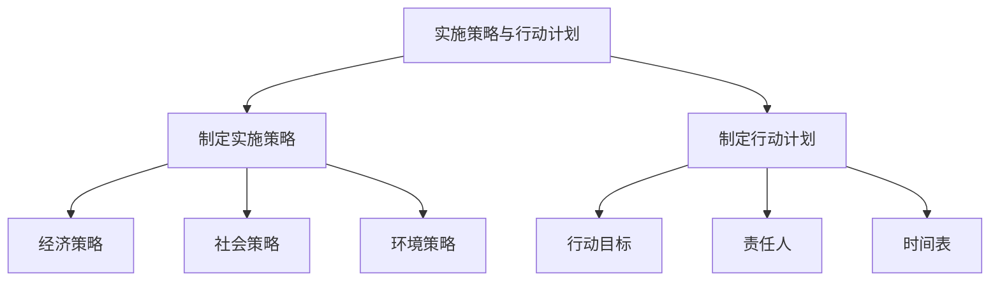

### 7.2 监控与评估指标

**监控与评估指标**：
- **经济指标**：包括利润、增长率、市场份额等。
- **社会指标**：包括员工满意度、社会贡献、社区参与度等。
- **环境指标**：包括污染物排放量、能源消耗、资源利用效率等。

**核心概念与联系**：
- **监控与评估**：可持续发展领导者需要建立监控与评估体系，确保可持续发展战略的实施效果。

**Mermaid 流程图**：

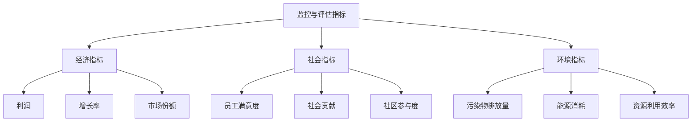

### 7.3 持续改进与优化

**持续改进与优化**：
- **定期评估**：定期评估可持续发展战略的实施效果，发现问题和不足。
- **优化策略**：根据评估结果，调整和优化可持续发展战略和实施策略。
- **创新驱动**：鼓励创新，探索新的可持续发展模式和解决方案。

**核心概念与联系**：
- **持续改进**：可持续发展领导者需要持续改进和优化可持续发展战略，确保可持续发展目标的实现。

**Mermaid 流程图**：

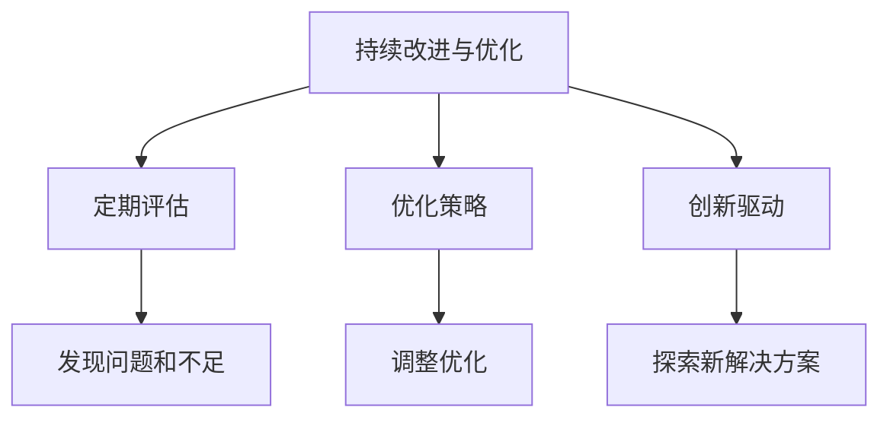

## 案例研究

### 8.1 成功案例的解析

**成功案例的解析**：
- **案例1**：某企业通过实施绿色技术创新，成功实现了节能减排和环境保护。
- **案例2**：某企业通过参与社会公益活动，提升了品牌形象和社会贡献。

**核心概念与联系**：
- **成功因素**：可持续发展领导者需要关注绿色技术创新、社会公益活动等因素，实现可持续发展目标。

**Mermaid 流程图**：

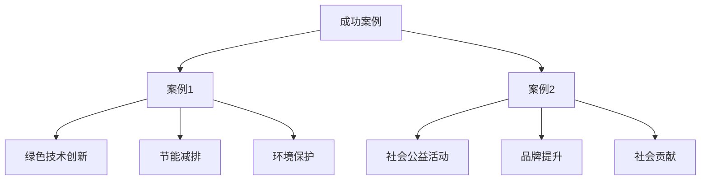

### 8.2 失败案例的反思

**失败案例的反思**：
- **案例1**：某企业在追求经济效益的过程中，忽视了环境保护和社会责任，导致环境问题和社区冲突。
- **案例2**：某企业缺乏有效的可持续发展战略和实施策略，导致可持续发展目标未能实现。

**核心概念与联系**：
- **失败原因**：可持续发展领导者需要关注环境保护、社会责任和可持续发展战略等因素，避免失败。

**Mermaid 流程图**：

```mermaid
graph TD
    A[失败案例] --> B[案例1]
    A --> C[案例2]
    B --> D[忽视环境保护]
    B --> E[忽视社会责任]
    B --> F[环境问题]
    B --> G[社区冲突]
    C --> H[缺乏可持续发展战略]
    C --> I[缺乏实施策略]
    C --> J[目标未实现]
```

### 8.3 案例对可持续发展领导的启示

**启示**：
- **成功案例**：可持续发展领导者需要关注绿色技术创新、社会公益活动等因素，实现可持续发展目标。
- **失败案例**：可持续发展领导者需要关注环境保护、社会责任和可持续发展战略等因素，避免失败。

**核心概念与联系**：
- **案例启示**：可持续发展领导者需要从成功案例中吸取经验，从失败案例中吸取教训，提高可持续发展能力。

**Mermaid 流程图**：

```mermaid
graph TD
    A[案例启示] --> B[成功经验]
    A --> C[失败教训]
    B --> D[绿色技术创新]
    B --> E[社会公益活动]
    C --> F[环境保护]
    C --> G[社会责任]
    C --> H[可持续发展战略]
```

## 结论

### 9.1 可持续发展领导的关键要素

**关键要素**：
- **经济责任**：关注经济效益和可持续发展之间的关系，实现经济、社会和环境的平衡。
- **社会责任**：关注员工权益、社会贡献和社区发展，提升社会责任水平。
- **环境责任**：关注环境保护和资源管理，推动绿色技术创新和可持续发展。

**核心概念与联系**：
- **关键要素**：可持续发展领导者需要关注经济、社会和环境责任，实现可持续发展目标。

**Mermaid 流程图**：

```mermaid
graph TD
    A[关键要素] --> B[经济责任]
    A --> C[社会责任]
    A --> D[环境责任]
    B --> E[经济效益]
    C --> F[社会贡献]
    D --> G[环境保护]
```

### 9.2 未来发展趋势与挑战

**未来发展趋势**：
- **数字化转型**：数字技术将深入应用于可持续发展领域，推动经济、社会和环境的协调发展。
- **绿色技术创新**：绿色技术创新将成为可持续发展的重要驱动力，推动资源节约和环境保护。

**未来挑战**：
- **经济与环境矛盾**：如何在经济增长的同时保护环境，实现可持续发展，仍是面临的重要挑战。
- **社会公平与责任**：如何平衡社会公平与责任，确保不同社会群体共享可持续发展成果，是可持续发展领导者需要面对的挑战。

**核心概念与联系**：
- **未来发展趋势与挑战**：可持续发展领导者需要关注数字化转型、绿色技术创新等发展趋势，应对经济与环境矛盾和社会公平与责任等挑战。

**Mermaid 流程图**：

```mermaid
graph TD
    A[未来发展趋势] --> B[数字化转型]
    A --> C[绿色技术创新]
    B --> D[经济、社会、环境协调发展]
    C --> D
    A --> E[未来挑战]
    E --> F[经济与环境矛盾]
    E --> G[社会公平与责任]
```

### 9.3 对领导者的建议与启示

**建议与启示**：
1. **强化可持续发展意识**：领导者需要强化可持续发展意识，将可持续发展理念贯穿于企业或组织的战略规划和运营管理中。
2. **构建可持续发展体系**：领导者需要构建完善的可持续发展体系，包括战略规划、实施策略、监控与评估等环节。
3. **推动技术创新**：领导者需要关注绿色技术创新，推动企业或组织在资源利用、环境保护和节能减排等方面取得突破。
4. **加强社会责任**：领导者需要关注社会责任，积极参与社会公益活动，提升企业或组织的品牌形象和社会影响力。

**核心概念与联系**：
- **建议与启示**：可持续发展领导者需要关注可持续发展意识、体系建设、技术创新和社会责任等方面，提升可持续发展能力。

**Mermaid 流程图**：

```mermaid
graph TD
    A[建议与启示] --> B[强化可持续发展意识]
    A --> C[构建可持续发展体系]
    A --> D[推动技术创新]
    A --> E[加强社会责任]
    B --> F[战略规划]
    B --> G[运营管理]
    C --> H[实施策略]
    C --> I[监控与评估]
    D --> J[绿色技术创新]
    E --> K[社会公益活动]
    E --> L[品牌形象提升]
```## 结论

### 9.1 可持续发展领导的重要性

**可持续发展领导的重要性**：

在当今全球化和信息化快速发展的时代，可持续发展已成为企业、组织和政府共同追求的目标。可持续发展领导的重要性体现在以下几个方面：

1. **引领可持续发展方向**：可持续发展领导者能够为企业或组织明确可持续发展的目标和路径，确保企业或组织在追求经济利益的同时，兼顾社会和环境责任。

2. **提升企业竞争力**：通过推动绿色技术创新和资源优化利用，可持续发展领导者能够提升企业的竞争力，实现经济、社会和环境的协调发展。

3. **塑造企业形象**：可持续发展领导者关注社会责任和环境保护，能够树立良好的企业形象，增强品牌价值和公信力。

4. **实现长期发展**：可持续发展领导者通过构建可持续发展的管理体系和战略规划，确保企业或组织实现长期稳定的发展。

**核心概念与联系**：

- **可持续发展领导**：通过引领方向、提升竞争力、塑造形象和实现长期发展，推动经济、社会和环境的协调发展。

**Mermaid 流程图**：

```mermaid
graph TD
    A[可持续发展领导] --> B[引领方向]
    A --> C[提升竞争力]
    A --> D[塑造形象]
    A --> E[实现长期发展]
    B --> F[经济、社会、环境协调发展]
    C --> F
    D --> F
    E --> F
```

### 9.2 未来发展趋势与挑战

**未来发展趋势**：

1. **数字化转型**：随着大数据、人工智能和区块链等技术的不断发展，数字化转型将成为推动可持续发展的重要力量。

2. **绿色技术创新**：绿色技术创新将成为可持续发展的核心驱动力，通过科技创新降低能耗、减少污染和优化资源利用。

3. **国际合作**：全球范围内对可持续发展的关注和合作将进一步加强，国际合作将成为实现可持续发展目标的重要途径。

**未来挑战**：

1. **经济与环境矛盾**：如何在经济增长的同时保护环境，实现可持续发展，仍是面临的重要挑战。

2. **社会公平与责任**：如何平衡社会公平与责任，确保不同社会群体共享可持续发展成果，是可持续发展领导者需要面对的挑战。

3. **政策与制度**：缺乏有效的政策和制度支持，将成为可持续发展面临的制约因素。

**核心概念与联系**：

- **发展趋势与挑战**：未来可持续发展面临数字化转型、绿色技术创新和国际合作等机遇，同时也面临经济与环境矛盾、社会公平与责任和政策与制度等挑战。

**Mermaid 流程图**：

```mermaid
graph TD
    A[未来发展趋势] --> B[数字化转型]
    A --> C[绿色技术创新]
    A --> D[国际合作]
    B --> E[机遇]
    C --> E
    D --> E
    A --> F[未来挑战]
    F --> G[经济与环境矛盾]
    F --> H[社会公平与责任]
    F --> I[政策与制度]
```

### 9.3 对领导者的建议与启示

**建议与启示**：

1. **强化可持续发展意识**：领导者需要不断学习，强化对可持续发展的理解和意识，将可持续发展理念融入企业或组织的战略规划和运营管理中。

2. **构建可持续发展体系**：领导者需要构建完善的可持续发展体系，包括战略规划、实施策略、监控与评估等环节，确保可持续发展目标的实现。

3. **推动技术创新**：领导者需要关注绿色技术创新，积极投资和研发新技术，通过技术创新降低能耗、减少污染和优化资源利用。

4. **加强社会责任**：领导者需要关注社会责任，积极参与社会公益活动，提升企业或组织的品牌形象和社会影响力。

5. **建立合作机制**：领导者需要建立与政府、社会组织和利益相关者的合作机制，共同推动可持续发展目标的实现。

**核心概念与联系**：

- **建议与启示**：领导者通过强化可持续发展意识、构建可持续发展体系、推动技术创新、加强社会责任和建立合作机制，提升可持续发展能力。

**Mermaid 流程图**：

```mermaid
graph TD
    A[建议与启示] --> B[强化可持续发展意识]
    A --> C[构建可持续发展体系]
    A --> D[推动技术创新]
    A --> E[加强社会责任]
    A --> F[建立合作机制]
    B --> G[战略规划]
    B --> H[运营管理]
    C --> I[技术创新]
    D --> I
    E --> I
    F --> I
```

作者：AI天才研究院/AI Genius Institute & 禅与计算机程序设计艺术 /Zen And The Art of Computer Programming

