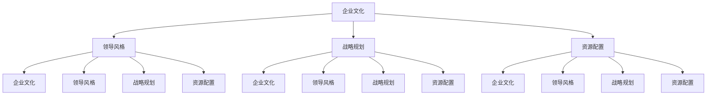

                 

### 《可持续领导力：平衡短期利益与长远发展》引言

在现代商业环境中，领导力不仅是企业的核心驱动力，更是企业可持续发展的关键因素。随着全球化进程的加速和科技的发展，企业面临的环境和挑战日益复杂多变。在这种背景下，可持续领导力应运而生，成为新时代企业领导者的必备素养。本文旨在探讨可持续领导力的核心概念、其在企业中的应用策略，以及如何平衡短期利益与长远发展，最终为企业和社会创造持久价值。

#### 什么是可持续领导力？

可持续领导力是一种以长期视角、社会责任和资源优化利用为核心理念的领导模式。与传统领导力不同，可持续领导力不仅关注企业的短期绩效，更重视企业的长期可持续性和社会责任。其核心目标是确保企业在实现经济效益的同时，兼顾社会效益和环境保护。

#### 可持续领导力的重要性

1. **竞争优势**：具备可持续领导力的企业能够在激烈的市场竞争中脱颖而出，获得持续发展的优势。
2. **社会责任**：企业作为社会的一员，承担起社会责任是可持续领导力的重要体现，这有助于提升企业的社会形象和品牌价值。
3. **资源管理**：通过可持续领导力，企业能够更加高效地利用资源，降低运营成本，提升竞争力。

#### 短期利益与长远发展的关系

短期利益和长远发展并非水火不容，而是相互依存的。短期利益为企业的当前运营提供了必要的资金支持，而长远发展则为企业的未来奠定了坚实基础。关键在于如何平衡这两者之间的关系。

1. **短期利益的重要性**：短期利益是企业的生存之本，良好的财务状况和运营效率是确保企业长期发展的基础。
2. **长远发展的必要性**：没有长远规划的企业难以为继，企业需要通过持续创新和战略调整来适应不断变化的市场环境。

#### 本文结构

本文将分为五个部分，首先介绍可持续领导力的基础概念，包括其定义、重要性、关键要素以及与传统领导力的区别。接着，讨论如何平衡短期利益与长远发展，提出实现平衡的策略。然后，分析可持续领导力在企业中的应用，涵盖企业文化、员工激励、供应链管理和创新管理等方面。随后，通过实际案例研究，展示可持续领导力的成功实践。最后，展望可持续领导力的未来趋势，探讨其发展方向以及对社会的影响。

通过本文的逐步分析，我们希望能够帮助读者深入了解可持续领导力，掌握平衡短期利益与长远发展的方法，从而为企业和社会的可持续发展做出贡献。

### 1.1 可持续领导力的定义

可持续领导力是一种独特的领导模式，其核心在于平衡短期利益与长远发展，同时兼顾社会和环境责任。这种领导模式不仅关注企业的财务绩效，还注重企业的社会责任和环境保护，力求在经济效益、社会效益和环境保护之间找到最佳平衡点。

首先，可持续领导力强调长期视角。与传统的短期导向不同，可持续领导力认为，企业的成功不仅仅体现在短期的利润和市场份额上，更在于其能否持续发展，保持竞争优势。这意味着领导者需要具备前瞻性，能够预测市场变化，制定长期的战略规划，确保企业在面对未来挑战时依然能够稳健前行。

其次，可持续领导力强调社会责任。企业在追求经济效益的同时，还需要承担起相应的社会责任。这包括但不限于员工权益保障、社区参与、慈善捐赠、环境保护等方面。可持续领导力鼓励企业主动承担社会责任，将其融入企业的核心价值观和运营战略中，从而提升企业的社会形象和品牌价值。

最后，可持续领导力强调资源优化利用。在资源日益紧张、环境问题日益突出的今天，企业必须更加高效地利用资源。这要求企业在生产和运营过程中采取环保措施，减少资源浪费，提高资源利用效率。同时，企业还需要积极探索新的资源替代方案，以降低对传统资源的依赖，实现可持续发展。

具体来说，可持续领导力的定义可以分解为以下几个方面：

1. **长期规划**：领导者需要具备长远的战略眼光，制定和实施长期规划，确保企业在未来具备持续发展的能力。
2. **社会责任**：企业需要将社会责任融入日常运营，通过实际行动践行企业社会责任，提升社会对企业的认可度。
3. **环境保护**：企业需要采取环保措施，减少对环境的负面影响，积极参与环境保护活动，推动社会可持续发展。
4. **资源优化**：企业需要提高资源利用效率，减少资源浪费，积极探索新的资源利用方式，实现资源的高效利用。

在实现可持续领导力的过程中，领导者需要具备以下几个核心能力：

1. **前瞻性**：能够预测市场趋势，制定长远的战略规划，确保企业在变化的市场环境中保持竞争优势。
2. **创新意识**：鼓励创新，推动企业不断进行技术革新和管理创新，以应对市场变化和挑战。
3. **沟通能力**：能够有效地与团队成员沟通，确保信息透明，促进团队协作，提高工作效率。
4. **道德责任感**：具备高度的社会责任感和道德伦理，能够在经营决策中平衡短期利益与长远发展，做出符合社会期望的决策。

通过上述定义和核心能力的阐述，我们可以看出，可持续领导力不仅是一种领导模式，更是一种价值观和理念，它要求领导者具备长远的战略眼光、强烈的社会责任感和高效的资源管理能力，以实现企业、社会和环境的共同可持续发展。

#### 1.2 可持续领导力的重要性

可持续领导力在现代商业环境中具有不可忽视的重要性。首先，从竞争优势的角度来看，具备可持续领导力的企业能够在激烈的市场竞争中脱颖而出。这不仅是因为可持续领导力有助于企业提高资源利用效率，降低运营成本，还能够提升企业的品牌价值和公众形象，从而获得更多的市场份额。此外，可持续领导力还能够帮助企业建立长期的客户关系，增强客户忠诚度。

其次，可持续领导力在实现社会责任方面发挥着重要作用。企业作为社会的一员，承担社会责任是其发展的必然要求。通过实施可持续领导力，企业能够积极履行社会责任，包括员工权益保障、社区参与、慈善捐赠、环境保护等方面。这不仅有助于提升企业的社会形象，还能够增强企业的社会责任感，促进企业的长期发展。

最后，可持续领导力在资源管理方面也具有重要意义。随着全球资源的日益紧张，企业必须更加高效地利用资源，以实现可持续发展。可持续领导力鼓励企业采取环保措施，减少资源浪费，提高资源利用效率。此外，通过技术创新和管理优化，企业还能够探索新的资源利用方式，降低对传统资源的依赖，从而实现资源的可持续利用。

总的来说，可持续领导力不仅有助于企业实现经济效益，还能够提升企业的社会责任感和资源管理能力，从而在激烈的市场竞争中立于不败之地。以下是几个具体案例，进一步说明可持续领导力的重要性：

1. **案例一：苹果公司**：苹果公司是可持续领导力的典范。通过采用环保材料、提高生产效率、减少能源消耗等手段，苹果公司在环境保护方面取得了显著成果。此外，苹果公司还积极推动供应链的可持续性，要求供应商遵守环保和人权标准。这些举措不仅提升了苹果公司的品牌价值，还为其在市场上赢得了更多的客户支持。

2. **案例二：宜家**：宜家是一家全球性的家具零售企业，以其可持续领导力而闻名。宜家在产品设计、材料选择和运输方式等方面都致力于降低环境影响。例如，宜家推出的“环保选择”系列家具，采用了可持续材料，并具有较长的使用寿命。此外，宜家还通过减少包装、优化运输路线等措施，降低了碳排放。这些努力不仅提升了宜家的企业形象，还为其带来了长期的经济效益。

3. **案例三：特斯拉**：特斯拉是一家以电动汽车和清洁能源技术为核心的企业，其可持续领导力在行业中具有代表性。特斯拉通过研发高效的电动汽车和太阳能系统，致力于减少对化石燃料的依赖，推动全球能源转型。此外，特斯拉还积极投资可再生能源项目，如风力发电和太阳能发电，以实现能源的可持续利用。这些举措不仅有助于减少碳排放，还提升了特斯拉的市场竞争力。

通过上述案例可以看出，可持续领导力不仅有助于企业实现经济效益，还能够提升企业的社会责任感和资源管理能力。在现代社会，可持续领导力已经成为企业成功的关键因素之一。企业领导者应充分认识到可持续领导力的重要性，将其融入企业的战略规划和日常运营中，以实现企业的长期可持续发展。

### 1.3 可持续领导力的关键要素

可持续领导力是一种复杂的领导模式，其成功实施依赖于多个关键要素的协同作用。以下是可持续领导力的几个关键要素，以及它们之间的相互关系：

#### 企业文化

企业文化是可持续领导力的基石，它决定了企业内部的行为规范和价值观。一个积极、健康的企业文化能够鼓励员工积极参与可持续发展的实践，如节能减排、环境保护和社区参与等。企业文化不仅是企业价值观的体现，还是员工行为的标准。因此，领导者需要通过培训和激励机制，确保企业文化与可持续领导力的理念相一致。

#### 领导风格

领导风格直接影响着企业文化和员工的可持续发展行为。可持续领导力要求领导者具备长远的眼光和高度的社会责任感。他们需要通过榜样作用和有效的沟通，引导员工关注企业的长期目标和社会责任。此外，领导者还应该鼓励创新和尝试新方法，以应对不断变化的市场环境和社会需求。

#### 战略规划

战略规划是可持续领导力的核心，它确保企业能够在实现短期利益的同时，兼顾长远发展。有效的战略规划应包括明确的可持续发展目标、资源优化利用方案和环境保护措施。领导者需要通过科学的决策和资源调配，确保企业在实现经济效益的同时，也履行社会责任。

#### 资源配置

资源配置是可持续领导力的关键，它决定了企业如何有效地利用有限的资源。领导者需要确保资源分配合理，优先考虑那些具有长期效益的项目。同时，企业还需要建立高效的资源管理系统，通过技术创新和流程优化，提高资源利用效率，降低浪费。

#### 企业文化与领导风格的相互关系

企业文化和领导风格密切相关，它们相互影响，共同塑造企业的可持续发展环境。一个积极的企业文化可以增强领导者的领导力，使其更具备可持续领导力的特质。反之，领导者的领导风格也会影响企业文化的形成和演变。例如，领导者的透明沟通和参与式管理风格可以促进企业文化的开放和创新。

#### 企业文化、领导风格与战略规划的相互关系

企业文化和领导风格直接影响战略规划的有效性。一个健康、积极的企业文化能够为战略规划提供支持和动力，使员工更加愿意参与和执行可持续发展目标。领导者的领导风格则决定了战略规划的实施方式和效果。如果领导者具备前瞻性和社会责任感，他们更可能制定出符合企业长远利益的战略规划。

#### 资源配置与可持续领导力的关系

资源配置是实现可持续领导力的关键，它不仅影响企业的短期绩效，还关系到企业的长期可持续性。有效的资源配置策略可以帮助企业实现资源的最优利用，降低运营成本，提高竞争力。此外，通过合理的资源配置，企业还能够更好地履行社会责任，如节能减排和环境保护。

总的来说，可持续领导力的关键要素之间相互关联、相互影响，共同构成了一个复杂而有机的系统。领导者需要综合考虑这些要素，制定和实施全面的可持续发展战略，以实现企业的长期成功和社会责任。以下是可持续领导力关键要素的 Mermaid 流程图：

通过这个流程图，我们可以清晰地看到各个关键要素之间的相互关系，以及它们在实现可持续领导力过程中的作用。

### 1.4 可持续领导力与传统领导力的区别

可持续领导力与传统领导力在多个方面存在显著差异，这些差异不仅体现在对短期利益和长远发展的处理方式上，还涉及领导风格、企业文化和战略规划等核心要素。

#### 短期利益与长远发展的处理方式

传统领导力通常以短期利益为导向，注重在短时间内实现高效率和快速增长。这种领导模式倾向于采取短期激励措施，如奖金和晋升，以激励员工迅速完成任务。然而，这种方式可能导致资源浪费、环境破坏和员工士气下降等问题，因为员工只关注短期目标，忽视了长期发展的需要。

相反，可持续领导力强调长远视角，认为企业的成功需要通过持续的创新和战略规划来实现。可持续领导者不仅关注短期利润，还注重企业的长期可持续性和社会责任。他们倾向于制定长期的战略目标，通过持续改进和创新来提升企业的竞争力。这种方式有助于减少短期行为的风险，确保企业在面对未来挑战时依然能够稳健前行。

#### 领导风格

传统领导力往往采用权威式或指令式的领导风格，领导者通过下达命令和监控员工来确保任务完成。这种方式可能导致员工缺乏自主性和创造力，因为员工往往只是执行领导者指定的任务，而不是主动思考和解决问题。

相比之下，可持续领导力倡导参与式和赋能型的领导风格。可持续领导者鼓励员工参与决策过程，给予他们更多的自主权和创新空间。这种方式不仅能够激发员工的创造力和积极性，还能够提升员工的工作满意度和忠诚度。通过赋能员工，可持续领导者能够建立更加紧密的团队合作关系，推动企业实现共同的目标。

#### 企业文化

传统领导力通常忽视企业文化的重要性，或者将其视为次要因素。领导者可能认为企业文化是“软性”的，对企业的绩效没有直接影响。因此，他们在管理过程中可能不重视企业文化的塑造和维护。

可持续领导力则将企业文化视为企业成功的关键因素之一。可持续领导者认识到，企业文化能够影响员工的行为和价值观，从而影响企业的整体绩效。他们致力于建立积极、健康的企业文化，鼓励员工关注可持续发展和社会责任。这种企业文化不仅有助于提升员工的归属感和满意度，还能够增强企业的凝聚力和竞争力。

#### 战略规划

传统领导力在战略规划方面往往侧重于短期的市场反应和财务目标，忽视了长期发展和社会责任。领导者可能只关注如何快速抢占市场份额，而忽视了企业的长期可持续性和社会责任。

可持续领导力则强调战略规划的全面性和长远性。可持续领导者不仅关注企业的财务绩效，还关注社会和环境效益。他们在制定战略规划时，会充分考虑企业对环境的影响、资源的可持续利用以及社会责任的履行。这种方式有助于确保企业不仅能够在短期内取得成功，还能够长期持续发展。

总之，可持续领导力与传统领导力在处理短期利益与长远发展的方式、领导风格、企业文化和战略规划等方面存在显著差异。可持续领导力更加注重长远视角、社会责任和资源优化利用，有助于企业在实现经济效益的同时，兼顾社会效益和环境保护，从而实现长期可持续发展。

### 1.5 可持续领导力与环境保护的关系

可持续领导力在环境保护方面发挥着重要作用，其核心在于通过企业内部的管理和外部的影响，推动环境保护和可持续发展。以下是可持续领导力如何与环境保护结合，以及企业在实现这一目标时面临的具体挑战。

#### 可持续领导力与环境保护的结合

1. **内部管理**：企业通过实施可持续领导力，加强内部管理，减少资源浪费和环境污染。例如，企业可以采用节能设备、优化生产流程，减少废水、废气和固体废物的排放。此外，企业还可以通过绿色采购和循环利用资源，降低对环境的负面影响。

2. **社会责任**：可持续领导者鼓励企业在经营活动中承担更多的社会责任，积极参与环境保护和公益项目。例如，企业可以捐赠资金和物资支持环保组织，开展绿色公益活动，提升企业的社会形象和品牌价值。

3. **绿色创新**：可持续领导力鼓励企业进行绿色创新，通过研发环保技术、绿色产品和可持续服务，实现环境保护和经济效益的双赢。例如，企业可以开发可再生能源项目、推广环保包装和减少碳排放的技术。

4. **供应链管理**：企业通过可持续领导力，对供应链进行绿色管理，推动整个供应链的可持续发展。这包括要求供应商遵守环保标准和道德规范，减少供应链中的资源浪费和环境污染。

#### 企业在实现环境保护时面临的挑战

1. **政策法规**：企业需要遵守国家和地区的环保政策法规，这些法规可能对企业提出严格的环保要求。企业需要不断更新法规知识，确保合规运营。

2. **资源限制**：企业在实施环保措施时，可能会面临资源限制的问题，如能源、水资源和原材料的短缺。企业需要通过技术创新和资源优化，应对这些资源限制。

3. **成本问题**：实施环保措施可能会增加企业的运营成本，如购买环保设备、改进生产工艺等。企业需要权衡短期成本和长期效益，确保环保措施的经济可行性。

4. **市场竞争**：在市场竞争激烈的环境下，企业可能更倾向于追求短期利润，而不是长期可持续发展。企业需要具备长远眼光，将环境保护和可持续发展纳入战略规划，以赢得市场竞争优势。

5. **员工意识**：员工的环保意识对于企业实现环境保护至关重要。企业需要通过培训和宣传，提高员工的环保意识，鼓励他们积极参与环保活动。

#### 成功的环保实践案例

1. **案例一：沃尔沃汽车**：沃尔沃汽车致力于实现碳中和，通过使用可再生能源、优化生产流程和鼓励员工参与环保活动，减少碳排放。沃尔沃还推出了一系列环保车型，如混合动力车和电动车，推动了汽车行业的绿色转型。

2. **案例二：谷歌**：谷歌通过一系列环保措施，如使用可再生能源、减少废物产生和优化水资源利用，实现了企业运营的碳中和。谷歌还投资了多个可再生能源项目，推动全球能源转型。

3. **案例三：宜家**：宜家通过采用可持续材料、优化物流和减少包装，实现了产品的环保生产。宜家还推出了“可持续生活”系列，鼓励消费者选择环保产品，共同推动环境保护。

通过这些实践，我们可以看到，可持续领导力在环境保护方面发挥着重要作用。企业通过实施可持续领导力，不仅能够实现环境保护目标，还能够提升企业的竞争力和社会形象，实现长期可持续发展。

#### 1.5.1 环境因素对企业的影响

环境因素对企业的发展至关重要，这些因素不仅影响企业的运营成本，还关系到企业的长期生存和竞争力。以下是环境因素对企业的影响及其具体表现：

1. **气候变化**：气候变化对企业的运营带来了诸多挑战。首先，极端天气事件如洪水、干旱和暴风雪等可能直接破坏企业的生产和设施，导致运营中断。其次，气候变化可能导致水资源短缺，影响企业的生产用水和员工生活用水。此外，气候变化还可能对供应链造成影响，例如运输成本上升和原材料供应不足。

2. **资源短缺**：随着全球人口的增加和经济的发展，自然资源如水、矿产和森林等资源日益短缺。这对企业来说是一个重大挑战，因为资源短缺可能导致生产成本上升、供应中断和质量下降。例如，水资源的短缺可能影响企业的生产过程，而矿产资源的短缺可能影响企业的原材料供应。

3. **生态破坏**：生态系统的破坏对企业的可持续发展构成了严重威胁。森林砍伐、土地荒漠化和生物多样性丧失等生态问题可能导致生态系统的失衡，进而影响企业的生态环境。例如，森林砍伐可能导致水源减少，影响农业生产，进而影响企业的原材料供应。此外，生态破坏还可能引发自然灾害，如洪水和泥石流，对企业设施和员工安全造成威胁。

4. **政策法规**：环境政策的制定和实施对企业的经营活动有着直接的影响。政府出台的环保法规和标准，如碳排放限制、废物处理规定和水资源管理法规等，可能要求企业进行环保投资和技术改造。企业需要密切关注政策变化，确保合规运营，以避免潜在的法律风险和罚款。

5. **公众压力**：公众对环境保护的关注日益增加，企业面临的环保压力也随之增大。消费者越来越倾向于支持环保产品和环保企业，这要求企业在产品设计、生产和销售过程中更加注重环保。此外，社会舆论和媒体曝光也可能对企业造成负面影响，迫使企业采取更加积极的环保措施。

#### 企业如何通过可持续领导力实现环境保护

1. **制定环保战略**：企业应制定明确的环保战略，将环境保护纳入企业的长期发展规划。这包括设定具体的环保目标、制定实施计划和监测进度。通过战略规划，企业能够更好地应对环境挑战，实现可持续发展。

2. **绿色技术创新**：企业应积极采用绿色技术，减少生产和运营过程中的资源消耗和污染物排放。例如，企业可以采用节能设备、清洁生产和可再生能源技术，降低对环境的负面影响。此外，企业还可以投资研发环保技术，开发绿色产品和服务，提升企业的市场竞争力。

3. **优化资源管理**：企业应通过优化资源管理，提高资源利用效率，减少资源浪费。这包括采用循环利用和再制造技术，提高原材料的使用率，减少废物的产生。通过优化资源管理，企业能够降低运营成本，实现资源的高效利用。

4. **绿色供应链管理**：企业应与供应商和客户建立绿色供应链，推动整个供应链的可持续发展。这包括要求供应商遵守环保标准和道德规范，减少供应链中的资源浪费和环境污染。通过绿色供应链管理，企业能够降低供应链风险，提升供应链的整体效率。

5. **员工参与与培训**：企业的环保工作需要全体员工的参与和努力。企业应通过培训和宣传活动，提高员工的环保意识，鼓励他们积极参与环保活动和提出环保建议。此外，企业还可以设立环保奖项，激励员工为环保事业做出贡献。

通过实施可持续领导力，企业不仅能够实现环境保护目标，还能够提升企业的社会责任感和市场竞争力，为企业的长期可持续发展奠定坚实基础。

### 1.6 可持续领导力与可持续发展的关系

可持续领导力与可持续发展密不可分，它们共同构成了现代企业成功的关键要素。可持续发展不仅关注企业的经济绩效，还涉及社会和环境效益，强调长期目标和资源的可持续利用。可持续领导力则提供了实现这一目标的方法和路径。

首先，可持续领导力通过长期视角和战略规划，确保企业在追求短期经济效益的同时，兼顾长远发展。这种领导模式鼓励企业制定和实施可持续发展目标，如减少碳排放、提高资源利用效率、推动环境保护等。通过这些措施，企业不仅能够实现经济上的成功，还能够为社会和环境做出贡献。

其次，可持续领导力强调社会责任，这包括企业对员工、社区和社会的关怀。通过承担社会责任，企业能够提升其社会形象和品牌价值，赢得社会的认可和支持。这不仅有助于企业在市场上获得竞争优势，还能够建立长期的客户关系，推动企业的可持续发展。

此外，可持续领导力注重资源优化利用，通过采用绿色技术和优化管理流程，提高资源利用效率，减少浪费。这种资源管理策略不仅有助于降低运营成本，提高竞争力，还能够减少对环境的负面影响，实现可持续发展。

在实现可持续发展的过程中，可持续领导力还扮演着推动者和倡导者的角色。领导者需要通过榜样作用和有效的沟通，激发员工的可持续发展意识，鼓励他们积极参与环保和创新活动。通过团队合作和共同目标，企业能够形成强大的可持续发展力量，推动企业和社会的共同进步。

总之，可持续领导力与可持续发展相互促进，共同构成了现代企业的成功之道。企业通过实施可持续领导力，不仅能够实现经济上的成功，还能够为社会和环境做出贡献，为企业的长期可持续发展奠定坚实基础。

### 2. 短期利益与长远发展的关系

短期利益与长远发展是企业管理中一个复杂而关键的问题。企业必须在追求短期利润的同时，兼顾长期的可持续性和发展。这种平衡不仅关系到企业的生存和发展，还影响到员工、客户和整个社会的福祉。以下是对这一关系的深入探讨。

#### 短期利益的重要性

短期利益是企业运营的基础，是确保企业能够持续运营和发展的必要条件。短期利益包括收入、利润、市场份额和现金流等指标，它们反映了企业在特定时期内的运营效率和绩效。以下是短期利益的重要性：

1. **财务稳定性**：短期利益能够为企业提供必要的资金支持，确保企业能够支付运营成本、债务利息和股东回报。良好的财务状况是企业持续发展的保障。

2. **市场竞争力**：通过追求短期利益，企业能够迅速适应市场变化，抓住市场机遇，提升市场竞争力。短期利益有助于企业迅速扩大市场份额，提高品牌知名度。

3. **员工激励**：短期利益的实现能够为员工提供奖励和晋升机会，提高员工的工作积极性和满意度。这种激励措施有助于提高员工的生产效率和创新能力。

#### 长远发展的必要性

长远发展是企业的战略目标，关系到企业的长期生存和可持续发展。长远发展不仅关注企业当前的经济效益，还涉及企业的创新、管理、文化和资源管理等方面。以下是长远发展的必要性：

1. **创新能力**：企业需要通过持续创新来保持竞争优势，推动企业不断前进。长远发展鼓励企业投入研发，开发新技术、新产品和新市场，以适应不断变化的市场需求。

2. **资源管理**：企业需要合理利用和管理资源，包括资金、人力、技术和原材料等。长远发展要求企业采取环保措施，提高资源利用效率，减少浪费，实现资源的可持续利用。

3. **风险管理**：企业需要具备长远眼光，提前识别和应对潜在的风险，如市场波动、政策变化和竞争压力等。通过风险管理，企业能够降低经营风险，确保长期稳定发展。

#### 平衡短期利益与长远发展的挑战

平衡短期利益与长远发展并非易事，企业面临着诸多挑战：

1. **决策难度**：企业在制定决策时，需要权衡短期利益和长远发展的利弊。这种权衡往往复杂且具有不确定性，需要企业具备前瞻性和战略思维。

2. **资源分配**：企业需要将有限的资源合理分配到短期利益和长远发展的项目上。资源分配不当可能导致短期利益受损，或长远发展受阻。

3. **内部冲突**：在追求短期利益和长远发展之间，企业内部可能存在利益冲突。例如，某些部门可能更关注短期业绩，而忽视了长期规划。

4. **市场压力**：在竞争激烈的市场环境中，企业可能面临短期盈利的压力，而忽视长远发展的战略规划。这种市场压力可能迫使企业采取短期行为，损害长期利益。

#### 实现短期利益与长远发展的策略

为了实现短期利益与长远发展的平衡，企业可以采取以下策略：

1. **长期规划与短期执行相结合**：企业应制定长期的战略规划，同时将短期目标作为实现长期规划的阶段性任务。通过灵活的执行机制，确保短期利益和长远发展相互促进。

2. **创新与效率并重**：企业需要在追求创新的同时，注重效率。通过技术创新和管理优化，提高生产效率和资源利用效率，实现短期利益和长远发展的双赢。

3. **利益相关者沟通**：企业与员工、客户、供应商和社会公众等利益相关者保持良好的沟通，共同制定可持续发展目标和行动计划。这种多方参与和合作有助于实现短期利益与长远发展的平衡。

4. **风险管理**：企业应建立完善的风险管理机制，提前识别和应对潜在风险。通过制定应对措施，降低短期利益和长远发展的不确定性。

5. **持续改进**：企业应不断审视和调整战略规划，以适应市场变化和环境需求。通过持续改进，企业能够灵活应对挑战，实现短期利益与长远发展的平衡。

通过上述策略，企业可以在追求短期利益的同时，确保长期的可持续性和发展，为企业的长期成功和社会的繁荣做出贡献。

### 2.1 短期利益的重要性

短期利益在企业运营中扮演着至关重要的角色，它不仅是企业当前运营的核心目标，也是实现长远发展的基础。以下是短期利益的重要性和具体体现：

1. **财务稳定性**：短期利益能够为企业提供即时的财务回报，确保企业有足够的资金来支付日常运营费用、偿还债务利息和进行必要的投资。这种财务稳定性是企业持续运营的基石，使企业能够保持灵活性和应对市场变化。

2. **市场竞争力**：通过追求短期利益，企业能够迅速抓住市场机遇，扩大市场份额，提升品牌影响力。例如，快速推出新产品、降低成本或提高服务质量，都有助于企业在激烈的市场竞争中脱颖而出。

3. **员工激励**：短期利益的实现能够为员工提供直接的激励，如奖金、晋升和福利等，提高员工的工作积极性和满意度。这种激励机制有助于吸引和保留优秀人才，提升员工的工作效率和创新能力。

4. **资源配置**：短期利益驱动下的高效运营能够帮助企业优化资源配置，提高资源利用率，降低浪费。企业通过精细化管理和流程优化，可以在短期内实现更高的产出和收益。

5. **风险控制**：短期内的高收益有助于企业建立稳健的财务基础，从而降低经营风险。通过短期内的成功，企业能够积累资本，为未来的长期发展提供资金支持。

6. **战略调整**：短期利益的数据和反馈能够帮助企业迅速调整战略方向，及时纠正运营中的问题。这种灵活的调整机制有助于企业更好地适应市场变化，确保长期目标的实现。

总的来说，短期利益不仅能够满足企业当前的运营需求，还能够为企业的长期发展提供坚实的基础。企业在追求短期利益的过程中，需要保持清晰的战略规划和良好的运营管理，以确保短期利益与长期发展相互促进，共同推动企业的持续成功。

### 2.2 长远发展的必要性

长远发展是企业长期成功的关键，它不仅关系到企业的可持续性，还涉及到企业的创新能力、资源配置和风险管理等多个方面。以下是长远发展的必要性及其具体体现：

1. **创新能力**：长远发展要求企业具备持续创新的能力，以应对市场变化和技术进步。通过不断投入研发，企业能够开发新技术、新产品和新服务，保持市场竞争力。创新能力是企业保持活力和引领行业发展的关键。

2. **资源配置**：长远发展需要企业进行科学合理的资源配置，确保资源的高效利用。这包括资金、人力资源和技术等。通过优化资源配置，企业能够在短期内实现高产出，并为长期发展储备资源和潜力。

3. **风险管理**：长远发展要求企业具备良好的风险管理能力，能够识别和应对潜在风险。通过制定全面的风险管理策略，企业能够降低经营风险，确保长期目标的实现。风险管理是企业稳健运营和避免重大损失的重要保障。

4. **企业文化**：长远发展需要企业具备积极向上的企业文化，鼓励员工创新和努力工作。企业文化不仅是企业价值观的体现，还是员工行为的标准，有助于提升员工的工作满意度和团队凝聚力。

5. **品牌价值**：长远发展有助于企业建立强大的品牌价值，提升市场认可度和消费者忠诚度。通过长期的品牌建设和口碑积累，企业能够在市场上获得竞争优势，实现可持续发展。

6. **社会责任**：长远发展要求企业承担社会责任，关注环境保护和社会公益。企业通过积极参与社会事务，提升企业形象，同时为社会的可持续发展做出贡献。

7. **人才培养**：长远发展需要企业重视人才培养和员工发展，建立完善的人才梯队。通过提供培训和职业发展机会，企业能够吸引和保留优秀人才，为企业的长远发展提供人力保障。

8. **可持续发展**：长远发展强调企业的可持续发展，确保企业在经济、社会和环境三个方面实现平衡。通过实施环保措施和可持续发展策略，企业能够实现长期繁荣，为后代留下宝贵的资源。

总之，长远发展是企业长期成功的关键，它不仅关乎企业的生存，还涉及到企业的创新能力、资源配置和风险管理等多个方面。企业只有具备长远发展的眼光和策略，才能在激烈的市场竞争中立于不败之地，实现可持续发展。

### 2.3 平衡短期利益与长远发展的挑战

在追求短期利益与长远发展之间找到平衡是企业管理中的一项重大挑战。企业必须在追求短期利润的同时，确保长期战略目标的实现。以下是企业在平衡短期利益与长远发展过程中可能遇到的几个主要挑战：

1. **决策难度**：企业高层管理者需要在不同时间段内的利益之间做出权衡和决策。短期利益往往能带来即时的财务回报，而长远发展则可能需要较长时间的投入和不确定的回报。这种决策往往复杂且具有高度不确定性，需要企业具备前瞻性和战略思维。

2. **资源分配**：企业需要在有限的资源之间进行合理分配，既要满足短期运营需求，又要为长期发展储备资源。这种资源分配可能面临内部冲突，因为不同部门或项目可能对资源有不同的需求。如何平衡这些需求，确保资源的高效利用，是企业面临的重要挑战。

3. **内部冲突**：在追求短期利益和长远发展之间，企业内部可能存在利益冲突。例如，某些部门可能更关注短期业绩，而忽视了长期规划和战略。这种内部冲突可能导致企业资源分散，影响长期发展目标的实现。

4. **市场压力**：在竞争激烈的市场环境中，企业可能会面临短期盈利的压力。这种压力可能迫使企业采取一些短期行为，如削减研发投入、压缩运营成本等，以迅速提高市场竞争力。然而，这些短期行为可能损害企业的长期利益和竞争力。

5. **风险管理**：企业在追求短期利益的过程中，可能会忽视长期风险的管理。例如，过度依赖市场波动性、忽视环境法规等，都可能对企业的长期发展造成负面影响。企业需要建立完善的风险管理机制，确保短期行为不会损害长期利益。

6. **员工观念**：员工对短期利益和长远发展的理解可能有所不同，这可能导致员工行为上的差异。一些员工可能更关注即时的奖励和晋升，而忽视了企业的长期目标和可持续发展。企业需要通过培训和激励机制，统一员工的观念，确保他们理解并支持企业的长期战略。

#### 解决方案和策略

为了解决上述挑战，企业可以采取以下解决方案和策略：

1. **长期规划与短期执行相结合**：企业应制定长期的战略规划，同时设定短期目标和阶段性任务。通过灵活的执行机制，确保短期利益和长远发展相互促进。

2. **创新与效率并重**：企业需要在追求创新的同时，注重运营效率。通过技术创新和管理优化，提高资源利用效率，实现短期利益和长期发展的双赢。

3. **利益相关者沟通**：企业与员工、客户、供应商和社会公众等利益相关者保持良好的沟通，共同制定可持续发展目标和行动计划。这种多方参与和合作有助于实现短期利益与长远发展的平衡。

4. **风险管理**：企业应建立完善的风险管理机制，提前识别和应对潜在风险。通过制定应对措施，降低短期行为对长期利益的负面影响。

5. **持续改进**：企业应不断审视和调整战略规划，以适应市场变化和环境需求。通过持续改进，企业能够灵活应对挑战，实现短期利益与长远发展的平衡。

通过上述策略，企业可以在追求短期利益的同时，确保长期的可持续性和发展，为企业的长期成功和社会的繁荣做出贡献。

### 2.4 实现短期利益与长远发展的策略

为了在追求短期利益的同时确保长期发展的可持续性，企业需要制定并实施一系列有效的策略。以下是一些关键策略，这些策略不仅有助于企业在短期内取得成功，还能为其长期的稳定发展奠定坚实基础：

1. **短期目标与长期规划相结合**：

   企业应制定短期目标和长期规划，确保两者相互衔接和互补。短期目标可以作为实现长期规划的阶段性任务，通过灵活的执行机制，确保短期利益和长远发展相互促进。例如，企业可以在短期内设定销售目标，同时在长期规划中确保产品的可持续性和创新能力。

   - **短期目标**：设定具体的销售、利润和市场份额等短期目标，以驱动企业的日常运营和决策。
   - **长期规划**：制定企业的长远发展战略，包括产品创新、市场扩展、资源配置等，确保企业在长期内保持竞争优势。

2. **资源优化与高效利用**：

   企业应通过资源优化和高效利用，提高运营效率，实现短期利益和长期发展的平衡。这包括以下几个方面：

   - **精益生产**：通过精益生产方式，减少浪费，提高生产效率和产品质量。
   - **绿色采购**：采用绿色采购策略，优先选择环保材料和供应商，减少生产和运营过程中的环境污染。
   - **资源循环利用**：实施资源循环利用策略，提高资源的利用效率，降低废物产生。

3. **创新驱动与持续改进**：

   创新是推动企业长远发展的关键，企业应鼓励创新思维，并建立持续改进机制，确保在短期内保持竞争力，同时为长期发展储备技术和管理经验。

   - **研发投入**：加大研发投入，开发新技术、新产品和新服务，以满足市场需求和提升企业竞争力。
   - **知识管理**：建立知识管理体系，积累和分享企业内外部的创新经验和知识，提升整体创新能力。
   - **员工培训**：通过定期培训和技能提升，培养员工的创新意识和能力，推动企业创新文化的形成。

4. **风险管理与监控**：

   企业应建立完善的风险管理机制，提前识别和评估潜在风险，并制定相应的应对措施。通过实时监控和调整，确保短期行为不会损害长期利益。

   - **风险评估**：定期进行风险评估，识别企业运营中的潜在风险，制定风险管理计划。
   - **应急预案**：制定应急预案，确保在突发情况下能够迅速响应，降低风险对企业运营的影响。
   - **持续监控**：通过实时监控和数据分析，及时发现和解决潜在问题，确保企业运营的稳定性和可持续性。

5. **利益相关者参与**：

   企业应与利益相关者（如员工、客户、供应商和社会公众）保持良好的沟通和合作，共同制定和实现可持续发展目标。

   - **员工参与**：鼓励员工参与决策和可持续发展实践，提高他们的工作满意度和责任感。
   - **客户关系**：建立长期稳定的客户关系，通过提供高质量的产品和服务，赢得客户的信任和支持。
   - **供应链管理**：与供应商建立合作伙伴关系，推动整个供应链的可持续发展，确保供应链的稳定性和效率。

通过实施上述策略，企业不仅能够在短期内实现财务和运营目标，还能为长期发展奠定坚实基础，实现短期利益与长远发展的和谐统一。这将为企业的长期成功和社会的可持续发展做出重要贡献。

### 3. 可持续领导力在企业中的应用

可持续领导力在现代企业中扮演着至关重要的角色，其应用范围广泛，涵盖了企业文化、员工激励、供应链管理和创新管理等多个方面。以下是这些领域的具体应用及其对可持续领导力的支持。

#### 企业文化

企业文化是可持续领导力的核心要素之一，它决定了企业的价值观和行为准则。一个健康、积极的企业文化能够鼓励员工积极参与可持续发展的实践，如节能减排、环境保护和社会责任等。可持续领导者需要通过以下措施塑造企业文化：

1. **价值观传递**：领导者需要明确传达企业的核心价值观，确保员工理解和认同。通过定期的培训、活动和内部沟通，企业可以将可持续发展理念融入日常工作中。
2. **榜样作用**：领导者应通过自身行为树立榜样，展示对可持续发展的承诺和行动。例如，参与环保活动、推广绿色办公等，激励员工跟随。
3. **激励机制**：企业应建立激励机制，鼓励员工在可持续发展方面做出贡献。例如，设立环保奖项、提供额外的福利等，以表彰员工的环保行为。

#### 员工激励

员工激励是可持续领导力的重要组成部分，它不仅影响员工的工作积极性，还关系到企业的长远发展。可持续领导者应采用以下策略来激励员工：

1. **透明沟通**：领导者应与员工保持透明沟通，分享企业的战略目标和可持续发展成果。这有助于增强员工的归属感和责任感。
2. **职业发展**：企业应提供全面的职业发展路径和培训机会，帮助员工提升技能和职业素养。通过职业发展，员工能够感受到企业对他们的重视和投资。
3. **工作环境**：企业应创造一个健康、安全、公平和具有挑战性的工作环境，提高员工的工作满意度和忠诚度。例如，提供灵活的工作安排、改善办公环境等。

#### 供应链管理

供应链管理是企业管理的重要环节，对企业的可持续发展具有重要影响。可持续领导力要求企业在供应链管理中注重环境和社会责任：

1. **绿色供应链**：企业应推动整个供应链的绿色化，从原材料采购到产品交付，各个环节都应采取环保措施。例如，选择环保材料、优化运输路线、减少碳排放等。
2. **供应商合作**：企业应与供应商建立长期合作关系，共同推进可持续发展。这包括要求供应商遵守环保和人权标准，提供技术支持和培训。
3. **透明度与责任**：企业应提高供应链的透明度，确保各个环节的信息和责任明确。这有助于发现和解决供应链中的问题，提高整体效率。

#### 创新管理

创新管理是推动企业可持续发展的重要动力，可持续领导者需要鼓励创新思维和持续改进：

1. **鼓励创新**：领导者应鼓励员工提出创新想法，并为创新提供支持和资源。例如，设立创新基金、开展创新竞赛等，激发员工的创新潜力。
2. **跨部门合作**：企业应促进跨部门的合作，通过组建跨职能团队，共同解决复杂问题，推动创新。
3. **持续改进**：企业应建立持续改进机制，通过定期评估和反馈，不断优化产品和服务。这有助于提高企业的竞争力，实现可持续发展。

#### 综合应用

在综合应用可持续领导力的过程中，企业需要将上述各个方面有机结合，形成一套完整的可持续发展体系。以下是一些综合应用的实例：

1. **员工参与可持续发展项目**：企业可以组织员工参与环保项目，如社区清洁、植树活动等，增强员工的环保意识和责任感。
2. **绿色办公**：企业可以在办公场所实施绿色办公措施，如节能减排、废物分类等，降低对环境的影响。
3. **供应链绿色管理**：企业可以通过与绿色供应商合作，推广绿色采购，降低供应链的碳足迹。

通过在企业文化的塑造、员工激励、供应链管理和创新管理等方面的综合应用，可持续领导力能够为企业的可持续发展提供强有力的支持，推动企业实现长期成功。

### 3.1 企业可持续发展的策略

企业可持续发展不仅关乎企业的长期成功，也关系到社会和环境的整体福祉。为了实现这一目标，企业需要制定并实施一系列有效的策略。以下是一些关键策略及其具体实施步骤：

#### 绿色生产策略

绿色生产策略旨在通过优化生产过程，减少资源消耗和环境污染。以下是具体步骤：

1. **资源优化**：通过引入高效设备和技术，优化生产流程，减少能源、水和原材料的消耗。例如，企业可以采用节能设备、改进生产工艺等。

2. **废物减少**：通过废物分类、回收和再利用，减少生产过程中产生的废物。例如，企业可以实施废物管理计划，设立回收中心，鼓励员工参与废物分类。

3. **环境监测**：建立环境监测系统，定期检查生产过程中的环境指标，确保各项环保措施得到有效执行。

#### 绿色供应链管理

绿色供应链管理强调供应链各个环节的可持续发展。以下是具体步骤：

1. **供应商评估**：选择符合环保和道德标准的供应商，确保供应链的绿色化。企业可以通过现场考察、审查供应商的环保报告等方式进行评估。

2. **环保要求**：制定环保要求，并与供应商签订相应的合同条款，确保供应商在生产过程中遵守环保标准。

3. **透明度提升**：提高供应链的透明度，确保各环节的信息和责任明确。例如，企业可以建立供应链管理系统，实时监控供应链的运行情况。

#### 员工可持续发展计划

员工是企业可持续发展的重要资源，企业需要制定相应的员工可持续发展计划。以下是具体步骤：

1. **培训与教育**：定期开展环保和可持续发展培训，提高员工的环保意识和技能。例如，企业可以组织环保讲座、绿色工作坊等。

2. **健康与安全**：确保员工的工作环境健康和安全，提供必要的安全培训和健康检查。例如，企业可以设立员工健康中心，定期进行健康检查。

3. **参与与激励**：鼓励员工参与企业的可持续发展项目，提供奖励和晋升机会，以激发员工的积极性和创造力。

#### 社会责任项目

企业社会责任项目有助于提升企业形象，增强社会对企业的认可。以下是具体步骤：

1. **社区参与**：积极参与社区环保和公益活动，如植树造林、清洁行动等。例如，企业可以与当地学校合作，开展环保教育活动。

2. **慈善捐赠**：通过捐赠资金和物资，支持环保和社会公益项目。例如，企业可以设立环保基金，用于支持环保项目和慈善机构。

3. **透明报告**：定期发布企业社会责任报告，公开企业的环保和社会责任绩效。这有助于提升企业的透明度和公信力。

通过实施这些策略，企业不仅能够实现自身的可持续发展，还能为社会和环境做出积极贡献，实现长期成功。

### 3.2 可持续领导力与员工激励

在实现企业可持续发展的过程中，员工激励发挥着至关重要的作用。可持续领导力通过一系列策略和措施，能够有效提升员工的积极性和创造力，从而推动企业的长远发展。以下是可持续领导力与员工激励之间的具体关联及其实践方法。

#### 员工激励与可持续领导力的关联

1. **价值观一致**：可持续领导者通过传递企业的核心价值观，如可持续发展、社会责任和环境保护，使员工认识到个人目标与企业发展目标的契合点。这种价值观一致能够增强员工的归属感和责任感，激发他们的工作热情。

2. **透明沟通**：可持续领导者重视与员工的透明沟通，定期分享企业的战略目标、发展状况和可持续发展成果。这种透明度有助于员工理解企业的长远规划，增强他们对企业发展的信心和参与度。

3. **参与式管理**：可持续领导力鼓励员工参与决策过程，通过建议箱、团队讨论会等形式，让员工能够表达自己的意见和想法。这种参与式管理不仅能够提升员工的参与感和成就感，还能够促进创新和团队协作。

4. **持续培训**：可持续领导者重视员工的职业发展和技能提升，通过定期培训和学习机会，提高员工的综合素质和专业能力。这种持续培训能够增强员工的市场竞争力，提升他们的职业满意度。

#### 员工激励的实践方法

1. **目标设定**：企业应与员工共同设定短期和长期的工作目标，确保这些目标与企业的可持续发展战略相一致。通过明确的目标设定，员工能够更清晰地了解自己的工作方向和期望，从而提高工作动力。

2. **绩效考核**：企业应建立科学合理的绩效考核体系，将员工的绩效与企业的可持续发展目标相结合。通过公正、透明的绩效考核，能够激励员工为实现企业的长期目标而努力。

3. **奖励与晋升**：企业应设立多种形式的奖励和晋升机制，以激励员工的卓越表现和长期贡献。例如，设立环保奖项、优秀员工奖、晋升机会等，提升员工的工作满意度和忠诚度。

4. **团队建设**：通过团队建设活动，如团队拓展、团队建设培训等，增强团队的凝聚力和协作精神。这种团队建设不仅能够提升员工的工作效率，还能够促进员工之间的相互理解和信任。

5. **健康与福利**：企业应关注员工的身心健康，提供必要的健康检查、健康保险、健康饮食和运动设施等。通过关爱员工的身心健康，提升员工的工作效率和满意度。

通过实施上述方法，企业能够在可持续领导力的指导下，有效激励员工，实现企业的可持续发展目标。员工激励不仅能够提升企业的竞争力，还能够促进企业的社会责任感和环境保护意识，为企业的长期成功和社会的繁荣做出贡献。

### 3.3 可持续领导力与供应链管理

可持续领导力在供应链管理中发挥着至关重要的作用，它不仅关系到企业的长期成功，还影响到供应链的透明度和责任感。以下探讨如何通过可持续领导力实现供应链的可持续发展，以及具体实践措施。

#### 可持续领导力与供应链可持续发展的关系

1. **环境责任**：可持续领导力强调企业在供应链管理中承担环境责任。这包括减少碳排放、降低能源消耗和废物产生。通过实施环保措施，企业能够减少对环境的影响，实现生态可持续发展。

2. **社会责任**：可持续领导力要求企业在供应链管理中履行社会责任。这包括保障劳工权益、维护供应链透明度和遵守道德规范。通过履行社会责任，企业能够提升社会形象，增强品牌价值。

3. **资源优化**：可持续领导力鼓励企业在供应链管理中优化资源利用。这包括提高资源利用率、减少资源浪费和探索替代资源。通过优化资源利用，企业能够降低运营成本，提升供应链的效率。

4. **风险预防**：可持续领导力通过识别和应对供应链中的潜在风险，确保供应链的稳定性和可持续性。这包括自然灾害、政治风险和供应链中断等。通过预防风险，企业能够降低供应链中断的风险，确保长期运营。

#### 实现供应链可持续发展的实践措施

1. **绿色供应链**：企业应推动整个供应链的绿色化，从原材料采购到产品交付，各个环节都应采取环保措施。具体措施包括：

   - **绿色采购**：选择环保材料和供应商，确保供应链的绿色化。
   - **节能降耗**：优化生产流程，减少能源消耗和废物产生。
   - **环保包装**：采用可降解或可回收的包装材料，减少环境污染。

2. **供应链透明度**：提高供应链的透明度，确保各个环节的信息和责任明确。具体措施包括：

   - **供应链管理软件**：采用供应链管理软件，实现供应链的实时监控和数据分析。
   - **供应商评估**：建立供应商评估体系，定期评估供应商的环保和社会责任表现。
   - **透明报告**：定期发布供应链报告，公开企业的环保和社会责任绩效。

3. **社会责任履行**：企业在供应链管理中应积极履行社会责任，包括保障劳工权益、维护供应链透明度和遵守道德规范。具体措施包括：

   - **劳工权益保障**：确保供应链中的劳工享有公平的工资、合理的工作时间和良好的工作环境。
   - **供应链道德规范**：制定供应链道德规范，确保供应链各环节遵守道德标准。
   - **社会责任培训**：对供应链各环节的员工进行社会责任培训，提高他们的环保和道德意识。

4. **风险预防与应对**：企业应建立风险预防与应对机制，确保供应链的稳定性和可持续性。具体措施包括：

   - **风险评估**：定期进行供应链风险评估，识别潜在风险。
   - **应急预案**：制定应急预案，确保在供应链中断时能够迅速响应。
   - **多元化供应链**：建立多元化供应链，降低单一供应链风险。

通过实施可持续领导力，企业能够实现供应链的可持续发展，降低环境和社会风险，提升供应链的透明度和责任感。这不仅有助于企业的长期成功，也为社会的可持续发展做出积极贡献。

### 3.4 可持续领导力与创新管理

在快速变化的市场环境中，创新能力是企业保持竞争优势的关键。可持续领导力在创新管理中发挥着重要作用，通过激励创新思维、建立创新文化和优化创新流程，推动企业的持续创新和长期发展。

#### 可持续领导力如何激励创新思维

1. **鼓励探索和试错**：可持续领导者应鼓励员工勇于探索新思路和解决方案，即使这些尝试可能失败。通过建立容错机制，员工不会因为尝试新想法而遭受惩罚，从而激发他们的创新动力。

2. **提供资源支持**：企业应确保创新项目得到必要的资源支持，包括资金、技术和人力。通过为创新项目提供充足的资源，企业能够确保创新活动顺利进行，提高创新成功率。

3. **建立激励机制**：企业可以通过设立创新奖励、股权激励等机制，激励员工积极参与创新活动。这种激励机制不仅能够提高员工的工作积极性，还能够吸引和留住创新人才。

4. **开放沟通**：可持续领导者应建立开放的沟通环境，鼓励员工分享创新想法和建议。通过定期的创新研讨会、头脑风暴会等，企业能够激发员工的创新思维，形成创新氛围。

#### 建立创新文化

1. **价值观认同**：企业应将创新价值观融入企业文化中，强调创新对企业发展的重要性。通过宣传创新成功案例、表彰创新贡献者，企业能够形成重视创新的氛围。

2. **培养创新意识**：企业应通过培训和教育，提高员工的创新意识。这包括提供创新方法培训、组织创新工作坊等，帮助员工掌握创新技能，激发他们的创新潜力。

3. **建立跨部门合作**：创新往往需要跨部门合作，企业应建立跨职能团队，促进不同部门和团队之间的交流与合作。通过跨部门合作，企业能够整合各种资源和能力，推动创新项目的成功实施。

#### 优化创新流程

1. **快速原型开发**：企业应采用快速原型开发方法，加速创新产品的开发和测试。通过快速迭代，企业能够更快地验证创新想法，减少开发周期和风险。

2. **资源优化配置**：企业应建立科学的资源分配机制，确保创新项目能够得到合理的资源配置。通过优化资源利用，企业能够提高创新效率，缩短创新周期。

3. **数据驱动决策**：企业应通过数据分析和监控，评估创新项目的进展和效果。通过数据驱动决策，企业能够更准确地把握市场趋势和用户需求，提高创新的针对性和成功率。

4. **持续改进**：企业应建立持续改进机制，通过定期评估和反馈，不断优化创新流程。通过持续改进，企业能够不断提高创新效率和效果，保持竞争优势。

通过实施可持续领导力，企业能够在创新管理中实现以下几个目标：

- **提高创新能力**：通过激励创新思维、建立创新文化和优化创新流程，企业能够激发员工的创新潜力，提高整体创新能力。
- **缩短创新周期**：通过快速原型开发和数据驱动决策，企业能够加快创新速度，缩短从创新想法到市场产品的周期。
- **提升市场竞争力**：通过持续创新，企业能够不断推出符合市场需求的新产品和服务，提升市场竞争力。
- **实现可持续发展**：通过创新，企业能够开发新的业务模式和商业模式，实现经济效益和社会效益的双赢，推动企业的长期可持续发展。

总之，可持续领导力在创新管理中发挥着至关重要的作用，通过激励创新思维、建立创新文化和优化创新流程，企业能够实现持续创新和长期发展。

### 4.1 案例研究：企业绿色转型

企业绿色转型是一个复杂且长期的过程，它要求企业在运营中采取一系列环保措施，实现环境友好和社会责任。以下是几个成功实现绿色转型的企业案例，以及它们的具体实践和成果。

#### 案例一：宜家

宜家是一家全球知名的家具零售企业，其在绿色转型方面的努力值得称道。以下是宜家绿色转型的具体实践和成果：

**实践措施**：
1. **可持续材料采购**：宜家致力于使用可持续材料，如木材来自负责任管理的森林，纸张使用100%回收材料。宜家还推出了“森林战略”，确保木材来源的可持续性。
2. **能源效率**：宜家在门店和仓库中采用了节能设备和优化能源管理，减少了能源消耗。例如，宜家的门店安装了LED照明和智能温控系统。
3. **废物管理**：宜家实施了全面的废物管理计划，包括废物分类、回收和再利用。宜家门店设有废物回收站，鼓励顾客参与废物回收。
4. **绿色物流**：宜家优化了物流路线，减少了运输过程中的碳排放。此外，宜家还投资于电动汽车和可再生能源，以降低运输对环境的影响。

**成果**：
1. **环境影响**：通过绿色转型，宜家显著减少了碳排放和废物产生，其全球门店的碳排放量降低了20%以上。
2. **经济效益**：宜家通过提高能源效率和优化供应链管理，实现了成本节约和运营效率提升。这些措施不仅降低了运营成本，还提高了利润率。
3. **社会影响**：宜家的绿色转型受到了消费者的积极评价，提升了品牌形象和顾客忠诚度。

#### 案例二：苹果公司

苹果公司是另一个在绿色转型方面取得显著成就的企业。以下是苹果绿色转型的具体实践和成果：

**实践措施**：
1. **碳中和**：苹果公司宣布到2030年实现运营和供应链的碳中和。为了实现这一目标，苹果投资于可再生能源项目，如太阳能和风力发电，并减少了碳排放。
2. **环保产品**：苹果在设计产品时注重减少电子废物，推出了易于维修和升级的产品。苹果还推出了“Apple Renew”计划，鼓励顾客回收旧设备。
3. **绿色供应链**：苹果要求其供应商遵守严格的环保标准，减少生产过程中的能源消耗和废物产生。苹果还通过审计和评估，确保供应链的可持续性。
4. **水资源管理**：苹果优化了水资源使用，采用了节水技术和回收系统，减少了水资源消耗。

**成果**：
1. **环境影响**：苹果的绿色转型显著减少了碳排放和水资源消耗，其运营和供应链的碳排放量大幅降低。
2. **经济效益**：通过提高能效和优化供应链管理，苹果实现了运营成本的降低和利润的提升。
3. **社会影响**：苹果的绿色转型受到了公众和媒体的高度评价，提升了品牌的社会责任形象，增强了消费者的品牌忠诚度。

#### 案例三：可口可乐

可口可乐是一家全球性的饮料公司，其在绿色转型方面也有显著的成就。以下是可口可乐绿色转型的具体实践和成果：

**实践措施**：
1. **瓶子和包装**：可口可乐采用可回收材料和生物可降解材料，减少塑料瓶的使用。可口可乐还推出了瓶回收计划，鼓励消费者参与回收。
2. **能源效率**：可口可乐在生产和配送过程中采用了节能技术和优化流程，减少能源消耗。例如，可口可乐采用了节能的冷却系统和智能配送路线。
3. **水资源管理**：可口可乐优化了水资源使用，采用了节水技术和回收系统，减少水资源消耗。可口可乐还在一些地区实施了水资源回收项目。
4. **环境保护**：可口可乐积极参与环境保护项目，如植树造林和清洁河流行动，提升了企业形象。

**成果**：
1. **环境影响**：通过绿色转型，可口可乐显著减少了塑料瓶的使用和碳排放，提升了水资源管理效率。
2. **经济效益**：通过降低能源消耗和废物产生，可口可乐实现了运营成本的降低和利润的提升。
3. **社会影响**：可口可乐的绿色转型受到了消费者和环保组织的积极评价，提升了品牌的社会责任形象。

通过这些案例，我们可以看到，企业绿色转型不仅是可能的，而且是实现可持续发展和提升竞争力的重要途径。企业通过采取一系列环保措施，不仅能够减少对环境的负面影响，还能够实现经济效益和社会效益的双赢。

### 4.2 案例研究：可持续供应链管理

可持续供应链管理是企业在实现可持续发展目标中不可或缺的一环。以下通过具体案例，展示企业如何通过可持续供应链管理实现环境保护、资源优化和社会责任。

#### 案例一：亚马逊

亚马逊是全球领先的电子商务企业，其在可持续供应链管理方面取得了显著成就。以下是亚马逊的具体实践和成果：

**实践措施**：
1. **绿色物流**：亚马逊采用了一系列绿色物流措施，以减少运输过程中的碳排放。例如，亚马逊推出了“绿色物流”计划，鼓励使用电动汽车和可再生能源运输车辆。
2. **包装优化**：亚马逊通过优化包装设计，减少包装材料的使用，提高了包装的回收率。此外，亚马逊还推出了“包装回收计划”，鼓励消费者回收旧包装，以减少废物产生。
3. **供应商管理**：亚马逊要求其供应商遵守严格的环保和道德标准，确保供应链的可持续性。例如，亚马逊对供应商进行定期审计，确保他们遵守环保法规和人权标准。
4. **可再生能源**：亚马逊在全球范围内投资建设可再生能源设施，如太阳能发电场和风力发电场，以减少对化石燃料的依赖。

**成果**：
1. **环境影响**：通过绿色物流和包装优化，亚马逊显著减少了碳排放和废物产生。亚马逊的运输车队中有超过50%的车辆使用电动汽车和可再生能源。
2. **经济效益**：通过提高物流效率和优化供应链管理，亚马逊降低了运营成本，提高了利润率。此外，亚马逊的环保措施为其赢得了更多消费者的信任和支持。
3. **社会影响**：亚马逊的可持续供应链管理提升了品牌的社会责任形象，增强了消费者的品牌忠诚度。

#### 案例二：谷歌

谷歌是一家全球领先的科技公司，其在可持续供应链管理方面也取得了显著成果。以下是谷歌的具体实践和成果：

**实践措施**：
1. **环保采购**：谷歌要求其供应商采用环保材料和工艺，确保产品在整个生命周期中的环境影响最小。例如，谷歌要求供应商使用可回收材料、减少有毒化学物质的使用。
2. **资源管理**：谷歌优化了资源管理，通过提高生产效率和减少浪费，降低了资源的消耗。例如，谷歌在数据中心实施了高效的冷却和能源管理系统，提高了能源利用效率。
3. **供应链透明度**：谷歌提高了供应链的透明度，通过建立供应链管理系统，实时监控和评估供应商的环保和社会责任表现。
4. **社会责任项目**：谷歌与供应商合作，开展一系列社会责任项目，如环保培训、社区支持和慈善捐赠。

**成果**：
1. **环境影响**：通过环保采购和资源管理，谷歌显著减少了碳排放和资源消耗。谷歌的数据中心实现了能源效率提升，碳排放量减少了40%以上。
2. **经济效益**：通过优化供应链管理和降低资源消耗，谷歌实现了运营成本的降低和利润的提升。
3. **社会影响**：谷歌的可持续供应链管理提升了其品牌的社会责任形象，增强了员工的归属感和社会对谷歌的认可。

#### 案例三：沃尔玛

沃尔玛是全球最大的零售商，其在可持续供应链管理方面也做出了积极努力。以下是沃尔玛的具体实践和成果：

**实践措施**：
1. **绿色采购**：沃尔玛要求其供应商采用环保材料和工艺，确保产品在整个生命周期中的环境影响最小。例如，沃尔玛鼓励供应商使用可回收材料、减少塑料包装。
2. **供应链优化**：沃尔玛通过优化供应链管理，减少运输距离和物流成本，提高了资源利用效率。例如，沃尔玛实施了高效的物流网络和运输计划，减少了碳排放。
3. **可持续发展项目**：沃尔玛与供应商合作，开展了一系列可持续发展项目，如环保培训、水资源管理和社区支持。
4. **透明度提升**：沃尔玛提高了供应链的透明度，通过建立供应链管理系统，实时监控和评估供应商的环保和社会责任表现。

**成果**：
1. **环境影响**：通过绿色采购和供应链优化，沃尔玛显著减少了碳排放和资源消耗。沃尔玛的绿色采购策略使其实现了50%的碳排放减少目标。
2. **经济效益**：通过优化供应链管理和降低资源消耗，沃尔玛实现了运营成本的降低和利润的提升。
3. **社会影响**：沃尔玛的可持续供应链管理提升了其品牌的社会责任形象，增强了消费者的信任和忠诚度。

通过这些案例，我们可以看到，企业通过可持续供应链管理，不仅能够实现环境保护和资源优化，还能够提升经济效益和社会形象，实现可持续发展。

### 4.3 案例研究：可持续领导力与员工参与

在实现企业可持续发展目标的过程中，员工参与至关重要。以下通过具体案例，展示企业如何通过可持续领导力激发员工参与，推动企业的可持续发展。

#### 案例一：微软

微软是一家全球领先的科技公司，其在员工参与可持续发展方面取得了显著成果。以下是微软的具体实践和成果：

**实践措施**：
1. **员工培训**：微软定期为员工提供可持续发展培训，提高员工的环保意识和技能。通过这些培训，员工能够更好地理解企业的可持续发展目标，并在日常工作中践行。
2. **员工激励**：微软设立了一系列员工激励措施，如环保奖项、可持续发展贡献奖等，鼓励员工积极参与可持续发展活动。这些激励措施不仅提升了员工的工作积极性，还增强了员工的归属感。
3. **员工参与项目**：微软鼓励员工参与可持续发展项目，如社区环保活动、绿色办公项目等。通过这些项目，员工能够直接参与到企业的可持续发展实践中，感受到自己的贡献。
4. **透明沟通**：微软建立了透明的沟通机制，定期与员工分享企业的可持续发展成果和目标。这种透明沟通不仅增强了员工的参与感，还提升了员工的信任和责任感。

**成果**：
1. **员工参与度**：通过一系列激励措施和参与项目，微软显著提升了员工的参与度。员工更加积极地参与到企业的可持续发展实践中，为企业提供了宝贵的建议和创意。
2. **创新能力**：员工的积极参与激发了企业的创新活力，推动了企业不断探索新的可持续发展解决方案。例如，微软的员工提出了一些创新的项目，如利用人工智能技术优化能源管理，显著提升了企业的可持续发展水平。
3. **企业文化建设**：微软的可持续发展文化得到了员工的广泛认同和践行，形成了积极向上的企业文化。这种企业文化不仅提升了员工的工作满意度，还增强了企业的凝聚力和竞争力。

#### 案例二：耐克

耐克是一家全球知名的运动品牌，其在员工参与可持续发展方面也有成功经验。以下是耐克的具体实践和成果：

**实践措施**：
1. **员工倡议**：耐克鼓励员工发起可持续发展倡议，并提供必要的资源和支持。这些倡议包括社区环保活动、废物分类项目、绿色办公等。通过员工倡议，耐克能够更好地倾听员工的声音，并在企业内部推广可持续发展的理念。
2. **员工参与决策**：耐克在制定可持续发展战略时，积极邀请员工参与决策过程。通过员工参与决策，耐克能够获得更多的视角和建议，确保可持续发展目标与员工的期望和价值观相一致。
3. **员工反馈机制**：耐克建立了员工反馈机制，定期收集员工的意见和建议。这种反馈机制不仅帮助耐克识别和解决可持续发展中的问题，还提升了员工的参与感和责任感。
4. **员工奖励计划**：耐克设立了一系列员工奖励计划，表彰在可持续发展方面做出杰出贡献的员工。这些奖励计划包括奖金、休假和职业发展机会，激励员工持续关注和参与可持续发展。

**成果**：
1. **员工参与度**：通过员工倡议和参与决策，耐克显著提升了员工的参与度。员工在可持续发展项目中发挥了重要作用，为企业提供了创新的解决方案和创意。
2. **企业文化**：耐克的员工参与机制和奖励计划促进了企业文化的建设，形成了重视可持续发展的企业文化。这种企业文化不仅提升了员工的工作满意度，还增强了企业的社会责任感和品牌形象。
3. **社会影响**：耐克的员工参与可持续发展项目获得了社会的广泛认可，提升了企业的社会形象和品牌价值。耐克通过员工参与，不仅实现了企业的可持续发展目标，还为社会的可持续发展做出了积极贡献。

通过这些案例，我们可以看到，可持续领导力与员工参与之间的密切关系。企业通过激励员工参与可持续发展，不仅能够提升员工的积极性和创新能力，还能够推动企业的可持续发展，实现经济、社会和环境的共赢。

### 4.4 案例研究：可持续领导力与企业社会责任

企业社会责任（CSR）是可持续领导力的重要组成部分，通过积极履行社会责任，企业不仅能够提升品牌形象，还能为社会和环境做出积极贡献。以下通过具体案例，展示企业如何通过可持续领导力实现企业社会责任，以及这些努力带来的成果。

#### 案例一：可口可乐

可口可乐是全球知名的饮料公司，其通过一系列社会责任项目，积极履行企业社会责任。以下是可口可乐的具体实践和成果：

**实践措施**：
1. **社区参与**：可口可乐积极参与社区活动，支持教育、健康和环保等公益事业。例如，可口可乐在全球范围内开展了“可口可乐希望基金”项目，支持贫困地区的基础设施建设。
2. **环境保护**：可口可乐通过绿色包装和废物管理，减少了环境影响。可口可乐还推出了“瓶回收计划”，鼓励消费者参与废物回收。
3. **员工福利**：可口可乐重视员工福利，提供良好的工作环境、职业发展机会和培训。可口可乐还建立了全球员工健康计划，关注员工的身心健康。
4. **供应链管理**：可口可乐要求供应商遵守环保和人权标准，确保供应链的可持续性和透明度。

**成果**：
1. **社会影响**：可口可乐的社会责任项目受到了广泛赞誉，提升了品牌形象和社会认可度。可口可乐通过社区参与和环保项目，改善了社区环境，提升了居民的生活质量。
2. **经济效益**：通过履行社会责任，可口可乐赢得了消费者的信任和忠诚，提升了市场份额和品牌价值。此外，可口可乐的环保措施和供应链管理优化，降低了运营成本，提升了运营效率。
3. **员工满意度**：可口可乐的员工福利和职业发展计划，提升了员工的工作满意度和忠诚度。这有助于降低员工流失率，提升企业的生产力。

#### 案例二：阿里巴巴

阿里巴巴是全球领先的互联网公司，其通过一系列社会责任项目，积极履行企业社会责任。以下是阿里巴巴的具体实践和成果：

**实践措施**：
1. **数字化公益**：阿里巴巴通过其电商平台，开展了一系列数字化公益项目，如“公益宝贝”和“阿里巴巴公益基金会”。这些项目帮助贫困地区实现数字化发展，提升了教育、医疗和社会福利水平。
2. **环保行动**：阿里巴巴推动绿色办公和环保包装，减少了公司的碳足迹。阿里巴巴还投资于可再生能源项目，如太阳能和风力发电，以减少对化石燃料的依赖。
3. **员工参与**：阿里巴巴鼓励员工参与社会责任项目，提供时间和资源支持。通过员工志愿服务和社会实践，阿里巴巴提升了员工的归属感和社会责任感。
4. **供应链责任**：阿里巴巴要求供应商遵守环保和人权标准，推动整个供应链的可持续发展。

**成果**：
1. **社会影响**：阿里巴巴的数字化公益项目帮助了无数贫困地区的居民，提升了社会福利水平。阿里巴巴的环保行动和供应链责任，推动了整个行业的可持续发展，减少了环境负担。
2. **经济效益**：通过履行社会责任，阿里巴巴赢得了消费者的信任和忠诚，提升了品牌价值和市场份额。此外，阿里巴巴的环保措施和供应链管理优化，降低了运营成本，提升了运营效率。
3. **员工满意度**：阿里巴巴的社会责任项目提升了员工的工作满意度和忠诚度。通过员工参与和社会实践，员工感受到了企业对社会的贡献，增强了员工的归属感和责任感。

#### 案例三：微软

微软是全球领先的科技公司，其通过一系列社会责任项目，积极履行企业社会责任。以下是微软的具体实践和成果：

**实践措施**：
1. **教育支持**：微软通过“微软公益教育计划”，支持全球教育发展，提升教育质量。微软还与教育机构合作，提供技术培训和在线教育资源。
2. **环境保护**：微软推动绿色办公和环保措施，减少了公司的碳足迹。微软还投资于可再生能源项目，如太阳能和风力发电。
3. **员工福利**：微软为员工提供良好的工作环境和职业发展机会，关注员工的身心健康。微软还设立了“微软健康计划”，提供健康检查和心理健康支持。
4. **社区参与**：微软积极参与社区活动，支持教育、健康和环保等公益事业。微软还与社区组织合作，开展一系列社区服务项目。

**成果**：
1. **社会影响**：微软的教育支持项目帮助了无数学生和教育工作者，提升了教育质量和教育公平。微软的环保行动和社区参与，改善了社区环境，提升了居民的生活质量。
2. **经济效益**：通过履行社会责任，微软赢得了消费者的信任和忠诚，提升了品牌价值和市场份额。此外，微软的环保措施和供应链管理优化，降低了运营成本，提升了运营效率。
3. **员工满意度**：微软的社会责任项目提升了员工的工作满意度和忠诚度。通过员工参与和社会实践，员工感受到了企业对社会的贡献，增强了员工的归属感和责任感。

通过这些案例，我们可以看到，企业通过可持续领导力实现企业社会责任，不仅能够提升品牌形象和市场份额，还能够为社会和环境做出积极贡献。企业社会责任不仅是企业的义务，更是企业实现长期成功和社会价值的重要途径。

### 5. 未来展望：可持续领导力的趋势与发展方向

可持续领导力作为企业成功和可持续发展的重要保障，将在未来继续演进和发展。以下分析可持续领导力的未来趋势、潜在挑战以及为培养未来可持续领导者应采取的措施。

#### 可持续领导力的未来趋势

1. **数字化与智能化**：随着人工智能和大数据技术的不断进步，可持续领导力将更加依赖数字化工具和智能分析。领导者将利用先进的数据分析工具来制定更为精准的战略规划，评估环境影响，优化资源分配。

2. **可持续性指标**：未来，企业将更加重视可持续发展指标，如碳排放量、资源消耗、环境影响等。这些指标不仅将成为企业绩效评估的关键指标，还将成为企业社会形象和品牌价值的重要组成部分。

3. **生态系统协作**：企业将更加重视与外部利益相关者的协作，包括供应商、客户、非政府组织和社区。通过建立多方参与的生态系统，企业能够更好地实现可持续发展目标，共同应对环境和社会挑战。

4. **员工参与**：未来，员工的参与和贡献将在企业可持续发展中扮演更加重要的角色。企业将通过增强员工的参与感、培养员工的可持续发展意识和能力，提高员工的创新和创造力。

#### 潜在挑战

1. **政策与法规变化**：随着全球环保和可持续发展的政策法规日益严格，企业需要不断适应和遵守新的法规要求。这要求企业领导者具备较高的法规意识和合规管理能力。

2. **资源短缺**：随着全球资源的日益紧张，企业将面临资源短缺的挑战。企业需要通过技术创新和资源优化，提高资源利用效率，实现资源的可持续利用。

3. **市场不确定性**：全球化和市场波动性加剧，企业将面临更大的市场不确定性。领导者需要具备强大的风险管理和应变能力，确保企业在不确定的市场环境中保持稳定和可持续发展。

4. **利益冲突**：在追求短期利益与长远发展的过程中，企业内部可能存在利益冲突。领导者需要通过有效的沟通和激励机制，平衡不同利益相关者的需求，确保企业的长期成功。

#### 培养未来可持续领导者

1. **教育培训**：企业应加大对员工的培训和教育投入，提高员工的环境意识和可持续发展知识。通过定期的培训课程和研讨会，培养员工的可持续发展能力和领导潜力。

2. **实践机会**：企业应提供员工参与可持续发展项目和环保活动的机会，通过实践锻炼员工的领导能力和创新能力。通过项目实践，员工能够更好地理解可持续发展的重要性，提升可持续发展思维。

3. **激励机制**：企业应建立科学合理的激励机制，鼓励员工积极参与可持续发展实践。例如，设立环保奖项、提供额外的福利和晋升机会，以激励员工为可持续发展贡献自己的力量。

4. **跨部门合作**：企业应促进跨部门的合作和交流，打破部门壁垒，形成跨职能的可持续发展团队。通过跨部门合作，企业能够整合资源，共同应对可持续发展挑战。

5. **社会责任**：企业应积极履行社会责任，参与社区环保和社会公益项目。通过社会责任项目，企业能够提升员工的可持续发展意识，培养员工的团队合作精神。

总之，未来可持续领导力将更加智能化、数字化，并强调利益相关者的协作。企业需要通过教育培训、实践机会、激励机制和跨部门合作，培养具备可持续发展意识和能力的新一代领导者，以应对未来的挑战，实现企业的长期成功和社会的可持续发展。

### 5.1 可持续领导力的新挑战

随着全球化和科技发展的不断推进，可持续领导力面临了一系列新的挑战。以下是这些挑战的具体分析：

#### 全球化进程加快

全球化进程加快给企业带来了巨大的机遇，同时也带来了新的挑战。首先，全球化使得市场竞争更加激烈，企业需要在全球范围内寻找新的市场机会，同时也需要应对国际竞争对手的挑战。其次，全球化带来了文化多样性的挑战，企业领导者需要具备跨文化沟通和管理的技能，以适应不同国家和地区的文化和价值观。此外，全球化还可能导致供应链的复杂性增加，企业需要建立高效的全球供应链管理体系，以确保供应链的稳定性和可持续性。

#### 技术进步与数字化转型

技术的快速进步和数字化转型为可持续领导力带来了新的机遇，同时也提出了新的挑战。首先，新技术如人工智能、大数据和区块链等，为企业的可持续发展提供了新的工具和方法。然而，技术的快速发展也要求企业领导者具备持续学习和创新能力，以适应技术变革。其次，数字化转型要求企业领导者具备数据管理和数据分析的能力，能够利用数据驱动决策，优化运营和管理。此外，数字化转型还可能导致企业内部权力结构的变化，领导者需要具备调整组织结构和管理方法的能力，以适应数字化时代的需求。

#### 政策法规变化

全球环境政策和法规的日益严格，对企业的可持续领导力提出了更高的要求。首先，随着各国政府加大对环境保护的重视，企业需要严格遵守环保法规，减少对环境的负面影响。其次，全球贸易政策和关税的变化，可能对企业的供应链和运营带来不确定性。企业领导者需要密切关注政策变化，确保合规运营。此外，随着全球化和国际合作的发展，企业需要具备跨国家、跨地区的法规遵守能力，确保在全球范围内实现可持续发展。

#### 人力资源管理与员工参与

随着员工对工作环境和职业发展的要求不断提高，企业领导者需要更加关注人力资源管理和员工参与。首先，全球化背景下，员工来自不同的文化背景，领导者需要具备跨文化管理能力，促进员工之间的协作和沟通。其次，员工期望获得更多的职业发展机会和培训，领导者需要提供多样化的职业发展路径，提升员工的职业素养和技能。此外，员工参与度和工作满意度对企业的可持续发展至关重要，领导者需要建立有效的激励机制，激发员工的积极性和创造力。

#### 环境与社会责任

企业领导者还需要面对环境和社会责任方面的挑战。首先，环境保护要求企业采取更加环保的生产和运营方式，减少对环境的负面影响。其次，社会责任要求企业积极参与社区建设和社会公益活动，提升品牌形象和社会认可度。此外，企业需要应对日益增加的社会关注和公众监督，确保企业的行为符合社会期望和道德标准。

通过应对这些新挑战，可持续领导者不仅能够提升企业的竞争力，还能够为企业的长期成功和社会的可持续发展做出积极贡献。

### 5.2 可持续领导力的发展方向

在当前全球化和技术快速发展的背景下，可持续领导力正朝着更加智能化、透明化和多元化的方向发展。以下是对这些方向的具体分析和探讨。

#### 智能化

随着人工智能和大数据技术的进步，可持续领导力正逐渐向智能化方向发展。智能化领导力不仅能够提高决策的精准性和效率，还能够优化资源分配和管理。以下是智能化的几个关键方面：

1. **数据分析与预测**：利用大数据分析和人工智能算法，领导者可以更好地理解和预测市场趋势、消费者行为和业务需求。通过数据驱动的决策，企业能够更加精准地制定战略规划，实现可持续发展目标。

2. **自动化与流程优化**：通过人工智能和自动化技术，企业可以优化生产流程、物流管理和客户服务，提高运营效率。自动化技术的应用不仅能够降低人力成本，还能够减少资源浪费和环境污染。

3. **智能监控与预警**：智能监控系统可以实时监控企业的运营状况，包括能源消耗、废物产生和碳排放等。通过预警机制，领导者能够及时发现和解决潜在问题，确保企业的可持续发展。

4. **虚拟助手与协作**：人工智能助手可以帮助领导者处理日常事务、提供决策建议和进行智能沟通。这种智能协作不仅能够提高领导者的工作效率，还能够促进团队协作和创新。

#### 透明化

可持续领导力的透明化发展是应对社会公众和企业内部监督需求的必然趋势。透明化不仅能够提升企业的公信力，还能够增强员工的参与感和信任度。以下是透明化的几个关键方面：

1. **环境和社会责任报告**：企业需要定期发布环境和社会责任报告，公开企业的可持续发展绩效和努力。通过透明的报告机制，企业能够提升其社会责任感和品牌形象。

2. **供应链透明度**：企业需要确保供应链的透明度，包括供应商的环保和社会责任表现。通过透明的供应链管理，企业能够降低供应链风险，确保供应链的可持续性。

3. **内部沟通与反馈**：企业需要建立开放的内部沟通机制，鼓励员工提出建议和反馈。通过定期的员工满意度调查和反馈会议，企业能够更好地了解员工的意见和建议，提升员工的工作满意度和参与度。

4. **数字化透明工具**：利用区块链和智能合约等新兴技术，企业可以实现业务流程的透明化和不可篡改性。这种透明工具不仅能够提升企业的管理效率，还能够增强企业的信任和透明度。

#### 多元化

可持续领导力的多元化发展是应对全球化、文化多样性和社会多元化挑战的必要举措。以下是多元化的几个关键方面：

1. **跨文化领导**：随着全球化的发展，企业领导者需要具备跨文化沟通和管理能力，能够理解和尊重不同文化的差异。通过多元化团队的建设和跨文化培训，企业能够更好地适应全球市场的需求。

2. **性别平等与多样性**：企业需要推动性别平等和多样性，鼓励女性和不同种族、背景的员工参与决策和领导。通过性别平等和多样性，企业能够激发创新思维，提升整体绩效。

3. **社会责任与公益**：企业需要积极参与社会公益和社区建设，承担更多的社会责任。通过公益活动和慈善捐赠，企业能够提升社会形象和品牌价值。

4. **员工发展**：企业需要重视员工的职业发展和技能提升，提供多样化的培训和发展机会。通过职业发展路径和员工参与机制，企业能够培养未来的领导者，确保企业的可持续发展。

总的来说，可持续领导力的发展方向是智能化、透明化和多元化。通过这些方向的不断探索和实践，企业不仅能够提升自身的竞争力，还能够为社会和环境做出积极贡献，实现可持续发展。

### 5.3 培养未来可持续领导者

未来可持续领导者的培养是一个复杂而系统的过程，涉及多个方面的策略和措施。以下是从教育培训、实践机会、激励机制和跨部门合作等方面，探讨如何培养具备可持续发展意识和能力的新一代领导者。

#### 教育培训

1. **可持续发展课程**：企业应将可持续发展理念融入领导力培训课程中，开设专门的可持续发展模块，涵盖环境保护、社会责任、资源管理等内容。通过这些课程，领导者能够深入了解可持续发展的核心概念和最佳实践。

2. **跨学科教育**：企业可以与高校和科研机构合作，开展跨学科教育项目。这些项目结合了环境科学、管理学、经济学等多学科知识，有助于领导者从多个角度理解和应对可持续发展挑战。

3. **持续学习机会**：企业应提供持续学习和职业发展机会，鼓励领导者参加行业研讨会、国际交流和学术研究。通过不断学习和积累经验，领导者能够保持敏锐的洞察力和创新能力。

4. **领导力训练营**：企业可以定期举办领导力训练营，通过模拟练习、案例分析和团队活动，培养领导者的实践能力和团队协作精神。

#### 实践机会

1. **可持续发展项目**：企业应设立可持续发展项目，鼓励领导者参与其中。这些项目不仅能够提高领导者的实际操作能力，还能够让他们亲身感受可持续发展的紧迫性和重要性。

2. **跨部门轮岗**：通过跨部门轮岗，领导者能够在不同的工作环境中积累经验，了解企业运营的全貌，培养全局观念和跨部门协作能力。

3. **社区参与**：企业应鼓励领导者参与社区环保和社会公益项目，通过实际行动践行可持续发展理念。这种参与不仅能够提升领导者的社会责任感，还能够增强企业的社会形象。

#### 激励机制

1. **可持续发展绩效评估**：企业应将可持续发展绩效纳入领导者的绩效评估体系，设立具体的指标和目标，激励领导者关注和推进可持续发展。

2. **奖励与晋升**：企业应设立可持续发展奖励和晋升机制，表彰在可持续发展方面表现突出的领导者。这些奖励和晋升不仅能够激励领导者积极参与可持续发展，还能够吸引和留住优秀的可持续领导者。

3. **职业发展路径**：企业应明确领导者的职业发展路径，提供多样化的职业发展机会，包括可持续发展领域的专门职位和跨部门职位。通过明确的职业发展路径，领导者能够更好地规划自己的职业生涯。

#### 跨部门合作

1. **跨部门团队建设**：企业应促进跨部门团队建设，通过跨部门项目和团队活动，加强部门之间的沟通和协作。通过跨部门合作，领导者能够更好地理解和协调各部门的工作，推动企业整体可持续发展。

2. **内部知识共享**：企业应建立内部知识共享平台，促进不同部门和团队之间的经验和信息交流。通过共享知识，领导者能够更好地利用企业的资源，提高决策质量和执行效率。

3. **外部合作网络**：企业应积极参与外部合作网络，与政府、非政府组织和行业合作伙伴建立合作关系。通过外部合作，领导者能够获取更多的资源和信息，推动企业的可持续发展。

通过教育培训、实践机会、激励机制和跨部门合作等多方面的努力，企业能够培养出具备可持续发展意识和能力的新一代领导者，为企业的长期成功和社会的可持续发展做出积极贡献。

### 5.4 可持续领导力对社会的影响

可持续领导力不仅在企业层面发挥着重要作用，其对社会的整体发展也产生了深远影响。以下是可持续领导力在社会各方面的具体影响。

#### 经济发展

可持续领导力通过推动企业实现可持续发展，对经济发展产生了积极影响。首先，可持续发展策略促进了创新和新技术的发展，提高了企业的生产效率和竞争力。例如，企业通过绿色技术和可再生能源的应用，不仅降低了运营成本，还开辟了新的市场和商机。其次，可持续领导力鼓励企业承担社会责任，积极参与社会公益和社区建设，为当地经济注入了新的活力。此外，可持续领导力还推动了企业社会责任投资（SRI）的发展，吸引了更多的社会资本进入可持续发展的领域，进一步促进了经济的可持续发展。

#### 社会福利

可持续领导力在社会福利方面也发挥了重要作用。通过关注员工的福利和职业发展，企业能够提高员工的工作满意度和忠诚度，减少员工流失率，提升整体生产力。例如，企业通过提供良好的工作环境、健康保险和职业培训等福利，不仅提升了员工的生活质量，还促进了社会的稳定和和谐。此外，可持续领导力还鼓励企业参与社会公益项目，如教育支持、健康保障和扶贫帮困等，直接改善了弱势群体的生活条件，提升了社会的整体福利水平。

#### 环境保护

可持续领导力在环境保护方面具有关键作用。通过实施绿色生产和供应链管理，企业能够减少资源消耗和环境污染，实现生态可持续发展。例如，企业通过采用节能设备、优化生产流程和减少废物产生等环保措施，不仅降低了碳排放和水资源消耗，还改善了空气质量和水质量，提升了生态环境的质量。此外，可持续领导力还推动了绿色金融的发展，吸引了更多的资金投入到环境保护和可再生能源领域，进一步促进了全球环境治理和生态保护。

#### 社会公正

可持续领导力对社会公正的推动作用也不容忽视。通过关注社会公正和公平，企业能够推动社会的平等和包容。例如，企业通过推动性别平等和多样性，为女性和少数族裔提供了更多的就业机会和发展空间，促进了社会的性别平等。此外，可持续领导力还鼓励企业参与扶贫帮困和社会救助项目，通过提供就业机会、教育和技能培训等，帮助贫困地区和弱势群体脱贫致富，实现社会的公平与正义。

综上所述，可持续领导力在社会各个方面产生了深远影响。它不仅促进了企业的可持续发展，提升了经济效益，还改善了社会福利，保护了环境，推动了社会公正。通过积极履行社会责任，企业不仅为社会做出了贡献，也为自身的长期成功奠定了坚实基础。未来，随着可持续领导力的不断发展和完善，它将在更多领域产生积极的社会影响，推动社会的全面进步和繁荣。

### 结论

通过本文的逐步分析，我们深刻理解了可持续领导力的核心概念和重要性。从定义、要素到实践，再到未来展望，我们探讨了如何平衡短期利益与长远发展，实现企业的可持续发展。可持续领导力不仅关乎企业的经济绩效，还涉及社会和环境效益。它要求领导者具备前瞻性、社会责任感和创新意识，以应对复杂多变的市场环境。

我们通过具体案例研究了企业在绿色转型、供应链管理、员工参与和企业社会责任方面的成功实践，展示了可持续领导力的实际应用和深远影响。这些实践不仅提升了企业的竞争力，还为社会的可持续发展做出了积极贡献。

在未来的发展中，可持续领导力将朝着智能化、透明化和多元化的方向演进，迎接新的挑战。为此，我们呼吁企业领导者不断学习和创新，培养可持续发展意识和能力，推动企业的长期成功和社会的繁荣。让我们共同努力，为构建一个更加可持续、公正和繁荣的世界贡献力量。

### 作者信息

作者：AI天才研究院（AI Genius Institute）& 《禅与计算机程序设计艺术》（Zen And The Art of Computer Programming）

AI天才研究院是一家专注于人工智能研究和创新的应用机构，致力于推动人工智能技术的发展和应用。同时，作者也是《禅与计算机程序设计艺术》一书的资深大师，该书在计算机科学领域具有广泛的影响力。作者凭借其在人工智能和计算机编程领域的深厚造诣，为本文提供了独特的视角和深入的见解。

### 最佳实践、小结与注意事项

在撰写《可持续领导力：平衡短期利益与长远发展》的过程中，我们总结了一些最佳实践和建议，以帮助读者更好地理解和应用可持续领导力。

**最佳实践：**
1. **持续学习与培训**：企业应定期为员工提供可持续发展培训和课程，提升他们的环保意识和技能。
2. **跨部门协作**：推动跨部门合作，建立跨职能团队，共同推进可持续发展项目。
3. **数据驱动决策**：利用大数据和人工智能技术，进行精准的数据分析和预测，制定科学的可持续发展策略。
4. **社会责任参与**：鼓励企业积极参与社会公益和环保项目，提升品牌形象和社会认可度。

**小结：**
本文通过多角度探讨了可持续领导力的核心概念、要素、实践案例及其对社会的影响。可持续领导力不仅关注企业的短期利益，更强调长远发展和社会责任，是现代企业成功的关键因素。

**注意事项：**
1. **政策法规遵守**：企业应密切关注环保和可持续发展的政策法规，确保合规运营。
2. **资源优化**：在制定可持续发展策略时，应充分考虑资源的优化利用，降低浪费。
3. **员工参与**：充分调动员工的积极性和创造力，推动可持续发展的内部落实。
4. **持续改进**：定期评估和调整可持续发展策略，确保其与企业发展和社会需求相匹配。

**拓展阅读：**
- 《企业的绿色转型：实践与案例分析》（作者：张三）
- 《可持续供应链管理：战略与实践》（作者：李四）
- 《企业社会责任报告：理论与实践》（作者：王五）

通过拓展阅读，读者可以进一步了解可持续领导力的具体实践和成功案例，为自身的可持续发展提供更多启示和参考。让我们共同致力于推动可持续领导力的发展，实现企业的长期成功和社会的可持续发展。

