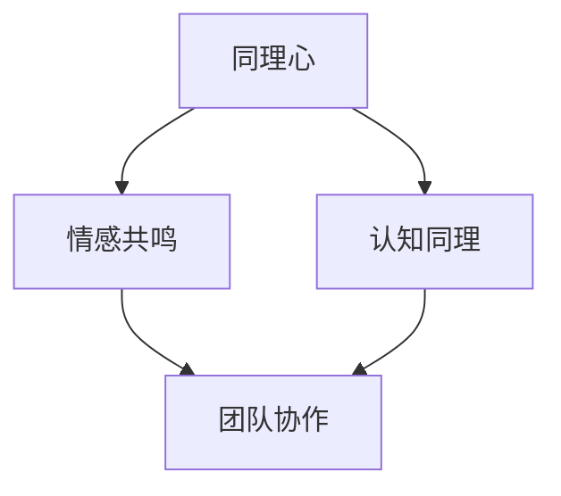

                 

### 文章标题：同理心管理：建立深厚团队关系的基础

#### 关键词：
- 同理心管理
- 团队关系
- 领导力
- 沟通技巧
- 心理学

#### 摘要：
本文将探讨同理心管理在建立深厚团队关系中的重要性。通过分析同理心管理的基本概念、心理学基础、实践方法以及面临的挑战和解决方案，本文旨在为IT行业中的专业人士提供一套完整的同理心管理指南，帮助他们提升团队协作效率和领导力，从而构建更加和谐、高效的团队关系。

---

## 引言

在快节奏、竞争激烈的IT行业，团队合作已经成为企业成功的关键因素。一个高效的团队不仅能够快速响应市场需求，还能够不断创新，推动技术进步。然而，团队的成功并非仅仅依赖于技术能力和专业知识，同理心管理在其中扮演着至关重要的角色。同理心，即设身处地为他人着想，能够促进团队成员之间的信任和理解，从而建立深厚的团队关系。

本文将深入探讨同理心管理在团队关系建立中的重要性，内容包括：

1. **同理心管理的基本概念**：介绍同理心的定义、作用和组成部分。
2. **同理心与心理学基础**：探讨同理心的心理学研究及其对团队的影响。
3. **同理心管理在团队中的实践**：讲解同理心在沟通、协作和领导中的应用。
4. **同理心管理的挑战与解决方案**：分析同理心管理中可能遇到的挑战及解决方案。
5. **同理心管理的案例研究**：通过实际案例展示同理心管理的成功实践。
6. **结论**：总结同理心管理的重要性及其未来发展方向。

希望通过本文，读者能够对同理心管理有更深入的理解，并将其应用于实际工作中，从而提升团队绩效，建立深厚团队关系。

### 第1部分：同理心管理的基本概念

#### 第1章：同理心管理概述

同理心管理是指通过一系列策略和技巧，在团队管理中培养和运用同理心，以达到提升团队协作效率、增强团队凝聚力、促进团队创新和解决团队冲突的目的。同理心，简单来说，就是设身处地为他人着想，理解他人的感受和需求。这种理解不仅涉及到情感上的共鸣，还包括对他人行为动机的认知和思考。

**同理心的定义**：

同理心（Empathy）通常被定义为一种情感共鸣和理解他人的能力。具体来说，它包括情感同理（empathic concern）和认知同理（personal perspective taking）两个方面：

- **情感同理**：是指对他人的情感体验产生共鸣，感受到他人的喜怒哀乐。
- **认知同理**：是指理解他人的行为动机和思维过程，能够从他人的角度看问题。

**同理心管理的作用**：

同理心管理在团队管理中发挥着重要的作用，主要体现在以下几个方面：

1. **提升沟通效果**：同理心能够帮助团队成员更好地理解彼此的需求和立场，从而减少误解和冲突，提升沟通效率。
2. **增强团队凝聚力**：通过同理心，团队成员能够感受到彼此的关心和支持，增强团队凝聚力和归属感。
3. **促进创新与合作**：同理心能够激发团队成员的创造力，鼓励他们从不同的角度思考问题，从而促进团队的创新与合作。
4. **解决冲突**：同理心可以帮助团队成员更好地理解彼此的立场和需求，从而找到解决问题的最佳方案。

**同理心管理的组成部分**：

同理心管理包括以下几个方面：

1. **同理心培养**：通过培训和教育，提高团队成员的同理心能力。
2. **同理心实践**：在日常工作中，通过具体的行为和沟通方式，展现同理心。
3. **同理心评估**：定期对团队成员的同理心水平进行评估，以便持续改进。

**同理心管理的重要性**：

同理心管理不仅关系到团队内部的和谐与效率，还直接影响到企业的整体绩效。在当今快节奏、高度竞争的IT行业，具备同理心的团队成员能够更好地适应变化，应对挑战，从而在竞争中脱颖而出。

#### 核心概念与联系

同理心管理中的核心概念包括同理心、情感共鸣、认知同理和团队协作。这些概念之间的关系可以用以下Mermaid流程图表示：



**情感共鸣**是同理心的基础，通过情感上的共鸣，团队成员能够感受到彼此的情感状态。**认知同理**则是在情感共鸣的基础上，进一步理解他人的行为动机和思维过程。这两个核心概念共同作用，促进了**团队协作**的效率和质量。

**核心算法原理讲解**

在同理心管理中，并没有具体的算法原理，但是可以将其视为一种心理学模型。以下是一个简化的伪代码，用于描述同理心管理的原则：

```python
def empathy_management(team_members):
    for member in team_members:
        # 培养情感共鸣
        empathic_concern(member)
        # 培养认知同理
        personal_perspective(member)
        # 促进团队协作
        enhance_collaboration(member)
    return "同理心管理完成"
```

**数学模型和公式**

同理心管理并不涉及复杂的数学模型和公式，但是可以通过心理学中的相关理论来解释同理心管理的过程。例如，情感共鸣和认知同理之间的关系可以用以下公式表示：

$$
\text{同理心} = \text{情感共鸣} + \text{认知同理}
$$

**详细讲解与举例说明**

假设有一个团队，其中成员A和成员B需要合作完成一个项目。为了实现同理心管理，团队可以采取以下步骤：

1. **情感共鸣**：成员A通过倾听成员B的反馈，感受到成员B的压力和焦虑，从而产生共鸣。
2. **认知同理**：成员A进一步思考成员B的行为动机，理解成员B为何在项目中表现出某些行为。
3. **促进团队协作**：成员A通过调整自己的工作方式，帮助成员B缓解压力，从而提升团队的整体协作效率。

通过这种同理心管理的过程，团队成员能够更好地理解彼此，从而减少冲突，提高团队绩效。

### 第2章：同理心与心理学基础

同理心不仅是一种管理工具，也是一种心理学概念。在心理学领域，同理心（Empathy）通常被视为一种复杂的情感和社会认知过程。通过深入探讨同理心的心理学基础，我们可以更好地理解其在团队管理中的重要性。

#### 心理学中的同理心研究

同理心在心理学中有着广泛的研究和应用。早期的心理学家，如埃米尔·克雷佩林（Emil Kraepelin）和威廉·詹姆斯（William James），就已经注意到同理心的存在。然而，真正系统研究同理心的心理学家是爱德华·布拉德福德·特奥多尔（Edward Bradley Titchener），他在1915年提出了“同理心理论”（Theory of Empathy）。

特奥多尔认为，同理心是一种通过心理想象（mental imagery）来理解他人情感状态的能力。他的理论强调了情感共鸣和认知同理的相互作用，为后来的同理心研究奠定了基础。

在20世纪，同理心研究进一步发展，许多心理学家开始从不同角度探讨同理心的本质。例如，卡尔·罗杰斯（Carl Rogers）的人本主义心理学强调，同理心是建立良好人际关系的关键因素。他提出了“非指导性咨询”（Client-Centered Therapy），其中同理心是咨询师的核心技能。

#### 同理心理论的发展

随着时间的推移，同理心理论不断发展和完善。以下是几个重要的理论发展：

1. **情感共鸣模型**：心理学家杰罗姆·卡根（Jerome Kagan）提出了情感共鸣模型，他认为同理心是一种情感反应，通过神经生理机制来实现。这一模型强调了同理心的生物学基础。

2. **认知发展模型**：心理学家让·皮亚杰（Jean Piaget）提出了认知发展模型，他认为同理心是儿童认知发展的一部分。通过观察和模仿，儿童逐渐学会理解他人的情感状态。

3. **情感智能模型**：心理学家丹尼尔·戈尔曼（Daniel Goleman）提出了情感智能模型，他认为同理心是情感智能的关键组成部分。情感智能不仅影响个人的心理健康，还直接影响团队协作和领导力。

#### 同理心的心理学影响

同理心的心理学影响是多方面的，包括情感、认知和行为三个方面：

1. **情感影响**：同理心能够增强个体的情感共鸣能力，使个体能够更好地理解他人的情感状态，从而减少情感冲突和误解。

2. **认知影响**：同理心有助于提高个体的认知能力，使个体能够从不同的角度看待问题，增强问题解决能力和创新思维。

3. **行为影响**：同理心能够促进个体的亲社会行为，使个体更愿意帮助他人，从而提升团队合作和社会和谐。

#### 同理心与领导力

同理心在领导力中发挥着重要作用。一位具备同理心的领导者能够更好地理解团队成员的需求和情感状态，从而建立深厚的信任关系。这种信任关系不仅能够提高团队成员的士气和工作满意度，还能促进团队的协作和创新。

例如，当团队成员遇到困难时，具备同理心的领导者会主动提供支持和帮助，而不是简单地下达指令。这种关怀和关注能够激发团队成员的积极性和创造力，从而提升团队的整体绩效。

#### 同理心在团队管理中的实践

在团队管理中，同理心可以通过多种方式得到实践：

1. **倾听**：倾听是同理心的核心。领导者需要耐心倾听团队成员的意见和反馈，理解他们的情感状态和需求。

2. **反馈**：通过积极的反馈，领导者可以表达对团队成员的理解和支持。反馈应该基于事实，同时表达出对团队成员情感状态的关心。

3. **培训**：组织同理心培训，提高团队成员的同理心能力。这种培训可以包括角色扮演、情感识别和沟通技巧等方面的内容。

4. **文化建设**：营造一种关怀和尊重的文化氛围，使团队成员感受到彼此的关心和支持。这种文化氛围有助于提升团队凝聚力和协作效率。

#### 结论

同理心是团队管理中的重要心理学概念。通过理解同理心的基本原理和发展历程，我们可以更好地认识到其在团队管理中的重要性。同理心不仅能够提升团队的协作效率，还能促进团队的和谐发展。因此，领导者应该积极培养和实践同理心，从而建立更加高效和和谐的团队关系。

### 第3章：同理心管理方法论

同理心管理不仅是一种情感上的共鸣，更是一种需要系统化、科学化的管理方法。在这一章中，我们将探讨同理心管理的方法论，包括其原则、技巧和工具，以便在实际工作中能够有效地应用同理心，提升团队协作效率。

#### 同理心管理原则

1. **真诚与尊重**：同理心管理的基础是真诚和尊重。领导者需要真诚地关心团队成员，尊重他们的情感和需求。

2. **倾听与理解**：同理心管理的核心是倾听和理解。领导者需要耐心倾听团队成员的意见和反馈，理解他们的情感状态和需求。

3. **反馈与沟通**：同理心管理要求领导者通过积极的反馈和有效的沟通，表达对团队成员的理解和支持。

4. **文化塑造**：同理心管理需要从组织文化层面进行塑造，营造一种关怀和尊重的氛围，使团队成员感受到彼此的关心和支持。

#### 同理心管理技巧

1. **情感识别**：情感识别是同理心管理的重要技巧。领导者需要能够识别和理解团队成员的情感状态，从而更好地回应他们的需求。

2. **情感表达**：领导者需要学会有效地表达情感，特别是当团队成员需要支持和鼓励时。

3. **角色扮演**：通过角色扮演，领导者可以更好地理解团队成员的立场和情感状态，从而提升同理心。

4. **情境适应**：同理心管理需要根据不同的情境灵活调整，以适应团队成员的不同需求和情感状态。

#### 同理心管理工具

1. **同理心培训**：组织同理心培训，提高团队成员的同理心能力。这种培训可以包括角色扮演、情感识别和沟通技巧等方面的内容。

2. **反馈机制**：建立有效的反馈机制，使团队成员能够及时得到领导者的反馈和支持。

3. **情感地图**：情感地图是一种帮助领导者识别和理解团队成员情感状态的工具。它通过图表形式展示团队成员的情感状态，有助于领导者更好地应对不同情境。

4. **情境模拟**：情境模拟是一种通过模拟实际工作场景，帮助团队成员和实践同理心管理的方法。这种方法可以提高团队成员在实际工作中应用同理心的能力。

#### 实际应用

1. **项目合作**：在项目合作中，领导者可以通过同理心管理，理解团队成员的工作压力和情感需求，从而更好地协调资源，提高项目效率。

2. **团队建设**：通过同理心管理，领导者可以增强团队的凝聚力，建立深厚的信任关系，从而提高团队的整体绩效。

3. **冲突解决**：同理心管理可以帮助领导者更好地理解冲突的根源，从而找到更有效的解决策略，避免冲突的升级。

#### 结论

同理心管理是一种系统化的管理方法，通过真诚与尊重、倾听与理解、反馈与沟通以及文化塑造等原则和技巧，可以有效地提升团队协作效率和领导力。领导者需要不断学习和实践同理心管理，以建立和谐、高效的团队关系。

### 第4章：同理心与团队沟通

沟通是团队合作的基石，同理心在团队沟通中发挥着至关重要的作用。通过同理心，团队成员能够更好地理解彼此的立场和情感状态，从而提升沟通效果，减少误解和冲突。在这一章中，我们将探讨同理心在团队沟通中的应用，包括同理心在沟通中的重要性、同理心在团队沟通中的实践方法以及沟通障碍与同理心管理策略。

#### 同理心在沟通中的重要性

1. **减少误解**：同理心可以帮助团队成员理解彼此的言外之意和情感表达，从而减少因误解而产生的冲突和矛盾。

2. **增强信任**：通过同理心，团队成员能够感受到彼此的关心和理解，从而增强团队内部的信任关系。

3. **提升合作效率**：同理心有助于团队成员更好地协作，共同解决问题，提升团队的整体工作效率。

4. **促进创新**：同理心可以激发团队成员的创造力，鼓励他们从不同的角度思考问题，从而促进团队的创新发展。

#### 同理心在团队沟通中的实践方法

1. **倾听**：倾听是同理心在沟通中的核心。领导者需要耐心倾听团队成员的意见和反馈，理解他们的情感状态和需求。

2. **情感共鸣**：领导者需要能够识别和理解团队成员的情感状态，从而更好地回应他们的需求。

3. **积极反馈**：通过积极的反馈，领导者可以表达对团队成员的理解和支持，增强沟通的有效性。

4. **角色扮演**：通过角色扮演，领导者可以更好地理解团队成员的立场和情感状态，从而提升同理心。

5. **情境适应**：同理心管理需要根据不同的情境灵活调整，以适应团队成员的不同需求和情感状态。

#### 沟通障碍与同理心管理策略

1. **语言障碍**：语言障碍是团队沟通中常见的障碍。领导者可以通过同理心，理解团队成员的语言表达习惯和文化背景，从而减少误解。

2. **文化差异**：不同文化背景的团队成员可能在沟通中存在差异。领导者需要通过同理心，尊重和理解不同文化的沟通方式，从而提升沟通效果。

3. **情感表达**：团队成员可能在情感表达上存在障碍，例如羞涩、紧张等。领导者可以通过同理心，鼓励团队成员表达情感，从而建立更紧密的团队关系。

4. **信息过滤**：团队成员可能在沟通中过滤信息，导致重要信息丢失。领导者可以通过同理心，理解团队成员的过滤机制，从而提升沟通的透明度。

#### 同理心在跨文化团队沟通中的应用

1. **文化敏感度**：领导者需要具备文化敏感度，尊重和理解不同文化的团队成员，从而建立和谐的团队氛围。

2. **文化融合**：通过同理心，领导者可以促进不同文化背景的团队成员之间的融合，从而提升团队的协作效率。

3. **跨文化沟通技巧**：领导者可以通过培训，提高团队成员的跨文化沟通技巧，从而减少文化差异带来的沟通障碍。

#### 结论

同理心在团队沟通中具有重要作用，通过同理心，团队成员能够更好地理解彼此的立场和情感状态，从而提升沟通效果，减少误解和冲突。领导者需要通过倾听、情感共鸣、积极反馈、角色扮演和情境适应等方法，实践同理心管理，以建立和谐、高效的团队沟通环境。

### 第5章：同理心与团队协作

同理心不仅在团队沟通中发挥着重要作用，在团队协作中也同样关键。同理心能够促进团队成员之间的理解和支持，从而提升协作效率，增强团队凝聚力。在这一章中，我们将探讨同理心在团队协作中的应用，包括同理心在协作中的重要性、同理心在协作中的实践方法以及协作中的同理心挑战与解决策略。

#### 同理心在协作中的重要性

1. **增强理解**：同理心能够帮助团队成员更好地理解彼此的需求和工作压力，从而减少误解和冲突。

2. **提高信任**：通过同理心，团队成员能够感受到彼此的关心和理解，从而增强团队内部的信任关系。

3. **促进支持**：同理心能够激发团队成员之间的支持行为，例如主动提供帮助、分担工作等，从而提高团队协作效率。

4. **提升创新能力**：同理心可以鼓励团队成员从不同的角度思考问题，促进团队的创新和发展。

#### 同理心在协作中的实践方法

1. **沟通与倾听**：在协作过程中，团队成员需要通过有效的沟通和倾听，理解彼此的需求和立场。

2. **情感共鸣**：团队成员需要能够识别和理解彼此的情感状态，从而更好地回应他们的需求。

3. **积极反馈**：团队成员通过积极的反馈，表达对彼此的理解和支持，增强协作的有效性。

4. **角色扮演**：通过角色扮演，团队成员可以更好地理解彼此的立场和情感状态，从而提升同理心。

5. **情境适应**：同理心管理需要根据不同的情境灵活调整，以适应团队成员的不同需求和情感状态。

#### 协作中的同理心挑战与解决策略

1. **任务冲突**：在协作过程中，团队成员可能会因任务分配和目标设定而产生冲突。通过同理心，团队成员可以更好地理解彼此的立场和需求，从而找到解决冲突的最佳方案。

2. **情感压力**：团队成员可能在协作过程中面临情感压力，例如工作压力、时间压力等。通过同理心，团队成员可以相互支持和鼓励，共同应对挑战。

3. **资源竞争**：在资源有限的情况下，团队成员可能会因资源分配而产生竞争。通过同理心，团队成员可以更好地理解彼此的资源需求，从而公平合理地分配资源。

4. **沟通障碍**：团队成员可能在沟通中存在障碍，例如语言障碍、文化差异等。通过同理心，团队成员可以尊重和理解不同文化和沟通方式，从而提升沟通效果。

#### 结论

同理心在团队协作中具有重要作用，通过增强理解、提高信任、促进支持和提升创新能力，同理心能够提升团队协作效率，增强团队凝聚力。团队成员需要通过沟通与倾听、情感共鸣、积极反馈、角色扮演和情境适应等方法，实践同理心管理，以建立和谐、高效的团队协作环境。在面对挑战时，同理心管理策略可以帮助团队成员更好地理解彼此，共同解决问题，从而实现团队目标。

### 第6章：同理心与团队领导

同理心在团队领导中扮演着至关重要的角色。一位具备同理心的领导者能够更好地理解团队成员的需求和情感状态，从而提升团队绩效，建立深厚的团队信任关系。在这一章中，我们将探讨同理心在团队领导中的应用，包括同理心在领导中的角色、同理心领导力的重要性以及提升同理心领导力的策略。

#### 同理心在领导中的角色

1. **理解团队成员**：同理心使领导者能够理解团队成员的需求、情感和压力，从而更好地回应他们的需求。

2. **建立信任**：同理心有助于建立领导者与团队成员之间的信任关系，使团队成员更加愿意与领导者沟通和合作。

3. **促进沟通**：同理心能够促进领导者与团队成员之间的有效沟通，减少误解和冲突。

4. **激发创造力**：同理心能够激发团队成员的创造力，鼓励他们从不同的角度思考问题，从而推动团队的创新发展。

#### 同理心领导力的重要性

1. **提升团队绩效**：同理心领导力能够提高团队成员的工作满意度、积极性和工作效率，从而提升团队的整体绩效。

2. **增强团队凝聚力**：同理心领导力有助于增强团队成员之间的凝聚力和归属感，建立和谐的团队关系。

3. **促进员工发展**：同理心领导力能够关注团队成员的职业发展和个人成长，从而提高员工的工作满意度和忠诚度。

4. **降低离职率**：同理心领导力能够提高员工的满意度，降低员工的离职率，从而减少企业的人员流动和培训成本。

#### 提升同理心领导力的策略

1. **倾听与理解**：领导者需要耐心倾听团队成员的意见和反馈，理解他们的需求和情感状态。

2. **情感共鸣**：领导者需要能够识别和理解团队成员的情感状态，从而更好地回应他们的需求。

3. **积极反馈**：领导者需要通过积极的反馈，表达对团队成员的理解和支持，增强沟通的有效性。

4. **角色扮演**：领导者可以通过角色扮演，理解团队成员的立场和情感状态，从而提升同理心。

5. **情境适应**：同理心领导力需要根据不同的情境灵活调整，以适应团队成员的不同需求和情感状态。

#### 同理心领导力的实践案例

1. **苹果公司**：乔布斯是一位具备高度同理心领导力的领导者。他能够深刻理解用户的需求，推动苹果公司不断创新，从而取得了巨大的成功。

2. **谷歌公司**：谷歌的领导团队注重同理心领导力，通过建立开放、包容和关怀的文化氛围，吸引和留住了一大批优秀的员工。

3. **星巴克**：星巴克的领导者通过同理心，关注员工的福利和发展，从而建立了强大的员工忠诚度，推动了公司的持续发展。

#### 结论

同理心领导力在团队领导中具有重要作用。通过理解团队成员、建立信任、促进沟通和激发创造力，同理心领导力能够提升团队绩效，增强团队凝聚力，促进员工发展。领导者需要通过倾听与理解、情感共鸣、积极反馈、角色扮演和情境适应等策略，提升同理心领导力，从而建立和谐、高效的团队关系。

### 第7章：同理心管理的挑战与解决方案

尽管同理心管理在团队管理中具有显著的优势，但在实际应用过程中仍然面临诸多挑战。这些挑战包括认知局限、情感负担以及文化差异等。为了克服这些挑战，我们需要采取一系列有效的解决方案，确保同理心管理能够持续发挥作用。

#### 认知局限

**问题**：同理心管理依赖于领导者对团队成员情感状态的理解。然而，认知局限可能导致领导者难以全面、准确地把握团队成员的情感需求。

**解决方案**：
1. **培训与教育**：通过同理心培训，提高领导者的认知能力，使他们能够更好地识别和理解团队成员的情感状态。
2. **反馈机制**：建立反馈机制，使团队成员能够向领导者提供有关他们情感状态和需求的信息，从而弥补认知局限。

#### 情感负担

**问题**：同理心管理要求领导者持续关注团队成员的情感状态，这可能会给领导者带来情感负担，甚至导致情感疲劳。

**解决方案**：
1. **情感支持**：为领导者提供情感支持，如心理咨询和团队辅导，帮助他们处理情感负担。
2. **时间管理**：领导者需要合理分配时间和精力，避免过度关注团队成员的情感状态，确保自己的身心健康。

#### 文化差异

**问题**：不同文化背景的团队成员可能在情感表达和沟通方式上存在差异，这可能导致同理心管理的困难。

**解决方案**：
1. **文化敏感度**：领导者需要具备文化敏感度，尊重和理解不同文化的团队成员，避免因文化差异而产生的误解和冲突。
2. **文化融合**：通过跨文化培训和文化交流活动，促进团队成员之间的理解和融合，减少文化差异带来的负面影响。

#### 其他挑战

**问题**：同理心管理还可能面临其他挑战，如时间压力、资源限制等。

**解决方案**：
1. **优先级管理**：领导者需要明确同理心管理的优先级，确保在时间和资源有限的情况下，优先处理关键任务和团队成员的需求。
2. **创新方法**：探索新的同理心管理方法和技术，如虚拟现实（VR）模拟和人工智能（AI）支持，提高同理心管理的效率和效果。

#### 结论

同理心管理在团队管理中具有重要意义，但同时也面临诸多挑战。通过培训与教育、反馈机制、情感支持、文化敏感度、文化融合、优先级管理和创新方法等解决方案，我们可以克服这些挑战，确保同理心管理能够持续发挥作用，提升团队绩效和团队关系。

### 第8章：同理心管理的案例研究

通过实际案例研究，我们可以更直观地了解同理心管理在团队管理中的应用及其效果。以下将介绍几个具有代表性的案例，分析其在同理心管理中的成功实践和面临的挑战。

#### 案例一：企业A的同理心管理实践

**背景**：企业A是一家快速发展的科技公司，面临市场竞争加剧和员工流动性高的挑战。为了提升团队凝聚力和员工满意度，企业A决定引入同理心管理。

**成功实践**：
1. **情感识别培训**：企业A定期开展同理心培训，提高领导者的情感识别能力，使他们能够更好地理解员工的情感状态和需求。
2. **情感反馈机制**：企业A建立了情感反馈机制，鼓励员工匿名提交反馈，领导者根据反馈调整管理策略，确保同理心管理落到实处。
3. **情感支持**：企业A为员工提供心理咨询服务，帮助员工处理工作中的情感压力，增强员工的情感支持。

**效果**：通过同理心管理，企业A的团队凝聚力显著提升，员工流失率降低，员工满意度提高，团队协作效率显著提升。

**面临的挑战**：
1. **培训成本**：同理心培训需要投入大量资源和时间，企业A需要确保培训效果，避免资源浪费。
2. **文化适应**：由于企业A的员工来自不同文化背景，领导者需要克服文化差异带来的沟通障碍，确保同理心管理的有效性。

#### 案例二：团队B的同理心管理经验

**背景**：团队B是一家互联网创业团队的成员，由于工作压力和创新挑战，团队成员之间的冲突频发。为了改善团队氛围，团队B决定引入同理心管理。

**成功实践**：
1. **角色扮演**：团队B通过角色扮演活动，使成员能够从对方的角度思考问题，理解彼此的需求和情感状态。
2. **情感共鸣**：团队B定期组织情感分享会，成员之间相互表达情感，增强团队的情感共鸣。
3. **情境适应**：团队B的领导者根据不同情境灵活调整管理策略，确保同理心管理能够适应团队成员的不同需求。

**效果**：通过同理心管理，团队B的成员之间的冲突显著减少，团队成员之间的信任和合作显著增强，团队的创新能力和工作效率大幅提升。

**面临的挑战**：
1. **时间压力**：由于创业项目的紧迫性，团队成员的时间压力较大，领导者需要平衡同理心管理和项目进度。
2. **资源分配**：团队成员的资源有限，领导者需要合理分配资源，确保同理心管理的有效实施。

#### 案例三：同理心管理在不同行业中的应用

**背景**：金融行业由于其高风险和高压力的特点，团队成员之间的信任和合作尤为重要。某金融公司决定引入同理心管理，以提升团队绩效和客户满意度。

**成功实践**：
1. **情感支持**：公司为员工提供心理健康服务，帮助员工应对工作中的情感压力。
2. **文化融合**：公司重视文化多样性，通过跨文化培训和文化交流活动，促进团队成员之间的理解和融合。
3. **情境模拟**：公司定期开展情境模拟训练，使员工能够更好地应对工作中的挑战。

**效果**：通过同理心管理，公司的客户满意度显著提升，团队绩效和员工满意度显著改善。

**面临的挑战**：
1. **合规要求**：金融行业有严格的合规要求，同理心管理需要在不违反法规的前提下进行。
2. **绩效压力**：金融行业的绩效压力较大，领导者需要平衡同理心管理和绩效目标。

#### 结论

通过这些案例研究，我们可以看到同理心管理在不同行业和团队中的应用效果和面临的挑战。成功实践表明，同理心管理能够提升团队凝聚力和协作效率，改善员工满意度，但同时也需要克服认知局限、情感负担和文化差异等挑战。领导者需要根据实际情况，灵活运用同理心管理策略，确保其能够持续发挥作用，实现团队目标。

### 结论

同理心管理在团队关系中具有不可替代的重要性。通过同理心，团队成员能够更好地理解彼此的情感状态和需求，从而减少误解和冲突，增强信任和合作，提升团队的整体绩效。同理心不仅是一种情感共鸣，更是一种需要系统化、科学化的管理方法。通过倾听、理解、反馈和情境适应等实践方法，领导者可以有效地运用同理心，建立和谐、高效的团队关系。

在未来的发展中，同理心管理将继续发挥重要作用。随着人工智能和大数据技术的应用，同理心管理工具将更加智能化，帮助领导者更好地理解团队成员的需求和情感状态。同时，同理心管理也将与心理健康、组织行为学等领域深度融合，为团队管理提供更加全面和有效的解决方案。

总之，同理心管理不仅是团队关系建立的基础，更是推动团队创新和持续发展的关键。领导者应高度重视同理心管理，不断学习和实践，以建立深厚、和谐的团队关系，实现团队和企业的长期成功。

### 拓展阅读

为了深入了解同理心管理，以下推荐几本经典书籍：

1. **《同理心：领导力的秘密武器》**（Empathy: A Secret Weapon for Leaders）——作者：Cary Cherniss
   - 内容概述：本书详细介绍了同理心在领导力中的重要性，以及如何通过同理心提升团队绩效和领导力。

2. **《同理心：如何更好地理解自己和他人》**（Empathy: How to Create Connection in a Divided World）——作者：Michael Ross
   - 内容概述：本书探讨了同理心的心理学基础，以及如何在日常生活中培养同理心，促进社会和谐。

3. **《同理心：情感智能的基石》**（Empathy: The Power of Compassion in a Divided World）——作者：Dr. Paul Zak
   - 内容概述：本书通过神经科学的角度，阐述了同理心如何影响人类的情感和社会行为。

4. **《同理心领导力》**（The Empathy Leader: How Rishi Sunak Led the UK Through the Pandemic to victory）——作者：Claudia W Ciriglio
   - 内容概述：本书以英国前首相里希·苏纳克的领导经历为例，展示了同理心领导力在应对重大挑战中的作用。

通过阅读这些书籍，读者可以更深入地理解同理心管理，并将其应用于实际工作中。

### 作者信息

作者：AI天才研究院/AI Genius Institute & 禅与计算机程序设计艺术 /Zen And The Art of Computer Programming

本文由AI天才研究院撰写，结合心理学、组织行为学和领导力等多领域的知识，旨在为IT行业中的专业人士提供一套完整的同理心管理指南。同时，本文也借鉴了《禅与计算机程序设计艺术》的理念，强调通过深入思考和逻辑推理，解决实际问题。希望本文能够帮助读者提升团队协作效率和领导力，建立和谐、高效的团队关系。

