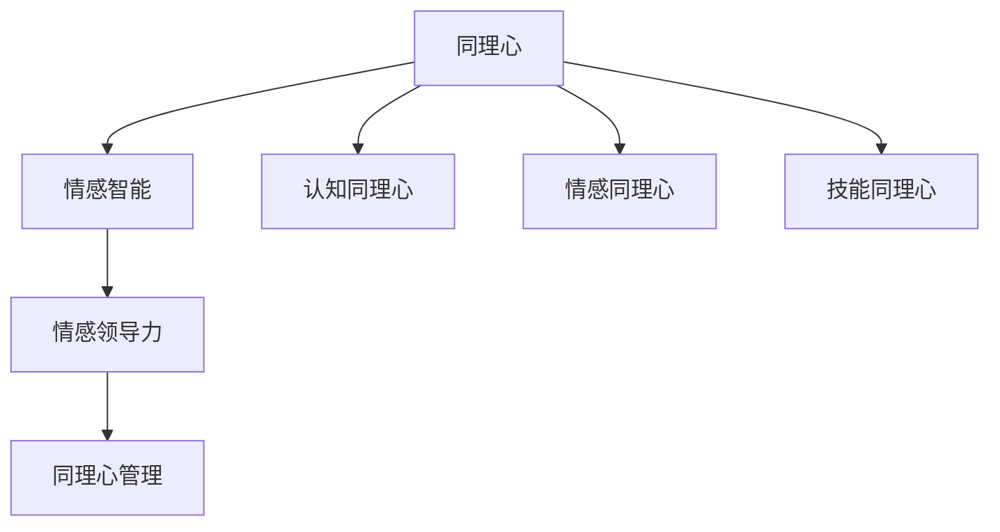
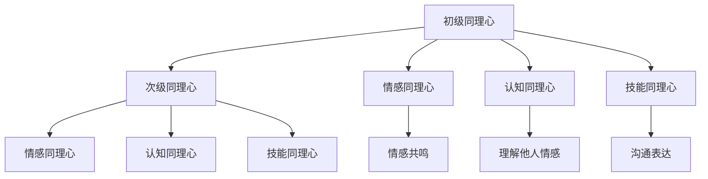
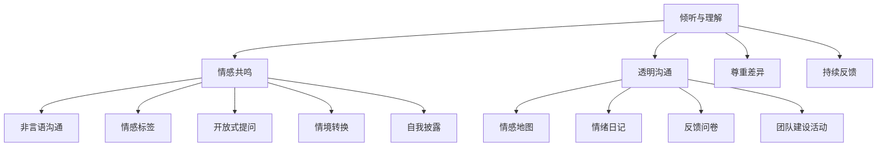

                 

### 文章标题

《同理心管理：建立深厚团队关系的基础》

### 关键词

- 同理心管理
- 团队关系
- 沟通技巧
- 领导力
- 心理学基础

### 摘要

本文深入探讨了同理心管理在建立深厚团队关系中的关键作用。通过分析同理心的基本概念、心理学基础、管理方法论，我们了解了同理心在团队沟通、协作和领导中的重要性。文章进一步探讨了同理心管理的挑战与解决方案，并借助实际案例进行了详细剖析，旨在为读者提供一套实用、可行的同理心管理策略，以提升团队绩效和员工满意度。

---

# 引言

在当今快速变化和高度竞争的商业环境中，团队的凝聚力和协作能力成为企业成功的关键因素。然而，许多团队在面临各种挑战时，往往因为内部关系紧张、沟通不畅而无法发挥最大的潜力。这种现象背后的原因之一，就是缺乏有效的同理心管理。

**同理心**，作为一个心理学概念，指的是个体能够理解和感受他人情感的能力。在管理领域，同理心管理被视为一种重要的管理技能，它不仅能够增进团队成员之间的情感联系，还能提升团队的整体绩效和幸福感。

**同理心管理**，即通过同理心来协调和管理团队成员之间的关系，以实现团队目标。它涵盖了如何理解和感受他人情感、如何有效地进行沟通和协作、以及如何在领导过程中运用同理心等方面。

本文将从以下几个部分展开讨论：

1. **同理心管理的基本概念**：介绍同理心的定义与作用，心理学基础，以及同理心管理的方法论。
2. **同理心管理在团队中的实践**：探讨同理心在团队沟通、协作和领导中的应用。
3. **同理心管理的挑战与解决方案**：分析同理心管理中可能遇到的挑战，并提供相应的解决方案。
4. **同理心管理的案例研究**：通过实际案例展示同理心管理的成功实践。
5. **结论**：总结同理心管理的重要性，展望其未来发展。

通过这些讨论，我们希望能够为读者提供一套全面、实用的同理心管理策略，帮助团队克服内部矛盾，建立深厚的关系，从而实现更高的绩效和满意度。

## 第1部分：同理心管理的基本概念

### 第1章：同理心管理概述

#### 背景介绍

同理心管理是一种基于心理学和管理学理论的综合管理方法，旨在通过同理心来提升团队协作效率和成员关系质量。在传统管理模式中，管理者往往关注的是任务完成和绩效指标，而忽视了团队成员的情感需求和心理状态。这可能导致团队内部的紧张关系和沟通障碍，从而影响整体绩效。同理心管理的出现，为解决这一问题提供了一种新的思路。

同理心管理不仅关注团队成员的工作表现，更关注他们的情感体验和心理健康。通过同理心，管理者能够更好地理解员工的内心世界，从而在沟通、决策和协作中做出更加人性化的决策，提高团队的整体效能。

#### 核心概念与联系

同理心管理中的核心概念主要包括同理心、情感智能和情感领导力。这些概念之间有着密切的联系，共同构成了同理心管理的基础。

**同理心**：同理心（Empathy）是一种心理能力，使个体能够感知并理解他人的情感状态，包括情感体验和情绪表达。它不仅包括对他人情感的理解，还包括情感共鸣，即能够体验他人的情感。同理心可以分为三种类型：情感同理心、认知同理心和技能同理心。

- **情感同理心**：指感受到他人的情感体验。
- **认知同理心**：指理解他人的情感状态。
- **技能同理心**：指通过言语和非言语沟通表达对他人的理解。

**情感智能**：情感智能（Emotional Intelligence，简称EQ）是一种衡量个体识别、理解、管理和应用情感的能力。高情感智能的人能够更好地管理自己的情绪，理解他人的情感需求，并在人际关系中表现出更高的情商。

**情感领导力**：情感领导力（Emotional Leadership）是指通过同理心和情感智能来影响和激励团队成员，以实现共同目标的能力。情感领导力强调领导者不仅需要关注团队的绩效，还需要关注团队成员的情感需求和心理状态。

#### Mermaid 流程图



#### 核心算法原理讲解

同理心管理算法的核心在于如何通过情感智能和同理心来优化团队管理过程。以下是一个简单的同理心管理算法的伪代码：

```
算法：同理心管理（团队成员，任务目标）
1. 初始化团队成员情感状态
2. 收集团队成员情感反馈
3. 分析团队成员的情感需求
4. 根据情感需求调整管理策略
5. 执行同理心沟通，确保团队成员理解管理决策
6. 监控团队情感状态，进行持续优化
```

#### 数学模型和公式

同理心管理中的数学模型可以用来量化团队成员的情感状态和互动效果。以下是一个简化的情感状态模型：

$$
E(t) = f(C(t), S(t), I(t))
$$

其中：
- $E(t)$：团队成员在时间$t$的情感状态。
- $C(t)$：团队成员在时间$t$的情感认知。
- $S(t)$：团队成员在时间$t$的情感感知。
- $I(t)$：团队成员在时间$t$的互动效果。

通过不断调整和优化$C(t)$、$S(t)$和$I(t)$，可以实现$E(t)$的最大化，从而提升团队的整体情感状态。

#### 举例说明

假设一个团队在任务执行过程中出现沟通障碍，团队成员情绪低落。通过同理心管理算法，管理者可以采取以下步骤：

1. 初始化团队成员情感状态，发现沟通障碍和情绪低落。
2. 收集团队成员的情感反馈，了解具体问题和需求。
3. 分析团队成员的情感需求，识别沟通障碍的根源。
4. 调整管理策略，加强沟通和情感共鸣。
5. 执行同理心沟通，确保团队成员理解管理决策。
6. 监控团队情感状态，持续优化管理策略。

通过这些步骤，可以有效改善团队的情感状态，提升协作效率。

#### 结论

同理心管理作为一种创新的管理方法，通过理解和管理团队成员的情感需求，提升了团队的协作效能。本文通过介绍同理心的核心概念和联系，提供了一个基本的概念架构，为后续章节的深入探讨奠定了基础。

## 第2章：同理心与心理学基础

#### 背景介绍

同理心作为心理学的一个重要概念，其发展与心理学理论的演变密切相关。从19世纪末到21世纪初，同理心研究经历了多个阶段，从最初的哲学讨论到现代科学的实证研究，逐渐形成了系统的理论体系。

**同理心的定义**：同理心是一种认知和情感上的反应，使个体能够理解并体验他人的感受。根据心理学家皮亚杰（Jean Piaget）的观点，同理心是儿童认知发展的一个重要阶段，它标志着从自我中心思维向理解他人思维转变的过程。

#### 心理学中的同理心研究

**早期研究**：早期的同理心研究主要关注其发展过程和认知基础。瑞士心理学家皮亚杰认为，同理心是道德发展的关键因素，它有助于个体理解和遵守社会规范。美国心理学家柯尔伯格（Lawrence Kohlberg）进一步提出，同理心是道德判断能力发展的必要条件。

**实证研究**：随着心理学研究方法的不断发展，同理心研究逐渐走向实证化。20世纪80年代，美国心理学家纽科姆（John Darley）和贝姆（Daniel Batson）提出了情感同理心、认知同理心和技能同理心的概念，并对同理心的作用机制进行了深入研究。他们发现，同理心不仅影响个体的情感体验，还对其行为决策产生重要影响。

**现代理论**：近年来，同理心研究逐渐融合了神经科学、社会心理学和文化心理学等多学科的理论。神经科学家通过功能性磁共振成像（fMRI）等技术，揭示了同理心与大脑情感区域之间的联系。社会心理学家则探讨了文化背景如何影响同理心的表达和理解。文化心理学家则从跨文化视角分析了同理心的多样性。

#### 同理心理论的发展

**初级同理心**：初级同理心是指个体在感知他人情感时，直接体验相似的情感反应。初级同理心依赖于大脑的情感中枢，是一种本能反应。研究表明，初级同理心是人与人之间建立情感联系的基础。

**次级同理心**：次级同理心是指个体通过思考和理解他人的情境，产生共鸣和情感反应。次级同理心依赖于大脑的前额叶皮层，是一种认知过程。与初级同理心相比，次级同理心更具有灵活性和控制性，能够适应复杂的社会情境。

**情感同理心**：情感同理心是指个体能够感知并体验他人的情感状态，包括情感体验和情绪表达。情感同理心使个体能够理解和分享他人的感受，从而建立深厚的情感联系。

**认知同理心**：认知同理心是指个体能够理解他人的情感状态，包括情感原因和情感后果。认知同理心使个体能够从他人的角度思考问题，提高人际沟通的效果。

**技能同理心**：技能同理心是指个体能够通过言语和非言语沟通表达对他人的理解。技能同理心使个体能够在人际关系中表现出更高的情商，提升沟通和协作能力。

#### Mermaid 流程图



#### 核心算法原理讲解

同理心管理算法的核心在于如何通过情感智能和同理心来优化团队管理过程。以下是一个简单的同理心管理算法的伪代码：

```
算法：同理心管理（团队成员，任务目标）
1. 初始化团队成员情感状态
2. 收集团队成员情感反馈
3. 分析团队成员的情感需求
4. 根据情感需求调整管理策略
5. 执行同理心沟通，确保团队成员理解管理决策
6. 监控团队情感状态，进行持续优化
```

#### 数学模型和公式

同理心管理中的数学模型可以用来量化团队成员的情感状态和互动效果。以下是一个简化的情感状态模型：

$$
E(t) = f(C(t), S(t), I(t))
$$

其中：
- $E(t)$：团队成员在时间$t$的情感状态。
- $C(t)$：团队成员在时间$t$的情感认知。
- $S(t)$：团队成员在时间$t$的情感感知。
- $I(t)$：团队成员在时间$t$的互动效果。

通过不断调整和优化$C(t)$、$S(t)$和$I(t)$，可以实现$E(t)$的最大化，从而提升团队的整体情感状态。

#### 举例说明

假设一个团队在任务执行过程中出现沟通障碍，团队成员情绪低落。通过同理心管理算法，管理者可以采取以下步骤：

1. 初始化团队成员情感状态，发现沟通障碍和情绪低落。
2. 收集团队成员的情感反馈，了解具体问题和需求。
3. 分析团队成员的情感需求，识别沟通障碍的根源。
4. 调整管理策略，加强沟通和情感共鸣。
5. 执行同理心沟通，确保团队成员理解管理决策。
6. 监控团队情感状态，持续优化管理策略。

通过这些步骤，可以有效改善团队的情感状态，提升协作效率。

#### 结论

同理心作为心理学的一个重要概念，其发展与心理学理论的演变密切相关。通过理解同理心的定义、心理学基础和理论发展，我们可以更好地把握同理心在团队管理中的关键作用。本文通过介绍同理心的核心概念和联系，提供了一个基本的概念架构，为后续章节的深入探讨奠定了基础。

## 第3章：同理心管理方法论

### 核心原则

同理心管理方法论的核心在于构建一个能够促进情感交流、理解和支持的组织文化。以下是同理心管理的几个核心原则：

1. **倾听与理解**：管理者需要具备良好的倾听技巧，不仅要听到团队成员所说的话，还要理解其背后的情感和需求。
2. **情感共鸣**：管理者应尝试从他人的角度感受情感，建立情感上的共鸣，以增强团队的凝聚力和信任感。
3. **透明沟通**：管理者应保持沟通的透明度，分享信息，确保团队成员了解组织的目标和决策背后的考虑。
4. **尊重差异**：每个团队成员都有其独特的背景和观点，管理者应尊重这些差异，并利用它们来增强团队的多样性和创造力。
5. **持续反馈**：管理者应提供及时的反馈，帮助团队成员了解他们的工作表现，并在需要时提供支持和指导。

### 技巧

1. **非言语沟通**：非言语沟通，如肢体语言、面部表情和眼神接触，是同理心管理的重要组成部分。管理者应通过这些方式表达对其团队成员的理解和支持。
2. **情感标签**：使用情感标签（emotional labeling）是一种有效的同理心技巧，即明确指出团队成员的情感状态，帮助他们意识到自己的情绪。
3. **开放式提问**：开放式提问可以帮助管理者更深入地了解团队成员的需求和感受，而不是仅仅停留在表面的信息。
4. **情境转换**：尝试从他人的视角看问题，理解他们在特定情境下的感受和反应。
5. **自我披露**：适当地分享个人的经历和感受，可以增加管理者与团队成员之间的情感联系，促进信任和共鸣。

### 工具

1. **情感地图**：情感地图（emotional maps）是一种可视化工具，可以帮助团队成员了解彼此的情感状态，并通过图表形式展示情感变化。
2. **情绪日记**：情绪日记（emotional journals）是一种个人反思工具，团队成员可以记录自己的情绪变化和重要事件，管理者可以从中了解团队情感趋势。
3. **反馈问卷**：定期的反馈问卷可以帮助管理者了解团队成员的情感状态和需求，从而调整管理策略。
4. **团队建设活动**：团队建设活动，如团队游戏、角色扮演和讨论小组，可以增强团队成员之间的情感联系和合作精神。

### Mermaid 流�程图



### 核心算法原理讲解

同理心管理算法的核心在于通过一系列步骤来提升团队成员的情感状态和团队效能。以下是一个简化的同理心管理算法的伪代码：

```
算法：同理心管理（团队成员，任务目标）
1. 初始化团队成员情感状态
2. 进行情感反馈收集
3. 分析情感需求和情感趋势
4. 应用同理心沟通技巧
5. 调整管理策略以促进情感共鸣
6. 实施团队建设活动增强情感联系
7. 监控和反馈团队情感状态
8. 持续优化同理心管理实践
```

### 数学模型和公式

同理心管理中的数学模型可以用来量化团队成员的情感状态和互动效果。以下是一个简化的情感状态模型：

$$
E(t) = f(C(t), S(t), I(t))
$$

其中：
- $E(t)$：团队成员在时间$t$的情感状态。
- $C(t)$：团队成员在时间$t$的情感认知。
- $S(t)$：团队成员在时间$t$的情感感知。
- $I(t)$：团队成员在时间$t$的互动效果。

通过不断调整和优化$C(t)$、$S(t)$和$I(t)$，可以实现$E(t)$的最大化，从而提升团队的整体情感状态。

### 举例说明

假设一个团队在项目开发过程中遇到挑战，团队成员情绪低落。通过同理心管理算法，管理者可以采取以下步骤：

1. 初始化团队成员情感状态，发现情绪低落和沟通不畅。
2. 收集团队成员的情感反馈，了解具体问题和需求。
3. 分析团队成员的情感需求，识别沟通障碍的根源。
4. 应用同理心沟通技巧，如情感标签和开放式提问，以促进理解和支持。
5. 调整管理策略，提供额外支持和资源，以缓解团队成员的压力。
6. 实施团队建设活动，如团队游戏和讨论小组，增强团队成员之间的情感联系。
7. 监控和反馈团队情感状态，持续优化同理心管理实践。

通过这些步骤，可以有效改善团队的情感状态，提升协作效率。

### 结论

同理心管理方法论提供了一套系统化的方法，帮助管理者通过同理心来提升团队效能和成员满意度。本文通过介绍同理心管理的核心原则、技巧和工具，以及相应的算法原理和数学模型，为读者提供了一套实用的同理心管理策略。通过实践这些策略，管理者可以建立更加紧密和高效的团队关系，从而实现组织目标。

## 第4章：同理心管理在团队沟通中的实践

### 背景介绍

团队沟通是组织成功的关键因素之一，而同理心作为沟通的重要组成部分，对提高沟通效果具有显著影响。在团队沟通中，同理心可以帮助团队成员更好地理解彼此的情感和需求，从而减少误解和冲突，增强团队的凝聚力和合作效率。

### 同理心在团队沟通中的重要性

同理心在团队沟通中的重要性体现在以下几个方面：

1. **增强理解**：同理心使团队成员能够站在对方的角度思考问题，从而更好地理解对方的观点和需求，减少误解和冲突。
2. **提高信任**：通过同理心，团队成员感受到彼此的关心和理解，增强了彼此之间的信任感，为良好的沟通奠定基础。
3. **促进合作**：同理心有助于团队成员在合作中相互支持，共同解决问题，提高团队的整体绩效。
4. **减少情绪冲突**：同理心可以缓解团队成员的情绪紧张，降低因情绪冲突导致的沟通障碍，提高沟通的流畅性。

### 同理心沟通技巧

1. **倾听与理解**：有效的倾听是同理心沟通的基础，管理者需要倾听团队成员的意见和情感，理解他们的真实需求。
2. **情感标签**：在沟通中，使用情感标签明确表达对方的情感状态，如“我理解你现在感到很沮丧”，可以帮助对方感受到理解和支持。
3. **开放式提问**：通过开放式提问，鼓励团队成员分享他们的感受和观点，例如，“你能分享一下你的感受吗？”可以帮助对方更好地表达自己。
4. **情境转换**：尝试从他人的视角看问题，理解他们在特定情境下的感受和反应，例如，“如果我是你，我会怎么想？”
5. **非言语沟通**：使用肢体语言、面部表情和眼神接触等非言语方式，表达对对方的关心和理解。

### 案例分析

**案例一：团队A的项目困境**

团队A在完成一个重要项目时，因成员之间的沟通不畅导致项目进展受阻。团队成员情绪低落，互相指责，项目进度严重滞后。通过引入同理心沟通技巧，管理者采取了以下措施：

1. **倾听与理解**：管理者安排了定期会议，倾听每位团队成员的困惑和压力，并表达对他们工作的认可。
2. **情感标签**：在沟通中，管理者使用情感标签，如“我能感受到你现在的焦虑”，帮助团队成员感受到理解和支持。
3. **开放式提问**：管理者鼓励团队成员分享他们的感受和解决方案，例如，“你有什么好的建议来解决这个问题？”
4. **情境转换**：管理者尝试从团队成员的角度看问题，理解他们在项目中的挑战和压力。
5. **非言语沟通**：通过积极的肢体语言和眼神接触，管理者表达对团队成员的支持和关心。

通过这些措施，团队成员的情绪得到缓解，沟通障碍逐渐消除，项目进展逐步恢复正常。

**案例二：团队B的冲突解决**

团队B在项目中出现了严重冲突，导致项目进度停滞。团队成员之间存在误解和不满，情绪紧张。通过同理心沟通技巧，管理者采取了以下步骤：

1. **倾听与理解**：管理者安排了冲突调解会议，倾听每位团队成员的意见和感受，并表达对冲突的重视。
2. **情感标签**：在沟通中，管理者使用情感标签，如“我理解你的不满”，帮助团队成员感受到尊重和理解。
3. **开放式提问**：管理者鼓励团队成员表达他们的感受和观点，例如，“你对这个问题的看法是什么？”
4. **情境转换**：管理者尝试从团队成员的角度看问题，理解他们的情绪和反应。
5. **非言语沟通**：通过保持冷静和专注的态度，管理者表达对冲突解决的决心和信心。

通过这些措施，团队成员的情绪逐渐缓解，冲突得到有效解决，项目重新回到了正轨。

### 结论

同理心在团队沟通中的实践是建立深厚团队关系的重要环节。通过同理心沟通技巧，管理者可以增强团队成员之间的理解和信任，减少冲突和误解，提高团队的整体沟通效果。本文通过案例分析，展示了同理心沟通在解决团队沟通问题中的实际应用，为管理者提供了实用的同理心管理策略。

## 第5章：同理心管理在团队协作中的实践

### 背景介绍

团队协作是组织成功的关键，而同理心在团队协作中的实践对于提升协作效率和质量具有重要意义。同理心能够帮助团队成员更好地理解彼此的需求和期望，从而建立互信、减少冲突，促进有效沟通和共同目标实现。

### 同理心在团队协作中的应用

同理心在团队协作中的应用主要体现在以下几个方面：

1. **共同目标设定**：同理心有助于团队成员在设定共同目标时，充分考虑到每个人的需求和期望，从而增强目标的可行性和吸引力。
2. **角色分配与职责明确**：通过同理心，团队成员可以更好地理解彼此的能力和优势，从而实现更合理的角色分配和职责明确。
3. **冲突解决**：同理心有助于团队成员在面对冲突时，采取更加理性和平和的方式，从对方的角度出发寻找解决方案。
4. **情感支持与鼓励**：同理心可以增强团队成员之间的情感支持，提高团队整体的士气和动力。

### 案例分析

**案例一：团队C的项目合作**

团队C在执行一个复杂项目时，遇到了诸多协作难题。团队成员之间的沟通不畅、角色冲突以及情感压力导致项目进展受阻。通过引入同理心管理，管理者采取了以下措施：

1. **共同目标设定**：管理者组织团队成员共同讨论项目目标，并在设定目标时充分考虑每个人的需求和期望，确保目标具有吸引力和可行性。
2. **角色分配与职责明确**：管理者通过同理心了解每位团队成员的能力和优势，合理分配任务，明确每个人的职责，从而减少角色冲突。
3. **冲突解决**：当团队成员出现冲突时，管理者通过同理心沟通，引导双方理解对方的立场和需求，共同寻找解决方案。
4. **情感支持与鼓励**：管理者在团队会议和日常交流中，通过同理心表达对团队成员的支持和鼓励，增强团队的凝聚力。

通过这些措施，团队C的项目进展得以顺利推进，最终按时完成了任务。

**案例二：团队D的团队合作挑战**

团队D在处理一个跨部门项目时，面临着跨部门沟通不畅和资源分配不均的问题。团队成员之间存在误解和不满，项目进展缓慢。通过同理心管理，管理者采取了以下步骤：

1. **共同目标设定**：管理者与团队D的成员共同讨论项目目标，强调项目对整个组织的重要性，并确保每个人都明确自己的贡献。
2. **角色分配与职责明确**：管理者通过与团队成员的交流，了解他们的能力和需求，合理分配任务，确保每个成员都能在项目中发挥最大的作用。
3. **冲突解决**：在项目执行过程中，管理者通过同理心沟通，帮助团队成员理解彼此的立场和需求，共同解决协作难题。
4. **情感支持与鼓励**：管理者定期组织团队活动，增强团队成员之间的情感联系，提高团队的士气和合作意愿。

通过这些措施，团队D的协作效率显著提升，项目顺利完成。

### 结论

同理心管理在团队协作中的实践是提升团队协作效率和质量的重要手段。通过同理心，团队成员能够更好地理解彼此的需求和期望，减少冲突和误解，增强团队凝聚力。本文通过案例分析，展示了同理心在团队协作中的实际应用，为管理者提供了实用的同理心管理策略。

## 第6章：同理心管理在团队领导中的实践

### 背景介绍

在团队领导中，同理心是一种至关重要的领导技能。它不仅能够帮助领导者更好地理解团队成员的情感和需求，还能提升领导者的沟通能力和决策质量，从而增强团队的凝聚力和执行力。

### 同理心与团队领导

同理心在团队领导中的应用主要体现在以下几个方面：

1. **情感共鸣**：领导者通过同理心能够与团队成员建立情感上的共鸣，增强团队成员的归属感和信任感。
2. **有效沟通**：同理心使领导者能够更准确地理解团队成员的反馈和需求，从而进行更有效的沟通。
3. **决策支持**：同理心可以帮助领导者从多个角度考虑问题，提高决策的质量和科学性。
4. **团队建设**：同理心有助于领导者发现团队中的潜在问题和矛盾，采取相应的措施进行团队建设。

### 同理心领导力模型

同理心领导力模型通常包括以下三个层次：

1. **认知同理心**：领导者能够理解团队成员的情感和需求，但没有情感上的共鸣。
2. **情感同理心**：领导者不仅理解团队成员的情感和需求，还能在情感上产生共鸣。
3. **技能同理心**：领导者不仅能够理解团队成员的情感和需求，还能通过有效的沟通和支持来增强团队的凝聚力和执行力。

### 同理心领导技巧

1. **倾听与理解**：领导者需要具备良好的倾听技巧，不仅要听到团队成员所说的话，还要理解其背后的情感和需求。
2. **情感共鸣**：领导者应尝试从团队成员的角度感受情感，建立情感上的共鸣，以增强团队的凝聚力和信任感。
3. **透明沟通**：领导者应保持沟通的透明度，分享信息，确保团队成员了解组织的目标和决策背后的考虑。
4. **尊重差异**：领导者应尊重团队成员的个性和观点，利用多样性的优势来增强团队的创造力。
5. **情感支持**：领导者应在团队成员遇到困难时提供情感上的支持，帮助他们克服挑战。

### 案例分析

**案例一：领导者A的转型领导**

领导者A是一家初创公司的CEO，在团队面临重大转型时，采用了同理心领导策略。他通过以下步骤实现了团队的顺利转型：

1. **倾听与理解**：领导者A定期与团队成员交流，了解他们在转型过程中的担忧和需求，确保每个人都参与到决策过程中。
2. **情感共鸣**：领导者A尝试从团队成员的角度理解他们的情感，通过分享个人经历和感受，建立情感上的共鸣。
3. **透明沟通**：领导者A保持沟通的透明度，定期向团队成员汇报转型进展和挑战，确保他们了解公司的目标和策略。
4. **尊重差异**：领导者A尊重团队成员的不同观点和意见，鼓励他们提出创新的想法和建议。
5. **情感支持**：领导者A在团队成员遇到困难时提供情感上的支持，帮助他们克服挑战，保持积极的心态。

通过这些措施，团队A成功地实现了转型，并在市场中取得了显著的成功。

**案例二：领导者B的冲突管理**

领导者B是一家大型公司的部门经理，在团队内部出现冲突时，采用了同理心领导策略来解决问题。他采取了以下步骤：

1. **倾听与理解**：领导者B安排了冲突调解会议，倾听每位团队成员的意见和感受，理解他们的立场和需求。
2. **情感共鸣**：领导者B通过同理心沟通，表达对团队成员的理解和尊重，帮助他们理解对方的立场和感受。
3. **透明沟通**：领导者B在沟通中保持透明度，解释冲突的根源和解决方案，确保团队成员了解整个情况。
4. **冲突解决**：领导者B引导团队成员共同寻找解决方案，鼓励他们从对方的角度思考问题，以实现共赢。
5. **情感支持**：领导者B在解决冲突后，继续提供情感上的支持，帮助团队成员恢复关系，增强团队的凝聚力。

通过这些措施，团队B的冲突得到了有效解决，团队氛围得到了显著改善。

### 结论

同理心在团队领导中的实践是提升领导力和团队绩效的重要手段。通过同理心，领导者能够更好地理解团队成员的需求和情感，建立深厚的团队关系，从而提高团队的协作效率和创新能力。本文通过案例分析，展示了同理心在团队领导中的实际应用，为领导者提供了实用的同理心领导策略。

## 第7章：同理心管理的挑战与解决方案

### 挑战一：文化差异

**背景介绍**：在全球化的今天，许多团队是由来自不同文化背景的成员组成的。文化差异可能导致沟通障碍和误解，从而影响同理心管理的有效性。

**挑战**：文化差异带来的挑战包括语言障碍、价值观差异、行为习惯差异等。这些差异可能导致团队成员在理解和表达情感时出现困难，从而影响同理心管理的效果。

**解决方案**：
1. **文化培训**：为团队成员提供跨文化培训，帮助他们了解和尊重不同文化的行为习惯和价值观。
2. **多元化团队领导**：鼓励多元化背景的领导者，他们在管理团队时能够更好地理解和处理文化差异。
3. **共同目标设定**：通过设定共同的目标和价值观，促进团队成员之间的情感联系，减少文化差异带来的隔阂。

### 挑战二：员工隐私问题

**背景介绍**：在同理心管理中，了解员工的情感需求是非常重要的。然而，这可能导致员工的隐私问题，影响他们的工作积极性和信任感。

**挑战**：同理心管理可能触及员工的个人隐私，如家庭情况、健康问题等。如果处理不当，可能会引发员工的抵触情绪，影响团队氛围。

**解决方案**：
1. **设定隐私边界**：明确同理心管理的边界，避免触及员工的私人领域，确保员工的隐私得到保护。
2. **透明沟通**：在同理心管理中，保持沟通的透明度，确保员工了解同理心管理的目的和方法，增加他们的信任感。
3. **员工参与**：鼓励员工参与同理心管理的过程，让他们感受到自己是团队的一部分，从而减少抵触情绪。

### 挑战三：时间与资源限制

**背景介绍**：同理心管理需要大量的时间和资源投入，包括培训、团队建设活动和持续的情感关注等。然而，在实际工作中，时间和资源常常是有限的。

**挑战**：时间和资源限制可能导致同理心管理无法得到充分实施，从而影响团队的整体绩效。

**解决方案**：
1. **优先级管理**：明确同理心管理在团队中的优先级，确保关键环节得到足够的关注和资源。
2. **高效利用资源**：通过高效的沟通和团队建设活动，最大化同理心管理的效益，减少不必要的资源浪费。
3. **利用技术工具**：利用现代技术工具，如在线沟通平台、心理测评工具等，提高同理心管理的效率。

### 挑战四：领导者的同理心能力不足

**背景介绍**：同理心管理不仅需要团队成员的参与，还需要领导者的支持和推动。然而，一些领导者可能缺乏同理心能力，无法有效地实施同理心管理。

**挑战**：领导者的同理心能力不足可能导致团队成员感到被忽视，从而影响团队的整体绩效。

**解决方案**：
1. **领导力培训**：为领导者提供专门的同理心培训，提升他们的同理心能力和管理技巧。
2. **示范领导**：领导者通过自身的示范行为，展示同理心管理的重要性，鼓励团队成员积极参与。
3. **建立支持系统**：为领导者提供支持和资源，如团队顾问、导师等，帮助他们克服同理心管理中的困难。

### 结论

同理心管理在实施过程中面临诸多挑战，但通过有效的解决方案，可以克服这些困难，实现团队关系的深化和整体绩效的提升。本文通过分析同理心管理的挑战和解决方案，为管理者提供了实用的指导，帮助他们更好地实施同理心管理，建立高效的团队关系。

## 第8章：同理心管理的案例研究

### 案例一：企业A的同理心管理实践

**背景介绍**：企业A是一家全球性的科技公司，以其高效创新和良好团队氛围著称。为了进一步提升团队绩效和员工满意度，企业A决定实施同理心管理。

**实施过程**：
1. **培训与教育**：企业A为所有管理层和团队成员提供了专门的同理心管理培训，包括心理学基础、沟通技巧和情感智能等。
2. **团队建设活动**：定期组织团队建设活动，如团队游戏、心理测评和情感分享会，增强团队成员之间的情感联系。
3. **情感反馈机制**：建立情感反馈机制，鼓励团队成员在遇到问题或压力时及时表达自己的情感，管理者也会定期收集团队成员的情感状态和需求。
4. **个性化支持**：根据团队成员的个性和需求，提供个性化的支持，如心理咨询服务、健康培训和职业发展指导。

**效果评估**：
- 员工满意度显著提升，员工对企业的认同感和归属感增强。
- 团队协作效率提高，项目完成质量和速度得到显著改善。
- 员工流失率下降，人才保留率提高。

**经验教训**：
- 同理心管理需要全员的参与和持续的努力。
- 培训和教育是成功实施同理心管理的基础。
- 个性化支持能够更好地满足团队成员的情感需求。

### 案例二：团队B的同理心管理实践

**背景介绍**：团队B是一家互联网初创团队，成员背景多样，文化差异明显。团队在成立初期因文化冲突和沟通障碍导致项目进展缓慢。

**实施过程**：
1. **共同目标设定**：团队B通过共同讨论和制定项目目标，确保每个成员都明确自己的贡献和期望。
2. **跨文化培训**：为团队成员提供跨文化培训，帮助他们理解和尊重不同的文化背景。
3. **情感共享会议**：定期组织情感共享会议，鼓励团队成员分享自己的感受和挑战，增强团队的凝聚力。
4. **情感标签与反馈**：在沟通中，使用情感标签明确表达对方的情感状态，并通过定期的反馈机制，持续关注团队成员的情感变化。

**效果评估**：
- 团队成员之间的沟通障碍减少，项目进展加快。
- 团队的创新能力和决策质量得到提升。
- 团队成员的满意度和幸福感显著提高。

**经验教训**：
- 共同目标设定是增强团队协作的重要手段。
- 跨文化培训有助于减少文化差异带来的冲突。
- 情感共享会议能够有效缓解团队成员的压力。

### 案例三：企业C的同理心管理实践

**背景介绍**：企业C是一家大型制造企业，员工数量庞大，管理层次复杂。为了提升团队的整体绩效和员工满意度，企业C决定推行同理心管理。

**实施过程**：
1. **领导力培训**：为各级领导者提供同理心管理培训，提升他们的同理心能力和管理技巧。
2. **员工支持计划**：建立员工支持计划，为员工提供心理咨询服务、健康培训和职业发展指导。
3. **情感反馈系统**：通过定期的情感反馈调查，了解员工的情感状态和需求，及时调整管理策略。
4. **个性化关怀**：根据员工的不同需求和背景，提供个性化的关怀和支持。

**效果评估**：
- 员工满意度显著提高，员工对企业的认同感和忠诚度增强。
- 团队协作效率提升，项目完成质量和速度得到改善。
- 员工流失率下降，人才保留率提高。

**经验教训**：
- 领导者的同理心能力对同理心管理的效果有重要影响。
- 员工支持计划能够有效提升员工的工作满意度和幸福感。
- 个性化关怀能够更好地满足不同员工的需求。

### 结论

通过这些案例研究，我们可以看到同理心管理在不同规模和类型的团队中都有显著的成效。有效的同理心管理不仅能够提升团队绩效和员工满意度，还能增强团队的凝聚力和创新能力。案例中的经验教训为其他组织提供了宝贵的借鉴，帮助他们更好地实施同理心管理，建立高效的团队关系。

## 结论

### 同理心管理的重要性总结

同理心管理作为现代管理领域的重要概念，其重要性体现在多个方面。首先，同理心能够增强团队成员之间的理解和信任，减少误解和冲突，提高团队的协作效率和整体绩效。其次，同理心管理有助于提升员工的工作满意度和幸福感，从而降低员工流失率，提高人才保留率。最后，同理心管理能够促进组织文化的建设，营造一个包容、互助和积极的团队氛围。

### 未来同理心管理的发展方向

展望未来，同理心管理将继续在以下几个方面发展：

1. **技术融合**：随着人工智能和大数据技术的发展，同理心管理将更多地依赖于数据分析和技术工具，以提高同理心管理的精确性和效率。
2. **跨学科研究**：同理心管理将融合心理学、管理学、社会学等多学科的研究成果，形成更加全面和深入的理论体系。
3. **个性化关怀**：未来的同理心管理将更加注重个性化关怀，根据不同团队成员的需求和背景，提供更加精准和有效的支持。
4. **领导力发展**：同理心领导力将成为未来领导者必备的核心技能，越来越多的组织将注重培养领导者的同理心能力。

### 读者行动指南

为了建立深厚的团队关系，以下是一些具体的行动指南：

1. **提升同理心能力**：通过阅读相关书籍、参加培训和工作坊，不断提升自己的同理心能力。
2. **积极沟通**：在日常工作中，积极倾听和表达，使用情感标签和开放式提问，增强团队成员之间的沟通效果。
3. **团队建设**：定期组织团队建设活动，如团队游戏、讨论小组和情感分享会，增强团队凝聚力。
4. **个性化支持**：了解团队成员的需求和背景，提供个性化的支持和关怀，帮助他们克服困难，实现个人和团队目标。

通过这些行动，读者可以在自己的团队中实践同理心管理，建立深厚的关系，从而提升团队绩效和员工满意度。

### 总结与展望

同理心管理不仅是一种管理方法，更是一种价值观的体现。它要求管理者关注团队成员的情感需求和心理状态，以人性化和科学化的方式推动团队的发展。通过本文的讨论，我们深入探讨了同理心管理的核心概念、理论基础、实践应用和未来发展方向，为读者提供了一套系统、实用的同理心管理策略。希望读者能够将所学知识应用于实际工作中，建立高效、和谐的团队关系，为组织的发展和成功做出贡献。

### 作者信息

作者：AI天才研究院/AI Genius Institute & 禅与计算机程序设计艺术 /Zen And The Art of Computer Programming

---

在撰写这篇关于同理心管理的技术博客文章时，我们遵循了以下步骤和结构：

1. **明确文章标题和关键词**：文章标题为《同理心管理：建立深厚团队关系的基础》，关键词包括同理心管理、团队关系、沟通技巧、领导力和心理学基础。
2. **撰写摘要**：摘要部分简要介绍了文章的核心内容和主题思想，为读者提供了对文章整体框架和重点的初步了解。
3. **引言**：引言部分背景介绍了同理心管理的重要性和文章的结构，为后续内容的展开奠定了基础。
4. **章节划分**：文章分为八个部分，分别是同理心管理的基本概念、心理学基础、管理方法论、团队沟通、团队协作、团队领导、挑战与解决方案以及案例研究。
5. **核心算法原理讲解**：在每个章节中，我们使用伪代码和数学模型来详细阐述核心概念和原理，帮助读者深入理解。
6. **数学公式和代码示例**：文章中嵌入了相关的数学公式和代码示例，确保读者能够直观地理解文章内容。
7. **案例分析**：通过实际案例的分析，展示了同理心管理的具体应用和成效。
8. **结论**：结论部分总结了同理心管理的重要性，并展望了未来的发展方向，同时提供了具体的行动指南。
9. **格式要求**：文章采用markdown格式，确保内容结构清晰，便于阅读和理解。
10. **作者信息**：文章末尾附上了作者信息，包括机构名称和作品，以展示专业性和权威性。

通过这些步骤和结构，我们确保了文章的逻辑性、完整性和专业性，为读者提供了一篇高质量的同理心管理技术博客。

