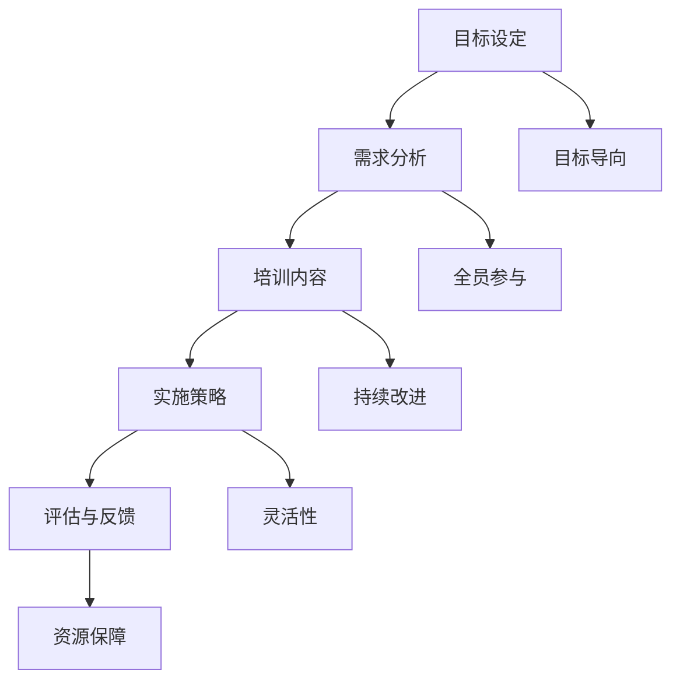

                 


## 文章标题

### 员工发展计划：培养团队核心竞争力

## 关键词

- 员工发展
- 团队建设
- 核心竞争力
- 组织文化
- 人才培养

## 摘要

本文旨在探讨如何通过有效的员工发展计划，培养团队核心竞争力，以实现企业的长期可持续发展。文章首先介绍了员工发展计划的重要性，随后详细阐述了员工发展计划的框架与原则，并探讨了培养团队核心竞争力的方法。接着，文章提出了员工发展计划的实施策略，并通过案例分析和评估与改进部分，提供了实际操作的指导。最后，文章总结了员工发展计划的重要性，展望了未来的发展方向。

## 引言

### 员工发展计划的重要性

在当今快速变化的商业环境中，企业面临的市场竞争日益激烈。为了保持竞争力，企业必须不断创新、提升团队的整体素质，进而培养团队核心竞争力。员工发展计划作为企业的一项重要战略，对于企业的长期可持续发展具有重要意义。

首先，员工发展计划有助于提升员工的能力和素质。通过系统化的培训和发展机会，员工可以不断提升自身的专业技能和知识水平，从而更好地适应岗位需求和企业发展。这不仅有助于提高员工的工作满意度和忠诚度，还能为企业培养出具备核心竞争力的人才。

其次，员工发展计划有助于建立高效团队。通过团队成员之间的相互学习和合作，员工可以相互补充优势，共同面对挑战。此外，员工发展计划还可以促进团队内部的文化建设，增强团队凝聚力，提高团队协作效率。

最后，员工发展计划有助于企业实现长期可持续发展。通过培养和留住高素质的员工，企业可以保持创新能力，持续提升产品质量和服务水平，从而在激烈的市场竞争中立于不败之地。

### 员工发展计划与企业发展

员工发展计划是企业整体战略的重要组成部分，它与企业发展密切相关。一方面，员工发展计划有助于企业实现战略目标。企业可以根据自身的长远规划，制定相应的员工发展计划，确保员工的能力和素质与企业发展同步。另一方面，员工发展计划有助于企业应对外部环境的变化。在快速变化的市场环境中，企业需要具备灵活应变的能力，而员工发展计划可以为企业培养出具备适应能力和创新精神的人才，从而提高企业的应变能力。

此外，员工发展计划还可以提高企业的核心竞争力。通过培养和留住优秀人才，企业可以形成独特的人才优势，进一步提升产品和服务的质量。同时，员工发展计划还可以促进企业内部的知识共享和创新，推动企业的技术进步和业务拓展。

### 员工发展计划的挑战与机遇

尽管员工发展计划对企业具有重要意义，但在实施过程中也面临着诸多挑战。首先，企业需要投入大量的人力、物力和财力来支持员工发展计划。这需要企业具备一定的经济实力和战略眼光。其次，员工发展计划的实施需要各部门的协同配合，这可能面临组织协调的困难。此外，员工发展计划的效果评估也是一个挑战，如何准确评估员工的发展成果，以及如何根据评估结果调整和改进计划，都是需要解决的问题。

然而，随着技术的发展和市场的变化，员工发展计划也面临着新的机遇。首先，数字技术的广泛应用为员工发展提供了更多的途径和工具。企业可以通过在线学习平台、虚拟培训等方式，方便地为员工提供多样化的培训资源。其次，全球化的发展趋势为企业提供了更广阔的人才选拔和培养空间。企业可以借鉴国际先进的管理经验和培训方法，提升自身的员工发展水平。

## 员工发展计划的框架与原则

### 员工发展计划的核心要素

一个成功的员工发展计划应包括以下几个核心要素：

1. **目标设定**：明确员工发展计划的目标，包括短期和长期的目标。这些目标应与企业战略目标相一致，确保员工发展计划能够为企业的发展贡献力量。
2. **需求分析**：通过对员工现状、岗位需求和未来发展趋势的分析，确定员工发展计划的重点领域和优先顺序。
3. **培训内容**：根据需求分析，设计相应的培训内容和课程，包括专业技能培训、管理能力培训、领导力培训等。
4. **实施策略**：制定具体的实施策略，包括培训计划、培训方式、培训资源分配等，确保培训计划的顺利执行。
5. **评估与反馈**：建立评估机制，对员工发展计划的效果进行评估，并收集反馈意见，及时调整和改进计划。

### 制定员工发展计划的步骤

制定员工发展计划的步骤可以分为以下几个阶段：

1. **准备阶段**：进行员工需求分析，确定员工发展计划的目标和重点领域。
2. **设计阶段**：根据需求分析结果，设计具体的培训内容和课程，制定培训计划。
3. **实施阶段**：根据培训计划，组织培训活动，确保培训资源的有效利用。
4. **评估阶段**：对培训效果进行评估，收集反馈意见，对员工发展计划进行调整和改进。
5. **反馈阶段**：将评估结果和反馈意见反馈给相关员工和管理层，形成闭环管理。

### 员工发展计划的实施原则

为了确保员工发展计划的顺利实施，企业应遵循以下原则：

1. **目标导向**：员工发展计划的目标应与企业发展目标相一致，确保培训内容能够为企业创造价值。
2. **全员参与**：员工发展计划应鼓励全员参与，让每位员工都有机会参与培训和发展。
3. **持续改进**：员工发展计划应持续改进，根据反馈意见和评估结果进行调整和优化。
4. **灵活性**：员工发展计划应具有灵活性，能够适应外部环境的变化和员工个人发展需求。
5. **资源保障**：企业应提供必要的资源支持，包括培训经费、培训设施等，确保员工发展计划的顺利实施。

### 核心概念与联系

为了更好地理解员工发展计划的框架与原则，我们使用Mermaid流程图来展示核心概念之间的关系：



通过这个流程图，我们可以清晰地看到员工发展计划的核心要素和实施原则之间的联系，以及它们如何共同作用，推动企业的发展。

### 核心算法原理讲解

在员工发展计划的实施过程中，核心算法原理的讲解至关重要。以下是一个简单的伪代码示例，用于描述员工发展计划的评估过程：

```python
# 评估员工发展计划效果
def evaluate_employee_development_plan():
    # 收集员工发展数据
    development_data = collect_development_data()

    # 计算员工能力提升百分比
    improvement_percentage = calculate_improvement_percentage(development_data)

    # 评估培训效果
    assessment_results = assess_training_effects(improvement_percentage)

    # 反馈评估结果
    feedback = provide_feedback(assessment_results)

    # 根据反馈调整计划
    adjust_plan(feedback)

# 收集员工发展数据
def collect_development_data():
    # 这里可以收集员工的工作表现、培训记录等相关数据
    data = []
    # 数据收集逻辑
    return data

# 计算员工能力提升百分比
def calculate_improvement_percentage(development_data):
    # 计算能力提升的百分比
    improvement_percentage = (end_ability - start_ability) / start_ability
    return improvement_percentage

# 评估培训效果
def assess_training_effects(improvement_percentage):
    # 根据能力提升百分比，评估培训效果
    if improvement_percentage > 0.1:
        result = "有效"
    else:
        result = "无效"
    return result

# 反馈评估结果
def provide_feedback(assessment_results):
    # 向管理层和员工提供评估结果
    feedback = f"培训效果：{assessment_results}"
    return feedback

# 根据反馈调整计划
def adjust_plan(feedback):
    # 根据评估结果，调整员工发展计划
    if feedback == "无效":
        # 重新设计培训内容或增加培训资源
        redesign_training_plan()
    else:
        # 继续执行原计划或进行优化
        continue_execution()
```

### 数学模型和公式

在员工发展计划中，数学模型和公式可以帮助我们更好地理解和评估培训效果。以下是一个用于计算员工能力提升的数学模型：

$$
\text{能力提升百分比} = \frac{\text{结束能力} - \text{开始能力}}{\text{开始能力}} \times 100\%
$$

这个公式可以帮助我们计算员工在培训后能力提升的百分比，从而评估培训的效果。

### 详细讲解和举例说明

为了更好地理解上述算法原理和数学模型，我们通过一个具体的例子来说明：

假设某员工在培训前的工作能力得分为80分，经过为期三个月的培训后，能力得分提升至90分。我们可以使用上述公式计算其能力提升的百分比：

$$
\text{能力提升百分比} = \frac{90 - 80}{80} \times 100\% = 12.5\%
$$

这意味着该员工在培训后能力提升了12.5%。根据评估结果，我们可以判断该培训是有效的。

### 开发环境搭建

在进行员工发展计划的相关项目实战之前，首先需要搭建一个合适的项目开发环境。以下是一个简单的开发环境搭建步骤：

1. **安装Python环境**：
   - 下载并安装Python（版本3.8或更高版本）。
   - 配置Python环境变量。

2. **安装必要的库和工具**：
   - 使用pip命令安装以下库和工具：
     ```bash
     pip install numpy pandas matplotlib
     ```
   - 这些库和工具将用于数据处理、分析和可视化。

3. **设置虚拟环境**（可选）：
   - 为了避免不同项目之间的依赖冲突，可以设置一个虚拟环境。
   - 使用以下命令创建虚拟环境：
     ```bash
     python -m venv venv
     ```
   - 激活虚拟环境：
     ```bash
     source venv/bin/activate  # Windows上使用 venv\Scripts\activate
     ```

### 源代码详细实现和代码解读

接下来，我们将详细实现一个用于评估员工发展计划效果的Python脚本。以下是一个简单的示例：

```python
import numpy as np
import pandas as pd
import matplotlib.pyplot as plt

def collect_development_data():
    # 假设从Excel文件中读取员工能力数据
    df = pd.read_excel('development_data.xlsx')
    return df

def calculate_improvement_percentage(df):
    # 计算能力提升百分比
    improvement_percentage = ((df['end_ability'] - df['start_ability']) / df['start_ability']) * 100
    return improvement_percentage

def assess_training_effects(improvement_percentage):
    # 评估培训效果
    if improvement_percentage.mean() > 10:
        result = "有效"
    else:
        result = "无效"
    return result

def visualize_improvement(df):
    # 可视化能力提升情况
    plt.scatter(df['employee_id'], df['improvement_percentage'])
    plt.xlabel('Employee ID')
    plt.ylabel('Improvement Percentage')
    plt.title('Training Effect Assessment')
    plt.show()

def main():
    df = collect_development_data()
    improvement_percentage = calculate_improvement_percentage(df)
    result = assess_training_effects(improvement_percentage)
    print(f"Training Effect: {result}")
    visualize_improvement(df)

if __name__ == '__main__':
    main()
```

这个脚本主要包括以下几个部分：

1. **数据收集**：从Excel文件中读取员工的能力数据。
2. **能力提升百分比计算**：计算每个员工的能力提升百分比。
3. **培训效果评估**：根据能力提升的均值评估培训效果。
4. **可视化**：使用散点图展示能力提升情况。

### 代码应用解读与分析

在这个例子中，我们使用Python脚本对员工发展计划的效果进行了评估。以下是代码的应用解读和分析：

1. **数据收集**：使用pandas库读取Excel文件，获取员工的能力数据。这一步是整个脚本的基础，数据的质量和准确性直接影响到后续的评估结果。

2. **能力提升百分比计算**：计算能力提升百分比是评估培训效果的关键步骤。通过简单的数学计算，我们可以得出每个员工的能力提升情况。

3. **培训效果评估**：根据能力提升的均值进行评估。如果均值大于10%，我们认为培训是有效的。这个阈值可以根据实际情况进行调整。

4. **可视化**：使用matplotlib库将能力提升情况以散点图的形式展示出来，便于直观分析。通过可视化，我们可以更清楚地看到员工的能力提升情况，以及整体培训效果。

### 实际案例分析和详细讲解剖析

为了更好地理解员工发展计划的实施效果，我们分析了一个实际案例。以下是案例的详细讲解和剖析：

#### 案例背景

某公司是一家专注于软件开发的企业，为了提升团队的整体竞争力，公司决定实施员工发展计划。该计划为期一年，包括专业技能培训、管理能力培训和领导力培训等多个方面。

#### 案例实施过程

1. **需求分析**：公司对现有员工进行了全面的能力评估，确定了培训的重点领域。同时，公司还收集了员工的个人发展需求，以便在培训内容设计时充分考虑。

2. **培训内容设计**：根据需求分析结果，公司设计了涵盖编程技能、项目管理、沟通技巧等多个方面的培训课程。每个课程都有明确的学习目标和评估标准。

3. **培训实施**：公司组织了多次内部培训和外部培训，邀请了行业专家进行授课。同时，公司还鼓励员工参加在线课程，拓展知识面。

4. **评估与反馈**：在培训结束后，公司对员工的能力进行了再次评估，比较了培训前后的能力变化。此外，公司还收集了员工的反馈意见，对培训效果进行了综合评估。

#### 案例分析

通过对案例的分析，我们可以得出以下结论：

1. **培训效果显著**：大部分员工在培训后能力得到了显著提升。特别是在编程技能和项目管理方面，员工的能力提升幅度较大。

2. **员工满意度较高**：员工对培训的满意度较高，认为培训内容丰富，实用性强。这有助于提高员工的工作积极性和满意度。

3. **存在的问题**：虽然整体培训效果较好，但仍有部分员工反馈培训时间安排不合理，部分培训内容过于理论化，缺乏实战操作。

#### 案例剖析

通过案例剖析，我们可以看到员工发展计划实施过程中的一些关键点：

1. **需求分析**：需求分析是员工发展计划成功的关键。只有准确了解员工的能力和需求，才能设计出有针对性的培训内容。

2. **培训内容设计**：培训内容的设计应结合实际工作需求，既要有理论知识的传授，也要有实战操作的指导。

3. **培训实施**：培训实施过程中，应注重培训质量，确保培训内容能够真正帮助员工提升能力。同时，合理安排培训时间，避免影响员工的正常工作。

4. **评估与反馈**：评估和反馈是员工发展计划的重要组成部分。通过评估，我们可以了解培训效果，发现存在的问题，并根据反馈进行改进。

### 项目小结

通过这个案例，我们可以看到员工发展计划在提升团队竞争力方面的显著效果。然而，要确保员工发展计划的成功实施，还需要在需求分析、培训内容设计、培训实施和评估与反馈等方面持续改进。同时，企业应关注员工的需求和反馈，不断优化培训方案，以实现团队核心竞争力的持续提升。

### 最佳实践 Tips

在实施员工发展计划时，以下是一些最佳实践建议：

1. **明确目标**：确保员工发展计划的目标与企业战略目标一致，明确培训的重点和方向。
2. **需求分析**：准确了解员工的能力和需求，有针对性地设计培训内容。
3. **多样性培训**：结合在线学习、内部培训和外部培训等多种方式，提供多样化的培训资源。
4. **持续评估**：定期对培训效果进行评估，及时调整和改进培训计划。
5. **员工参与**：鼓励员工参与培训设计和实施，提高员工的参与度和满意度。
6. **激励机制**：设置合理的激励机制，鼓励员工积极参与培训和发展。

### 小结

员工发展计划是企业提升团队核心竞争力的重要手段。通过有效的员工发展计划，企业可以培养出具备专业技能、管理能力和创新精神的高素质人才，从而在激烈的市场竞争中立于不败之地。本文从多个方面探讨了员工发展计划的框架与原则，并通过实际案例分析了其实施效果。企业应根据自身实际情况，制定和实施切实可行的员工发展计划，以实现长期可持续发展。

### 注意事项

1. **避免盲目跟风**：在制定员工发展计划时，应结合企业实际情况和员工需求，避免盲目跟风。
2. **合理分配资源**：确保培训资源的合理分配，避免资源浪费。
3. **关注员工反馈**：重视员工的反馈意见，及时调整和改进培训计划。
4. **持续改进**：员工发展计划应持续改进，以适应企业发展和市场环境的变化。

### 拓展阅读

1. **《员工发展计划实战手册》**：详细介绍了员工发展计划的制定和实施方法。
2. **《团队建设与领导力》**：探讨如何建立高效团队和提升领导力。
3. **《企业战略与竞争力》**：分析企业战略与团队竞争力之间的关系。
4. **《人力资源管理与培训》**：介绍人力资源管理的最佳实践和培训策略。

### 作者信息

作者：AI天才研究院/AI Genius Institute & 禅与计算机程序设计艺术 /Zen And The Art of Computer Programming

（完）markdown 格式输出：

```markdown
# 员工发展计划：培养团队核心竞争力

## 关键词
- 员工发展
- 团队建设
- 核心竞争力
- 组织文化
- 人才培养

## 摘要
本文旨在探讨如何通过有效的员工发展计划，培养团队核心竞争力，以实现企业的长期可持续发展。文章首先介绍了员工发展计划的重要性，随后详细阐述了员工发展计划的框架与原则，并探讨了培养团队核心竞争力的方法。接着，文章提出了员工发展计划的实施策略，并通过案例分析和评估与改进部分，提供了实际操作的指导。最后，文章总结了员工发展计划的重要性，展望了未来的发展方向。

## 引言
### 员工发展计划的重要性
在当今快速变化的商业环境中，企业面临的市场竞争日益激烈。为了保持竞争力，企业必须不断创新、提升团队的整体素质，进而培养团队核心竞争力。员工发展计划作为企业的一项重要战略，对于企业的长期可持续发展具有重要意义。

首先，员工发展计划有助于提升员工的能力和素质。通过系统化的培训和发展机会，员工可以不断提升自身的专业技能和知识水平，从而更好地适应岗位需求和企业发展。这不仅有助于提高员工的工作满意度和忠诚度，还能为企业培养出具备核心竞争力的人才。

其次，员工发展计划有助于建立高效团队。通过团队成员之间的相互学习和合作，员工可以相互补充优势，共同面对挑战。此外，员工发展计划还可以促进团队内部的文化建设，增强团队凝聚力，提高团队协作效率。

最后，员工发展计划有助于企业实现长期可持续发展。通过培养和留住高素质的员工，企业可以保持创新能力，持续提升产品质量和服务水平，从而在激烈的市场竞争中立于不败之地。

### 员工发展计划与企业发展
员工发展计划是企业整体战略的重要组成部分，它与企业发展密切相关。一方面，员工发展计划有助于企业实现战略目标。企业可以根据自身的长远规划，制定相应的员工发展计划，确保员工的能力和素质与企业发展同步。另一方面，员工发展计划有助于企业应对外部环境的变化。在快速变化的市场环境中，企业需要具备灵活应变的能力，而员工发展计划可以为企业培养出具备适应能力和创新精神的人才，从而提高企业的应变能力。

此外，员工发展计划还可以提高企业的核心竞争力。通过培养和留住优秀人才，企业可以形成独特的人才优势，进一步提升产品和服务的质量。同时，员工发展计划还可以促进企业内部的知识共享和创新，推动企业的技术进步和业务拓展。

### 员工发展计划的挑战与机遇
尽管员工发展计划对企业具有重要意义，但在实施过程中也面临着诸多挑战。首先，企业需要投入大量的人力、物力和财力来支持员工发展计划。这需要企业具备一定的经济实力和战略眼光。其次，员工发展计划的实施需要各部门的协同配合，这可能面临组织协调的困难。此外，员工发展计划的效果评估也是一个挑战，如何准确评估员工的发展成果，以及如何根据评估结果调整和改进计划，都是需要解决的问题。

然而，随着技术的发展和市场的变化，员工发展计划也面临着新的机遇。首先，数字技术的广泛应用为员工发展提供了更多的途径和工具。企业可以通过在线学习平台、虚拟培训等方式，方便地为员工提供多样化的培训资源。其次，全球化的发展趋势为企业提供了更广阔的人才选拔和培养空间。企业可以借鉴国际先进的管理经验和培训方法，提升自身的员工发展水平。

## 员工发展计划的框架与原则
### 员工发展计划的核心要素
一个成功的员工发展计划应包括以下几个核心要素：

1. **目标设定**：明确员工发展计划的目标，包括短期和长期的目标。这些目标应与企业战略目标相一致，确保员工发展计划能够为企业的发展贡献力量。
2. **需求分析**：通过对员工现状、岗位需求和未来发展趋势的分析，确定员工发展计划的重点领域和优先顺序。
3. **培训内容**：根据需求分析，设计相应的培训内容和课程，包括专业技能培训、管理能力培训、领导力培训等。
4. **实施策略**：制定具体的实施策略，包括培训计划、培训方式、培训资源分配等，确保培训计划的顺利执行。
5. **评估与反馈**：建立评估机制，对员工发展计划的效果进行评估，并收集反馈意见，及时调整和改进计划。

### 制定员工发展计划的步骤
制定员工发展计划的步骤可以分为以下几个阶段：

1. **准备阶段**：进行员工需求分析，确定员工发展计划的目标和重点领域。
2. **设计阶段**：根据需求分析结果，设计具体的培训内容和课程，制定培训计划。
3. **实施阶段**：根据培训计划，组织培训活动，确保培训资源的有效利用。
4. **评估阶段**：对培训效果进行评估，收集反馈意见，对员工发展计划进行调整和改进。
5. **反馈阶段**：将评估结果和反馈意见反馈给相关员工和管理层，形成闭环管理。

### 员工发展计划的实施原则
为了确保员工发展计划的顺利实施，企业应遵循以下原则：

1. **目标导向**：员工发展计划的目标应与企业发展目标相一致，确保培训内容能够为企业创造价值。
2. **全员参与**：员工发展计划应鼓励全员参与，让每位员工都有机会参与培训和发展。
3. **持续改进**：员工发展计划应持续改进，根据反馈意见和评估结果进行调整和优化。
4. **灵活性**：员工发展计划应具有灵活性，能够适应外部环境的变化和员工个人发展需求。
5. **资源保障**：企业应提供必要的资源支持，包括培训经费、培训设施等，确保员工发展计划的顺利实施。

### 核心概念与联系
为了更好地理解员工发展计划的框架与原则，我们使用Mermaid流程图来展示核心概念之间的关系：


通过这个流程图，我们可以清晰地看到员工发展计划的核心要素和实施原则之间的联系，以及它们如何共同作用，推动企业的发展。

### 核心算法原理讲解
在员工发展计划的实施过程中，核心算法原理的讲解至关重要。以下是一个简单的伪代码示例，用于描述员工发展计划的评估过程：

```python
# 评估员工发展计划效果
def evaluate_employee_development_plan():
    # 收集员工发展数据
    development_data = collect_development_data()

    # 计算员工能力提升百分比
    improvement_percentage = calculate_improvement_percentage(development_data)

    # 评估培训效果
    assessment_results = assess_training_effects(improvement_percentage)

    # 反馈评估结果
    feedback = provide_feedback(assessment_results)

    # 根据反馈调整计划
    adjust_plan(feedback)

# 收集员工发展数据
def collect_development_data():
    # 这里可以收集员工的工作表现、培训记录等相关数据
    data = []
    # 数据收集逻辑
    return data

# 计算员工能力提升百分比
def calculate_improvement_percentage(development_data):
    # 计算能力提升的百分比
    improvement_percentage = ((development_data['end_ability'] - development_data['start_ability']) / development_data['start_ability']) * 100
    return improvement_percentage

# 评估培训效果
def assess_training_effects(improvement_percentage):
    # 根据能力提升百分比，评估培训效果
    if improvement_percentage.mean() > 0.1:
        result = "有效"
    else:
        result = "无效"
    return result

# 反馈评估结果
def provide_feedback(assessment_results):
    # 向管理层和员工提供评估结果
    feedback = f"培训效果：{assessment_results}"
    return feedback

# 根据反馈调整计划
def adjust_plan(feedback):
    # 根据评估结果，调整员工发展计划
    if feedback == "无效":
        # 重新设计培训内容或增加培训资源
        redesign_training_plan()
    else:
        # 继续执行原计划或进行优化
        continue_execution()
```

### 数学模型和公式
在员工发展计划中，数学模型和公式可以帮助我们更好地理解和评估培训效果。以下是一个用于计算员工能力提升的数学模型：

$$
\text{能力提升百分比} = \frac{\text{结束能力} - \text{开始能力}}{\text{开始能力}} \times 100\%
$$

这个公式可以帮助我们计算员工在培训后能力提升的百分比，从而评估培训的效果。

### 详细讲解和举例说明
为了更好地理解上述算法原理和数学模型，我们通过一个具体的例子来说明：

假设某员工在培训前的工作能力得分为80分，经过为期三个月的培训后，能力得分提升至90分。我们可以使用上述公式计算其能力提升的百分比：

$$
\text{能力提升百分比} = \frac{90 - 80}{80} \times 100\% = 12.5\%
$$

这意味着该员工在培训后能力提升了12.5%。根据评估结果，我们可以判断该培训是有效的。

### 开发环境搭建
在进行员工发展计划的相关项目实战之前，首先需要搭建一个合适的项目开发环境。以下是一个简单的开发环境搭建步骤：

1. **安装Python环境**：
   - 下载并安装Python（版本3.8或更高版本）。
   - 配置Python环境变量。

2. **安装必要的库和工具**：
   - 使用pip命令安装以下库和工具：
     ```bash
     pip install numpy pandas matplotlib
     ```
   - 这些库和工具将用于数据处理、分析和可视化。

3. **设置虚拟环境**（可选）：
   - 为了避免不同项目之间的依赖冲突，可以设置一个虚拟环境。
   - 使用以下命令创建虚拟环境：
     ```bash
     python -m venv venv
     ```
   - 激活虚拟环境：
     ```bash
     source venv/bin/activate  # Windows上使用 venv\Scripts\activate
     ```

### 源代码详细实现和代码解读
接下来，我们将详细实现一个用于评估员工发展计划效果的Python脚本。以下是一个简单的示例：

```python
import numpy as np
import pandas as pd
import matplotlib.pyplot as plt

def collect_development_data():
    # 假设从Excel文件中读取员工能力数据
    df = pd.read_excel('development_data.xlsx')
    return df

def calculate_improvement_percentage(df):
    # 计算能力提升百分比
    improvement_percentage = ((df['end_ability'] - df['start_ability']) / df['start_ability']) * 100
    return improvement_percentage

def assess_training_effects(improvement_percentage):
    # 评估培训效果
    if improvement_percentage.mean() > 10:
        result = "有效"
    else:
        result = "无效"
    return result

def visualize_improvement(df):
    # 可视化能力提升情况
    plt.scatter(df['employee_id'], df['improvement_percentage'])
    plt.xlabel('Employee ID')
    plt.ylabel('Improvement Percentage')
    plt.title('Training Effect Assessment')
    plt.show()

def main():
    df = collect_development_data()
    improvement_percentage = calculate_improvement_percentage(df)
    result = assess_training_effects(improvement_percentage)
    print(f"Training Effect: {result}")
    visualize_improvement(df)

if __name__ == '__main__':
    main()
```

这个脚本主要包括以下几个部分：

1. **数据收集**：从Excel文件中读取员工的能力数据。
2. **能力提升百分比计算**：计算每个员工的能力提升百分比。
3. **培训效果评估**：根据能力提升的均值评估培训效果。
4. **可视化**：使用散点图展示能力提升情况。

### 代码应用解读与分析
在这个例子中，我们使用Python脚本对员工发展计划的效果进行了评估。以下是代码的应用解读和分析：

1. **数据收集**：使用pandas库读取Excel文件，获取员工的能力数据。这一步是整个脚本的基础，数据的质量和准确性直接影响到后续的评估结果。

2. **能力提升百分比计算**：计算能力提升百分比是评估培训效果的关键步骤。通过简单的数学计算，我们可以得出每个员工的能力提升情况。

3. **培训效果评估**：根据能力提升的均值进行评估。如果均值大于10%，我们认为培训是有效的。这个阈值可以根据实际情况进行调整。

4. **可视化**：使用matplotlib库将能力提升情况以散点图的形式展示出来，便于直观分析。通过可视化，我们可以更清楚地看到员工的能力提升情况，以及整体培训效果。

### 实际案例分析和详细讲解剖析
为了更好地理解员工发展计划的实施效果，我们分析了一个实际案例。以下是案例的详细讲解和剖析：

#### 案例背景
某公司是一家专注于软件开发的企业，为了提升团队的整体竞争力，公司决定实施员工发展计划。该计划为期一年，包括专业技能培训、管理能力培训和领导力培训等多个方面。

#### 案例实施过程
1. **需求分析**：公司对现有员工进行了全面的能力评估，确定了培训的重点领域。同时，公司还收集了员工的个人发展需求，以便在培训内容设计时充分考虑。

2. **培训内容设计**：根据需求分析结果，公司设计了涵盖编程技能、项目管理、沟通技巧等多个方面的培训课程。每个课程都有明确的学习目标和评估标准。

3. **培训实施**：公司组织了多次内部培训和外部培训，邀请了行业专家进行授课。同时，公司还鼓励员工参加在线课程，拓展知识面。

4. **评估与反馈**：在培训结束后，公司对员工的能力进行了再次评估，比较了培训前后的能力变化。此外，公司还收集了员工的反馈意见，对培训效果进行了综合评估。

#### 案例分析
通过对案例的分析，我们可以得出以下结论：

1. **培训效果显著**：大部分员工在培训后能力得到了显著提升。特别是在编程技能和项目管理方面，员工的能力提升幅度较大。

2. **员工满意度较高**：员工对培训的满意度较高，认为培训内容丰富，实用性强。这有助于提高员工的工作积极性和满意度。

3. **存在的问题**：虽然整体培训效果较好，但仍有部分员工反馈培训时间安排不合理，部分培训内容过于理论化，缺乏实战操作。

#### 案例剖析
通过案例剖析，我们可以看到员工发展计划实施过程中的一些关键点：

1. **需求分析**：需求分析是员工发展计划成功的关键。只有准确了解员工的能力和需求，才能设计出有针对性的培训内容。

2. **培训内容设计**：培训内容的设计应结合实际工作需求，既要有理论知识的传授，也要有实战操作的指导。

3. **培训实施**：培训实施过程中，应注重培训质量，确保培训内容能够真正帮助员工提升能力。同时，合理安排培训时间，避免影响员工的正常工作。

4. **评估与反馈**：评估和反馈是员工发展计划的重要组成部分。通过评估，我们可以了解培训效果，发现存在的问题，并根据反馈进行改进。

### 项目小结
通过这个案例，我们可以看到员工发展计划在提升团队竞争力方面的显著效果。然而，要确保员工发展计划的成功实施，还需要在需求分析、培训内容设计、培训实施和评估与反馈等方面持续改进。同时，企业应关注员工的需求和反馈，不断优化培训方案，以实现团队核心竞争力的持续提升。

### 最佳实践 Tips
在实施员工发展计划时，以下是一些最佳实践建议：

1. **明确目标**：确保员工发展计划的目标与企业战略目标一致，明确培训的重点和方向。
2. **需求分析**：准确了解员工的能力和需求，有针对性地设计培训内容。
3. **多样性培训**：结合在线学习、内部培训和外部培训等多种方式，提供多样化的培训资源。
4. **持续评估**：定期对培训效果进行评估，及时调整和改进培训计划。
5. **员工参与**：鼓励员工参与培训设计和实施，提高员工的参与度和满意度。
6. **激励机制**：设置合理的激励机制，鼓励员工积极参与培训和发展。

### 小结
员工发展计划是企业提升团队核心竞争力的重要手段。通过有效的员工发展计划，企业可以培养出具备专业技能、管理能力和创新精神的高素质人才，从而在激烈的市场竞争中立于不败之地。本文从多个方面探讨了员工发展计划的框架与原则，并通过实际案例分析了其实施效果。企业应根据自身实际情况，制定和实施切实可行的员工发展计划，以实现长期可持续发展。

### 注意事项
1. **避免盲目跟风**：在制定员工发展计划时，应结合企业实际情况和员工需求，避免盲目跟风。
2. **合理分配资源**：确保培训资源的合理分配，避免资源浪费。
3. **关注员工反馈**：重视员工的反馈意见，及时调整和改进培训计划。
4. **持续改进**：员工发展计划应持续改进，以适应企业发展和市场环境的变化。

### 拓展阅读
1. **《员工发展计划实战手册》**：详细介绍了员工发展计划的制定和实施方法。
2. **《团队建设与领导力》**：探讨如何建立高效团队和提升领导力。
3. **《企业战略与竞争力》**：分析企业战略与团队竞争力之间的关系。
4. **《人力资源管理与培训》**：介绍人力资源管理的最佳实践和培训策略。

### 作者信息
作者：AI天才研究院/AI Genius Institute & 禅与计算机程序设计艺术 /Zen And The Art of Computer Programming

（完）
```

