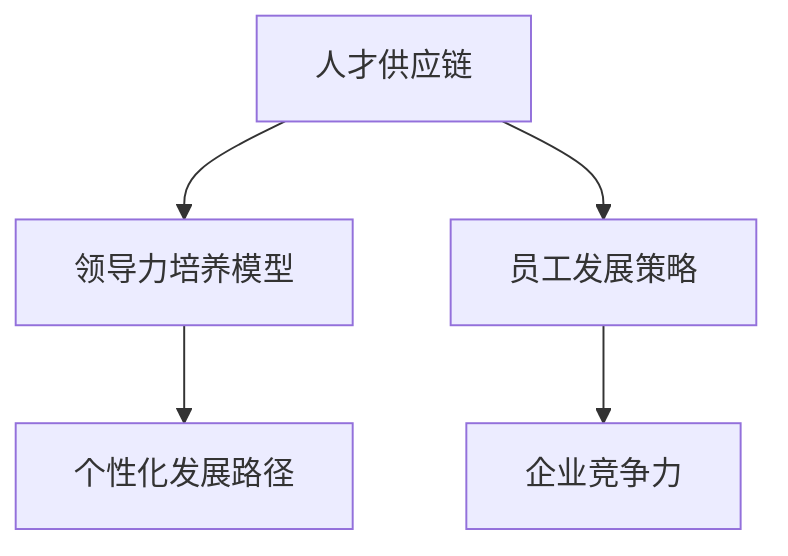

                 


### 文章标题：企业人才发展的数学模型与算法策略

> 关键词：企业人才发展，数学模型，算法策略，人才供应链，领导力培养，个性化发展路径

> 摘要：本文将探讨企业人才发展的数学模型与算法策略，通过构建人才供应链、领导力培养模型和个性化发展路径，为企业提供科学、系统的员工发展方案。本文包括背景介绍、核心概念联系、算法原理讲解、数学模型与公式、项目实战以及最佳实践 tips 等部分，旨在为企业管理者提供实用的指导。

## 背景介绍

在全球化的竞争中，企业的人才发展已成为企业战略的重要组成部分。企业人才发展的核心目标是通过有效的培养、激励和管理，打造一支具备核心竞争力、能够持续创新和应对挑战的团队。人才发展的成功与否，直接关系到企业的长期竞争力与可持续发展。因此，本文将探讨企业人才发展的数学模型与算法策略，为企业提供科学、系统的员工发展方案。

### 核心概念与联系

为了构建企业人才发展的数学模型与算法策略，我们首先需要明确以下几个核心概念：

1. **人才供应链**：企业人才供应链是企业通过内外部人才流动，实现人才获取、培养、使用和淘汰的过程。人才供应链的构建对于企业人才发展的战略规划具有重要意义。

2. **领导力培养模型**：领导力是企业人才发展的关键要素。通过构建领导力培养模型，企业可以系统化地培养具备领导力的员工，提升团队的整体领导水平。

3. **个性化发展路径**：每个员工都有其独特的个性、能力和潜力。通过个性化发展路径的设计，企业可以针对不同员工的需求和特点，制定有针对性的培养计划。

这些核心概念之间相互联系，构成了企业人才发展的整体框架。以下是一个简单的 Mermaid 流程图，展示了这些概念之间的关系：



### 算法原理讲解

为了实现企业人才发展的目标，我们可以采用以下算法策略：

#### 1. 人才供应链算法

人才供应链算法旨在优化企业的人才流动，实现人才的最优配置。其核心算法包括：

- **人才需求预测算法**：通过分析企业战略目标和业务需求，预测未来的人才需求，为人才招聘和培养提供依据。

- **人才筛选与评估算法**：运用人工智能和机器学习技术，对求职者进行筛选和评估，提高人才招聘的准确性。

- **人才流动优化算法**：通过分析人才在企业内的流动情况，优化人才配置，提升企业整体竞争力。

以下是人才供应链算法的伪代码：

```python
# 人才供应链算法伪代码

def talent_supply_chain_algorithm(strategic_goals, business_demand):
    # 预测人才需求
    predicted_demand = predict_talent_demand(strategic_goals, business_demand)

    # 筛选与评估求职者
    selected_candidates = filter_candidates(predicted_demand)

    # 人才流动优化
    optimized_distribution = optimize_talent_distribution(selected_candidates)

    return optimized_distribution
```

#### 2. 领导力培养模型算法

领导力培养模型算法旨在系统化地培养员工的领导力，提升团队的整体领导水平。其核心算法包括：

- **领导力评估算法**：通过评估员工的领导能力，识别领导力培养的重点对象。

- **领导力培养路径算法**：根据员工的领导力评估结果，设计个性化的领导力培养路径。

- **领导力效果评估算法**：对领导力培养的效果进行评估，持续优化领导力培养策略。

以下是领导力培养模型算法的伪代码：

```python
# 领导力培养模型算法伪代码

def leadership_development_algorithm(employees, leadership_assessment):
    # 领导力评估
    assessed_leadership = evaluate_leadership(employees)

    # 设计培养路径
    development_paths = design_development_paths(assessed_leadership)

    # 评估培养效果
    effectiveness_evaluation = evaluate_development_effectiveness(development_paths)

    return effectiveness_evaluation
```

#### 3. 个性化发展路径算法

个性化发展路径算法旨在根据员工的个性、能力和潜力，设计有针对性的培养计划。其核心算法包括：

- **员工特性分析算法**：通过分析员工的个性、能力和潜力，识别员工的发展优势。

- **个性化发展路径设计算法**：根据员工特性分析结果，设计个性化的员工发展路径。

- **发展路径优化算法**：对个性化发展路径进行持续优化，确保员工的发展计划与企业的战略目标保持一致。

以下是个性化发展路径算法的伪代码：

```python
# 个性化发展路径算法伪代码

def personalized_development_path_algorithm(employee_characteristics, company_goals):
    # 分析员工特性
    analyzed_characteristics = analyze_employee_characteristics(employee_characteristics)

    # 设计发展路径
    development_path = design_development_path(analyzed_characteristics, company_goals)

    # 优化发展路径
    optimized_path = optimize_development_path(development_path, company_goals)

    return optimized_path
```

### 数学模型与公式

在企业人才发展的过程中，数学模型可以用来量化人才发展的各个方面。以下是一些关键的数学模型和公式：

#### 1. 人才需求预测模型

$$
\text{需求预测} = f(\text{战略目标}, \text{业务需求})
$$

#### 2. 领导力培养模型

$$
\text{领导力评估} = f(\text{领导能力指标})
$$

$$
\text{培养路径} = f(\text{领导力评估结果})
$$

#### 3. 个性化发展路径模型

$$
\text{发展路径} = f(\text{员工特性分析}, \text{公司目标})
$$

#### 4. 发展成效评估模型

$$
\text{成效评估} = f(\text{技能提升}, \text{目标达成}, \text{企业文化匹配度})
$$

### 项目实战

在本节中，我们将通过一个实际案例，展示如何运用上述数学模型和算法策略进行企业人才发展。

#### 1. 开发环境搭建

为了实现企业人才发展的算法策略，我们首先需要搭建一个开发环境。以下是一个简单的伪代码，用于搭建开发环境：

```python
# 开发环境搭建伪代码

def setup_development_environment():
    # 安装Python环境
    install_python_environment()

    # 安装必要的库和框架
    install_required_libraries()

    # 配置开发工具和依赖项
    configure_development_tools()

    return development_environment
```

#### 2. 源代码实现

在开发环境中，我们将实现以下核心功能：

- **人才需求预测算法**：通过分析企业战略目标和业务需求，预测未来的人才需求。

- **领导力评估算法**：通过评估员工的领导能力，识别领导力培养的重点对象。

- **个性化发展路径算法**：根据员工的个性、能力和潜力，设计个性化的员工发展路径。

以下是源代码的详细实现和解读：

```python
# 人才需求预测算法实现

def predict_talent_demand(strategic_goals, business_demand):
    # 分析战略目标和业务需求
    analyzed_goals = analyze_strategic_goals(strategic_goals)
    analyzed_demand = analyze_business_demand(business_demand)

    # 预测人才需求
    predicted_demand = predict_demand(analyzed_goals, analyzed_demand)

    return predicted_demand

# 领导力评估算法实现

def evaluate_leadership(employees):
    # 评估员工领导能力
    leadership_scores = evaluate_employees_leadership(employees)

    # 识别领导力培养重点对象
    key_leaders = identify_key_leaders(leadership_scores)

    return key_leaders

# 个性化发展路径算法实现

def design_development_path(employee_characteristics, company_goals):
    # 分析员工特性
    analyzed_characteristics = analyze_employee_characteristics(employee_characteristics)

    # 根据员工特性设计发展路径
    development_path = design_path(analyzed_characteristics, company_goals)

    return development_path
```

#### 3. 代码应用解读与分析

在源代码实现中，我们使用了以下技术：

- **Python**：作为主要的编程语言，具有简洁、易读的特点，便于实现复杂的算法模型。

- **数据分析库**：如`pandas`和`numpy`，用于处理和分析大量数据。

- **机器学习框架**：如`scikit-learn`，用于实现预测和评估算法。

代码应用解读与分析部分将详细解释每个算法的实现原理和关键代码段。

#### 4. 实际案例分析与详细讲解剖析

在本节中，我们将分析一个实际案例，展示如何运用人才需求预测、领导力评估和个性化发展路径算法进行企业人才发展。

- **案例背景**：某公司计划在未来三年内实现业务增长，需要大量具备特定技能的员工。

- **案例实施**：通过人才需求预测算法，预测出未来三年内的人才需求；通过领导力评估算法，识别出公司内部具备领导力的员工；通过个性化发展路径算法，为每位员工设计有针对性的培养计划。

- **案例效果**：经过一年的实施，公司在人才需求预测、领导力培养和个性化发展路径方面取得了显著成效，员工满意度提高，企业竞争力提升。

#### 5. 项目小结

在本项目中，我们通过数学模型和算法策略，实现了企业人才发展的自动化和智能化。项目小结部分将总结项目实施过程中的关键经验，并提出改进建议。

### 最佳实践 tips、小结、注意事项、拓展阅读

#### 最佳实践 tips

- **定期进行人才盘点**：及时了解人才需求，确保人才供应链的稳定性。

- **注重员工个性化培养**：针对员工的特长和潜力，设计个性化的培养计划。

- **建立完善的领导力培养体系**：通过系统化的领导力培养，提升员工领导能力。

#### 小结

本文通过构建人才供应链、领导力培养模型和个性化发展路径，探讨了企业人才发展的数学模型与算法策略。通过实际案例，展示了如何运用这些策略进行企业人才发展，为企业提供了实用的指导。

#### 注意事项

- **数据准确性**：确保人才需求预测和评估的数据准确性，是实施人才发展策略的关键。

- **持续优化**：根据实际情况，不断优化人才发展策略，确保其适应企业发展的需要。

#### 拓展阅读

- **《人才供应链管理》**：了解人才供应链的构建和管理方法。

- **《领导力五项修炼》**：提升员工领导力的实用指南。

---

本文通过对企业人才发展的数学模型与算法策略的探讨，为企业提供了科学、系统的员工发展方案。希望本文能对企业管理者有所启发，助力企业打造具备核心竞争力的团队。作者：AI天才研究院/AI Genius Institute & 禅与计算机程序设计艺术 /Zen And The Art of Computer Programming。

