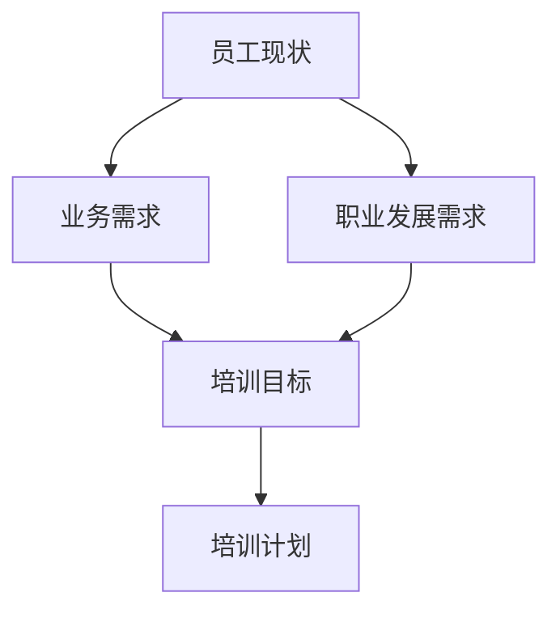

                 

### 《员工培训：提升团队整体素质》

> **关键词**：员工培训、团队素质、培训需求分析、培训设计与实施、培训评估与反馈、团队建设、培训技术与工具。

> **摘要**：本文详细探讨了员工培训在提升团队整体素质中的重要性。通过分析培训需求、设计培训方案、实施培训、评估培训效果以及团队建设与培训技术的运用，为企业和团队提供了系统化的员工培训策略。

---

#### 引言

在当今快速发展的信息技术时代，企业面临的竞争压力日益加剧。员工素质的高低直接影响着企业的竞争力。因此，提升员工的整体素质，培养高效的团队，成为企业发展的关键。员工培训正是实现这一目标的重要手段。

**员工培训的重要性**

员工培训不仅能够提升员工的技能水平，还能增强员工的职业素养和团队协作能力。通过系统化的培训，员工可以更好地适应岗位需求，提高工作效率，从而为企业创造更大的价值。

**团队整体素质提升的必要性**

团队整体素质的提升，可以增强团队的凝聚力和战斗力。一个高素质的团队能够更好地应对挑战，实现企业的战略目标。因此，提升团队整体素质，不仅是企业发展的需要，也是员工自身职业发展的需求。

**本书的目的**

本书旨在为企业和团队提供一套系统化的员工培训策略，包括培训需求分析、培训设计与实施、培训评估与反馈、团队建设与培训技术运用等。通过本书的指导，企业可以有效地提升员工的整体素质，打造高效的团队。

---

#### 培训需求分析

培训需求分析是员工培训的重要环节，它决定了培训的针对性和有效性。有效的培训需求分析可以确保培训内容与员工的实际需求和企业的业务目标相匹配。

**核心概念与联系**

培训需求分析涉及多个核心概念，包括员工现状、业务需求和职业发展需求。这些概念相互关联，共同构成了培训需求分析的框架。以下是一个简单的Mermaid流程图，展示了这些概念之间的关系：



**核心算法原理讲解**

培训需求分析的核心算法可以概括为以下步骤：

1. **数据收集**：通过问卷调查、访谈、观察等方式收集员工和业务部门的需求信息。
2. **数据分析**：对收集到的数据进行分析，识别员工的技能差距、业务需求和个人职业发展需求。
3. **需求分类**：根据数据分析结果，将需求分类为技能提升、业务适应和职业发展等。
4. **优先级排序**：对分类后的需求进行优先级排序，确定培训的重点和优先级。

以下是一个简单的伪代码示例，用于描述培训需求分析的核心算法：

```python
def training_demand_analysis():
    # 数据收集
    data = collect_data()

    # 数据分析
    skill_gap = analyze_skills(data['员工现状'], data['业务需求'])
    business_need = analyze_business(data['业务需求'])
    career_development = analyze_career(data['职业发展需求'])

    # 需求分类
    categorized_needs = categorize_needs(skill_gap, business_need, career_development)

    # 优先级排序
    sorted_needs = prioritize_needs(categorized_needs)

    # 制定培训计划
    training_plan = create_training_plan(sorted_needs)

    return training_plan
```

**数学模型和公式**

在培训需求分析中，可以使用以下公式来计算员工的技能差距：

$$
技能差距 = 实际技能水平 - 需求技能水平
$$

通过这个公式，可以量化员工在技能方面的差距，为培训提供依据。

**详细讲解与举例说明**

假设某公司需要进行员工培训需求分析，以下是具体的分析过程：

1. **数据收集**：通过问卷调查和一对一访谈，收集员工和业务部门的需求信息。
2. **数据分析**：分析数据发现，大部分员工的技能水平与岗位需求存在较大差距，特别是新入职的员工。
3. **需求分类**：将需求分类为技能提升、业务适应和职业发展三个方面。
4. **优先级排序**：根据数据分析结果，将技能提升作为首要培训目标，其次是业务适应和职业发展。
5. **制定培训计划**：根据排序结果，制定具体的培训计划，包括培训课程、培训时间和培训方式等。

通过以上步骤，该公司可以有效地确定培训需求，为后续的培训设计和实施提供依据。

---

#### 培训设计与实施

培训设计与实施是员工培训的核心环节，它决定了培训的质量和效果。有效的培训设计可以确保培训内容与员工的实际需求和企业的发展目标相匹配。

**培训设计原则**

在进行培训设计时，应遵循以下原则：

1. **目标导向**：培训设计应明确培训目标，确保培训内容与目标一致。
2. **个性化**：根据员工的个人需求和职业发展，设计个性化的培训方案。
3. **理论与实践相结合**：培训内容应包括理论学习和实践操作，增强员工的实际应用能力。
4. **持续改进**：培训设计应不断根据反馈进行调整和改进，以提升培训效果。

**培训设计方法**

培训设计的方法包括以下步骤：

1. **确定培训目标**：明确培训的目标，包括知识技能提升、职业素养提升和团队协作能力提升等。
2. **设计培训内容**：根据培训目标，设计具体的培训内容，包括理论课程、实践操作和案例分析等。
3. **选择培训形式**：根据培训内容和目标，选择合适的培训形式，如线上培训、线下培训、工作坊等。
4. **制定培训计划**：制定详细的培训计划，包括培训时间、地点、讲师、学员、课程内容等。

以下是一个简单的伪代码示例，用于描述培训设计的过程：

```python
def training_design():
    # 确定培训目标
    training_objectives = determine_objectives()

    # 设计培训内容
    training_content = design_content(training_objectives)

    # 选择培训形式
    training_format = select_format(training_content)

    # 制定培训计划
    training_plan = create_training_plan(training_content, training_format)

    return training_plan
```

**培训实施步骤**

培训实施是确保培训顺利进行的重要环节。以下为培训实施的基本步骤：

1. **培训前准备**：包括确定培训时间、地点、讲师、学员等，准备培训资料和设备。
2. **培训过程中**：确保培训内容按照计划进行，及时解决学员的问题，增强互动和参与度。
3. **培训结束后**：进行培训总结，收集学员反馈，对培训效果进行评估。

以下是一个简单的伪代码示例，用于描述培训实施的过程：

```python
def training_implementation(training_plan):
    # 培训前准备
    prepare_training(training_plan)

    # 培训过程中
    conduct_training(training_plan)

    # 培训结束后
    conclude_training(training_plan)

    # 培训总结与反馈
    training_summary = summarize_training(training_plan)

    return training_summary
```

**数学模型和公式**

在培训设计过程中，可以使用以下公式来评估培训效果：

$$
培训效果 = \frac{培训后技能水平 - 培训前技能水平}{培训前技能水平}
$$

通过这个公式，可以量化培训对员工技能提升的影响。

**详细讲解与举例说明**

假设某公司需要进行一次员工培训，以下是具体的培训设计过程：

1. **确定培训目标**：提升员工的技能水平和团队协作能力。
2. **设计培训内容**：包括编程技能提升课程、团队协作技巧培训等。
3. **选择培训形式**：线上培训，便于员工灵活学习。
4. **制定培训计划**：包括培训时间、地点、讲师、学员等。

通过以上步骤，该公司可以有效地设计出符合员工需求的培训方案，提升员工的技能水平和团队协作能力。

---

#### 培训评估与反馈

培训评估与反馈是确保培训效果的重要环节。通过评估和反馈，企业可以了解培训的成效，发现培训中的问题和不足，为后续的培训提供改进方向。

**培训评估的目的与意义**

培训评估的主要目的是：

1. **确定培训效果**：评估培训是否达到了预期的目标，员工是否掌握了所需的知识和技能。
2. **发现培训问题**：通过评估，发现培训过程中的不足，如培训内容、培训形式、培训讲师等。
3. **提供改进方向**：根据评估结果，为后续的培训提供改进建议，提升培训质量。

**培训评估方法**

培训评估的方法包括以下几种：

1. **定量评估**：使用问卷、测试等方式，量化评估员工的学习效果和培训效果。
2. **定性评估**：通过访谈、观察等方式，收集员工的意见和建议，了解培训的实际情况。
3. **综合评估**：结合定量评估和定性评估，全面评估培训效果。

以下是一个简单的伪代码示例，用于描述培训评估的过程：

```python
def training_evaluation(training_plan):
    # 定量评估
    quantitative_evaluation = conduct_quantitative_evaluation(training_plan)

    # 定性评估
    qualitative_evaluation = conduct_qualitative_evaluation(training_plan)

    # 综合评估
    overall_evaluation = combine_evaluation(quantitative_evaluation, qualitative_evaluation)

    return overall_evaluation
```

**培训反馈的收集与利用**

收集培训反馈是培训评估的重要环节。以下为收集和利用培训反馈的方法：

1. **反馈渠道**：设置多种反馈渠道，如在线问卷、意见箱、面对面访谈等，便于员工表达意见和建议。
2. **反馈处理**：对收集到的反馈进行整理和分析，识别培训中的问题和不足。
3. **反馈利用**：根据反馈结果，对培训计划进行修改和改进，提升培训效果。

以下是一个简单的伪代码示例，用于描述反馈收集与处理的过程：

```python
def feedback_collection_and_utilization():
    # 收集反馈
    feedback = collect_feedback()

    # 处理反馈
    processed_feedback = process_feedback(feedback)

    # 利用反馈
    improved_training_plan = utilize_feedback(processed_feedback)

    return improved_training_plan
```

**数学模型和公式**

在培训评估中，可以使用以下公式来计算培训效果：

$$
培训效果 = \frac{培训后技能水平 - 培训前技能水平}{培训前技能水平}
$$

通过这个公式，可以量化培训对员工技能提升的影响。

**详细讲解与举例说明**

假设某公司进行了一次员工培训，以下是具体的培训评估和反馈收集过程：

1. **定量评估**：通过在线问卷，评估员工的学习效果，统计培训后的技能水平。
2. **定性评估**：通过面对面访谈，收集员工的意见和建议，了解培训的实际效果。
3. **综合评估**：结合定量评估和定性评估的结果，全面评估培训效果。
4. **反馈收集**：设置在线意见箱，收集员工的反馈，识别培训中的问题和不足。
5. **反馈处理**：对收集到的反馈进行分析，识别培训中的不足，为后续的培训提供改进建议。
6. **反馈利用**：根据反馈结果，对培训计划进行修改和改进，提升培训效果。

通过以上步骤，该公司可以有效地评估培训效果，收集和利用反馈，提升员工的整体素质。

---

#### 团队建设与团队精神培养

团队建设与团队精神培养是提升团队整体素质的关键。一个高效的团队不仅需要成员具备专业的技能，还需要具备良好的团队协作精神和团队文化。

**团队建设的重要性**

团队建设是确保团队高效运作的基础。通过团队建设，可以增强团队成员之间的沟通和协作，提高团队的凝聚力和战斗力。

**团队建设的方法**

团队建设的方法包括以下几个方面：

1. **明确团队目标**：确保团队成员对团队的目标有清晰的认识，明确各自的责任和角色。
2. **建立有效的沟通机制**：确保团队成员之间的信息畅通，建立开放的沟通渠道，促进团队协作。
3. **培养团队合作精神**：通过团队合作活动，培养团队成员的团队合作精神和集体意识。
4. **提供培训与支持**：为团队成员提供必要的培训和指导，提升团队成员的技能和综合素质。

以下是一个简单的伪代码示例，用于描述团队建设的方法：

```python
def team_building():
    # 明确团队目标
    define_team_goals()

    # 建立有效的沟通机制
    establish_communication渠道()

    # 培养团队合作精神
    cultivate_team_spirit()

    # 提供培训与支持
    provide_training_and_support()
```

**团队精神培养**

团队精神的培养是团队建设的重要组成部分。以下为培养团队精神的方法：

1. **共同价值观的塑造**：通过共同价值观的塑造，增强团队成员的认同感和归属感。
2. **团队合作意识的培养**：通过团队合作活动，培养团队成员的团队合作意识和责任感。
3. **积极的企业文化**：建立积极的企业文化，营造良好的工作氛围，促进团队成员之间的相互支持和合作。

以下是一个简单的伪代码示例，用于描述团队精神培养的方法：

```python
def team_spirit_cultivation():
    # 共同价值观的塑造
    shape_common_values()

    # 团队合作意识的培养
    cultivate_team_awareness()

    # 积极的企业文化
    establish_positive_company_culture()
```

**数学模型和公式**

在团队建设中，可以使用以下公式来衡量团队凝聚力：

$$
团队凝聚力 = 成员间协作效果 + 团队目标一致性 + 成员满意度
$$

通过这个公式，可以量化团队凝聚力的高低。

**详细讲解与举例说明**

假设某公司需要建设一个高效的团队，以下是具体的团队建设过程：

1. **明确团队目标**：通过团队会议，明确团队的目标和愿景，确保团队成员对目标有清晰的认识。
2. **建立有效的沟通机制**：建立定期团队会议和沟通渠道，确保团队成员之间的信息畅通。
3. **培养团队合作精神**：通过团队合作项目和活动，培养团队成员的团队合作精神和责任感。
4. **提供培训与支持**：为团队成员提供专业培训和技能提升机会，提升团队成员的技能和综合素质。

通过以上步骤，该公司可以有效地建设一个高效的团队，提升团队的整体素质。

---

#### 案例分析

通过实际案例的分析，可以更直观地了解员工培训在提升团队整体素质中的具体应用。

**案例一：某公司员工培训项目实施**

**案例背景**：

某公司是一家高科技企业，随着市场竞争的加剧，公司意识到提升员工整体素质和团队协作能力的重要性。为了实现这一目标，公司决定开展一次全面的员工培训项目。

**培训需求分析**：

通过问卷调查和访谈，公司收集了员工的意见和建议，分析了员工的技能水平、业务需求和职业发展需求。分析结果显示，员工在编程技能和团队协作方面存在较大差距。

**培训设计与实施**：

根据培训需求分析的结果，公司制定了详细的培训计划。培训内容包括编程技能提升课程、团队协作技巧培训和项目管理培训。培训形式包括线上课程、线下培训和内部讲座。

**培训评估与反馈**：

培训结束后，公司通过在线问卷和面对面访谈的方式，收集了员工的反馈。评估结果显示，大部分员工对培训内容表示满意，认为培训有助于提升自己的技能和团队协作能力。

**案例总结与启示**：

通过这次培训项目，公司成功地提升了员工的整体素质和团队协作能力。案例总结显示，有效的培训需求分析、科学的培训设计和全面的培训评估是提升团队整体素质的关键。

**案例二：团队精神培养的成功实践**

**案例背景**：

某公司是一家创业公司，团队成员来自不同的背景和领域。为了增强团队的凝聚力和战斗力，公司决定开展一系列团队精神培养活动。

**团队建设策略**：

公司制定了以下团队建设策略：

1. **共同价值观的塑造**：通过公司文化宣传和团队活动，塑造共同的价值观，增强团队成员的认同感和归属感。
2. **团队合作意识的培养**：通过团队合作项目和活动，培养团队成员的团队合作意识和责任感。
3. **积极的企业文化**：建立积极的企业文化，营造良好的工作氛围，促进团队成员之间的相互支持和合作。

**团队精神培养措施**：

1. **团队建设活动**：定期组织团队建设活动，如团队拓展训练、团队聚餐等，增强团队成员之间的互动和信任。
2. **内部分享会**：定期举办内部分享会，鼓励团队成员分享自己的经验和见解，促进知识共享和团队协作。
3. **绩效评估**：将团队协作纳入绩效评估体系，激励团队成员积极参与团队合作。

**案例总结与启示**：

通过一系列团队精神培养措施，公司成功增强了团队的凝聚力和战斗力。案例总结显示，共同价值观的塑造、团队合作意识的培养和积极的企业文化是培养团队精神的关键。

---

#### 培训技术与工具

为了提高培训效果，企业可以运用多种培训技术和工具。以下为常用的培训技术和工具的介绍：

**互动式教学工具**

互动式教学工具可以增强学员的参与度和学习效果。常见的互动式教学工具包括在线学习平台、虚拟现实（VR）和增强现实（AR）等。

**在线学习平台**

在线学习平台提供了灵活的学习方式，学员可以随时随地学习。常见的在线学习平台包括Moodle、Canvas和Edmodo等。

**评估工具**

评估工具用于衡量培训效果和学员的学习成果。常见的评估工具包括在线测试、问卷调查和反馈系统等。

**案例分析**

以下为某公司的员工培训项目案例分析：

**开发环境搭建**

某公司为员工搭建了在线学习平台，提供了丰富的培训资源。培训资源包括视频教程、文档资料和在线测试等。

**源代码详细实现和代码解读**

公司开发了一个内部培训系统，用于管理培训课程、学员学习和评估。系统使用了Spring Boot框架和MySQL数据库，实现了用户管理、课程管理、学习管理和评估管理等模块。

**代码应用解读与分析**

系统实现了以下功能：

1. **用户管理**：管理员工的用户信息，包括注册、登录、修改密码等。
2. **课程管理**：管理培训课程，包括课程创建、课程修改、课程删除等。
3. **学习管理**：记录学员的学习进度，包括课程学习、作业提交等。
4. **评估管理**：进行在线测试和问卷调查，评估学员的学习成果。

**实际案例分析和详细讲解剖析**

通过实际案例的分析，公司发现培训效果与学员的学习积极性密切相关。因此，公司增加了互动式教学工具，如在线讨论区和虚拟现实培训，提高了学员的参与度和学习效果。

**项目小结**

通过本次培训项目，公司成功提升了员工的技能水平和团队协作能力。项目小结显示，互动式教学工具和在线学习平台的运用，有助于提高培训效果和学员的学习积极性。

---

#### 最佳实践 Tips、小结、注意事项、拓展阅读

**最佳实践 Tips**

1. **培训需求分析**：确保培训需求分析的全面性和准确性，为培训设计和实施提供依据。
2. **培训设计与实施**：根据培训目标和学员特点，设计有针对性的培训方案，确保培训内容与实际需求相匹配。
3. **培训评估与反馈**：定期进行培训评估，收集学员反馈，及时调整培训计划，提升培训效果。
4. **团队建设与团队精神培养**：通过团队建设活动和团队精神培养措施，增强团队的凝聚力和战斗力。

**小结**

员工培训是提升团队整体素质的重要手段。通过有效的培训需求分析、培训设计与实施、培训评估与反馈以及团队建设与团队精神培养，企业可以提升员工的整体素质，打造高效的团队。

**注意事项**

1. **培训目标的明确性**：确保培训目标清晰明确，为培训设计和实施提供指导。
2. **培训资源的合理配置**：合理配置培训资源，确保培训的顺利进行。
3. **学员参与度**：提高学员的参与度，增强培训的效果。

**拓展阅读**

1. **《员工培训与开发》**：李永周 著
2. **《团队建设与团队精神培养》**：陈学明 著
3. **《在线学习平台设计与开发》**：黄荣怀 著

---

### 作者信息

**作者：AI天才研究院/AI Genius Institute & 禅与计算机程序设计艺术 /Zen And The Art of Computer Programming**

