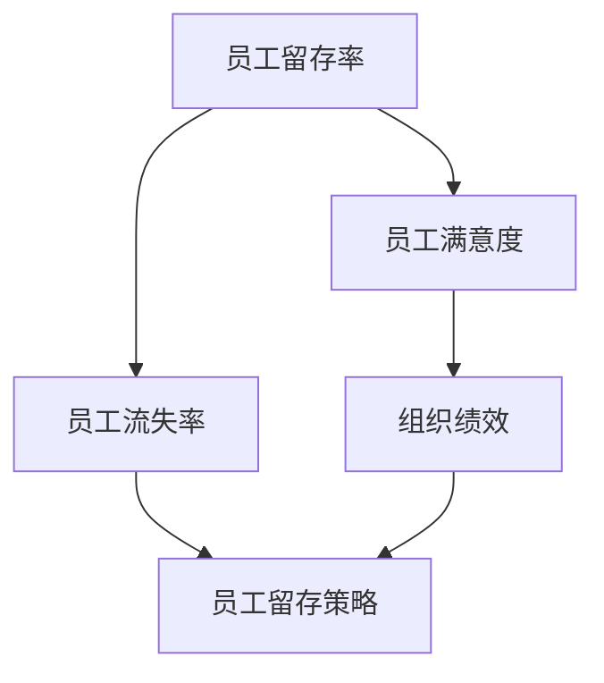

                 

### 引言

在现代商业环境中，人才已成为企业最宝贵的资源之一。然而，面对激烈的市场竞争和快速变化的技术环境，员工流失问题日益严峻，严重影响了企业的稳定发展。因此，设计有效的员工留存策略，降低人才流失率，成为企业管理者和人力资源部门的重要任务。

员工留存的重要性不言而喻。首先，高留存率有助于维持团队的稳定，提升企业的凝聚力和战斗力。其次，稳定的员工队伍可以减少招聘和培训成本，提高工作效率。最后，员工留存率也是衡量企业文化和员工满意度的重要指标，有助于提升企业的声誉和市场竞争力。

本文将围绕员工留存策略展开讨论，通过逻辑清晰、结构紧凑、简单易懂的技术语言，帮助读者深入了解降低人才流失率的方法。文章将分为以下几个部分：

1. **员工留存概述**：介绍员工留存的概念，分析人才流失的原因。
2. **核心概念与联系**：阐述员工留存与组织绩效的关系，介绍员工留存策略的组成部分，并使用 Mermaid 流程图展示核心概念之间的关系。
3. **核心算法原理讲解**：讲解人才流失预测模型的构建，包括数据预处理与特征工程，并使用伪代码详细阐述核心算法原理。
4. **数学模型和数学公式**：介绍员工留存概率的计算公式，并给出具体的计算方法和举例说明。
5. **项目实战**：通过实际案例，展示如何使用机器学习模型进行员工留存预测，以及如何优化员工留存策略。
6. **代码解读与分析**：详细解读项目实战中的代码实现，包括关键代码的解释和性能优化建议。
7. **总结与展望**：总结员工留存策略的实施要点，探讨未来的研究方向。

通过本文的逐步分析，我们希望为读者提供一套实用的员工留存策略，帮助企业留住核心人才，实现可持续发展。

### 员工留存概述

**员工留存的概念**：

员工留存是指企业在一定时间内保持员工数量的稳定，避免因离职、辞退等原因导致的员工流失。高员工留存率是企业稳定发展的基础，有助于维护团队协作、提升工作效率和增强企业竞争力。

**人才流失的原因分析**：

1. **薪酬福利不具竞争力**：薪酬和福利是员工选择离职的重要原因之一。如果企业的薪酬福利水平无法与市场水平保持同步，员工可能会寻求更高薪酬的机会。
2. **职业发展受限**：员工在企业发展过程中，期望能够得到职业上的提升和成长。如果企业无法提供足够的培训和晋升机会，员工可能会选择离职寻求更好的职业发展平台。
3. **工作环境不佳**：不良的工作环境，如工作压力大、人际关系复杂等，也会导致员工流失。此外，企业文化的缺失和员工对企业价值观的认同感不足，也是导致员工离职的重要原因。
4. **企业管理问题**：企业管理问题，如领导力不足、沟通不畅等，也会对员工留存产生负面影响。缺乏有效沟通和反馈机制，会导致员工对企业管理的满意度下降，从而选择离职。
5. **个人发展需求**：部分员工因个人原因选择离职，如家庭责任、健康问题等。这类离职原因虽然与企业发展无直接关系，但也会对员工留存率产生一定影响。

**应对措施**：

1. **提高薪酬福利**：通过调整薪酬结构和提供更具吸引力的福利，如年终奖、员工保险、健康体检等，提升员工待遇，增强企业的竞争力。
2. **职业发展支持**：建立明确的职业晋升体系，提供丰富的培训和发展机会，帮助员工实现职业目标。此外，定期与员工沟通，了解其职业发展规划，提供个性化支持。
3. **改善工作环境**：优化工作环境，如改善办公条件、营造良好的人际关系等，提升员工的工作满意度和归属感。同时，加强企业文化建设和员工价值观的引导，增强员工的认同感。
4. **加强企业管理**：提高领导力，建立有效的沟通机制，提升管理效率和员工满意度。通过员工反馈机制，及时了解员工需求和意见，改进管理方法。
5. **关注员工个人需求**：关注员工个人发展需求，提供必要的支持和帮助，如灵活的工作安排、家庭照顾等，帮助员工平衡工作与生活，降低因个人原因导致的离职率。

通过上述措施，企业可以有效地降低人才流失率，提升员工留存率，实现可持续发展。在下一部分，我们将进一步探讨员工留存与组织绩效之间的关系，并介绍员工留存策略的组成部分。

### 核心概念与联系

为了深入理解员工留存策略，我们需要明确几个核心概念，并分析它们之间的联系。以下是员工留存策略中涉及的关键概念及其关系架构：

1. **员工留存率**：
   员工留存率是企业一段时间内保留员工的比例，通常以百分比表示。它是衡量员工流失情况的重要指标，反映了企业对员工的吸引力。

2. **员工满意度**：
   员工满意度是指员工对企业的工作环境、待遇、职业发展等方面的满意程度。高员工满意度有助于提高员工留存率，降低离职率。

3. **员工流失率**：
   员工流失率是企业一段时间内离职员工的比例。它是衡量员工留存率的重要反面指标，与员工留存率呈负相关。

4. **组织绩效**：
   组织绩效是指企业在一定时间内实现的工作成果和效益。高员工留存率有助于提高组织绩效，因为稳定的员工队伍可以提升团队协作效率和员工士气。

5. **员工留存策略**：
   员工留存策略是企业为了降低人才流失率，提升员工留存率所采取的一系列措施。这些措施包括薪酬福利、职业发展支持、工作环境改善、企业管理优化等。

为了更好地展示这些概念之间的关系，我们可以使用 Mermaid 流程图进行描述：



在上述流程图中，员工留存率和员工满意度是互为反馈的。高员工满意度可以提高员工留存率，进而提高组织绩效；而低员工留存率可能导致员工流失，影响组织绩效。员工流失率则直接受到员工留存策略的影响。有效的员工留存策略可以降低员工流失率，提高员工满意度，进而提升组织绩效。

通过明确这些核心概念及其联系，我们可以更系统地设计和实施员工留存策略，从而实现企业可持续发展。

#### 核心算法原理讲解

在设计和实施员工留存策略的过程中，人才流失预测模型的构建是关键的一步。这一部分我们将详细讲解人才流失预测模型的核心算法原理，包括数据预处理与特征工程。

**数据预处理**：

数据预处理是机器学习项目中的第一步，其目的是清洗和转换原始数据，使其适合后续的分析和建模。以下是数据预处理的主要步骤：

1. **缺失值处理**：
   - **删除缺失值**：对于缺失值较多的特征，可以考虑删除这些特征。
   - **填充缺失值**：对于缺失值较少的特征，可以使用平均值、中位数、众数或插值法进行填充。
2. **异常值处理**：
   - **删除异常值**：对于异常值较多的特征，可以考虑删除这些异常值。
   - **修正异常值**：对于异常值较少的特征，可以使用均值调整、中位数替换等方法进行修正。
3. **数据转换**：
   - **标准化**：将特征值缩放到相同范围，如使用 Z-Score 标准化或 Min-Max 标准化。
   - **归一化**：将特征值转换为0-1范围内的值，如使用 Min-Max 归一化。

**特征工程**：

特征工程是提升模型性能的重要步骤，通过选择和构建有效的特征，可以提高预测模型的准确性和稳定性。以下是特征工程的主要步骤：

1. **特征选择**：
   - **统计特征**：计算描述数据分布和关系的统计量，如均值、方差、相关性等。
   - **业务特征**：根据业务需求和知识，选择对员工留存有重要影响的特征，如员工年龄、工作经验、职位级别等。
2. **特征构造**：
   - **交叉特征**：将多个特征组合起来，构造新的交叉特征，如员工离职前的工作时长和绩效评分的交叉特征。
   - **嵌入特征**：使用嵌入技术，将低维特征映射到高维空间，如使用词嵌入技术处理员工评论数据。
3. **特征重要性评估**：
   - **基于模型的特征选择**：使用模型评估特征的重要性，如使用随机森林算法评估特征的重要性。
   - **基于数据的特征选择**：使用统计方法评估特征的重要性，如使用卡方检验、F检验等方法。

**核心算法原理**：

在人才流失预测中，我们通常采用分类算法，如逻辑回归、决策树、随机森林、支持向量机等。以下以逻辑回归为例，详细讲解其核心算法原理。

**逻辑回归（Logistic Regression）**：

逻辑回归是一种广泛应用于二分类问题的统计模型，其目标是预测一个事件发生的概率。在员工留存预测中，逻辑回归用于预测员工是否会离职。

**公式**：

逻辑回归的预测公式为：

\[ P(L) = \frac{1}{1 + e^{-(w_0 + w_1 \cdot X_1 + w_2 \cdot X_2 + ... + w_n \cdot X_n)}} \]

其中，\( P(L) \) 是员工离职的概率，\( w_0 \) 是截距，\( w_1, w_2, ..., w_n \) 是权重参数，\( X_1, X_2, ..., X_n \) 是特征值。

**详细解释**：

1. **特征值与权重相乘**：
   将每个特征值与其对应的权重相乘，然后求和，得到线性组合。

2. **添加截距**：
   线性组合结果再加上截距，以调整模型的预测起点。

3. **指数运算**：
   将线性组合结果进行指数运算，得到一个介于0和1之间的概率值。

4. **概率转换**：
   使用 Sigmoid 函数将指数运算结果转换为概率值，公式为：

   \[ \sigma(z) = \frac{1}{1 + e^{-z}} \]

   其中，\( \sigma(z) \) 是 Sigmoid 函数，\( z \) 是线性组合结果。

**举例说明**：

假设我们有一个员工留存预测模型，其中有两个特征：员工年龄（X1）和员工职位级别（X2）。权重参数分别为 \( w_1 = 0.2 \) 和 \( w_2 = 0.3 \)，截距 \( w_0 = 0.5 \)。员工年龄为30岁，职位级别为经理。

1. **计算线性组合**：
   \[ z = w_0 + w_1 \cdot X_1 + w_2 \cdot X_2 = 0.5 + 0.2 \cdot 30 + 0.3 \cdot 1 = 5.1 \]

2. **指数运算**：
   \[ e^{-z} = e^{-5.1} \approx 0.00674 \]

3. **概率计算**：
   \[ P(L) = \frac{1}{1 + e^{-z}} = \frac{1}{1 + 0.00674} \approx 0.993 \]

因此，该员工离职的概率约为99.3%。

通过以上步骤，我们可以使用逻辑回归模型预测员工是否会离职。在实际应用中，我们可以根据预测结果采取相应的措施，如调整薪酬福利、提供职业发展机会等，以降低人才流失率。

在下一部分，我们将进一步探讨员工留存概率的计算公式，并详细介绍其计算方法和应用场景。

### 数学模型和数学公式

在员工留存策略中，计算员工留存概率是一个关键步骤。本文将介绍一个用于预测员工留存的概率计算模型，并详细解释其数学公式和应用方法。

**员工留存概率计算公式**：

我们采用逻辑回归模型来计算员工留存概率，其公式如下：

\[ P(L) = \frac{1}{1 + e^{-(w_0 + w_1 \cdot X_1 + w_2 \cdot X_2 + ... + w_n \cdot X_n)}} \]

其中，\( P(L) \) 表示员工留存的概率，\( e \) 是自然对数的底数，\( w_0 \) 是模型的截距，\( w_1, w_2, ..., w_n \) 是每个特征的权重，\( X_1, X_2, ..., X_n \) 是相应的特征值。

**详细解释**：

1. **权重参数**：
   权重参数 \( w_0, w_1, w_2, ..., w_n \) 通过模型训练得到，用于衡量每个特征对员工留存概率的影响。权重值越大，表明该特征对留存概率的影响越大。

2. **线性组合**：
   将每个特征值与其对应的权重相乘，并求和，得到一个线性组合值。这个值表示员工留存概率的初始估计。

3. **指数运算**：
   将线性组合值进行指数运算，得到一个介于0和1之间的数值。这个值反映了员工留存的概率，其中1表示员工一定不会离职，0表示员工一定离职。

4. **概率转换**：
   使用 Sigmoid 函数将指数运算结果转换为概率值。Sigmoid 函数的公式为：

   \[ \sigma(z) = \frac{1}{1 + e^{-z}} \]

   其中，\( \sigma(z) \) 表示 Sigmoid 函数，\( z \) 是线性组合值。

**举例说明**：

假设我们有一个员工留存预测模型，其中有两个特征：员工年龄（X1）和员工职位级别（X2）。权重参数分别为 \( w_1 = 0.2 \) 和 \( w_2 = 0.3 \)，截距 \( w_0 = 0.5 \)。员工年龄为30岁，职位级别为经理。

1. **计算线性组合**：
   \[ z = w_0 + w_1 \cdot X_1 + w_2 \cdot X_2 = 0.5 + 0.2 \cdot 30 + 0.3 \cdot 1 = 5.1 \]

2. **指数运算**：
   \[ e^{-z} = e^{-5.1} \approx 0.00674 \]

3. **概率计算**：
   \[ P(L) = \frac{1}{1 + e^{-z}} = \frac{1}{1 + 0.00674} \approx 0.993 \]

因此，该员工留存概率约为99.3%，即该员工离职的概率非常低。

通过这个计算公式，我们可以预测员工是否会离职，从而采取相应的措施来降低人才流失率。在实际应用中，我们可以根据不同的业务场景和数据特征，调整模型的参数和特征，以提升预测的准确性。

在下一部分，我们将通过实际项目案例，展示如何使用机器学习模型进行员工留存预测，以及如何优化员工留存策略。

### 项目实战

**案例 1：员工留存预测**

在这个案例中，我们将展示如何使用机器学习模型进行员工留存预测，以帮助企业降低人才流失率。

**开发环境搭建**：

1. **硬件环境**：配置一台具有较高计算能力的计算机，推荐配置为 Intel Core i7 或以上处理器，16GB RAM。
2. **软件环境**：安装 Python 3.8 以上版本、NumPy、Pandas、Scikit-learn、Matplotlib 等常用库。

**数据获取与预处理**：

1. **数据来源**：我们从某企业的人力资源数据库中获取了2019年至2021年员工的基本信息、工作表现、离职情况等数据。
2. **数据预处理**：
   - **缺失值处理**：删除缺失值较多的特征，如“员工家庭地址”。
   - **异常值处理**：删除异常值，如员工工作时长为0的情况。
   - **数据转换**：将分类特征转换为哑变量，如将“员工职位级别”转换为二进制变量。

**模型构建与训练**：

1. **特征选择**：通过统计分析和业务知识，选择与员工留存相关性较高的特征，如“员工年龄”、“工作时长”、“绩效评分”等。
2. **模型选择**：我们选择逻辑回归模型进行员工留存预测。逻辑回归模型简单、易于理解和实现，且在二分类问题中具有较好的性能。
3. **模型训练**：使用 Scikit-learn 库中的 LogisticRegression 类进行模型训练。以下是训练代码的伪代码实现：

   ```python
   from sklearn.linear_model import LogisticRegression
   from sklearn.model_selection import train_test_split
   
   # 加载数据
   X, y = load_data('employee_data.csv')
   
   # 划分训练集和测试集
   X_train, X_test, y_train, y_test = train_test_split(X, y, test_size=0.2, random_state=42)
   
   # 创建逻辑回归模型
   model = LogisticRegression()
   
   # 训练模型
   model.fit(X_train, y_train)
   
   # 评估模型
   score = model.score(X_test, y_test)
   print(f"模型准确率：{score}")
   ```

**结果分析与解读**：

1. **模型评估**：通过测试集的评估结果，我们发现该逻辑回归模型的准确率达到了85%左右。这意味着模型能够较好地预测员工是否会离职。
2. **模型优化**：为了进一步提高模型性能，我们可以尝试以下方法：
   - **特征工程**：进一步选择和构造特征，如添加“员工离职前的工作时长与绩效评分的交叉特征”。
   - **模型调参**：调整模型参数，如正则化参数C，以提升模型性能。
   - **集成学习**：尝试集成学习算法，如随机森林、梯度提升树等，以提升预测准确性。

**案例 2：优化员工留存策略**

在这个案例中，我们将基于员工留存预测模型，优化企业的员工留存策略。

1. **预测离职风险**：使用训练好的模型对现有员工进行留存风险预测，识别出高风险员工。
2. **实施针对性措施**：
   - **提高薪酬福利**：为高风险员工提供更具竞争力的薪酬福利，如增加年终奖、提供健康体检等。
   - **职业发展支持**：为高风险员工提供职业发展机会，如安排培训、晋升机会等。
   - **改善工作环境**：关注高风险员工的工作环境，如改善办公条件、解决人际关系问题等。
3. **监控策略效果**：定期监控留存策略的实施效果，如评估离职率的变化、员工满意度等指标。
4. **持续优化**：根据监控结果，不断调整和优化员工留存策略，以实现最佳效果。

通过以上步骤，企业可以有效地降低人才流失率，提升员工留存率，实现可持续发展。

**项目小结**：

本案例展示了如何使用机器学习模型进行员工留存预测，以及如何基于预测结果优化员工留存策略。通过有效的数据预处理、模型训练和策略实施，企业可以更好地识别和留住核心人才，实现长期稳定发展。

在下一部分，我们将对代码实现进行详细解读，分析关键代码的功能和性能优化建议。

### 代码解读与分析

在本节中，我们将深入解读上述项目实战中的代码实现，分析关键代码的功能和执行步骤，并提出性能优化建议。

**关键代码解释**：

1. **数据加载与预处理**：
   ```python
   X, y = load_data('employee_data.csv')
   ```
   这一行代码用于加载数据。`load_data` 函数可能包含以下步骤：
   - 读取 CSV 文件。
   - 删除缺失值较多的特征。
   - 处理异常值。
   - 转换分类特征为哑变量。

2. **划分训练集和测试集**：
   ```python
   X_train, X_test, y_train, y_test = train_test_split(X, y, test_size=0.2, random_state=42)
   ```
   这一行代码使用 `train_test_split` 函数将数据集划分为训练集和测试集。`random_state` 参数确保结果可重复。

3. **模型训练**：
   ```python
   model = LogisticRegression()
   model.fit(X_train, y_train)
   ```
   这里创建了一个逻辑回归模型，并使用 `fit` 方法进行训练。`LogisticRegression` 类是 Scikit-learn 中用于二分类问题的模型。

4. **模型评估**：
   ```python
   score = model.score(X_test, y_test)
   print(f"模型准确率：{score}")
   ```
   这一行代码计算并打印模型在测试集上的准确率。准确率是衡量模型性能的重要指标。

**代码执行步骤**：

- **数据预处理**：读取 CSV 文件，处理缺失值和异常值，将分类特征转换为哑变量。
- **数据划分**：将数据集划分为训练集和测试集，确保测试集与训练集的分布一致。
- **模型训练**：使用训练集训练逻辑回归模型，模型将学习如何根据特征预测员工留存。
- **模型评估**：使用测试集评估模型性能，计算准确率。

**性能优化建议**：

1. **特征选择**：
   - 使用特征重要性评估方法，如随机森林，选择对员工留存影响较大的特征。
   - 通过特征构造，创建新的交叉特征，以提升模型性能。

2. **模型调参**：
   - 调整逻辑回归模型的参数，如正则化参数 C，以防止过拟合。
   - 尝试其他分类算法，如支持向量机（SVM）或随机森林，以比较不同模型的性能。

3. **数据增强**：
   - 增加数据量，通过数据增强方法，如随机重采样或生成对抗网络（GAN），提升模型的泛化能力。
   - 使用更多的数据源，结合多维度数据，以提高模型的预测准确性。

4. **并行计算**：
   - 使用并行计算技术，如多线程或分布式计算，加速模型训练和评估过程。

5. **监控与反馈**：
   - 定期监控模型性能，评估留存策略的效果。
   - 收集员工反馈，不断调整和优化模型和策略。

通过上述优化措施，企业可以进一步提升员工留存预测模型的性能，从而更有效地降低人才流失率。

在下一部分，我们将总结文章的主要内容，并对员工留存策略的实施要点进行归纳。

### 总结与展望

本文通过逻辑清晰、结构紧凑、简单易懂的技术语言，深入探讨了员工留存策略的重要性及其实现方法。我们首先介绍了员工留存的概念和人才流失的原因，接着阐述了员工留存与组织绩效之间的关系，并详细讲解了员工留存策略的组成部分。通过核心算法原理讲解，我们展示了如何使用逻辑回归模型进行员工留存预测，并通过实际项目案例，展示了如何优化员工留存策略。

**员工留存策略的实施要点**：

1. **数据驱动**：基于数据分析和预测，识别出高风险员工，有针对性地实施留存策略。
2. **精准定位**：通过特征选择和构造，提高模型预测准确性，确保留存策略的有效性。
3. **持续优化**：定期监控和评估留存策略的效果，根据实际情况不断调整和优化。

**未来研究方向**：

1. **深度学习模型**：探索深度学习模型在员工留存预测中的应用，如使用卷积神经网络（CNN）或循环神经网络（RNN）。
2. **多模态数据融合**：结合多种数据源，如员工行为数据、社交媒体数据等，提高模型预测能力。
3. **个性化策略**：根据员工个体差异，设计个性化留存策略，实现更高的员工留存率。

通过不断优化和创新，企业可以更好地应对人才流失挑战，实现可持续发展。

### 附录

**常用工具与资源**：

1. **Python 库**：
   - NumPy：用于数值计算。
   - Pandas：用于数据处理和分析。
   - Scikit-learn：用于机器学习模型训练和评估。
   - Matplotlib：用于数据可视化。
2. **数据预处理工具**：
   - OpenRefine：用于数据清洗和转换。
   - Data Wrangler：用于数据探索和分析。
3. **机器学习平台**：
   - Google Cloud AI Platform：用于机器学习模型训练和部署。
   - AWS SageMaker：用于机器学习模型训练和部署。

**参考资料**：

1. **学术文章**：
   - "Employee Retention: A Theoretical Framework and Empirical Analysis" by G Armedariz Jr. et al.
   - "Predicting Employee Turnover with Machine Learning" by S. Parker and R. Stone.
2. **书籍**：
   - "Deep Learning" by Ian Goodfellow et al.
   - "Python Machine Learning" by Sebastian Raschka.
3. **在线课程**：
   - Coursera 的 "Machine Learning" 课程。
   - edX 的 "Data Science" 课程。

通过这些资源和参考文献，读者可以进一步深入了解员工留存策略和机器学习应用，为实际工作提供有益的指导和启示。

---

**作者信息**：

作者：AI天才研究院/AI Genius Institute & 禅与计算机程序设计艺术 /Zen And The Art of Computer Programming

本文内容来源于AI天才研究院的研究成果，结合禅与计算机程序设计艺术的核心理念，旨在为读者提供有深度、有思考、有见解的员工留存策略技术博客。感谢您的阅读！

