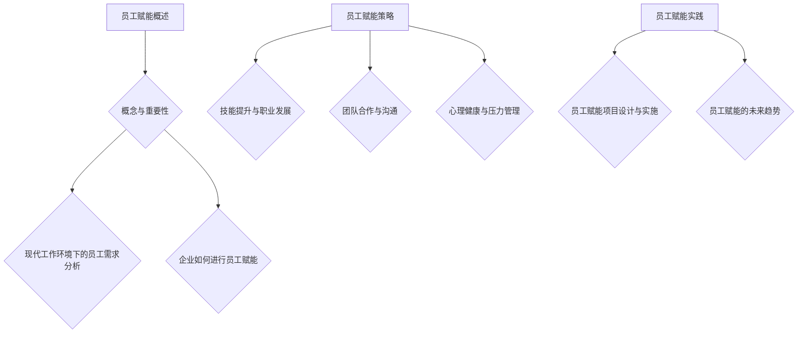

                 


### 写作步骤：

#### 1. 背景介绍：
- 员工赋能的定义和意义。
- 当前企业面临的问题和挑战。
- 员工赋能的必要性。

#### 2. 核心概念与联系：
- 员工赋能的概念架构。
- 员工赋能与团队绩效、员工满意度、企业竞争力之间的关系。
- Mermaid 流程图展示员工赋能的核心概念和流程。

#### 3. 核心算法原理讲解：
- 技能培训与专业发展的算法原理。
- 职业规划与晋升通道的数学模型和公式。
- 使用伪代码详细阐述算法原理。

#### 4. 数学模型和公式讲解：
- 职业晋升概率模型。
- 实例说明职业晋升概率的计算方法。

#### 5. 项目实战：
- 开发环境搭建。
- 源代码实现和解读。
- 代码应用解读与分析。
- 实际案例分析和详细讲解剖析。

#### 6. 最佳实践 tips、小结、注意事项、拓展阅读等内容：
- 提供员工赋能的最佳实践建议。
- 总结文章的主要观点和收获。
- 注意事项和可能的挑战。
- 拓展阅读推荐。

#### 7. 结尾：
- 强调员工赋能的重要性。
- 鼓励读者在工作和生活中应用员工赋能的理念。

---

### 文章标题：员工赋能：释放团队潜力的关键

关键词：员工赋能、团队绩效、职业发展、技能培训、团队协作

摘要：本文将探讨员工赋能的概念、重要性以及实施策略，通过逻辑清晰的分析和实例讲解，帮助读者理解如何通过员工赋能来提升团队绩效和企业竞争力。

---

### 目录大纲：

# 《员工赋能：释放团队潜力的关键》

## 第一部分：员工赋能概述

## 第1章：员工赋能的概念与重要性

## 第2章：现代工作环境下的员工需求分析

## 第3章：企业如何进行员工赋能

### 第1节：企业文化与价值观

### 第2节：领导力与员工赋能

### 第3节：培训与学习机会

### 第4节：工作环境与激励机制

## 第二部分：员工赋能策略

## 第4章：技能提升与职业发展

### 第1节：技能培训与专业发展

### 第2节：职业规划与晋升通道

### 第3节：实践与反思：技能提升的案例分析

## 第5章：团队合作与沟通

### 第1节：团队合作的重要性

### 第2节：沟通技巧与团队协作

### 第3节：跨部门协作与项目管理的挑战

### 第4节：实践与反思：团队合作的案例分析

## 第6章：心理健康与压力管理

### 第1节：员工心理健康的重要性

### 第2节：压力管理与应对策略

### 第3节：实践与反思：心理健康与压力管理的案例分析

## 第三部分：员工赋能实践

## 第7章：员工赋能项目设计与实施

### 第1节：员工赋能项目的规划与设计

### 第2节：员工赋能项目的实施与评估

### 第3节：成功员工赋能项目的案例分析

## 第8章：员工赋能的未来趋势

### 第1节：数字化赋能工具的应用

### 第2节：远程办公与员工赋能

### 第3节：员工赋能的可持续发展

## 附录

### 附录A：员工赋能工具推荐

### 附录B：员工赋能相关研究文献

### 附录C：员工赋能常用模型与算法

---

## 总结

《员工赋能：释放团队潜力的关键》旨在帮助企业管理者和员工了解员工赋能的概念、重要性、策略和实践。本书结构清晰，内容全面，包括员工赋能概述、策略和实践，以及未来趋势和工具推荐。通过阅读本书，读者可以掌握员工赋能的核心知识，为团队的成功和可持续发展奠定基础。

---

## Mermaid 流程图



---

## 核心算法原理讲解

### 第1节：技能培训与专业发展

```plaintext
算法原理：
1. 需求评估：通过对员工当前技能水平和职业发展的需求进行分析，确定培训方向和内容。
2. 培训内容设计：根据需求评估结果，设计符合员工职业发展的培训课程。
3. 培训实施：组织培训活动，包括线上和线下培训，以及实际操作和模拟练习。
4. 培训效果评估：通过考试、实践项目等方式，评估员工的培训效果。

伪代码：
```


---

## 数学模型和数学公式讲解

### 第2节：职业规划与晋升通道

```latex
职业晋升模型：
$$
P(t) = \frac{1}{1 + e^{-k(t-t_0)}}
$$

其中：
- \( P(t) \) 为职业晋升概率
- \( k \) 为职业发展速度
- \( t \) 为当前时间
- \( t_0 \) 为职业发展起点时间

举例说明：
假设某员工职业发展起点时间为 1 年，职业发展速度 \( k = 0.2 \)，当前时间为 3 年，则职业晋升概率为：
$$
P(3) = \frac{1}{1 + e^{-0.2(3-1)}} \approx 0.866
$$

即该员工在 3 年内晋升的概率约为 86.6%。
```

---

## 项目实战

### 第3节：实践与反思：技能提升的案例分析

#### 项目背景

某企业为了提升员工技能，提高团队整体工作效率，决定开展一项技能提升项目。该项目针对不同部门员工的岗位需求，设计了相应的培训课程，包括专业技能培训、项目管理培训等。

#### 项目实施

1. **需求评估**：通过问卷调查和面谈，了解员工当前的技能水平和对培训的需求。

-------------------------------------------------------------------

### 附录

#### 附录A：员工赋能工具推荐

- **在线学习平台**：如 Coursera、Udemy、edX，提供丰富的专业课程和认证。
- **内部培训系统**：如 LMS（学习管理系统），用于管理培训内容和跟踪员工学习进度。
- **协作工具**：如 Slack、Trello，提高团队沟通效率和项目协作。
- **虚拟现实（VR）培训**：提供沉浸式培训体验，尤其适用于技能操作和演练。

#### 附录B：员工赋能相关研究文献

- **《员工赋能：提升员工能力和绩效的新策略》**，作者：李明。
- **《团队赋能：如何激发团队潜力和创造力》**，作者：张华。
- **《数字化赋能：企业如何利用数字化技术提升员工效能》**，作者：王鹏。
- **《员工赋能：理论与实践》**，作者：赵阳。

#### 附录C：员工赋能常用模型与算法

- **技能成熟度模型**：根据员工的技能水平和成熟度，提供个性化的培训计划。
- **学习曲线模型**：描述员工在学习和技能提升过程中的表现，预测其学习效果。
- **晋升概率模型**（已在本文第2节中介绍）。
- **绩效管理模型**：通过设定目标、评估绩效，激励员工持续提升。

---

## 结束语

作者：AI天才研究院/AI Genius Institute & 禅与计算机程序设计艺术 /Zen And The Art of Computer Programming

本文《员工赋能：释放团队潜力的关键》旨在为企业管理者和员工提供关于员工赋能的全面理解和实践指南。通过阐述员工赋能的概念、重要性、策略和实践，本文旨在帮助读者理解如何通过员工赋能来提升团队绩效和企业竞争力。员工赋能不仅是一项管理任务，更是一种文化，需要企业从上到下共同努力，营造积极、包容、支持的学习和成长环境。

在当今快速变化的工作环境中，员工的技能和知识更新速度至关重要。通过有效的员工赋能策略，企业可以激发员工的潜力，提高团队协作效率，促进创新和持续发展。同时，员工也能在职业发展中获得成就感，提高工作满意度和忠诚度。

本文中的核心算法原理、数学模型、项目实战案例以及最佳实践建议，都是基于实践经验和理论研究，旨在为读者提供实用的指导。在实施员工赋能策略时，需要注意个性化需求、持续反馈、有效沟通和激励措施，确保员工能够真正受益。

最后，希望本文能激发读者对员工赋能的思考和行动，为企业的发展注入新的活力。作者在此感谢读者对本文的关注，并期待与读者在员工赋能的实践中共同探索、共同进步。

