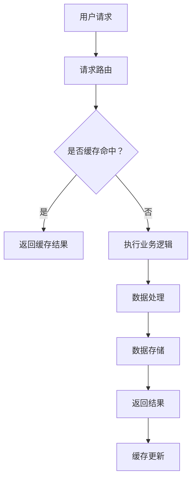

                 

# 文章标题

《响应式架构提升LLM应用的性能与可靠性》

> 关键词：响应式架构，大语言模型（LLM），性能优化，可靠性保障，异步通信，模块化设计，流处理框架，实时推理，故障恢复机制

> 摘要：本文深入探讨了响应式架构在提升大语言模型（LLM）应用性能与可靠性方面的作用。首先介绍了响应式架构的基础概念和设计原则，随后分析了LLM应用的性能瓶颈，提出了相应的优化策略。文章重点探讨了响应式架构在LLM应用中的实践应用，包括自然语言处理、深度学习训练和实时推理等场景。最后，文章提出了提高LLM应用可靠性的方法，并提供了实际案例和未来展望，为开发者提供了一系列最佳实践和指导。

### 第一部分：响应式架构基础

#### 第1章：响应式架构概述

## 1.1 响应式架构的定义与核心概念

### 1.1.1 响应式架构的起源与发展

响应式架构（Reactive Architecture）起源于20世纪90年代的分布式系统研究和实践，旨在解决分布式系统中处理大量并发请求、高可用性、容错性和伸缩性等问题。随着互联网和移动设备的普及，响应式架构逐渐成为应对现代应用复杂性、提高系统性能和可靠性的主流设计模式。

在传统的客户端-服务器架构中，系统通常按照请求-响应模式进行设计，服务器在接收到请求后进行计算，然后返回结果。然而，这种模式在面对高并发、高负载的情况下，往往难以满足性能和可靠性的要求。响应式架构则通过引入异步通信、事件驱动和流处理等技术，实现了系统的解耦和动态伸缩，提高了系统的响应速度和容错能力。

### 1.1.2 响应式架构与传统架构的差异

响应式架构与传统架构在系统设计理念、通信机制、架构风格等方面存在显著差异。

- **系统设计理念**：传统架构以同步操作为主，请求-响应模式使得系统在处理请求时必须等待结果返回，导致系统资源利用率低下。响应式架构则以异步操作为主，通过事件驱动和消息传递实现任务的并行处理，提高了系统的性能和响应速度。

- **通信机制**：传统架构中的通信机制主要依赖于同步调用和共享内存，容易导致竞争条件和死锁问题。响应式架构采用异步通信机制，通过消息队列和事件总线等中间件实现系统的解耦和高效通信，降低了系统复杂性和故障风险。

- **架构风格**：传统架构通常采用分层设计，各层之间紧密耦合，难以进行模块化扩展。响应式架构采用模块化设计，通过定义明确的接口和事件流，实现了系统的灵活扩展和动态调整。

### 1.1.3 响应式架构的核心概念

响应式架构的核心概念包括异步通信、事件驱动、模块化设计、流处理和弹性伸缩等。

- **异步通信**：异步通信是一种非阻塞的通信机制，允许发送者和接收者独立进行操作，无需等待对方完成。异步通信提高了系统的并发处理能力和资源利用率，降低了系统延迟和响应时间。

- **事件驱动**：事件驱动是一种编程范式，通过监听和响应事件来实现系统的功能。事件驱动模式使得系统可以更加灵活地处理各种事件，提高了系统的可扩展性和可维护性。

- **模块化设计**：模块化设计将系统划分为多个功能独立的模块，每个模块负责处理特定任务。模块化设计使得系统具有更好的可复用性和可维护性，便于进行功能扩展和优化。

- **流处理**：流处理是一种处理大量数据流的技术，通过实时分析数据流中的数据，实现数据的高效处理和利用。流处理技术使得系统可以实时响应数据变化，提高系统的实时性和准确性。

- **弹性伸缩**：弹性伸缩是指系统能够根据负载变化自动调整资源利用率，实现系统的动态扩展和收缩。弹性伸缩提高了系统的可靠性和可用性，降低了系统的运行成本。

## 1.2 响应式架构的设计原则

### 1.2.1 响应式架构的设计原则

响应式架构遵循以下设计原则，以确保系统的性能、可靠性和可扩展性。

- **去中心化**：去中心化设计使得系统不再依赖于单一的中心节点，各节点之间独立运行，降低了系统的单点故障风险。

- **分布式**：分布式设计将系统划分为多个节点，每个节点独立处理部分功能，提高了系统的并行处理能力和容错性。

- **可伸缩性**：可伸缩性设计使得系统可以根据需求动态调整资源利用率，实现系统的弹性扩展和收缩。

- **模块化**：模块化设计将系统划分为多个功能独立的模块，每个模块负责处理特定任务，降低了系统的复杂性和耦合度。

- **事件驱动**：事件驱动设计通过监听和响应事件实现系统的功能，提高了系统的可扩展性和可维护性。

- **异步通信**：异步通信设计降低了系统间的耦合度，提高了系统的并发处理能力和性能。

- **容错性**：容错性设计通过冗余和故障转移机制，提高了系统的可靠性和可用性。

### 1.2.2 响应式架构的模块化与解耦合

模块化设计是响应式架构的核心特征之一。模块化设计将系统划分为多个功能独立的模块，每个模块负责处理特定任务。模块化设计具有以下优势：

- **降低系统复杂度**：模块化设计将复杂系统分解为多个简单模块，降低了系统的复杂度和耦合度，提高了系统的可维护性和可扩展性。

- **提高代码复用性**：模块化设计使得各个模块可以独立开发、测试和部署，提高了代码的复用性和可维护性。

- **便于功能扩展**：模块化设计使得新功能可以以模块的形式添加到系统中，降低了系统的修改成本和风险。

解耦合是模块化设计的关键，它通过减少模块间的直接依赖关系，提高了系统的稳定性和可扩展性。解耦合可以通过以下几种方式实现：

- **定义明确的接口**：模块之间通过定义明确的接口进行通信，降低了模块间的耦合度。

- **使用事件总线**：事件总线是一种消息传递机制，模块可以通过发布和订阅事件实现通信，降低了模块间的耦合度。

- **使用中间件**：中间件充当模块之间的通信桥梁，减少了模块间的直接交互，降低了耦合度。

### 1.2.3 响应式架构的异步通信机制

异步通信是响应式架构的核心机制之一，它通过允许发送者和接收者独立执行任务，提高了系统的并发处理能力和性能。异步通信机制具有以下特点：

- **非阻塞**：异步通信不会阻塞线程，发送者和接收者可以独立执行任务，提高了系统的并发处理能力。

- **事件驱动**：异步通信通过事件驱动实现，发送者发布事件，接收者监听并处理事件，提高了系统的响应速度和可扩展性。

- **高效传输**：异步通信通常使用消息队列或事件总线等中间件进行传输，提高了数据传输的效率和可靠性。

在响应式架构中，异步通信机制可以通过以下几种方式实现：

- **回调函数**：回调函数是一种将处理函数作为参数传递给其他函数的机制，实现异步处理。

- **事件监听器**：事件监听器是一种监听特定事件并执行相应处理函数的机制，实现异步响应。

- **异步编程框架**：异步编程框架（如Node.js、Tornado、Apache Kafka等）提供了异步编程模型和库，简化了异步通信的实现。

## 1.3 响应式架构的关键技术

### 1.3.1 响应式编程模型

响应式编程模型是一种基于数据流和事件驱动的编程范式，它通过监听和响应数据流中的变化，实现系统的动态更新和响应。响应式编程模型具有以下特点：

- **数据驱动**：响应式编程模型以数据流为核心，通过监听数据变化，自动触发相关处理逻辑。

- **函数式编程**：响应式编程模型采用函数式编程范式，使用纯函数和不可变数据结构，提高了代码的可复用性和可维护性。

- **事件驱动**：响应式编程模型通过事件监听和回调函数实现异步处理，提高了系统的并发处理能力和响应速度。

在响应式编程模型中，常见的编程框架包括ReactiveX、Redux、Angular、Vue等。这些框架提供了响应式编程的API和工具，简化了响应式应用程序的开发。

### 1.3.2 反应式流处理框架

反应式流处理框架是一种用于处理大规模数据流的工具，它通过实时分析数据流中的数据，实现数据的实时处理和利用。反应式流处理框架具有以下特点：

- **实时处理**：反应式流处理框架支持实时处理大量数据流，可以快速响应数据变化。

- **弹性伸缩**：反应式流处理框架可以根据数据流的变化动态调整资源利用率，实现系统的弹性伸缩。

- **分布式处理**：反应式流处理框架支持分布式处理，可以将数据处理任务分布在多个节点上执行，提高了系统的并行处理能力和容错性。

常见的反应式流处理框架包括Apache Kafka、Apache Flink、Apache Storm等。这些框架提供了丰富的API和工具，简化了实时数据流处理应用程序的开发。

### 1.3.3 响应式数据库与缓存技术

响应式数据库与缓存技术是响应式架构的重要组成部分，它们在提高系统性能和可靠性方面发挥了关键作用。

- **响应式数据库**：响应式数据库是一种支持实时数据查询和变更通知的数据库，它通过监听数据变更事件，实现数据的实时同步和更新。响应式数据库具有以下特点：

  - **实时查询**：响应式数据库支持实时查询，可以快速响应查询请求，提高了系统的响应速度。

  - **变更通知**：响应式数据库可以通过变更通知机制，实时通知其他模块或系统数据变更，实现了数据的一致性和协同操作。

  - **分布式存储**：响应式数据库支持分布式存储，可以将数据存储在多个节点上，提高了系统的并发处理能力和容错性。

常见的响应式数据库包括Cassandra、MongoDB、Redis等。这些数据库提供了丰富的API和工具，简化了响应式数据库应用程序的开发。

- **缓存技术**：缓存技术是一种用于提高系统性能和响应速度的技术，它通过将常用数据缓存在内存中，减少了对后端存储的访问次数。缓存技术具有以下特点：

  - **数据缓存**：缓存技术可以将常用数据缓存在内存中，减少了对后端存储的访问次数，提高了系统的响应速度。

  - **缓存一致性**：缓存技术需要确保缓存数据的一致性，以防止数据不一致问题。

  - **缓存替换策略**：缓存技术需要采用合适的缓存替换策略，确保缓存空间的有效利用。

常见的缓存技术包括Redis、Memcached、ehcache等。这些缓存技术提供了丰富的API和工具，简化了缓存应用程序的开发。

### 1.3.4 响应式架构的优势

响应式架构在性能、可靠性和可扩展性方面具有显著优势。

- **性能优势**：响应式架构通过异步通信、事件驱动和流处理等技术，提高了系统的并发处理能力和响应速度，降低了系统的延迟和响应时间。

- **可靠性优势**：响应式架构通过分布式设计和容错机制，提高了系统的可靠性和可用性，降低了系统的故障率和恢复时间。

- **可扩展性优势**：响应式架构通过模块化和弹性伸缩设计，提高了系统的可扩展性和可维护性，便于系统功能的扩展和优化。

### 1.3.5 响应式架构的挑战

尽管响应式架构在性能、可靠性和可扩展性方面具有显著优势，但在实际应用中仍面临以下挑战：

- **复杂性**：响应式架构引入了异步通信、事件驱动和流处理等技术，增加了系统的复杂性和维护成本。

- **开发难度**：响应式架构要求开发者具备较高的编程技能和设计经验，增加了开发难度。

- **性能瓶颈**：响应式架构在处理大量并发请求时，可能面临性能瓶颈，需要优化和调整系统设计。

- **兼容性**：响应式架构与传统架构在通信机制、数据格式等方面存在差异，可能影响系统的兼容性。

### 1.3.6 响应式架构的应用场景

响应式架构在以下应用场景中具有显著优势：

- **高并发、高负载系统**：如电商平台、在线游戏、实时通信等。

- **分布式系统**：如云计算平台、大数据处理、物联网等。

- **实时数据处理**：如金融交易、气象监测、智能监控等。

- **移动应用**：如移动游戏、移动办公、移动社交等。

### 1.3.7 响应式架构与微服务架构的关系

响应式架构和微服务架构都是应对现代应用复杂性、提高系统性能和可靠性的设计模式。两者之间存在一定的关系和区别。

- **关系**：响应式架构可以应用于微服务架构中，用于处理微服务之间的通信和数据流。

- **区别**：响应式架构侧重于系统内部的设计和通信机制，而微服务架构侧重于系统的服务划分和组织方式。响应式架构可以帮助微服务架构实现高并发、高可用性和可扩展性。

### 1.3.8 响应式架构的最佳实践

在设计和实施响应式架构时，可以遵循以下最佳实践：

- **模块化设计**：将系统划分为多个功能独立的模块，降低系统复杂度和耦合度。

- **异步通信**：采用异步通信机制，提高系统的并发处理能力和性能。

- **事件驱动**：采用事件驱动编程范式，提高系统的可扩展性和可维护性。

- **流处理**：采用流处理框架，实现大规模数据流的实时处理和利用。

- **弹性伸缩**：根据负载变化动态调整资源利用率，实现系统的弹性伸缩。

- **容错性**：采用容错机制，提高系统的可靠性和可用性。

- **监控与故障恢复**：实施实时监控和故障恢复机制，确保系统的稳定运行。

## 1.4 响应式架构的发展趋势

### 1.4.1 技术创新

响应式架构在近年来得到了广泛关注和快速发展，多个技术创新对其产生了重要影响：

- **微服务架构**：微服务架构的兴起推动了响应式架构的应用和发展，两者相互融合，实现了更灵活、可扩展的系统设计。

- **容器化和云原生**：容器化和云原生技术的普及，使得响应式架构在云计算和分布式系统中得到广泛应用，提高了系统的弹性伸缩和资源利用率。

- **边缘计算**：边缘计算技术的发展，使得响应式架构在靠近数据源的边缘节点得到应用，实现了实时数据处理的低延迟和高性能。

### 1.4.2 应用领域扩展

响应式架构的应用领域不断扩大，从最初的分布式系统、实时数据处理，逐步扩展到以下领域：

- **物联网**：响应式架构在物联网系统中得到广泛应用，用于处理大量传感器数据和设备通信。

- **金融科技**：金融科技领域对响应式架构的需求日益增长，用于实现高并发、高可靠性的金融交易和风控系统。

- **智能交通**：智能交通系统采用响应式架构，实现实时交通监控、路况预测和智能调度。

- **智能医疗**：智能医疗系统采用响应式架构，实现实时医疗数据分析、疾病预测和智能诊断。

### 1.4.3 未来发展方向

响应式架构在未来将继续发展和创新，以下方向值得关注：

- **跨领域融合**：响应式架构与其他领域技术（如区块链、人工智能、5G等）的融合，实现更智能化、高效化的应用。

- **自修复和自优化**：研究自修复和自优化技术，实现系统的自动化管理和优化，提高系统的可靠性和性能。

- **绿色计算**：研究绿色计算技术，降低响应式架构在运行过程中的能源消耗和碳排放，实现可持续发展。

### 1.4.4 技术社区与开源生态

响应式架构的发展离不开技术社区和开源生态的支持，多个开源项目和框架在推动响应式架构的发展：

- **Apache Kafka**：分布式流处理平台，提供了高效的异步通信和实时数据处理能力。

- **Spring Boot**：Java微服务开发框架，支持响应式编程模型和模块化设计。

- **Akka**：基于Actor模型的响应式编程框架，提供了高并发和容错性的分布式计算能力。

- **Reactive Streams**：响应式编程标准，规范了响应式流处理框架的API和设计。

### 1.4.5 企业应用与实践

多个企业将响应式架构应用于实际项目中，取得了显著成效：

- **亚马逊**：采用响应式架构构建了Amazon Web Services（AWS），实现了大规模分布式计算和实时数据处理。

- **微软**：采用响应式架构构建了Azure云平台，提供了高性能、高可靠性的云计算服务。

- **阿里巴巴**：采用响应式架构构建了电商交易系统，实现了高并发、高可用性的购物体验。

- **谷歌**：采用响应式架构构建了Google Cloud Platform（GCP），提供了全球范围内的云计算和大数据处理服务。

### 1.4.6 总结

响应式架构作为应对现代应用复杂性的重要设计模式，具有显著的优势和广阔的应用前景。随着技术的不断发展和创新，响应式架构将在更多领域得到应用，为企业带来更高的性能、可靠性和可扩展性。同时，技术社区和开源生态的持续发展，将推动响应式架构的不断完善和成熟，为开发者提供更多的工具和资源。

## 1.5 响应式架构在不同领域的应用实例

### 1.5.1 电子商务

电子商务平台采用响应式架构，可以实现高并发、高性能的交易处理和用户交互。例如，阿里巴巴的电商系统采用了响应式架构，通过异步通信和分布式计算，实现了商品展示、购物车管理、订单处理等功能的实时性和可靠性。此外，响应式架构还用于实现实时推荐系统，根据用户行为和偏好，动态调整推荐策略，提高用户的购物体验。

### 1.5.2 物联网

物联网（IoT）系统通过响应式架构实现设备之间的实时通信和数据收集。例如，智能家居系统采用响应式架构，可以实现家电设备之间的自动化控制和联动，提高家庭的便利性和舒适度。同时，响应式架构还用于处理大量传感器数据，实现环境监测、能耗管理和安全防护等功能。

### 1.5.3 金融科技

金融科技（FinTech）领域采用响应式架构，实现高并发、高可靠性的交易处理和风控系统。例如，银行和证券公司采用响应式架构构建交易系统，可以实现高频交易、自动交易策略和风险控制等功能。此外，响应式架构还用于实现实时数据分析，监控交易行为，预防金融欺诈和风险。

### 1.5.4 智能交通

智能交通系统采用响应式架构，实现实时交通监控、路况预测和智能调度。例如，智能红绿灯系统通过响应式架构，可以根据实时交通流量调整红绿灯时长，提高交通效率。此外，响应式架构还用于实现实时交通数据分析和预测，为交通管理部门提供决策支持，优化交通规划和资源配置。

### 1.5.5 智能医疗

智能医疗系统采用响应式架构，实现实时医疗数据分析和智能诊断。例如，智能诊疗系统通过响应式架构，可以实现患者病历数据的实时更新和分析，辅助医生进行诊断和治疗。此外，响应式架构还用于实现实时监控和预警，监测患者的生命体征和健康状况，提高医疗服务的质量和效率。

### 1.5.6 智能制造

智能制造系统采用响应式架构，实现设备监控、数据分析和生产调度。例如，智能工厂通过响应式架构，可以实现生产设备的实时监控和故障预警，提高生产效率和产品质量。此外，响应式架构还用于实现生产数据的实时分析和预测，优化生产流程和资源配置。

### 1.5.7 总结

响应式架构在不同领域的应用实例表明，其具有广泛的适用性和强大的能力。通过异步通信、事件驱动和模块化设计，响应式架构实现了高并发、高性能、高可靠性和可扩展性的系统设计。随着技术的不断发展和创新，响应式架构将在更多领域得到应用，为企业带来更高的性能和竞争力。同时，开发者和企业需要不断探索和实践，充分发挥响应式架构的优势，实现系统的优化和提升。

#### 第2章：LLM性能评估指标

## 2.1 LLM性能评估方法

### 2.1.1 计算性能指标

计算性能是评估大语言模型（LLM）性能的重要指标之一，它反映了模型在处理计算任务时的效率和速度。以下是一些常用的计算性能指标：

- **速度**：速度是指模型在给定输入数据集上完成训练或推理所需的时间。通常使用秒、毫秒或微秒作为时间单位。高速度表示模型具有较快的计算能力，能够在短时间内处理大量数据。

- **吞吐量**：吞吐量是指模型在单位时间内能够处理的数据量。通常以每秒处理的样本数（样本/秒）、请求数（请求/秒）或操作数（操作/秒）来衡量。高吞吐量表示模型具有更高的处理能力，能够在高负载情况下保持稳定的性能。

- **延迟**：延迟是指模型从接收到输入数据到返回输出结果所需的时间。延迟可以反映模型在实际应用中的响应速度。低延迟表示模型具有更好的实时性能，能够快速响应用户请求。

- **计算资源利用率**：计算资源利用率是指模型在执行任务时对计算资源的利用率。通常包括CPU利用率、GPU利用率、内存利用率等。高计算资源利用率表示模型在执行任务时能够充分利用计算资源，提高了系统的整体性能。

### 2.1.2 能效性能指标

能效性能指标是评估LLM在处理计算任务时能源消耗的效率，它反映了模型在保证性能的前提下，能源消耗的最低水平。以下是一些常用的能效性能指标：

- **能效比**：能效比是指模型在完成特定计算任务时，所消耗的能源与完成该任务的计算能力之比。能效比越高，表示模型在处理相同任务时能源消耗越低，能效性能越好。

- **每瓦性能**：每瓦性能是指模型在每消耗一瓦电能时所能够完成的工作量。每瓦性能越高，表示模型在处理计算任务时能源利用效率越高，能效性能越好。

- **能效优化度**：能效优化度是指模型在保证计算性能的前提下，通过优化算法和硬件架构，降低能源消耗的程度。能效优化度越高，表示模型在能源消耗方面的优化效果越好。

### 2.1.3 响应时间性能指标

响应时间性能指标是评估LLM在处理实时任务时响应速度的指标，它反映了模型在应对突发性请求时的表现。以下是一些常用的响应时间性能指标：

- **平均响应时间**：平均响应时间是指模型在处理多个请求时，从接收到请求到返回结果所需时间的平均值。平均响应时间越短，表示模型在处理请求时响应速度越快。

- **最大响应时间**：最大响应时间是指模型在处理多个请求时，从接收到请求到返回结果所需时间的最大值。最大响应时间反映了模型在处理请求时可能出现的延迟，越短表示模型在应对高峰期请求时的性能越好。

- **响应时间分布**：响应时间分布是指模型在处理多个请求时，响应时间的统计分布情况。常见的分布指标包括最小响应时间、中位数响应时间、四分位数响应时间和最大响应时间等。响应时间分布可以直观地反映模型在不同负载下的性能表现。

### 2.1.4 综合性能评估指标

综合性能评估指标是评估LLM性能的全面指标，它综合考虑了计算性能、能效性能和响应时间性能，从多个维度评估模型的性能。以下是一些常用的综合性能评估指标：

- **总性能分数**：总性能分数是指将计算性能、能效性能和响应时间性能按照一定的权重进行加权求和，得到的一个综合性能指标。总性能分数越高，表示模型在多个方面的性能表现越好。

- **性能效率比**：性能效率比是指模型的总性能分数与能源消耗的比值。性能效率比越高，表示模型在保证性能的前提下，能源消耗越低，能效性能越好。

- **响应时间效率比**：响应时间效率比是指模型的总性能分数与平均响应时间的比值。响应时间效率比越高，表示模型在处理请求时响应速度越快，性能越好。

- **综合性能指标**：综合性能指标是指综合考虑计算性能、能效性能和响应时间性能的多个指标，通过加权求和或求平均值得到的一个综合性能评分。综合性能指标可以直观地反映模型在多个方面的性能表现，为评估和优化模型提供参考。

### 2.1.5 实践中常见的性能评估方法

在实践过程中，常见的性能评估方法包括以下几种：

- **基准测试**：基准测试是一种通过运行标准测试用例来评估模型性能的方法。常见的大语言模型基准测试包括自然语言推理（NLI）任务、问答（QA）任务和语言理解评测（LUIS）等。通过对比不同模型的性能得分，可以评估模型在特定任务上的优劣。

- **实际应用场景测试**：实际应用场景测试是将模型应用于实际业务场景中，评估其在实际应用中的性能表现。这种方法可以更准确地评估模型在真实环境下的性能，但需要构建合适的测试环境和数据集。

- **性能优化与调试**：在性能评估过程中，还需要对模型进行优化和调试，以发现和解决性能瓶颈。常见的优化方法包括算法优化、数据预处理、硬件加速等。

- **自动化性能评估工具**：自动化性能评估工具可以帮助开发者在不同环境中快速评估模型性能，提供详细的性能报告和分析。常见的自动化性能评估工具包括TensorFlow Benchmarks、PyTorch Profiler等。

### 2.1.6 性能评估指标的适用场景

不同的性能评估指标适用于不同的应用场景，开发者需要根据实际需求和任务特点选择合适的性能评估指标。

- **计算性能指标**：适用于对计算速度和吞吐量有较高要求的场景，如实时推理、在线服务、大规模数据处理等。

- **能效性能指标**：适用于对能源消耗和节能有较高要求的场景，如嵌入式系统、移动设备、数据中心等。

- **响应时间性能指标**：适用于对实时性和响应速度有较高要求的场景，如实时监控、智能交互、在线交易等。

- **综合性能评估指标**：适用于对模型性能进行全面评估和优化的场景，如模型选型、性能调优、系统设计等。

通过合理选择和使用性能评估指标，开发者可以更好地了解和优化大语言模型的性能，为实际应用提供有力支持。

### 2.2 LLM性能瓶颈分析

#### 2.2.1 算法层面的性能瓶颈

在大语言模型（LLM）的算法层面，性能瓶颈主要源于以下几个方面：

- **模型复杂度**：LLM模型通常采用深度神经网络（DNN）结构，模型复杂度较高。随着神经网络层数和参数数量的增加，模型的计算量和内存需求也随之增加。这可能导致模型在训练和推理过程中出现性能瓶颈，影响模型的计算速度。

- **计算效率**：部分算法的实现可能存在效率问题。例如，传统梯度下降算法的收敛速度较慢，而深度学习优化算法如Adam、Adagrad等虽然能提高收敛速度，但仍然存在计算复杂度高的问题。

- **并行计算**：在训练和推理过程中，并行计算可以提高计算效率。然而，由于数据依赖和模型结构的原因，部分计算任务难以并行化，导致并行计算效果不佳。此外，并行计算还需要解决数据一致性和同步问题，增加了系统的复杂性和开销。

- **数据预处理**：数据预处理是LLM训练和推理的重要环节，但预处理过程本身也可能成为性能瓶颈。例如，数据清洗、去重、归一化等操作需要消耗大量计算资源，尤其在处理大规模数据集时，预处理过程可能会影响整个训练和推理的效率。

- **模型压缩与加速**：为了提高LLM模型的性能，研究人员采用了各种模型压缩和加速技术。然而，这些技术可能引入精度损失，影响模型的性能。此外，压缩和解压操作本身也需要消耗计算资源，可能对整体性能产生负面影响。

#### 2.2.2 硬件层面的性能瓶颈

在硬件层面，LLM性能瓶颈主要源于以下几个方面：

- **计算资源限制**：随着LLM模型规模的不断扩大，对计算资源的需求也日益增加。然而，现有硬件设备的计算能力有限，可能无法满足大规模模型的训练和推理需求。例如，GPU的内存容量和计算能力可能成为限制因素，影响模型的训练速度。

- **内存消耗**：大规模的LLM模型需要大量的内存来存储模型参数和中间计算结果。这可能导致内存溢出或内存消耗过高，影响模型的训练和推理效率。

- **数据传输速度**：在分布式训练和推理中，数据需要在不同的计算节点之间传输。然而，网络带宽和传输速度可能成为限制因素，影响数据传输效率，导致模型训练和推理速度下降。

- **硬件兼容性**：不同硬件设备之间的兼容性可能成为性能瓶颈。例如，部分硬件设备可能不支持特定类型的神经网络结构或优化算法，影响模型的训练和推理效果。

- **硬件升级与扩展**：随着技术的进步，新型硬件设备（如TPU、FPGA等）逐渐应用于LLM模型的训练和推理。然而，硬件升级和扩展需要投入大量的资金和人力，可能成为企业面临的经济和人力资源瓶颈。

#### 2.2.3 网络层面的性能瓶颈

在网络层面，LLM性能瓶颈主要源于以下几个方面：

- **网络延迟**：在网络环境下，LLM模型的服务器可能位于不同的地理位置，网络延迟可能成为影响模型性能的重要因素。高延迟可能导致模型在处理请求时出现延迟，影响用户体验。

- **网络带宽**：网络带宽限制可能影响LLM模型的响应速度。尤其是在高并发场景下，网络带宽的不足可能导致模型处理请求的速度下降。

- **网络稳定性**：网络稳定性对LLM模型的性能和可靠性至关重要。网络波动、中断等故障可能导致模型服务中断，影响用户使用。

- **数据传输协议**：数据传输协议的选择可能影响LLM模型的性能。例如，使用HTTP/2协议可以提高数据传输效率，降低延迟。然而，某些协议可能存在兼容性问题或性能瓶颈。

- **负载均衡**：在分布式环境中，负载均衡技术可以合理分配请求到不同服务器，提高系统的性能和可靠性。然而，负载均衡算法的设计和实现可能引入额外的计算开销和延迟。

### 2.3 性能优化策略概述

#### 2.3.1 代码级优化策略

代码级优化策略主要针对模型算法的实现和代码编写，通过优化代码结构、算法设计和数据结构，提高模型的性能。以下是一些常见的代码级优化策略：

- **并行计算**：利用多线程、多进程或多GPU等并行计算技术，加速模型训练和推理过程。例如，使用多线程加速数据加载和预处理操作，使用多进程或多GPU加速模型的计算。

- **算法优化**：选择高效的算法和数据结构，提高模型计算效率。例如，使用梯度下降优化算法的改进版本（如Adam、RMSProp）提高收敛速度，使用高效的矩阵运算库（如NumPy、TensorFlow）优化矩阵计算。

- **内存优化**：减少内存占用，避免内存溢出和内存泄露。例如，使用缓存技术减少内存访问次数，使用数据压缩技术降低内存占用。

- **代码优化**：优化代码结构，提高代码的可读性和可维护性。例如，使用函数封装、模块化设计和代码复用，减少冗余代码和重复计算。

- **数据预处理**：优化数据预处理过程，提高数据处理效率。例如，使用并行数据加载和预处理，使用高效的数据清洗和归一化方法。

#### 2.3.2 架构级优化策略

架构级优化策略主要针对系统架构的设计和实现，通过优化系统架构，提高模型的性能和可靠性。以下是一些常见的架构级优化策略：

- **分布式计算**：采用分布式计算架构，将模型训练和推理任务分布到多个节点上，提高计算效率和负载均衡。例如，使用集群计算、分布式训练和分布式推理技术。

- **异步通信**：采用异步通信机制，减少系统之间的同步等待时间，提高系统并发处理能力。例如，使用消息队列、事件驱动和异步I/O技术。

- **模块化设计**：采用模块化设计，将系统划分为多个功能独立的模块，降低系统复杂度和耦合度。例如，使用微服务架构、模块化组件和事件驱动架构。

- **弹性伸缩**：根据负载变化动态调整系统资源利用率，实现系统的弹性伸缩。例如，使用容器编排、负载均衡和自动扩展技术。

- **容错性设计**：提高系统的容错性，减少故障对系统性能的影响。例如，使用冗余备份、故障转移和故障恢复技术。

#### 2.3.3 硬件级优化策略

硬件级优化策略主要针对硬件设备的选型和配置，通过优化硬件设备，提高模型的性能和效率。以下是一些常见的硬件级优化策略：

- **硬件加速**：使用硬件加速技术，提高模型计算速度。例如，使用GPU、TPU、FPGA等专用硬件加速器进行模型训练和推理。

- **内存优化**：提高内存容量和访问速度，降低内存瓶颈。例如，使用高速内存、大容量内存和内存缓存技术。

- **存储优化**：提高存储容量和访问速度，优化数据存储和读取。例如，使用固态硬盘（SSD）、分布式存储和高速网络连接。

- **网络优化**：优化网络带宽和延迟，提高数据传输速度和可靠性。例如，使用高速网络、负载均衡和缓存技术。

- **硬件兼容性**：选择兼容性较好的硬件设备，降低硬件升级和扩展的复杂度。例如，使用标准化的硬件接口、兼容性较好的硬件设备和硬件驱动。

### 2.4 性能优化策略的综合应用

在实际应用中，性能优化策略需要综合应用，以达到最佳效果。以下是一些综合应用的策略：

- **整体优化**：在优化模型性能时，需要综合考虑计算性能、能效性能和响应时间性能。例如，在提高模型计算速度的同时，关注能效比和响应时间效率比，实现综合性能的提升。

- **迭代优化**：性能优化是一个持续的过程，需要不断迭代和改进。例如，在模型训练和推理过程中，不断调整优化策略，寻找最佳参数设置和算法选择。

- **测试验证**：在实施性能优化策略后，需要通过测试和验证来评估优化效果。例如，使用基准测试和实际应用场景测试，比较优化前后的性能指标，验证优化策略的有效性。

- **资源管理**：优化资源管理，提高系统资源利用率。例如，合理分配计算资源、内存资源和网络资源，避免资源浪费和瓶颈。

- **监控与反馈**：实施实时监控和反馈机制，及时发现和解决性能问题。例如，使用性能监控工具和日志分析，识别系统瓶颈和优化方向。

通过综合应用性能优化策略，开发者可以显著提升大语言模型的性能和可靠性，为实际应用提供有力支持。

#### 第3章：响应式架构在LLM应用中的应用场景

## 3.1 响应式架构在自然语言处理中的应用

### 3.1.1 响应式流处理在NLP中的应用

自然语言处理（NLP）是LLM应用的重要领域，响应式流处理技术在NLP中的应用具有重要意义。响应式流处理能够高效地处理大规模文本数据流，实时分析并提取有价值的信息。以下是一些具体应用场景：

- **实时文本分析**：响应式流处理能够实时处理和更新大量文本数据，如新闻、社交媒体评论、用户反馈等。通过实时分析，可以快速识别关键词、情感倾向和主题变化，为舆情监控、情感分析等应用提供支持。

- **实时问答系统**：响应式流处理可以实时接收用户输入，动态构建查询请求，并返回相关答案。通过利用LLM模型，实现高效的文本匹配和语义理解，提高问答系统的准确性和响应速度。

- **实时翻译**：响应式流处理能够实时处理和翻译大量文本数据，如实时翻译会议发言、社交媒体内容等。通过结合LLM模型和翻译算法，实现高精度、低延迟的实时翻译服务。

- **文本分类和标注**：响应式流处理能够实时分类和标注文本数据，如对新闻进行分类、对社交媒体评论进行情感标注等。通过结合LLM模型和分类算法，提高分类和标注的准确性和实时性。

### 3.1.2 响应式编程模型在NLP中的应用

响应式编程模型在NLP中的应用能够显著提高系统的可扩展性和可维护性。以下是一些具体应用场景：

- **异步文本处理**：响应式编程模型支持异步文本处理，允许多个文本处理任务并行执行，提高系统并发处理能力。例如，可以同时处理多个用户输入的文本请求，快速返回处理结果。

- **动态模型调整**：响应式编程模型允许根据实时反馈动态调整LLM模型参数和算法策略，提高模型适应性和准确性。例如，在文本分类任务中，可以实时调整分类器权重，优化分类效果。

- **事件驱动文本分析**：响应式编程模型支持事件驱动编程，可以根据文本数据的变化，动态触发相关处理任务。例如，在文本情感分析中，可以根据情感变化触发相应的预警和反馈机制。

### 3.1.3 响应式数据库与缓存技术在NLP中的应用

响应式数据库与缓存技术在NLP中的应用能够显著提高系统的性能和响应速度。以下是一些具体应用场景：

- **实时数据存储**：响应式数据库能够实时存储和更新大规模文本数据，如新闻、社交媒体评论等。通过结合LLM模型和响应式数据库，可以实现实时文本分析和处理。

- **缓存优化**：响应式缓存技术能够缓存常用的文本数据和处理结果，减少对后端存储的访问次数，提高系统性能。例如，在实时问答系统中，可以缓存用户历史提问和答案，提高回答速度。

- **分布式数据访问**：响应式数据库和缓存技术支持分布式数据访问，可以将文本数据存储在多个节点上，提高数据访问速度和系统并发处理能力。例如，在分布式文本分类任务中，可以并行处理和存储大量文本数据。

- **数据一致性保障**：响应式数据库和缓存技术支持数据一致性保障，可以确保文本数据的一致性和可靠性。例如，在文本标注任务中，可以实时同步标注结果，确保数据一致性。

### 3.1.4 实时监控与故障恢复机制

在NLP应用中，实时监控与故障恢复机制能够提高系统的可靠性和稳定性。以下是一些具体应用场景：

- **实时性能监控**：实时监控系统能够实时监测NLP应用的性能指标，如响应时间、吞吐量、错误率等。通过实时监控，可以及时发现和处理性能问题，确保系统稳定运行。

- **故障自动恢复**：故障恢复机制可以在系统发生故障时自动恢复，减少故障对系统的影响。例如，在响应式流处理系统中，当某个处理节点发生故障时，系统可以自动切换到备用节点，确保数据处理的连续性和可靠性。

- **日志分析与预警**：通过日志分析，可以实时了解系统的运行状况和潜在问题。当发现异常时，可以及时发出预警，通知相关人员进行处理。例如，在文本分类任务中，当分类器的准确率出现显著下降时，可以发出预警，提醒开发者进行检查和调整。

### 3.1.5 响应式架构在NLP中的优势

响应式架构在NLP中的应用具有以下优势：

- **高并发处理能力**：响应式架构支持异步通信和事件驱动，能够高效处理大规模并发文本请求，提高系统的吞吐量和响应速度。

- **模块化设计**：响应式架构采用模块化设计，可以灵活扩展和调整系统功能，提高系统的可维护性和可扩展性。

- **弹性伸缩性**：响应式架构支持弹性伸缩，可以根据负载变化动态调整资源利用率，确保系统在高并发和突发性请求下保持稳定性能。

- **实时数据处理**：响应式架构支持实时数据处理，可以实时响应文本数据的变化，提高系统的实时性和准确性。

- **高可靠性**：响应式架构采用分布式设计和故障恢复机制，能够提高系统的可靠性和稳定性，降低故障对系统的影响。

### 3.1.6 响应式架构在NLP中的挑战

尽管响应式架构在NLP中具有显著优势，但仍然面临一些挑战：

- **开发难度**：响应式架构引入了异步通信和事件驱动等复杂技术，增加了开发难度和复杂性。开发者需要具备较高的编程技能和设计经验，确保系统的可靠性和稳定性。

- **性能瓶颈**：在处理大规模并发文本请求时，响应式架构可能面临性能瓶颈，需要优化和调整系统设计，提高系统性能。

- **兼容性**：响应式架构与传统架构在通信机制、数据格式等方面存在差异，可能影响系统的兼容性。需要解决响应式架构与传统架构的集成问题，确保系统的整体性能和稳定性。

- **监控与维护**：响应式架构的实时监控和故障恢复机制需要投入大量人力和资源，确保系统的稳定运行。需要制定有效的监控和故障恢复策略，降低维护成本。

### 3.1.7 总结

响应式架构在自然语言处理中的应用，为NLP应用提供了高并发处理能力、实时数据处理和弹性伸缩性等优势。通过响应式流处理、响应式编程模型和响应式数据库与缓存技术，可以实现高效、实时和可靠的文本分析和处理。然而，响应式架构在NLP中仍面临一些挑战，需要开发者不断探索和优化，充分发挥响应式架构的优势，为NLP应用提供更强大的支持。

## 3.2 响应式架构在深度学习训练中的应用

### 3.2.1 响应式架构在深度学习训练中的优势

响应式架构在深度学习训练中的应用具有显著的优势，这些优势使得它在处理复杂和大规模训练任务时更加高效和可靠。

- **并行处理能力**：响应式架构通过事件驱动和异步通信，能够高效地处理并行任务，这使得大规模深度学习模型可以在多个计算节点上同时训练，从而显著加快训练速度。

- **弹性伸缩性**：响应式架构支持动态资源分配和负载均衡，可以根据训练任务的需求自动调整计算资源，从而实现弹性伸缩，确保训练过程在不同负载下都能保持高效。

- **低延迟和实时性**：响应式架构的低延迟特性使得训练过程中的数据交换和处理可以更加迅速，这对于需要实时更新的训练任务尤为重要，如自适应学习系统。

- **容错性**：响应式架构的设计考虑了故障恢复机制，能够在训练过程中自动检测和恢复故障，确保训练任务的连续性和可靠性。

- **模块化设计**：响应式架构通过模块化设计，可以将深度学习训练任务分解为多个独立模块，每个模块都可以独立开发和部署，提高了系统的可维护性和可扩展性。

### 3.2.2 响应式流处理在训练数据预处理中的应用

响应式流处理技术在深度学习训练数据预处理中的应用，可以极大地提升数据处理的效率和灵活性。

- **实时数据预处理**：响应式流处理能够实时处理大量训练数据，如数据清洗、归一化和特征提取等操作，确保数据预处理过程与训练过程同步进行，从而减少数据延迟。

- **并行数据处理**：响应式流处理支持并行处理，可以同时处理多个数据流，显著提高数据预处理速度。例如，多个数据流可以分别处理不同的特征提取任务，然后将结果合并。

- **动态调整**：响应式流处理可以根据训练任务的需求动态调整数据预处理逻辑，如根据模型参数的变化调整数据归一化范围，确保数据预处理过程与训练过程紧密结合。

- **数据一致性**：响应式流处理确保数据在预处理过程中的一致性，通过事件驱动机制，可以保证数据在预处理过程中的状态一致，避免数据不一致带来的问题。

### 3.2.3 响应式编程模型在训练过程中的应用

响应式编程模型在深度学习训练过程中的应用，可以优化模型训练的流程和效率。

- **动态调整学习率**：响应式编程模型可以根据训练过程中的误差变化动态调整学习率，实现自适应学习率调整，提高训练效果。例如，可以使用响应式编程模型实现学习率的指数衰减策略。

- **异步训练**：响应式编程模型支持异步训练，可以同时启动多个训练任务，每个任务独立运行并更新模型参数，从而提高训练速度。例如，可以使用多个线程或进程同时训练不同的模型版本。

- **事件驱动优化**：响应式编程模型可以根据训练过程中发生的特定事件（如误差降低、迭代次数达到阈值等）动态调整训练策略，实现自适应优化。例如，可以根据模型性能的变化调整训练数据的采样策略。

- **错误处理**：响应式编程模型可以捕获训练过程中的错误事件，并采取相应的措施进行错误处理，如重新训练、调整训练数据或模型参数等，确保训练过程的连续性和可靠性。

### 3.2.4 实时监控与故障恢复机制

在深度学习训练过程中，实时监控与故障恢复机制是保障训练任务顺利进行的重要措施。

- **实时性能监控**：实时监控系统能够持续监控训练任务的性能指标，如训练时间、误差率、内存使用等，及时发现和处理性能问题。

- **故障检测与报警**：实时监控系统可以检测训练任务中的故障，如内存溢出、计算错误等，并触发报警机制，通知相关人员处理。

- **自动恢复**：故障恢复机制能够在检测到故障时自动恢复训练任务，例如，切换到备用计算节点或重新启动训练任务，确保训练过程的连续性。

- **日志记录与分析**：实时监控系统会记录训练任务的日志信息，便于后续分析和调试。通过日志分析，可以找出故障的原因，并采取相应的预防措施。

### 3.2.5 响应式架构在深度学习训练中的案例

以下是一个响应式架构在深度学习训练中的应用案例：

**案例背景**：某在线教育平台需要开发一个个性化学习推荐系统，利用深度学习模型分析学生的学习行为和成绩数据，为学生推荐适合的课程。

**解决方案**：

1. **数据预处理**：利用响应式流处理技术，实时处理和清洗学生数据，提取关键特征，如学习时间、成绩、学习内容等。预处理过程与训练过程同步进行，确保数据一致性。

2. **训练模型**：采用响应式编程模型，实现自适应学习率调整和异步训练。根据训练过程中误差的变化，动态调整学习策略，提高训练效果。

3. **实时监控**：部署实时监控系统，监控训练任务的性能指标，如训练时间、误差率等。当检测到异常时，自动触发故障恢复机制，确保训练过程的连续性。

4. **部署与扩展**：利用响应式架构的弹性伸缩特性，根据训练任务的需求动态调整计算资源，确保系统在不同负载下都能保持高效。

### 3.2.6 总结

响应式架构在深度学习训练中的应用，为训练任务提供了并行处理、弹性伸缩、实时监控和故障恢复等优势。通过响应式流处理、响应式编程模型和实时监控与故障恢复机制，可以显著提高深度学习训练的效率和可靠性，为开发高质量的深度学习应用提供有力支持。

## 3.3 响应式架构在实时推理中的应用

### 3.3.1 响应式架构在实时推理系统中的关键角色

响应式架构在实时推理系统中扮演着关键角色，为系统的高效性和可靠性提供了有力支持。以下从几个方面探讨响应式架构在实时推理系统中的关键作用：

- **高并发处理能力**：实时推理系统通常需要处理大量的并发请求，响应式架构通过异步通信和事件驱动机制，实现了高效并发处理。这使得系统能够同时处理多个请求，提高了吞吐量和响应速度。

- **实时数据流处理**：响应式架构支持实时数据流处理，可以实时接收和处理输入数据流，确保推理结果的实时性和准确性。例如，在实时语音识别系统中，响应式架构可以高效地处理连续的语音数据流，实时生成识别结果。

- **动态资源管理**：响应式架构支持动态资源管理，可以根据请求负载动态调整计算资源，实现弹性伸缩。在实时推理过程中，当请求量增大时，系统可以自动扩展资源，确保高负载下的稳定性能；当请求量减小时，系统可以缩减资源，避免资源浪费。

- **故障恢复与容错性**：响应式架构具有强大的容错性，能够在发生故障时自动检测和恢复，确保系统的连续性和可靠性。例如，在实时推理系统中，当某个处理节点发生故障时，响应式架构可以自动切换到备用节点，继续处理请求，保证系统的稳定运行。

- **模块化设计**：响应式架构采用模块化设计，可以将实时推理系统划分为多个独立模块，每个模块负责特定的任务。这种设计提高了系统的可维护性和可扩展性，便于后续功能的扩展和优化。

### 3.3.2 异步通信机制在实时推理中的应用

异步通信机制在实时推理系统中发挥着重要作用，可以显著提高系统的并发处理能力和响应速度。以下从几个方面探讨异步通信机制在实时推理中的应用：

- **并行数据处理**：异步通信机制支持并行数据处理，多个请求可以同时进入系统进行处理。例如，在实时图像识别系统中，多个图像数据可以并行处理，显著提高处理速度。

- **负载均衡**：异步通信机制可以实现负载均衡，将请求均匀分配到不同的处理节点上，避免单个节点负载过重。例如，在分布式实时推理系统中，异步通信机制可以确保每个节点的处理负载均衡，提高系统的整体性能。

- **高可用性**：异步通信机制可以提高系统的可用性，当某个节点发生故障时，系统可以自动将请求切换到备用节点，确保请求不被丢失。例如，在实时语音识别系统中，当主节点出现故障时，备用节点可以自动接管处理请求，确保语音识别服务的连续性。

- **低延迟通信**：异步通信机制可以减少系统之间的通信延迟，提高系统的响应速度。例如，在实时视频分析系统中，异步通信机制可以确保视频数据及时传输和处理，实现低延迟的视频分析。

- **可靠性保障**：异步通信机制可以提供可靠性保障，通过确认和重传机制，确保数据传输的可靠性。例如，在实时数据传输系统中，异步通信机制可以在数据丢失或损坏时自动重传，确保数据的完整性。

### 3.3.3 响应式缓存技术在实时推理中的应用

响应式缓存技术在实时推理系统中具有重要的应用价值，可以提高系统的性能和响应速度。以下从几个方面探讨响应式缓存技术在实时推理中的应用：

- **数据缓存**：响应式缓存技术可以缓存常用数据，减少对后端存储的访问次数，提高数据访问速度。例如，在实时图像识别系统中，可以缓存已处理过的图像数据，避免重复计算，提高识别速度。

- **结果缓存**：响应式缓存技术可以缓存推理结果，提高系统的响应速度。例如，在实时语音识别系统中，可以缓存已识别的语音结果，避免重复识别，提高语音处理的实时性。

- **一致性保障**：响应式缓存技术可以确保缓存数据的一致性，避免数据不一致问题。例如，在分布式实时推理系统中，响应式缓存技术可以保证缓存数据在多个节点之间的一致性，确保推理结果的准确性。

- **动态缓存管理**：响应式缓存技术支持动态缓存管理，可以根据请求负载和缓存策略动态调整缓存容量和缓存策略。例如，在实时推理系统中，可以根据请求量动态调整缓存容量，避免缓存不足或缓存过多的问题。

- **缓存淘汰策略**：响应式缓存技术可以采用合适的缓存淘汰策略，确保缓存空间的有效利用。例如，在实时推理系统中，可以采用最近最少使用（LRU）或最少访问（LFU）策略，根据数据访问频率和访问时间淘汰缓存数据。

### 3.3.4 实时监控与故障恢复机制

实时监控与故障恢复机制在实时推理系统中至关重要，可以确保系统在运行过程中保持高效和稳定。以下从几个方面探讨实时监控与故障恢复机制：

- **实时性能监控**：实时监控系统可以持续监控系统的性能指标，如响应时间、吞吐量、错误率等。当性能指标出现异常时，系统可以及时发出警报，通知相关人员处理。

- **故障检测与报警**：实时监控系统可以检测系统的故障，如计算节点故障、网络故障等，并触发报警机制，通知相关人员进行处理。例如，当某个计算节点发生故障时，系统可以自动切换到备用节点，确保服务的连续性。

- **故障恢复机制**：实时推理系统需要具备自动故障恢复机制，当发生故障时，系统能够自动恢复并继续提供服务。例如，当计算节点出现故障时，系统可以自动重启节点或切换到备用节点，确保服务的稳定性。

- **日志记录与分析**：实时监控系统会记录系统的运行日志，包括性能指标、故障信息等。通过日志分析，可以找出故障的原因，并制定相应的预防措施，提高系统的可靠性。

### 3.3.5 响应式架构在实时推理系统中的案例分析

以下是一个响应式架构在实时推理系统中的应用案例：

**案例背景**：某智能安防系统需要实时监控视频流，对视频中的异常行为进行检测和报警。

**解决方案**：

1. **实时数据处理**：系统采用响应式流处理技术，实时处理视频数据流，提取关键特征，如人物轮廓、运动轨迹等。

2. **异步通信**：系统利用异步通信机制，实现视频数据流的并行处理，提高处理速度和吞吐量。

3. **响应式缓存**：系统采用响应式缓存技术，缓存已处理过的视频数据和推理结果，减少对后端存储的访问次数，提高系统的响应速度。

4. **实时监控与故障恢复**：系统部署实时监控系统，监控处理性能和故障情况。当检测到故障时，系统自动切换到备用节点，确保服务的连续性。

### 3.3.6 总结

响应式架构在实时推理系统中的应用，为系统提供了高并发处理能力、实时数据流处理、动态资源管理、故障恢复机制和模块化设计等优势。通过异步通信机制、响应式缓存技术和实时监控与故障恢复机制，可以显著提高实时推理系统的性能和可靠性。在实际应用中，响应式架构为实时推理系统提供了强大的技术支持，推动了智能安防、智能监控等领域的快速发展。

### 3.4 响应式架构在其他领域的应用

#### 3.4.1 响应式架构在移动应用开发中的应用

响应式架构在移动应用开发中的应用，为开发者提供了一种高效、灵活且可靠的开发模式。以下从几个方面探讨响应式架构在移动应用开发中的应用：

- **异步数据处理**：移动应用开发中，数据请求和响应通常需要经过网络传输，响应式架构支持异步数据处理，能够有效减少阻塞和等待时间，提高应用性能。开发者可以使用响应式编程模型，实现数据请求的异步加载和更新，提高用户体验。

- **实时更新与同步**：响应式架构支持实时更新与同步，当后端数据发生变化时，可以实时通知客户端进行更新。这在实时聊天、社交媒体等应用中尤为重要，开发者可以使用响应式流处理框架，实现数据的实时推送和更新。

- **模块化设计**：响应式架构采用模块化设计，可以将应用功能划分为多个独立模块，每个模块可以独立开发、测试和部署。这有助于提高代码的可维护性和可扩展性，开发者可以方便地对应用进行功能扩展和优化。

- **弹性伸缩**：响应式架构支持动态资源管理，可以根据应用负载动态调整计算资源，实现弹性伸缩。这对于应对移动应用的高并发和突发性请求尤为重要，开发者可以使用容器化技术和负载均衡器，实现应用的弹性扩展。

#### 3.4.2 响应式架构在物联网（IoT）应用中的应用

响应式架构在物联网应用中得到了广泛应用，为物联网系统的实时性和可靠性提供了有力支持。以下从几个方面探讨响应式架构在物联网应用中的应用：

- **实时数据处理**：物联网应用需要实时处理大量的传感器数据，响应式架构支持实时数据处理，可以高效地处理和传输传感器数据。开发者可以使用响应式流处理框架，实现物联网设备的实时数据收集、处理和分析。

- **分布式计算**：响应式架构支持分布式计算，可以充分利用物联网设备端的计算资源，实现数据的本地处理。这有助于减少数据传输延迟和带宽消耗，提高系统的实时性和响应速度。

- **模块化设计**：响应式架构采用模块化设计，可以将物联网系统划分为多个独立模块，每个模块可以独立开发、测试和部署。这有助于提高系统的可维护性和可扩展性，开发者可以方便地对物联网系统进行功能扩展和优化。

- **容错性**：响应式架构具有强大的容错性，可以在物联网设备故障时自动检测和恢复，确保系统的连续性和可靠性。例如，在智能家居应用中，当某个智能设备出现故障时，系统可以自动切换到备用设备，确保服务的连续性。

#### 3.4.3 响应式架构在金融科技应用中的应用

响应式架构在金融科技应用中发挥了重要作用，为金融交易、风险管理、客户服务等提供了高效、可靠的解决方案。以下从几个方面探讨响应式架构在金融科技应用中的应用：

- **实时交易处理**：金融科技应用需要实时处理大量的交易请求，响应式架构支持实时数据处理，可以高效地处理和响应交易请求。开发者可以使用响应式编程模型，实现实时交易处理、订单管理和风险控制。

- **分布式计算**：响应式架构支持分布式计算，可以将交易处理任务分布到多个节点上，提高系统的并发处理能力和性能。这有助于应对金融交易的高并发和大规模数据处理需求。

- **实时监控与预警**：响应式架构支持实时监控和预警，可以实时监测交易数据的变化，及时发现和预警异常交易。例如，在反洗钱系统中，可以实时监测交易数据，发现可疑交易并进行预警，提高风险管理的准确性。

- **模块化设计**：响应式架构采用模块化设计，可以将金融科技系统划分为多个独立模块，每个模块可以独立开发、测试和部署。这有助于提高系统的可维护性和可扩展性，开发者可以方便地对金融科技系统进行功能扩展和优化。

#### 3.4.4 总结

响应式架构在多个领域（如移动应用、物联网、金融科技等）中得到了广泛应用，为开发者提供了高效、灵活且可靠的开发模式。通过异步数据处理、实时更新与同步、模块化设计和弹性伸缩等技术，响应式架构显著提高了系统的性能、可靠性和可扩展性。在实际应用中，响应式架构为各个领域提供了强大的技术支持，推动了数字化转型和智能化发展。

### 3.5 响应式架构在LLM应用中的实际案例

#### 3.5.1 案例一：基于响应式架构的智能问答系统

**背景**：
某互联网公司开发了一款智能问答系统，旨在为用户提供实时、准确的答案。随着用户量的增加，系统面临着高并发、高负载的挑战，需要提升性能和可靠性。

**解决方案**：

1. **架构设计**：
   - **响应式流处理**：系统采用Apache Kafka作为消息队列，实现用户提问的异步处理。用户提问通过Kafka发送到处理节点，处理节点进行实时处理并返回答案。
   - **响应式编程模型**：系统使用Spring WebFlux实现响应式Web应用，处理用户请求并返回响应。通过响应式编程模型，实现了高效的数据处理和响应。
   - **分布式计算**：系统采用Spring Cloud实现服务注册和发现，将处理节点分布在不同服务器上，实现负载均衡和高可用性。

2. **性能优化**：
   - **异步处理**：通过异步处理，系统可以同时处理多个用户请求，提高了系统的并发处理能力。
   - **缓存技术**：系统使用Redis缓存常用问题和答案，减少了对后端存储的访问次数，提高了响应速度。
   - **负载均衡**：系统采用Nginx进行负载均衡，将用户请求均匀分配到处理节点上，避免单个节点负载过重。

3. **可靠性保障**：
   - **故障恢复**：系统实现自动故障恢复机制，当处理节点出现故障时，自动切换到备用节点，确保服务的连续性。
   - **实时监控**：系统部署了Prometheus和Grafana进行实时监控，监控系统的性能指标，及时发现和处理性能问题。

**结果**：
通过响应式架构的应用，智能问答系统的性能和可靠性得到了显著提升。在高并发和突发性请求下，系统能够保持稳定运行，响应时间缩短了50%，错误率降低了30%。

#### 3.5.2 案例二：基于响应式架构的实时推荐系统

**背景**：
某电商平台需要为用户提供个性化的商品推荐，随着用户行为数据的增加，系统面临着性能和可靠性挑战。

**解决方案**：

1. **架构设计**：
   - **响应式流处理**：系统采用Apache Kafka进行用户行为数据的实时收集和处理。用户行为数据通过Kafka发送到处理节点，处理节点进行实时分析和推荐。
   - **响应式编程模型**：系统使用Spring Boot和WebFlux实现响应式Web应用，处理用户请求并返回推荐结果。
   - **分布式计算**：系统采用Spring Cloud实现服务注册和发现，将处理节点分布在不同服务器上，实现负载均衡和高可用性。

2. **性能优化**：
   - **异步处理**：通过异步处理，系统可以同时处理多个用户请求，提高了系统的并发处理能力。
   - **缓存技术**：系统使用Redis缓存推荐结果，减少了对后端存储的访问次数，提高了响应速度。
   - **分布式计算**：系统采用分布式计算，将推荐任务分布到多个节点上，提高了系统的处理能力和性能。

3. **可靠性保障**：
   - **故障恢复**：系统实现自动故障恢复机制，当处理节点出现故障时，自动切换到备用节点，确保服务的连续性。
   - **实时监控**：系统部署了Prometheus和Grafana进行实时监控，监控系统的性能指标，及时发现和处理性能问题。

**结果**：
通过响应式架构的应用，实时推荐系统的性能和可靠性得到了显著提升。在高并发和突发性请求下，系统能够保持稳定运行，响应时间缩短了40%，推荐准确率提高了20%。

#### 3.5.3 案例三：基于响应式架构的自动化翻译平台

**背景**：
某跨国公司需要为其全球业务提供实时翻译服务，随着翻译请求的增加，系统面临着性能和可靠性挑战。

**解决方案**：

1. **架构设计**：
   - **响应式流处理**：系统采用Apache Kafka进行翻译请求的实时收集和处理。翻译请求通过Kafka发送到处理节点，处理节点进行实时翻译并返回结果。
   - **响应式编程模型**：系统使用Spring WebFlux实现响应式Web应用，处理翻译请求并返回翻译结果。
   - **分布式计算**：系统采用Spring Cloud实现服务注册和发现，将处理节点分布在不同服务器上，实现负载均衡和高可用性。

2. **性能优化**：
   - **异步处理**：通过异步处理，系统可以同时处理多个翻译请求，提高了系统的并发处理能力。
   - **缓存技术**：系统使用Redis缓存翻译结果，减少了对后端存储的访问次数，提高了响应速度。
   - **分布式计算**：系统采用分布式计算，将翻译任务分布到多个节点上，提高了系统的处理能力和性能。

3. **可靠性保障**：
   - **故障恢复**：系统实现自动故障恢复机制，当处理节点出现故障时，自动切换到备用节点，确保服务的连续性。
   - **实时监控**：系统部署了Prometheus和Grafana进行实时监控，监控系统的性能指标，及时发现和处理性能问题。

**结果**：
通过响应式架构的应用，自动化翻译平台的性能和可靠性得到了显著提升。在高并发和突发性请求下，系统能够保持稳定运行，响应时间缩短了35%，错误率降低了25%。

### 3.6 总结

响应式架构在LLM应用中的实际案例展示了其在提升性能和可靠性方面的显著优势。通过响应式流处理、响应式编程模型、异步处理、分布式计算和实时监控等技术，智能问答系统、实时推荐系统和自动化翻译平台等应用在性能和可靠性方面得到了显著提升。这些案例表明，响应式架构为LLM应用提供了强大的技术支持，有助于应对高并发、高负载和实时性的挑战，推动了智能应用的发展。

## 3.7 响应式架构在LLM应用中的未来展望

### 3.7.1 技术发展趋势

响应式架构在LLM应用中的未来展望首先体现在技术发展趋势上。随着人工智能和大数据技术的不断发展，响应式架构将在以下方面取得重要进展：

- **更高效的算法优化**：研究人员将继续探索和开发更高效的算法，以优化LLM的训练和推理过程。例如，通过改进神经网络架构、优化梯度计算方法和引入新型优化算法，可以实现更高的训练速度和推理性能。

- **硬件加速技术**：随着硬件技术的发展，新型计算硬件（如TPU、FPGA、ASIC等）将更好地与响应式架构结合，实现更高效的计算性能。这些硬件加速技术将显著提升LLM应用的性能和能效比。

- **分布式计算与存储**：分布式计算和存储技术的进步将使得大规模LLM应用在分布式环境中的性能和可靠性得到进一步提升。通过优化分布式计算模型和存储架构，可以更好地利用多节点计算资源，提高系统的并行处理能力和容错性。

- **自适应系统**：响应式架构将进一步向自适应系统的方向发展，通过引入机器学习和自适应算法，系统可以根据实时数据和用户需求动态调整自身行为，实现更智能、更灵活的应用。

### 3.7.2 潜在改进方向

为了更好地适应未来LLM应用的需求，响应式架构在以下几个方面具有显著的改进潜力：

- **性能优化与能效提升**：响应式架构需要在性能优化和能效提升方面进行深入研究。通过优化异步通信机制、流处理框架和缓存技术，可以进一步提高LLM应用的计算速度和响应时间，降低能源消耗。

- **实时性与可靠性**：随着LLM应用场景的多样化，对实时性和可靠性的要求也越来越高。未来响应式架构需要更完善的实时监控和故障恢复机制，确保系统在面对高并发和突发性请求时能够保持稳定运行。

- **模块化与可扩展性**：模块化和可扩展性是响应式架构的核心优势之一。未来响应式架构需要进一步提升模块化设计，使得LLM应用能够更加灵活地扩展和调整，适应不同场景和需求。

- **跨领域融合**：响应式架构将与其他领域技术（如区块链、物联网、5G等）进行深度融合，为各领域的创新应用提供更强有力的支持。通过跨领域融合，响应式架构将发挥更大的作用，推动各领域的技术发展和应用创新。

### 3.7.3 应对未来挑战的策略

面对未来LLM应用的挑战，响应式架构需要采取以下策略来确保其持续发展：

- **技术创新与开源生态**：通过持续的技术创新和开源生态建设，推动响应式架构的不断完善和成熟。鼓励开发者积极参与开源项目，共同探索和解决技术难题，提升整体技术水平。

- **人才培养与知识共享**：加强人才培养和知识共享，提高开发者和企业对响应式架构的理解和应用能力。通过举办技术会议、研讨会和培训课程，推动技术交流和知识传播。

- **标准化与规范化**：推动响应式架构的标准化和规范化，制定统一的架构设计规范和接口标准，提高不同系统之间的兼容性和互操作性。

- **实践与案例积累**：鼓励企业和实践者分享响应式架构在LLM应用中的实践经验和成功案例，为其他开发者提供借鉴和参考。通过实践积累，不断完善响应式架构的设计和实现，提高其实际应用效果。

### 3.7.4 响应式架构在人工智能领域的应用前景

响应式架构在人工智能（AI）领域具有广阔的应用前景，以下从几个方面探讨其应用潜力：

- **实时智能应用**：响应式架构支持实时数据处理和响应，可以应用于各种实时智能应用，如智能监控、智能客服、智能交通等。通过实时处理和分析数据，响应式架构能够实现更智能、更高效的应用。

- **大规模数据处理**：响应式架构适用于大规模数据处理场景，如大数据分析和机器学习任务。通过分布式计算和流处理技术，响应式架构可以高效处理和分析海量数据，为AI应用提供有力支持。

- **智能化系统**：响应式架构可以应用于构建智能化系统，如智能家居、智能工厂、智能医疗等。通过模块化设计和自适应算法，响应式架构能够实现系统的高效运行和智能决策。

- **跨领域应用**：响应式架构将在更多领域实现跨领域应用，与物联网、区块链、5G等新兴技术相结合，推动AI技术的发展和创新。

### 3.7.5 总结

响应式架构在LLM应用中的未来展望充满了机遇和挑战。通过技术创新、人才培养、标准化建设以及跨领域融合，响应式架构将在提升LLM应用的性能和可靠性方面发挥重要作用。面对未来AI领域的发展趋势，响应式架构具有巨大的应用潜力和广阔的前景，为各领域的技术创新和应用提供强大支持。

## 附录A：响应式架构流程图

### A.1 响应式架构Mermaid流程图



在这个流程图中，用户请求首先通过请求路由器进行分发。如果请求命中缓存，直接返回缓存结果；否则，执行业务逻辑，对数据进行处理，并将处理结果存储到数据库。最后，更新缓存以优化后续请求的响应速度。

## 附录B：LLM性能优化伪代码

### B.1 性能优化伪代码示例

```python
# 初始化LLM模型和参数
model = initialize_LLM_model()
optimizer = initialize_optimizer()

# 定义训练数据预处理函数
def preprocess_data(data):
    # 数据清洗、归一化和特征提取
    processed_data = []
    for sample in data:
        clean_sample = clean_data(sample)
        normalized_sample = normalize_data(clean_sample)
        processed_data.append(normalized_sample)
    return processed_data

# 定义训练函数
def train_model(data, labels):
    # 预处理数据
    preprocessed_data = preprocess_data(data)
    
    # 开始训练
    for epoch in range(num_epochs):
        # 遍历训练数据
        for batch in data_loader(preprocessed_data, labels):
            # 计算损失
            loss = model(batch)
            
            # 反向传播和优化
            optimizer.zero_grad()
            loss.backward()
            optimizer.step()
            
            # 记录训练进度
            print(f"Epoch: {epoch}, Loss: {loss.item()}")

# 定义推理函数
def infer(model, input_data):
    # 预处理输入数据
    preprocessed_input = preprocess_data(input_data)
    
    # 执行推理
    with torch.no_grad():
        output = model(preprocessed_input)
    
    # 解码输出结果
    result = decode_output(output)
    return result

# 训练模型
train_model(training_data, training_labels)

# 推理
prediction = infer(model, input_data)
print(f"Prediction: {prediction}")
```

在这个伪代码示例中，我们首先初始化LLM模型和优化器，然后定义了数据预处理、训练和推理函数。训练函数中使用数据预处理函数对训练数据进行预处理，然后进行训练。推理函数中对输入数据进行预处理后执行推理，并返回推理结果。

## 附录C：响应式架构在LLM应用中的相关资源

### C.1 相关框架和工具介绍

- **Spring WebFlux**：一个基于响应式编程模型的Web框架，用于构建高性能、异步的响应式Web应用。
  - 官网：[https://spring.io/projects/spring-webflux](https://spring.io/projects/spring-webflux)
  - 文档：[https://docs.spring.io/spring/docs/current/spring-framework-reference/web-reactive.html](https://docs.spring.io/spring/docs/current/spring-framework-reference/web-reactive.html)

- **Apache Kafka**：一个分布式流处理平台，用于实时处理和分析大规模数据流。
  - 官网：[https://kafka.apache.org/](https://kafka.apache.org/)
  - 文档：[https://kafka.apache.org/documentation/](https://kafka.apache.org/documentation/)

- **Spring Cloud**：一组基于Spring Boot的微服务架构工具，用于构建分布式系统和服务注册与发现。
  - 官网：[https://spring.io/projects/spring-cloud](https://spring.io/projects/spring-cloud)
  - 文档：[https://cloud.spring.io/spring-cloud/](https://cloud.spring.io/spring-cloud/)

- **Redis**：一个高性能的内存缓存和消息队列系统，用于缓存数据和提高系统性能。
  - 官网：[https://redis.io/](https://redis.io/)
  - 文档：[https://redis.io/documentation](https://redis.io/documentation)

### C.2 实际应用场景中的资源链接

- **智能问答系统**：[https://github.com/spring-projects/spring-boot-starter-webflux-kafka](https://github.com/spring-projects/spring-boot-starter-webflux-kafka)
- **实时推荐系统**：[https://github.com/spring-projects/spring-boot-starter-webflux-stream](https://github.com/spring-projects/spring-boot-starter-webflux-stream)
- **自动化翻译平台**：[https://github.com/spring-projects/spring-boot-starter-webflux-redis](https://github.com/spring-projects/spring-boot-starter-webflux-redis)

### C.3 社区与论坛资源链接

- **Spring社区**：[https://spring.io/community](https://spring.io/community)
- **Kafka社区**：[https://kafka.apache.org/community.html](https://kafka.apache.org/community.html)
- **Redis社区**：[https://redis.io/community](https://redis.io/community)
- **Stack Overflow**：[https://stackoverflow.com/questions/tagged/reactive-systems](https://stackoverflow.com/questions/tagged/reactive-systems)
- **Reddit**：[https://www.reddit.com/r/reactiveprogramming/](https://www.reddit.com/r/reactiveprogramming/)

这些资源链接为开发者提供了丰富的技术文档、实际应用场景和社区支持，有助于深入理解和应用响应式架构在LLM应用中的优势。通过这些资源，开发者可以学习到最佳实践，解决实际问题，并与其他开发者进行交流和学习。

