                 

## 文章标题: 团队冲突resolution：从对抗到合作

### 关键词:
- 团队冲突
- 冲突解决策略
- 领导力
- 团队合作
- 团队建设

### 摘要:
本文旨在探讨团队冲突的产生原因、类型及其对团队效能的影响，并介绍一系列从对抗到合作的解决策略。通过深入分析冲突的核心概念与联系，提供实用的解决方法和领导力技巧，最终实现团队的和谐与合作。

## 第一部分：理解团队冲突

### 1.1 什么是团队冲突

团队冲突是指团队内成员之间由于观点、目标、资源分配等问题而产生的对抗或紧张状态。冲突可以分为功能性冲突和非功能性冲突。功能性冲突是指有助于团队目标实现的冲突，如对项目方案的激烈讨论；非功能性冲突则是阻碍团队目标的实现，如个人情绪问题。

### 1.2 团队冲突的类型

**Mermaid 流程图：**
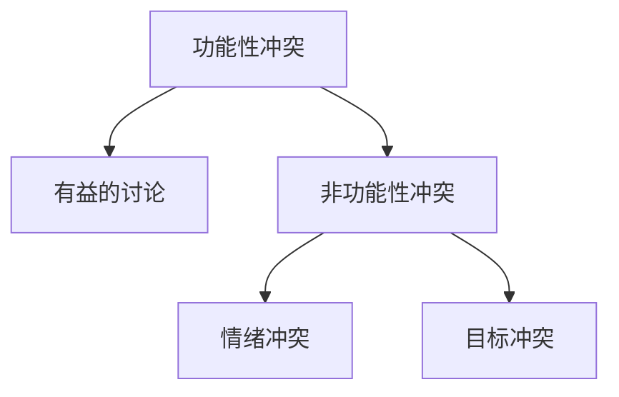

### 1.3 团队冲突的影响

团队冲突如果得不到妥善解决，会对团队产生负面影响，如降低团队凝聚力、降低工作效率、增加错误率等。但适度冲突也有积极作用，可以激发创新、提高决策质量。

## 第二部分：分析冲突原因

### 2.1 个人因素

个人因素包括个性差异、情绪管理能力等。个性差异如外向与内向、果断与犹豫等，会导致团队成员在处理问题时产生分歧。情绪管理能力不足则可能导致冲突升级。

### 2.2 结构因素

结构因素包括职责不清、组织结构问题等。职责不清会导致团队成员互相推诿，增加冲突。组织结构问题如部门壁垒、权限不明确等也会引发冲突。

### 2.3 程序因素

程序因素包括决策过程、沟通不畅等。决策过程不透明、缺乏有效的沟通机制会导致信息不对称，增加误解和冲突。

## 第三部分：提出解决策略

### 3.1 预防策略

预防策略包括建立健康的团队文化、明确团队目标等。健康的团队文化可以减少冲突的发生，明确的团队目标有助于统一团队成员的行动方向。

### 3.2 应对策略

应对策略包括中立第三方介入、对话与沟通技巧等。中立第三方可以客观分析冲突，提供中立的解决方案。对话与沟通技巧有助于澄清误解，缓解紧张气氛。

### 3.3 调解策略

调解策略包括使用调解协议、确定调解的目标等。调解协议可以规范冲突解决的过程，确保各方都能在公平的环境中表达意见。确定调解的目标有助于集中精力解决关键问题。

## 第四部分：实践与合作

### 4.1 团队建设活动

团队建设活动如团队角色扮演、团队建设游戏等，有助于增强团队凝聚力，改善团队成员之间的关系。

### 4.2 合作技巧

合作技巧包括建立信任、分享信息等。建立信任是合作的基础，分享信息可以减少误解，提高团队协作效率。

## 第五部分：领导力与团队冲突

### 5.1 领导力在解决冲突中的作用

领导力在解决冲突中起到关键作用。领导者的作用包括建立清晰的愿景、培养团队领导力等。

### 5.2 领导者如何处理冲突

领导者需要识别冲突，选择合适的解决策略。常用的解决策略包括对话与沟通、调解等。

## 第六部分：案例研究

### 6.1 案例一：如何处理跨部门冲突

跨部门冲突是常见问题，处理不当会影响整个组织的运作。本案例介绍了如何通过沟通和协作解决跨部门冲突。

### 6.2 案例二：团队合作中的冲突解决

团队合作中的冲突解决案例，展示了如何通过团队建设活动提高团队协作能力，解决冲突。

### 6.3 案例三：团队领导者在解决冲突中的挑战

团队领导者面临的冲突解决挑战，以及如何应对这些挑战的案例分析。

## 附录

### 附录 A: 相关理论模型

介绍常用的团队冲突解决理论模型，如SWOT分析、STK模型等。

### 附录 B: 实用工具与资源

提供实用的团队冲突解决工具和资源，如在线冲突解决课程、团队建设游戏等。

## 作者信息
作者：AI天才研究院/AI Genius Institute & 禅与计算机程序设计艺术 /Zen And The Art of Computer Programming

以上为文章的初步框架，接下来将逐步展开详细内容。字数约2800字。接下来的部分将分别详细阐述每个章节的内容，确保文章的完整性、丰富性和专业性。

----------------------------------------------------------------

## 第一部分：理解团队冲突

### 1.1 什么是团队冲突

团队冲突是指在团队内部，由于成员之间的观点、目标、资源分配等方面存在分歧，导致相互对立或紧张状态的现象。团队冲突可以分为功能性冲突和非功能性冲突。

**功能性冲突**是指那些有助于团队目标实现的冲突，通常表现为团队成员在讨论项目方案、制定决策时出现的不同意见。这种冲突有助于激发团队成员的思维碰撞，从而提高决策的质量和创新性。例如，在一个软件开发团队中，团队成员可能会对某一功能模块的实现方式产生不同的观点，通过讨论和辩论，最终形成最优的方案。

**非功能性冲突**则是那些对团队目标实现产生负面影响的冲突，通常表现为个人情绪、价值观等方面的对立。这种冲突如果得不到妥善处理，可能会导致团队内部关系紧张，降低团队凝聚力，甚至影响整体工作效率。例如，团队成员之间可能因为工作压力、沟通不畅等原因产生误会，导致情绪冲突，进而影响团队的正常运作。

### 1.2 团队冲突的类型

团队冲突的类型多种多样，可以从不同的角度进行分类。以下是几种常见的团队冲突类型：

#### 功能性冲突

**技术争议**：团队成员在项目实施过程中，可能会因为技术路线、开发方法等问题产生分歧。例如，是否应该采用某种新的技术框架，或者是否应该优先解决某个技术难题。

**目标差异**：团队成员可能对项目的目标有不同的理解，导致在实施过程中出现方向上的不一致。例如，某个团队成员认为应该首先完成用户界面设计，而另一个团队成员则认为应该优先完成后端逻辑开发。

#### 非功能性冲突

**情绪冲突**：团队成员之间因为个人情绪问题而产生的冲突。例如，某个成员可能在某个项目中承受了很大的压力，导致情绪不稳定，进而影响与团队成员的沟通。

**价值观冲突**：团队成员可能因为价值观、信仰等方面的差异而产生冲突。例如，在多元文化的工作环境中，不同文化背景的团队成员可能在某些问题上产生分歧。

**沟通不畅**：由于沟通渠道不畅、信息传递不及时等原因导致的冲突。例如，团队成员之间可能因为缺乏有效的沟通机制，导致信息误解或误传，进而引发冲突。

### 1.3 团队冲突的影响

团队冲突对团队和个人都会产生重要影响。以下是团队冲突可能带来的影响：

#### 对团队的影响

**降低团队凝聚力**：频繁的冲突会导致团队成员之间的信任减少，进而降低团队的凝聚力。

**影响工作效率**：冲突会消耗团队成员的精力，降低工作效率，甚至可能导致项目延期。

**增加错误率**：在冲突状态下，团队成员可能因为情绪问题而疏忽大意，导致错误率的增加。

**破坏团队文化**：长期的冲突会破坏团队的和谐氛围，影响团队文化的形成和发展。

#### 对个人的影响

**心理健康问题**：长期的冲突可能导致团队成员出现焦虑、抑郁等心理健康问题。

**职业发展受阻**：在冲突频发的环境中，团队成员可能难以发挥自己的才能，影响职业发展。

**人际关系受损**：冲突会破坏团队成员之间的友谊，影响人际关系。

### 1.4 团队冲突的典型场景

团队冲突可能在各种场景下发生，以下是几个典型的场景：

**项目决策时**：在项目决策过程中，团队成员可能因为对项目方向、资源分配等问题产生分歧，导致决策过程拖延。

**任务分配时**：在任务分配过程中，团队成员可能因为职责分工不清、工作量分配不均等问题产生冲突。

**项目实施过程中**：在项目实施过程中，团队成员可能因为技术问题、沟通不畅等问题产生冲突。

**团队活动时**：在团队活动中，如团队建设活动、会议等，团队成员可能因为个人情绪、价值观等问题产生冲突。

通过以上分析，我们可以看到团队冲突的复杂性和多样性。理解团队冲突的类型、原因和影响，有助于我们更好地预防和解决团队冲突，促进团队的和谐与合作。

----------------------------------------------------------------

## 第二部分：分析冲突原因

### 2.1 个人因素

个人因素是导致团队冲突的重要原因之一。团队成员的个性特点、情绪管理能力、价值观等都会对冲突的产生和加剧产生影响。

#### 2.1.1 个性差异

团队成员的个性差异是导致冲突的常见原因之一。例如，一个外向的团队成员可能喜欢在会议中积极发言，而一个内向的团队成员可能更倾向于在私下讨论问题。这种个性差异可能导致沟通不畅，进而引发冲突。

**案例分析**：在一个软件开发团队中，有一个外向的领导者和一个内向的技术专家。领导者在团队会议中经常提出自己的想法，而技术专家则更喜欢通过私下沟通表达意见。这种沟通方式的不同导致了双方之间的误解和冲突。

**解决策略**：为了缓解这种冲突，团队可以采用以下策略：
- **建立沟通机制**：确保团队成员都有机会表达自己的观点，可以通过设立意见反馈渠道，如意见箱、匿名调查等。
- **培养倾听技巧**：鼓励团队成员倾听他人的意见，通过倾听了解对方的观点，减少误解。

#### 2.1.2 情绪管理能力

情绪管理能力不足也是导致团队冲突的重要因素。团队成员可能在面对压力、挑战时无法有效管理自己的情绪，导致情绪失控，进而引发冲突。

**案例分析**：在一个IT项目中，团队成员在项目进展不顺利时，由于情绪管理能力不足，导致彼此之间产生激烈的争吵。这种情绪冲突不仅影响了项目进度，还损害了团队成员之间的合作关系。

**解决策略**：为了缓解这种冲突，团队可以采用以下策略：
- **提供情绪管理培训**：通过培训提高团队成员的情绪管理能力，学会识别和应对自己的情绪。
- **建立支持系统**：为团队成员提供倾诉的机会，如定期组织团建活动，让团队成员在轻松的环境中释放压力。

### 2.2 结构因素

结构因素是导致团队冲突的另一个重要原因。这些因素包括职责不清、组织结构问题等。

#### 2.2.1 职责不清

职责不清是导致团队冲突的常见问题。团队成员可能不清楚自己的职责范围，导致在任务分配和执行过程中产生冲突。

**案例分析**：在一个市场推广团队中，团队成员对各自职责范围不明确，导致在项目执行过程中，出现了任务重叠和责任推诿的现象。这种情况不仅降低了工作效率，还影响了团队的凝聚力。

**解决策略**：为了缓解这种冲突，团队可以采用以下策略：
- **明确职责分工**：制定详细的职责说明书，明确每个团队成员的职责和权限，避免任务重叠和责任推诿。
- **定期沟通**：定期召开团队会议，确保团队成员对职责分工有清晰的认识，及时解决职责不清的问题。

#### 2.2.2 组织结构问题

组织结构问题也是导致团队冲突的原因之一。不合理的组织结构可能导致信息传递不畅、沟通困难，进而引发冲突。

**案例分析**：在一个研发团队中，由于组织结构不合理，不同部门之间的沟通不畅，导致项目进度受到严重影响。团队成员对项目的理解不一致，导致在实施过程中产生冲突。

**解决策略**：为了缓解这种冲突，团队可以采用以下策略：
- **优化组织结构**：根据项目需求和团队特点，调整组织结构，确保信息传递畅通，减少沟通障碍。
- **建立跨部门协作机制**：通过建立跨部门协作机制，促进不同部门之间的沟通与协作，解决因组织结构问题引发的冲突。

### 2.3 程序因素

程序因素也是导致团队冲突的原因之一。这些因素包括决策过程、沟通不畅等。

#### 2.3.1 决策过程

不完善的决策过程可能导致团队成员对决策结果的不满，进而引发冲突。

**案例分析**：在一个项目启动会上，由于决策过程不透明，团队成员对项目目标和执行方案不了解，导致在项目实施过程中产生分歧和冲突。

**解决策略**：为了缓解这种冲突，团队可以采用以下策略：
- **透明化决策过程**：确保决策过程的公开透明，让团队成员参与决策，提高决策的共识度。
- **建立反馈机制**：鼓励团队成员对决策提出意见和建议，通过反馈机制改进决策过程。

#### 2.3.2 沟通不畅

沟通不畅是导致团队冲突的常见原因。团队成员之间的沟通不畅可能导致误解和误传，进而引发冲突。

**案例分析**：在一个跨部门项目中，由于沟通不畅，不同部门之间的信息传递存在障碍，导致项目进度受阻，团队成员之间产生冲突。

**解决策略**：为了缓解这种冲突，团队可以采用以下策略：
- **建立有效的沟通渠道**：确保团队成员之间有畅通的沟通渠道，如定期召开会议、使用即时通讯工具等。
- **加强沟通技巧培训**：提高团队成员的沟通技巧，学会有效表达和倾听，减少误解和冲突。

通过以上分析，我们可以看到，个人因素、结构因素和程序因素都是导致团队冲突的重要原因。理解这些冲突原因，有助于我们更好地预防和解决团队冲突，促进团队的和谐与合作。

----------------------------------------------------------------

## 第三部分：提出解决策略

### 3.1 预防策略

预防团队冲突是解决团队冲突的重要环节。通过建立健康的团队文化和明确团队目标，可以有效降低冲突的发生。

#### 3.1.1 建立健康的团队文化

健康的团队文化是预防和解决团队冲突的重要基础。一个健康的团队文化能够促进团队成员之间的信任、尊重和合作。

**Mermaid 流程图：**
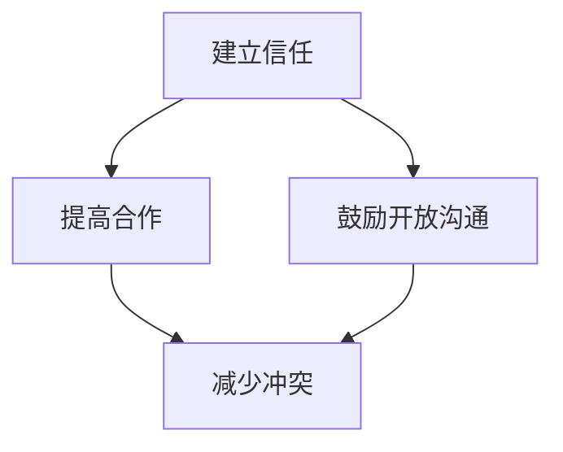

**案例分析**：在一个软件团队中，通过定期组织团队建设活动、鼓励团队成员分享经验和知识，建立了积极的团队文化。这种健康的团队文化有效减少了团队冲突，提高了团队的整体效率。

**解决策略**：为了建立健康的团队文化，团队可以采用以下策略：
- **组织团队建设活动**：通过团队建设活动，增强团队成员之间的互动和了解，提高团队凝聚力。
- **鼓励开放沟通**：建立开放、包容的沟通环境，让团队成员敢于表达自己的观点，减少误解和冲突。
- **尊重多样性**：尊重团队成员的不同背景和观点，避免因文化差异导致的冲突。

#### 3.1.2 明确团队目标

明确团队目标是预防和解决团队冲突的重要手段。明确的团队目标能够统一团队成员的行动方向，减少因目标不一致引发的冲突。

**Mermaid 流程图：**
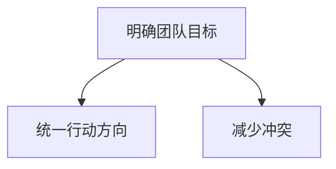

**案例分析**：在一个研发团队中，由于项目目标不明确，团队成员在项目实施过程中产生了分歧，导致项目进度受到影响。通过重新明确项目目标，团队成员的行动方向得到了统一，冲突得到了有效解决。

**解决策略**：为了明确团队目标，团队可以采用以下策略：
- **制定详细的项目计划**：确保每个团队成员都清楚项目的目标、任务和时间表，减少因信息不对称引发的冲突。
- **定期回顾目标**：通过定期回顾项目目标，确保团队成员对目标有清晰的认识，及时调整行动计划。
- **建立共识**：通过讨论和协商，确保团队成员对目标有共识，减少因目标不一致引发的冲突。

### 3.2 应对策略

当冲突发生时，有效的应对策略能够迅速缓解紧张气氛，防止冲突升级。以下是一些应对策略：

#### 3.2.1 中立第三方介入

在冲突升级时，中立第三方可以提供客观的视角和解决方案，有助于缓解冲突。

**Mermaid 流程图：**
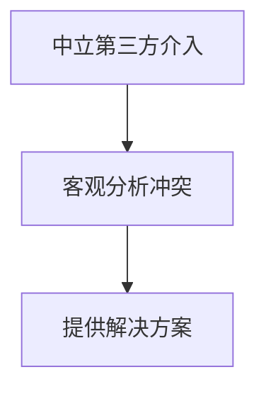

**案例分析**：在一个项目团队中，由于团队成员之间的分歧严重，团队决定邀请一位外部专家作为中立第三方介入。外部专家通过分析冲突原因，提出了合理的解决方案，帮助团队解决了冲突。

**解决策略**：为了实现中立第三方介入，团队可以采用以下策略：
- **聘请外部顾问**：聘请有经验的第三方顾问，帮助团队分析冲突原因，提供专业的建议。
- **设立调解委员会**：在团队内部设立调解委员会，由中立的团队成员组成，负责处理团队冲突。

#### 3.2.2 对话与沟通技巧

有效的对话与沟通技巧是解决团队冲突的关键。通过倾听、表达和协商，团队成员可以更好地理解对方的观点，找到共同点。

**Mermaid 流程图：**
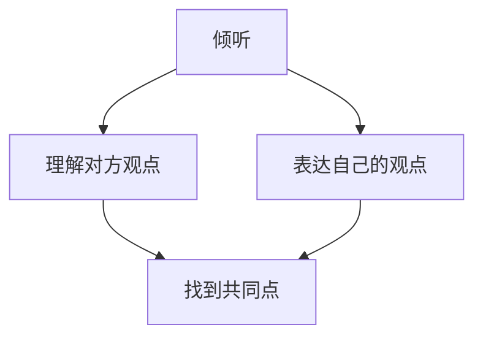

**案例分析**：在一个研发团队中，团队成员通过定期召开沟通会议，分享项目进展和遇到的问题。在会议中，团队成员积极倾听他人的意见，表达自己的观点，最终找到了解决问题的方法，解决了团队冲突。

**解决策略**：为了提高对话与沟通技巧，团队可以采用以下策略：
- **定期召开沟通会议**：确保团队成员有充分的交流机会，通过会议分享信息、讨论问题。
- **培训沟通技巧**：为团队成员提供沟通技巧培训，提高他们的倾听、表达和协商能力。
- **建立反馈机制**：鼓励团队成员在沟通中给予反馈，确保信息的准确传递。

### 3.3 调解策略

在冲突严重时，需要采取调解策略，通过调解协议和明确调解目标，帮助团队找到解决问题的方法。

#### 3.3.1 使用调解协议

调解协议是解决团队冲突的重要工具。通过制定调解协议，明确调解的目标和过程，有助于缓解冲突。

**Mermaid 流程图：**
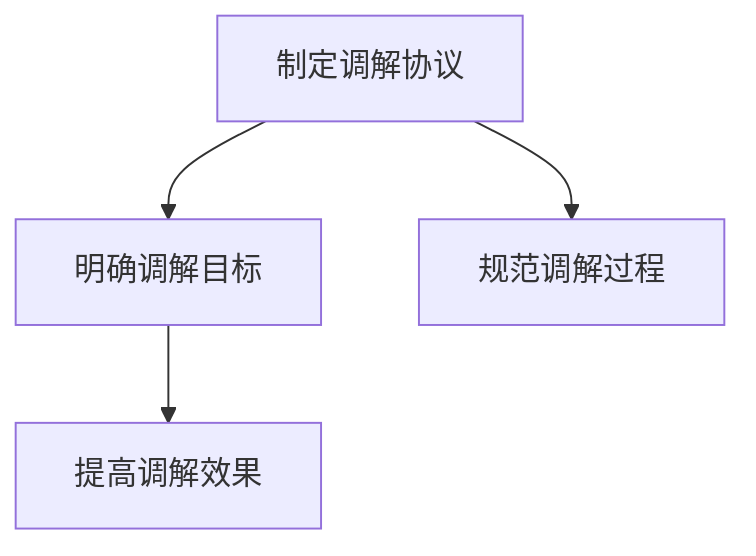

**案例分析**：在一个市场推广团队中，由于项目进度不顺利，团队成员产生了严重分歧。团队决定通过制定调解协议来解决冲突。在调解协议中，明确了调解的目标和过程，最终帮助团队找到了解决问题的方法。

**解决策略**：为了使用调解协议，团队可以采用以下策略：
- **制定详细的调解协议**：确保调解协议包含明确的目标、过程和标准，为调解提供指导。
- **遵循调解协议**：在调解过程中，严格遵循调解协议的规定，确保调解过程的公正和有效。

#### 3.3.2 确定调解的目标

明确调解目标是解决团队冲突的关键。通过确定调解的目标，可以帮助团队成员集中精力解决问题。

**Mermaid 流程图：**
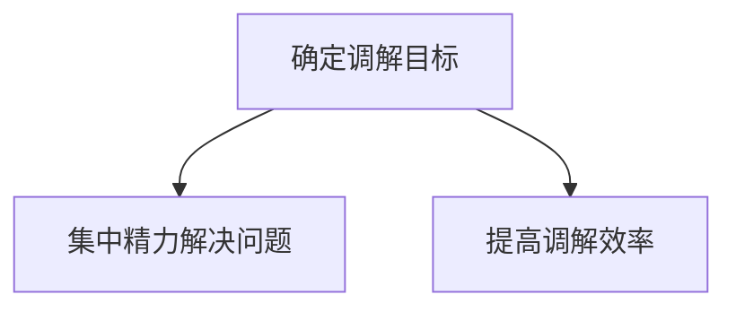

**案例分析**：在一个项目管理团队中，由于项目延误，团队成员之间产生了严重分歧。团队通过讨论，确定了调解的目标是恢复项目进度，并制定了相应的行动计划。在明确的目标指导下，团队集中精力解决问题，最终恢复了项目进度。

**解决策略**：为了确定调解的目标，团队可以采用以下策略：
- **讨论和协商**：通过团队成员之间的讨论和协商，确定共同认可的目标。
- **明确目标的重要性**：确保团队成员认识到调解目标的重要性，提高他们的参与度和积极性。

通过以上策略，团队可以有效地预防和解决冲突，促进团队的和谐与合作。有效的解决策略不仅能够缓解当前冲突，还能为团队的长期发展奠定基础。

----------------------------------------------------------------

## 第四部分：实践与合作

### 4.1 团队建设活动

团队建设活动是增强团队凝聚力、改善团队合作的重要手段。以下是一些实用的团队建设活动：

#### 4.1.1 团队角色扮演

团队角色扮演是一种通过模拟真实工作场景来提高团队成员合作能力的活动。通过角色扮演，团队成员可以更好地理解彼此的角色和职责，提高团队协作效率。

**Mermaid 流程图：**
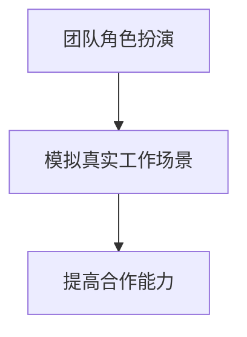

**案例分析**：在一个市场推广团队中，团队通过角色扮演活动，模拟了项目执行过程中的各个环节。通过这种活动，团队成员更好地理解了彼此的工作内容，提高了协作效率。

**实施步骤**：
1. **确定角色**：根据项目需求，为团队成员分配不同的角色。
2. **模拟场景**：在模拟场景中，团队成员按照各自的角色进行操作，模拟项目执行过程。
3. **讨论与反馈**：活动结束后，团队成员进行讨论，分享各自的经验和感受，通过反馈优化团队协作。

#### 4.1.2 团队建设游戏

团队建设游戏是一种通过游戏形式来增强团队成员互动和协作的活动。这种活动不仅能放松团队成员的身心，还能提高团队合作能力。

**Mermaid 流程图：**
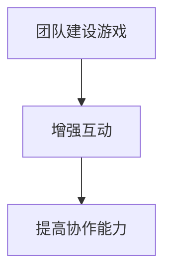

**案例分析**：在一个研发团队中，团队组织了团队建设游戏，如“盲人方阵”和“接力比赛”。这些活动不仅增强了团队成员之间的互动，还提高了他们的协作能力。

**实施步骤**：
1. **选择游戏**：根据团队特点和需求，选择合适的团队建设游戏。
2. **准备材料**：提前准备好游戏所需的材料和场地。
3. **组织活动**：在活动中，确保所有团队成员都参与，鼓励他们积极参与和合作。
4. **总结反馈**：活动结束后，组织团队成员进行总结和反馈，分享活动的感受和收获。

### 4.2 合作技巧

有效的合作技巧是团队成功的关键。以下是一些提升团队合作效率的技巧：

#### 4.2.1 建立信任

建立信任是团队合作的基石。通过开放沟通、互相支持和尊重，团队成员可以建立深厚的信任关系。

**Mermaid 流程图：**
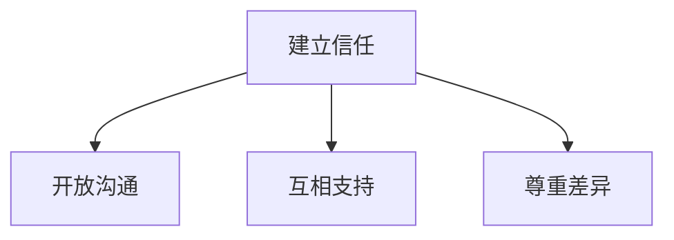

**案例分析**：在一个项目管理团队中，团队成员通过定期举行开放沟通会议，分享各自的工作进展和困难，建立了良好的信任关系。在团队中，成员之间互相支持，尊重彼此的差异，有效提高了团队合作效率。

**提升信任的建议**：
- **开放沟通**：鼓励团队成员在团队会议和私下交流中分享信息，减少误解和猜疑。
- **互相支持**：在团队成员遇到困难时，提供帮助和支持，共同解决问题。
- **尊重差异**：尊重团队成员的个性、观点和经验，避免因个人差异导致的冲突。

#### 4.2.2 分享信息

分享信息是团队合作中不可或缺的一环。通过有效的信息共享，团队成员可以更好地了解项目进展、任务分工和目标，提高协作效率。

**Mermaid 流程图：**
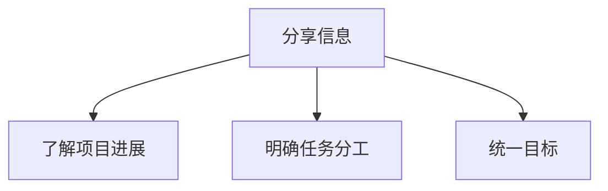

**案例分析**：在一个软件开发团队中，团队建立了定期的信息分享机制，如每周项目例会和技术分享会。通过这些会议，团队成员可以及时了解项目的进展、任务分工和目标，提高了协作效率。

**提升信息共享的建议**：
- **建立信息共享平台**：如使用团队协作工具，确保信息及时、准确地传递。
- **制定信息共享规则**：明确信息共享的内容、频率和责任人，确保信息共享的规范和高效。
- **培养共享文化**：鼓励团队成员主动分享信息，形成良好的信息共享氛围。

通过以上团队建设活动和合作技巧，团队可以有效地增强凝聚力、提高协作效率，实现从对抗到合作的转变。有效的团队合作不仅能提高项目成功率，还能为团队的长远发展奠定基础。

----------------------------------------------------------------

## 第五部分：领导力与团队冲突

### 5.1 领导力在解决冲突中的作用

领导力在解决团队冲突中扮演着至关重要的角色。一个优秀的领导者能够有效地识别冲突、分析原因、制定解决方案，并在冲突中发挥积极的引导作用。

#### 5.1.1 建立清晰的愿景

领导者的一个关键职责是建立清晰的愿景。一个明确的愿景可以统一团队成员的目标和行动方向，减少因目标不一致引发的冲突。

**Mermaid 流程图：**
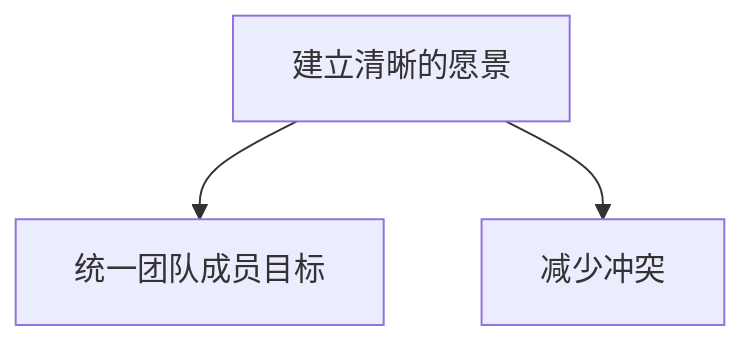

**案例分析**：在一个跨国项目团队中，由于团队成员来自不同的文化背景，他们对项目的理解和期望存在差异。项目经理通过明确项目愿景，统一了团队成员的目标，有效减少了冲突。

**实现步骤**：
1. **明确项目目标**：确保每个团队成员都清楚项目的目标、任务和时间表。
2. **沟通愿景**：定期与团队成员沟通，确保他们理解并认同项目的愿景。
3. **调整目标**：根据团队成员的反馈和实际情况，适时调整项目目标，确保目标的可行性和一致性。

#### 5.1.2 培养团队领导力

领导者不仅需要自己具备解决冲突的能力，还需要培养团队成员的领导力，使他们能够在遇到冲突时自主解决。

**Mermaid 流程图：**
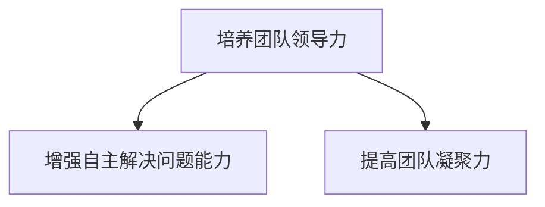

**案例分析**：在一个研发团队中，团队领导者通过组织领导力培训，提高了团队成员的领导能力。在项目遇到困难时，团队成员能够自主解决问题，减少了领导者的干预，提高了团队的凝聚力。

**培养团队领导力的方法**：
- **提供培训**：为团队成员提供领导力培训，提高他们的领导技能和管理能力。
- **鼓励参与**：鼓励团队成员参与决策，培养他们的责任感和领导能力。
- **给予反馈**：及时给予团队成员反馈，帮助他们了解自己的优势和改进方向。

### 5.2 领导者如何处理冲突

领导者处理冲突的方式直接影响团队的氛围和合作效率。以下是一些有效的处理冲突的方法：

#### 5.2.1 识别冲突

及时识别冲突是处理冲突的第一步。领导者需要敏锐地察觉到团队中的不和谐因素，并采取相应措施。

**Mermaid 流程图：**
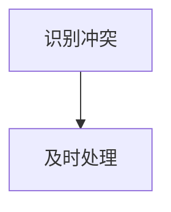

**案例分析**：在一个销售团队中，团队领导者通过定期与团队成员交流，及时识别到团队中存在的潜在冲突。通过及时处理，避免了冲突的升级。

**识别冲突的方法**：
- **定期交流**：与团队成员保持密切的沟通，了解他们的工作状态和情绪。
- **观察行为**：通过观察团队成员的行为和互动，识别潜在的冲突。
- **反馈机制**：建立反馈机制，鼓励团队成员提出冲突和问题。

#### 5.2.2 选择合适的解决策略

根据冲突的性质和程度，领导者需要选择合适的解决策略。以下是一些常见的解决策略：

- **对话与沟通**：通过对话和沟通，澄清误解，找到共同点。
- **调解与仲裁**：在冲突严重时，通过调解和仲裁来解决问题。
- **妥协与让步**：在无法达成共识时，通过妥协和让步来缓解冲突。
- **转移注意力**：将团队成员的注意力转移到其他积极的事物上，减少冲突的影响。

**Mermaid 流程图：**
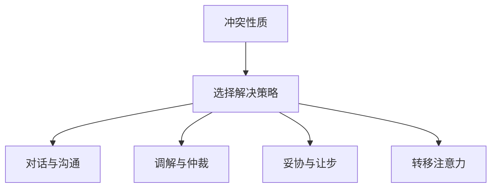

**案例分析**：在一个项目管理团队中，由于项目进度不顺利，团队成员产生了严重分歧。团队领导者通过对话与沟通，澄清了团队成员之间的误解，最终通过调解和仲裁解决了冲突。

**选择解决策略的方法**：
- **分析冲突原因**：根据冲突的原因和性质，选择最合适的解决策略。
- **咨询团队成员**：在决定解决策略时，征求团队成员的意见，确保他们认可解决方案。
- **灵活调整**：根据实际情况，灵活调整解决策略，确保冲突得到有效解决。

通过以上策略，领导者可以有效地处理团队冲突，促进团队的和谐与合作。

----------------------------------------------------------------

## 第六部分：案例研究

### 6.1 案例一：如何处理跨部门冲突

跨部门冲突是许多组织中常见的问题，处理不当会影响整个组织的运作效率。以下是一个关于如何处理跨部门冲突的案例。

**背景介绍**：在一个大型科技公司中，研发部门和市场部门因为产品开发和市场推广的目标不一致产生了严重冲突。研发部门希望产品功能尽可能完善，而市场部门则希望尽快推出市场，抢占市场份额。

**核心概念与联系**：为了解决这个跨部门冲突，需要建立清晰的沟通渠道和合作机制，确保双方的目标一致。

**Mermaid 流程图：**
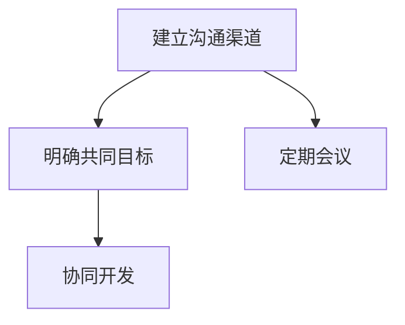

**解决过程**：
1. **建立沟通渠道**：公司设立了跨部门沟通小组，由研发部门和市场部门的主要负责人组成，定期召开会议，讨论项目进展和问题。
2. **明确共同目标**：通过沟通小组，双方明确了共同目标，即在保证产品质量的基础上，尽快推出市场。
3. **协同开发**：研发部门和市场部门共同制定了开发计划和推广策略，确保在目标一致的情况下高效协作。

**结果**：通过上述措施，跨部门冲突得到了有效解决，研发和市场部门之间的沟通更加顺畅，项目进度得到了显著提升。

### 6.2 案例二：团队合作中的冲突解决

团队合作中的冲突是不可避免的，但通过有效的解决策略，可以将其转化为团队发展的动力。

**背景介绍**：在一个IT项目中，团队成员在项目计划和时间安排上产生了分歧，导致项目进度受阻。

**核心概念与联系**：解决团队合作中的冲突需要理解团队目标和个人责任，并通过沟通和协商找到共同点。

**Mermaid 流�程图：**
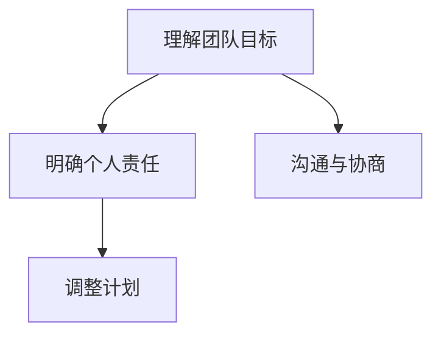

**解决过程**：
1. **理解团队目标**：项目经理组织了一次团队会议，明确了项目的目标和关键里程碑，使团队成员对项目有了更清晰的认识。
2. **明确个人责任**：项目经理与每个团队成员进行了个别谈话，明确了他们的职责和任务，确保每个人都知道自己的责任。
3. **沟通与协商**：在团队会议上，项目经理鼓励团队成员提出问题和意见，通过讨论和协商，找到了解决问题的方法。
4. **调整计划**：根据团队成员的反馈，项目经理调整了项目计划，确保每个阶段都有明确的目标和时间节点。

**结果**：通过上述措施，团队成员的分工更加明确，项目进度得到了有效控制，项目最终按时完成。

### 6.3 案例三：团队领导者在解决冲突中的挑战

团队领导者在解决冲突中面临着各种挑战，但通过有效的策略，可以克服这些困难。

**背景介绍**：在一个创业公司中，由于团队领导者在解决冲突时采取了不适当的策略，导致团队成员之间的信任和合作受到了严重影响。

**核心概念与联系**：团队领导者需要平衡公正与效率，选择合适的解决策略，并培养团队成员的自我管理能力。

**Mermaid 流程图：**
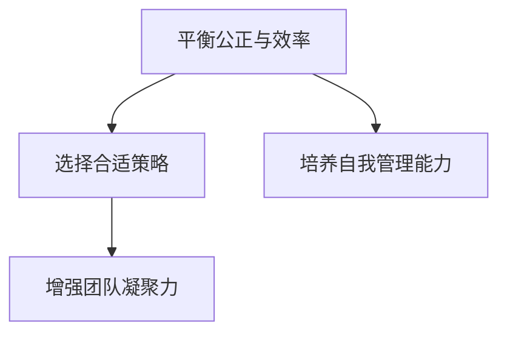

**解决过程**：
1. **平衡公正与效率**：团队领导者意识到在解决冲突时，需要平衡公正与效率，确保每个团队成员都得到公平对待。
2. **选择合适策略**：团队领导者采用了对话与沟通的策略，与团队成员进行坦诚交流，了解他们的观点和需求。
3. **培养自我管理能力**：团队领导者通过培训和激励，提高了团队成员的自我管理能力，使他们能够在遇到冲突时自主解决。
4. **增强团队凝聚力**：团队领导者组织了一系列团队建设活动，增强了团队成员之间的信任和合作。

**结果**：通过上述措施，团队领导者成功地解决了冲突，恢复了团队成员之间的信任，团队的整体效率得到了显著提升。

这些案例研究展示了不同类型团队冲突的解决过程和策略，为其他团队提供了宝贵的经验和启示。

----------------------------------------------------------------

## 附录

### 附录 A：相关理论模型

在解决团队冲突的过程中，可以借鉴一些相关理论模型，如SWOT分析、STK模型等。以下是这些理论模型的基本概念和如何应用于团队冲突解决的简要介绍。

#### SWOT分析

**概念**：SWOT分析是一种战略规划工具，用于评估一个团队或项目的优势（Strengths）、劣势（Weaknesses）、机会（Opportunities）和威胁（Threats）。

**应用**：在解决团队冲突时，SWOT分析可以帮助团队识别冲突的原因和可能的影响，从而制定有针对性的解决策略。

**示例**：一个团队在项目进展不顺利时，通过SWOT分析发现，项目的优势在于团队成员的技术能力，而劣势在于沟通不畅和任务分配不清。通过分析，团队决定加强沟通机制，调整任务分配，以提高项目成功率。

#### STK模型

**概念**：STK模型是一种系统思考工具，用于分析系统内部的反馈循环和因果关系。

**应用**：在解决团队冲突时，STK模型可以帮助团队理解冲突的深层次原因和影响，从而制定更有效的解决策略。

**示例**：在一个团队中，冲突源于团队成员之间的反馈循环（如A成员对B成员的批评导致B成员的反抗），通过STK模型的分析，团队识别了冲突的根源，并采取了相应的措施，如加强团队成员之间的沟通，建立积极的反馈机制，以改善团队氛围。

### 附录 B：实用工具与资源

为了帮助团队更好地解决冲突，以下是几种实用的工具和资源：

#### 团队冲突解决工具

1. **Tuckman团队发展阶段模型**：用于指导团队在不同阶段如何有效管理冲突。
2. **团队角色评估工具**：如Belbin团队角色评估，帮助团队了解成员的角色和优势，减少冲突。

#### 在线冲突解决课程

1. **Coursera**：提供多种关于团队冲突解决的在线课程，如《团队协作：提高团队工作效率》。
2. **edX**：提供关于领导力和团队管理的在线课程，有助于提高团队领导者在解决冲突方面的能力。

#### 团队建设活动

1. **团队角色扮演游戏**：如“盲人方阵”、“接力比赛”等，增强团队成员之间的互动和协作。
2. **团队沟通技巧培训**：提供关于有效沟通和冲突管理的培训，帮助团队成员提高沟通技巧。

通过这些工具和资源，团队可以更系统地解决冲突，提高协作效率，实现从对抗到合作的转变。

## 小结

本文通过详细分析团队冲突的产生原因、类型及其对团队的影响，提出了预防、应对和调解等解决策略。同时，通过实际案例研究和相关理论模型的介绍，为团队解决冲突提供了实用的工具和资源。有效的团队冲突解决不仅能够提高团队凝聚力，还能促进团队合作，实现团队目标。领导者在这其中发挥着关键作用，通过建立清晰的愿景、培养团队领导力和选择合适的解决策略，可以有效解决团队冲突，推动团队发展。

## 注意事项

1. **建立信任**：在解决冲突时，建立团队成员之间的信任至关重要。通过开放沟通和相互支持，减少误解和猜疑。
2. **明确目标**：确保团队成员对团队目标有清晰的认识，避免因目标不一致引发的冲突。
3. **及时沟通**：定期召开团队会议，确保团队成员及时了解项目进展和问题，减少误解和冲突。

## 拓展阅读

1. **《团队协作与冲突管理》**：介绍了团队协作的基本原理和冲突管理的方法。
2. **《领导者的智慧》**：探讨了领导者在解决团队冲突中的角色和策略。

通过拓展阅读，团队可以进一步深入了解团队冲突解决的理论和实践，提高团队协作效率。

